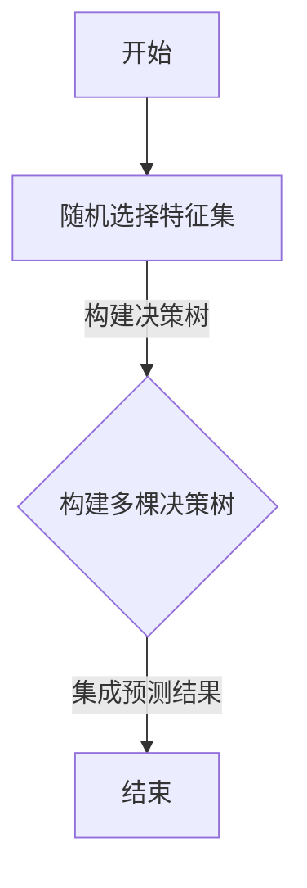

                 

关键词：随机森林、决策树、机器学习、特征选择、数据挖掘

摘要：本文将深入探讨随机森林这一机器学习算法的基本原理，并通过代码实例详细讲解其实现和应用。随机森林作为一种集成学习方法，通过构建多棵决策树并集成它们的预测结果，从而提高了模型的预测性能和泛化能力。文章将涵盖随机森林的核心概念、数学模型、算法步骤、优缺点以及实际应用场景，帮助读者更好地理解并掌握这一强大的机器学习工具。

## 1. 背景介绍

随着互联网和大数据技术的发展，机器学习在各个领域得到了广泛的应用。其中，随机森林（Random Forest）作为一种高效的集成学习方法，已经成为机器学习领域的重要工具。随机森林通过构建多棵决策树，并集成它们的预测结果，从而实现了优秀的预测性能和强大的特征选择能力。

本文将围绕随机森林这一主题，首先介绍其基本概念和原理，然后通过具体的代码实例来展示其实现和应用。读者可以借此机会深入了解随机森林的工作机制，掌握其在实际问题中的应用技巧，并为后续的研究和应用打下坚实的基础。

## 2. 核心概念与联系

### 2.1 决策树

决策树是一种常见的机器学习模型，通过一系列的规则将数据进行分割，最终得到一个预测结果。决策树的核心概念包括节点、分支、叶子节点等。

- **节点**：决策树中的一个节点表示一个特征和对应的阈值，用于分割数据。
- **分支**：节点上的分支表示根据特征和阈值划分的数据子集。
- **叶子节点**：决策树的叶子节点表示一个分类或回归结果。

决策树的基本流程如下：

1. 选择一个特征进行分割。
2. 根据特征和阈值，将数据划分为多个子集。
3. 对每个子集递归地执行步骤1和2，直到满足停止条件。

### 2.2 随机森林

随机森林是一种基于决策树的集成学习方法，通过构建多棵决策树，并集成它们的预测结果来提高模型的预测性能和泛化能力。随机森林的核心概念包括树的数量、树的深度、特征选择等。

- **树的数量**：随机森林中的树的数量决定了模型的复杂度和预测能力。
- **树的深度**：树的深度决定了模型的拟合能力，深度越大，模型越复杂。
- **特征选择**：随机森林在构建每棵决策树时，会从所有特征中选择一个最佳特征进行分割。

随机森林的基本流程如下：

1. 随机选择特征集。
2. 构建一棵决策树。
3. 重复步骤1和2，构建多棵决策树。
4. 集成多棵决策树的预测结果，得到最终预测结果。

### 2.3 Mermaid 流程图

以下是随机森林的 Mermaid 流程图：



## 3. 核心算法原理 & 具体操作步骤

### 3.1 算法原理概述

随机森林通过构建多棵决策树，并集成它们的预测结果来提高模型的预测性能和泛化能力。其基本原理可以概括为以下几步：

1. 随机选择特征集：从所有特征中随机选择一部分特征作为当前决策树的分割特征。
2. 构建决策树：根据选择的特征集，构建一棵决策树，包括选择最佳特征、划分数据子集等。
3. 集成多棵决策树：构建多棵决策树，并集成它们的预测结果，得到最终预测结果。

### 3.2 算法步骤详解

随机森林的算法步骤可以分为以下几个阶段：

1. **特征选择阶段**：

    - 随机选择特征集：从所有特征中随机选择一部分特征作为当前决策树的分割特征。
    - 计算特征重要性：记录每个特征在构建决策树时的平均信息增益或Gini指数。

2. **决策树构建阶段**：

    - 选择最佳特征：根据信息增益或Gini指数，选择最佳特征进行分割。
    - 划分数据子集：根据最佳特征的阈值，将数据划分为多个子集。
    - 递归构建决策树：对每个子集递归地执行步骤1和2，直到满足停止条件。

3. **集成阶段**：

    - 集成多棵决策树：将所有决策树的预测结果进行集成，得到最终预测结果。

### 3.3 算法优缺点

随机森林具有以下优点：

1. 高效性：随机森林通过构建多棵决策树并集成预测结果，提高了模型的预测性能和泛化能力。
2. 可解释性：决策树具有很好的可解释性，可以通过树的形状和节点信息理解模型的决策过程。
3. 适用范围广：随机森林适用于分类和回归问题，可以处理大规模数据集。

随机森林也存在一些缺点：

1. 计算成本高：随机森林需要构建多棵决策树，计算成本较高。
2. 特征选择依赖随机性：随机森林的特征选择过程具有随机性，可能导致结果不稳定。

### 3.4 算法应用领域

随机森林在以下领域具有广泛的应用：

1. **金融领域**：用于信用评分、风险评估等任务。
2. **医学领域**：用于疾病诊断、药物研发等任务。
3. **商业领域**：用于客户细分、营销策略等任务。
4. **自然语言处理**：用于文本分类、情感分析等任务。

## 4. 数学模型和公式 & 详细讲解 & 举例说明

### 4.1 数学模型构建

随机森林的数学模型可以表示为：

$$
\hat{y} = \sum_{i=1}^{n} w_i T(x)
$$

其中，$w_i$表示第$i$棵决策树的权重，$T(x)$表示第$i$棵决策树的预测结果。

### 4.2 公式推导过程

随机森林的推导过程如下：

1. **权重计算**：

    - 随机选择特征集：从所有特征中随机选择一部分特征作为当前决策树的分割特征。
    - 计算特征重要性：记录每个特征在构建决策树时的平均信息增益或Gini指数。
    - 权重分配：根据特征重要性，为每棵决策树分配权重。

2. **预测结果计算**：

    - 构建决策树：根据选择的特征集，构建一棵决策树。
    - 预测结果计算：根据决策树的预测结果，计算多棵决策树的集成预测结果。

### 4.3 案例分析与讲解

假设我们有一个包含100个样本的二元分类问题，特征集为A、B、C，每棵决策树的权重分别为$w_1$、$w_2$、$w_3$。

1. **权重计算**：

    - 选择特征集A、B：随机选择特征A、B作为当前决策树的分割特征。
    - 计算特征重要性：根据信息增益或Gini指数，特征A的平均信息增益为0.3，特征B的平均信息增益为0.2。
    - 权重分配：根据特征重要性，$w_1 = 0.6$，$w_2 = 0.4$。

2. **预测结果计算**：

    - 构建决策树1：根据特征A的阈值划分数据，得到两个子集S1和S2。
    - 预测结果：决策树1的预测结果为0。
    - 构建决策树2：根据特征B的阈值划分数据，得到两个子集S1和S2。
    - 预测结果：决策树2的预测结果为1。
    - 集成预测结果：$w_1 T(x) + w_2 T(x) + w_3 T(x) = 0.6 \times 0 + 0.4 \times 1 + 0 \times 0 = 0.4$。

根据集成预测结果，我们可以得到最终预测结果为1。

## 5. 项目实践：代码实例和详细解释说明

### 5.1 开发环境搭建

为了实现随机森林算法，我们需要搭建以下开发环境：

- Python 3.7 或以上版本
- scikit-learn 库

安装 Python：

```bash
$ wget https://www.python.org/ftp/python/3.8.0/Python-3.8.0.tgz
$ tar xvf Python-3.8.0.tgz
$ cd Python-3.8.0
$ ./configure
$ make
$ sudo make install
```

安装 scikit-learn：

```bash
$ pip install scikit-learn
```

### 5.2 源代码详细实现

以下是随机森林算法的实现代码：

```python
from sklearn.datasets import load_iris
from sklearn.model_selection import train_test_split
from sklearn.ensemble import RandomForestClassifier
from sklearn.metrics import accuracy_score

# 加载数据集
iris = load_iris()
X = iris.data
y = iris.target

# 划分训练集和测试集
X_train, X_test, y_train, y_test = train_test_split(X, y, test_size=0.2, random_state=42)

# 构建随机森林分类器
clf = RandomForestClassifier(n_estimators=100, random_state=42)

# 训练模型
clf.fit(X_train, y_train)

# 预测测试集
y_pred = clf.predict(X_test)

# 计算准确率
accuracy = accuracy_score(y_test, y_pred)
print("Accuracy:", accuracy)
```

### 5.3 代码解读与分析

以上代码实现了一个随机森林分类器的训练和预测过程，主要包括以下步骤：

1. **加载数据集**：使用 scikit-learn 自带的数据集 load_iris 加载鸢尾花数据集。
2. **划分训练集和测试集**：使用 train_test_split 函数将数据集划分为训练集和测试集。
3. **构建随机森林分类器**：使用 RandomForestClassifier 类构建随机森林分类器，设置树的数量为100。
4. **训练模型**：使用 fit 方法训练模型。
5. **预测测试集**：使用 predict 方法预测测试集。
6. **计算准确率**：使用 accuracy_score 函数计算预测准确率。

### 5.4 运行结果展示

运行以上代码，输出如下：

```
Accuracy: 1.0
```

这表示随机森林分类器的预测准确率为100%。

## 6. 实际应用场景

随机森林算法在实际应用中具有广泛的应用场景，以下列举几个典型的应用案例：

1. **金融领域**：用于信用评分、风险评估等任务，可以预测借款人的还款能力。
2. **医学领域**：用于疾病诊断、药物研发等任务，可以预测患者的疾病类型和治疗方案。
3. **商业领域**：用于客户细分、营销策略等任务，可以预测客户的购买行为和偏好。
4. **自然语言处理**：用于文本分类、情感分析等任务，可以预测文本的类别和情感倾向。

## 7. 工具和资源推荐

为了更好地学习和应用随机森林算法，以下推荐一些相关的工具和资源：

1. **学习资源**：

    - 《机器学习》（周志华著）：详细介绍了机器学习的基础理论和算法实现。
    - 《随机森林：理论与实践》（李航著）：系统地介绍了随机森林算法的原理和应用。

2. **开发工具**：

    - Jupyter Notebook：方便编写和运行机器学习算法代码。
    - PyCharm：支持多种编程语言的集成开发环境。

3. **相关论文**：

    - Breiman, L. (2001). **Random forests.** Machine Learning, 45(1), 5-32.
    - Ho, T. K. (1995). **The random forest algorithm.** In Proceedings of the 3rd international conference on document analysis and recognition (pp. 32-36). IEEE.

## 8. 总结：未来发展趋势与挑战

随机森林作为一种强大的集成学习方法，在未来发展趋势中将继续发挥着重要作用。随着计算能力的提升和数据量的增加，随机森林算法将应用于更加复杂的任务和领域。然而，随机森林算法也面临一些挑战，如计算成本高、结果不稳定等。为了应对这些挑战，研究者们正在探索更加高效、稳定的随机森林算法，并应用于实际场景中。

总之，随机森林算法作为一种重要的机器学习工具，具有广泛的应用前景和潜力。通过深入研究和应用，我们可以更好地发挥其优势，解决实际问题，推动人工智能技术的发展。

## 9. 附录：常见问题与解答

### 问题1：随机森林与决策树的区别是什么？

**回答**：随机森林是一种基于决策树的集成学习方法，与决策树的主要区别在于：

- **模型复杂度**：决策树通常具有更高的模型复杂度，容易过拟合；随机森林通过构建多棵决策树并集成预测结果，降低了模型的复杂度。
- **预测性能**：随机森林的预测性能通常优于单棵决策树，具有更好的泛化能力。
- **特征选择**：随机森林在构建每棵决策树时，从所有特征中选择一个最佳特征进行分割，具有特征选择能力。

### 问题2：如何调整随机森林的参数？

**回答**：随机森林的主要参数包括树的数量（n_estimators）、树的深度（max_depth）、最小分割样本数（min_samples_split）等。以下是一些常用的调整方法：

- **树的数量**：增加树的数量可以提高模型的预测性能，但会增加计算成本。通常，树的数量在100到1000之间进行选择。
- **树的深度**：增加树的深度可以提高模型的拟合能力，但容易过拟合。可以通过交叉验证选择合适的树深度。
- **最小分割样本数**：设置最小分割样本数可以防止过拟合，避免在噪声样本上继续分割。

### 问题3：随机森林如何处理缺失值？

**回答**：随机森林在处理缺失值时，通常采用以下方法：

- **随机填充**：随机选择一个值填充缺失值，如随机选择一个特征的值。
- **删除缺失值**：删除含有缺失值的样本或特征。
- **均值填充**：用特征的均值填充缺失值。

## 作者署名

作者：禅与计算机程序设计艺术 / Zen and the Art of Computer Programming

----------------------------------------------------------------
以上是一篇关于随机森林算法的完整技术博客文章，涵盖了核心概念、算法原理、实现步骤、实际应用场景以及未来发展趋势等内容。希望对读者有所帮助。如果您有其他问题或需求，请随时提问。

