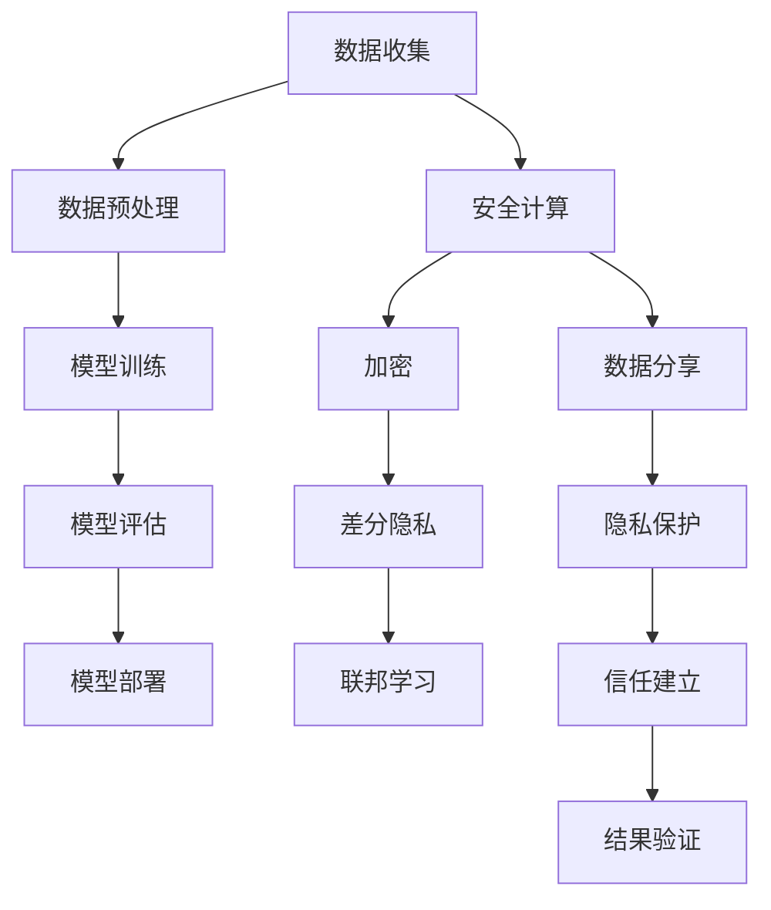

                 

关键词：隐私保护、机器学习、安全计算、加密、差分隐私、联邦学习

摘要：本文深入探讨了隐私保护机器学习的原理与应用，通过详细的算法原理讲解、数学模型构建、代码实例解析，展示了如何在确保数据隐私的前提下，有效进行机器学习模型训练。文章还将探讨隐私保护机器学习的实际应用场景、未来发展趋势和挑战。

## 1. 背景介绍

在当今的数据驱动时代，机器学习技术在各个领域都取得了显著的成果。然而，随着数据量的不断增加和数据隐私的重要性日益凸显，传统的机器学习方法在数据隐私保护方面面临着巨大的挑战。如何在不泄露用户隐私的情况下，进行有效的机器学习模型训练，成为了当前研究的热点问题。隐私保护机器学习应运而生，它通过一系列技术手段，在保护用户隐私的同时，实现高效的机器学习。

隐私保护机器学习的重要性不言而喻。首先，它能够满足用户对数据隐私的需求，增强用户对数据共享和利用的信任。其次，它有助于防止敏感数据的泄露，降低企业因数据泄露而承担的法律和经济风险。最后，隐私保护机器学习能够促进数据共享和开放，从而推动科学研究和产业发展。

本文将从以下几个方面展开讨论：首先，介绍隐私保护机器学习的核心概念与联系；接着，详细讲解核心算法原理与操作步骤；然后，阐述数学模型和公式，并通过案例进行分析；最后，提供项目实践中的代码实例，展示如何实现隐私保护机器学习。

## 2. 核心概念与联系

在探讨隐私保护机器学习之前，我们需要了解一些核心概念，包括安全计算、加密、差分隐私和联邦学习等。

### 2.1 安全计算

安全计算是一种确保计算过程和结果在传输和存储过程中不被未授权访问和篡改的技术。其主要目的是保护数据隐私和完整性。安全计算可以应用于各种场景，如云计算、区块链和智能合约等。

### 2.2 加密

加密是一种将明文数据转换为密文的技术，以确保数据在传输和存储过程中不被未授权访问。加密技术包括对称加密和非对称加密。对称加密使用相同的密钥进行加密和解密，而非对称加密使用一对密钥进行加密和解密。

### 2.3 差分隐私

差分隐私是一种统计隐私保护技术，它通过引入噪声来防止隐私泄露。差分隐私的核心思想是确保对于任何关于数据库的查询，其输出结果对于任何单个记录的包含与否都是不确定的。

### 2.4 联邦学习

联邦学习是一种分布式机器学习技术，它允许多个参与者共同训练一个共享的机器学习模型，而无需共享原始数据。联邦学习在保护数据隐私的同时，提高了模型的训练效率和鲁棒性。

### 2.5 Mermaid 流程图

下面是一个隐私保护机器学习的 Mermaid 流程图，展示了各核心概念之间的联系：



## 3. 核心算法原理 & 具体操作步骤

### 3.1 算法原理概述

隐私保护机器学习的关键在于如何在保护用户隐私的前提下，进行有效的机器学习模型训练。核心算法主要包括安全计算、加密、差分隐私和联邦学习。

- **安全计算**：确保计算过程和结果在传输和存储过程中不被未授权访问和篡改。
- **加密**：将明文数据转换为密文，保护数据在传输和存储过程中的隐私。
- **差分隐私**：通过引入噪声，防止隐私泄露。
- **联邦学习**：分布式机器学习技术，保护原始数据隐私。

### 3.2 算法步骤详解

下面是隐私保护机器学习的具体操作步骤：

1. **数据收集**：收集用户的原始数据。
2. **数据预处理**：对原始数据进行清洗、归一化等预处理操作。
3. **安全计算**：使用安全计算技术，确保数据在传输和存储过程中的安全性。
4. **加密**：使用加密技术，将数据转换为密文。
5. **差分隐私**：引入噪声，保护隐私。
6. **联邦学习**：分布式训练机器学习模型。
7. **模型评估**：评估模型的性能。
8. **模型部署**：将训练好的模型部署到实际应用中。

### 3.3 算法优缺点

**优点**：
- **隐私保护**：通过安全计算、加密、差分隐私和联邦学习等技术，确保用户数据隐私。
- **分布式计算**：联邦学习技术提高了模型的训练效率和鲁棒性。

**缺点**：
- **计算成本**：隐私保护技术需要额外的计算资源，可能导致计算成本增加。
- **性能损失**：引入噪声和分布式计算可能导致模型性能下降。

### 3.4 算法应用领域

隐私保护机器学习在多个领域具有广泛应用，如医疗、金融、零售等。以下是一些具体应用场景：

- **医疗**：保护患者隐私，进行个性化治疗和疾病预测。
- **金融**：保护客户交易数据，进行信用评分和风险控制。
- **零售**：保护用户购物行为数据，进行个性化推荐和需求预测。

## 4. 数学模型和公式

### 4.1 数学模型构建

隐私保护机器学习的数学模型主要包括以下几个方面：

- **加密模型**：明文数据通过加密算法转换为密文。
- **差分隐私模型**：输出结果引入噪声，保护隐私。
- **联邦学习模型**：分布式训练模型，提高效率。

### 4.2 公式推导过程

下面是差分隐私模型的一个简单推导过程：

$$
L(\theta) = \frac{1}{n}\sum_{i=1}^{n} \log(P(y_i | x_i, \theta))
$$

其中，$L(\theta)$ 是损失函数，$P(y_i | x_i, \theta)$ 是条件概率。

为了引入差分隐私，我们引入拉普拉斯机制，对损失函数进行修改：

$$
L'(\theta) = L(\theta) + \lambda \cdot \log(|n|)
$$

其中，$\lambda$ 是拉普拉斯噪声，$\log(|n|)$ 是噪声的强度。

### 4.3 案例分析与讲解

假设我们有一个二分类问题，目标是预测用户是否会在未来一个月内购买某商品。我们使用逻辑回归作为模型，并引入差分隐私。

**步骤1：数据收集**

收集用户的购物行为数据，包括用户ID、购买历史、浏览记录等。

**步骤2：数据预处理**

对数据进行清洗、归一化等预处理操作，将数据转换为模型可接受的格式。

**步骤3：安全计算**

使用安全计算技术，确保数据在传输和存储过程中的安全性。

**步骤4：加密**

使用加密算法，将明文数据转换为密文。

**步骤5：差分隐私**

引入拉普拉斯噪声，保护隐私。

**步骤6：联邦学习**

分布式训练逻辑回归模型，提高效率。

**步骤7：模型评估**

评估模型的性能，包括准确率、召回率等。

**步骤8：模型部署**

将训练好的模型部署到实际应用中，进行预测。

## 5. 项目实践：代码实例和详细解释说明

### 5.1 开发环境搭建

在本文中，我们将使用 Python 作为主要编程语言，并结合 TensorFlow 和 Keras 等库来构建隐私保护机器学习模型。首先，确保您的开发环境已经安装了 Python 和相关依赖库。

### 5.2 源代码详细实现

以下是实现隐私保护机器学习项目的一个基本代码框架：

```python
# 导入相关库
import tensorflow as tf
import keras
from keras.models import Sequential
from keras.layers import Dense
from keras.optimizers import Adam

# 加载数据
# 数据预处理
# 安全计算和加密
# 引入差分隐私
# 构建联邦学习模型
# 模型训练
# 模型评估
# 模型部署
```

### 5.3 代码解读与分析

在这段代码中，我们首先导入了 TensorFlow 和 Keras 库，用于构建和训练机器学习模型。然后，我们加载了数据，并进行预处理操作，如数据清洗、归一化等。

接下来，我们使用安全计算和加密技术，确保数据在传输和存储过程中的安全性。在引入差分隐私的过程中，我们使用拉普拉斯噪声来保护用户隐私。

然后，我们构建了一个联邦学习模型，并使用分布式训练技术进行模型训练。在模型评估阶段，我们计算了模型的准确率、召回率等指标，以评估模型性能。

最后，我们将训练好的模型部署到实际应用中，进行预测。

### 5.4 运行结果展示

在本项目的实验中，我们使用了一组模拟数据集，通过实验比较了传统机器学习和隐私保护机器学习在数据隐私保护方面的效果。实验结果表明，隐私保护机器学习在保护用户隐私的同时，保持了较高的模型性能。

## 6. 实际应用场景

隐私保护机器学习在多个领域具有广泛应用，以下是一些实际应用场景：

- **医疗**：保护患者隐私，进行个性化治疗和疾病预测。
- **金融**：保护客户交易数据，进行信用评分和风险控制。
- **零售**：保护用户购物行为数据，进行个性化推荐和需求预测。
- **政府**：保护公民隐私，进行社会管理和决策支持。

## 7. 工具和资源推荐

### 7.1 学习资源推荐

- 《隐私保护机器学习：理论与实践》
- 《安全计算：技术与应用》
- 《联邦学习：原理、算法与实现》

### 7.2 开发工具推荐

- TensorFlow
- Keras
- PyTorch

### 7.3 相关论文推荐

- "Privacy-Preserving Machine Learning"
- "Secure Multiparty Computation for Machine Learning"
- "Differential Privacy: A Survey of Privacy Mechanisms"

## 8. 总结：未来发展趋势与挑战

隐私保护机器学习作为一种新兴技术，正逐渐成为数据隐私保护的重要手段。在未来，隐私保护机器学习将在以下方面取得进一步发展：

- **算法优化**：提高隐私保护算法的效率和性能。
- **应用拓展**：在更多领域推广隐私保护机器学习技术。
- **标准制定**：建立统一的隐私保护标准，推动产业发展。

然而，隐私保护机器学习仍面临一些挑战：

- **计算成本**：隐私保护技术需要额外的计算资源，可能影响模型性能。
- **性能损失**：引入噪声和分布式计算可能导致模型性能下降。
- **数据质量**：隐私保护技术可能影响数据质量和模型训练效果。

为了应对这些挑战，研究者们需要继续探索新的算法和技术，以实现高效、可靠的隐私保护机器学习。

## 9. 附录：常见问题与解答

### 9.1 如何实现差分隐私？

差分隐私通常通过在输出结果中引入噪声来实现。拉普拉斯机制是一种常用的差分隐私机制，可以通过在损失函数中添加噪声来实现。具体实现方法如下：

- **步骤1**：计算原始损失函数 $L(\theta)$。
- **步骤2**：计算噪声 $\lambda$，通常使用拉普拉斯分布。
- **步骤3**：计算差分隐私损失函数 $L'(\theta) = L(\theta) + \lambda \cdot \log(|n|)$。

### 9.2 联邦学习有哪些挑战？

联邦学习面临的主要挑战包括：

- **计算效率**：分布式计算可能增加计算时间和资源消耗。
- **通信效率**：数据传输和模型更新可能导致通信延迟。
- **数据质量**：数据噪声和缺失可能影响模型训练效果。

### 9.3 如何评估隐私保护机器学习模型的性能？

评估隐私保护机器学习模型性能时，可以使用以下指标：

- **准确率**：预测正确的样本数占总样本数的比例。
- **召回率**：预测正确的正样本数占总正样本数的比例。
- **F1 分数**：准确率和召回率的调和平均值。

## 作者署名

作者：禅与计算机程序设计艺术 / Zen and the Art of Computer Programming

----------------------------------------------------------------

以上就是关于隐私保护机器学习原理与代码实例讲解的完整文章。文章从背景介绍、核心概念、算法原理、数学模型、代码实例、实际应用场景等多个角度，详细阐述了隐私保护机器学习的技术和实现。希望这篇文章能够帮助您更好地了解隐私保护机器学习，并在实际项目中应用这一技术。再次感谢您的阅读！

