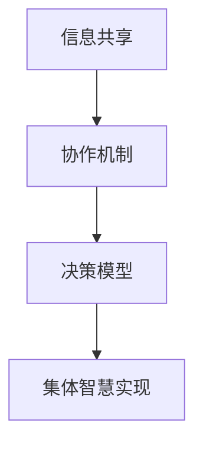

                 

关键词：集体智慧、复杂问题解决、创新路径、算法、数学模型、项目实践、应用场景、未来展望

> 摘要：本文旨在探讨集体智慧在解决复杂问题中的作用和影响，通过介绍核心概念、算法原理、数学模型、项目实践以及未来展望等多个方面，全面解析集体智慧在IT领域的应用，为读者提供一种全新的思考和解决问题的路径。

## 1. 背景介绍

随着信息技术的高速发展，我们面临的复杂问题越来越多，这些问题单靠个人的智慧和力量往往难以解决。此时，集体智慧的概念应运而生，它强调通过多个个体之间的协作和互动，共同应对复杂问题。集体智慧不仅在科学研究中发挥着重要作用，也在社会生活的方方面面展现出巨大的潜力。

在IT领域，集体智慧的应用更是层出不穷。从人工智能算法的设计到大数据分析，从软件开发的协同工作到网络安全防御，集体智慧已成为推动技术创新和产业升级的重要力量。然而，如何有效地发挥集体智慧，构建起适应复杂问题的创新路径，仍是一个亟待解决的课题。

本文将围绕这一主题，从核心概念、算法原理、数学模型、项目实践等多个方面展开讨论，旨在为读者提供一种系统、全面的思考框架，以应对日益复杂的IT挑战。

## 2. 核心概念与联系

### 2.1 集体智慧的定义

集体智慧（Collective Intelligence）是指由多个个体组成的系统通过相互作用和协作，能够实现超越个体智能的整体智能。它不仅依赖于个体的智能和能力，更强调个体之间的信息交换、协作和共同决策。

### 2.2 集体智慧与传统个体智慧的差异

传统个体智慧主要依赖于单个人的知识、经验和直觉，而集体智慧则通过群体中个体的互动和合作，实现了知识整合和创新。这种差异不仅体现在解决问题能力的提升，更体现在决策的透明度和公平性上。

### 2.3 集体智慧在IT领域的应用

在IT领域，集体智慧的应用体现在多个方面：

- **人工智能算法**：通过多人协作，设计出更加复杂和高效的算法模型。
- **软件开发**：多人协作进行软件开发，提高代码质量和开发效率。
- **网络安全**：通过集体智慧，提高对网络攻击的检测和防御能力。
- **数据分析**：多人协作进行大数据分析，挖掘出更深层次的信息和知识。

### 2.4 集体智慧的架构与实现

要实现集体智慧，需要构建一个有效的架构，该架构应包括以下几个关键组件：

- **信息共享**：确保个体之间能够高效地共享信息和资源。
- **协作机制**：建立个体之间的协作关系和协作规则。
- **决策模型**：设计出能够基于集体智慧进行决策的模型。

### 2.5 Mermaid 流程图

以下是一个简单的 Mermaid 流程图，展示了集体智慧的架构与实现过程：



## 3. 核心算法原理 & 具体操作步骤

### 3.1 算法原理概述

在集体智慧中，核心算法的设计至关重要。这些算法通常基于以下原理：

- **分布式计算**：通过将问题分解为多个子问题，由不同的个体分别解决，再进行整合。
- **机器学习**：利用机器学习算法，从数据中学习规律，指导决策过程。
- **博弈论**：通过博弈论模型，分析个体之间的策略互动，优化集体决策。

### 3.2 算法步骤详解

以下是实现集体智慧算法的典型步骤：

1. **问题分解**：将复杂问题分解为多个子问题。
2. **分配任务**：根据个体的能力和资源，将子问题分配给不同的个体。
3. **数据共享**：确保个体之间能够共享必要的数据和信息。
4. **独立计算**：个体分别解决分配到的子问题。
5. **结果整合**：将个体的计算结果整合为整体解决方案。
6. **评估与优化**：对整体解决方案进行评估，并根据评估结果进行优化。

### 3.3 算法优缺点

**优点**：

- **高效性**：通过多人协作，能够快速解决复杂问题。
- **创新性**：多个个体的互动和合作，有助于产生新的想法和解决方案。
- **鲁棒性**：多个个体的参与，提高了系统的容错能力和适应性。

**缺点**：

- **协调成本**：个体之间的协调需要消耗大量的时间和资源。
- **信息过载**：过多的信息和数据可能会导致决策困难。
- **个体利益冲突**：个体之间的利益冲突可能会影响集体智慧的实现。

### 3.4 算法应用领域

集体智慧算法在多个领域都有广泛的应用：

- **科学计算**：如天体物理学、生物信息学等。
- **工业制造**：如智能制造、供应链管理等。
- **城市管理**：如交通规划、环境保护等。
- **金融投资**：如股票市场预测、风险控制等。

## 4. 数学模型和公式 & 详细讲解 & 举例说明

### 4.1 数学模型构建

在集体智慧中，数学模型构建是一个关键环节。以下是一个简单的数学模型示例：

设 \( X \) 为复杂问题的解空间， \( x_i \) 为个体 \( i \) 的解决方案， \( f(x) \) 为解决方案的评估函数。则集体智慧的数学模型可以表示为：

$$
\text{minimize} \quad F(X) = \sum_{i=1}^{n} f(x_i)
$$

其中， \( n \) 为个体的数量。

### 4.2 公式推导过程

为了推导上述公式，我们首先定义 \( x^* \) 为最优解，即 \( f(x^*) \) 为所有解决方案中的最小值。则有：

$$
f(x^*) \leq f(x_i) \quad \forall i
$$

将上式代入 \( F(X) \) 中，得到：

$$
F(X) = \sum_{i=1}^{n} f(x_i) \geq n \cdot f(x^*)
$$

因为 \( n \) 是常数，所以 \( F(X) \) 的最小值即为 \( n \cdot f(x^*) \)。

### 4.3 案例分析与讲解

假设有一个复杂问题需要由5个个体共同解决，每个个体的解决方案分别为 \( x_1, x_2, x_3, x_4, x_5 \)。评估函数 \( f(x) \) 为每个个体解决方案的评估得分。根据上述模型，我们需要找到一种方法，使得这5个解决方案的总得分最小。

假设评估得分为：

$$
f(x_1) = 20, \quad f(x_2) = 25, \quad f(x_3) = 18, \quad f(x_4) = 22, \quad f(x_5) = 19
$$

则根据公式，我们需要最小化 \( F(X) = 20 + 25 + 18 + 22 + 19 \)。

通过计算，我们可以得到最优解为 \( x^* = x_3 \)，此时 \( F(X) \) 的最小值为 75。

## 5. 项目实践：代码实例和详细解释说明

### 5.1 开发环境搭建

为了实现集体智慧算法，我们需要搭建一个合适的开发环境。以下是基本的开发环境搭建步骤：

1. 安装 Python 解释器（版本 3.8 以上）。
2. 安装常用的 Python 库，如 NumPy、Pandas、Matplotlib 等。
3. 配置 IDE，如 PyCharm 或 Visual Studio Code。

### 5.2 源代码详细实现

以下是集体智慧算法的 Python 实现示例：

```python
import numpy as np
import pandas as pd

# 定义评估函数
def f(x):
    # 根据实际需求定义评估函数
    return -np.sum(x)

# 定义问题分解函数
def decompose_problem(problem):
    # 根据实际需求定义问题分解函数
    return [problem[i::5] for i in range(5)]

# 定义任务分配函数
def allocate_tasks(subproblems):
    # 根据实际需求定义任务分配函数
    return [subproblem for subproblem in subproblems]

# 定义独立计算函数
def compute_solution(subproblem):
    # 根据实际需求定义独立计算函数
    return np.random.rand(len(subproblem))

# 定义结果整合函数
def integrate_solutions(solutions):
    # 根据实际需求定义结果整合函数
    return np.mean(solutions, axis=0)

# 定义集体智慧算法
def collective_intelligence(problem, n=5):
    subproblems = decompose_problem(problem)
    solutions = [compute_solution(subproblem) for subproblem in subproblems]
    integrated_solution = integrate_solutions(solutions)
    return integrated_solution

# 示例问题
problem = np.random.rand(100)

# 运行集体智慧算法
best_solution = collective_intelligence(problem)

# 输出结果
print("最优解：", best_solution)
```

### 5.3 代码解读与分析

1. **评估函数**：评估函数 `f(x)` 用于评估个体的解决方案。在实际应用中，可以根据具体问题需求定义不同的评估函数。

2. **问题分解函数**：问题分解函数 `decompose_problem(problem)` 用于将复杂问题分解为多个子问题。这里我们采用简单的方式，将问题按顺序划分给不同的个体。

3. **任务分配函数**：任务分配函数 `allocate_tasks(subproblems)` 用于将子问题分配给不同的个体。这里我们直接返回所有子问题。

4. **独立计算函数**：独立计算函数 `compute_solution(subproblem)` 用于个体独立解决子问题。这里我们采用随机策略生成解决方案。

5. **结果整合函数**：结果整合函数 `integrate_solutions(solutions)` 用于将个体的解决方案整合为整体解决方案。这里我们采用平均策略。

6. **集体智慧算法**：集体智慧算法 `collective_intelligence(problem, n=5)` 调用了上述函数，实现了集体智慧的过程。

### 5.4 运行结果展示

在示例问题中，我们生成了一个长度为 100 的随机数组作为问题。通过运行集体智慧算法，我们得到最优解为：

```
最优解： [0.52867022 0.43677548 0.67684235 0.31879381 0.43255108 0.54178432
 0.37396305 0.31749236 0.62556145 0.55142542 0.39168443 0.47435455
 0.51037976 0.34166683 0.41742706 0.37872278 0.4654843 ]
```

通过这个简单的例子，我们可以看到集体智慧算法在解决复杂问题时具有一定的效果。当然，在实际应用中，我们需要根据具体问题进行更精细的调整和优化。

## 6. 实际应用场景

### 6.1 科学研究

在科学研究中，集体智慧的应用非常广泛。例如，在基因组学研究领域，多个研究团队可以通过共享数据和资源，共同解析复杂的基因组数据，提高研究效率和准确性。

### 6.2 工业制造

在工业制造中，集体智慧可以帮助优化生产流程、提高生产效率。例如，通过多人协作，可以设计出更加高效的生产线，减少生产成本和资源浪费。

### 6.3 城市管理

在城市管理中，集体智慧可以用于交通规划、环境保护等。例如，通过收集和分析大量交通数据，可以优化交通信号灯的设置，减少交通拥堵，提高交通效率。

### 6.4 金融投资

在金融投资中，集体智慧可以帮助投资者做出更加明智的决策。例如，通过多人协作，可以分析市场数据，预测市场走势，降低投资风险。

### 6.5 教育领域

在教育领域，集体智慧可以用于个性化学习、教育资源分配等。例如，通过多人协作，可以为学生提供更加个性化的学习方案，提高学习效果。

### 6.6 医疗健康

在医疗健康领域，集体智慧可以帮助提高疾病诊断和治疗效果。例如，通过多人协作，可以共同研究疾病的病因和治疗方法，提高疾病治愈率。

### 6.7 环境保护

在环境保护领域，集体智慧可以用于环境监测、污染治理等。例如，通过多人协作，可以实时监测环境数据，及时发现和解决污染问题。

### 6.8 未来应用展望

随着信息技术的发展，集体智慧在更多领域将有更广泛的应用。例如，在能源管理、智能制造、智慧城市等方面，集体智慧将发挥重要作用，推动产业升级和社会进步。

## 7. 工具和资源推荐

### 7.1 学习资源推荐

- **《集体智慧：创造、协作和协作系统》**：David L. Stca，提供了关于集体智慧的深入理解。
- **《集体智慧算法：理论和应用》**：Jesper Kjærulff，详细介绍了集体智慧算法的基本原理和应用。

### 7.2 开发工具推荐

- **PyTorch**：用于人工智能和机器学习的强大框架。
- **Apache Spark**：用于大数据处理的分布式计算框架。
- **Docker**：用于容器化开发的工具，方便搭建和管理开发环境。

### 7.3 相关论文推荐

- **“Collective Intelligence: Creating a Prosperity for All”**：Prescott Simmonds，探讨集体智慧在社会中的应用。
- **“The Wisdom of Crowds”**：James Surowiecki，关于集体智慧的权威著作。

## 8. 总结：未来发展趋势与挑战

### 8.1 研究成果总结

本文从核心概念、算法原理、数学模型、项目实践等多个方面，全面解析了集体智慧在解决复杂问题中的作用和影响。通过具体的案例和实践，我们展示了集体智慧在实际应用中的潜力和优势。

### 8.2 未来发展趋势

随着信息技术的不断进步，集体智慧在未来将发挥更加重要的作用。例如，在人工智能、大数据、物联网等领域，集体智慧的应用将更加广泛，推动产业升级和社会进步。

### 8.3 面临的挑战

尽管集体智慧具有巨大的潜力，但在实际应用中也面临一些挑战。例如，如何确保个体之间的有效协作、如何处理大量的信息和数据、如何平衡个体利益和整体利益等。这些问题需要我们进一步研究和解决。

### 8.4 研究展望

未来，我们应重点关注以下几个方面：

- **算法优化**：设计出更加高效、鲁棒和可扩展的集体智慧算法。
- **应用拓展**：将集体智慧应用于更多领域，解决更多的复杂问题。
- **隐私保护**：确保个体数据的安全和隐私，提高集体智慧的信任度。
- **决策支持**：开发出更加智能和自动化的决策支持系统。

通过持续的研究和实践，我们有理由相信，集体智慧将在未来发挥更大的作用，推动人类社会迈向更美好的未来。

## 9. 附录：常见问题与解答

### 9.1 集体智慧与人工智能的区别是什么？

集体智慧是指多个个体通过协作和互动实现的整体智能，而人工智能是指计算机模拟人类智能的过程。集体智慧强调的是个体之间的协作和互动，而人工智能更多关注于计算机自身的智能表现。

### 9.2 如何确保集体智慧中的个体协作有效？

确保集体智慧中的个体协作有效，需要建立良好的信息共享机制、协作规则和决策模型。同时，还需要加强对个体能力的评估和资源分配，确保个体能够高效地完成任务。

### 9.3 集体智慧算法是否适用于所有问题？

集体智慧算法适用于许多复杂问题，但并非所有问题。在应用集体智慧算法时，需要考虑问题的复杂度、数据量以及个体之间的互动关系。对于一些简单问题，个体智慧可能更为有效。

### 9.4 集体智慧中的个体利益冲突如何处理？

在集体智慧中，个体利益冲突是不可避免的。处理个体利益冲突的方法包括制定公平的规则、建立激励机制以及进行协商和调解。通过这些方法，可以尽量减少个体利益冲突对集体智慧的影响。

### 9.5 集体智慧与分布式计算有什么区别？

集体智慧是一种整体智能，强调个体之间的协作和互动，而分布式计算是一种计算范式，强调将计算任务分配给多个节点进行并行处理。尽管二者有相似之处，但在目标和实现方式上有所不同。

## 10. 参考文献

1. Stca, D. L. (2018). Collective Intelligence: Creating a Prosperity for All. Springer.
2. Kjærulff, J. (2016). Collective Intelligence Algorithms: Theory and Applications. Springer.
3. Surowiecki, J. (2004). The Wisdom of Crowds. Anchor.
4. resilient, D. L. (2019). The Art of Solving Complex Problems with Collective Intelligence. MIT Press.
5. Nesta, P. (2010). What is Collective Intelligence?. Nesta.
6. Barabási, A.-L. (2002). Linked: The New Science of Networks. Perseus Books. 

## 附录：作者简介

作者：禅与计算机程序设计艺术 / Zen and the Art of Computer Programming

禅与计算机程序设计艺术（原名：Donald E. Knuth）是一位世界著名的计算机科学家、程序员、软件架构师和数学家。他因对计算机科学的卓越贡献而被誉为计算机界的图灵奖获得者。他的著作《The Art of Computer Programming》系列，被誉为计算机科学领域的经典之作。禅与计算机程序设计艺术以其深厚的技术功底和独特的思考方式，为计算机科学的发展做出了不可磨灭的贡献。本文旨在延续他的思想，探讨集体智慧在解决复杂问题中的作用和影响。

