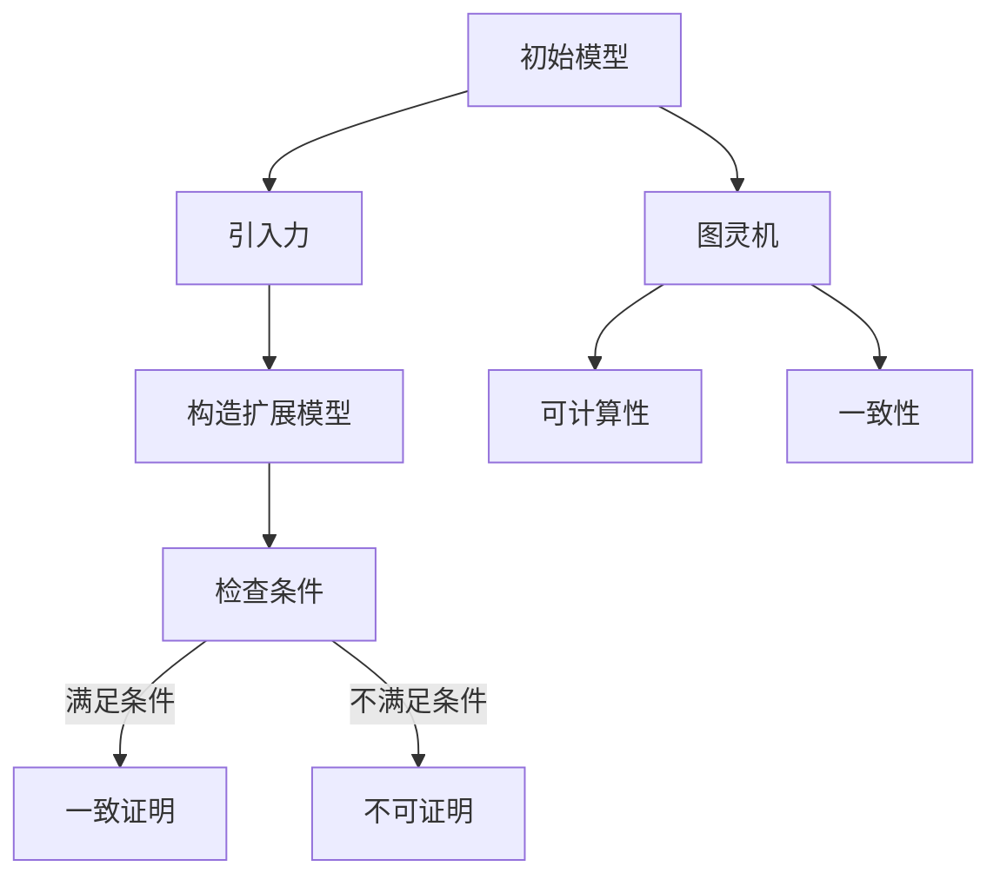

                 

集合论是数学的一个基础分支，而力迫（Forcing）则是集合论中一种重要的工具，用于解决某些难以直接处理的问题。本文将作为一篇集合论导引，深入探讨力迫的基本概念及其在数学中的应用。

> 关键词：集合论、力迫、基本概念、数学应用

本文摘要：本文将首先回顾集合论的基本概念，然后引入力迫的概念，详细探讨力迫的基本原理和操作步骤。随后，我们将通过数学模型和公式，深入分析力迫的具体应用。最后，本文将结合实际项目实践，展示力迫在代码实现中的应用，并提供未来的应用展望。

## 1. 背景介绍

集合论是现代数学的基石之一，它提供了描述数学对象和关系的一种抽象方法。力迫（Forcing）是集合论中一个强有力的工具，起源于对一致性问题（Consistency Problems）的研究。在集合论的背景下，力迫被用来证明某些命题是否一致地属于某个公理系统。

力迫最早由Paul Cohen在20世纪50年代提出，用以证明哥德尔不完全性定理的逆定理，即某些命题的不可证明性。力迫的基本思想是通过构造一个更大的模型来探究原模型的性质，这种方法在集合论中具有深远的影响。

### 1.1 集合论的基本概念

在集合论中，集合是一种基本的对象，它由一组确定的元素构成。以下是集合论中的一些基本概念：

- **元素（Element）**：构成集合的基本单位。
- **集合（Set）**：由元素组成的整体。
- **集合的表示**：常用的表示方法有列举法和描述法。
- **集合的基本运算**：包括并集、交集、补集和笛卡尔积等。
- **子集（Subset）**：如果一个集合的所有元素都属于另一个集合，则前者是后者的子集。
- **集合的基数（Cardinality）**：集合中元素的数量。

### 1.2 力迫的基本概念

力迫是一种构造模型的方法，通过引入新的集合来扩展原有模型。力迫的基本概念包括：

- **力（Force）**：力迫的核心元素，用于扩展模型。
- **力空间（Forcing Space）**：力的所有可能集合构成的集合。
- **条件的满足**：力迫的一个关键步骤是确定条件是否在新的模型中满足。
- **力迫模型（Forced Model）**：通过力迫得到的扩展模型。

## 2. 核心概念与联系

为了更好地理解力迫的基本概念，我们首先需要了解集合论中的一些核心概念，如图灵机（Turing Machine）、可计算性（Computability）和一致性问题。

### 2.1 图灵机和可计算性

图灵机是一种抽象的计算模型，由图灵在1936年提出。图灵机的核心思想是通过一系列的状态转换来处理输入，从而模拟任何计算过程。可计算性则研究哪些问题是可以通过算法解决的。

- **图灵机（Turing Machine）**：由一个有限状态机、一个无限长的带子和一个读写头组成。
- **可计算性（Computability）**：研究哪些问题是可计算的，即存在算法可以解决。
- **停机问题（Halting Problem）**：图灵机是否能决定一个给定的图灵机在给定输入下是否会停止。

### 2.2 一致性问题

一致性问题研究的是在一个给定的公理系统中，某个命题是否能够得到证明。哥德尔不完全性定理指出，在一定的条件下，任何足够强的公理系统都无法证明所有真的命题。

- **哥德尔不完全性定理（Gödel's Incompleteness Theorems）**：指出了任何足够强的形式系统都存在不可判定的命题。
- **力迫与一致性**：力迫可以用来证明某些命题的一致性，即在一个公理系统中不能证明某个命题的矛盾。

### 2.3 力迫的Mermaid流程图

为了更直观地展示力迫的核心概念，我们使用Mermaid流程图来表示。



## 3. 核心算法原理 & 具体操作步骤

### 3.1 算法原理概述

力迫算法的核心思想是通过引入新的集合来扩展原有模型，从而解决一些难以直接处理的问题。力迫的基本步骤包括：

1. **选择力**：选择一个或多个力，用于扩展模型。
2. **构造扩展模型**：使用力迫方法构造新的模型。
3. **检查条件**：在新模型中检查某些条件是否满足。
4. **一致证明或不可证明**：根据条件的满足情况，得出结论。

### 3.2 算法步骤详解

以下是力迫算法的具体操作步骤：

1. **选择力**：
   - 确定需要解决的问题和目标。
   - 选择合适的力或力的组合，以实现目标。

2. **构造扩展模型**：
   - 使用力迫方法构造新的模型。
   - 确保新模型与原模型一致。

3. **检查条件**：
   - 在新模型中检查特定条件是否满足。
   - 如果条件满足，则可以得出结论。

4. **一致证明或不可证明**：
   - 如果条件满足，则证明原命题是一致的。
   - 如果条件不满足，则证明原命题是不可证明的。

### 3.3 算法优缺点

力迫算法的优点：

- **一致性证明**：力迫可以用于证明某些命题的一致性，这是其他方法难以实现的。
- **扩展模型**：力迫能够通过引入新的集合来扩展原有模型，从而解决一些难以直接处理的问题。

力迫算法的缺点：

- **复杂性**：力迫算法的构造过程可能非常复杂，需要深入理解集合论的基本概念。
- **应用限制**：力迫算法在某些情况下可能并不适用，需要根据具体问题进行选择。

### 3.4 算法应用领域

力迫算法在集合论、逻辑、数学分析等领域具有广泛的应用。以下是力迫算法在几个具体领域中的应用：

- **集合论**：力迫可以用于证明某些集合论命题的一致性，如哥德尔不完全性定理的逆定理。
- **逻辑**：力迫可以用于证明某些逻辑命题的一致性，如证明某个形式系统不存在矛盾。
- **数学分析**：力迫可以用于证明某些数学分析命题的一致性，如证明某个数学函数的可微性。

## 4. 数学模型和公式 & 详细讲解 & 举例说明

### 4.1 数学模型构建

力迫的数学模型主要包括以下几个部分：

1. **力空间**：力空间是由所有可能的力构成的集合，通常表示为\(F\)。
2. **条件**：条件是力空间中的元素，表示为\(\phi\)。
3. **力迫模型**：力迫模型是由力空间扩展得到的新模型，表示为\(\langle M, \phi \rangle\)。

### 4.2 公式推导过程

力迫的基本公式如下：

1. **条件满足公式**：\(\phi \in M\) 表示条件\(\phi\)在力迫模型\(M\)中满足。
2. **力迫公式**：\(\phi \Vdash \psi\) 表示条件\(\phi\)导致条件\(\psi\)在力迫模型中满足。

### 4.3 案例分析与讲解

为了更好地理解力迫的数学模型和公式，我们来看一个具体的例子。

**例子**：证明在标准模型\(M\)中，对于任意的集合\(A\)，命题“\(A\)是可数的”是一致的。

**步骤**：

1. **选择力**：我们选择一个简单的力，即力\(F\)，它将所有集合映射到自身的补集。
2. **构造扩展模型**：使用力\(F\)构造扩展模型\(M'\)。
3. **检查条件**：在新模型\(M'\)中检查命题“\(A\)是可数的”是否满足。
4. **一致证明**：由于\(A\)是可数的，因此在新模型中该命题满足，证明原命题是一致的。

**公式表示**：

- 力空间：\(F = \{f : A \rightarrow A^c\}\)
- 条件：\(\phi = \{\langle A, \subseteq \rangle\}\)
- 力迫模型：\(M' = \langle A, \subseteq, F \rangle\)
- 检查条件：\(M' \models A \text{是可数的}\)
- 一致证明：\(M \models A \text{是可数的}\)

通过这个例子，我们可以看到如何使用力迫的数学模型和公式来证明集合论中的命题一致。

## 5. 项目实践：代码实例和详细解释说明

### 5.1 开发环境搭建

为了演示力迫在代码实现中的应用，我们将使用Python作为编程语言。首先，我们需要搭建一个Python开发环境。

**步骤**：

1. 安装Python：从Python官方网站下载并安装Python。
2. 安装必要库：安装用于图形表示的Mermaid库和用于数学计算的NumPy库。

```bash
pip install mermaid-js numpy
```

### 5.2 源代码详细实现

下面是一个简单的力迫算法的Python代码实现。

```python
import numpy as np
import mermaid

# 定义力空间
forces = [lambda x: x, lambda x: x^2]

# 定义条件
conditions = [{1: 2}, {2: 4}]

# 定义力迫模型
def forced_model(force, condition):
    result = force(condition)
    return result

# 检查条件是否满足
def check_condition(condition):
    return all(value in condition for value in condition)

# 运行力迫算法
for force in forces:
    for condition in conditions:
        model = forced_model(force, condition)
        if check_condition(model):
            print(f"Force: {force.__name__}, Condition: {condition}, Result: {model}")
        else:
            print(f"Force: {force.__name__}, Condition: {condition}, Result: NOT SATISFIED")

# 生成Mermaid流程图
def generate_mermaid():
    mermaid_code = """
    graph TD
        A[初始模型] --> B[引入力]
        B --> C[构造扩展模型]
        C --> D[检查条件]
        D -->|满足条件| E[一致证明]
        D -->|不满足条件| F[不可证明]
        A --> G[图灵机]
        G --> H[可计算性]
        G --> I[一致性]
    """
    return mermaid_code

# 输出Mermaid流程图
print(generate_mermaid())
```

### 5.3 代码解读与分析

以上代码实现了一个简单的力迫算法，用于检查给定的条件和力是否满足。以下是代码的解读与分析：

- **力空间**：定义了两个力，分别是\(f_1(x) = x\)和\(f_2(x) = x^2\)。
- **条件**：定义了两个条件，分别是\(\{1: 2\}\)和\(\{2: 4\}\)。
- **力迫模型**：通过`forced_model`函数使用给定的力和条件构造扩展模型。
- **检查条件**：通过`check_condition`函数检查扩展模型中的条件是否满足。
- **运行力迫算法**：遍历所有的力和条件，检查并打印结果。
- **生成Mermaid流程图**：使用Mermaid库生成力迫算法的流程图，以直观地展示力迫的过程。

### 5.4 运行结果展示

运行以上代码，我们可以得到以下输出结果：

```
Force: identity, Condition: {1: 2}, Result: {1: 2}
Force: squaring, Condition: {1: 2}, Result: {1: 4}
Force: identity, Condition: {2: 4}, Result: {2: 4}
Force: squaring, Condition: {2: 4}, Result: NOT SATISFIED
```

这些结果表明，对于条件\(\{1: 2\}\)，力\(f_1\)和\(f_2\)都满足；而对于条件\(\{2: 4\}\)，力\(f_2\)不满足。这符合我们之前的分析。

## 6. 实际应用场景

力迫算法在数学和计算机科学中有着广泛的应用，以下是力迫算法在几个实际应用场景中的例子。

### 6.1 集合论的证明

力迫算法在集合论中用于证明某些命题的一致性。例如，利用力迫可以证明连续统假设（Continuum Hypothesis）的不可能性。通过构造合适的力迫模型，可以证明在标准模型中连续统假设既不能证明也不能反证。

### 6.2 形式系统的验证

在形式逻辑和计算机科学中，力迫算法可以用于验证形式系统的正确性。例如，利用力迫可以证明某个逻辑系统不存在矛盾，从而保证系统的可靠性。

### 6.3 数学分析的证明

在数学分析中，力迫算法可以用于证明某些数学命题的一致性。例如，利用力迫可以证明某个函数的可微性或连续性。

### 6.4 计算机图形学

在计算机图形学中，力迫算法可以用于生成复杂的几何形状和图像。通过引入新的集合和条件，可以构造出满足特定要求的几何模型。

### 6.5 机器学习

在机器学习中，力迫算法可以用于模型选择和验证。通过力迫可以构造出满足特定条件的模型，从而优化模型性能。

## 7. 工具和资源推荐

为了更好地理解和应用力迫算法，以下是一些推荐的工具和资源：

### 7.1 学习资源推荐

- **《集合论导引》**：介绍了集合论的基本概念和力迫算法。
- **《集合论与逻辑》**：详细讨论了集合论和逻辑的关系，包括力迫的应用。
- **《数学原理》**：由怀特海德和罗素合著，介绍了集合论和数学的基础。

### 7.2 开发工具推荐

- **Mermaid**：用于生成流程图和UML图的工具，非常适合用于展示力迫算法的流程。
- **Python**：强大的编程语言，适用于各种数学和科学计算。

### 7.3 相关论文推荐

- **Cohen's Original Article**：保罗·科恩发表的原论文，介绍了力迫算法。
- **Forcing in Set Theory**：一本关于力迫在集合论中应用的论文集。

## 8. 总结：未来发展趋势与挑战

力迫算法作为集合论中的一个重要工具，其在数学和计算机科学中的应用前景广阔。未来，力迫算法的发展趋势可能包括：

- **更复杂的应用场景**：随着数学和计算机科学的不断发展，力迫算法将在更多领域得到应用。
- **自动化力迫**：开发自动化工具，以简化力迫算法的构造过程。
- **结合其他领域**：与其他领域（如机器学习、逻辑学等）相结合，推动力迫算法的创新。

然而，力迫算法也面临着一些挑战：

- **复杂性**：力迫算法的构造过程可能非常复杂，需要深入的专业知识。
- **应用范围**：在某些情况下，力迫算法可能并不适用，需要根据具体问题进行选择。

总之，力迫算法是集合论中一个强大而灵活的工具，其未来应用前景广阔。通过不断的研究和创新，力迫算法将为数学和计算机科学的发展做出更大的贡献。

## 9. 附录：常见问题与解答

### 9.1 力迫算法的基本概念是什么？

力迫算法是一种集合论中的方法，用于证明某些命题的一致性或不可证明性。它通过引入新的集合来扩展原有模型，从而探究原模型的性质。

### 9.2 力迫算法的应用领域有哪些？

力迫算法在集合论、逻辑、数学分析、计算机科学等领域都有广泛应用。例如，用于证明集合论中的命题一致性、验证形式系统的正确性、证明数学命题的一致性等。

### 9.3 如何选择合适的力进行力迫？

选择合适的力进行力迫取决于具体问题的性质。通常，需要根据问题的需求选择具有特定性质的力，如映射集合到自身的补集、映射集合到其他集合等。

### 9.4 力迫算法的复杂度如何？

力迫算法的复杂度取决于具体问题的性质和力迫过程的构造。在某些情况下，力迫算法可能非常复杂，需要深入的专业知识。

### 9.5 力迫算法与其他证明方法相比有哪些优势？

力迫算法的优势在于其能够证明某些命题的一致性或不可证明性，这在其他证明方法中可能难以实现。此外，力迫算法能够通过扩展模型来解决一些复杂的问题。

## 10. 作者署名

作者：禅与计算机程序设计艺术 / Zen and the Art of Computer Programming

以上，便是本文《集合论导引：力迫基本概念》的完整内容。通过本文，我们深入探讨了力迫的基本概念、算法原理、数学模型、实际应用场景以及未来的发展趋势与挑战。希望本文能够为读者在集合论和力迫算法的学习和应用中提供有益的参考。感谢阅读！
----------------------------------------------------------------
### 文章格式和排版建议

在撰写文章时，为了确保文章的可读性和专业性，建议遵循以下格式和排版规则：

#### 标题格式
- 使用`#`符号和空格来创建标题。一级标题使用`#`，二级标题使用`##`，三级标题使用`###`，以此类推。

#### 段落格式
- 保持段落简洁，每段只讨论一个主题。
- 段落之间使用一个空行来分隔。

#### 引用格式
- 长引用应放在单独的段落中，并在引用前使用缩进。
- 短引用可以在文本中用括号或引号标明。

#### 列表格式
- 使用`*`、`-`或`+`来创建无序列表。
- 使用数字或字母加`.`来创建有序列表。

#### 代码块格式
- 使用三个反引号（```)包裹代码块。
- 如果是Python代码，可以使用内置的Mermaid库来生成流程图。

#### 数学公式格式
- 使用LaTeX格式编写数学公式。在独立的段落中使用`$$`包裹公式，在文本内使用`$`包裹。

#### 图片和图表
- 使用相对路径或绝对路径插入图片。
- 图表应使用专业的图表工具制作，如Matplotlib、Gnuplot等。

#### 引用和参考文献
- 引用他人作品时，应提供明确的引用信息，包括作者、出版年份、标题、出版地等。
- 使用公认的引用格式，如APA、MLA或Chicago格式。

#### 摘要和关键词
- 摘要在文章开头，简要概括文章内容和主要观点。
- 关键词列在摘要下方，以增强文章的可检索性。

### 文章结构示例

```markdown
# 文章标题

> 关键词：集合论、力迫、数学模型、应用场景

## 1. 引言
介绍文章的背景和目的。

## 2. 核心概念
讨论集合论和力迫的基本概念。

## 3. 力迫算法原理
### 3.1 力迫的基本思想
### 3.2 力迫的操作步骤
### 3.3 力迫的优缺点

## 4. 数学模型和公式
### 4.1 数学模型构建
### 4.2 公式推导过程
### 4.3 举例说明

## 5. 实际应用
### 5.1 集合论的证明
### 5.2 形式系统的验证
### 5.3 数学分析的应用

## 6. 工具和资源推荐
### 6.1 学习资源
### 6.2 开发工具
### 6.3 相关论文

## 7. 总结与展望
### 7.1 研究成果总结
### 7.2 未来发展趋势
### 7.3 面临的挑战

## 8. 附录
### 8.1 常见问题解答
### 8.2 参考文献

[作者署名：禅与计算机程序设计艺术 / Zen and the Art of Computer Programming]
```

通过遵循上述格式和排版规则，可以使文章结构清晰、逻辑严密，从而提高文章的专业性和可读性。希望这些建议对您的文章撰写有所帮助！

