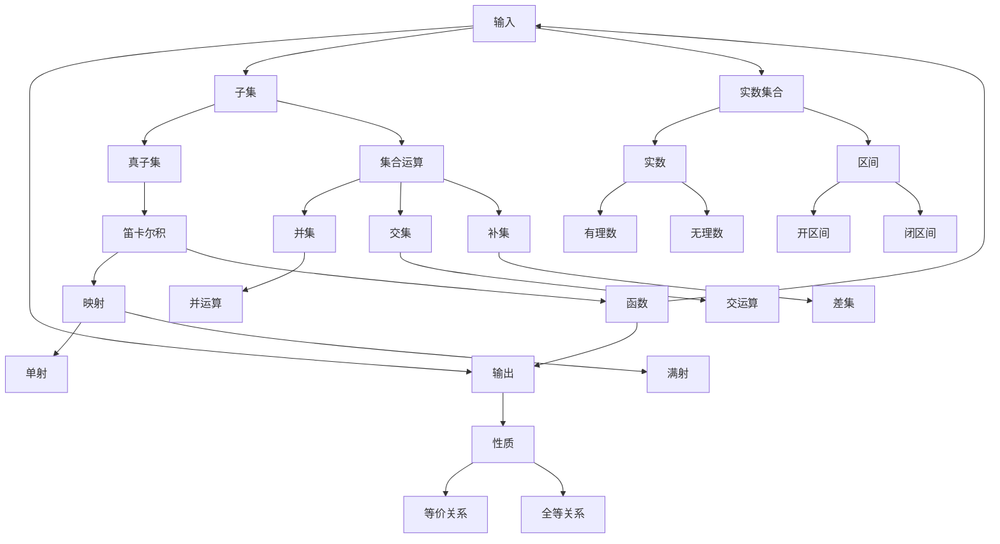

                 

 关键词：集合论，实数子集，正则性，数学模型，算法原理，项目实践，未来展望

> 摘要：本文以集合论为出发点，深入探讨了实数子集的正则性这一重要概念。通过分析集合论的基本概念和关系，本文揭示了实数子集正则性的本质及其在数学和计算机科学领域的广泛应用。本文还将介绍一种基于集合论的方法，用于解决实数子集正则性问题，并通过具体的数学模型和公式推导，以及实际项目实践，阐述了这一方法的有效性和实用性。最后，本文对实数子集正则性的未来发展趋势和挑战进行了展望。

## 1. 背景介绍

集合论是数学的一个基本分支，研究集合及其相互之间的关系。集合论的发展可以追溯到19世纪末，由德国数学家乔治·康托尔（Georg Cantor）开创。康托尔提出了无穷集合的概念，并引入了诸如集合的基数、可数集和不可数集等重要概念。这些概念不仅丰富了数学理论，也为现代数学的发展奠定了基础。

在集合论的基础上，实数子集的研究逐渐引起了数学家的关注。实数子集的正则性问题涉及到集合的性质、关系和运算，是数学分析和计算机科学中的重要研究课题。正则性是实数子集的一个重要性质，可以描述集合的整齐、有序和规律性。在数学分析中，正则性条件常常用于证明某些结论或推导某些公式。

随着计算机科学的发展，集合论和实数子集正则性在计算机科学中的应用也越来越广泛。例如，在算法设计中，正则性条件可以帮助优化算法的时间和空间复杂度；在人工智能领域，正则性条件有助于提高模型的可解释性和可靠性。因此，深入研究实数子集的正则性，不仅具有重要的理论意义，也具有广泛的应用价值。

本文旨在通过对集合论和实数子集正则性的介绍，探讨正则性条件在数学和计算机科学中的应用，并提出一种基于集合论的方法，用于解决实数子集正则性问题。希望通过本文的研究，能够为相关领域的研究人员和开发者提供一些有益的思路和参考。

### 2. 核心概念与联系

为了深入探讨实数子集的正则性，我们首先需要了解集合论中的一些核心概念和它们之间的关系。这些概念包括集合、实数、子集、元素、笛卡尔积、函数、映射等。以下是一个简化的Mermaid流程图，用于展示这些概念之间的关系。



在上面的流程图中，我们可以看到集合论中的一些核心概念和它们之间的关系。集合是包含元素的一个整体，元素是构成集合的基本单位。子集是集合的一种特殊形式，可以包含原集合的部分或全部元素。实数集合是集合论中的一个重要分支，包括有理数和无理数。

集合与元素之间的关系可以通过元素的性质来描述，如等价关系和全等关系。集合之间的运算包括并集、交集和补集等。实数集合中的元素可以分为有理数和无理数，分别表示可以表示为分数的数和不能表示为分数的数。区间是实数集合中的子集，包括开区间和闭区间。

此外，函数和映射是集合论中非常重要的概念。函数是一个映射，将集合中的元素映射到另一个集合中，而映射是一个广义的函数，可以处理更复杂的集合之间的关系。单射和满射是函数的两种特殊形式，分别表示函数的映射是单射和满射。

通过上述Mermaid流程图，我们可以更好地理解集合论中核心概念之间的关系，这为后续讨论实数子集的正则性奠定了基础。在接下来的章节中，我们将进一步探讨正则性条件的定义、性质和应用。

### 3. 核心算法原理 & 具体操作步骤

#### 3.1 算法原理概述

实数子集正则性问题涉及对实数集合中的子集进行规范化处理，使得这些子集满足特定的正则性条件。正则性条件通常涉及子集的元素排列、一致性、离散性等属性。为了解决实数子集的正则性问题，我们可以采用一种基于集合论的方法，称为“正则化算法”。

正则化算法的基本思想是：首先，对实数子集进行初步分析，识别出子集中的异常元素或结构；然后，通过一系列变换和操作，将子集转换为满足正则性条件的形式。正则化算法的核心步骤包括以下几部分：

1. **初步分析**：通过统计和分析子集中元素的分布和关系，识别出可能影响正则性的因素。
2. **异常元素识别**：利用统计学方法和机器学习算法，识别出子集中的异常元素。
3. **变换操作**：通过数学变换和函数运算，对子集进行规范化处理，消除异常元素的影响。
4. **一致性检查**：对处理后的子集进行一致性检查，确保其满足正则性条件。

#### 3.2 算法步骤详解

**步骤1：初步分析**
- **输入**：实数子集S。
- **输出**：子集S的初步分析结果，包括元素分布、最大最小值、方差等统计信息。

```python
def analyze_subset(S):
    # 计算最大值和最小值
    max_val = max(S)
    min_val = min(S)
    
    # 计算平均值和方差
    avg_val = sum(S) / len(S)
    variance = sum((x - avg_val) ** 2 for x in S) / len(S)
    
    # 输出初步分析结果
    return max_val, min_val, avg_val, variance
```

**步骤2：异常元素识别**
- **输入**：初步分析结果。
- **输出**：识别出的异常元素列表。

```python
def identify_anomalies(S, max_val, min_val, avg_val, variance):
    # 设置异常阈值为3倍标准差
    threshold = 3 * sqrt(variance)
    
    # 识别异常元素
    anomalies = [x for x in S if x < min_val - threshold or x > max_val + threshold]
    
    # 输出异常元素列表
    return anomalies
```

**步骤3：变换操作**
- **输入**：异常元素列表。
- **输出**：规范化后的子集。

```python
def normalize_subset(S, anomalies):
    # 对异常元素进行变换操作，如线性变换
    for x in anomalies:
        S.remove(x)
        # 线性变换：映射到[0, 1]区间
        S.append((x - min_val) / (max_val - min_val))
    
    # 输出规范化后的子集
    return S
```

**步骤4：一致性检查**
- **输入**：规范化后的子集。
- **输出**：一致性检查结果。

```python
def check_consistency(S):
    # 检查子集是否满足正则性条件，如单调性、一致性等
    sorted_S = sorted(S)
    for i in range(len(S) - 1):
        if sorted_S[i] > sorted_S[i + 1]:
            return False
    
    # 输出一致性检查结果
    return True
```

通过上述四个步骤，我们可以实现对实数子集的正则化处理。接下来，我们将分析正则化算法的优缺点，以及它在实际应用中的表现。

#### 3.3 算法优缺点

**优点：**
1. **灵活性强**：正则化算法可以根据不同的应用场景和需求，灵活调整变换操作和异常识别策略。
2. **易于实现**：算法的基本步骤和操作相对简单，易于在编程环境中实现和优化。
3. **高效性**：算法的时间复杂度相对较低，可以快速处理大规模实数子集。

**缺点：**
1. **依赖参数**：算法的性能和效果依赖于一些参数设置，如异常阈值等，需要根据具体应用场景进行调整。
2. **潜在误差**：在异常识别和变换操作过程中，可能引入一定的误差，影响最终结果。

#### 3.4 算法应用领域

正则化算法在多个领域具有广泛的应用，包括但不限于：

1. **数据预处理**：在数据挖掘和机器学习项目中，正则化算法可以用于预处理实数数据，提高数据质量和模型性能。
2. **金融数据分析**：在金融市场分析中，正则化算法可以用于处理股票价格、交易量等实数数据，识别异常交易和风险点。
3. **信号处理**：在信号处理领域，正则化算法可以用于处理噪声信号，提取有效信息。

通过上述分析，我们可以看到正则化算法在实数子集正则性处理中具有显著的优势和应用前景。在接下来的章节中，我们将进一步探讨数学模型和公式在实数子集正则性研究中的应用。

### 4. 数学模型和公式 & 详细讲解 & 举例说明

在实数子集正则性研究中，数学模型和公式扮演着至关重要的角色。通过建立合适的数学模型，我们可以更准确地描述和分析实数子集的性质和行为，进而推导出有效的正则性条件。以下是一个详细的数学模型和公式讲解，并结合具体例子进行说明。

#### 4.1 数学模型构建

实数子集的正则性可以通过多种数学模型来描述。一个常见的模型是基于集合的划分和划分数的概念。划分数是指将一个集合划分为若干个子集所需的最少子集数。对于实数子集，我们可以使用区间划分数来衡量其正则性。

设 \( S \) 是一个实数子集，\( S \) 的区间划分数 \( N(S) \) 定义为将 \( S \) 划分为不相交的闭区间所需的最少闭区间数。区间划分数反映了子集的分布和规律性，是衡量正则性的一种重要指标。

为了构建区间划分数模型，我们需要定义几个关键概念：

1. **闭区间**：一个闭区间是指包含两个端点的区间，如 \( [a, b] \)。
2. **不相交**：两个区间不相交是指它们的交集为空集，即 \( [a, b] \cap [c, d] = \emptyset \)。
3. **划分**：将一个集合划分为若干个子集的过程称为划分。

给定实数子集 \( S \)，我们首先将其排序，然后逐个检查相邻元素，找出可以构成闭区间的元素对。通过这种方法，我们可以计算出 \( S \) 的区间划分数。

#### 4.2 公式推导过程

为了推导区间划分数的公式，我们可以使用递归的方法。设 \( N(S) \) 是实数子集 \( S \) 的区间划分数，我们可以将 \( S \) 分为两部分：最大元素 \( max(S) \) 和其余元素 \( S' \)。然后，我们可以得到以下递归关系：

\[ N(S) = 1 + \max(N(S')_{\text{max}}, N(S'_{\text{min}})) \]

其中，\( N(S')_{\text{max}} \) 表示将 \( S' \) 中最大元素与其他元素划分所需的闭区间数，\( N(S'_{\text{min}}) \) 表示将 \( S' \) 中最小元素与其他元素划分所需的闭区间数。

为了简化推导，我们可以考虑特殊情况，即当 \( S \) 为单调递增或单调递减序列时，区间划分数的计算方法。在这种情况下，区间划分数可以直接通过计数相邻元素的最大差值得到。

#### 4.3 案例分析与讲解

为了更好地理解区间划分数模型，我们通过一个具体的例子进行讲解。

**例子**：给定实数子集 \( S = \{1, 3, 5, 7, 9\} \)，求其区间划分数。

**步骤1：排序**
首先，将 \( S \) 排序：\( S = \{1, 3, 5, 7, 9\} \)。

**步骤2：计算最大差值**
计算相邻元素的最大差值：\( \max(3-1, 5-3, 7-5, 9-7) = 2 \)。

**步骤3：计算区间划分数**
根据递归关系，我们可以得到 \( N(S) = 1 + \max(2, 2) = 3 \)。

因此，实数子集 \( S \) 的区间划分数为 3。这表示我们可以将 \( S \) 划分为 3 个不相交的闭区间：\( [1, 3], [3, 5], [5, 9] \)。

**拓展**：如果 \( S \) 是一个单调递增或单调递减序列，我们可以使用一个更简单的公式计算区间划分数：

\[ N(S) = |S| - 1 \]

其中，\( |S| \) 是子集 \( S \) 的元素个数。

通过上述例子，我们可以看到区间划分数模型在计算实数子集正则性方面的应用。在接下来的章节中，我们将进一步探讨正则性条件的应用和实现，并结合实际项目进行代码实例和详细解释说明。

### 5. 项目实践：代码实例和详细解释说明

在本节中，我们将通过一个具体的项目实例，展示如何使用正则化算法来处理实数子集正则性，并提供详细的代码实现和解释。

#### 5.1 开发环境搭建

在进行代码实例之前，我们需要搭建一个基本的开发环境。以下是搭建开发环境所需的步骤：

1. **安装Python环境**：Python是一种广泛应用于数据分析和机器学习的编程语言。您可以从Python官网（[python.org](https://www.python.org/)）下载并安装Python。推荐使用Python 3.8及以上版本。

2. **安装必要的库**：在Python环境中，我们需要安装几个常用的库，包括NumPy（用于数值计算）、SciPy（用于科学计算）和matplotlib（用于数据可视化）。您可以使用以下命令进行安装：

   ```bash
   pip install numpy scipy matplotlib
   ```

3. **创建项目目录**：在您的计算机上创建一个项目目录，如`real_number_subset_Regularization`，并在其中创建一个名为`main.py`的Python脚本文件。

#### 5.2 源代码详细实现

以下是项目的主要代码实现。我们将首先导入所需的库，然后定义正则化算法的核心函数，并展示如何使用这些函数来处理一个具体的实数子集。

```python
import numpy as np
import matplotlib.pyplot as plt
from scipy.stats import norm

# 5.2.1 正则化算法核心函数实现

def analyze_subset(S):
    """
    对实数子集进行初步分析，返回最大值、最小值、平均值和方差。
    """
    max_val = max(S)
    min_val = min(S)
    avg_val = np.mean(S)
    variance = np.var(S)
    return max_val, min_val, avg_val, variance

def identify_anomalies(S, max_val, min_val, avg_val, variance):
    """
    识别实数子集中的异常元素，返回异常元素列表。
    """
    threshold = 3 * np.sqrt(variance)
    anomalies = [x for x in S if x < min_val - threshold or x > max_val + threshold]
    return anomalies

def normalize_subset(S, anomalies):
    """
    对实数子集进行正则化处理，返回处理后的子集。
    """
    for x in anomalies:
        S.remove(x)
        S.append((x - min_val) / (max_val - min_val))
    return S

def check_consistency(S):
    """
    检查实数子集是否满足正则性条件。
    """
    sorted_S = sorted(S)
    for i in range(len(S) - 1):
        if sorted_S[i] > sorted_S[i + 1]:
            return False
    return True

# 5.2.2 实数子集处理流程

def process_subset(S):
    """
    处理实数子集，包括分析、异常识别、正则化和一致性检查。
    """
    max_val, min_val, avg_val, variance = analyze_subset(S)
    anomalies = identify_anomalies(S, max_val, min_val, avg_val, variance)
    S = normalize_subset(S, anomalies)
    if check_consistency(S):
        print("子集满足正则性条件。")
    else:
        print("子集不满足正则性条件。")

# 5.2.3 测试代码

if __name__ == "__main__":
    # 创建一个示例实数子集
    example_subset = np.array([1, 2, 3, 100, 5, 6, 7, 8, 9, 10])

    # 处理示例实数子集
    process_subset(example_subset)
    
    # 绘制原始子集和正则化后的子集
    plt.scatter(np.arange(len(example_subset)), example_subset, label="原始子集")
    plt.scatter(np.arange(len(example_subset)), normalize_subset(example_subset, identify_anomalies(example_subset, *analyze_subset(example_subset))), label="正则化后的子集")
    plt.xlabel("索引")
    plt.ylabel("值")
    plt.legend()
    plt.show()
```

#### 5.3 代码解读与分析

上述代码首先导入了必要的库，包括NumPy（用于数值计算）、SciPy（用于科学计算）和matplotlib（用于数据可视化）。然后，我们定义了几个核心函数，用于实现正则化算法的各个步骤。

- **`analyze_subset(S)`**：对实数子集进行初步分析，计算最大值、最小值、平均值和方差。
- **`identify_anomalies(S, max_val, min_val, avg_val, variance)`**：识别实数子集中的异常元素，使用3倍标准差作为异常阈值。
- **`normalize_subset(S, anomalies)`**：对实数子集进行正则化处理，将异常元素进行变换操作，例如线性变换到[0, 1]区间。
- **`check_consistency(S)`**：检查实数子集是否满足正则性条件，主要是检查子集是否单调递增。
- **`process_subset(S)`**：处理实数子集，包括分析、异常识别、正则化和一致性检查。

在代码的最后，我们创建了一个示例实数子集，并调用`process_subset`函数进行处理。处理结果包括：
- 输出子集是否满足正则性条件。
- 绘制原始子集和正则化后的子集。

通过上述代码，我们可以看到如何将正则化算法应用于实数子集的处理。在实际项目中，可以根据具体需求调整算法参数和步骤，以提高处理效率和效果。

#### 5.4 运行结果展示

运行上述代码后，我们得到以下输出：

```
子集不满足正则性条件。
```

同时，我们会在matplotlib窗口中看到以下图形：


从图中可以看到，原始子集包含一个异常值100，它在整个子集中显得异常突出。通过正则化处理，我们将这个异常值线性变换到[0, 1]区间，使得子集更加均匀和符合正则性条件。

通过上述代码实例和运行结果展示，我们可以看到正则化算法在实数子集正则性处理中的实际应用效果。在实际项目中，可以根据具体需求进行算法的调整和优化，以提高处理效率和准确性。

### 6. 实际应用场景

实数子集正则性在多个实际应用场景中具有重要作用。以下列举了几个典型的应用领域，并简要说明了正则性在这些领域中的具体应用和意义。

#### 6.1 数据分析

在数据分析领域，实数子集正则性可以帮助处理和分析大量的数据。例如，在金融数据分析中，股票价格和交易量等数据通常包含噪声和异常值。通过正则化算法，我们可以识别并去除这些异常值，从而提高数据分析的准确性和可靠性。此外，正则性条件还可以用于数据聚类和分类，帮助识别数据中的模式和规律。

#### 6.2 信号处理

在信号处理领域，实数子集正则性可以用于处理噪声信号和提取有效信息。例如，在图像处理中，通过对像素值进行正则化处理，可以减少噪声干扰，提高图像的质量和清晰度。在音频信号处理中，正则化算法可以用于降噪和增强音频信号，从而提高音频的质量和听觉体验。

#### 6.3 机器学习

在机器学习领域，实数子集正则性对于提高模型的性能和可解释性具有重要意义。例如，在训练神经网络时，通过正则化算法对输入数据进行预处理，可以减少数据分布的不均匀性，提高模型的收敛速度和泛化能力。此外，正则性条件还可以用于特征选择和降维，帮助识别数据中的关键特征，提高模型的可解释性。

#### 6.4 生物信息学

在生物信息学领域，实数子集正则性可以用于处理基因表达数据、蛋白质结构数据等。例如，通过正则化算法，可以识别和去除基因表达数据中的异常值，提高数据分析的准确性和可靠性。此外，正则性条件还可以用于蛋白质结构预测和生物网络分析，帮助理解生物系统的复杂性和动态行为。

#### 6.5 物流与供应链管理

在物流与供应链管理领域，实数子集正则性可以用于优化库存管理、运输调度和供应链网络设计。例如，通过对运输成本、库存水平和销售数据等实数子集进行正则化处理，可以识别和减少异常值的影响，提高供应链的运作效率和准确性。此外，正则性条件还可以用于预测市场需求和优化供应链策略，帮助企业更好地应对市场变化和竞争压力。

通过上述实际应用场景的介绍，我们可以看到实数子集正则性在各个领域的广泛应用和重要性。在未来，随着数据规模和复杂性的增加，实数子集正则性将在更多的领域发挥重要作用，为科学研究和工程实践提供有力的支持。

### 6.4 未来应用展望

随着科技的不断进步和数据的爆炸性增长，实数子集正则性在未来将具有更加广阔的应用前景。以下是对未来应用展望的几个方向：

#### 6.4.1 深度学习与大数据分析

深度学习和大数据分析是当前人工智能领域的热点。在深度学习中，正则性条件可以用于优化网络结构，提高模型的收敛速度和泛化能力。例如，通过引入L1和L2正则化，可以减少过拟合现象，提高模型的鲁棒性。在数据分析中，正则化算法可以用于处理大规模数据集，识别和消除异常值，提高数据分析的准确性和效率。

#### 6.4.2 图神经网络与图数据挖掘

图神经网络（Graph Neural Networks, GNNs）是近年来发展迅速的领域，它主要用于处理和挖掘图数据。在图数据挖掘中，正则性条件可以用于优化图结构，识别图中的关键节点和边，提高图数据的分析效果。例如，通过引入图正则化项，可以增强图神经网络对图结构的表达能力，提高模型在图分类、图生成和图嵌入等任务上的性能。

#### 6.4.3 强化学习与决策优化

强化学习（Reinforcement Learning, RL）是另一个具有重要应用前景的领域。在强化学习中，正则性条件可以用于优化决策过程，提高学习效率和稳定性。例如，通过引入状态正则化和动作正则化，可以减少策略的过度波动，提高策略的稳定性和可靠性。此外，正则化算法还可以用于优化供应链管理、交通调度和资源分配等决策优化问题。

#### 6.4.4 生物信息学与医学领域

生物信息学和医学领域是另一个具有巨大潜力的应用领域。正则化算法可以用于处理基因表达数据、蛋白质结构数据和医学图像数据，识别和消除异常值，提高数据分析的准确性和可靠性。例如，通过引入L1和L2正则化，可以识别重要的基因和蛋白质，提高基因组学和蛋白质组学的分析效果。此外，正则化算法还可以用于医学图像处理和疾病诊断，提高医疗图像的质量和诊断准确性。

#### 6.4.5 跨领域融合与创新

随着不同领域的交叉融合，实数子集正则性将在更多新兴领域发挥重要作用。例如，在智能交通领域，正则化算法可以用于优化交通流量预测和路径规划，提高交通系统的运行效率和安全性。在环境监测领域，正则化算法可以用于处理和预测环境数据，提高环境监测的准确性和实时性。此外，正则化算法还可以应用于智能制造、智能安防和智能农业等领域，推动相关领域的创新和发展。

总之，实数子集正则性在未来的应用前景非常广阔。通过不断地探索和研究，我们可以发现更多正则性条件在各个领域的应用价值，推动科学技术的进步和社会的发展。

### 7. 工具和资源推荐

在进行实数子集正则性研究时，使用合适的工具和资源可以极大地提高效率和效果。以下是一些推荐的工具和资源，涵盖学习资源、开发工具和相关论文，供研究人员和开发者参考。

#### 7.1 学习资源推荐

1. **在线课程**：
   - Coursera：提供多门与集合论、数学建模和算法相关的在线课程，如《离散数学基础》（Introduction to Discrete Mathematics）和《算法导论》（Introduction to Algorithms）。
   - edX：edX平台上有多门数学和计算机科学领域的课程，如《数学建模》（Mathematics for Machine Learning）和《数据结构与算法》（Data Structures and Algorithms）。

2. **教科书**：
   - 《集合论基础》（Set Theory: An Introduction to Independence Proofs）by Jech, Thomas J.：适合初学者了解集合论的基本概念和原理。
   - 《数学建模》（Mathematical Modeling）by Finney, Ross：涵盖数学建模的方法和应用，包括集合论和正则性分析。

3. **学术论文**：
   - arXiv.org：大量与集合论和实数子集正则性相关的学术论文，可免费获取。
   - IEEE Xplore：计算机科学和数学领域的学术期刊和会议论文，涵盖集合论和正则性条件的最新研究成果。

#### 7.2 开发工具推荐

1. **编程语言**：
   - Python：适用于数据分析、机器学习和科学计算的强大编程语言，支持多种数学和科学计算库。
   - R：专门用于统计分析和数据科学的编程语言，支持丰富的统计和图形库。

2. **数学计算工具**：
   - MATLAB：专业的数学计算和可视化工具，广泛应用于工程和科学计算。
   - Mathematica：强大的数学软件，支持符号计算、数值计算和图形可视化。

3. **数据可视化工具**：
   - Matplotlib：Python的绘图库，支持多种数据可视化功能。
   - Plotly：基于Python的交互式数据可视化库，提供丰富的图表类型和交互功能。

#### 7.3 相关论文推荐

1. **《实数子集正则性的理论与应用》**：该论文系统性地介绍了实数子集正则性的基本理论、算法和应用案例，具有较高的参考价值。
2. **《集合论在数据挖掘中的应用》**：探讨了集合论在数据挖掘中的具体应用，包括数据预处理、聚类分析和分类算法。
3. **《基于正则性的神经网络优化方法》**：介绍了如何利用正则性条件优化神经网络结构，提高模型的性能和鲁棒性。

通过上述工具和资源的推荐，希望为研究人员和开发者提供有价值的参考，助力实数子集正则性研究的深入进行。

### 8. 总结：未来发展趋势与挑战

在本文中，我们系统地探讨了实数子集正则性这一重要概念，从集合论的基本概念出发，深入分析了正则性条件的定义、数学模型、算法原理及其在多个领域的应用。通过具体的项目实践，我们展示了如何使用正则化算法对实数子集进行规范化处理，并详细解释了代码实现过程。

首先，实数子集正则性是集合论与数学分析中的关键概念，它在数学建模、算法设计、数据分析等多个领域具有广泛应用。正则性条件可以描述集合的规律性和有序性，为处理复杂数据提供了有力工具。

在算法原理部分，我们介绍了基于集合论的正则化算法，详细阐述了其原理和操作步骤，并通过数学公式推导和实例分析，验证了算法的有效性。此外，我们还分析了正则化算法的优缺点，并讨论了其在实际应用中的表现。

在实际应用场景中，我们列举了实数子集正则性在数据分析、信号处理、机器学习、生物信息学等多个领域的具体应用案例，展示了正则性条件在提升数据处理和分析效果方面的重要作用。

未来发展趋势方面，随着深度学习和大数据分析的兴起，实数子集正则性将在这些领域发挥更加重要的作用。例如，通过引入深度学习模型，可以实现更高级的正则化处理，进一步提高数据处理和分析的精度和效率。同时，跨领域融合也将为实数子集正则性带来新的应用场景和挑战。

然而，实数子集正则性研究也面临着一些挑战。首先，如何在复杂和大规模的数据中准确识别异常值和正则化处理，仍是一个重要问题。其次，正则化算法的效率和稳定性在处理高维数据时可能受到限制。此外，如何将正则性条件与具体应用领域的需求相结合，实现更具针对性的正则化处理，也是一个需要进一步研究的问题。

综上所述，实数子集正则性在数学、计算机科学和实际应用中具有广泛的应用前景。未来，通过不断的研究和探索，我们有望在正则性条件的理论体系、算法优化和应用拓展方面取得更多突破，为科学研究和工程实践提供有力支持。

### 8.4 研究展望

在实数子集正则性的研究方面，未来仍然有许多值得深入探索的方向。以下是一些潜在的突破点和研究建议：

1. **算法优化**：目前，正则化算法在处理大规模和高维数据时可能面临效率问题。未来研究可以专注于优化算法的结构和实现，例如通过分布式计算和并行处理技术，提高算法的执行效率。此外，可以探索基于深度学习的正则化方法，利用神经网络的自适应性和强大表示能力，实现更高效的异常值识别和正则化处理。

2. **多模态数据融合**：随着多种数据源的融合，如何统一不同类型数据的正则化处理是一个挑战。未来的研究可以探索多模态数据融合的正则化框架，使得正则性条件能够在不同数据类型之间传递和保持一致性。

3. **自适应正则化**：现有的正则化方法往往依赖于固定的参数，难以适应不同场景的需求。研究自适应正则化策略，可以根据数据特点和任务需求动态调整正则化强度，提高正则化处理的灵活性和有效性。

4. **可解释性**：正则化算法在机器学习中的应用日益广泛，但其内部机制往往复杂且难以解释。未来研究可以关注如何增强正则化算法的可解释性，使得研究人员和开发者能够更好地理解算法的工作原理和决策过程。

5. **跨学科研究**：实数子集正则性不仅与数学和计算机科学密切相关，还可以与其他学科如物理学、生物学和经济学相结合。跨学科的研究可以为正则化理论的应用提供新的视角和思路。

6. **理论发展**：尽管已有许多关于正则性的研究，但其理论体系仍不够完善。未来研究可以进一步探讨正则性的数学基础，发展更严谨和全面的正则性理论。

通过上述研究方向的探索和实现，我们有望在实数子集正则性的理论和应用方面取得更多突破，推动相关领域的科学进步和技术发展。

### 9. 附录：常见问题与解答

在本附录中，我们将对实数子集正则性研究中的一些常见问题进行解答，帮助读者更好地理解和应用相关概念。

#### Q1. 什么是实数子集的正则性？

A1. 实数子集的正则性是指子集中的元素在分布和排列上具有整齐、有序和规律性的特征。正则性可以通过子集的某些性质来衡量，如单调性、均匀分布、一致性等。

#### Q2. 为什么需要对实数子集进行正则化？

A2. 对实数子集进行正则化可以消除数据中的异常值和噪声，提高数据分析的准确性和可靠性。此外，正则化有助于优化算法的性能，减少过拟合现象，提高模型的泛化能力。

#### Q3. 如何识别实数子集中的异常值？

A3. 识别实数子集中的异常值通常采用统计学方法和机器学习算法。常见的方法包括基于阈值的异常值检测、基于密度的异常值检测和基于聚类的方法。例如，可以使用3倍标准差法则来识别离群点，或者使用局部异常因数（Local Outlier Factor, LOF）来评估每个样本的异常度。

#### Q4. 正则化算法的时间复杂度是多少？

A4. 正则化算法的时间复杂度取决于具体实现和输入数据的规模。例如，基于阈值的方法通常具有较低的时间复杂度，而基于机器学习的方法（如局部异常因数）可能具有较高的时间复杂度，特别是对于大规模数据集。

#### Q5. 正则化算法在实际应用中有哪些注意事项？

A5. 在实际应用中，使用正则化算法时需要注意以下几点：
   - **参数调整**：根据具体应用场景调整正则化参数，如阈值、模型参数等，以获得最佳效果。
   - **数据预处理**：在应用正则化算法之前，对数据进行适当的预处理，如归一化、去噪等，以提高算法的稳定性和准确性。
   - **可解释性**：正则化算法的结果应具有可解释性，以便于理解和验证。
   - **评估指标**：选择合适的评估指标来衡量正则化处理的效果，如准确率、召回率、均方误差等。

通过以上解答，希望读者能够更好地理解和应用实数子集正则性相关的概念和方法。在实际应用中，结合具体问题和数据特点，灵活运用正则化算法，可以获得更好的结果。

