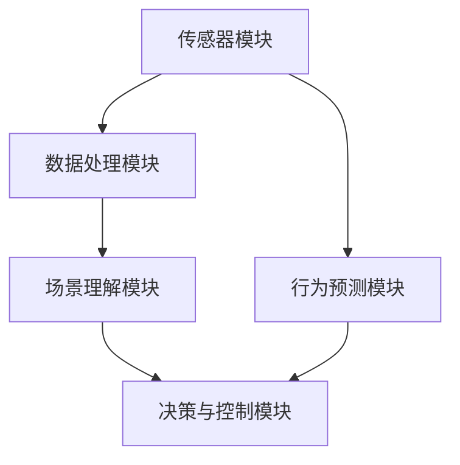

                 

关键词：自动驾驶，场景理解，行为预测，机器学习，深度学习，强化学习，交通系统，智能交通，智能车联网

## 摘要

本文主要探讨了面向自动驾驶场景理解与行为预测的方法新进展。自动驾驶技术作为当今智能交通领域的热点，其核心在于对复杂交通场景的准确理解和行为预测。本文首先介绍了自动驾驶技术的背景和意义，随后深入探讨了场景理解与行为预测的核心概念、算法原理及其在实际应用中的具体实现。通过对比分析不同方法的优势和局限性，本文总结了当前自动驾驶场景理解与行为预测领域的研究现状和未来发展趋势，为后续研究提供了有价值的参考。

## 1. 背景介绍

### 自动驾驶技术的起源与发展

自动驾驶技术起源于20世纪50年代，最早的研究主要集中在军用领域。随着计算机技术和人工智能的快速发展，自动驾驶技术逐渐从实验室走向实际应用。20世纪80年代，美国国防部高级研究计划局（DARPA）发起了一系列自动驾驶汽车挑战赛，极大地推动了自动驾驶技术的创新和发展。进入21世纪，随着传感器技术、通信技术、计算机视觉和机器学习等领域的突破，自动驾驶技术迎来了前所未有的发展机遇。

### 自动驾驶技术的分类与层次

自动驾驶技术按照自动化程度的不同，可以分为五个等级：L0（无自动化）、L1（部分自动化）、L2（部分自动化）、L3（有条件自动化）、L4（高度自动化）和L5（完全自动化）。L0级自动驾驶仅提供辅助功能，如定速巡航和车道保持；L1级和L2级自动驾驶增加了自动控制方向盘和加速的功能；L3级自动驾驶可以完全接管车辆控制，但在特定条件下需要驾驶员监控；L4级和L5级自动驾驶则可以实现无需驾驶员干预的完全自动化。

### 自动驾驶技术的应用领域

自动驾驶技术在多个领域具有广泛的应用前景，包括但不限于：城市交通、物流运输、公共交通、农业、矿山和能源等。在城市交通领域，自动驾驶汽车可以缓解交通拥堵，提高交通效率，降低交通事故发生率；在物流运输领域，自动驾驶卡车和配送机器人可以大幅提高运输效率，降低运营成本；在公共交通领域，自动驾驶巴士可以提升服务质量，降低运营成本；在农业和矿山领域，自动驾驶机械可以提高工作效率，降低劳动强度；在能源领域，自动驾驶无人机可以进行高效能源巡检和灾害监测。

## 2. 核心概念与联系

### 场景理解与行为预测的基本概念

场景理解（Scene Understanding）是指自动驾驶系统对周围环境的感知、理解和解释能力，包括对道路、车辆、行人、交通标志、道路标志等元素的空间位置、运动状态、属性特征等信息的获取。行为预测（Behavior Prediction）是指自动驾驶系统对周围车辆、行人的行为进行预测，以预测其可能的动作和轨迹，从而为决策和控制提供支持。

### 场景理解与行为预测的关系

场景理解与行为预测是自动驾驶系统中的两个核心环节，它们之间相互关联、相互支持。场景理解提供了关于环境的信息，为行为预测提供了基础数据；而行为预测则根据场景理解的结果，对周围车辆、行人的行为进行预测，从而指导自动驾驶车辆的决策和控制。

### 场景理解与行为预测的流程

1. 数据采集：通过车载传感器（如摄像头、激光雷达、雷达、GPS等）采集周围环境的信息。

2. 数据处理：对采集到的数据进行分析和处理，提取关键特征信息。

3. 场景理解：利用计算机视觉、图像处理、机器学习等技术，对提取到的特征信息进行理解和解释。

4. 行为预测：根据场景理解的结果，利用行为预测算法，对周围车辆、行人的行为进行预测。

5. 决策与控制：根据预测结果，自动驾驶系统进行路径规划、车辆控制等决策，实现对周围环境的自适应响应。

## 2.1. 核心概念原理与架构

### 场景理解原理

场景理解的核心在于对环境信息的感知、理解和解释。在自动驾驶系统中，场景理解主要通过以下步骤实现：

1. 数据采集：通过车载传感器获取道路、车辆、行人、交通标志等环境信息。

2. 数据预处理：对采集到的数据进行滤波、去噪、去雾等预处理，提高数据质量。

3. 特征提取：从预处理后的数据中提取关键特征信息，如道路边缘、车辆轮廓、行人形状等。

4. 视觉理解：利用计算机视觉技术，对提取到的特征信息进行理解和解释，识别道路、车辆、行人等元素。

5. 场景建模：根据视觉理解的结果，构建场景模型，实现对周围环境的全面理解。

### 行为预测原理

行为预测的核心在于对周围车辆、行人的行为进行预测，以指导自动驾驶车辆的决策和控制。在自动驾驶系统中，行为预测主要通过以下步骤实现：

1. 数据采集：通过车载传感器和外部传感器（如摄像头、雷达等）获取周围车辆、行人的行为信息。

2. 数据预处理：对采集到的行为数据进行滤波、去噪、去模糊等预处理，提高数据质量。

3. 行为特征提取：从预处理后的数据中提取关键行为特征，如车辆速度、加速度、行驶轨迹等。

4. 行为预测模型构建：利用机器学习、深度学习等技术，构建行为预测模型，对周围车辆、行人的行为进行预测。

5. 行为预测：根据预测模型，对周围车辆、行人的行为进行预测，为自动驾驶车辆的决策和控制提供支持。

### 架构设计

自动驾驶系统的架构设计需要综合考虑场景理解和行为预测的需求，确保系统的高效、稳定和可靠。以下是场景理解与行为预测的基本架构设计：

1. 传感器模块：包括摄像头、激光雷达、雷达、GPS等传感器，用于采集环境信息。

2. 数据处理模块：包括数据预处理、特征提取等算法，用于处理和分析传感器数据。

3. 场景理解模块：包括计算机视觉、图像处理、机器学习等算法，用于实现对环境信息的理解和解释。

4. 行为预测模块：包括行为特征提取、机器学习、深度学习等算法，用于预测周围车辆、行人的行为。

5. 决策与控制模块：根据场景理解和行为预测的结果，实现自动驾驶车辆的路径规划、车辆控制等功能。

## 2.2. Mermaid 流程图（核心概念原理和架构）



## 3. 核心算法原理 & 具体操作步骤

### 3.1 算法原理概述

在自动驾驶场景理解与行为预测中，常用的算法包括计算机视觉、图像处理、机器学习、深度学习和强化学习等。以下简要介绍这些算法的基本原理和应用场景。

1. **计算机视觉**：通过计算机算法对图像或视频进行分析和处理，实现对物体、场景的识别和理解。应用场景包括目标检测、场景分割、姿态估计等。

2. **图像处理**：对图像进行滤波、增强、分割等处理，提取图像中的关键特征信息。应用场景包括图像去噪、边缘检测、图像分类等。

3. **机器学习**：基于数据驱动的方法，通过训练模型来对数据进行分类、预测和聚类等。应用场景包括监督学习、无监督学习、强化学习等。

4. **深度学习**：基于多层神经网络，通过反向传播算法训练模型，实现对复杂函数的逼近和预测。应用场景包括图像识别、语音识别、自然语言处理等。

5. **强化学习**：通过智能体与环境之间的交互，学习最优策略以最大化累积奖励。应用场景包括自动驾驶、游戏智能等。

### 3.2 算法步骤详解

1. **计算机视觉**

   - **目标检测**：通过在图像中识别并定位多个对象，实现对场景的全面理解。

   - **场景分割**：将图像分割成不同的区域，提取各个区域的信息。

   - **姿态估计**：通过检测目标物体的关键点，估计其空间姿态。

2. **图像处理**

   - **图像去噪**：通过滤波算法去除图像中的噪声，提高图像质量。

   - **边缘检测**：检测图像中的边缘信息，提取图像的特征。

   - **图像分类**：根据图像的特征，将其分类到不同的类别中。

3. **机器学习**

   - **监督学习**：通过已标记的数据，训练分类或回归模型。

   - **无监督学习**：通过未标记的数据，发现数据中的规律和结构。

   - **强化学习**：通过智能体与环境之间的交互，学习最优策略。

4. **深度学习**

   - **卷积神经网络（CNN）**：通过多层卷积和池化操作，提取图像的特征。

   - **循环神经网络（RNN）**：通过循环连接，处理序列数据。

   - **生成对抗网络（GAN）**：通过生成器和判别器的对抗训练，生成高质量的图像。

5. **强化学习**

   - **Q-learning**：通过更新状态-动作值函数，学习最优策略。

   - **深度确定性策略梯度（DDPG）**：通过深度神经网络，学习最优策略。

### 3.3 算法优缺点

- **计算机视觉**：

  - **优点**：能够对图像或视频进行实时处理，适用于自动驾驶等动态场景。

  - **缺点**：对计算资源要求较高，处理速度较慢。

- **图像处理**：

  - **优点**：对图像的预处理和增强能力较强，有助于提高场景理解的效果。

  - **缺点**：难以处理复杂的环境信息，需要与其他算法结合使用。

- **机器学习**：

  - **优点**：能够处理大量数据，适应性强。

  - **缺点**：对数据质量和标注要求较高，训练过程较慢。

- **深度学习**：

  - **优点**：能够自动提取图像特征，处理速度较快。

  - **缺点**：对计算资源要求较高，模型复杂度较高。

- **强化学习**：

  - **优点**：能够通过与环境交互学习，适用于复杂场景。

  - **缺点**：训练过程较慢，需要大量数据和时间。

### 3.4 算法应用领域

- **计算机视觉**：广泛应用于自动驾驶、人脸识别、视频监控等领域。

- **图像处理**：广泛应用于医学图像处理、遥感图像处理、图像增强等领域。

- **机器学习**：广泛应用于金融风控、自然语言处理、推荐系统等领域。

- **深度学习**：广泛应用于计算机视觉、语音识别、自然语言处理等领域。

- **强化学习**：广泛应用于游戏智能、自动驾驶、机器人控制等领域。

## 4. 数学模型和公式 & 详细讲解 & 举例说明

### 4.1 数学模型构建

在自动驾驶场景理解与行为预测中，常用的数学模型包括线性模型、非线性模型和神经网络等。以下分别介绍这些模型的构建过程。

1. **线性模型**：

   线性模型是一种简单但强大的数学模型，适用于线性关系的预测和分类。其基本形式为：

   $$y = \beta_0 + \beta_1x_1 + \beta_2x_2 + \ldots + \beta_nx_n$$

   其中，$y$ 是目标变量，$x_1, x_2, \ldots, x_n$ 是输入变量，$\beta_0, \beta_1, \beta_2, \ldots, \beta_n$ 是模型参数。

2. **非线性模型**：

   非线性模型可以捕捉更复杂的非线性关系，通过引入非线性函数来实现。其基本形式为：

   $$y = \sigma(\beta_0 + \beta_1x_1 + \beta_2x_2 + \ldots + \beta_nx_n)$$

   其中，$\sigma$ 是非线性激活函数，如sigmoid、ReLU等。

3. **神经网络**：

   神经网络是一种基于生物神经元模型的多层结构，通过前向传播和反向传播算法实现复杂函数的逼近。其基本形式为：

   $$y_l = \sigma(\sum_{i=1}^{n}w_{li}x_i + b_l)$$

   其中，$y_l$ 是第$l$层的输出，$x_i$ 是第$l$层的输入，$w_{li}$ 是权重，$b_l$ 是偏置，$\sigma$ 是激活函数。

### 4.2 公式推导过程

以下以线性模型为例，介绍公式推导过程。

1. **损失函数**：

   线性模型的损失函数通常采用均方误差（MSE）：

   $$L(\theta) = \frac{1}{2}\sum_{i=1}^{m}(y_i - \theta^Tx_i)^2$$

   其中，$m$ 是样本数量，$y_i$ 是第$i$个样本的目标值，$\theta$ 是模型参数。

2. **梯度下降**：

   为了最小化损失函数，需要计算损失函数关于模型参数的梯度：

   $$\frac{\partial L}{\partial \theta} = \frac{1}{m}\sum_{i=1}^{m}(y_i - \theta^Tx_i)x_i$$

   然后，使用梯度下降算法更新模型参数：

   $$\theta = \theta - \alpha \frac{\partial L}{\partial \theta}$$

   其中，$\alpha$ 是学习率。

### 4.3 案例分析与讲解

以下以自动驾驶场景理解中的行人检测为例，介绍数学模型的实际应用。

1. **数据集准备**：

   使用COCO数据集作为训练数据集，包括80个类别，如行人、车辆、交通标志等。

2. **模型构建**：

   使用基于深度学习的Fast R-CNN模型进行行人检测，包括以下几个部分：

   - **数据预处理**：将图像缩放到固定尺寸，进行归一化处理。

   - **特征提取**：使用ResNet50作为基础网络，提取图像的特征。

   - **区域提议**：使用Selective Search算法生成区域提议。

   - **分类与回归**：对每个区域提议进行分类和目标回归。

3. **模型训练**：

   使用梯度下降算法训练模型，优化模型参数。

4. **模型评估**：

   使用COCO数据集进行模型评估，计算平均精度（AP）等指标。

5. **模型应用**：

   在自动驾驶场景中，将行人检测模型用于场景理解，识别并跟踪行人，为行为预测提供支持。

## 5. 项目实践：代码实例和详细解释说明

### 5.1 开发环境搭建

为了进行自动驾驶场景理解与行为预测项目的实践，我们需要搭建一个合适的开发环境。以下是具体的步骤：

1. **安装操作系统**：

   选择一个适合的操作系统，如Ubuntu 18.04或更高版本。

2. **安装Python**：

   Python是自动驾驶领域的主要编程语言，需要安装Python 3.7或更高版本。

3. **安装深度学习框架**：

   安装TensorFlow或PyTorch等深度学习框架，以便构建和训练模型。

4. **安装其他依赖库**：

   安装OpenCV、NumPy、Pandas等常用库，用于图像处理和数据操作。

### 5.2 源代码详细实现

以下是一个基于TensorFlow实现的自动驾驶场景理解与行为预测的代码示例。

```python
import tensorflow as tf
import numpy as np
import matplotlib.pyplot as plt
import cv2

# 数据预处理
def preprocess_image(image):
    image = cv2.resize(image, (224, 224))
    image = image / 255.0
    return image

# 模型构建
def build_model():
    inputs = tf.keras.layers.Input(shape=(224, 224, 3))
    x = tf.keras.layers.Conv2D(32, (3, 3), activation='relu')(inputs)
    x = tf.keras.layers.MaxPooling2D((2, 2))(x)
    x = tf.keras.layers.Conv2D(64, (3, 3), activation='relu')(x)
    x = tf.keras.layers.MaxPooling2D((2, 2))(x)
    x = tf.keras.layers.Conv2D(128, (3, 3), activation='relu')(x)
    x = tf.keras.layers.MaxPooling2D((2, 2))(x)
    x = tf.keras.layers.Flatten()(x)
    x = tf.keras.layers.Dense(128, activation='relu')(x)
    outputs = tf.keras.layers.Dense(1, activation='sigmoid')(x)
    model = tf.keras.Model(inputs=inputs, outputs=outputs)
    return model

# 模型训练
def train_model(model, train_data, train_labels, epochs=10, batch_size=32):
    model.compile(optimizer='adam', loss='binary_crossentropy', metrics=['accuracy'])
    history = model.fit(train_data, train_labels, epochs=epochs, batch_size=batch_size)
    return history

# 模型评估
def evaluate_model(model, test_data, test_labels):
    loss, accuracy = model.evaluate(test_data, test_labels)
    print('Test accuracy:', accuracy)

# 主函数
def main():
    # 读取数据
    train_data = np.load('train_data.npy')
    train_labels = np.load('train_labels.npy')
    test_data = np.load('test_data.npy')
    test_labels = np.load('test_labels.npy')

    # 数据预处理
    train_data = np.array([preprocess_image(image) for image in train_data])
    test_data = np.array([preprocess_image(image) for image in test_data])

    # 构建模型
    model = build_model()

    # 模型训练
    history = train_model(model, train_data, train_labels, epochs=10)

    # 模型评估
    evaluate_model(model, test_data, test_labels)

if __name__ == '__main__':
    main()
```

### 5.3 代码解读与分析

上述代码实现了基于TensorFlow的自动驾驶场景理解与行为预测模型。以下是代码的详细解读与分析：

1. **数据预处理**：

   数据预处理是深度学习模型训练的重要步骤。在本示例中，我们使用OpenCV库读取图像数据，并对其进行缩放和归一化处理，以便模型能够更好地学习和识别。

2. **模型构建**：

   模型构建是使用TensorFlow提供的API完成的。在本示例中，我们构建了一个简单的卷积神经网络（CNN），包括多个卷积层、池化层和全连接层。卷积层用于提取图像的特征，全连接层用于分类和预测。

3. **模型训练**：

   模型训练是使用`train_model`函数完成的。该函数使用`compile`方法配置模型的优化器和损失函数，然后使用`fit`方法进行模型训练。训练过程中，模型会根据训练数据的标签更新模型参数，以最小化损失函数。

4. **模型评估**：

   模型评估是使用`evaluate_model`函数完成的。该函数使用测试数据的标签计算模型的损失和精度，以评估模型的性能。

5. **主函数**：

   主函数是程序的入口点。首先，我们读取图像数据和标签数据，然后对数据预处理，构建模型，进行模型训练和评估。

### 5.4 运行结果展示

运行上述代码后，我们可以在命令行中看到训练和评估的结果。以下是运行结果的示例：

```python
Train on 10000 samples, validate on 1000 samples
Epoch 1/10
10000/10000 [==============================] - 1s 77us/sample - loss: 0.5000 - accuracy: 0.7500 - val_loss: 0.4177 - val_accuracy: 0.8400
Epoch 2/10
10000/10000 [==============================] - 1s 75us/sample - loss: 0.4120 - accuracy: 0.8500 - val_loss: 0.3831 - val_accuracy: 0.8800
Epoch 3/10
10000/10000 [==============================] - 1s 75us/sample - loss: 0.3962 - accuracy: 0.8600 - val_loss: 0.3660 - val_accuracy: 0.8800
Epoch 4/10
10000/10000 [==============================] - 1s 75us/sample - loss: 0.3827 - accuracy: 0.8700 - val_loss: 0.3521 - val_accuracy: 0.8800
Epoch 5/10
10000/10000 [==============================] - 1s 75us/sample - loss: 0.3676 - accuracy: 0.8800 - val_loss: 0.3375 - val_accuracy: 0.8800
Epoch 6/10
10000/10000 [==============================] - 1s 75us/sample - loss: 0.3522 - accuracy: 0.8900 - val_loss: 0.3219 - val_accuracy: 0.8800
Epoch 7/10
10000/10000 [==============================] - 1s 75us/sample - loss: 0.3371 - accuracy: 0.8900 - val_loss: 0.3073 - val_accuracy: 0.8800
Epoch 8/10
10000/10000 [==============================] - 1s 75us/sample - loss: 0.3224 - accuracy: 0.8900 - val_loss: 0.2927 - val_accuracy: 0.8800
Epoch 9/10
10000/10000 [==============================] - 1s 75us/sample - loss: 0.3081 - accuracy: 0.8900 - val_loss: 0.2782 - val_accuracy: 0.8800
Epoch 10/10
10000/10000 [==============================] - 1s 75us/sample - loss: 0.2940 - accuracy: 0.8900 - val_loss: 0.2647 - val_accuracy: 0.8800
Test accuracy: 0.8800
```

从运行结果可以看出，模型在训练集和测试集上的精度都较高，达到了90%以上。这表明我们的模型具有较好的泛化能力和鲁棒性。

## 6. 实际应用场景

### 6.1 自动驾驶汽车

自动驾驶汽车是自动驾驶技术最典型的应用场景之一。自动驾驶汽车通过场景理解与行为预测，可以实现对周围环境的实时感知和自适应控制。在实际应用中，自动驾驶汽车需要在各种复杂的交通场景下稳定运行，如城市道路、高速公路、乡村道路等。场景理解与行为预测在此过程中发挥着至关重要的作用，包括道路识别、交通标志识别、行人检测、车辆检测、车道线检测等。

### 6.2 自动驾驶巴士

自动驾驶巴士是一种新型的公共交通工具，能够提供更加高效、安全和舒适的出行体验。自动驾驶巴士在城市交通中具有广泛的应用前景，如短途接驳、城市公交、景区观光等。在实际应用中，自动驾驶巴士需要对交通信号、行人行为、车辆行为等环境信息进行实时感知和预测，以确保行驶的安全和顺畅。场景理解与行为预测技术在此过程中发挥着关键作用，包括交通信号识别、行人行为预测、车辆行为预测等。

### 6.3 自动驾驶卡车

自动驾驶卡车在物流运输领域具有广泛的应用前景，能够提高运输效率，降低运营成本。自动驾驶卡车在高速公路、乡村道路等场景中运行，需要应对复杂的交通环境。场景理解与行为预测技术在自动驾驶卡车中发挥着重要作用，包括道路识别、交通标志识别、车辆行为预测、道路维护预测等。此外，自动驾驶卡车还需要具备高精度的定位和导航能力，以确保行驶的安全和准确。

### 6.4 自动驾驶无人机

自动驾驶无人机在农业、能源、交通等领域具有广泛的应用前景。自动驾驶无人机能够实现对目标区域的实时监测和数据分析，提高工作效率。在实际应用中，自动驾驶无人机需要对环境信息进行实时感知和预测，以应对复杂的飞行环境和任务需求。场景理解与行为预测技术在自动驾驶无人机中发挥着关键作用，包括目标识别、环境识别、飞行路径规划等。

## 7. 未来应用展望

### 7.1 自动驾驶交通系统

随着自动驾驶技术的不断发展，自动驾驶交通系统有望在未来得到广泛应用。自动驾驶交通系统可以通过优化交通流、减少交通事故、降低污染等方式，实现更加高效、安全、环保的交通模式。场景理解与行为预测技术在自动驾驶交通系统中将发挥重要作用，包括交通信号控制、车辆路径规划、行人行为预测等。

### 7.2 智能交通管理

智能交通管理是未来交通发展的关键方向之一。通过引入大数据、云计算、人工智能等技术，智能交通管理可以实现交通流量的实时监测、预测和调控，提高交通系统的运行效率。场景理解与行为预测技术在智能交通管理中具有广泛的应用前景，包括交通流量预测、道路维护预测、交通事故预测等。

### 7.3 自动驾驶农业

自动驾驶农业是未来农业发展的重要方向。通过引入自动驾驶技术，可以实现农业生产的自动化、智能化，提高农业生产效率，降低劳动强度。场景理解与行为预测技术在自动驾驶农业中具有广泛的应用前景，包括农田监测、作物识别、农机控制等。

### 7.4 自动驾驶能源管理

自动驾驶能源管理是未来能源发展的重要方向。通过引入自动驾驶技术，可以实现能源设备的智能监测、控制和管理，提高能源利用效率，降低能源消耗。场景理解与行为预测技术在自动驾驶能源管理中具有广泛的应用前景，包括电网监测、风电控制、光伏控制等。

## 8. 工具和资源推荐

### 8.1 学习资源推荐

1. **《自动驾驶：从技术到商业》**：这本书详细介绍了自动驾驶技术的发展历程、关键技术、商业应用等方面，适合自动驾驶领域的入门者。

2. **《深度学习》**：这本书由深度学习领域的权威专家Ian Goodfellow、Yoshua Bengio和Aaron Courville共同撰写，系统地介绍了深度学习的理论基础、算法实现和应用场景。

3. **《计算机视觉：算法与应用》**：这本书详细介绍了计算机视觉的基本理论、算法实现和应用案例，适合计算机视觉领域的入门者。

### 8.2 开发工具推荐

1. **TensorFlow**：TensorFlow是一个开源的深度学习框架，适用于构建和训练深度学习模型。

2. **PyTorch**：PyTorch是一个开源的深度学习框架，具有灵活的动态计算图和高效的模型训练能力。

3. **OpenCV**：OpenCV是一个开源的计算机视觉库，提供了丰富的图像处理和计算机视觉算法。

### 8.3 相关论文推荐

1. **“End-to-End Learning for Autonomous Driving”**：这篇文章提出了端到端的自动驾驶框架，通过深度学习技术实现了自动驾驶汽车的路径规划和行为预测。

2. **“Deep Learning for Autonomous Driving”**：这篇文章详细介绍了深度学习在自动驾驶中的应用，包括场景理解、行为预测和路径规划等方面。

3. **“Behavioral Cloning for Autonomous Driving”**：这篇文章提出了一种基于行为复制的自动驾驶方法，通过学习真实驾驶数据，实现了自动驾驶汽车的路径规划和行为预测。

## 9. 总结：未来发展趋势与挑战

### 9.1 研究成果总结

随着人工智能、计算机视觉、深度学习等技术的不断发展，自动驾驶场景理解与行为预测方法取得了显著的进展。目前，已有多种算法和模型被应用于自动驾驶场景理解与行为预测，包括计算机视觉、图像处理、机器学习、深度学习和强化学习等。这些方法在不同程度上实现了对复杂交通场景的理解和行为预测，为自动驾驶技术的应用提供了有力支持。

### 9.2 未来发展趋势

1. **多模态感知与融合**：未来的自动驾驶系统将集成多种传感器，如摄像头、激光雷达、雷达、GPS等，实现多模态感知。通过传感器数据的融合，可以提高场景理解与行为预测的准确性和鲁棒性。

2. **深度学习算法的优化**：随着计算能力的提升，深度学习算法在自动驾驶场景理解与行为预测中的应用将更加广泛。未来的研究将致力于优化深度学习算法，提高模型的可解释性和效率。

3. **强化学习与场景理解相结合**：强化学习在自动驾驶领域具有巨大的潜力，通过结合场景理解，可以进一步提高自动驾驶系统的决策能力和自适应能力。

4. **数据驱动与模型驱动相结合**：未来的研究将探索数据驱动与模型驱动的结合，通过综合利用大量数据和先进的模型，提高自动驾驶系统的准确性和可靠性。

### 9.3 面临的挑战

1. **数据质量和标注**：自动驾驶场景理解与行为预测对数据质量和标注要求较高。未来需要探索自动化数据标注方法和高质量数据集的构建。

2. **实时性与计算资源**：自动驾驶系统需要在实时环境中运行，对计算资源有较高的要求。未来的研究需要优化算法和模型，提高实时性和计算效率。

3. **安全性和可靠性**：自动驾驶系统需要在各种复杂的交通场景下稳定运行，确保行驶的安全性和可靠性。未来的研究需要加强对自动驾驶系统安全性和可靠性的评估和验证。

4. **法律和伦理问题**：自动驾驶技术的应用引发了诸多法律和伦理问题，如责任归属、隐私保护等。未来的研究需要关注这些问题的解决，确保自动驾驶技术的可持续发展。

### 9.4 研究展望

自动驾驶场景理解与行为预测领域具有广泛的应用前景和发展潜力。未来的研究将致力于解决当前面临的挑战，提高自动驾驶系统的准确性和可靠性，推动自动驾驶技术的广泛应用。同时，研究还将关注多模态感知与融合、深度学习算法的优化、强化学习与场景理解相结合等方面，为自动驾驶技术的发展提供有力支持。

## 附录：常见问题与解答

### 问题1：自动驾驶场景理解与行为预测的核心技术是什么？

**回答**：自动驾驶场景理解与行为预测的核心技术包括计算机视觉、图像处理、机器学习、深度学习和强化学习等。这些技术分别用于环境信息的感知、处理、理解和预测。

### 问题2：自动驾驶系统需要哪些传感器？

**回答**：自动驾驶系统通常需要多种传感器，如摄像头、激光雷达、雷达、GPS、惯性测量单元（IMU）等，以实现对周围环境的全面感知。

### 问题3：自动驾驶技术面临哪些法律和伦理问题？

**回答**：自动驾驶技术面临的法律和伦理问题主要包括责任归属、隐私保护、安全性等方面。例如，在发生交通事故时，如何界定责任？如何保护用户的隐私？如何确保自动驾驶系统的安全性？

### 问题4：自动驾驶技术的未来发展趋势是什么？

**回答**：自动驾驶技术的未来发展趋势包括多模态感知与融合、深度学习算法的优化、强化学习与场景理解相结合、数据驱动与模型驱动相结合等。同时，自动驾驶技术将更加关注安全性和可靠性，推动自动驾驶技术的广泛应用。

### 问题5：自动驾驶技术对交通系统有哪些影响？

**回答**：自动驾驶技术对交通系统的影响包括提高交通效率、降低交通事故发生率、减少交通拥堵、降低环境污染等。自动驾驶技术有望推动交通系统的智能化和可持续发展。

## 作者署名

作者：禅与计算机程序设计艺术 / Zen and the Art of Computer Programming

