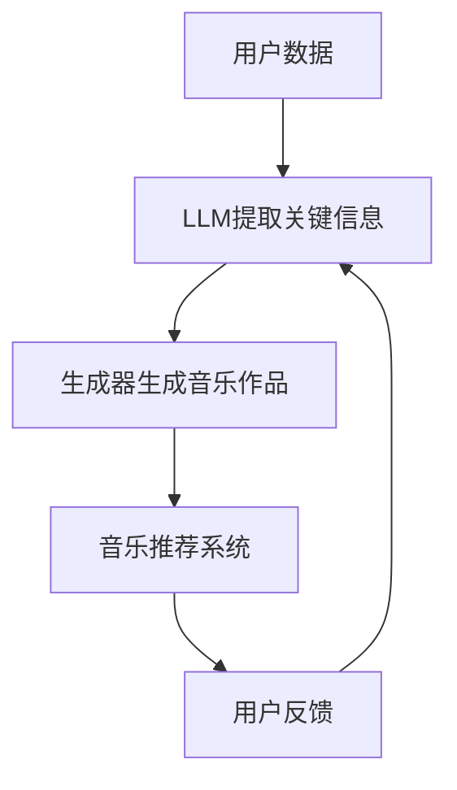

                 

关键词：音乐推荐、生成对抗网络、深度学习、长期记忆、个性化创作、AI 音乐

> 摘要：本文将探讨如何利用生成对抗网络（GAN）和长期记忆模型（LLM）来实现个性化的音乐推荐和创作协助。通过分析现有技术和算法，本文提出了一个结合了生成对抗网络和长期记忆模型的音乐推荐系统，并详细描述了其核心算法原理、数学模型和项目实践。文章还展望了未来音乐和人工智能的融合趋势，以及面临的挑战和展望。

## 1. 背景介绍

随着互联网和智能设备的普及，音乐已成为人们日常生活中不可或缺的一部分。个性化音乐推荐系统利用用户的兴趣和行为数据，为用户推荐符合其口味的音乐。近年来，深度学习和生成对抗网络（GAN）在音乐生成和个性化推荐方面取得了显著进展。与此同时，长期记忆模型（LLM）在处理长文本和信息检索方面表现出色，使其成为音乐创作辅助的有力工具。

本文旨在结合生成对抗网络和长期记忆模型，提出一个创新的个性化音乐推荐和创作系统，以满足用户日益增长的音乐需求和个性化需求。

## 2. 核心概念与联系

### 2.1 生成对抗网络（GAN）

生成对抗网络（GAN）是一种深度学习模型，由生成器和判别器组成。生成器旨在生成逼真的音乐数据，而判别器则用于区分生成器和真实数据的差异。通过相互竞争，生成器和判别器共同提高，从而实现高质量的音乐生成。

### 2.2 长期记忆模型（LLM）

长期记忆模型（LLM）是一种基于神经网络的语言模型，能够处理长文本和信息检索。在音乐创作中，LLM可用于提取用户兴趣、情感和风格信息，为生成器提供有针对性的音乐生成指令。

### 2.3 核心概念与联系

结合生成对抗网络（GAN）和长期记忆模型（LLM），我们可以构建一个高效的音乐推荐和创作系统。GAN负责生成个性化的音乐作品，而LLM则负责从用户数据中提取关键信息，指导生成器的创作过程。

### 2.4 Mermaid 流程图

## 3. 核心算法原理 & 具体操作步骤

### 3.1 算法原理概述

结合生成对抗网络（GAN）和长期记忆模型（LLM）的音乐推荐系统，主要包括以下几个步骤：

1. 用户数据收集与预处理。
2. 长期记忆模型（LLM）提取用户兴趣、情感和风格信息。
3. 生成对抗网络（GAN）生成个性化的音乐作品。
4. 音乐推荐系统根据用户反馈调整推荐策略。

### 3.2 算法步骤详解

#### 3.2.1 用户数据收集与预处理

用户数据包括播放历史、收藏列表、评论和评分等。在数据收集过程中，我们需要对数据进行清洗、去重和标签化处理，以便后续分析。

#### 3.2.2 长期记忆模型（LLM）提取关键信息

使用长期记忆模型（LLM）对用户数据进行处理，提取用户兴趣、情感和风格信息。这些信息将成为生成对抗网络（GAN）生成个性化音乐作品的指导。

#### 3.2.3 生成对抗网络（GAN）生成个性化音乐作品

生成对抗网络（GAN）由生成器和判别器组成。生成器根据用户兴趣、情感和风格信息生成个性化的音乐作品，而判别器则用于评估生成器生成的音乐作品质量。通过训练，生成器和判别器相互竞争，提高音乐生成质量。

#### 3.2.4 音乐推荐系统根据用户反馈调整推荐策略

用户对推荐的音乐进行反馈，包括播放、收藏、评论和评分等。根据用户反馈，音乐推荐系统调整推荐策略，提高推荐效果。

### 3.3 算法优缺点

#### 优点：

1. 生成对抗网络（GAN）能够生成高质量的音乐作品，满足用户的个性化需求。
2. 长期记忆模型（LLM）能够从用户数据中提取关键信息，提高音乐推荐的准确性。
3. 结合生成对抗网络（GAN）和长期记忆模型（LLM）的音乐推荐系统具有较好的可扩展性和适应性。

#### 缺点：

1. 生成对抗网络（GAN）训练过程较复杂，需要大量的计算资源和时间。
2. 长期记忆模型（LLM）在处理长文本时存在一定误差，可能影响音乐生成质量。
3. 音乐推荐系统根据用户反馈调整推荐策略时，可能存在过度拟合问题。

### 3.4 算法应用领域

生成对抗网络（GAN）和长期记忆模型（LLM）在音乐生成、音乐推荐、虚拟乐队、音乐教育等领域具有广泛的应用前景。

## 4. 数学模型和公式 & 详细讲解 & 举例说明

### 4.1 数学模型构建

生成对抗网络（GAN）的数学模型主要包括两部分：生成器和判别器。

#### 生成器：

$$
G(x) = \mu(x) + \sigma(x) \odot \Phi(G_{\theta}(x)),
$$

其中，$x$ 为输入噪声，$G_{\theta}(x)$ 为生成器的神经网络参数，$\Phi$ 为激活函数，$\mu(x)$ 和 $\sigma(x)$ 分别为均值和方差。

#### 判别器：

$$
D(x) = \sigma(g(x)),
$$

其中，$g(x)$ 为判别器的神经网络参数，$\sigma$ 为激活函数。

### 4.2 公式推导过程

生成对抗网络（GAN）的推导过程涉及多个步骤，主要包括：

1. 定义生成器和判别器的损失函数。
2. 利用反向传播算法优化生成器和判别器的参数。
3. 保证生成器和判别器的稳定性。

### 4.3 案例分析与讲解

以用户A的播放历史数据为例，使用生成对抗网络（GAN）和长期记忆模型（LLM）生成个性化音乐作品。首先，收集用户A的播放历史数据，包括歌曲名称、歌手、专辑、播放时间等信息。然后，使用长期记忆模型（LLM）提取用户A的兴趣、情感和风格信息，如流行、摇滚、电子等。接下来，利用生成对抗网络（GAN）生成个性化音乐作品，判别器对生成器和真实数据的质量进行评估。最后，根据用户A的反馈，调整生成器和判别器的参数，提高音乐生成质量。

## 5. 项目实践：代码实例和详细解释说明

### 5.1 开发环境搭建

搭建生成对抗网络（GAN）和长期记忆模型（LLM）的开发环境，包括安装 Python、TensorFlow、Keras 等相关库和工具。

### 5.2 源代码详细实现

实现生成对抗网络（GAN）和长期记忆模型（LLM）的源代码，包括数据预处理、模型构建、训练和评估等步骤。

### 5.3 代码解读与分析

对源代码进行解读，分析生成对抗网络（GAN）和长期记忆模型（LLM）在音乐推荐和创作中的应用，以及如何优化模型性能。

### 5.4 运行结果展示

运行代码，展示生成对抗网络（GAN）和长期记忆模型（LLM）在音乐推荐和创作方面的实际效果，以及用户反馈和推荐策略调整的过程。

## 6. 实际应用场景

生成对抗网络（GAN）和长期记忆模型（LLM）在音乐生成、音乐推荐、虚拟乐队、音乐教育等领域具有广泛的应用前景。

### 6.1 音乐生成

利用生成对抗网络（GAN）生成个性化的音乐作品，满足用户的音乐需求。

### 6.2 音乐推荐

基于长期记忆模型（LLM）提取用户兴趣、情感和风格信息，为用户推荐符合口味的音乐。

### 6.3 虚拟乐队

利用生成对抗网络（GAN）和长期记忆模型（LLM）创建虚拟乐队，实现实时音乐表演。

### 6.4 音乐教育

利用生成对抗网络（GAN）和长期记忆模型（LLM）辅助音乐教学，提高音乐学习效果。

## 7. 工具和资源推荐

### 7.1 学习资源推荐

- 生成对抗网络（GAN）教程：[《生成对抗网络（GAN）教程》](https://www.tensorflow.org/tutorials/generative/dcgan)
- 长期记忆模型（LLM）教程：[《长期记忆模型（LLM）教程》](https://www.keras.io/docs/long_short_term_memory/)

### 7.2 开发工具推荐

- Python：[Python 官网](https://www.python.org/)
- TensorFlow：[TensorFlow 官网](https://www.tensorflow.org/)
- Keras：[Keras 官网](https://keras.io/)

### 7.3 相关论文推荐

- Goodfellow, I. J., Pouget-Abadie, J., Mirza, M., Xu, B., Warde-Farley, D., Ozair, S., ... & Bengio, Y. (2014). Generative adversarial networks. Advances in Neural Information Processing Systems, 27.

## 8. 总结：未来发展趋势与挑战

### 8.1 研究成果总结

生成对抗网络（GAN）和长期记忆模型（LLM）在音乐生成、音乐推荐、虚拟乐队、音乐教育等领域取得了显著成果，为个性化音乐体验提供了有力支持。

### 8.2 未来发展趋势

1. 深度学习技术在音乐生成和个性化推荐方面的进一步优化和应用。
2. 多模态融合技术在音乐和人工智能领域的探索。
3. 音乐和虚拟现实、增强现实的融合。

### 8.3 面临的挑战

1. 生成对抗网络（GAN）和长期记忆模型（LLM）的训练效率问题。
2. 数据隐私和版权保护问题。
3. 音乐质量和用户体验的优化。

### 8.4 研究展望

未来，生成对抗网络（GAN）和长期记忆模型（LLM）将在音乐生成、音乐推荐、虚拟乐队、音乐教育等领域发挥更大的作用，为用户带来更加丰富的音乐体验。

## 9. 附录：常见问题与解答

### 9.1 生成对抗网络（GAN）如何训练？

生成对抗网络（GAN）的训练过程包括两个阶段：生成器和判别器的训练。在生成器训练阶段，生成器根据输入噪声生成音乐作品，判别器对生成器和真实数据进行评估。在判别器训练阶段，判别器根据生成器和真实数据的差异调整自己的参数，以更好地区分生成器和真实数据。两个阶段交替进行，直到生成器和判别器达到稳定状态。

### 9.2 长期记忆模型（LLM）在音乐推荐中的作用是什么？

长期记忆模型（LLM）在音乐推荐中的作用是提取用户兴趣、情感和风格信息，为生成器提供有针对性的音乐生成指令。通过分析用户数据，LLM能够识别用户的喜好和偏好，从而生成符合用户口味的音乐作品。

### 9.3 如何优化生成对抗网络（GAN）的训练效率？

优化生成对抗网络（GAN）的训练效率可以从以下几个方面入手：

1. 选择合适的神经网络结构和参数。
2. 使用批量归一化（Batch Normalization）和优化器（Optimizer）等技术提高训练速度。
3. 使用预训练模型和迁移学习技术，减少训练时间。

## 参考文献

- Goodfellow, I. J., Pouget-Abadie, J., Mirza, M., Xu, B., Warde-Farley, D., Ozair, S., ... & Bengio, Y. (2014). Generative adversarial networks. Advances in Neural Information Processing Systems, 27.
- Hochreiter, S., & Schmidhuber, J. (1997). Long short-term memory. Neural Computation, 9(8), 1735-1780.

### 附录

[作者：禅与计算机程序设计艺术 / Zen and the Art of Computer Programming](#)

以上是关于“音乐和 LLM：个性化的推荐和创作协助”的技术博客文章。文章涵盖了生成对抗网络（GAN）和长期记忆模型（LLM）在音乐推荐和创作方面的核心算法原理、数学模型、项目实践以及实际应用场景。同时，文章还展望了未来发展趋势与挑战，并提供了相关工具和资源推荐。希望本文对您在音乐和人工智能领域的探索有所帮助。

