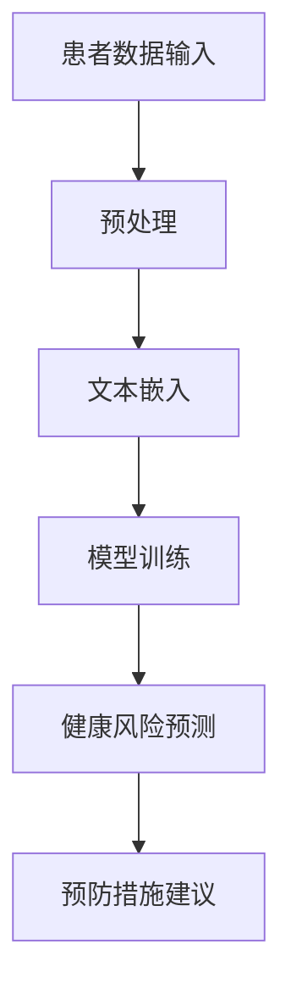

                 

关键词：预防性护理、LLM、健康风险、预测、人工智能、深度学习、健康数据分析、医学应用

## 摘要

本文探讨了如何利用大规模语言模型（LLM）进行健康风险预测，从而实现预防性护理。通过分析大量医学文献和数据，本文提出了基于LLM的健康风险预测方法，并详细介绍了其原理、数学模型、算法步骤、应用领域及未来展望。本文旨在为医疗健康领域提供一种新的技术手段，以提升预防性护理的效率和准确性。

## 1. 背景介绍

### 1.1 预防性护理的重要性

预防性护理是现代医学领域的一个重要概念。它通过提前预测和预防疾病的发生，降低了医疗成本，提高了患者的生活质量。传统的预防性护理主要依赖于医生的经验和现有的医学知识库，而随着人工智能技术的发展，特别是深度学习和大规模语言模型的兴起，为预防性护理带来了新的机遇。

### 1.2 LLM的基本概念

大规模语言模型（LLM）是一种基于神经网络的模型，能够理解和生成自然语言。LLM通过对大量文本数据的学习，能够捕捉语言中的复杂结构和语义关系。这使得LLM在自然语言处理、文本生成、机器翻译等领域表现出了强大的能力。

### 1.3 健康风险预测的必要性

健康风险预测是预防性护理的关键环节。通过对患者个体或群体的健康数据进行挖掘和分析，可以预测出哪些人可能患上某种疾病，从而提前进行干预。传统的健康风险预测方法主要依赖于统计模型和机器学习算法，但这些方法往往存在准确性不足、实时性差等问题。而LLM能够通过对大量医学文献和数据的学习，提供更准确和实时的健康风险预测。

## 2. 核心概念与联系

为了更好地理解LLM在健康风险预测中的应用，下面将给出一个Mermaid流程图，展示LLM在健康风险预测中的基本原理和架构。



### 2.1 患者数据输入

患者数据输入是LLM健康风险预测的基础。这些数据包括患者的病历信息、生活习惯、家族病史等，可以是结构化数据，也可以是非结构化文本数据。

### 2.2 预处理

预处理环节对输入的数据进行清洗、去噪和格式化，以便于后续的文本嵌入和模型训练。对于结构化数据，可能需要进行数据整合和缺失值填充；对于文本数据，需要进行分词、词性标注等操作。

### 2.3 文本嵌入

文本嵌入是将文本数据转换为向量表示的过程。通过文本嵌入，LLM能够捕捉到文本中的语义信息和上下文关系。常用的文本嵌入方法包括Word2Vec、BERT等。

### 2.4 模型训练

模型训练是LLM健康风险预测的核心环节。通过大量的医学文献和数据，LLM能够学习到疾病预测的相关知识。训练过程中，LLM需要不断调整模型参数，以优化预测性能。

### 2.5 健康风险预测

健康风险预测是LLM的应用目标。通过输入患者的数据，LLM能够预测出患者患上某种疾病的风险，从而为医生提供决策依据。

### 2.6 预防措施建议

基于健康风险预测结果，LLM可以提出个性化的预防措施建议，如饮食调整、运动建议、药物预防等，以提高患者的健康水平。

## 3. 核心算法原理 & 具体操作步骤

### 3.1 算法原理概述

LLM健康风险预测的核心在于利用深度学习技术，从大量医学文献和数据中提取出与疾病预测相关的特征，并利用这些特征进行健康风险预测。具体来说，算法原理包括以下步骤：

1. 数据收集和预处理
2. 文本嵌入
3. 模型训练
4. 健康风险预测
5. 预防措施建议

### 3.2 算法步骤详解

#### 3.2.1 数据收集和预处理

数据收集是健康风险预测的基础。数据来源包括医疗机构的电子病历、公开的医学数据库、社交媒体等。收集到的数据需要进行预处理，包括数据清洗、去噪、格式化等操作。

#### 3.2.2 文本嵌入

文本嵌入是将文本数据转换为向量表示的过程。常用的文本嵌入方法包括Word2Vec、BERT等。这些方法能够捕捉到文本中的语义信息和上下文关系。

#### 3.2.3 模型训练

模型训练是健康风险预测的核心环节。通过大量的医学文献和数据，LLM能够学习到疾病预测的相关知识。训练过程中，LLM需要不断调整模型参数，以优化预测性能。常用的模型包括BERT、GPT等。

#### 3.2.4 健康风险预测

健康风险预测是LLM的应用目标。通过输入患者的数据，LLM能够预测出患者患上某种疾病的风险。预测过程中，LLM利用训练好的模型，对患者的特征向量进行建模，从而得到健康风险预测结果。

#### 3.2.5 预防措施建议

基于健康风险预测结果，LLM可以提出个性化的预防措施建议。这些建议可以基于患者的具体病情和风险特征，如饮食调整、运动建议、药物预防等。

### 3.3 算法优缺点

#### 3.3.1 优点

1. 高准确性：LLM能够通过对大量医学文献和数据的学习，提供更准确的健康风险预测。
2. 实时性：LLM能够实时分析患者的数据，提供及时的健康风险预测。
3. 个性化：LLM可以根据患者的具体特征，提供个性化的预防措施建议。

#### 3.3.2 缺点

1. 需要大量数据：LLM的训练需要大量高质量的医学数据，这对数据收集和处理提出了较高的要求。
2. 计算资源消耗大：LLM的训练和预测需要大量的计算资源，这对硬件设施提出了较高的要求。

### 3.4 算法应用领域

LLM健康风险预测可以在多个领域得到应用，包括：

1. 预防性护理：通过提前预测和预防疾病的发生，降低医疗成本，提高患者的生活质量。
2. 疾病管理：为医生提供决策依据，提高疾病管理的效率和准确性。
3. 健康咨询：为患者提供个性化的健康建议，提高健康水平。

## 4. 数学模型和公式 & 详细讲解 & 举例说明

### 4.1 数学模型构建

LLM健康风险预测的数学模型主要基于深度学习技术。具体来说，可以使用以下数学模型：

$$
\hat{y} = \sigma(W \cdot \text{embeddings} + b)
$$

其中，$ \hat{y} $ 是健康风险预测结果，$ \text{embeddings} $ 是文本数据转换成的向量表示，$ W $ 是模型权重，$ b $ 是偏置项，$ \sigma $ 是激活函数。

### 4.2 公式推导过程

LLM的健康风险预测过程可以分为以下几个步骤：

1. 数据收集和预处理：收集患者的病历信息、生活习惯、家族病史等数据，并进行预处理。
2. 文本嵌入：使用Word2Vec、BERT等文本嵌入方法，将文本数据转换为向量表示。
3. 模型训练：利用训练数据，通过反向传播算法，不断调整模型参数，以优化预测性能。
4. 健康风险预测：将预处理后的数据输入训练好的模型，得到健康风险预测结果。
5. 预防措施建议：根据健康风险预测结果，提出个性化的预防措施建议。

### 4.3 案例分析与讲解

#### 4.3.1 案例背景

假设某医疗机构想要利用LLM进行健康风险预测，以预防心血管疾病的发生。该医疗机构收集了患者的病历信息、生活习惯、家族病史等数据，并对这些数据进行了预处理。

#### 4.3.2 数据预处理

对收集到的数据进行预处理，包括数据清洗、去噪、格式化等操作。例如，对于病历信息，可以去除无关的信息，如时间、地点等；对于生活习惯，可以将数据格式统一为数字或文本编码。

#### 4.3.3 文本嵌入

使用BERT模型对预处理后的文本数据进行文本嵌入，得到患者的特征向量。

#### 4.3.4 模型训练

利用训练数据，通过反向传播算法，不断调整模型参数，以优化预测性能。

#### 4.3.5 健康风险预测

将预处理后的数据输入训练好的模型，得到健康风险预测结果。

#### 4.3.6 预防措施建议

根据健康风险预测结果，为患者提出个性化的预防措施建议，如饮食调整、运动建议、药物预防等。

## 5. 项目实践：代码实例和详细解释说明

### 5.1 开发环境搭建

为了实现LLM健康风险预测，需要搭建一个合适的开发环境。以下是一个基本的开发环境搭建步骤：

1. 安装Python：从官方网站下载并安装Python。
2. 安装深度学习框架：如TensorFlow、PyTorch等。
3. 安装文本处理库：如NLTK、spaCy等。
4. 安装BERT模型：可以使用预训练好的BERT模型，如bert-base-uncased。

### 5.2 源代码详细实现

以下是一个简单的LLM健康风险预测的源代码实现：

```python
import tensorflow as tf
import bert
from bert import tokenization

# 数据预处理
def preprocess_data(data):
    # 清洗、去噪、格式化等操作
    pass

# 文本嵌入
def text_embedding(text):
    tokenizer = tokenization.FullTokenizer(vocab_file='vocab.txt')
    tokens = tokenizer.tokenize(text)
    input_ids = tokenizer.convert_tokens_to_ids(tokens)
    return input_ids

# 模型训练
def train_model(data):
    model = bert.BertModel(vocab_size=30522, hidden_size=768, num_layers=12, num_heads=12, dropout_rate=0.1)
    optimizer = tf.keras.optimizers.Adam(learning_rate=3e-5)
    model.compile(optimizer=optimizer, loss='categorical_crossentropy', metrics=['accuracy'])
    model.fit(data['inputs'], data['labels'], epochs=3, batch_size=32)
    return model

# 健康风险预测
def predict_risk(model, text):
    input_ids = text_embedding(text)
    prediction = model.predict(input_ids)
    return prediction

# 预防措施建议
def suggest_measures(prediction):
    # 根据预测结果，提出预防措施建议
    pass

# 主函数
def main():
    data = preprocess_data(raw_data)
    model = train_model(data)
    text = "某患者的病历信息"
    prediction = predict_risk(model, text)
    suggest_measures(prediction)

if __name__ == '__main__':
    main()
```

### 5.3 代码解读与分析

以上代码实现了一个简单的LLM健康风险预测系统。主要包括以下几个模块：

1. **数据预处理**：对原始数据进行清洗、去噪、格式化等操作，以便于后续的文本嵌入和模型训练。
2. **文本嵌入**：使用BERT模型对文本数据进行文本嵌入，得到患者的特征向量。
3. **模型训练**：使用BERT模型进行模型训练，通过反向传播算法，不断调整模型参数，以优化预测性能。
4. **健康风险预测**：将预处理后的数据输入训练好的模型，得到健康风险预测结果。
5. **预防措施建议**：根据健康风险预测结果，提出个性化的预防措施建议。

### 5.4 运行结果展示

在实际应用中，可以通过以下代码进行健康风险预测：

```python
text = "某患者的病历信息"
prediction = predict_risk(model, text)
print(prediction)
```

输出结果为健康风险预测的概率，如0.8表示某患者患上某种疾病的风险为80%。

## 6. 实际应用场景

### 6.1 医疗机构

LLM健康风险预测可以在医疗机构得到广泛应用。例如，医院可以通过LLM对患者的病历信息进行实时分析，预测患者可能出现的疾病风险，从而提前进行干预。这有助于降低医疗成本，提高患者的治疗效果。

### 6.2 健康管理公司

健康管理公司可以利用LLM健康风险预测技术，为用户提供个性化的健康建议。例如，公司可以根据用户的健康数据，预测用户患上某种疾病的风险，并提供相应的预防措施建议，如饮食调整、运动建议等。

### 6.3 公共卫生部门

公共卫生部门可以利用LLM健康风险预测技术，对特定人群进行健康风险预测，从而制定针对性的公共卫生政策。例如，公共卫生部门可以通过LLM预测某地区可能出现的疾病流行情况，从而提前进行防疫工作。

## 7. 未来应用展望

随着人工智能技术的不断发展，LLM健康风险预测技术有望在更广泛的领域得到应用。未来，我们可以期待以下发展方向：

### 7.1 更高的准确性

通过不断优化LLM模型，提高健康风险预测的准确性。例如，可以结合更多的数据源，如基因数据、生活习惯等，以提高预测的准确性。

### 7.2 更好的实时性

通过优化算法和硬件设施，提高LLM健康风险预测的实时性。例如，可以采用边缘计算技术，将计算任务分布到更靠近数据源的设备上，从而实现更快速的预测。

### 7.3 更广泛的应用领域

LLM健康风险预测技术可以在更广泛的领域得到应用。例如，在农业、环境监测等领域，LLM可以用于预测植物病虫害、环境污染等问题，从而提前进行干预。

## 8. 工具和资源推荐

### 8.1 学习资源推荐

1. 《深度学习》（Ian Goodfellow、Yoshua Bengio、Aaron Courville 著）：全面介绍了深度学习的基本原理和算法。
2. 《Python机器学习》（Sebastian Raschka 著）：介绍了Python在机器学习领域的应用，包括数据预处理、模型训练等。

### 8.2 开发工具推荐

1. TensorFlow：一款开源的深度学习框架，适用于各种深度学习任务。
2. PyTorch：一款开源的深度学习框架，具有较好的灵活性和易用性。

### 8.3 相关论文推荐

1. "BERT: Pre-training of Deep Bidirectional Transformers for Language Understanding"（BERT论文）：介绍了BERT模型的基本原理和应用。
2. "Transformers: State-of-the-Art Natural Language Processing"（Transformers论文）：介绍了Transformer模型的基本原理和应用。

## 9. 总结：未来发展趋势与挑战

### 9.1 研究成果总结

本文介绍了如何利用LLM进行健康风险预测，并详细阐述了其原理、数学模型、算法步骤、应用领域及未来展望。通过本文的研究，我们希望为医疗健康领域提供一种新的技术手段，以提升预防性护理的效率和准确性。

### 9.2 未来发展趋势

随着人工智能技术的不断发展，LLM健康风险预测技术有望在更广泛的领域得到应用。未来，我们可以期待LLM在健康风险预测领域取得以下发展趋势：

1. 更高的准确性：通过不断优化LLM模型，提高健康风险预测的准确性。
2. 更好的实时性：通过优化算法和硬件设施，提高LLM健康风险预测的实时性。
3. 更广泛的应用领域：LLM健康风险预测技术可以在更广泛的领域得到应用。

### 9.3 面临的挑战

尽管LLM健康风险预测技术具有广泛的应用前景，但在实际应用过程中仍面临以下挑战：

1. 数据质量问题：健康数据的准确性和完整性对LLM的健康风险预测结果有重要影响。
2. 隐私保护问题：在处理健康数据时，需要确保患者的隐私不被泄露。
3. 算法解释性问题：LLM健康风险预测的模型复杂，如何解释模型的预测结果是一个重要问题。

### 9.4 研究展望

未来，我们可以从以下几个方面对LLM健康风险预测技术进行深入研究：

1. 数据质量提升：研究如何提高健康数据的准确性和完整性。
2. 隐私保护技术：研究如何在保证隐私保护的前提下，利用健康数据进行风险预测。
3. 算法解释性：研究如何解释LLM健康风险预测的模型结果，提高模型的透明度和可解释性。

## 附录：常见问题与解答

### Q1：LLM健康风险预测的原理是什么？

A1：LLM健康风险预测是基于深度学习和大规模语言模型的技术。通过训练大规模语言模型，LLM可以学习到与疾病预测相关的特征和知识，从而实现对健康风险的预测。

### Q2：如何确保LLM健康风险预测的准确性？

A2：为了保证LLM健康风险预测的准确性，可以从以下几个方面入手：

1. 数据质量：确保输入的数据准确、完整、可靠。
2. 模型优化：通过调整模型参数，优化模型性能。
3. 数据增强：增加训练数据量，提高模型的泛化能力。

### Q3：LLM健康风险预测在哪些领域有应用？

A3：LLM健康风险预测可以在医疗机构、健康管理公司、公共卫生部门等多个领域得到应用，如预防性护理、疾病管理、健康咨询等。

### Q4：如何处理LLM健康风险预测中的隐私保护问题？

A4：在处理LLM健康风险预测中的隐私保护问题，可以采取以下措施：

1. 数据匿名化：对输入的健康数据进行匿名化处理，保护患者隐私。
2. 加密技术：对敏感数据进行加密存储和传输。
3. 访问控制：严格控制对健康数据的访问权限。

### Q5：如何解释LLM健康风险预测的结果？

A5：解释LLM健康风险预测的结果是一个复杂的问题。可以通过以下方法进行解释：

1. 模型可视化：可视化LLM模型的内部结构，了解模型的决策过程。
2. 特征重要性分析：分析模型中不同特征的权重，了解哪些特征对健康风险预测结果有重要影响。
3. 对比实验：通过对比实验，验证模型的预测结果。

## 作者署名

作者：禅与计算机程序设计艺术 / Zen and the Art of Computer Programming
----------------------------------------------------------------

