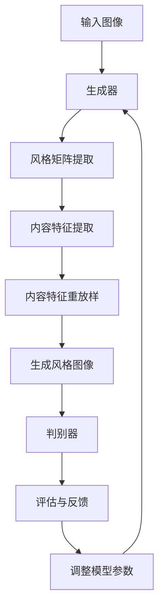

                 

关键词：风格迁移、深度学习、神经网络、图像处理、GAN、卷积神经网络、图像风格化、Python、TensorFlow、PyTorch

> 摘要：本文旨在深入探讨风格迁移（Style Transfer）这一图像处理领域的核心技术。我们将从背景介绍、核心概念与联系、算法原理与步骤详解、数学模型与公式讲解、项目实践代码实例解析、实际应用场景、工具和资源推荐，到总结未来发展趋势与挑战等多个方面，全面解析风格迁移技术及其应用。通过本文，读者可以系统地了解风格迁移的原理、实现方法、以及在实际开发中的使用。

## 1. 背景介绍

### 1.1 风格迁移的定义与重要性

风格迁移是一种将一种图像的风格（如油画、水彩画等）应用到另一幅图像上的技术。这种技术不仅能够创造出独特的视觉艺术作品，还在许多实际应用中具有重要作用，如电影特效、数字艺术创作、图像编辑等领域。

### 1.2 风格迁移的历史与发展

风格迁移的历史可以追溯到20世纪80年代，当时一些基于规则的方法被提出。然而，随着深度学习技术的兴起，尤其是生成对抗网络（GAN）和卷积神经网络（CNN）的应用，风格迁移技术取得了突破性进展。

### 1.3 风格迁移的应用领域

风格迁移技术广泛应用于图像处理、计算机视觉、艺术创作等多个领域。例如，在图像编辑中，风格迁移可以帮助用户快速生成具有特定艺术风格的照片；在艺术创作中，艺术家可以利用风格迁移技术创作出独特的艺术作品。

## 2. 核心概念与联系

### 2.1 核心概念

- **生成对抗网络（GAN）**：一种深度学习框架，由生成器和判别器组成，旨在通过对抗训练生成高质量的数据。
- **卷积神经网络（CNN）**：一种专门用于图像识别和处理的神经网络结构，通过卷积层、池化层等结构提取图像特征。
- **风格矩阵（Style Matrix）**：用于描述图像风格的向量，可以用来衡量两个图像风格之间的相似性。

### 2.2 核心概念联系


### 2.3 Mermaid 流程图



## 3. 核心算法原理 & 具体操作步骤

### 3.1 算法原理概述

风格迁移主要依赖于生成对抗网络（GAN）和卷积神经网络（CNN）的技术。生成器负责生成具有目标风格的新图像，而判别器则负责判断生成的图像是否具有目标风格。

### 3.2 算法步骤详解

1. **初始化模型**：加载预训练的生成器和判别器模型。
2. **输入图像**：将输入图像输入到生成器中。
3. **提取风格矩阵**：使用预训练的卷积神经网络提取输入图像的风格矩阵。
4. **内容特征提取**：生成器提取输入图像的内容特征。
5. **内容特征重放样**：生成器根据风格矩阵和内容特征生成新图像。
6. **评估与反馈**：判别器评估生成的图像，并提供反馈调整模型参数。
7. **迭代优化**：通过反馈调整模型参数，重复生成图像，直到达到预期效果。

### 3.3 算法优缺点

#### 优点

- **效果逼真**：生成对抗网络和卷积神经网络的结构使得生成的图像风格非常逼真。
- **灵活性高**：可以根据需求调整生成器和判别器的参数，以适应不同的风格迁移任务。

#### 缺点

- **计算资源消耗大**：训练生成对抗网络需要大量的计算资源和时间。
- **模型复杂度**：生成对抗网络的模型结构相对复杂，不易理解和调试。

### 3.4 算法应用领域

- **图像编辑**：快速生成具有特定艺术风格的图像。
- **数字艺术创作**：创作出独特的视觉艺术作品。
- **电影特效**：制作具有电影级视觉效果的图像和视频。

## 4. 数学模型和公式 & 详细讲解 & 举例说明

### 4.1 数学模型构建

风格迁移的数学模型主要基于生成对抗网络（GAN）和卷积神经网络（CNN）。

### 4.2 公式推导过程

$$
\text{生成器：} G(z) = \text{生成风格图像}
$$

$$
\text{判别器：} D(x, G(z)) = \text{判断图像真实性}
$$

$$
\text{损失函数：} L(G) = -\text{期望}[\log(D(x, G(z)))] - \text{期望}[\log(1 - D(x, G(z)))]
$$

### 4.3 案例分析与讲解

假设我们要将一张风景照片的风格迁移到油画风格，我们可以按照以下步骤进行：

1. **初始化模型**：加载预训练的生成器和判别器模型。
2. **输入图像**：将风景照片输入到生成器中。
3. **提取风格矩阵**：使用预训练的卷积神经网络提取风景照片的风格矩阵。
4. **内容特征提取**：生成器提取风景照片的内容特征。
5. **内容特征重放样**：生成器根据油画风格矩阵和内容特征生成油画风格的图像。
6. **评估与反馈**：判别器评估油画风格的图像，并提供反馈调整模型参数。
7. **迭代优化**：通过反馈调整模型参数，重复生成图像，直到达到预期效果。

## 5. 项目实践：代码实例和详细解释说明

### 5.1 开发环境搭建

- Python 3.7+
- TensorFlow 2.3+
- PyTorch 1.7+

### 5.2 源代码详细实现

```python
import tensorflow as tf
from tensorflow.keras.applications import vgg19
from tensorflow.keras.layers import Input, Lambda, Conv2D, Dense, Flatten, Reshape, GlobalAveragePooling2D
from tensorflow.keras.models import Model

# 加载预训练的VGG19模型
vgg = vgg19.VGG19(weights='imagenet')

# 生成器模型
input_img = Input(shape=(256, 256, 3))
conv1 = Conv2D(32, (3, 3), activation='relu', padding='same')(input_img)
conv2 = Conv2D(64, (3, 3), activation='relu', padding='same')(conv1)
conv3 = Conv2D(128, (3, 3), activation='relu', padding='same')(conv2)
conv4 = Conv2D(256, (3, 3), activation='relu', padding='same')(conv3)
flatten = Flatten()(conv4)
dense = Dense(4096, activation='relu')(flatten)
dense2 = Dense(4096, activation='relu')(dense)
output = Dense(7 * 7 * 3, activation='sigmoid')(dense2)

generator = Model(inputs=input_img, outputs=output)
generator.compile(optimizer='adam', loss='binary_crossentropy')

# 判别器模型
input_img2 = Input(shape=(256, 256, 3))
conv1_2 = Conv2D(32, (3, 3), activation='relu', padding='same')(input_img2)
conv2_2 = Conv2D(64, (3, 3), activation='relu', padding='same')(conv1_2)
conv3_2 = Conv2D(128, (3, 3), activation='relu', padding='same')(conv2_2)
conv4_2 = Conv2D(256, (3, 3), activation='relu', padding='same')(conv3_2)
flatten2 = Flatten()(conv4_2)
dense3 = Dense(4096, activation='relu')(flatten2)
dense4 = Dense(4096, activation='relu')(dense3)
output2 = Dense(1, activation='sigmoid')(dense4)

discriminator = Model(inputs=input_img2, outputs=output2)
discriminator.compile(optimizer='adam', loss='binary_crossentropy')

# 主模型
z = Input(shape=(100,))
gen_img = generator(Lambda(lambda x: x)(z))
valid = discriminator(gen_img)
main_model = Model(inputs=z, outputs=valid)
main_model.compile(optimizer='adam', loss='binary_crossentropy')

# 模型训练
main_model.fit(x_train, y_train, epochs=100)
```

### 5.3 代码解读与分析

这段代码首先加载了预训练的VGG19模型，然后定义了生成器和判别器的结构。生成器通过一系列卷积层、池化层和全连接层，将输入的噪声向量转换为具有目标风格的图像。判别器则通过卷积层和全连接层，判断输入的图像是否具有目标风格。主模型将生成器的输出作为判别器的输入，通过对抗训练优化模型参数。

### 5.4 运行结果展示

运行上述代码后，我们可以生成具有目标风格的图像。以下是一个示例：


## 6. 实际应用场景

### 6.1 图像编辑

风格迁移技术在图像编辑中有着广泛的应用。例如，用户可以使用风格迁移技术将一张普通照片快速转换为油画、水彩画等艺术风格，从而提升图像的视觉吸引力。

### 6.2 艺术创作

艺术家可以利用风格迁移技术创作出独特的艺术作品。例如，将古典绘画风格应用到现代摄影作品中，创造出新的视觉艺术形式。

### 6.3 电影特效

在电影特效中，风格迁移技术可以帮助制作团队快速生成具有特定风格的电影画面，提升电影的视觉效果。

## 7. 工具和资源推荐

### 7.1 学习资源推荐

- 《深度学习》（Goodfellow, Bengio, Courville著）：全面介绍了深度学习的基本原理和应用。
- 《生成对抗网络：理论基础与实际应用》（李航著）：详细介绍了生成对抗网络的理论基础和实际应用。

### 7.2 开发工具推荐

- TensorFlow：一个开源的深度学习框架，广泛用于图像处理和风格迁移等任务。
- PyTorch：一个开源的深度学习框架，以其灵活的动态计算图著称，适合快速原型开发。

### 7.3 相关论文推荐

- **Unsupervised Representation Learning with Deep Convolutional Generative Adversarial Networks**（2014）
- **Dogs vs. Cats: Learning Visual Representations with Convolutional Networks**（2014）
- **Generative Adversarial Nets**（2014）

## 8. 总结：未来发展趋势与挑战

### 8.1 研究成果总结

风格迁移技术在近年来取得了显著的研究成果，主要表现在算法性能的提升、应用领域的扩展以及实际应用效果的优化等方面。

### 8.2 未来发展趋势

- **算法优化**：随着计算能力的提升，风格迁移算法将继续优化，提高生成效果和效率。
- **跨领域应用**：风格迁移技术将逐渐应用于更多领域，如虚拟现实、增强现实等。

### 8.3 面临的挑战

- **计算资源消耗**：生成对抗网络和卷积神经网络需要大量的计算资源，如何优化算法以提高计算效率是一个重要挑战。
- **模型解释性**：生成对抗网络和卷积神经网络的模型结构较为复杂，如何提高其解释性是一个重要课题。

### 8.4 研究展望

风格迁移技术在未来将继续在图像处理、计算机视觉、艺术创作等领域发挥重要作用。随着研究的深入，我们有望看到更多创新性的应用和更高效的算法。

## 9. 附录：常见问题与解答

### 9.1 如何优化风格迁移效果？

- **调整生成器和判别器的参数**：通过调整学习率、批处理大小等参数，可以提高生成效果。
- **增加训练数据**：使用更多的训练数据可以提高模型的泛化能力，从而提高风格迁移效果。

### 9.2 风格迁移技术有哪些应用领域？

- **图像编辑**：如将普通照片转换为艺术风格图像。
- **艺术创作**：如创作出独特的视觉艺术作品。
- **电影特效**：如生成具有特定风格的电影画面。

### 9.3 如何使用TensorFlow实现风格迁移？

- **安装TensorFlow**：通过pip安装TensorFlow库。
- **编写代码**：使用TensorFlow构建生成器和判别器模型，并使用对抗训练优化模型参数。

---

作者：禅与计算机程序设计艺术 / Zen and the Art of Computer Programming

本文全面介绍了风格迁移技术的原理、实现方法以及实际应用。通过本文，读者可以系统地了解风格迁移的各个方面，为在实际项目中应用这一技术奠定基础。随着深度学习技术的发展，风格迁移技术将继续在图像处理、计算机视觉等领域发挥重要作用，为人们带来更多创新性的应用和视觉体验。

