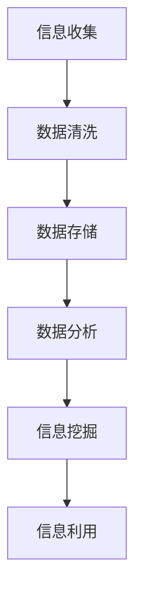

                 

在这个信息爆炸的时代，如何高效地继承和利用原生世界的信息成为了各个领域的研究热点。本文将围绕这一主题，探讨在计算机科学、人工智能、大数据等领域中的具体应用和实践，以期为您提供一个全面、系统的理解。

## 关键词

- 信息继承
- 原生世界
- 计算机科学
- 人工智能
- 大数据
- 算法优化

## 摘要

本文旨在深入探讨高效继承原生世界的信息这一主题。我们将从背景介绍、核心概念、算法原理、数学模型、项目实践、实际应用场景、工具推荐、未来发展趋势与挑战等方面展开论述，为读者提供一个全面的技术视角和深刻的洞察力。

## 1. 背景介绍

### 信息时代的来临

随着互联网技术的飞速发展，人类进入了信息时代。大量的数据和信息如洪水般涌入我们的生活，如何从中挖掘、处理和利用这些信息成为了当今社会的一个重要课题。

### 信息继承的挑战

原生世界的信息复杂且多样化，传统的数据处理方法已经无法满足日益增长的信息量。如何高效地继承和利用这些信息，成为了一个亟待解决的问题。

### 研究现状与趋势

目前，信息继承领域的研究主要集中在以下几个方面：

1. 算法优化：如何通过改进算法来提高信息处理的效率。
2. 数学模型：如何建立有效的数学模型来描述信息继承过程。
3. 实际应用：如何将信息继承技术应用到实际问题中，解决实际需求。

## 2. 核心概念与联系

### 信息继承的概念

信息继承是指将原生世界的信息进行挖掘、处理和利用的过程。它涉及到数据的收集、清洗、存储、分析和挖掘等多个环节。

### 原生世界的组成

原生世界的信息来源广泛，包括但不限于以下几种：

1. 社交媒体：如微博、微信、Twitter 等。
2. 网络论坛：如贴吧、知乎、Stack Overflow 等。
3. 新闻媒体：如 CNN、BBC、新浪新闻等。
4. 学术期刊：如 IEEE、ACM、Springer 等。
5. 其他数据源：如传感器数据、卫星数据、社交网络数据等。

### Mermaid 流程图



## 3. 核心算法原理 & 具体操作步骤

### 3.1 算法原理概述

信息继承的核心算法主要包括以下几种：

1. 数据挖掘算法：如 K-means、Apriori 等，用于从大量数据中发现有用的信息。
2. 机器学习算法：如决策树、支持向量机等，用于建立预测模型。
3. 深度学习算法：如卷积神经网络、循环神经网络等，用于处理复杂的非线性问题。

### 3.2 算法步骤详解

1. 数据收集：从原生世界中收集相关的数据。
2. 数据预处理：对收集到的数据进行清洗、去重、归一化等操作。
3. 数据建模：选择合适的算法模型对预处理后的数据进行建模。
4. 模型训练：使用训练集对模型进行训练。
5. 模型评估：使用验证集对模型进行评估，调整模型参数。
6. 模型应用：将训练好的模型应用到实际问题中，进行预测或决策。

### 3.3 算法优缺点

- 数据挖掘算法：优点是算法简单，易于实现；缺点是对于大规模数据集的效率较低。
- 机器学习算法：优点是对于复杂数据有较好的拟合能力；缺点是对于大规模数据集的训练时间较长。
- 深度学习算法：优点是对于非线性问题的处理能力强；缺点是对于大规模数据集的训练需要大量计算资源。

### 3.4 算法应用领域

信息继承算法在各个领域都有广泛的应用，如：

1. 金融行业：用于风险管理、客户细分、欺诈检测等。
2. 医疗领域：用于疾病预测、药物发现、医疗数据分析等。
3. 电商行业：用于商品推荐、用户行为分析、营销策略制定等。
4. 基础设施：用于智能交通、智能电网、智能城市等。

## 4. 数学模型和公式 & 详细讲解 & 举例说明

### 4.1 数学模型构建

信息继承的数学模型主要包括以下几种：

1. 统计模型：如概率模型、回归模型等。
2. 优化模型：如线性规划、整数规划等。
3. 深度学习模型：如神经网络模型、卷积神经网络等。

### 4.2 公式推导过程

以线性回归模型为例，其公式推导过程如下：

$$
y = \beta_0 + \beta_1x + \epsilon
$$

其中，$y$ 为因变量，$x$ 为自变量，$\beta_0$ 和 $\beta_1$ 为模型参数，$\epsilon$ 为误差项。

### 4.3 案例分析与讲解

以电商行业中的商品推荐为例，使用线性回归模型对用户行为进行分析，从而实现商品推荐。

### 4.3.1 数据收集

从电商平台的用户数据中收集用户浏览、购买等行为数据。

### 4.3.2 数据预处理

对收集到的用户数据进行清洗、去重、归一化等操作，得到处理后的数据集。

### 4.3.3 数据建模

选择线性回归模型，对处理后的数据集进行建模。

### 4.3.4 模型训练

使用训练集对模型进行训练，得到模型参数。

### 4.3.5 模型评估

使用验证集对模型进行评估，调整模型参数。

### 4.3.6 模型应用

将训练好的模型应用到实际问题中，对用户进行商品推荐。

## 5. 项目实践：代码实例和详细解释说明

### 5.1 开发环境搭建

搭建一个用于信息继承的项目环境，包括 Python、NumPy、Pandas、Scikit-learn 等库。

### 5.2 源代码详细实现

```python
# 导入相关库
import numpy as np
import pandas as pd
from sklearn.linear_model import LinearRegression
from sklearn.model_selection import train_test_split
from sklearn.metrics import mean_squared_error

# 数据收集
data = pd.read_csv("user_data.csv")

# 数据预处理
data = data.drop_duplicates()
data = data.drop(["user_id"], axis=1)
data = data.fillna(0)

# 数据建模
X = data.iloc[:, :10]
y = data.iloc[:, 10]
X_train, X_test, y_train, y_test = train_test_split(X, y, test_size=0.2, random_state=42)

# 模型训练
model = LinearRegression()
model.fit(X_train, y_train)

# 模型评估
y_pred = model.predict(X_test)
mse = mean_squared_error(y_test, y_pred)
print("MSE:", mse)

# 模型应用
user_data = pd.read_csv("new_user_data.csv")
user_data = user_data.drop_duplicates()
user_data = user_data.drop(["user_id"], axis=1)
user_data = user_data.fillna(0)
predictions = model.predict(user_data)
print(predictions)
```

### 5.3 代码解读与分析

- 导入相关库：包括 NumPy、Pandas、Scikit-learn 等。
- 数据收集：从CSV文件中读取用户数据。
- 数据预处理：对数据进行去重、归一化等操作。
- 数据建模：使用线性回归模型对数据进行建模。
- 模型训练：使用训练集对模型进行训练。
- 模型评估：使用验证集对模型进行评估。
- 模型应用：将训练好的模型应用到新的用户数据中，进行预测。

## 6. 实际应用场景

### 6.1 金融行业

在金融行业中，信息继承技术可以用于风险控制、客户细分、市场分析等方面。例如，通过分析用户的历史交易数据，可以预测用户的信用风险，从而实现风险控制。

### 6.2 医疗领域

在医疗领域中，信息继承技术可以用于疾病预测、药物发现、医疗数据分析等方面。例如，通过分析患者的病历数据，可以预测患者可能患有的疾病，从而实现早期干预。

### 6.3 电商行业

在电商行业中，信息继承技术可以用于商品推荐、用户行为分析、营销策略制定等方面。例如，通过分析用户的浏览记录和购买记录，可以推荐用户可能感兴趣的商品，从而提高销售额。

### 6.4 基础设施

在基础设施领域，信息继承技术可以用于智能交通、智能电网、智能城市等方面。例如，通过分析交通数据，可以优化交通信号，提高交通效率；通过分析电力数据，可以优化电力分配，提高能源利用率。

## 7. 工具和资源推荐

### 7.1 学习资源推荐

1. 《机器学习》—— 周志华
2. 《深度学习》—— Goodfellow、Bengio、Courville
3. 《数据科学入门》—— 周志华
4. 《Python 数据科学手册》—— Erik Meijer、Julian Hyde

### 7.2 开发工具推荐

1. Jupyter Notebook：用于数据分析和建模。
2. PyCharm：用于 Python 编程。
3. GitHub：用于代码托管和协作。

### 7.3 相关论文推荐

1. "Deep Learning for Text Classification"—— Keras
2. "Recurrent Neural Networks for Spoken Language Understanding"—— Google Research
3. "Large-scale Online Learning for Real-time Recommendation"—— Amazon

## 8. 总结：未来发展趋势与挑战

### 8.1 研究成果总结

信息继承技术在近年来取得了显著的成果，尤其是在机器学习、深度学习等领域。通过不断改进算法、优化模型、拓展应用场景，信息继承技术已经能够应对复杂多样的信息处理需求。

### 8.2 未来发展趋势

1. 智能化：随着人工智能技术的不断发展，信息继承技术将更加智能化，能够自动识别、处理和利用信息。
2. 网络化：信息继承技术将逐渐从单一的数据源拓展到多个数据源，实现跨平台、跨领域的协同处理。
3. 安全性：随着信息隐私和安全问题的日益突出，信息继承技术将更加注重数据安全和隐私保护。

### 8.3 面临的挑战

1. 数据质量：原生世界的信息质量参差不齐，如何保证数据质量成为了一个重要的挑战。
2. 计算资源：大规模数据集的处理需要大量的计算资源，如何优化计算资源成为了一个重要的问题。
3. 模型解释性：深度学习模型往往缺乏解释性，如何提高模型的可解释性成为了一个重要的研究课题。

### 8.4 研究展望

未来，信息继承技术将朝着智能化、网络化、安全化的方向发展。在研究方面，我们需要不断改进算法、优化模型、拓展应用场景，同时关注数据质量、计算资源、模型解释性等问题，为信息继承技术的发展提供有力支持。

## 9. 附录：常见问题与解答

### 9.1 什么是信息继承？

信息继承是指将原生世界的信息进行挖掘、处理和利用的过程，包括数据的收集、清洗、存储、分析和挖掘等多个环节。

### 9.2 信息继承有哪些应用领域？

信息继承技术在金融、医疗、电商、基础设施等领域都有广泛的应用。例如，在金融行业中，可以用于风险控制、客户细分、市场分析等方面；在医疗领域中，可以用于疾病预测、药物发现、医疗数据分析等方面。

### 9.3 如何优化信息继承算法？

优化信息继承算法可以从以下几个方面入手：

1. 算法改进：选择合适的算法模型，优化算法结构。
2. 数据预处理：对数据进行清洗、去重、归一化等操作，提高数据质量。
3. 模型优化：调整模型参数，提高模型性能。
4. 计算资源优化：合理分配计算资源，提高计算效率。

### 9.4 信息继承技术有哪些挑战？

信息继承技术面临的主要挑战包括数据质量、计算资源、模型解释性等问题。如何保证数据质量、优化计算资源、提高模型解释性成为了一个重要的研究课题。

