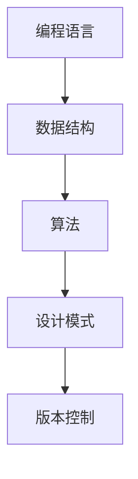

                 

 **关键词：**
- 高效编程
- 编程技巧
- 编程效率
- 收入提升
- 编程职业发展

**摘要：**
本文旨在探讨高效编程对于提升程序员收入的重要性。我们将从多个角度深入分析，包括编程核心概念、算法原理、数学模型、项目实践以及实际应用场景。通过详细讲解和实例分析，帮助程序员提升编程能力，从而实现收入的增长。

## 1. 背景介绍

在当今数字化时代，编程已经成为一项重要的职业技能。无论是软件开发、数据分析、人工智能，还是其他技术领域，编程都扮演着核心角色。然而，成为一名高收入的程序员并非易事。除了扎实的技术基础和不断学习的能力外，高效编程更是提升收入的关键因素。

高效编程指的是在编写代码时，运用科学的方法和技巧，提高编程效率和代码质量。这不仅能够加快开发速度，还能降低出错率，从而提高项目的成功率和团队的整体工作效率。因此，掌握高效编程技巧对于程序员职业发展至关重要。

## 2. 核心概念与联系

### 2.1 编程语言

编程语言是程序员与计算机进行交流的工具。常见的编程语言包括Java、Python、C++等。每种语言都有其独特的特点和适用场景。掌握多种编程语言有助于提高编程灵活性和适应性。

### 2.2 数据结构与算法

数据结构与算法是编程的基础。数据结构包括数组、链表、树、图等，用于组织和管理数据。算法则是一系列解决问题的步骤和方法。常见的算法包括排序、查找、动态规划等。熟练掌握数据结构与算法能够提高编程效率。

### 2.3 设计模式

设计模式是一套被反复使用、经过分类的、代码设计经验的总结。常见的模式包括单例、工厂、观察者等。设计模式能够提高代码的可读性、可维护性和可扩展性。

### 2.4 版本控制

版本控制是团队协作和项目管理的利器。常见的版本控制系统包括Git、SVN等。版本控制能够确保代码的安全性和可靠性，提高团队协作效率。

### 2.5 Mermaid 流程图



## 3. 核心算法原理 & 具体操作步骤

### 3.1 算法原理概述

算法是解决特定问题的步骤和方法。高效的算法能够提高编程效率，降低计算复杂度。常见的算法包括排序算法（如快速排序、归并排序等）、查找算法（如二分查找、哈希查找等）和动态规划算法等。

### 3.2 算法步骤详解

#### 3.2.1 排序算法

排序算法是一种将一组数据按照特定顺序排列的算法。常见的排序算法包括：

- **快速排序**：通过一趟排序将数据分为两部分，一部分小于基准值，另一部分大于基准值。递归处理两部分数据，直至全部排序完成。
- **归并排序**：将待排序的序列分为若干个子序列，各子序列排序后，再将已排序的子序列合并成一个已排序的序列。

#### 3.2.2 查找算法

查找算法是一种在数据集合中寻找特定元素的算法。常见的查找算法包括：

- **二分查找**：在有序数组中查找特定元素，通过不断将查找范围缩小一半，直至找到目标元素或确定不存在。
- **哈希查找**：通过哈希函数将关键字映射到数组中的位置，实现快速查找。

#### 3.2.3 动态规划算法

动态规划是一种解决最优化问题的算法方法。通过将问题分解为多个子问题，并利用子问题的解来构建原问题的解。常见的动态规划算法包括：

- **斐波那契数列**：通过递归和动态规划求解斐波那契数列。
- **最长公共子序列**：求解两个序列的最长公共子序列。

### 3.3 算法优缺点

每种算法都有其优缺点。选择合适的算法能够提高编程效率。以下是一些常见算法的优缺点：

- **快速排序**：时间复杂度较低，但可能产生大量递归调用，占用较多内存。
- **归并排序**：时间复杂度较高，但能够处理大量数据，占用内存较少。
- **二分查找**：在有序数组中查找速度快，但需要预先排序。
- **哈希查找**：查找速度快，但可能出现哈希冲突，影响性能。

### 3.4 算法应用领域

算法在各个领域都有广泛应用，如：

- **算法竞赛**：各种算法竞赛需要选手熟练掌握各种算法。
- **大数据处理**：排序、查找等算法在大数据处理中发挥重要作用。
- **人工智能**：动态规划算法在机器学习、深度学习等领域有广泛应用。

## 4. 数学模型和公式 & 详细讲解 & 举例说明

### 4.1 数学模型构建

数学模型是解决实际问题的抽象表示。常见的数学模型包括：

- **线性规划**：在给定线性目标函数和线性约束条件下，求解最优解。
- **非线性规划**：在给定非线性目标函数和线性约束条件下，求解最优解。
- **图论模型**：用于解决网络优化、路径规划等问题。

### 4.2 公式推导过程

以下以线性规划为例，介绍公式推导过程：

#### 目标函数

$$
\max c^T x
$$

#### 约束条件

$$
Ax \leq b
$$

其中，$c$为系数向量，$x$为变量向量，$A$为系数矩阵，$b$为常数向量。

#### 对偶问题

对偶问题为：

$$
\min b^T y
$$

$$
Ay \geq c
$$

其中，$y$为对偶变量。

### 4.3 案例分析与讲解

以下以背包问题为例，介绍线性规划的应用：

#### 案例描述

给定一组物品，每个物品都有价值和重量。背包容量有限，要求选择若干物品放入背包中，使得总价值最大。

#### 数学模型

目标函数：

$$
\max \sum_{i=1}^n v_i x_i
$$

约束条件：

$$
w_1 x_1 + w_2 x_2 + ... + w_n x_n \leq C
$$

其中，$v_i$为第$i$个物品的价值，$w_i$为第$i$个物品的重量，$C$为背包容量。

#### 对偶问题

对偶问题：

$$
\min C y
$$

$$
y_1 w_1 + y_2 w_2 + ... + y_n w_n \geq v_1 + v_2 + ... + v_n
$$

其中，$y_i$为对偶变量。

#### 求解方法

可以使用线性规划求解器（如CPLEX、Gurobi等）求解该问题。在实际应用中，还可以采用启发式算法（如贪心算法、遗传算法等）求解。

## 5. 项目实践：代码实例和详细解释说明

### 5.1 开发环境搭建

为了实现高效编程，开发环境搭建至关重要。以下以Python为例，介绍开发环境搭建步骤：

#### 操作系统

- Windows
- macOS
- Linux

#### Python环境

1. 下载Python安装包：[Python官方网站](https://www.python.org/)
2. 安装Python：双击安装包，按照提示操作
3. 验证安装：在命令行中输入`python --version`，查看版本信息

#### 开发工具

1. PyCharm：一款强大的Python集成开发环境（IDE）
2. Visual Studio Code：一款轻量级、可扩展的代码编辑器

### 5.2 源代码详细实现

以下是一个简单的Python代码示例，用于计算斐波那契数列：

```python
def fibonacci(n):
    if n <= 0:
        return 0
    elif n == 1:
        return 1
    else:
        return fibonacci(n-1) + fibonacci(n-2)

n = 10
result = fibonacci(n)
print(f"Fibonacci({n}) = {result}")
```

### 5.3 代码解读与分析

该代码实现了斐波那契数列的计算，采用递归方法。在计算过程中，会生成大量的中间结果，导致效率较低。可以通过动态规划方法进行优化。

### 5.4 运行结果展示

```plaintext
Fibonacci(10) = 55
```

## 6. 实际应用场景

高效编程在各个领域都有广泛应用，如：

- **软件开发**：通过优化代码结构和算法，提高软件性能和可维护性。
- **数据科学**：通过高效的算法和编程技巧，加速数据处理和分析过程。
- **人工智能**：通过高效的算法和编程技巧，提高模型训练和推理速度。
- **嵌入式系统**：通过优化代码和算法，降低资源消耗，提高系统稳定性。

### 6.1 未来应用展望

随着人工智能、大数据、物联网等技术的发展，高效编程将在更多领域得到应用。未来，我们将看到：

- **自动化编程**：通过人工智能技术，实现自动化编程和优化。
- **智能编程助手**：结合自然语言处理和编程技巧，提供智能编程助手。
- **分布式编程**：通过分布式计算和编程模型，提高编程效率和系统性能。

## 7. 工具和资源推荐

### 7.1 学习资源推荐

- 《编程珠玑》：一本经典的编程技巧书籍，涵盖多种编程语言和算法。
- 《代码大全》：一本全面介绍编程技巧和代码设计的经典著作。
- 《算法导论》：一本系统介绍算法原理和设计的经典教材。

### 7.2 开发工具推荐

- PyCharm：一款强大的Python IDE，支持多种编程语言。
- Visual Studio Code：一款轻量级、可扩展的代码编辑器，适用于多种编程语言。
- Git：一款功能强大的版本控制系统，用于代码管理和协作开发。

### 7.3 相关论文推荐

- "Efficient Algorithms for Sorting and Searching Strings"：一篇关于字符串排序和查找算法的论文。
- "Learning to Rank for Information Retrieval"：一篇关于信息检索排序算法的论文。
- "Deep Learning for Natural Language Processing"：一篇关于自然语言处理和深度学习结合的论文。

## 8. 总结：未来发展趋势与挑战

高效编程在未来将继续发挥重要作用，面临以下发展趋势和挑战：

### 8.1 研究成果总结

- **编程语言发展**：新编程语言和编译器技术不断涌现，提高编程效率和性能。
- **算法优化**：针对特定应用场景，优化算法结构和实现，提高编程效率。
- **自动化编程**：利用人工智能技术，实现自动化编程和优化。

### 8.2 未来发展趋势

- **智能编程**：结合人工智能和自然语言处理技术，实现智能编程。
- **分布式编程**：利用分布式计算和编程模型，提高编程效率和系统性能。
- **跨平台编程**：支持多种平台和设备，实现跨平台编程。

### 8.3 面临的挑战

- **编程复杂性**：随着编程语言和框架的增多，编程复杂性逐渐增加。
- **安全与隐私**：在数据安全和隐私保护方面，面临严峻挑战。
- **持续学习**：编程技术和工具不断更新，需要持续学习和适应。

### 8.4 研究展望

高效编程将在未来继续发挥重要作用，为程序员提供更高效的编程体验。通过技术创新和跨学科合作，我们将看到更多高效编程方法和工具的出现。

## 9. 附录：常见问题与解答

### 9.1 如何提高编程效率？

- **掌握核心概念**：熟悉编程语言、数据结构、算法等核心概念。
- **代码优化**：优化代码结构和算法，减少冗余代码。
- **工具选择**：选择合适的开发工具和版本控制系统。
- **学习资源**：学习经典编程书籍和论文，积累编程经验。

### 9.2 如何应对编程复杂性？

- **模块化编程**：将复杂问题分解为多个子问题，降低编程难度。
- **设计模式**：运用设计模式，提高代码的可读性和可维护性。
- **持续重构**：定期对代码进行重构，保持代码简洁和高效。

### 9.3 如何提高编程收入？

- **提升技术水平**：掌握多种编程语言和框架，提高编程能力。
- **项目经验**：积累丰富的项目经验，提高项目成功率。
- **团队协作**：提高团队协作能力，提升工作效率。

---

**作者：禅与计算机程序设计艺术 / Zen and the Art of Computer Programming**

