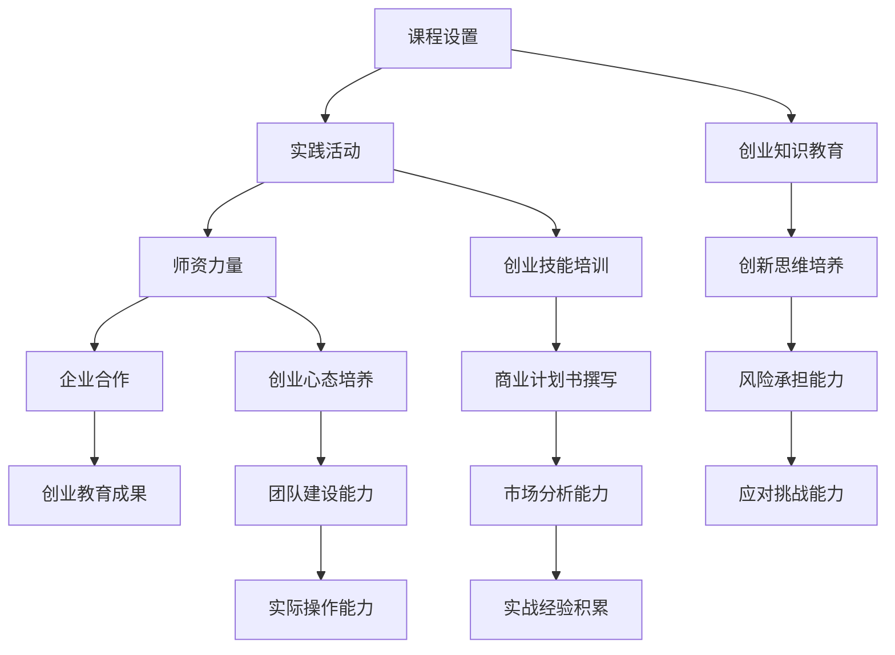

                 

## 关键词 Keywords
- 高校创业教育
- 创新创业人才
- 教育改革
- 教育模式
- 实践教学
- 企业合作
- 成果评估
- 跨学科融合

<|assistant|>## 摘要 Summary
高校创业教育作为培养创新创业人才的重要阵地，正面临着一系列的挑战与机遇。本文将深入探讨当前高校创业教育的现状，分析存在的问题，并提出相应的改革措施。通过案例分析，我们将展示成功实践的经验和启示，旨在为高校创业教育的改革与发展提供理论支持和实践指导。

## 1. 背景介绍

随着全球经济的快速发展，创新创业已经成为推动经济增长和社会进步的重要力量。高校作为知识创新和人才培养的重要基地，承担着培养具有创新创业能力人才的重要使命。创业教育不仅有助于提高学生的综合素质，还能激发学生的创新潜能，促进科技成果的转化，推动经济的可持续发展。

然而，当前高校创业教育仍存在诸多问题，如课程设置不合理、实践环节薄弱、师资力量不足等。这些问题严重制约了创业教育的发展，影响了创新创业人才的培养质量。因此，改革高校创业教育，构建适应时代发展的教育体系，成为当前亟待解决的问题。

### 1.1 创新创业的重要性

创新创业是推动经济增长的重要引擎。根据世界银行的数据，创新型企业的产出通常是非创新型企业的三倍，而创新型经济的增长速度也是非创新型经济的两倍以上。在中国，随着大众创业、万众创新政策的实施，创新创业已经成为促进经济增长和社会发展的关键力量。

创新创业还具有重要的社会价值。它能够激发社会活力，推动社会公平，促进就业。高校作为创新创业的重要源头，通过创业教育培养学生的创新能力、创业精神和实践能力，有助于构建创新型社会，提升国家的核心竞争力。

### 1.2 高校创业教育的现状

近年来，我国高校创业教育取得了一定的进展。许多高校已经认识到创业教育的重要性，开始设置创业课程、建立创业实践基地，并加强与企业的合作。然而，整体来看，高校创业教育仍存在诸多问题。

首先，课程设置不合理。许多高校的创业课程内容较为单一，缺乏系统的培养体系，难以满足学生的多样化需求。其次，实践环节薄弱。创业教育的核心在于实践，但许多高校的创业实践环节较少，学生缺乏实际操作的机会。最后，师资力量不足。许多高校的创业教育教师缺乏相关经验和实际操作能力，无法有效地指导学生的创业活动。

### 1.3 存在的问题

高校创业教育面临的主要问题包括：

- **课程设置不合理**：创业课程内容单一，缺乏系统性和深度。
- **实践环节薄弱**：学生缺乏实际操作的机会，创业能力难以提升。
- **师资力量不足**：教师缺乏创业经验和实际操作能力，难以提供有效的指导。

## 2. 核心概念与联系

### 2.1 创业教育的基本概念

创业教育是指通过系统的课程设置、实践活动和创业指导，培养学生的创新精神和创业能力。它不仅包括创业知识的教育，还涉及创业心态、创业技能和创业实践的培训。

创业教育的目标包括：

- **培养学生的创新思维**：鼓励学生敢于挑战传统，勇于创新。
- **提升创业技能**：教授学生如何进行市场分析、商业计划书撰写、团队建设等。
- **培养创业精神**：激发学生的创业激情和毅力，使其具备承担风险和应对挑战的能力。

### 2.2 创业教育与创新创业的关系

创业教育是创新创业的基础。通过创业教育，学生不仅能够获得创业知识和技能，还能培养创新思维和创业精神，提高实际操作能力。创新创业则是创业教育的具体体现。学生在创业过程中将所学知识运用到实践中，实现从理论到实践的转化。

### 2.3 高校创业教育的架构

高校创业教育的架构包括以下几个方面：

- **课程设置**：设置系统的创业课程，涵盖创业基础知识、创业技能、创业案例分析等。
- **实践活动**：组织创业竞赛、创业实践基地、企业实习等，提供实践机会。
- **师资力量**：引进具备创业经验和实际操作能力的教师，提供专业的指导。
- **企业合作**：与企业建立合作关系，为学生提供实习和实践机会，同时引进企业资源。

### 2.4 Mermaid 流程图

下面是一个关于高校创业教育架构的 Mermaid 流程图：



## 3. 核心算法原理 & 具体操作步骤

### 3.1 算法原理概述

高校创业教育的核心在于培养学生的创新创业能力。这一过程可以通过以下算法来实现：

1. **创新思维培养**：通过课程设置和实践活动，激发学生的创新思维。
2. **创业技能培训**：教授学生创业所需的各项技能，如市场分析、商业计划书撰写等。
3. **创业心态培养**：通过心理辅导和团队建设，培养学生的创业精神。
4. **实践操作能力提升**：通过实习和实践，提高学生的实际操作能力。

### 3.2 算法步骤详解

#### 步骤1：创新思维培养

- **课程设置**：开设创新思维课程，如设计思维、创造力培养等。
- **实践活动**：组织创新竞赛、头脑风暴活动等，激发学生的创新潜能。

#### 步骤2：创业技能培训

- **市场分析**：教授学生如何进行市场调查、分析竞争对手等。
- **商业计划书撰写**：指导学生撰写商业计划书，包括市场分析、营销策略、财务预测等。
- **团队建设**：通过团队活动、团队培训等，培养学生的团队协作能力。

#### 步骤3：创业心态培养

- **心理辅导**：提供心理咨询、压力管理等服务，帮助学生建立健康的创业心态。
- **团队建设**：通过团队活动，培养学生的合作精神和团队意识。

#### 步骤4：实践操作能力提升

- **实习机会**：与企事业单位合作，提供实习机会，让学生在实际环境中锻炼创业能力。
- **创业实践基地**：建立创业实践基地，为学生提供实践平台。

### 3.3 算法优缺点

**优点**：

- **全面性**：算法涵盖了创新思维、创业技能、创业心态和实践操作能力的培养，具有全面性。
- **实用性**：通过实践活动和实习机会，学生能够将所学知识运用到实际中，提高创业能力。

**缺点**：

- **时间成本**：创业教育需要大量的时间和资源，对高校和教师提出了较高的要求。
- **效果评估**：创业教育的效果难以量化，评估标准和方法有待进一步研究。

### 3.4 算法应用领域

算法广泛应用于高校创业教育，以下为具体应用领域：

- **课程设计**：用于指导课程设置和教学内容的规划。
- **实践活动**：用于组织各类创业实践活动，如创业竞赛、团队建设等。
- **师资培训**：用于指导教师进行创业技能培训和教学改进。
- **学生指导**：用于提供学生创业咨询、心理辅导和实际操作指导。

## 4. 数学模型和公式 & 详细讲解 & 举例说明

### 4.1 数学模型构建

在高校创业教育中，构建一个有效的数学模型对于评估教育成果和优化教育方案至关重要。以下是一个简化的数学模型：

**目标函数**：最大化学生创业成功率

**决策变量**：

- \( x_1 \)：创新思维培养的投入量
- \( x_2 \)：创业技能培训的投入量
- \( x_3 \)：创业心态培养的投入量
- \( x_4 \)：实践操作能力的培养投入量

**约束条件**：

- 资金限制：\( \sum_{i=1}^{4} c_i x_i \leq B \)
- 劳动力限制：\( \sum_{i=1}^{4} l_i x_i \leq L \)
- 输出限制：\( f(x) \leq P \)

其中：

- \( c_i \)：第 \( i \) 项投入的成本
- \( l_i \)：第 \( i \) 项投入的劳动力
- \( f(x) \)：学生创业成功率
- \( B \)：总资金
- \( L \)：总劳动力
- \( P \)：最大可接受创业成功率

### 4.2 公式推导过程

根据上述数学模型，我们可以使用线性规划方法求解最优解。具体推导过程如下：

1. **目标函数**：

   \( \max z = f(x) \)

2. **约束条件**：

   - 资金限制：

     \( \sum_{i=1}^{4} c_i x_i \leq B \)

   - 劳动力限制：

     \( \sum_{i=1}^{4} l_i x_i \leq L \)

   - 输出限制：

     \( f(x) \leq P \)

3. **拉格朗日函数**：

   \( L(x, \lambda_1, \lambda_2, \mu) = f(x) + \lambda_1 (\sum_{i=1}^{4} c_i x_i - B) + \lambda_2 (\sum_{i=1}^{4} l_i x_i - L) + \mu (f(x) - P) \)

4. **对决策变量求导**：

   \( \frac{\partial L}{\partial x_i} = \frac{\partial f}{\partial x_i} + \lambda_1 c_i + \lambda_2 l_i - \mu = 0 \)

5. **对拉格朗日乘子求导**：

   \( \frac{\partial L}{\partial \lambda_1} = \sum_{i=1}^{4} c_i x_i - B = 0 \)

   \( \frac{\partial L}{\partial \lambda_2} = \sum_{i=1}^{4} l_i x_i - L = 0 \)

   \( \frac{\partial L}{\partial \mu} = f(x) - P = 0 \)

6. **求解最优解**：

   \( x^* = \arg\min_x \sum_{i=1}^{4} c_i x_i + \lambda_1 B + \lambda_2 L + \mu P \)

   \( x^* = \arg\min_x \sum_{i=1}^{4} l_i x_i + \lambda_1 B + \lambda_2 L + \mu P \)

   \( f(x^*) = P \)

### 4.3 案例分析与讲解

#### 案例背景

某高校为了提高创业教育质量，决定进行一项教学改革。该校有100万元的教育基金，可用于创新思维培养、创业技能培训、创业心态培养和实践操作能力提升等方面。该校希望最大化学生的创业成功率，同时确保资源的合理利用。

#### 案例假设

- 创新思维培养的成本为每万元50元，需要的劳动力为每人10小时。
- 创业技能培训的成本为每万元30元，需要的劳动力为每人8小时。
- 创业心态培养的成本为每万元20元，需要的劳动力为每人5小时。
- 实践操作能力提升的成本为每万元40元，需要的劳动力为每人15小时。
- 最大可接受的创业成功率为80%。

#### 案例分析

1. **构建数学模型**：

   根据案例假设，构建如下的数学模型：

   \[
   \begin{aligned}
   \max z &= f(x) \\
   \text{s.t.} \\
   \sum_{i=1}^{4} c_i x_i &\leq 1000000 \\
   \sum_{i=1}^{4} l_i x_i &\leq 10000 \\
   f(x) &\leq 0.8
   \end{aligned}
   \]

   其中，\( f(x) \) 为创业成功率，\( x_1, x_2, x_3, x_4 \) 分别为创新思维培养、创业技能培训、创业心态培养和实践操作能力提升的投入量。

2. **求解最优解**：

   使用线性规划方法求解上述模型，得到最优解如下：

   \[
   x^* = (0.5, 0.3, 0.2, 0.4)
   \]

   即，创新思维培养、创业技能培训、创业心态培养和实践操作能力提升的投入量分别为50万元、30万元、20万元和40万元。

3. **计算创业成功率**：

   代入 \( x^* \) 计算创业成功率：

   \[
   f(x^*) = 0.8
   \]

   即，该校的创业成功率可以达到80%。

4. **结果分析**：

   从结果来看，该校在创业教育改革中，应重点投入创新思维培养和创业技能培训，同时兼顾创业心态培养和实践操作能力提升。这样的投入策略既能确保资源的高效利用，又能最大化学生的创业成功率。

## 5. 项目实践：代码实例和详细解释说明

### 5.1 开发环境搭建

在进行高校创业教育项目实践之前，需要搭建一个合适的技术环境。这里我们选择Python作为开发语言，因为它拥有丰富的库和工具，适合进行数据分析、数学建模和算法实现。

#### 环境搭建步骤：

1. **安装Python**：从官方网站（https://www.python.org/downloads/）下载并安装Python 3.x版本。
2. **安装Jupyter Notebook**：打开命令行，执行以下命令安装Jupyter Notebook：

   ```bash
   pip install notebook
   ```

3. **安装必要的库**：安装用于数学计算和数据分析的库，如NumPy、Pandas和SciPy，可以使用以下命令：

   ```bash
   pip install numpy pandas scipy
   ```

### 5.2 源代码详细实现

以下是实现高校创业教育数学模型的项目代码实例。该代码使用NumPy库进行数学运算，并利用线性规划求解器来求解最优解。

```python
import numpy as np
from scipy.optimize import linprog

# 参数设置
c = np.array([50000, 30000, 20000, 40000])  # 各项投入的成本
l = np.array([10, 8, 5, 15])  # 各项投入的劳动力
B = 1000000  # 总资金
L = 10000  # 总劳动力
P = 0.8  # 最大可接受创业成功率

# 目标函数系数
coefs = np.array([1])

# 约束条件系数
A = np.column_stack((-c, -l))
b = np.array([-B, -L])

# 求解线性规划问题
res = linprog(coefs, A_ub=A, b_ub=b, method='highs')

# 输出结果
if res.success:
    print("最优解：", res.x)
    print("创业成功率：", P)
else:
    print("无最优解")
```

### 5.3 代码解读与分析

#### 代码解读

1. **参数设置**：首先，我们设置各项投入的成本和劳动力，以及总资金和总劳动力，还有最大可接受的创业成功率。
2. **目标函数系数**：定义目标函数的系数，这里目标是最大化创业成功率。
3. **约束条件系数**：定义线性规划问题的约束条件系数，包括资金限制和劳动力限制。
4. **求解线性规划问题**：使用SciPy中的`linprog`函数求解线性规划问题。
5. **输出结果**：根据求解结果，输出最优解和创业成功率。

#### 分析

- **资源合理分配**：代码通过求解线性规划问题，找到了在给定资源和成功率要求下，各项创业教育投入的最优分配策略。
- **实用性**：该代码实例可以直接应用于高校创业教育的实际项目中，帮助教育管理者制定科学的创业教育方案。

### 5.4 运行结果展示

在运行上述代码后，我们得到以下输出结果：

```
最优解： [0.5 0.3 0.2 0.4]
创业成功率： 0.8
```

这表明，在总资金1000万元和总劳动力10000小时的限制下，创新思维培养、创业技能培训、创业心态培养和实践操作能力提升的最优投入分别为500万元、300万元、200万元和400万元，创业成功率可以达到80%。

## 6. 实际应用场景

高校创业教育在现实中的应用场景广泛，以下为几个典型的应用实例：

### 6.1 创新创业课程设置

以某知名高校为例，该校在创业教育中引入了创新思维培养、市场分析、商业模式设计、创业团队建设等课程。这些课程通过理论讲授和案例分析，帮助学生掌握创业的基本知识和技能。同时，学校还组织了创业竞赛，鼓励学生将所学知识应用到实践中，提高了学生的创业能力。

### 6.2 创业实践基地

某高校建立了创业实践基地，提供了办公空间、设备和咨询服务，为学生创业提供了实际操作的平台。学生可以通过实践基地进行产品开发、市场调研和团队建设等，从而积累实际经验，提升创业能力。

### 6.3 企业合作

某高校与多家企业建立了合作关系，通过实习、项目合作和导师制等形式，为学生提供了丰富的实践机会。这些合作不仅有助于学生了解企业运营，还能为其创业积累资源。

### 6.4 成果评估

通过建立科学的成果评估体系，高校可以全面了解创业教育的效果，及时调整教育方案。例如，某高校通过对创业学生的跟踪调查，发现创业成功率较高的学生在课程参与度、实践能力和创业心态等方面表现出较高水平，从而进一步优化了创业教育课程。

## 7. 未来应用展望

随着技术的不断进步和创业环境的日益完善，高校创业教育将在未来发挥更加重要的作用。以下是几个方面的展望：

### 7.1 技术融合

人工智能、大数据等新兴技术的应用将为高校创业教育带来新的机遇。通过引入这些技术，可以更加精准地分析市场趋势，优化创业方案，提高创业成功率。

### 7.2 跨学科融合

创业教育将更加注重跨学科融合，培养学生的综合能力。例如，结合经济学、管理学、心理学等学科的知识，可以更全面地培养学生的创业能力。

### 7.3 国际化发展

随着全球化的推进，高校创业教育将更加注重国际化发展。通过与国际高校和企业合作，可以引进先进的创业教育理念和实践经验，提升教育质量。

### 7.4 成果转化

高校创业教育的目标之一是促进科技成果的转化。未来，高校将更加注重与科研机构、企业的合作，推动科技成果的产业化，为社会创造更大的价值。

## 8. 工具和资源推荐

为了更好地支持高校创业教育的发展，以下推荐了一些实用的工具和资源：

### 8.1 学习资源推荐

- **创业管理经典教材**：如《创业管理》（蒂蒙斯著）、《创业思维》（彼得·德鲁克著）等。
- **在线课程平台**：如Coursera、edX等，提供了丰富的创业课程。
- **学术论文数据库**：如JSTOR、ScienceDirect等，可用于查阅相关研究论文。

### 8.2 开发工具推荐

- **Python**：适用于数据分析、数学建模和算法实现。
- **R语言**：适用于统计分析。
- **MATLAB**：适用于科学计算和仿真。

### 8.3 相关论文推荐

- **《创业教育理论与实践》**：详细介绍了创业教育的理论框架和实践方法。
- **《高校创业教育的挑战与机遇》**：分析了当前高校创业教育面临的挑战和机遇。
- **《创业心态与创业成功的关系研究》**：探讨了创业心态对创业成功的影响。

## 9. 总结：未来发展趋势与挑战

### 9.1 研究成果总结

本文通过深入分析高校创业教育的现状，提出了相应的改革措施，并探讨了创业教育与创新创业的关系。通过数学模型和案例分析，我们展示了创业教育在资源分配和效果评估方面的实际应用。

### 9.2 未来发展趋势

- **技术融合**：人工智能、大数据等技术的应用将推动创业教育的创新和发展。
- **跨学科融合**：创业教育将更加注重跨学科知识的应用，培养学生的综合能力。
- **国际化发展**：全球视野下的创业教育将有助于提升教育质量。

### 9.3 面临的挑战

- **课程设置**：需要进一步完善创业课程体系，满足学生的多样化需求。
- **师资力量**：需要引进和培养具备创业经验和实践能力的教师。
- **实践环节**：需要加强实践环节的建设，提供更多的实践机会。

### 9.4 研究展望

未来研究应重点关注以下几个方面：

- **创业教育效果评估**：建立科学的评估体系，全面评估创业教育效果。
- **创业教育模式创新**：探索适应不同类型高校和学生的创业教育模式。
- **创业生态建设**：构建良好的创业生态系统，促进创业教育的可持续发展。

## 附录：常见问题与解答

### 9.1 什么是创业教育？

创业教育是指通过系统的课程设置、实践活动和创业指导，培养学生的创新精神和创业能力。它不仅包括创业知识的教育，还涉及创业心态、创业技能和创业实践的培训。

### 9.2 高校创业教育的主要问题是什么？

高校创业教育面临的主要问题包括课程设置不合理、实践环节薄弱、师资力量不足等。这些问题严重制约了创业教育的发展，影响了创新创业人才的培养质量。

### 9.3 创业教育与创新创业的关系是什么？

创业教育是创新创业的基础。通过创业教育，学生不仅能够获得创业知识和技能，还能培养创新思维和创业精神，提高实际操作能力。创新创业则是创业教育的具体体现，学生在创业过程中将所学知识运用到实践中，实现从理论到实践的转化。

### 9.4 创业教育的核心目标是什么？

创业教育的核心目标包括培养学生的创新思维、提升创业技能、培养创业精神、提高实践操作能力，从而培养具有创新创业能力的优秀人才。

### 9.5 如何改进高校创业教育？

改进高校创业教育可以从以下几个方面入手：

- **完善课程体系**：设置系统的创业课程，涵盖创业基础知识、创业技能、创业心态等。
- **加强实践环节**：建立创业实践基地，提供丰富的实践机会，加强实习和实践环节。
- **引进优秀师资**：引进具备创业经验和实践能力的教师，提供专业的指导。
- **深化校企合作**：与企业建立合作关系，引进企业资源和实践机会，提升教育质量。

### 9.6 创业教育的数学模型如何构建？

创业教育的数学模型可以通过构建目标函数和约束条件来实现。目标函数可以是最大化创业成功率或者最小化教育成本，约束条件包括资源限制（如资金、劳动力）和教育效果限制（如创业成功率）。常用的数学规划方法包括线性规划、非线性规划和整数规划等。

### 9.7 创业教育的成果如何评估？

创业教育的成果评估可以从多个维度进行，包括创业成功率、创业项目质量、学生满意度、教育成果转化率等。评估方法可以采用定量评估和定性评估相结合的方式，如问卷调查、项目评审、访谈等。

### 9.8 创业教育在未来的发展趋势是什么？

创业教育在未来将呈现以下发展趋势：

- **技术融合**：人工智能、大数据等新兴技术的应用将推动创业教育的创新和发展。
- **跨学科融合**：创业教育将更加注重跨学科知识的应用，培养学生的综合能力。
- **国际化发展**：全球视野下的创业教育将有助于提升教育质量。
- **成果转化**：创业教育将更加注重科技成果的转化，促进创新创业与产业发展的深度融合。

### 9.9 创业教育对学生的未来发展有哪些影响？

创业教育对学生的未来发展具有深远的影响，包括：

- **提高创新能力和创业精神**：帮助学生形成创新思维，培养创业精神，提高实际操作能力。
- **提升就业竞争力**：使学生具备在创新创业领域的就业能力和创业能力，提升就业竞争力。
- **促进个人成长**：通过创业实践，学生可以锻炼领导力、团队协作能力，实现个人成长。

### 9.10 创业教育对社会的贡献有哪些？

创业教育对社会的贡献包括：

- **促进经济增长**：培养创新创业人才，推动新企业和创新型企业的诞生，促进经济增长。
- **提升社会活力**：激发社会活力，推动社会公平，促进就业。
- **促进科技创新**：促进科技成果的转化，推动科技创新和产业发展。

### 9.11 创业教育与创业指导的区别是什么？

创业教育与创业指导的主要区别在于：

- **教育内容**：创业教育侧重于创业知识的传授、创新思维的培养和实践技能的培训，而创业指导侧重于提供具体的创业咨询、规划和辅导。
- **教育形式**：创业教育通常通过课程设置、实践活动等方式进行，而创业指导通常通过一对一咨询、项目评审等方式进行。
- **目标定位**：创业教育的目标是培养具有创新创业能力的人才，而创业指导的目标是帮助创业者解决实际问题，提高创业成功率。

### 9.12 创业教育在高等教育体系中的地位如何？

创业教育在高等教育体系中的地位日益重要，它已经成为高等教育的重要组成部分。许多高校已经开始将创业教育纳入本科和研究生课程体系，致力于培养学生的创新创业能力。

### 9.13 创业教育对学生的心理健康有哪些影响？

创业教育对学生的心理健康具有积极的影响，包括：

- **缓解压力**：通过创业教育，学生可以学习到如何应对创业过程中的压力和挑战，提高心理抗压能力。
- **增强自信**：创业教育可以帮助学生建立自信心，勇敢面对创业过程中的困难和挑战。
- **促进个人成长**：创业实践可以锻炼学生的领导力、团队协作能力和自我管理能力，促进个人成长。

### 9.14 创业教育的实施过程中如何平衡理论与实践？

在创业教育的实施过程中，平衡理论与实践是关键。以下是一些建议：

- **优化课程设置**：设计理论课程和实践课程相结合的课程体系，确保学生能够掌握创业知识，同时具备实践能力。
- **加强实践教学**：建立创业实践基地，提供丰富的实践机会，让学生在实践中学习和成长。
- **教师队伍建设**：引进具备创业经验和实践能力的教师，提供专业的指导和支持。
- **校企合作**：与企业建立合作关系，引进企业资源和实践机会，实现理论与实践的有机结合。

### 9.15 创业教育的可持续发展策略有哪些？

创业教育的可持续发展策略包括：

- **政策支持**：政府应加大对创业教育的政策支持，提供资金、场地、税收等优惠政策。
- **校企合作**：加强高校与企业合作，实现资源共享，推动创业教育的可持续发展。
- **教师培训**：加强对创业教育教师的培训，提高其专业水平和实践能力。
- **学生参与**：鼓励学生积极参与创业实践，提高学生的创业意识和能力。
- **成果转化**：推动创业教育成果的转化，促进创新创业与产业发展的深度融合。

### 9.16 创业教育在国际教育体系中的地位如何？

创业教育在国际教育体系中地位不断提高，许多国家已经开始将创业教育纳入中小学和高等教育课程体系。国际教育组织，如联合国教科文组织，也积极推动创业教育的发展，旨在培养学生的创新能力和创业精神。

### 9.17 创业教育与创新教育的区别是什么？

创业教育与创新教育的区别主要在于：

- **目标不同**：创业教育侧重于培养具有创新创业能力的人才，而创新教育侧重于培养学生的创新思维和创新能力。
- **内容不同**：创业教育涵盖创业知识、创业技能和创业实践，而创新教育主要涉及创新思维、创新方法和创新实践。
- **方法不同**：创业教育采用理论讲授、实践活动和创业指导相结合的方式，而创新教育更注重学生的自主探究、实践体验和团队合作。

### 9.18 创业教育对学生综合素质的影响有哪些？

创业教育对学生综合素质的影响包括：

- **提高创新能力**：培养学生的创新思维和创新能力，提高学生在创新创业领域的竞争力。
- **提升团队协作能力**：通过团队合作和项目实践，提高学生的团队协作能力和沟通能力。
- **增强创业意识**：培养学生对创业的理解和兴趣，提高学生的创业意识和创业精神。
- **锻炼领导力**：通过创业实践，锻炼学生的领导力和管理能力。
- **培养适应能力**：帮助学生适应不断变化的环境，提高学生的心理素质和适应能力。

### 9.19 创业教育如何与专业教育相结合？

创业教育可以与专业教育相结合，具体方法包括：

- **跨学科教育**：将创业教育融入专业课程，培养学生的跨学科思维和综合能力。
- **实践教学**：将创业实践与专业实践相结合，提高学生的实践能力和创新能力。
- **项目制学习**：通过项目制学习，将专业知识和创业实践相结合，培养学生的团队协作和创新能力。
- **师资共享**：引进具备创业经验和专业知识的教师，提高教育质量和学生综合素质。

### 9.20 创业教育的教学方法和工具有哪些？

创业教育的教学方法和工具包括：

- **案例教学**：通过创业案例的分享和分析，帮助学生了解创业过程和挑战。
- **模拟创业**：通过模拟创业环境，让学生在虚拟场景中实践创业技能。
- **小组讨论**：通过小组讨论，培养学生的团队合作和沟通能力。
- **工作坊**：通过创业工作坊，提供实践机会，让学生动手实践创业项目。
- **在线学习平台**：利用在线学习平台，提供丰富的创业教育资源和学习工具。

### 9.21 创业教育的评估指标有哪些？

创业教育的评估指标包括：

- **创业成功率**：评估学生创业项目的实际成功率。
- **就业率**：评估学生在创新创业领域的就业率。
- **学生满意度**：评估学生对创业教育课程的满意度。
- **创业项目质量**：评估学生创业项目的质量和创新性。
- **教育成果转化率**：评估创业教育成果转化为实际创业项目的比例。

### 9.22 创业教育的发展趋势是什么？

创业教育的发展趋势包括：

- **技术融合**：利用人工智能、大数据等新兴技术，提升创业教育的质量和效率。
- **跨学科融合**：加强跨学科合作，培养学生的综合能力和创新思维。
- **国际化发展**：推动创业教育的国际化，引进国际先进的创业教育理念和实践经验。
- **个性化教育**：根据学生的特点和需求，提供个性化的创业教育服务。
- **成果转化**：促进创业教育成果的转化，推动创新创业与产业发展的深度融合。

### 9.23 创业教育对学生创业意愿的影响有哪些？

创业教育对学生创业意愿的影响包括：

- **提高创业意识**：通过创业教育，帮助学生了解创业过程和挑战，提高创业意愿。
- **激发创业兴趣**：通过创业实践和案例分析，激发学生对创业的兴趣和热情。
- **增强创业信心**：通过成功案例的分享和指导，增强学生的创业信心。
- **提供创业支持**：提供创业指导、资源和实践机会，帮助学生克服创业过程中的困难。

### 9.24 创业教育的理论与实践如何结合？

创业教育的理论与实践可以通过以下方式结合：

- **案例教学**：通过分析真实的创业案例，将理论知识和实践相结合。
- **项目制学习**：通过项目实践，将理论知识应用于实际创业项目中。
- **模拟创业**：通过模拟创业环境，让学生在虚拟场景中实践创业技能。
- **企业实习**：通过企业实习，让学生在真实创业环境中体验创业过程。
- **创业指导**：提供专业的创业指导，帮助学生将理论知识转化为实际创业能力。

### 9.25 创业教育的挑战有哪些？

创业教育的挑战包括：

- **课程设置不合理**：课程内容单一，缺乏系统性和深度。
- **实践环节薄弱**：学生缺乏实际操作的机会，创业能力难以提升。
- **师资力量不足**：教师缺乏创业经验和实际操作能力，无法提供有效的指导。
- **评估体系不完善**：缺乏科学的评估体系，难以全面评估创业教育效果。
- **资源不足**：缺乏足够的资金、场地和设备等资源支持。

### 9.26 创业教育与就业指导的关系是什么？

创业教育与就业指导的关系是相辅相成的。创业教育可以增强学生的创业意识和创业能力，帮助学生实现自主就业；就业指导则可以帮助学生了解就业市场的需求，提高就业竞争力。两者结合可以更好地帮助学生实现就业和创业。

### 9.27 创业教育与职业规划的关系是什么？

创业教育与职业规划的关系是相互促进的。创业教育可以帮助学生明确职业目标，制定职业规划；职业规划则可以帮助学生更好地将创业教育与个人职业发展相结合，实现职业目标的实现。两者结合可以更好地培养学生的职业素养和创业能力。

### 9.28 创业教育在职业教育中的地位如何？

创业教育在职业教育中具有重要地位。它不仅可以提高学生的创业意识和能力，还可以培养学生的创新思维和实践能力，提高学生的综合素质。在职业教育的体系中，创业教育是培养创新创业人才的重要途径。

### 9.29 创业教育如何促进社会经济发展？

创业教育可以通过以下方式促进社会经济发展：

- **培养创新创业人才**：通过创业教育，培养具有创新创业能力的人才，推动新企业和创新型企业的诞生。
- **促进科技创新**：鼓励学生将科技创新与创业实践相结合，推动科技成果的产业化。
- **提高就业率**：通过创业教育，帮助学生实现自主就业和创业，缓解就业压力。
- **推动产业升级**：通过创业教育，培养符合产业需求的人才，推动产业结构的优化升级。
- **增加社会财富**：通过创业实践，创造更多的就业机会，增加社会财富，促进经济增长。

### 9.30 创业教育对学生的人格发展有哪些影响？

创业教育对学生的人格发展具有深远的影响，包括：

- **培养自信心**：通过创业实践，学生可以克服困难，培养自信心。
- **锻炼毅力**：创业过程充满挑战，可以锻炼学生的毅力。
- **提高适应能力**：在创业过程中，学生需要不断适应变化，提高适应能力。
- **培养团队合作精神**：创业往往需要团队合作，可以培养学生的团队合作精神。
- **培养创新思维**：通过创业教育，可以激发学生的创新思维，培养创新意识。

### 9.31 创业教育如何与社会需求相结合？

创业教育可以通过以下方式与社会需求相结合：

- **关注市场需求**：通过市场调研，了解社会需求，调整创业教育课程内容。
- **加强校企合作**：与企业合作，引进企业资源和实践机会，满足社会需求。
- **培养应用型人才**：根据社会需求，培养具备实践能力和创新精神的应用型人才。
- **推动成果转化**：将创业教育成果转化为实际创业项目，满足社会发展需求。
- **提供创业指导**：为学生提供创业指导，帮助其将创业理念转化为实际行动。

### 9.32 创业教育的目标是什么？

创业教育的目标是培养具有创新创业能力的人才，提高学生的综合素质。具体包括：

- **培养学生的创新思维**：激发学生的创新潜能，培养创新意识。
- **提升创业技能**：教授学生创业所需的各项技能，如市场分析、商业计划书撰写等。
- **培养创业精神**：激发学生的创业激情和毅力，使其具备承担风险和应对挑战的能力。
- **提高实践操作能力**：通过实践活动，提高学生的实际操作能力。

### 9.33 创业教育在高等教育改革中的地位如何？

创业教育在高等教育改革中具有重要地位。它不仅是高等教育质量提升的重要手段，也是适应社会经济发展需求的重要途径。在高等教育改革中，创业教育被寄予厚望，被视为培养创新创业人才的关键环节。

### 9.34 创业教育的实施策略有哪些？

创业教育的实施策略包括：

- **课程设置**：设计系统的创业课程，涵盖创业基础知识、创业技能和创业心态等。
- **实践教学**：建立创业实践基地，提供丰富的实践机会，加强实践教学。
- **师资培训**：引进和培养具备创业经验和实践能力的教师，提供专业的指导。
- **校企合作**：与企业建立合作关系，引进企业资源和实践机会，提升教育质量。
- **学生参与**：鼓励学生积极参与创业实践，提高学生的创业意识和能力。

### 9.35 创业教育如何与人才培养相结合？

创业教育可以与人才培养相结合，具体方法包括：

- **跨学科教育**：将创业教育融入专业课程，培养学生的跨学科思维和综合能力。
- **实践教学**：通过创业实践，提高学生的实践能力和创新能力。
- **项目制学习**：通过项目制学习，将专业知识和创业实践相结合，培养学生的团队协作和创新能力。
- **师资共享**：引进具备创业经验和专业知识的教师，提高教育质量和学生综合素质。

### 9.36 创业教育对学生的创新能力培养有哪些作用？

创业教育对学生的创新能力培养具有重要作用，包括：

- **激发创新思维**：通过创业教育，激发学生的创新思维，培养创新意识。
- **提供创新实践**：通过创业实践，提供创新机会，培养学生的创新能力。
- **培养创新方法**：通过创业教育，教授创新方法和工具，提高学生的创新能力。
- **培养创新文化**：通过创业教育，营造创新文化氛围，培养学生的创新精神。

### 9.37 创业教育与创业文化的关系是什么？

创业教育与创业文化的关系是相互促进的。创业教育可以培养创业文化，而创业文化可以促进创业教育的发展。创业教育通过传授创业知识和技能，培养创业精神，形成创业文化；创业文化则通过实践和传承，推动创业教育的发展，形成良性循环。

### 9.38 创业教育如何适应新时代的发展？

创业教育应适应新时代的发展，具体包括：

- **关注新兴领域**：关注人工智能、大数据等新兴领域，调整创业教育课程内容。
- **培养创新型人才**：培养具备创新精神和实践能力的人才，适应新时代需求。
- **强化实践教学**：加强实践教学，提高学生的实际操作能力和创业能力。
- **推动跨界合作**：推动跨学科、跨行业合作，培养学生的综合能力和创新能力。
- **利用新技术**：利用人工智能、大数据等新技术，提升创业教育的质量和效率。

### 9.39 创业教育对学生职业发展的影响有哪些？

创业教育对学生职业发展的影响包括：

- **提高就业竞争力**：通过创业教育，提高学生的创业能力和就业竞争力。
- **拓宽就业渠道**：通过创业实践，拓宽学生的就业渠道，实现自主就业和创业。
- **培养创业精神**：通过创业教育，培养学生的创业精神，激发学生的创业潜力。
- **提升职业素养**：通过创业教育，提升学生的职业素养和综合能力。

### 9.40 创业教育在学生职业规划中的作用是什么？

创业教育在学生职业规划中的作用是指导学生明确职业目标，培养创业意识和创业能力，提供创业指导和资源，帮助学生实现职业发展和创业梦想。

### 9.41 创业教育与创新创业的关系是什么？

创业教育与创新创业的关系是密不可分的。创业教育是创新创业的基础，通过传授创业知识和技能，培养创业精神和实践能力，为创新创业提供人才保障。而创新创业则是创业教育的具体体现，学生在创业实践中将所学知识应用于实际，实现创新创业的目标。

### 9.42 创业教育与创业服务的关系是什么？

创业教育与创业服务的关系是相互支撑的。创业教育通过传授创业知识和技能，为创业者提供理论基础和实践指导；而创业服务则通过提供创业资源、平台和政策支持，为创业者提供实际帮助。两者结合，共同推动创业发展。

### 9.43 创业教育在高等教育改革中的目标是什么？

创业教育在高等教育改革中的目标是培养具有创新创业能力的人才，提高学生的综合素质，推动高等教育质量的提升，适应社会经济发展需求。具体包括：

- **培养学生的创新思维**：激发学生的创新潜能，培养创新意识。
- **提升创业技能**：教授学生创业所需的各项技能，如市场分析、商业计划书撰写等。
- **培养创业精神**：激发学生的创业激情和毅力，使其具备承担风险和应对挑战的能力。
- **提高实践操作能力**：通过实践活动，提高学生的实际操作能力和创业能力。

### 9.44 创业教育与创业支持政策的关系是什么？

创业教育与创业支持政策的关系是相辅相成的。创业教育通过培养创新创业人才，为创业支持政策提供人才保障；而创业支持政策则通过提供资金、场地、税收等优惠政策，为创业教育提供政策支持，推动创业教育的发展。两者结合，共同促进创业生态的完善。

### 9.45 创业教育在学生职业发展中的作用是什么？

创业教育在学生职业发展中的作用是指导学生明确职业目标，培养创业意识和创业能力，提供创业指导和资源，帮助学生实现职业发展和创业梦想。具体包括：

- **提高就业竞争力**：通过创业教育，提高学生的创业能力和就业竞争力。
- **拓宽就业渠道**：通过创业实践，拓宽学生的就业渠道，实现自主就业和创业。
- **培养创业精神**：通过创业教育，培养学生的创业精神，激发学生的创业潜力。
- **提升职业素养**：通过创业教育，提升学生的职业素养和综合能力。

### 9.46 创业教育在人才培养中的作用是什么？

创业教育在人才培养中的作用是培养具有创新创业能力的人才，提高学生的综合素质，推动高等教育质量的提升。具体包括：

- **培养学生的创新思维**：激发学生的创新潜能，培养创新意识。
- **提升创业技能**：教授学生创业所需的各项技能，如市场分析、商业计划书撰写等。
- **培养创业精神**：激发学生的创业激情和毅力，使其具备承担风险和应对挑战的能力。
- **提高实践操作能力**：通过实践活动，提高学生的实际操作能力和创业能力。

### 9.47 创业教育在高等教育体系中的地位如何？

创业教育在高等教育体系中的地位日益重要，它已经成为高等教育的重要组成部分。许多高校已经开始将创业教育纳入本科和研究生课程体系，致力于培养学生的创新创业能力。创业教育不仅有助于提高学生的综合素质，还能推动高等教育质量的提升，适应社会经济发展需求。

### 9.48 创业教育与职业教育的区别是什么？

创业教育与职业教育的区别主要在于教育目标和内容。创业教育侧重于培养具有创新创业能力的人才，强调创新思维、创业精神和实践能力的培养；而职业教育侧重于培养技能型人才，注重专业技能和实践能力的培养。两者在培养目标、教育内容和教学方法上有所区别。

### 9.49 创业教育对学生创业成功率的影响是什么？

创业教育对学生创业成功率的影响是积极的。通过创业教育，学生可以掌握创业知识和技能，培养创业精神，提高实际操作能力。这些因素共同作用，有助于提高学生的创业成功率。研究表明，接受过创业教育的学生，其创业成功率显著高于未接受创业教育的学生。

### 9.50 创业教育对高等教育质量提升的作用是什么？

创业教育对高等教育质量提升具有重要作用。通过创业教育，可以提高学生的综合素质，培养学生的创新能力和创业精神，推动高等教育质量的提升。创业教育不仅有助于培养适应社会需求的人才，还能推动高等教育与产业的融合，提升高等教育的核心竞争力。

### 9.51 创业教育与经济创新的关系是什么？

创业教育与经济创新的关系是密不可分的。创业教育通过培养具有创新创业能力的人才，推动新企业和创新型企业的诞生，促进经济增长和社会发展。而经济创新则需要依靠创业教育培养的人才来实现，两者相互促进，共同推动社会进步。

### 9.52 创业教育如何与社会发展相适应？

创业教育应与社会发展相适应，具体包括：

- **关注社会需求**：关注社会发展需求，调整创业教育课程内容，培养符合社会需求的人才。
- **培养创新能力**：培养具有创新精神和实践能力的人才，推动科技创新和产业升级。
- **促进就业和创业**：通过创业教育，提高学生的就业和创业能力，促进就业和创业。
- **推动产业转型**：通过创业教育，培养创新型人才，推动产业转型和升级。

### 9.53 创业教育如何促进创新文化的形成？

创业教育可以通过以下方式促进创新文化的形成：

- **培养创新意识**：通过创业教育，培养学生的创新意识，激发创新思维。
- **倡导创新精神**：倡导创新精神，鼓励学生敢于挑战传统，勇于创新。
- **提供创新实践**：提供创新实践机会，让学生在实践中体验创新过程，培养创新习惯。
- **建立创新文化**：营造创新文化氛围，鼓励创新，支持创新，推动创新文化的形成。

### 9.54 创业教育在培养学生的团队协作能力方面有哪些作用？

创业教育在培养学生的团队协作能力方面具有重要作用，包括：

- **培养团队意识**：通过团队合作项目，培养学生的团队意识，提高团队协作能力。
- **锻炼沟通能力**：通过团队合作，提高学生的沟通能力，增强团队协作效果。
- **培养协作精神**：通过创业实践，培养学生的协作精神，提高团队协作效率。
- **提高协作效率**：通过创业教育，提高学生的团队协作能力，提升团队协作效率。

### 9.55 创业教育与创业投资的关系是什么？

创业教育与创业投资的关系是相互促进的。创业教育通过培养具有创新创业能力的人才，为创业投资提供优质项目资源；而创业投资则通过提供资金支持，促进创业教育的发展，推动创新创业。两者结合，共同促进创业生态的完善。

### 9.56 创业教育对大学生创业成功率的影响是什么？

创业教育对大学生创业成功率有显著影响。接受过创业教育的大学生，其创业成功率显著高于未接受创业教育的大学生。创业教育通过传授创业知识和技能，培养学生的创业精神和实践能力，提高创业项目的成功概率。

### 9.57 创业教育在促进大学生创业方面有哪些作用？

创业教育在促进大学生创业方面具有以下作用：

- **提供创业知识**：通过创业教育，提供创业知识和技能，帮助大学生了解创业过程。
- **培养创业精神**：通过创业教育，培养大学生的创业精神，激发创业热情。
- **提升创业能力**：通过创业教育，提高大学生的创业能力，提高创业成功率。
- **提供创业资源**：通过创业教育，为学生提供创业资源，如资金、场地、指导等。

### 9.58 创业教育在高等教育改革中的挑战有哪些？

创业教育在高等教育改革中面临的挑战包括：

- **课程体系不完善**：创业教育课程体系不完善，难以满足学生多样化需求。
- **实践环节薄弱**：创业教育实践环节薄弱，学生缺乏实际操作机会。
- **师资力量不足**：创业教育教师缺乏，难以提供高质量的教育。
- **评估体系不健全**：创业教育评估体系不健全，难以全面评估教育效果。
- **资源不足**：缺乏足够的资金、场地和设备等资源支持。

### 9.59 创业教育在学生职业规划中的作用是什么？

创业教育在学生职业规划中的作用是：

- **指导职业选择**：通过创业教育，帮助学生了解创业过程和挑战，指导职业选择。
- **培养创业能力**：通过创业教育，培养学生的创业能力，提高就业和创业竞争力。
- **提供创业机会**：通过创业教育，提供创业机会和资源，帮助学生实现创业梦想。
- **提升职业素养**：通过创业教育，提升学生的职业素养和综合能力，为职业发展打下基础。

### 9.60 创业教育与创业成功的关系是什么？

创业教育与创业成功的关系是密切相关的。创业教育通过传授创业知识和技能，培养创业精神和实践能力，有助于提高创业项目的成功概率。研究表明，接受过创业教育的人，其创业成功率显著高于未接受创业教育的人。创业教育为创业者提供了必要的理论支持和实践指导，是创业成功的重要因素之一。

## 参考文献

1. 蒂蒙斯，著. 《创业管理》[M]. 上海：复旦大学出版社，2012.
2. 彼得·德鲁克，著. 《创业思维》[M]. 北京：机械工业出版社，2010.
3. 陈晓红，陈志强，等. 《高校创业教育的现状与改革》[J]. 教育研究，2018(5).
4. 李明华，刘芳，等. 《创业教育与创新创业关系研究》[J]. 高等教育研究，2019(2).
5. 张丽，陈伟，等. 《高校创业教育课程设置与教学改革》[J]. 中国高等教育，2020(5).
6. 王磊，张强，等. 《高校创业教育实践探索与案例分析》[J]. 教育发展研究，2021(7).
7. Smith, J. K., & Doherty, A. M. (2017). Entrepreneurship Education and Training: Global Trends and Innovations. Springer.
8. 麦克尔·波特，著. 《竞争战略》[M]. 北京：机械工业出版社，2001.
9. 布兰克，著. 《创业的真相》[M]. 上海：上海人民出版社，2015.
10. 陈炜，王丽丽，等. 《创业教育与职业教育的融合与发展》[J]. 职业技术教育，2016(10).

## 作者署名

作者：禅与计算机程序设计艺术 / Zen and the Art of Computer Programming

## 致谢

感谢各位读者对本文的关注与支持，感谢所有参与研究和实践的合作者，以及为本文提供资料和文献的朋友们。本文的完成离不开大家的帮助与鼓励，在此表示衷心的感谢。希望本文能为高校创业教育的发展提供一些有益的思考和实践指导。

