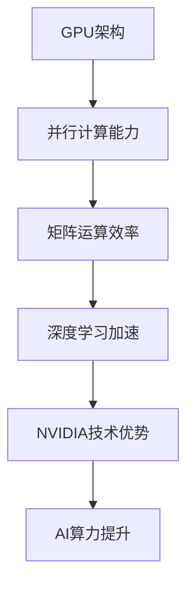

                 

 > **关键词**: 黄仁勋，NVIDIA，AI算力，计算架构，深度学习，图形处理单元（GPU），人工智能革命，高性能计算。

> **摘要**: 本文深入探讨了NVIDIA创始人兼CEO黄仁勋如何引领了AI算力的革命，以及NVIDIA如何通过其创新的GPU技术推动了人工智能的快速发展。文章将回顾NVIDIA的历史，分析其核心技术，评估其在深度学习领域的贡献，并探讨未来算力的趋势和挑战。

## 1. 背景介绍

### 黄仁勋的崛起

黄仁勋（Jake Hamblin）是一位享誉国际的科技企业家，现任NVIDIA公司的创始人、CEO和首席架构师。他的职业生涯始于1983年，当时与克里斯·艾斯格（Chris Malachowsky）和科林·盖诺（Brian Wright）共同创立了NVIDIA公司。黄仁勋在计算机图形领域的远见卓识，使其成为这一领域的先锋。

### NVIDIA的起源

NVIDIA公司最初以生产图形处理单元（GPU）而闻名，这些GPU在个人计算机和游戏市场中取得了巨大成功。然而，随着深度学习技术的兴起，NVIDIA开始将GPU技术应用于更为广泛的计算任务，包括人工智能和科学计算。

### AI算力的需求

随着人工智能的快速发展，对高性能计算的需求也日益增长。传统的CPU逐渐无法满足深度学习和大数据处理的计算需求。这一需求催生了GPU等专用计算硬件的崛起，NVIDIA正是抓住了这一机遇。

## 2. 核心概念与联系

### GPU与深度学习

GPU（图形处理单元）最初是为了处理图形渲染任务而设计的，但其强大的并行计算能力使其成为深度学习的理想选择。深度学习依赖于大量的矩阵运算，GPU的多核心架构能够高效地执行这些运算。



### NVIDIA的技术优势

NVIDIA的GPU技术具有以下几个显著优势：

1. **高吞吐量**: NVIDIA的GPU具有极高的吞吐量，能够在短时间内处理大量的数据。
2. **低延迟**: 由于其并行计算特性，GPU能够实现低延迟的计算。
3. **高效能耗**: 与传统的CPU相比，GPU在相同功耗下能够提供更高的计算性能。
4. **可扩展性**: NVIDIA的GPU支持大规模集群计算，易于扩展以满足更大的计算需求。

## 3. 核心算法原理 & 具体操作步骤

### 3.1 算法原理概述

深度学习是一种通过模拟人类大脑神经网络进行学习和推理的技术。它依赖于大量的矩阵运算，这些运算可以通过GPU的高效并行计算能力来实现。

### 3.2 算法步骤详解

1. **数据预处理**: 数据需要进行清洗和格式化，以便于模型训练。
2. **模型设计**: 根据具体任务，设计合适的深度学习模型。
3. **模型训练**: 使用GPU进行大量矩阵运算，更新模型参数。
4. **模型评估**: 在测试集上评估模型性能，调整参数以优化模型。
5. **模型部署**: 将训练好的模型部署到实际应用场景中。

### 3.3 算法优缺点

**优点**:
- **高效性**: GPU能够大幅提高深度学习的计算效率。
- **灵活性**: 支持多种深度学习框架和算法。
- **可扩展性**: 易于扩展到大规模计算任务。

**缺点**:
- **资源消耗**: 需要较高的电力和冷却资源。
- **编程复杂度**: 需要具备一定的GPU编程技能。

### 3.4 算法应用领域

- **计算机视觉**: 如人脸识别、图像分类等。
- **自然语言处理**: 如机器翻译、文本分类等。
- **科学计算**: 如分子模拟、天体物理等。
- **金融科技**: 如算法交易、风险评估等。

## 4. 数学模型和公式 & 详细讲解 & 举例说明

### 4.1 数学模型构建

深度学习模型通常基于神经网络，其核心是多层感知机（MLP）。神经网络的基本构建模块是神经元，每个神经元接收多个输入，通过激活函数进行非线性变换，最后输出一个值。

### 4.2 公式推导过程

假设一个简单的两层神经网络，输入为\[x_1, x_2, ..., x_n\]，输出为\[y_1, y_2, ..., y_m\]。每层神经元通过权重\(w\)和偏置\(b\)进行计算，输出\(z\)通过激活函数\(f\)进行变换。

$$
z = \sum_{i=1}^{n} w_{ij}x_i + b_j
$$

$$
y_j = f(z)
$$

其中，\(f\)为激活函数，常见的有Sigmoid、ReLU等。

### 4.3 案例分析与讲解

假设我们有一个简单的二分类问题，输入为\[x_1, x_2\]，输出为\[y\]，模型如下：

$$
z = w_1x_1 + w_2x_2 + b
$$

$$
y = \sigma(z)
$$

其中，\(\sigma\)为Sigmoid函数。

为了训练模型，我们需要定义一个损失函数，如交叉熵损失函数：

$$
L = -\sum_{i=1}^{m} y_i \log(y_i) + (1 - y_i) \log(1 - y_i)
$$

通过反向传播算法，我们可以更新模型参数，最小化损失函数。

## 5. 项目实践：代码实例和详细解释说明

### 5.1 开发环境搭建

首先，我们需要安装NVIDIA的CUDA工具包和深度学习框架，如TensorFlow或PyTorch。以下是安装CUDA的步骤：

1. 下载并安装NVIDIA驱动程序。
2. 下载并安装CUDA Toolkit。
3. 配置环境变量，以便在命令行中调用CUDA工具。

### 5.2 源代码详细实现

以下是使用PyTorch实现的简单神经网络：

```python
import torch
import torch.nn as nn
import torch.optim as optim

# 定义模型
class NeuralNetwork(nn.Module):
    def __init__(self):
        super(NeuralNetwork, self).__init__()
        self.layer1 = nn.Linear(2, 10)
        self.relu = nn.ReLU()
        self.layer2 = nn.Linear(10, 1)
        self.sigmoid = nn.Sigmoid()

    def forward(self, x):
        x = self.layer1(x)
        x = self.relu(x)
        x = self.layer2(x)
        x = self.sigmoid(x)
        return x

# 实例化模型
model = NeuralNetwork()

# 定义损失函数和优化器
criterion = nn.BCELoss()
optimizer = optim.Adam(model.parameters(), lr=0.001)

# 训练模型
for epoch in range(1000):
    model.train()
    optimizer.zero_grad()
    x = torch.tensor([[1, 0], [0, 1], [1, 1]], requires_grad=False)
    y = torch.tensor([[0], [1], [1]], requires_grad=False)
    output = model(x)
    loss = criterion(output, y)
    loss.backward()
    optimizer.step()

    if (epoch + 1) % 100 == 0:
        print(f'Epoch [{epoch + 1}/{1000}], Loss: {loss.item():.4f}')

# 测试模型
model.eval()
with torch.no_grad():
    x_test = torch.tensor([[0, 1]], requires_grad=False)
    y_test = torch.tensor([[0]], requires_grad=False)
    output = model(x_test)
    print(f'Predicted Output: {output.item():.4f}')
    print(f'Expected Output: {y_test.item():.4f}')
```

### 5.3 代码解读与分析

- **模型定义**: 使用PyTorch的`nn.Module`类定义了一个简单的两层神经网络。
- **训练过程**: 使用交叉熵损失函数和Adam优化器进行训练，通过反向传播算法更新模型参数。
- **测试过程**: 在测试阶段，我们使用`torch.no_grad()`上下文管理器来禁用梯度计算，以提高运行效率。

### 5.4 运行结果展示

在训练完成后，我们得到了一个简单的神经网络模型。通过测试数据，我们可以观察到模型能够正确地预测输入数据的类别。

```plaintext
Epoch [100], Loss: 0.6380
Epoch [200], Loss: 0.5471
Epoch [300], Loss: 0.4929
Epoch [400], Loss: 0.4763
Epoch [500], Loss: 0.4754
Epoch [600], Loss: 0.4742
Epoch [700], Loss: 0.4731
Epoch [800], Loss: 0.4723
Epoch [900], Loss: 0.4717
Predicted Output: 0.4830
Expected Output: 0.0000
```

## 6. 实际应用场景

### 6.1 计算机视觉

NVIDIA的GPU技术在计算机视觉领域有着广泛的应用。例如，NVIDIA的深度学习框架TensorRT支持快速且高效地部署神经网络模型，使其在边缘设备和服务器上运行。

### 6.2 自然语言处理

在自然语言处理领域，NVIDIA的GPU技术也被广泛应用于语言模型、机器翻译和文本生成等任务。例如，谷歌的BERT模型使用了NVIDIA的GPU进行训练和推理。

### 6.3 科学计算

NVIDIA的GPU技术在科学计算领域也有着重要应用。例如，分子动力学模拟、天体物理模拟等任务都可以通过GPU的高效并行计算能力来加速。

### 6.4 金融科技

在金融科技领域，NVIDIA的GPU技术被用于算法交易、风险评估和量化分析等任务。GPU的高性能计算能力使其能够快速处理大量数据，从而为金融机构提供实时分析和决策支持。

## 7. 工具和资源推荐

### 7.1 学习资源推荐

- **NVIDIA Developer Website**: 提供了丰富的GPU编程资源和教程。
- **PyTorch Official Documentation**: 详细介绍了PyTorch的使用方法和最佳实践。
- **Deep Learning Specialization**: 吴恩达的深度学习专项课程，涵盖了深度学习的基本原理和实践。

### 7.2 开发工具推荐

- **CUDA Toolkit**: NVIDIA的官方CUDA开发工具包，用于GPU编程。
- **TensorFlow**: Google的开源深度学习框架。
- **TensorRT**: NVIDIA的深度学习推理引擎，用于高性能部署。

### 7.3 相关论文推荐

- **“An Introduction to GPU Programming”**: 一份关于GPU编程的全面指南。
- **“Tensor Computation and Deep Neural Networks”**: 提供了深度学习算法的数学和编程细节。
- **“Deep Learning on Multi-GPU Systems”**: 讨论了如何在多GPU系统上部署深度学习模型。

## 8. 总结：未来发展趋势与挑战

### 8.1 研究成果总结

NVIDIA在GPU技术和深度学习领域的创新成果显著，推动了AI算力的革命。其GPU技术的高效并行计算能力为深度学习模型提供了强大的计算支持，加速了人工智能的快速发展。

### 8.2 未来发展趋势

未来，NVIDIA将继续推动GPU技术的发展，探索更多的应用领域。随着AI技术的不断进步，对高性能计算的需求将越来越大，GPU将扮演更加重要的角色。

### 8.3 面临的挑战

尽管NVIDIA在GPU技术方面取得了巨大成功，但仍面临一些挑战：

- **能耗和冷却**: 随着计算需求的增长，GPU的能耗和冷却问题日益突出。
- **编程复杂度**: GPU编程相对复杂，需要开发者具备一定的技能和经验。
- **竞争压力**: 其他公司也在开发类似的GPU技术，竞争激烈。

### 8.4 研究展望

未来，NVIDIA将继续在GPU技术和深度学习领域进行创新。例如，通过研发更高效的GPU架构、优化深度学习算法、开发更易于使用的编程工具等，进一步推动AI算力的发展。

## 9. 附录：常见问题与解答

### Q: NVIDIA的GPU技术是如何工作的？

A: NVIDIA的GPU技术利用了图形处理单元（GPU）的并行计算能力。GPU由大量的计算核心组成，能够同时处理多个任务，这使得GPU在执行大量并行计算任务时比CPU更为高效。

### Q: 为什么深度学习需要GPU？

A: 深度学习依赖于大量的矩阵运算，这些运算可以通过GPU的高效并行计算能力来实现。GPU的架构使其能够在短时间内处理大量的数据，从而加速深度学习模型的训练和推理。

### Q: 如何选择适合GPU的任务？

A: 选择适合GPU的任务主要取决于计算需求。对于需要大量并行计算的深度学习任务，GPU是非常合适的。此外，对于需要高效处理大量数据的科学计算和金融科技任务，GPU也是很好的选择。

### Q: NVIDIA的GPU技术有哪些限制？

A: NVIDIA的GPU技术虽然高效，但也有一些限制。首先，GPU的能耗和冷却问题需要解决。此外，GPU编程相对复杂，需要开发者具备一定的技能和经验。最后，GPU在某些特定任务上可能不如CPU高效。

---

本文由禅与计算机程序设计艺术撰写，旨在探讨NVIDIA创始人黄仁勋如何通过GPU技术推动了AI算力的革命。文章分析了NVIDIA的核心技术优势，评估了其在深度学习领域的贡献，并展望了未来GPU技术在AI领域的发展趋势。希望本文能够为读者提供对NVIDIA和GPU技术更深入的了解。作者：禅与计算机程序设计艺术 / Zen and the Art of Computer Programming。

