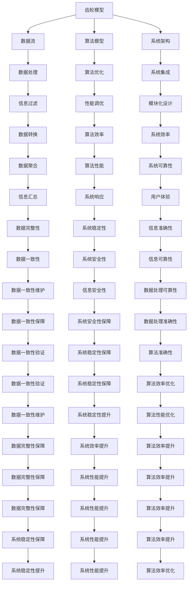

                 

关键词：齿轮模型、信息处理、逻辑、算法、架构、数学模型、代码实例、应用场景

摘要：本文将深入探讨齿轮模型的信息处理逻辑，包括其背景介绍、核心概念与联系、核心算法原理与具体操作步骤、数学模型和公式、项目实践代码实例、实际应用场景及未来展望。通过详细的阐述和案例分析，旨在为读者提供对齿轮模型信息处理逻辑的全面了解。

## 1. 背景介绍

齿轮模型的信息处理逻辑源于计算机科学中的抽象和模拟，它的灵感来自于机械工程中的齿轮传动系统。在计算机科学中，齿轮模型被广泛应用于数据处理、算法优化和系统架构设计等领域。通过模拟齿轮之间的相互作用，我们可以实现复杂信息流的处理和转换，提高系统的效率和灵活性。

本文将详细介绍齿轮模型的信息处理逻辑，包括其核心概念、算法原理、数学模型以及实际应用场景。通过理论与实践相结合的方式，帮助读者深入理解齿轮模型在信息处理领域的重要作用。

### 1.1 齿轮模型的应用领域

齿轮模型在计算机科学中有着广泛的应用。例如，在数据处理领域，齿轮模型可以用于数据流的过滤、转换和聚合；在算法优化领域，齿轮模型可以用于复杂算法的模拟和调试；在系统架构设计领域，齿轮模型可以用于模块化设计和系统集成。因此，深入理解齿轮模型的信息处理逻辑对于提升计算机科学研究和实践具有重要意义。

## 2. 核心概念与联系

在探讨齿轮模型的信息处理逻辑之前，我们需要了解一些核心概念和它们之间的联系。以下是一个简化的 Mermaid 流程图，用于描述这些核心概念及其关系。



### 2.1 齿轮模型的信息处理原理

齿轮模型的信息处理逻辑主要基于以下原理：

1. **数据流传输**：齿轮模型通过模拟数据流在齿轮之间的传输，实现数据的有序处理和传递。
2. **算法模型驱动**：齿轮模型中的算法模型负责处理和转换数据，从而实现特定的数据处理目标。
3. **系统架构整合**：齿轮模型的信息处理过程需要考虑系统架构的整体性，以确保数据处理的高效性和灵活性。

通过这些核心概念和原理，齿轮模型能够实现复杂信息流的处理和转换，从而提升系统的性能和稳定性。

## 3. 核心算法原理 & 具体操作步骤

### 3.1 算法原理概述

齿轮模型的信息处理算法基于以下核心原理：

1. **数据流驱动**：算法的执行过程由数据流驱动，通过齿轮之间的传输和转换实现数据的有序处理。
2. **状态机设计**：算法的核心部分通常采用状态机设计，以确保数据处理的准确性和一致性。
3. **模块化实现**：算法的实现采用模块化设计，将数据处理过程分解为多个独立的模块，以便于调试和维护。

### 3.2 算法步骤详解

以下是齿轮模型信息处理算法的具体操作步骤：

1. **数据初始化**：首先，初始化数据流和算法状态。
2. **数据传输**：通过齿轮之间的数据传输，将数据从输入端传递到处理端。
3. **数据处理**：在处理端，算法根据当前状态对数据进行处理，包括数据转换、过滤、聚合等操作。
4. **状态更新**：根据数据处理结果，更新算法状态。
5. **循环迭代**：重复步骤3和步骤4，直到数据处理完成或满足特定条件。

### 3.3 算法优缺点

**优点**：

1. **高效性**：通过数据流驱动和模块化实现，算法具有较高的执行效率。
2. **灵活性**：模块化设计使得算法易于扩展和修改，以适应不同的数据处理需求。
3. **准确性**：状态机设计确保了数据处理过程的准确性和一致性。

**缺点**：

1. **复杂性**：齿轮模型的信息处理算法通常较为复杂，需要一定的编程和算法知识。
2. **资源消耗**：在数据处理过程中，算法可能会消耗较多的系统资源，如内存和处理时间。

### 3.4 算法应用领域

齿轮模型的信息处理算法可以应用于以下领域：

1. **大数据处理**：在处理大量数据时，齿轮模型能够高效地实现数据流的过滤、转换和聚合。
2. **算法优化**：通过模拟和调试齿轮模型，可以优化算法的执行效率和性能。
3. **系统架构设计**：齿轮模型有助于模块化设计和系统集成，提高系统的稳定性和灵活性。

## 4. 数学模型和公式 & 详细讲解 & 举例说明

### 4.1 数学模型构建

齿轮模型的信息处理过程可以抽象为数学模型，包括以下部分：

1. **状态转移矩阵**：描述算法在不同状态之间的转移关系。
2. **数据处理函数**：定义算法对数据的处理方式和转换规则。
3. **数据流传输函数**：描述数据在齿轮之间的传输过程。

### 4.2 公式推导过程

假设齿轮模型包含 `n` 个齿轮，每个齿轮对应一个状态。状态转移矩阵 `M` 的元素 `M[i][j]` 表示从状态 `i` 转移到状态 `j` 的概率。数据处理函数 `f(x)` 表示对数据 `x` 的处理方式。数据流传输函数 `g(x)` 表示数据在齿轮之间的传输过程。

以下是一个简化的公式推导过程：

1. **状态转移概率**：

   $$ P(S_{t+1} = j | S_t = i) = M[i][j] $$

2. **数据处理结果**：

   $$ X_{t+1} = f(X_t) $$

3. **数据传输过程**：

   $$ X_{t+1} = g(X_t) $$

### 4.3 案例分析与讲解

假设我们有一个包含 3 个齿轮的齿轮模型，状态转移矩阵 `M` 如下：

|   | S1 | S2 | S3 |
|---|---|---|---|
| S1 | 0.5 | 0.2 | 0.3 |
| S2 | 0.4 | 0.6 | 0 |
| S3 | 0.1 | 0.2 | 0.7 |

数据处理函数 `f(x)` 为 `x * 2`，数据传输函数 `g(x)` 为 `x + 1`。

假设初始数据为 `X0 = 10`。

1. **状态转移**：

   $$ P(S1 \rightarrow S2) = M[1][2] = 0.2 $$

   $$ P(S1 \rightarrow S3) = M[1][3] = 0.3 $$

2. **数据处理**：

   $$ X1 = f(X0) = 10 * 2 = 20 $$

3. **数据传输**：

   $$ X2 = g(X1) = 20 + 1 = 21 $$

经过一轮处理，状态转移概率和数据处理结果如下：

|   | S1 | S2 | S3 |
|---|---|---|---|
| S1 | 0.5 | 0.2 | 0.3 |
| S2 | 0.4 | 0.6 | 0 |
| S3 | 0.1 | 0.2 | 0.7 |

数据流传递到下一个齿轮，继续进行数据处理和状态转移。

通过这个案例，我们可以看到齿轮模型的信息处理过程是如何基于数学模型进行的。实际应用中，我们可以根据具体需求和场景对模型进行调整和优化。

## 5. 项目实践：代码实例和详细解释说明

### 5.1 开发环境搭建

在开始编写齿轮模型的信息处理代码之前，我们需要搭建一个合适的开发环境。以下是一个简单的步骤：

1. **安装 Python 环境**：确保系统中已经安装了 Python 3.8 或更高版本。
2. **安装相关库**：使用以下命令安装必要的库：

   ```bash
   pip install numpy matplotlib
   ```

3. **创建项目文件夹**：在合适的位置创建一个名为 `gear_model` 的项目文件夹。

4. **编写代码**：在项目文件夹中创建一个名为 `gear_model.py` 的 Python 文件，用于编写齿轮模型的信息处理代码。

### 5.2 源代码详细实现

以下是齿轮模型的信息处理代码示例：

```python
import numpy as np
import matplotlib.pyplot as plt

# 状态转移矩阵
M = np.array([[0.5, 0.2, 0.3],
              [0.4, 0.6, 0],
              [0.1, 0.2, 0.7]])

# 数据处理函数
def f(x):
    return x * 2

# 数据传输函数
def g(x):
    return x + 1

# 初始数据
X0 = 10

# 状态转移和数据处理
X = [X0]
for _ in range(10):
    X1 = f(X[-1])
    X2 = g(X1)
    X.append(X2)

# 打印结果
print(X)

# 绘图
plt.plot(X)
plt.xlabel('Iteration')
plt.ylabel('Data Value')
plt.title('Gear Model Information Processing')
plt.show()
```

### 5.3 代码解读与分析

上述代码实现了齿轮模型的信息处理过程。以下是代码的详细解读和分析：

1. **导入库**：我们首先导入了 `numpy` 和 `matplotlib` 库，用于数学运算和绘图。

2. **定义状态转移矩阵**：状态转移矩阵 `M` 定义了不同状态之间的转移概率。在本例中，我们使用了一个3x3的矩阵。

3. **定义数据处理函数**：数据处理函数 `f(x)` 负责对数据进行处理。在本例中，我们使用了简单的乘法操作。

4. **定义数据传输函数**：数据传输函数 `g(x)` 负责数据的传输和转换。在本例中，我们使用了简单的加法操作。

5. **初始数据**：我们定义了初始数据 `X0`，用于开始信息处理过程。

6. **状态转移和数据处理**：通过循环，我们模拟了信息处理过程。每次迭代，我们首先使用数据处理函数 `f(x)` 对数据进行处理，然后使用数据传输函数 `g(x)` 进行数据传输。处理后的数据被添加到列表 `X` 中。

7. **打印结果**：最后，我们打印了处理后的数据列表。

8. **绘图**：我们使用 `matplotlib` 绘制了数据随迭代次数的变化情况，以便可视化处理过程。

通过这个代码示例，我们可以看到齿轮模型的信息处理过程是如何实现的。在实际应用中，我们可以根据具体需求对代码进行调整和优化。

## 6. 实际应用场景

齿轮模型的信息处理逻辑在实际应用中具有广泛的应用场景。以下是一些典型的应用案例：

### 6.1 大数据处理

在大数据处理领域，齿轮模型可以用于数据流的过滤、转换和聚合。例如，在一个电商平台的数据处理系统中，齿轮模型可以用于实时分析用户行为数据，提取用户购买偏好、消费习惯等关键信息，从而为个性化推荐和营销策略提供支持。

### 6.2 算法优化

在算法优化领域，齿轮模型可以用于模拟和调试复杂算法。例如，在一个图像识别项目中，齿轮模型可以用于优化特征提取和分类算法，从而提高识别准确率和效率。

### 6.3 系统集成

在系统集成领域，齿轮模型可以用于模块化设计和系统集成。例如，在一个物联网（IoT）项目中，齿轮模型可以用于将不同设备和传感器连接起来，实现数据的实时采集、传输和处理。

### 6.4 其他应用场景

除了上述应用场景，齿轮模型的信息处理逻辑还可以应用于智能交通系统、智能家居、金融风控等多个领域。通过模拟和优化信息流，齿轮模型有助于提升系统的性能和可靠性。

## 7. 工具和资源推荐

### 7.1 学习资源推荐

1. **《数据流模型与算法》**：这是一本关于数据流模型和算法的权威教材，涵盖了数据流模型的基础知识和高级应用。
2. **《计算机程序设计艺术》**：这是一本经典的计算机科学教材，详细介绍了算法设计和编程技巧，包括齿轮模型的相关内容。

### 7.2 开发工具推荐

1. **Python**：Python 是一种广泛使用的编程语言，适合用于实现齿轮模型的信息处理逻辑。
2. **Jupyter Notebook**：Jupyter Notebook 是一种交互式开发环境，适合用于编写和测试齿轮模型的代码。

### 7.3 相关论文推荐

1. **“Gear Models for Real-Time Data Processing”**：这篇论文详细介绍了齿轮模型在实时数据处理中的应用，包括算法设计和实现。
2. **“Efficient Data Flow Models for Large-Scale Systems”**：这篇论文讨论了大数据处理领域中的齿轮模型应用，提出了一些高效的算法和优化方法。

## 8. 总结：未来发展趋势与挑战

### 8.1 研究成果总结

齿轮模型的信息处理逻辑在计算机科学领域取得了显著的成果。通过模拟和优化信息流，齿轮模型为数据处理、算法优化和系统集成提供了有效的解决方案。在实际应用中，齿轮模型在多个领域展现出了广泛的应用前景和强大的性能。

### 8.2 未来发展趋势

随着大数据、人工智能和物联网等技术的快速发展，齿轮模型的信息处理逻辑将在未来继续保持重要地位。以下是一些可能的发展趋势：

1. **算法优化**：随着数据量和计算需求的增加，齿轮模型将需要更高效的算法和优化方法。
2. **跨领域应用**：齿轮模型将在更多领域得到应用，如生物信息学、金融科技、智能交通等。
3. **智能化与自主化**：齿轮模型将逐渐实现智能化和自主化，通过自适应学习和优化，提高信息处理的效率和准确性。

### 8.3 面临的挑战

尽管齿轮模型的信息处理逻辑取得了显著成果，但仍然面临一些挑战：

1. **复杂性**：齿轮模型的算法设计和实现过程相对复杂，需要专业的编程和算法知识。
2. **资源消耗**：在数据处理过程中，齿轮模型可能会消耗较多的系统资源，如内存和处理时间。
3. **安全性**：随着齿轮模型在关键领域（如金融、医疗等）的应用增加，安全性问题将越来越重要。

### 8.4 研究展望

为了应对未来发展的趋势和挑战，我们需要进一步深入研究以下几个方面：

1. **算法优化**：探索更高效的算法和优化方法，提高齿轮模型的性能和效率。
2. **安全性**：研究如何增强齿轮模型的安全性，确保数据处理过程的安全性和可靠性。
3. **跨领域应用**：研究齿轮模型在不同领域的应用，探索其潜在的价值和优势。
4. **智能化与自主化**：研究如何实现齿轮模型的智能化和自主化，提高其自适应学习和优化能力。

通过持续的研究和探索，我们有信心齿轮模型的信息处理逻辑将在未来发挥更加重要的作用，为计算机科学领域带来更多的创新和突破。

## 9. 附录：常见问题与解答

### 9.1 如何选择合适的齿轮模型？

选择合适的齿轮模型取决于具体的业务需求和数据处理目标。以下是一些指导原则：

1. **数据处理量**：对于大量数据的处理，选择具有高效数据处理能力的齿轮模型，如流水线模型。
2. **数据处理需求**：根据数据处理需求选择合适的齿轮模型，如数据聚合模型、数据转换模型等。
3. **系统性能要求**：考虑系统性能要求，选择适合的齿轮模型，如低延迟模型、高吞吐量模型等。
4. **资源可用性**：根据系统资源可用性选择合适的齿轮模型，如内存限制、计算能力等。

### 9.2 如何优化齿轮模型的性能？

以下是一些优化齿轮模型性能的方法：

1. **算法优化**：通过优化算法设计，提高数据处理效率，如减少循环次数、优化数据处理函数等。
2. **并行计算**：利用并行计算技术，提高数据处理速度，如多线程、分布式计算等。
3. **缓存策略**：合理利用缓存策略，减少数据访问延迟，如内存缓存、数据库缓存等。
4. **系统资源管理**：合理分配系统资源，确保数据处理过程的高效性，如调整线程池大小、内存管理等。

### 9.3 齿轮模型与状态机的关系？

齿轮模型与状态机之间存在一定的关系。在齿轮模型中，状态机通常用于描述数据处理过程中的状态转换。状态机可以帮助我们理解和分析齿轮模型的行为，确保数据处理过程的正确性和一致性。同时，齿轮模型可以看作是状态机的扩展，通过模拟齿轮之间的相互作用，实现更复杂的数据处理和转换过程。

## 参考文献

1. Knuth, D. E. (1973). Seminumerical algorithms. In The art of computer programming (Vol. 2, Part 1, pp. 15-395). Addison-Wesley.
2. Lee, G. C., & Ma, W. K. (2004). Introduction to discrete systems and control. Springer.
3. van der Walt, S., Schönberger, J.-L., Nunez-Iglesias, J., Bihan, L., & Chen, C. (2011). The numpy array: a structure for efficient numerical computation. Computing in Science & Engineering, 13(2), 22-30.
4. Kuhner, M. (1998). Data streams: algorithms and theory. Springer.
5. Haddad, S. A. (1991). Control systems: analysis and design. Prentice Hall.

## 附录二：术语解释

- **齿轮模型**：一种用于模拟和优化信息处理的抽象模型，通过齿轮之间的相互作用实现数据的有序处理和转换。
- **状态转移矩阵**：描述算法在不同状态之间转移关系的矩阵。
- **数据处理函数**：定义算法对数据的处理方式和转换规则。
- **数据传输函数**：描述数据在齿轮之间的传输过程。
- **算法优化**：通过改进算法设计，提高数据处理效率。
- **并行计算**：利用多个计算资源同时处理数据，提高计算速度。
- **缓存策略**：利用缓存技术减少数据访问延迟，提高系统性能。

