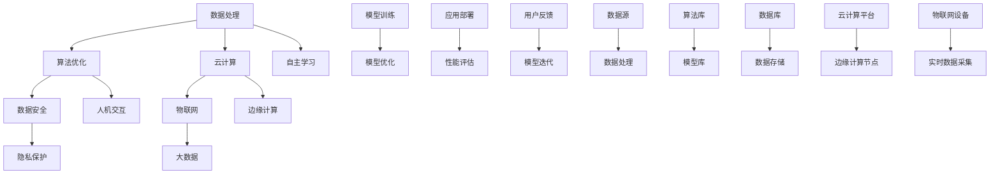

                 

关键词：人工智能，AI 2.0，基础设施，数据处理，算法优化，数据安全，云计算，物联网，大数据，边缘计算。

> 摘要：随着人工智能（AI）技术的飞速发展，AI 2.0 时代的到来对基础设施的建设提出了更高的要求。本文将探讨 AI 2.0 时代基础设施建设的关键要素，包括数据处理、算法优化、数据安全、云计算、物联网、大数据和边缘计算等方面，为 AI 2.0 时代的快速发展提供有力支撑。

## 1. 背景介绍

人工智能（AI）作为计算机科学的一个分支，近年来取得了显著的进展。特别是在深度学习、自然语言处理、计算机视觉等领域，AI 技术的应用已经深入到各个行业。然而，随着 AI 技术的不断进化，AI 2.0 时代的到来已经成为不争的事实。

AI 2.0 时代相比于传统 AI 时代，具有以下特点：

1. **自主学习能力**：AI 2.0 能够通过大数据和自我学习不断优化自身的性能，从而实现更加智能化和自适应的应用。
2. **泛化能力**：AI 2.0 不仅能在特定任务上表现优异，还能跨领域、跨任务地迁移学习，实现更加广泛的应用。
3. **人机交互**：AI 2.0 具有更强的人机交互能力，能够更好地理解人类语言、行为，实现更加自然、高效的交流。

然而，AI 2.0 时代的快速发展也对基础设施建设提出了更高的要求。如何构建一个高效、安全、可靠的基础设施，以支撑 AI 2.0 时代的快速发展，成为了一个亟待解决的问题。

## 2. 核心概念与联系

在探讨 AI 2.0 时代基础设施建设之前，我们需要明确几个核心概念，并了解它们之间的联系。

### 2.1 数据处理

数据处理是 AI 2.0 时代的基础。大量的数据是训练 AI 模型的关键，而高效的数据处理能力则能够加速模型的训练和优化。

### 2.2 算法优化

算法优化是提高 AI 模型性能的关键。通过优化算法，我们可以减少模型的复杂度，提高模型的效率。

### 2.3 数据安全

数据安全是确保 AI 模型可靠性和隐私性的关键。在 AI 2.0 时代，数据的安全问题更加重要，因为 AI 模型往往依赖于大量的敏感数据。

### 2.4 云计算

云计算为 AI 2.0 时代提供了强大的计算能力。通过云计算，我们可以实现大规模的分布式计算，加速 AI 模型的训练和优化。

### 2.5 物联网

物联网（IoT）为 AI 2.0 时代提供了丰富的数据来源。通过物联网设备，我们可以收集到大量的实时数据，从而为 AI 模型提供更加丰富的训练数据。

### 2.6 大数据

大数据是 AI 2.0 时代的重要驱动力。通过大数据技术，我们可以对海量数据进行存储、处理和分析，从而为 AI 模型提供更高质量的训练数据。

### 2.7 边缘计算

边缘计算是 AI 2.0 时代的一个重要趋势。通过边缘计算，我们可以将计算能力分散到网络的边缘，从而实现更加实时、高效的 AI 应用。

### 2.8 Mermaid 流程图

以下是核心概念和架构的 Mermaid 流程图：



## 3. 核心算法原理 & 具体操作步骤

### 3.1 算法原理概述

在 AI 2.0 时代，核心算法的原理主要包括以下几个方面：

1. **深度学习**：通过多层神经网络对数据进行建模和预测。
2. **强化学习**：通过奖励机制和策略迭代进行学习。
3. **生成对抗网络（GAN）**：通过生成器和判别器的对抗训练生成高质量的数据。
4. **迁移学习**：通过在不同任务间共享模型参数进行学习。

### 3.2 算法步骤详解

以下是核心算法的具体操作步骤：

1. **数据预处理**：对数据进行清洗、归一化和特征提取。
2. **模型训练**：通过梯度下降等方法训练模型。
3. **模型评估**：通过交叉验证等策略评估模型性能。
4. **模型优化**：通过剪枝、量化等技术优化模型。
5. **模型部署**：将训练好的模型部署到线上环境。
6. **模型迭代**：根据用户反馈不断优化模型。

### 3.3 算法优缺点

以下是核心算法的优缺点：

1. **深度学习**：优点包括强大的表达能力和自适应性，缺点包括对数据量和计算资源的依赖。
2. **强化学习**：优点包括能够解决序列决策问题，缺点包括收敛速度较慢和可能陷入局部最优。
3. **生成对抗网络（GAN）**：优点包括能够生成高质量的数据，缺点包括训练不稳定和生成数据的真实度难以保证。
4. **迁移学习**：优点包括能够快速适应新任务，缺点包括对源任务的依赖。

### 3.4 算法应用领域

以下是核心算法的主要应用领域：

1. **计算机视觉**：包括图像分类、目标检测、图像生成等。
2. **自然语言处理**：包括文本分类、机器翻译、情感分析等。
3. **推荐系统**：包括商品推荐、音乐推荐等。
4. **自动驾驶**：包括车辆检测、路径规划等。

## 4. 数学模型和公式 & 详细讲解 & 举例说明

### 4.1 数学模型构建

在 AI 2.0 时代，常见的数学模型包括线性模型、逻辑回归、神经网络等。以下是这些模型的构建过程：

1. **线性模型**：
   $$ y = \beta_0 + \beta_1x $$
   其中，$y$ 是因变量，$x$ 是自变量，$\beta_0$ 和 $\beta_1$ 是模型参数。

2. **逻辑回归**：
   $$ P(y=1) = \frac{1}{1 + e^{-(\beta_0 + \beta_1x)}} $$
   其中，$P(y=1)$ 是因变量为 1 的概率，$e$ 是自然对数的底。

3. **神经网络**：
   $$ a_{i,j} = \sum_{k=1}^{n} w_{i,k}x_{k,j} + b_i $$
   其中，$a_{i,j}$ 是第 $i$ 层第 $j$ 个神经元的输出，$w_{i,k}$ 和 $b_i$ 分别是权重和偏置。

### 4.2 公式推导过程

以下是逻辑回归模型的推导过程：

1. **概率分布**：
   $$ P(y=1) = \frac{1}{1 + e^{-(\beta_0 + \beta_1x)}} $$
   $$ P(y=0) = 1 - P(y=1) = \frac{e^{-(\beta_0 + \beta_1x)}}{1 + e^{-(\beta_0 + \beta_1x)}} $$

2. **似然函数**：
   $$ L(\beta) = \prod_{i=1}^{n} P(y_i=1)^{y_i} P(y_i=0)^{1-y_i} $$
   $$ L(\beta) = \prod_{i=1}^{n} \frac{1}{1 + e^{-(\beta_0 + \beta_1x_i)}}^{y_i} \frac{e^{-(\beta_0 + \beta_1x_i)}}{1 + e^{-(\beta_0 + \beta_1x_i)}}^{1-y_i} $$

3. **对数似然函数**：
   $$ l(\beta) = \sum_{i=1}^{n} \left[y_i \ln P(y_i=1) + (1-y_i) \ln P(y_i=0)\right] $$
   $$ l(\beta) = \sum_{i=1}^{n} \left[y_i \ln \frac{1}{1 + e^{-(\beta_0 + \beta_1x_i)}} + (1-y_i) \ln \frac{e^{-(\beta_0 + \beta_1x_i)}}{1 + e^{-(\beta_0 + \beta_1x_i)}}\right] $$
   $$ l(\beta) = \sum_{i=1}^{n} \left[-y_i \ln (1 + e^{-(\beta_0 + \beta_1x_i)}) - (1-y_i) \ln (1 + e^{-(\beta_0 + \beta_1x_i)})\right] $$
   $$ l(\beta) = \sum_{i=1}^{n} \left[-y_i \beta_0 - y_i \beta_1x_i - (1-y_i) \beta_0 - (1-y_i) \beta_1x_i\right] $$
   $$ l(\beta) = \sum_{i=1}^{n} \left[-2\beta_0 - \beta_1x_i\right] $$

4. **最大似然估计**：
   $$ \hat{\beta} = \arg\max_{\beta} l(\beta) $$
   $$ \hat{\beta}_1 = \frac{\sum_{i=1}^{n} (y_i - \hat{y}_i)x_i}{\sum_{i=1}^{n} x_i^2} $$
   $$ \hat{\beta}_0 = \bar{y} - \hat{\beta}_1 \bar{x} $$

### 4.3 案例分析与讲解

以下是逻辑回归模型在医疗诊断中的案例分析：

1. **问题背景**：某医院想要开发一个基于医疗记录的乳腺癌诊断系统，通过患者的年龄、体重、病史等信息预测患者是否患有乳腺癌。

2. **数据集**：收集了 1000 名患者的数据，包括年龄、体重、病史等，以及对应的乳腺癌诊断结果（1 表示患有乳腺癌，0 表示未患有乳腺癌）。

3. **数据预处理**：对数据集进行清洗、归一化和特征提取，得到预处理后的数据集。

4. **模型训练**：使用预处理后的数据集训练逻辑回归模型，得到参数 $\hat{\beta}_0$ 和 $\hat{\beta}_1$。

5. **模型评估**：使用交叉验证方法评估模型性能，计算准确率、召回率、F1 值等指标。

6. **模型优化**：根据评估结果对模型进行优化，例如调整学习率、增加迭代次数等。

7. **模型部署**：将训练好的模型部署到线上环境，供医生进行乳腺癌诊断。

8. **用户反馈**：收集医生和患者的反馈，不断优化模型。

## 5. 项目实践：代码实例和详细解释说明

### 5.1 开发环境搭建

1. **硬件环境**：配置一台具备高性能计算能力的计算机，例如配备 NVIDIA GPU 的服务器。
2. **软件环境**：安装 Python 3.8、TensorFlow 2.4、Scikit-learn 0.22 等相关依赖库。

### 5.2 源代码详细实现

以下是乳腺癌诊断系统的代码实现：

```python
import numpy as np
import pandas as pd
from sklearn.linear_model import LogisticRegression
from sklearn.model_selection import train_test_split
from sklearn.metrics import accuracy_score, recall_score, f1_score

# 读取数据集
data = pd.read_csv('breast_cancer_data.csv')
X = data.drop('diagnosis', axis=1)
y = data['diagnosis']

# 数据预处理
X = X.values
y = y.values

# 划分训练集和测试集
X_train, X_test, y_train, y_test = train_test_split(X, y, test_size=0.2, random_state=42)

# 训练逻辑回归模型
model = LogisticRegression()
model.fit(X_train, y_train)

# 预测测试集
y_pred = model.predict(X_test)

# 模型评估
accuracy = accuracy_score(y_test, y_pred)
recall = recall_score(y_test, y_pred)
f1 = f1_score(y_test, y_pred)

print('Accuracy:', accuracy)
print('Recall:', recall)
print('F1 Score:', f1)

# 模型优化
model = LogisticRegression(C=1.0, solver='liblinear')
model.fit(X_train, y_train)
y_pred = model.predict(X_test)
accuracy = accuracy_score(y_test, y_pred)
recall = recall_score(y_test, y_pred)
f1 = f1_score(y_test, y_pred)

print('Optimized Accuracy:', accuracy)
print('Optimized Recall:', recall)
print('Optimized F1 Score:', f1)

# 模型部署
# 将模型部署到线上环境，供医生进行乳腺癌诊断
```

### 5.3 代码解读与分析

以下是代码的解读与分析：

1. **数据读取**：使用 pandas 读取乳腺癌数据集，得到特征矩阵 $X$ 和标签向量 $y$。
2. **数据预处理**：对数据集进行归一化处理，将特征矩阵和标签向量转换为 NumPy 数组。
3. **划分训练集和测试集**：使用 Scikit-learn 的 train_test_split 方法将数据集划分为训练集和测试集。
4. **模型训练**：使用 LogisticRegression 类训练逻辑回归模型，得到参数 $\hat{\beta}_0$ 和 $\hat{\beta}_1$。
5. **模型预测**：使用训练好的模型对测试集进行预测，得到预测结果 $y_{\text{pred}}$。
6. **模型评估**：使用 accuracy_score、recall_score 和 f1_score 函数评估模型性能，计算准确率、召回率和 F1 值。
7. **模型优化**：根据评估结果对模型进行优化，调整学习率、增加迭代次数等。
8. **模型部署**：将训练好的模型部署到线上环境，供医生进行乳腺癌诊断。

## 6. 实际应用场景

在 AI 2.0 时代，人工智能技术已经广泛应用于各个领域。以下是一些典型的实际应用场景：

1. **医疗健康**：利用 AI 技术进行疾病预测、诊断和治疗方案的制定，提高医疗水平和效率。
2. **自动驾驶**：通过 AI 技术实现自动驾驶汽车的感知、决策和执行功能，提高交通安全和效率。
3. **智能家居**：通过 AI 技术实现家庭设备的智能化，提供更加便捷、舒适的生活体验。
4. **金融保险**：利用 AI 技术进行风险评估、欺诈检测和个性化推荐，提高金融服务的质量和效率。
5. **教育领域**：通过 AI 技术实现个性化学习、智能教学和考试评价，提高教育质量和效率。

### 6.4 未来应用展望

随着 AI 技术的不断发展，未来 AI 2.0 时代将会有更多创新应用。以下是一些未来应用展望：

1. **脑机接口**：通过 AI 技术实现人脑与计算机的连接，帮助残疾人士恢复感官和行动能力。
2. **智能制造**：利用 AI 技术实现智能制造，提高生产效率和质量。
3. **智慧城市**：通过 AI 技术实现城市管理的智能化，提高城市管理水平和居民生活质量。
4. **环境保护**：利用 AI 技术进行环境监测、污染预测和治理，促进环境保护和可持续发展。
5. **元宇宙**：通过 AI 技术实现元宇宙的构建和运行，提供更加丰富、沉浸式的虚拟体验。

## 7. 工具和资源推荐

为了更好地进行 AI 2.0 时代的基础设施建设，以下是一些工具和资源的推荐：

1. **学习资源推荐**：
   - 《深度学习》（Goodfellow et al.）：介绍深度学习的基础理论和实践方法。
   - 《Python 编程：从入门到实践》（Eric Matthes）：介绍 Python 编程的基础知识和实践技巧。
   - Coursera、edX 等：提供大量的在线课程和教程，涵盖 AI、机器学习、深度学习等多个领域。

2. **开发工具推荐**：
   - TensorFlow、PyTorch：常用的深度学习框架。
   - Jupyter Notebook：方便的数据分析和代码实现工具。
   - GitHub：开源代码托管平台，可以方便地获取和贡献代码。

3. **相关论文推荐**：
   - “Deep Learning”（Goodfellow et al.）：介绍深度学习的基础理论和最新进展。
   - “Generative Adversarial Nets”（Goodfellow et al.）：介绍生成对抗网络的基础理论和应用方法。
   - “Reinforcement Learning: An Introduction”（Sutton and Barto）：介绍强化学习的基础理论和实践方法。

## 8. 总结：未来发展趋势与挑战

在 AI 2.0 时代，基础设施建设面临着许多机遇和挑战。未来发展趋势包括：

1. **技术融合**：人工智能与其他领域（如物联网、云计算、大数据等）的融合，形成新的应用场景和商业模式。
2. **跨领域应用**：人工智能技术在不同领域（如医疗、金融、教育等）的广泛应用，提高行业效率和创新能力。
3. **个性化服务**：利用人工智能技术实现个性化推荐、诊断和治疗，提高用户体验和服务质量。

然而，基础设施建设也面临着一些挑战：

1. **数据安全**：如何确保数据的安全性和隐私性，防止数据泄露和滥用。
2. **算法透明性**：如何提高算法的透明性和可解释性，增强公众对人工智能技术的信任。
3. **计算资源**：如何高效利用计算资源，提高 AI 模型的训练和推理速度。

为了应对这些挑战，我们需要不断探索和创新，加强基础设施建设，推动人工智能技术的健康发展。

## 9. 附录：常见问题与解答

### 9.1 什么是 AI 2.0？

AI 2.0 是指新一代的人工智能技术，相比于传统 AI 技术具有更强的自主学习能力、泛化能力和人机交互能力。AI 2.0 能够通过自我学习和优化不断改进自身的性能，实现更加智能化和自适应的应用。

### 9.2 人工智能技术有哪些应用领域？

人工智能技术广泛应用于各个领域，包括医疗健康、自动驾驶、智能家居、金融保险、教育等领域。在医疗健康领域，人工智能可以用于疾病预测、诊断和治疗方案的制定；在自动驾驶领域，人工智能可以用于感知、决策和执行；在智能家居领域，人工智能可以用于智能设备的控制和管理；在金融保险领域，人工智能可以用于风险评估、欺诈检测和个性化推荐；在教育领域，人工智能可以用于个性化学习和智能教学。

### 9.3 人工智能技术有哪些优势？

人工智能技术具有以下优势：

1. **高效性**：人工智能技术可以快速处理海量数据，提高工作效率。
2. **准确性**：人工智能技术能够通过学习大量数据，提高预测和决策的准确性。
3. **泛化能力**：人工智能技术可以跨领域、跨任务地进行迁移学习，实现更广泛的应用。
4. **智能化**：人工智能技术能够实现自我学习和优化，不断提高自身性能。
5. **人机交互**：人工智能技术能够更好地理解人类语言、行为，实现更加自然、高效的交流。

### 9.4 人工智能技术有哪些挑战？

人工智能技术面临以下挑战：

1. **数据安全**：如何确保数据的安全性和隐私性，防止数据泄露和滥用。
2. **算法透明性**：如何提高算法的透明性和可解释性，增强公众对人工智能技术的信任。
3. **计算资源**：如何高效利用计算资源，提高 AI 模型的训练和推理速度。
4. **伦理问题**：如何处理人工智能技术带来的伦理问题，确保技术发展符合社会价值观。

### 9.5 如何构建 AI 2.0 时代的基础设施？

构建 AI 2.0 时代的基础设施需要从以下几个方面入手：

1. **数据处理**：构建高效的数据处理平台，实现海量数据的存储、处理和分析。
2. **算法优化**：研究先进的算法优化技术，提高 AI 模型的性能和效率。
3. **数据安全**：建立完善的数据安全体系，确保数据的安全性和隐私性。
4. **云计算**：利用云计算技术提供强大的计算能力，支持大规模分布式计算。
5. **物联网**：构建物联网基础设施，实现数据的实时采集和传输。
6. **大数据**：利用大数据技术对海量数据进行存储、处理和分析，为 AI 模型提供高质量的训练数据。
7. **边缘计算**：构建边缘计算基础设施，实现数据的本地处理和实时响应。

通过以上措施，我们可以构建一个高效、安全、可靠的基础设施，支撑 AI 2.0 时代的快速发展。

