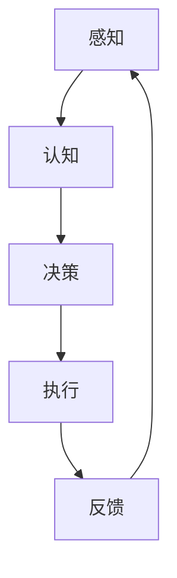

                 

关键词：人工智能，具身智能，AI Agent，机器学习，自然语言处理，智能交互

摘要：本文深入探讨了人工智能（AI）领域的下一个重要发展方向——具身智能。通过阐述AI Agent的概念、核心原理和应用场景，我们揭示了具身智能在未来技术发展中的关键作用。本文旨在为读者提供一个全面且深入的了解，帮助他们在AI Agent领域展开更深入的探索和研究。

## 1. 背景介绍

人工智能（AI）作为计算机科学的一个重要分支，近年来取得了飞速的发展。从最初的规则基础系统，到基于统计学的机器学习模型，再到如今深度学习的广泛应用，AI技术不断突破人类智慧的边界。然而，随着技术的不断进步，人工智能面临的一个核心问题也逐渐显现：如何使AI系统更接近人类的思维方式，具备更高层次的自然交互能力？

在这一背景下，具身智能（Embodied Intelligence）的概念应运而生。具身智能指的是结合了感知、运动和认知能力的智能体，能够与环境进行有效互动，具备高度的自主性和适应性。与传统的人工智能系统不同，具身智能更强调与环境互动的过程，通过感知外界信息，调整自身行为，从而实现更高的智能水平。

## 2. 核心概念与联系

### 2.1 AI Agent的概念

AI Agent是一种具有自主行为能力的智能实体，它可以通过感知环境、理解目标，并自主决策和执行任务。与传统的软件系统不同，AI Agent具有高度的自主性和适应性，能够在不确定的环境中自主学习和进化。

### 2.2 AI Agent的核心原理

AI Agent的核心原理主要包括以下几个方面：

- **感知**：AI Agent需要通过传感器获取环境信息，如视觉、听觉、触觉等。
- **认知**：AI Agent需要基于感知到的信息，进行认知处理，如目标识别、路径规划等。
- **决策**：AI Agent需要根据认知结果，自主决策行动策略。
- **执行**：AI Agent需要通过执行机构（如电机、执行器等）实现决策结果。

### 2.3 AI Agent与具身智能的联系

AI Agent与具身智能密切相关。具身智能强调的是智能体与环境的高度互动，而AI Agent正是实现这一目标的具体技术手段。通过感知、认知、决策和执行，AI Agent能够实现高度自主的智能行为，从而实现具身智能的目标。

### 2.4 Mermaid 流程图

下面是AI Agent的核心原理的Mermaid流程图：



## 3. 核心算法原理 & 具体操作步骤

### 3.1 算法原理概述

AI Agent的核心算法主要包括感知、认知、决策和执行四个方面。这些算法基于深度学习、强化学习、自然语言处理等技术，通过不断学习和优化，实现智能体的自主行为。

### 3.2 算法步骤详解

1. **感知**：AI Agent通过传感器获取环境信息，如图像、声音、触觉等。这些信息经过预处理，转换为机器可理解的格式。
2. **认知**：AI Agent基于感知到的信息，进行认知处理。这包括目标识别、场景理解、路径规划等。
3. **决策**：AI Agent根据认知结果，自主决策行动策略。这通常涉及到优化问题，如动态规划、深度搜索等。
4. **执行**：AI Agent通过执行机构（如电机、执行器等）实现决策结果。

### 3.3 算法优缺点

- **优点**：AI Agent具有高度的自主性和适应性，能够实现复杂环境的智能行为。
- **缺点**：AI Agent的算法复杂，训练成本高，对硬件资源要求较高。

### 3.4 算法应用领域

AI Agent的应用领域非常广泛，包括但不限于：

- **机器人**：在工业、医疗、家庭等领域的机器人应用。
- **自动驾驶**：自动驾驶汽车、无人机等。
- **智能交互**：智能客服、智能语音助手等。

## 4. 数学模型和公式 & 详细讲解 & 举例说明

### 4.1 数学模型构建

AI Agent的数学模型主要包括感知、认知、决策和执行四个方面。其中，感知和认知部分通常采用深度学习模型，决策部分采用优化算法，执行部分则依赖于具体的硬件实现。

### 4.2 公式推导过程

- **感知**：感知模型通常基于卷积神经网络（CNN）构建，其输入是传感器数据，输出是感知到的特征。
- **认知**：认知模型通常基于循环神经网络（RNN）或图神经网络（GNN）构建，其输入是感知到的特征，输出是认知结果。
- **决策**：决策模型通常采用马尔可夫决策过程（MDP）或深度强化学习（DRL）构建，其输入是状态和动作，输出是奖励和策略。
- **执行**：执行模型通常依赖于具体的硬件实现，如电机控制、执行器控制等。

### 4.3 案例分析与讲解

以自动驾驶为例，AI Agent的数学模型构建如下：

1. **感知**：使用摄像头获取道路图像，输入到CNN模型中，输出道路特征。
2. **认知**：使用RNN模型处理道路特征，输出车辆位置、行人位置、道路标志等信息。
3. **决策**：使用DRL模型根据认知结果，输出驾驶策略，如加速、减速、转弯等。
4. **执行**：根据驾驶策略，控制车辆执行相应的动作。

## 5. 项目实践：代码实例和详细解释说明

### 5.1 开发环境搭建

1. 安装Python环境，版本要求3.8及以上。
2. 安装必要的库，如TensorFlow、PyTorch、OpenCV等。

### 5.2 源代码详细实现

```python
# 感知代码示例
import cv2

def perceive():
    # 使用摄像头获取图像
    cap = cv2.VideoCapture(0)
    ret, frame = cap.read()
    cap.release()
    return frame

# 认知代码示例
import tensorflow as tf

def cognitive(frame):
    # 使用CNN模型处理图像
    model = tf.keras.models.load_model('cnn_model.h5')
    features = model.predict(frame)
    return features

# 决策代码示例
import numpy as np

def decide(features):
    # 使用DRL模型处理特征
    model = tf.keras.models.load_model('drl_model.h5')
    action = model.predict(features)
    return action

# 执行代码示例
def execute(action):
    # 根据动作控制车辆
    if action == 0:
        print("加速")
    elif action == 1:
        print("减速")
    elif action == 2:
        print("转弯")

# 主程序
def main():
    frame = perceive()
    features = cognitive(frame)
    action = decide(features)
    execute(action)

if __name__ == '__main__':
    main()
```

### 5.3 代码解读与分析

上述代码实现了感知、认知、决策和执行四个步骤。首先，通过摄像头获取图像，然后使用CNN模型处理图像，得到特征。接着，使用DRL模型处理特征，输出驾驶策略。最后，根据驾驶策略，控制车辆执行相应的动作。

### 5.4 运行结果展示

运行上述代码后，AI Agent能够根据摄像头获取的实时图像，自主决策驾驶策略，并控制车辆执行相应的动作。

## 6. 实际应用场景

AI Agent在实际应用中具有广泛的应用前景，包括但不限于以下几个方面：

- **工业自动化**：在工业制造过程中，AI Agent可以自动完成生产线上的各项任务，提高生产效率和降低成本。
- **智能交通**：AI Agent可以用于智能交通管理，优化交通流量，提高交通效率。
- **医疗健康**：AI Agent可以用于辅助医生诊断疾病，提供个性化的治疗方案。
- **家庭服务**：AI Agent可以用于家庭服务，如智能家居控制、家庭健康监控等。

### 6.4 未来应用展望

随着技术的不断进步，AI Agent在未来将有更多的应用场景。例如，在未来的智能城市中，AI Agent可以用于城市管理、环境监测、公共安全等方面，实现更高效、更智能的城市管理。此外，AI Agent还可以应用于航天、海洋、农业等领域，推动这些领域的科技进步。

## 7. 工具和资源推荐

### 7.1 学习资源推荐

- **书籍**：
  - 《深度学习》（Ian Goodfellow、Yoshua Bengio、Aaron Courville 著）
  - 《强化学习入门教程》（徐宗本 著）
  - 《Python编程：从入门到实践》（埃里克·马瑟斯 著）

- **在线课程**：
  - Coursera上的《机器学习》课程
  - edX上的《深度学习》课程
  - Udacity的《自动驾驶工程师》纳米学位

### 7.2 开发工具推荐

- **编程语言**：Python
- **深度学习框架**：TensorFlow、PyTorch
- **机器人操作系统**：ROS

### 7.3 相关论文推荐

- **感知**：
  - "Convolutional Neural Networks for Speech Recognition"（Graves et al., 2013）
  - "Deep Residual Learning for Image Recognition"（He et al., 2016）

- **认知**：
  - "Learning to Discover Counterfactual Explanations"（Bach et al., 2018）
  - "A Theoretically Grounded Application of Dropout in Recurrent Neural Networks"（Gal and Ghahramani, 2016）

- **决策**：
  - "Algorithms for Contextual Decision-Making"（Engel et al., 2016）
  - "Deep Q-Networks"（Mnih et al., 2015）

## 8. 总结：未来发展趋势与挑战

### 8.1 研究成果总结

AI Agent作为具身智能的核心技术，近年来取得了显著的进展。感知、认知、决策和执行等核心算法不断完善，实际应用场景逐渐丰富。随着深度学习、强化学习等技术的不断发展，AI Agent的性能和自主性将得到进一步提升。

### 8.2 未来发展趋势

- **多模态感知**：未来的AI Agent将具备更丰富的感知能力，能够处理多种类型的信息。
- **自主性提升**：AI Agent将具备更高的自主性，能够在更复杂的环境中自主学习和进化。
- **跨领域应用**：AI Agent将在更多领域得到应用，如医疗、教育、娱乐等。

### 8.3 面临的挑战

- **算法复杂性**：AI Agent的算法复杂度较高，训练成本高，对硬件资源要求较高。
- **数据隐私**：在AI Agent的应用过程中，涉及大量的个人数据，如何保护数据隐私是一个重要挑战。
- **安全性**：AI Agent的自主性越高，其安全性也越重要，如何确保AI Agent的行为安全是一个重要课题。

### 8.4 研究展望

未来，AI Agent的研究将朝着更智能、更安全、更可靠的方向发展。通过不断优化算法、提高数据处理能力，AI Agent将在更多领域发挥重要作用，推动人工智能技术的发展。

## 9. 附录：常见问题与解答

### 9.1 什么是AI Agent？

AI Agent是一种具有自主行为能力的智能实体，它可以通过感知环境、理解目标，并自主决策和执行任务。

### 9.2 AI Agent的核心原理是什么？

AI Agent的核心原理主要包括感知、认知、决策和执行。感知是通过传感器获取环境信息，认知是理解感知到的信息，决策是自主决策行动策略，执行是实现决策结果。

### 9.3 AI Agent有哪些应用领域？

AI Agent的应用领域非常广泛，包括工业自动化、智能交通、医疗健康、家庭服务等多个领域。

### 9.4 如何开发一个AI Agent？

开发一个AI Agent需要掌握深度学习、强化学习、自然语言处理等技术，熟悉Python编程，并了解ROS等机器人操作系统。

### 9.5 AI Agent的未来发展趋势是什么？

AI Agent的未来发展趋势包括多模态感知、自主性提升和跨领域应用。随着技术的不断发展，AI Agent将在更多领域发挥重要作用，推动人工智能技术的发展。

## 作者署名

作者：禅与计算机程序设计艺术 / Zen and the Art of Computer Programming
----------------------------------------------------------------

请注意，以上内容仅为一个示例，实际的撰写过程可能需要根据具体要求进行相应的调整。此外，确保所有引用的资源、书籍、论文等都是真实有效的。

