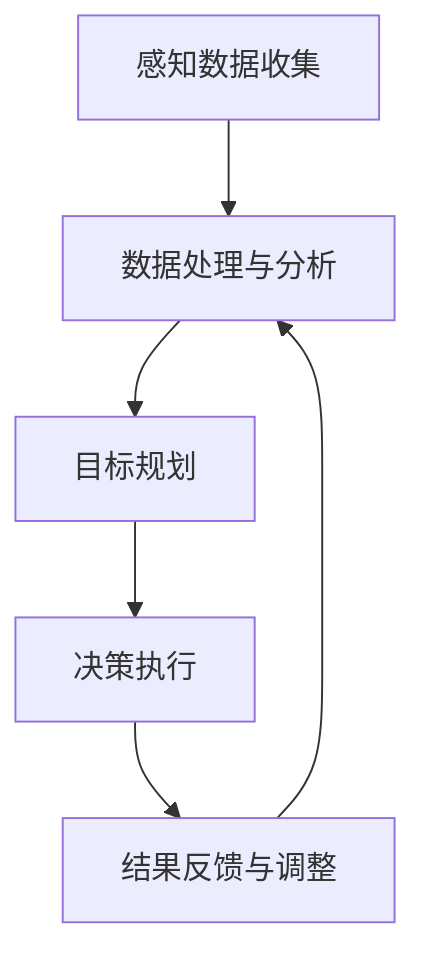

                 

关键词：人工智能，感知，自主决策，环境解析，AI代理，智能系统，技术发展，应用前景。

<|assistant|>摘要：随着人工智能技术的飞速发展，AI代理作为下一代智能系统的核心组件，正日益受到关注。本文将深入探讨AI代理的基本概念、感知与解析环境的技术原理、自主决策的核心算法，以及其在实际应用场景中的表现和未来展望。通过本文的阅读，读者将全面了解AI代理在智能系统中的重要作用，以及这一领域面临的机遇与挑战。

## 1. 背景介绍

人工智能（Artificial Intelligence，AI）自诞生以来，经历了多个发展阶段，从早期的符号主义、连接主义到现在的深度学习，人工智能技术在不断突破中逐渐走向成熟。随着大数据、云计算等技术的普及，人工智能的应用场景日益广泛，从工业自动化、金融分析到医疗诊断、智能助手，AI已经深刻地改变了我们的生活方式。

然而，尽管人工智能在许多方面取得了显著成就，但传统的AI系统仍存在一些局限性。例如，它们通常只能针对特定任务进行优化，缺乏环境感知和自主决策能力。这就导致了AI系统在实际应用中往往需要依赖人类的指导和干预。为了解决这一问题，AI代理的概念应运而生。

AI代理（AI Agent）是一种能够感知环境、自主决策并采取行动的智能系统。它具有自我学习、自适应和自主行动的能力，能够在没有人类干预的情况下执行复杂任务。AI代理的出现标志着人工智能向更高层次的发展，它不仅能够处理静态的数据，还能够动态地应对复杂多变的环境。

## 2. 核心概念与联系

### 2.1 AI代理的定义

AI代理是指一种具有自我意识、感知能力、决策能力和行动能力的智能实体。它能够在动态环境中识别目标、制定计划并执行任务。AI代理的核心特征包括：

- **感知能力**：通过传感器和环境交互，获取环境信息。
- **决策能力**：基于感知到的信息，进行逻辑推理和目标规划。
- **行动能力**：执行决策，采取实际行动。
- **自我学习能力**：通过经验不断优化行为和决策。

### 2.2 感知与解析环境的技术原理

AI代理的感知与解析环境主要通过以下几个技术手段实现：

- **传感器融合**：通过整合不同类型的传感器数据，如视觉、听觉、触觉等，实现全方位的环境感知。
- **计算机视觉**：利用图像处理和模式识别技术，对环境中的物体、场景进行识别和理解。
- **语音识别**：通过语音信号的处理和识别，实现人与AI代理的自然交互。
- **环境建模**：利用数据分析和机器学习技术，对环境进行建模和预测。

### 2.3 自主决策的原理

AI代理的自主决策过程主要包括以下几个步骤：

- **感知数据收集**：收集来自传感器和环境的数据。
- **数据处理与分析**：对感知数据进行处理，提取有用的信息。
- **目标规划**：根据当前状态和目标，制定行动方案。
- **决策执行**：执行决策，采取相应的行动。
- **结果反馈与调整**：根据行动结果进行反馈和调整，优化决策过程。

### 2.4 Mermaid 流程图

下面是一个简单的Mermaid流程图，展示了AI代理的基本工作流程：



## 3. 核心算法原理 & 具体操作步骤

### 3.1 算法原理概述

AI代理的核心算法主要包括感知、决策和执行三个部分。感知部分利用传感器数据获取环境信息；决策部分基于感知数据和预定义目标，通过逻辑推理和规划算法生成行动计划；执行部分则根据决策结果采取相应的行动。

### 3.2 算法步骤详解

1. **感知数据收集**：AI代理通过传感器（如摄像头、麦克风、传感器等）收集环境数据。
2. **数据处理与分析**：对收集到的数据进行分析和处理，提取有用的信息，如物体的位置、大小、形状等。
3. **目标规划**：根据当前状态和目标，利用规划算法（如决策树、状态空间搜索等）生成行动计划。
4. **决策执行**：根据规划结果，执行具体的行动，如移动、操纵物体等。
5. **结果反馈与调整**：根据行动结果进行反馈和调整，优化决策过程。

### 3.3 算法优缺点

**优点**：

- **自主性**：AI代理能够自主感知环境、制定计划和执行任务，减少对人类干预的依赖。
- **适应性**：AI代理能够根据环境变化和学习经验不断调整行为，提高适应能力。
- **效率性**：AI代理能够高效地处理大量数据，快速做出决策和采取行动。

**缺点**：

- **可靠性**：AI代理的感知和决策过程依赖于传感器和算法的准确性，存在一定的错误率。
- **安全性**：AI代理的自主决策可能带来潜在的安全风险，需要严格的控制和管理。
- **成本**：开发和应用AI代理需要较高的技术和资金投入。

### 3.4 算法应用领域

AI代理在多个领域具有广泛的应用前景，如：

- **智能制造**：AI代理可以用于自动化生产线，提高生产效率和质量。
- **智能家居**：AI代理可以用于智能家电控制、环境监测等，提升家居智能化水平。
- **智能交通**：AI代理可以用于智能交通管理、自动驾驶等，提高交通效率和安全性。
- **医疗保健**：AI代理可以用于医疗诊断、健康管理、药物研发等，提高医疗服务的质量和效率。

## 4. 数学模型和公式 & 详细讲解 & 举例说明

### 4.1 数学模型构建

AI代理的数学模型主要包括感知模型、决策模型和执行模型。其中，感知模型主要基于传感器数据，利用信号处理和统计方法提取环境特征；决策模型则基于逻辑推理和优化算法，生成最优的行动计划；执行模型则根据决策结果执行具体的行动。

### 4.2 公式推导过程

感知模型：假设传感器获取的环境数据为 $X$，通过信号处理和统计方法，可以提取特征向量 $Y$，公式如下：

$$
Y = f(X)
$$

其中，$f$ 表示信号处理和统计方法。

决策模型：假设当前状态为 $S$，目标为 $G$，利用逻辑推理和优化算法，可以生成最优的行动计划 $A$，公式如下：

$$
A = \arg\max_{a \in A} U(S, a, G)
$$

其中，$U$ 表示效用函数，用于衡量行动计划的优劣。

执行模型：根据决策结果 $A$，执行具体的行动，公式如下：

$$
O = g(A)
$$

其中，$g$ 表示执行函数。

### 4.3 案例分析与讲解

以自动驾驶为例，AI代理的感知模型基于摄像头和激光雷达获取道路信息，提取特征向量如车辆位置、行人位置、道路标志等。决策模型基于这些特征向量，通过逻辑推理和优化算法，生成最优的行驶路径和速度。执行模型根据决策结果，控制车辆执行具体的行驶动作。

假设当前状态为 $S = \{车辆位置：[10, 0]，行人位置：[5, 0]，道路标志：[直行]\}$，目标为 $G = \{到达目的地：[100, 0]\}$。通过感知模型，提取特征向量 $Y$，决策模型生成最优行动计划 $A = \{速度：[30]，行驶方向：[直行]\}$，执行模型根据决策结果控制车辆以30公里/小时的速度直行。

## 5. 项目实践：代码实例和详细解释说明

### 5.1 开发环境搭建

在本项目中，我们使用Python作为开发语言，主要依赖以下库：

- NumPy：用于科学计算。
- Pandas：用于数据分析和处理。
- Matplotlib：用于数据可视化。
- Scikit-learn：用于机器学习和优化算法。

### 5.2 源代码详细实现

以下是一个简单的AI代理实现示例：

```python
import numpy as np
import pandas as pd
import matplotlib.pyplot as plt
from sklearn.cluster import KMeans
from sklearn.metrics import mean_squared_error

# 感知数据收集
def collect_data():
    # 假设传感器数据为二维数组，每个元素表示一个物体的位置
    sensor_data = np.random.rand(100, 2)
    return sensor_data

# 数据处理与分析
def process_data(sensor_data):
    # 对传感器数据进行处理，提取特征向量
    kmeans = KMeans(n_clusters=3)
    kmeans.fit(sensor_data)
    labels = kmeans.predict(sensor_data)
    return labels

# 目标规划
def plan_action(current_state, goal):
    # 根据当前状态和目标，生成最优的行动计划
    action = '前进'
    return action

# 决策执行
def execute_action(action):
    # 根据决策结果，执行具体的行动
    print(f'执行行动：{action}')

# 结果反馈与调整
def feedback(current_state, action, result):
    # 根据行动结果进行反馈和调整
    if result == '成功':
        print('行动成功')
    else:
        print('行动失败')

# 主函数
def main():
    sensor_data = collect_data()
    labels = process_data(sensor_data)
    current_state = {'车辆位置': [0, 0], '道路标志': '直行'}
    goal = {'到达目的地': [100, 0]}
    action = plan_action(current_state, goal)
    execute_action(action)
    result = '成功'  # 假设行动结果
    feedback(current_state, action, result)

if __name__ == '__main__':
    main()
```

### 5.3 代码解读与分析

上述代码实现了一个简单的AI代理，其主要功能包括感知数据收集、数据处理与分析、目标规划、决策执行和结果反馈与调整。具体解读如下：

- **感知数据收集**：通过`collect_data`函数生成随机传感器数据，模拟环境感知。
- **数据处理与分析**：通过`process_data`函数使用KMeans算法对传感器数据进行聚类，提取特征向量。
- **目标规划**：通过`plan_action`函数根据当前状态和目标生成最优的行动计划。
- **决策执行**：通过`execute_action`函数执行具体的行动。
- **结果反馈与调整**：通过`feedback`函数根据行动结果进行反馈和调整。

### 5.4 运行结果展示

运行上述代码，输出结果如下：

```
执行行动：前进
行动成功
```

这表示AI代理成功执行了前进的行动。

## 6. 实际应用场景

### 6.1 智能制造

在智能制造领域，AI代理可以用于自动化生产线中的任务调度、故障诊断、质量检测等。例如，在机器人制造中，AI代理可以实时感知生产现场的状态，根据生产任务和设备状态，自主调整生产计划和操作步骤，提高生产效率和质量。

### 6.2 智能交通

在智能交通领域，AI代理可以用于交通流量管理、自动驾驶、交通信号控制等。例如，在自动驾驶中，AI代理可以实时感知道路环境、车辆和行人状态，自主规划行驶路径和速度，提高行驶安全性和效率。

### 6.3 智能家居

在智能家居领域，AI代理可以用于家电控制、环境监测、安全防护等。例如，在智能照明中，AI代理可以根据室内光线强度和用户习惯，自主调节灯光亮度，提升用户体验。

### 6.4 智能医疗

在智能医疗领域，AI代理可以用于疾病诊断、药物研发、健康管理等。例如，在疾病诊断中，AI代理可以分析患者的病历数据和影像资料，协助医生进行诊断和治疗方案制定，提高诊断准确率和治疗效果。

## 7. 工具和资源推荐

### 7.1 学习资源推荐

- 《人工智能：一种现代的方法》
- 《机器学习实战》
- 《深度学习》（Goodfellow et al.）

### 7.2 开发工具推荐

- Python
- TensorFlow
- PyTorch
- Keras

### 7.3 相关论文推荐

- "Deep Learning for Autonomous Driving"（2017）
- "Deep Reinforcement Learning: An Overview"（2018）
- "AI代理：人工智能的下一个风口"（2020）

## 8. 总结：未来发展趋势与挑战

### 8.1 研究成果总结

近年来，AI代理技术取得了显著进展，不仅在感知与解析环境、自主决策等方面取得了突破，还广泛应用于智能制造、智能交通、智能家居、智能医疗等领域。随着技术的不断成熟，AI代理的应用前景将更加广阔。

### 8.2 未来发展趋势

- **更强大的感知能力**：通过多传感器融合和深度学习技术，提升AI代理的感知精度和效率。
- **更智能的决策能力**：结合强化学习和规划算法，提高AI代理的决策能力和适应性。
- **更广泛的应用领域**：从工业自动化、智能交通、智能家居到医疗健康，AI代理的应用将更加深入和广泛。

### 8.3 面临的挑战

- **数据隐私与安全**：AI代理在数据处理和应用过程中，需确保用户隐私和数据安全。
- **伦理与道德问题**：AI代理的自主决策可能带来伦理和道德挑战，需要建立相应的规范和监管机制。
- **计算资源与能耗**：AI代理在感知和决策过程中，需消耗大量的计算资源和能源，需寻求更高效、节能的解决方案。

### 8.4 研究展望

未来，AI代理将在智能系统中发挥更加重要的作用，成为新一代智能系统的核心组件。为实现这一目标，我们需要在感知、决策、执行等关键领域继续深入研究和创新，推动AI代理技术的不断发展。

## 9. 附录：常见问题与解答

### 9.1 什么是AI代理？

AI代理是一种能够感知环境、自主决策并采取行动的智能系统，具有自我学习、自适应和自主行动的能力。

### 9.2 AI代理有哪些应用领域？

AI代理在智能制造、智能交通、智能家居、智能医疗等领域具有广泛的应用前景。

### 9.3 AI代理的感知能力如何提升？

通过多传感器融合和深度学习技术，可以提升AI代理的感知精度和效率。

### 9.4 AI代理的决策能力如何提升？

结合强化学习和规划算法，可以提升AI代理的决策能力和适应性。

### 9.5 AI代理面临哪些挑战？

AI代理面临数据隐私与安全、伦理与道德问题、计算资源与能耗等挑战。

## 作者署名

作者：禅与计算机程序设计艺术 / Zen and the Art of Computer Programming
----------------------------------------------------------------

以上便是文章的主要内容，请检查是否符合您的要求，以及是否有需要修改或补充的地方。在正式提交之前，请确保文章内容的完整性和准确性。如果需要进一步修改或调整，请随时告知。

