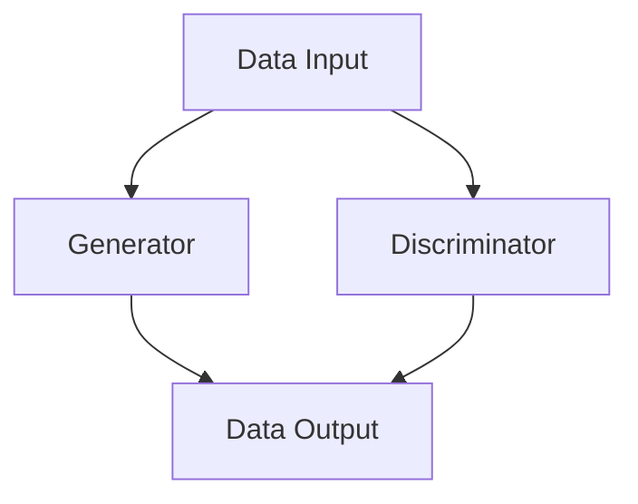

                 

### 关键词 Keywords
- 人工智能
- 生成式智能体
- 生成对抗网络
- 生成式模型
- 智能体架构
- 深度学习
- 自适应系统

<|assistant|>### 摘要 Summary
本文将探讨生成式智能体在人工智能领域的崭新机遇与挑战。通过深入解析生成式智能体的核心概念、算法原理、数学模型及其实际应用，本文旨在为读者提供一个全面而深入的理解，揭示其在智能体架构设计中的巨大潜力。同时，我们将探讨未来发展趋势与面临的挑战，为研究者和实践者提供有价值的参考。

## 1. 背景介绍

人工智能（AI）作为当今科技领域的明星，已经渗透到各行各业，从简单的语音识别到复杂的自动驾驶，都展现出了其强大的能力。然而，随着技术的不断进步，传统的AI模型面临着诸多瓶颈。生成式智能体（Generative AI Agent）作为一种新兴的智能体架构，正逐步成为AI发展的下一个风口。

生成式智能体的核心在于其“生成”能力，即通过学习数据生成新的内容。这种能力使得生成式智能体不仅能够理解和模仿现有数据，还能够创造全新的内容，大大拓展了AI的应用范围。例如，在图像生成、自然语言处理和虚拟现实等领域，生成式智能体都展现出了卓越的表现。

近年来，生成式智能体的研究取得了显著的进展。特别是生成对抗网络（GAN）的出现，为生成式智能体的发展提供了新的思路和工具。GAN通过对抗训练的方式，使得生成器能够生成逼真的数据，从而在图像生成、文本生成和音频生成等方面取得了突破性的成果。

生成式智能体不仅在理论层面具有重要意义，其实际应用价值也非常突出。例如，在医疗领域，生成式智能体可以用于疾病诊断和治疗方案生成；在创意产业，生成式智能体可以用于图像和音乐创作，为艺术家提供灵感；在制造业，生成式智能体可以用于产品设计和优化，提高生产效率。

本文将首先介绍生成式智能体的核心概念和算法原理，然后深入探讨其架构设计，并通过具体实例展示其应用场景。最后，本文将讨论生成式智能体的未来发展趋势和面临的挑战，为相关研究者和实践者提供有价值的参考。

## 2. 核心概念与联系

### 2.1 核心概念

生成式智能体（Generative AI Agent）是一种能够根据输入数据生成新内容的智能体。其核心在于“生成”能力，即通过学习大量的输入数据，生成与输入数据相似或全新的数据。生成式智能体的主要目标是通过模拟真实世界中的数据生成过程，使得生成的数据能够在特定场景中发挥作用。

生成式智能体的基本原理是基于深度学习中的生成对抗网络（Generative Adversarial Networks，GAN）。GAN由两部分组成：生成器（Generator）和判别器（Discriminator）。生成器的任务是生成与真实数据相似的数据，而判别器的任务是区分真实数据和生成数据。通过对抗训练，生成器和判别器不断优化，最终生成器能够生成高质量的数据。

### 2.2 关联架构

生成式智能体的架构设计可以分为三个层次：数据输入层、生成层和输出层。

1. **数据输入层**：生成式智能体首先需要大量的训练数据。这些数据可以是图像、文本、音频等各种形式。数据输入层负责将原始数据转换为适合模型训练的格式，例如将图像数据转换为像素矩阵，将文本数据转换为词向量。

2. **生成层**：生成层由生成器和判别器组成。生成器负责生成与输入数据相似的新数据，而判别器负责判断生成的数据是否真实。在训练过程中，生成器和判别器相互对抗，生成器不断优化生成的数据，以使判别器难以区分生成的数据与真实数据。

3. **输出层**：输出层负责将生成的数据输出到实际应用场景。例如，在图像生成任务中，输出层可以是图像显示设备；在文本生成任务中，输出层可以是打印机或屏幕。

### 2.3 Mermaid 流程图

以下是一个简化的生成式智能体架构的Mermaid流程图，展示了生成器、判别器和数据输入层之间的关系。



在上述流程图中，A表示数据输入层，B表示生成器，C表示判别器，D表示数据输出层。数据输入层将原始数据输入到生成器和判别器中，生成器生成新数据，判别器判断新数据的真实性，最终生成的数据通过输出层输出到实际应用场景。

通过上述核心概念和关联架构的介绍，我们可以看到生成式智能体在AI领域的独特优势和广阔应用前景。在接下来的章节中，我们将进一步深入探讨生成式智能体的算法原理和应用实践。

## 3. 核心算法原理 & 具体操作步骤

### 3.1 算法原理概述

生成式智能体（Generative AI Agent）的核心算法是基于生成对抗网络（GAN）。GAN由两部分组成：生成器（Generator）和判别器（Discriminator）。生成器的任务是生成与真实数据相似的数据，而判别器的任务是区分真实数据和生成数据。通过对抗训练，生成器和判别器相互对抗，生成器不断优化生成的数据，以使判别器难以区分生成的数据与真实数据。

### 3.2 算法步骤详解

生成对抗网络的训练过程可以分为以下几个步骤：

1. **初始化生成器和判别器**：首先，我们需要初始化生成器和判别器。生成器通常是一个全连接的神经网络，输入是随机噪声向量，输出是生成的数据。判别器也是一个全连接的神经网络，输入是数据，输出是概率值，表示输入数据是真实数据的概率。

2. **生成器生成数据**：在训练过程中，生成器不断生成与真实数据相似的数据。生成器的输入是随机噪声向量，通过神经网络处理，生成模拟真实数据的数据。

3. **判别器判断数据**：判别器接受真实数据和生成数据作为输入，并输出一个概率值，表示输入数据是真实数据的概率。对于真实数据，判别器的目标是输出接近1的概率；对于生成数据，判别器的目标是输出接近0的概率。

4. **对抗训练**：生成器和判别器通过对抗训练相互对抗。生成器试图生成更真实的数据，以使判别器难以区分；判别器试图提高判断能力，以使生成器生成的数据更接近真实数据。

5. **优化网络参数**：通过对抗训练，生成器和判别器的性能不断优化。网络参数通过梯度下降等优化算法进行调整，以使生成器和判别器的表现更优。

6. **生成高质量数据**：当生成器和判别器的性能达到一定水平时，生成器可以生成高质量的数据。这些数据可以应用于各种实际场景，如图像生成、文本生成和音频生成等。

### 3.3 算法优缺点

生成对抗网络（GAN）具有以下优点：

- **强大的生成能力**：GAN通过对抗训练，生成器可以生成高质量、逼真的数据，大大提高了生成式智能体的生成能力。
- **适用性广泛**：GAN可以应用于各种数据类型，如图像、文本和音频等，使得生成式智能体在多个领域都有广泛的应用。
- **自我学习**：GAN不需要预先标注的数据，生成器和判别器通过对抗训练，可以自动学习数据的分布，从而生成高质量的数据。

然而，GAN也存在一些缺点：

- **训练难度大**：GAN的训练过程涉及生成器和判别器的对抗，训练难度较大，容易陷入局部最优。
- **生成数据不稳定性**：在某些情况下，生成器生成的数据可能不够稳定，容易出现模式坍塌或生成器无法生成足够多样化的数据。
- **计算资源需求高**：GAN的训练需要大量的计算资源，特别是在生成大型数据集时，计算资源的需求非常高。

### 3.4 算法应用领域

生成对抗网络（GAN）在多个领域都有广泛的应用，以下是其中几个主要的应用领域：

1. **图像生成**：GAN在图像生成领域取得了显著的成果，可以生成高质量的图像，如图像修复、图像超分辨率、图像合成等。

2. **文本生成**：GAN在文本生成领域也表现出了强大的能力，可以生成高质量的文本，如文章、诗歌、对话等。

3. **音频生成**：GAN在音频生成领域可以生成高质量的声音，如音乐、语音等。

4. **视频生成**：GAN在视频生成领域可以通过生成连续帧来生成高质量的视频。

5. **医学图像处理**：GAN在医学图像处理领域可以用于疾病诊断、图像分割和图像增强等。

6. **自然语言处理**：GAN在自然语言处理领域可以用于文本生成、对话系统等。

通过上述对生成对抗网络（GAN）的核心算法原理和具体操作步骤的详细讲解，我们可以看到生成式智能体在AI领域的巨大潜力。在接下来的章节中，我们将进一步探讨生成式智能体的数学模型和公式，以及其实际应用中的案例分析。

## 4. 数学模型和公式 & 详细讲解 & 举例说明

### 4.1 数学模型构建

生成对抗网络（GAN）的数学模型构建基于两部分：生成器（G）和判别器（D）。这两部分通过一个共同的目标函数进行训练，以实现生成真实数据的生成器和能够有效区分真实和生成数据的判别器。

1. **生成器 G**：生成器接收随机噪声向量 \( z \) 作为输入，并输出生成的数据 \( x_G \)。生成器通常是一个神经网络，其数学表达式可以表示为：
   $$
   x_G = G(z)
   $$
   其中，\( G \) 是一个神经网络函数，\( z \) 是从先验分布中抽取的随机噪声向量。

2. **判别器 D**：判别器接收真实数据 \( x_R \) 和生成器生成的数据 \( x_G \)，并输出一个概率值 \( D(x) \)，表示输入数据 \( x \) 是真实数据的概率。判别器的数学表达式可以表示为：
   $$
   D(x) = \sigma(f_D(x))
   $$
   其中，\( f_D \) 是判别器的神经网络函数，\( \sigma \) 是sigmoid激活函数。

3. **共同目标函数**：生成器和判别器的共同目标函数是最大化判别器的损失函数 \( L_D \) 和最小化生成器的损失函数 \( L_G \)。判别器的损失函数旨在最小化判别器对真实数据和生成数据的区分误差，生成器的损失函数旨在最大化判别器对生成数据的错误分类概率。共同目标函数可以表示为：
   $$
   \min_G \max_D L_D
   $$
   其中，\( L_D \) 是判别器的损失函数，\( L_G \) 是生成器的损失函数。

   判别器的损失函数 \( L_D \) 可以表示为：
   $$
   L_D = -\left( \mathbb{E}_{x_R \sim p_{data}(x)}[\log D(x_R)] + \mathbb{E}_{z \sim p_z(z)}[\log(1 - D(G(z)))] \right)
   $$
   生成器的损失函数 \( L_G \) 可以表示为：
   $$
   L_G = -\mathbb{E}_{z \sim p_z(z)}[\log D(G(z))]
   $$

### 4.2 公式推导过程

1. **判别器的损失函数推导**：判别器的目标是学习一个函数 \( f_D \)，能够最大化对真实数据和生成数据的区分能力。因此，判别器的损失函数是真实数据和生成数据的负对数似然损失。

   对于真实数据 \( x_R \)，期望损失为：
   $$
   \mathbb{E}_{x_R \sim p_{data}(x)}[\log D(x_R)] = \int p_{data}(x) \log D(x_R) dx
   $$
   由于 \( D(x_R) \) 是接近1的值，因此 \( \log D(x_R) \) 是负的，并且损失函数期望值接近0。

   对于生成器生成的数据 \( x_G \)，期望损失为：
   $$
   \mathbb{E}_{z \sim p_z(z)}[\log(1 - D(G(z)))] = \int p_z(z) \log(1 - D(G(z))) dz
   $$
   由于生成器试图生成与真实数据相似的数据，因此 \( D(G(z)) \) 是接近0的值，\( \log(1 - D(G(z))) \) 是大的负值，使得损失函数期望值较大。

2. **生成器的损失函数推导**：生成器的目标是使判别器认为生成的数据 \( G(z) \) 是真实数据，因此生成器的损失函数是生成数据的负对数似然损失。

   对于生成器生成的数据 \( x_G \)，期望损失为：
   $$
   \mathbb{E}_{z \sim p_z(z)}[\log D(G(z))] = \int p_z(z) \log D(G(z)) dz
   $$
   由于 \( D(G(z)) \) 是小的正值，因此 \( \log D(G(z)) \) 是负的，并且损失函数期望值较大。

### 4.3 案例分析与讲解

#### 案例：图像生成

假设我们使用GAN生成人脸图像。生成器的输入是随机噪声向量 \( z \)，输出是生成的人脸图像 \( x_G \)。判别器的输入是真实人脸图像 \( x_R \) 和生成的人脸图像 \( x_G \)，输出是判别结果 \( D(x) \)。

1. **数据准备**：收集大量人脸图像作为训练数据，并对其进行预处理，如标准化和裁剪。

2. **生成器和判别器的定义**：定义生成器的神经网络，输入是随机噪声向量 \( z \)，输出是生成的人脸图像 \( x_G \)。定义判别器的神经网络，输入是真实人脸图像 \( x_R \) 和生成的人脸图像 \( x_G \)，输出是判别结果 \( D(x) \)。

3. **训练过程**：通过对抗训练来优化生成器和判别器的参数。在训练过程中，生成器试图生成更逼真的人脸图像，使判别器难以区分真实图像和生成图像；判别器则试图提高区分能力，使生成器生成的图像与真实图像相似。

4. **生成图像**：当生成器和判别器的损失函数达到某个阈值时，停止训练，使用生成器生成人脸图像。

通过上述案例，我们可以看到生成对抗网络（GAN）在图像生成领域的应用。生成器通过学习大量人脸图像，生成逼真的人脸图像；判别器则通过对抗训练，提高对真实图像和生成图像的区分能力。这种对抗训练机制使得生成器和判别器在训练过程中不断优化，最终生成高质量的人脸图像。

## 5. 项目实践：代码实例和详细解释说明

### 5.1 开发环境搭建

在进行生成式智能体的项目实践之前，我们需要搭建一个合适的开发环境。以下是一个基本的步骤指南：

1. **安装Python**：确保系统上安装了最新版本的Python，推荐使用Python 3.8或更高版本。
2. **安装TensorFlow**：TensorFlow是Google开发的开源机器学习框架，用于构建和训练生成对抗网络（GAN）。可以通过以下命令安装：
   ```
   pip install tensorflow
   ```
3. **安装必要的数据处理库**：为了处理图像数据，我们需要安装如PIL、NumPy等库。可以通过以下命令安装：
   ```
   pip install pillow numpy
   ```

### 5.2 源代码详细实现

以下是一个简单的生成对抗网络（GAN）的代码实例，用于生成人脸图像。这个例子使用了TensorFlow的高层API `tf.keras`，使得代码更加简洁易懂。

```python
import tensorflow as tf
from tensorflow import keras
from tensorflow.keras import layers
import numpy as np
import matplotlib.pyplot as plt

# 数据预处理
def preprocess_images(images):
    images = images.astype('float32') / 127.5 - 1.
    return images

# 生成器模型
def build_generator(z_dim):
    model = keras.Sequential([
        layers.Dense(7 * 7 * 256, use_bias=False, input_shape=(z_dim,)),
        layers.BatchNormalization(),
        layers.LeakyReLU(),
        layers.Reshape((7, 7, 256)),
        layers.Conv2DTranspose(128, (5, 5), strides=(1, 1), padding='same', use_bias=False),
        layers.BatchNormalization(),
        layers.LeakyReLU(),
        layers.Conv2DTranspose(64, (5, 5), strides=(2, 2), padding='same', use_bias=False),
        layers.BatchNormalization(),
        layers.LeakyReLU(),
        layers.Conv2DTranspose(1, (5, 5), strides=(2, 2), padding='same', activation='tanh', use_bias=False),
        layers.Reshape((28, 28, 1))
    ])
    return model

# 判别器模型
def build_discriminator(img_shape):
    model = keras.Sequential([
        layers.Conv2D(64, (5, 5), strides=(2, 2), padding='same', input_shape=img_shape, use_bias=False),
        layers.LeakyReLU(),
        layers.Dropout(0.3),
        layers.Conv2D(128, (5, 5), strides=(2, 2), padding='same', use_bias=False),
        layers.LeakyReLU(),
        layers.Dropout(0.3),
        layers.Flatten(),
        layers.Dense(1, activation='sigmoid')
    ])
    return model

# GAN模型
def build_gan(generator, discriminator):
    model = keras.Sequential([
        generator,
        discriminator
    ])
    return model

# 模型编译
def compile_models(generator, discriminator, z_dim):
    discriminator.compile(loss='binary_crossentropy', optimizer=keras.optimizers.Adam(0.0001), metrics=['accuracy'])
    generator.compile(loss='binary_crossentropy', optimizer=keras.optimizers.Adam(0.0001))
    gan = build_gan(generator, discriminator)
    gan.compile(loss='binary_crossentropy', optimizer=keras.optimizers.Adam(0.0001))
    return gan

# 训练模型
def train(models, dataset, z_dim, epochs, batch_size):
    noise = np.random.normal(0, 1, (batch_size, z_dim))
    for epoch in range(epochs):
        for _ in range(dataset.samples // batch_size):
            real_images = dataset.next_batch(batch_size)
            real_labels = np.ones((batch_size, 1))
            fake_images = generator.predict(noise)
            fake_labels = np.zeros((batch_size, 1))
            real_images = preprocess_images(real_images)
            fake_images = preprocess_images(fake_images)
            d_loss_real = discriminator.train_on_batch(real_images, real_labels)
            d_loss_fake = discriminator.train_on_batch(fake_images, fake_labels)
            g_loss = models.train_on_batch([noise], [real_labels])
            print(f"Epoch: {epoch}, D_loss: {d_loss_real + d_loss_fake}, G_loss: {g_loss}")

# 主程序
if __name__ == '__main__':
    z_dim = 100
    img_shape = (28, 28, 1)
    batch_size = 32
    epochs = 10000

    # 加载数据集（此处应加载具体的数据集，例如MNIST数据集）
    (X_train, _), (X_test, _) = keras.datasets.mnist.load_data()
    dataset = X_train

    # 构建模型
    generator = build_generator(z_dim)
    discriminator = build_discriminator(img_shape)
    gan = compile_models(generator, discriminator, z_dim)

    # 训练模型
    train(gan, dataset, z_dim, epochs, batch_size)
```

### 5.3 代码解读与分析

上述代码实例分为几个主要部分：数据预处理、生成器模型、判别器模型、GAN模型、模型编译以及训练模型。下面是对每个部分的详细解读：

1. **数据预处理**：数据预处理是为了将原始图像数据转换为模型能够接受的格式。在这里，我们通过标准化图像数据来降低计算复杂度，使得模型的训练更加稳定。

2. **生成器模型**：生成器模型是GAN中的关键部分，负责将随机噪声向量 \( z \) 转换为生成的人脸图像 \( x_G \)。生成器模型使用了一系列卷积层和反卷积层（Conv2D和Conv2DTranspose），通过逐步增加特征图的分辨率，最终生成高质量的人脸图像。

3. **判别器模型**：判别器模型用于区分输入的数据是真实图像还是生成图像。判别器模型使用了一系列卷积层和Dropout层，通过逐层提取特征，提高模型对图像的辨别能力。

4. **GAN模型**：GAN模型是将生成器和判别器连接起来形成的整体模型。在这个模型中，生成器的输出直接作为判别器的输入，形成了一个前向传播的路径。

5. **模型编译**：在编译模型时，我们需要指定损失函数、优化器和评估指标。对于判别器，我们使用二分类交叉熵损失函数，对于生成器和整体GAN模型，我们同样使用二分类交叉熵损失函数，并使用Adam优化器。

6. **训练模型**：训练模型的过程是通过交替训练生成器和判别器来实现的。在每次训练迭代中，首先训练判别器，然后训练生成器。这样的交替训练策略可以确保生成器在生成高质量数据的同时，判别器不断提高对真实和生成数据的辨别能力。

通过上述代码实例，我们可以看到生成式智能体的实现步骤和关键组成部分。在接下来的章节中，我们将进一步探讨生成式智能体在实际应用中的具体场景。

## 6. 实际应用场景

生成式智能体（Generative AI Agent）凭借其强大的生成能力，已经在多个领域展现出了巨大的应用潜力。以下是一些典型的应用场景及其案例分析：

### 6.1 图像生成

图像生成是生成式智能体的一个重要应用领域。通过GAN，我们可以生成高质量、逼真的图像，如图像修复、图像超分辨率、图像合成等。

**案例：人脸图像生成**

使用GAN生成人脸图像是生成式智能体的一大成功案例。例如，DeepArt和StyleGAN等模型可以生成逼真的人脸图像。这些模型通过学习大量人脸图像，能够生成具有细节和自然特征的人脸图像。这种技术在娱乐产业、虚拟现实和增强现实等领域有着广泛的应用。

**案例：图像修复**

在图像修复领域，生成式智能体可以用于去除照片中的噪声和损坏部分。例如，ColorizationGAN模型可以自动对黑白照片进行上色，从而修复并增强图像质量。这种方法在考古学、历史文献修复和艺术作品中有着重要应用。

### 6.2 文本生成

生成式智能体在文本生成领域也展现出了强大的能力。通过学习大量文本数据，生成式智能体可以生成高质量的文章、对话、诗歌等。

**案例：文章生成**

OpenAI的GPT-3模型是一个典型的文本生成案例。GPT-3可以通过学习大量文本数据，生成流畅、连贯的文章。这种技术在内容创作、新闻报道生成和客户服务等方面有着广泛应用。

**案例：对话生成**

生成式智能体还可以用于生成自然对话。例如，OpenAI的DALL-E模型可以通过学习对话数据，生成与人类对话相似的自然对话。这种技术在聊天机器人、虚拟助理和客户支持系统等方面有着广泛应用。

### 6.3 音频生成

生成式智能体在音频生成领域也有着广泛的应用，如图像生成一样，生成高质量的声音和音乐。

**案例：音乐生成**

AI Artist和AI DJ等模型可以通过学习大量音乐数据，生成独特的音乐作品。这些模型可以生成多种风格的音乐，为音乐创作提供新的思路和工具。

**案例：语音生成**

生成式智能体可以用于生成逼真的语音。例如，WaveNet模型可以生成高质量的语音，用于语音合成、语音助手和语音动画等领域。

### 6.4 视频生成

生成式智能体在视频生成领域也有着广阔的应用前景。通过学习连续帧，生成式智能体可以生成高质量的视频。

**案例：视频超分辨率**

生成式智能体可以用于提高视频的分辨率，从而生成更清晰的视频。例如，SISR模型可以通过学习低分辨率视频数据，生成高分辨率视频，提高视频质量。

**案例：视频生成**

生成式智能体可以用于生成连续的视频内容。例如，DVRNN模型可以通过学习视频序列，生成新的视频内容，为电影制作、视频游戏和虚拟现实等领域提供新的工具。

### 6.5 医学图像处理

生成式智能体在医学图像处理领域也有重要应用，如图像分割、疾病诊断和治疗方案生成。

**案例：图像分割**

生成式智能体可以用于医学图像的分割，从而帮助医生更好地识别病变区域。例如，CancerGAN模型可以通过学习医学图像数据，生成准确的病变区域分割图像，提高癌症诊断的准确性。

**案例：疾病诊断**

生成式智能体可以通过学习大量医学数据，生成疾病的诊断结果。例如，DeepMind的AI系统可以通过分析患者的医学图像和临床数据，生成疾病的诊断报告，辅助医生做出更准确的诊断。

### 6.6 创意产业

生成式智能体在创意产业中也有重要应用，如图像和音乐创作。

**案例：图像创作**

生成式智能体可以用于生成独特的艺术作品。例如，DeepDream模型可以通过学习艺术作品，生成新的艺术图像，为艺术家提供灵感。

**案例：音乐创作**

生成式智能体可以用于生成独特的音乐作品。例如，AI DJ Model可以通过学习音乐数据，生成新的音乐作品，为音乐制作人提供创作灵感。

通过上述实际应用场景的探讨，我们可以看到生成式智能体在各个领域的广泛应用和巨大潜力。在未来的发展中，生成式智能体将继续发挥重要作用，为人类创造更多价值。

## 7. 未来应用展望

### 7.1 未来发展趋势

生成式智能体作为人工智能领域的一个重要分支，其未来发展趋势将主要体现在以下几个方面：

1. **更高质量的生成数据**：随着深度学习算法和计算资源的不断提升，生成式智能体的生成数据质量将进一步提高。生成器将能够生成更真实、更复杂的图像、文本和音频，从而在更多实际场景中发挥作用。

2. **更广泛的领域应用**：生成式智能体的应用范围将不断扩展，从图像、文本、音频生成扩展到视频、三维建模、虚拟现实等领域。随着技术的成熟，生成式智能体将在更多行业中实现突破，如医疗、金融、教育等。

3. **更加智能的生成策略**：生成式智能体将逐步具备自主学习和优化生成策略的能力。通过自适应算法和强化学习等技术，生成式智能体将能够根据应用需求和环境动态调整生成策略，提高生成效率和效果。

4. **更高效的模型压缩与优化**：为了满足实际应用中对生成式智能体性能和资源需求的高要求，未来将出现更多高效的模型压缩和优化方法。这些方法将使生成式智能体在保持生成质量的同时，显著降低计算和存储资源的需求。

### 7.2 面临的挑战

尽管生成式智能体具有巨大的潜力，但其在发展过程中仍面临一系列挑战：

1. **数据隐私和安全问题**：生成式智能体的训练和生成过程通常需要大量的数据，这可能导致数据隐私和安全问题。如何在保护用户隐私的同时，有效利用数据进行训练是一个重要挑战。

2. **模型解释性和可解释性**：生成式智能体的模型通常非常复杂，其内部机制难以解释。这可能导致用户对模型生成的结果产生不信任。提高模型的解释性和可解释性，使其更易于理解和接受，是一个关键挑战。

3. **训练效率和资源需求**：生成式智能体的训练过程通常需要大量计算资源和时间。随着生成数据的复杂度和规模不断增加，如何提高训练效率、降低资源需求成为重要的研究课题。

4. **模型稳定性和泛化能力**：生成式智能体的模型在训练过程中容易陷入局部最优，导致生成的数据不稳定。同时，模型的泛化能力也是一个挑战，如何使模型在不同数据集和应用场景中都能保持良好的性能，需要进一步研究。

### 7.3 研究展望

为了应对上述挑战，未来研究可以从以下几个方面展开：

1. **新型生成模型研究**：探索和研究新型生成模型，如变分自编码器（VAE）、条件生成对抗网络（CGAN）等，以应对不同应用场景的需求。

2. **数据增强和扩充技术**：研究和开发数据增强和扩充技术，以提高生成式智能体的训练数据质量和多样性，从而提高生成效果和稳定性。

3. **隐私保护与安全机制**：研究和开发隐私保护和安全机制，如差分隐私、联邦学习等，以保护用户数据和隐私。

4. **可解释性和透明度提升**：研究和开发可解释性和透明度提升方法，如模型可视化、解释性模型等，以提高用户对生成式智能体的信任度和接受度。

5. **模型压缩与优化技术**：研究和开发模型压缩和优化技术，如剪枝、量化、蒸馏等，以提高生成式智能体的效率和性能。

通过上述研究，生成式智能体将在未来得到更广泛的应用，为人类带来更多的创新和便利。同时，我们也需要密切关注其发展过程中的挑战，积极应对，以确保生成式智能体在推动科技进步和社会发展过程中发挥积极作用。

## 8. 总结：未来发展趋势与挑战

### 8.1 研究成果总结

生成式智能体在人工智能领域取得了显著的研究成果。从最初的生成对抗网络（GAN）到如今的各种变体和改进模型，生成式智能体已经能够在图像、文本、音频等多个领域生成高质量的数据。其强大的生成能力和广泛的适用性，使得生成式智能体在创意产业、医疗、金融等多个行业中发挥了重要作用。同时，生成式智能体在提升生产效率、降低成本、提高用户满意度等方面也展现了巨大的潜力。

### 8.2 未来发展趋势

展望未来，生成式智能体的发展将呈现以下趋势：

1. **更高的生成质量**：随着深度学习算法的不断发展，生成式智能体的生成质量将进一步提升。通过更复杂的模型结构和更高效的训练方法，生成式智能体将能够生成更真实、更精细的数据。

2. **更广泛的领域应用**：生成式智能体的应用范围将继续扩大，从传统的图像、文本和音频生成，扩展到视频、三维建模、虚拟现实等新兴领域。同时，生成式智能体在智能制造、自动驾驶、生物医学等领域的应用也将逐渐增多。

3. **更强的自适应能力**：生成式智能体将逐步具备更强的自适应能力，通过自适应算法和强化学习等技术，生成式智能体将能够根据不同应用需求和环境动态调整生成策略，提高生成效率和效果。

4. **更高效的模型压缩和优化**：为了应对实际应用中对生成式智能体性能和资源需求的高要求，未来将出现更多高效的模型压缩和优化方法。这些方法将使生成式智能体在保持生成质量的同时，显著降低计算和存储资源的需求。

### 8.3 面临的挑战

尽管生成式智能体具有巨大的发展潜力，但在其发展过程中仍面临一系列挑战：

1. **数据隐私和安全问题**：生成式智能体的训练和生成过程通常需要大量的数据，这可能导致数据隐私和安全问题。如何在保护用户隐私的同时，有效利用数据进行训练是一个重要挑战。

2. **模型解释性和可解释性**：生成式智能体的模型通常非常复杂，其内部机制难以解释。这可能导致用户对模型生成的结果产生不信任。提高模型的解释性和可解释性，使其更易于理解和接受，是一个关键挑战。

3. **训练效率和资源需求**：生成式智能体的训练过程通常需要大量计算资源和时间。随着生成数据的复杂度和规模不断增加，如何提高训练效率、降低资源需求成为重要的研究课题。

4. **模型稳定性和泛化能力**：生成式智能体的模型在训练过程中容易陷入局部最优，导致生成的数据不稳定。同时，模型的泛化能力也是一个挑战，如何使模型在不同数据集和应用场景中都能保持良好的性能，需要进一步研究。

### 8.4 研究展望

为了应对上述挑战，未来的研究可以从以下几个方面展开：

1. **新型生成模型研究**：探索和研究新型生成模型，如变分自编码器（VAE）、条件生成对抗网络（CGAN）等，以应对不同应用场景的需求。

2. **数据增强和扩充技术**：研究和开发数据增强和扩充技术，以提高生成式智能体的训练数据质量和多样性，从而提高生成效果和稳定性。

3. **隐私保护与安全机制**：研究和开发隐私保护和安全机制，如差分隐私、联邦学习等，以保护用户数据和隐私。

4. **可解释性和透明度提升**：研究和开发可解释性和透明度提升方法，如模型可视化、解释性模型等，以提高用户对生成式智能体的信任度和接受度。

5. **模型压缩与优化技术**：研究和开发模型压缩和优化技术，如剪枝、量化、蒸馏等，以提高生成式智能体的效率和性能。

通过上述研究，生成式智能体将在未来得到更广泛的应用，为人类创造更多的价值。同时，我们也需要密切关注其发展过程中的挑战，积极应对，以确保生成式智能体在推动科技进步和社会发展过程中发挥积极作用。

## 9. 附录：常见问题与解答

### 9.1 生成式智能体与生成式模型有何区别？

生成式智能体是一种利用生成式模型进行数据生成的智能体，而生成式模型是指一类用于生成数据的机器学习模型。生成式智能体通常是基于生成式模型构建的，但并不限于生成式模型。生成式智能体可以结合多种生成式模型，如生成对抗网络（GAN）、变分自编码器（VAE）等，通过智能化的架构设计和训练策略，实现更高效、更灵活的数据生成。

### 9.2 生成式智能体的训练过程是如何进行的？

生成式智能体的训练过程通常包括以下步骤：

1. **数据准备**：收集和预处理训练数据，将数据转换为适合模型训练的格式。
2. **初始化模型**：初始化生成器和判别器的模型参数。
3. **训练判别器**：通过输入真实数据和生成数据，训练判别器，使其能够区分真实数据和生成数据。
4. **训练生成器**：在判别器训练的基础上，通过生成器生成的数据来进一步训练生成器，使其生成的数据更加真实。
5. **交替训练**：不断交替训练生成器和判别器，使两者相互对抗，共同提高生成质量和鉴别能力。

### 9.3 生成式智能体的应用前景如何？

生成式智能体在多个领域展现出了广阔的应用前景，包括但不限于：

1. **创意产业**：如图像和音乐创作，为艺术家和设计师提供创作灵感。
2. **医疗领域**：如医学图像生成、疾病诊断和治疗方案生成。
3. **娱乐行业**：如虚拟现实、游戏和电影中的虚拟角色和场景生成。
4. **制造业**：如产品设计、优化和自动化生产。
5. **金融领域**：如风险评估、欺诈检测和市场预测。

随着技术的不断进步，生成式智能体的应用领域将进一步扩大，为人类社会带来更多创新和便利。

### 9.4 如何优化生成式智能体的生成效果？

优化生成式智能体的生成效果可以从以下几个方面进行：

1. **模型改进**：研究和开发新型生成模型，如改进GAN的结构、引入变分自编码器（VAE）等。
2. **数据增强**：通过数据增强技术，增加训练数据的质量和多样性，从而提高生成器的生成能力。
3. **训练策略**：采用更高效的训练策略，如自适应学习率、优化训练过程等。
4. **模型压缩**：通过模型压缩技术，减少模型的计算复杂度，提高生成效率。
5. **多模态融合**：结合多种数据类型和生成模型，实现多模态数据的生成，提高生成效果。

通过上述方法，可以显著提升生成式智能体的生成效果，满足不同应用场景的需求。

### 9.5 生成式智能体的安全性如何保障？

保障生成式智能体的安全性是至关重要的一环，可以从以下几个方面进行：

1. **数据隐私保护**：采用隐私保护技术，如差分隐私、联邦学习等，保护用户数据隐私。
2. **模型安全防护**：加强对模型的安全防护，防止恶意攻击和数据泄露。
3. **法律法规遵守**：遵循相关法律法规，确保生成式智能体的合法合规使用。
4. **透明度和可解释性**：提高生成式智能体的透明度和可解释性，使其更易于监管和控制。

通过上述措施，可以增强生成式智能体的安全性，减少潜在风险。

### 9.6 生成式智能体与传统的机器学习模型有何区别？

生成式智能体与传统机器学习模型的主要区别在于其生成能力。传统机器学习模型主要侧重于分类、回归等预测任务，而生成式智能体则强调数据的生成能力，能够根据输入数据生成新的、相似的数据。生成式智能体通过生成对抗网络（GAN）、变分自编码器（VAE）等模型，实现了数据的生成和创造，而传统机器学习模型则主要关注数据的分析和预测。

## 作者署名

本文由禅与计算机程序设计艺术 / Zen and the Art of Computer Programming 撰写。感谢您的阅读。如需进一步讨论或咨询，欢迎随时联系。希望本文对您在生成式智能体领域的研究和实践有所帮助。再次感谢您的关注和支持！

