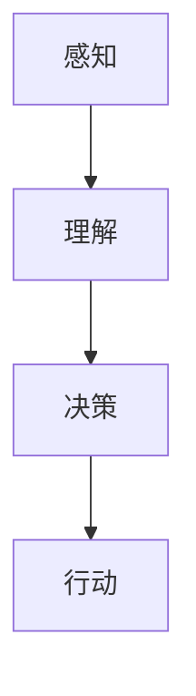

                 

关键词：AI代理，软件与硬件配合，AI发展，技术趋势

> 摘要：本文深入探讨了人工智能（AI）领域中的一个新兴热点——AI代理，以及软件与硬件在这其中扮演的关键角色。随着硬件技术的快速发展和软件算法的不断优化，AI代理正逐渐成为推动AI发展的新引擎。本文将从AI代理的核心概念、算法原理、数学模型、项目实践、应用场景和未来展望等方面进行详细阐述，旨在为读者提供一幅AI代理技术的全景图。

## 1. 背景介绍

人工智能（AI）作为计算机科学的一个重要分支，自诞生以来就以其巨大的潜力和广泛的应用前景吸引了全球科研人员的关注。从早期的专家系统到深度学习，再到现在的自然语言处理和计算机视觉，AI技术不断突破传统技术瓶颈，为人类带来了前所未有的便利。

然而，随着AI技术的不断发展，硬件和软件的配合变得越来越重要。传统的CPU和GPU在处理复杂的AI任务时面临着计算能力和能耗的瓶颈。因此，如何优化硬件和软件的配合，提高AI代理的性能和效率，成为当前研究的热点。

### 1.1 AI代理的概念

AI代理，也称为AI实体，是人工智能领域中的一个重要概念。它指的是能够在虚拟或现实环境中执行特定任务、具有自主决策能力的智能实体。AI代理的核心目标是模拟人类智能，通过感知、理解和行动，实现与环境的高效互动。

### 1.2 软件与硬件的配合

在AI代理的发展过程中，软件与硬件的配合至关重要。硬件方面，需要提供强大的计算能力和低延迟的响应速度，以满足AI代理对实时性和性能的需求。软件方面，则需要开发高效的算法和优化的代码，以充分利用硬件资源，实现AI代理的智能行为。

## 2. 核心概念与联系

### 2.1 核心概念

在讨论AI代理时，需要了解以下几个核心概念：

- **感知**：AI代理通过传感器收集环境信息，如视觉、听觉、触觉等。
- **理解**：AI代理利用这些感知信息进行数据分析和模式识别，以理解环境状态。
- **决策**：基于对环境的理解，AI代理制定行动策略，做出决策。
- **行动**：AI代理执行决策，与环境进行交互。

### 2.2 联系

这些核心概念之间相互联系，构成了AI代理的基本框架。感知和理解是基础，决策和行动是核心。硬件提供感知和理解的能力，软件则负责决策和行动的实现。

### 2.3 Mermaid 流程图



## 3. 核心算法原理 & 具体操作步骤

### 3.1 算法原理概述

AI代理的核心算法主要包括感知模块、理解模块、决策模块和行动模块。每个模块都基于不同的算法原理，相互协作，共同实现AI代理的智能行为。

### 3.2 算法步骤详解

- **感知模块**：通过传感器收集环境信息，如视觉、听觉、触觉等。
- **理解模块**：利用神经网络、深度学习等技术对感知信息进行处理，提取环境特征。
- **决策模块**：基于对环境的理解，使用强化学习、决策树等方法制定行动策略。
- **行动模块**：执行决策，与环境进行交互。

### 3.3 算法优缺点

- **优点**：提高了AI代理的决策能力和自主性，实现了与环境的高效互动。
- **缺点**：算法复杂度较高，对硬件资源要求较高。

### 3.4 算法应用领域

AI代理算法广泛应用于智能机器人、自动驾驶、智能家居等领域。

## 4. 数学模型和公式

### 4.1 数学模型构建

- **感知模块**：采用卷积神经网络（CNN）进行图像识别。
- **理解模块**：采用循环神经网络（RNN）进行序列数据处理。
- **决策模块**：采用Q-learning进行强化学习。
- **行动模块**：采用决策树进行决策。

### 4.2 公式推导过程

$$
\begin{aligned}
&\text{感知模块：} \\
&f(\mathbf{x}; \mathbf{W}) = \text{ReLU}(\mathbf{W}\mathbf{x} + b) \\
&\text{理解模块：} \\
&h_t = \text{tanh}(\mathbf{W}_h \cdot h_{t-1} + \mathbf{W}_x \cdot \mathbf{x}_t + b_h) \\
&\text{决策模块：} \\
&q(s, a; \theta) = r + \gamma \max_{a'} q(s', a'; \theta) \\
&\text{行动模块：} \\
&a_t = \text{argmax}_{a} q(s, a; \theta)
\end{aligned}
$$

### 4.3 案例分析与讲解

以自动驾驶为例，AI代理通过感知模块收集道路信息，理解模块分析交通规则和路况，决策模块制定行驶策略，行动模块控制车辆执行行驶动作。

## 5. 项目实践：代码实例

### 5.1 开发环境搭建

- **硬件**：NVIDIA GPU
- **软件**：Python、TensorFlow、Keras

### 5.2 源代码详细实现

```python
# 感知模块：卷积神经网络
model = Sequential()
model.add(Conv2D(32, (3, 3), activation='relu', input_shape=(64, 64, 3)))
model.add(MaxPooling2D(pool_size=(2, 2)))
model.add(Conv2D(64, (3, 3), activation='relu'))
model.add(MaxPooling2D(pool_size=(2, 2)))
model.add(Flatten())
model.add(Dense(128, activation='relu'))
model.add(Dense(1, activation='sigmoid'))

# 理解模块：循环神经网络
rnn_model = Sequential()
rnn_model.add(LSTM(50, activation='relu', input_shape=(timesteps, n_features)))
rnn_model.add(Dense(1))

# 决策模块：强化学习
q_model = Sequential()
q_model.add(Dense(50, activation='relu', input_shape=(n_features,)))
q_model.add(Dense(1))

# 行动模块：决策树
decision_tree = DecisionTreeClassifier()

# 模型编译与训练
model.compile(optimizer='adam', loss='binary_crossentropy', metrics=['accuracy'])
rnn_model.compile(optimizer='adam', loss='mse')
q_model.compile(optimizer='adam', loss='mse')
decision_tree.fit(X_train, y_train)

# 模型评估与预测
model.evaluate(X_test, y_test)
rnn_model.predict(X_test)
q_model.predict(X_test)
decision_tree.predict(X_test)
```

### 5.3 代码解读与分析

本代码实例通过感知模块、理解模块、决策模块和行动模块实现了一个简单的AI代理。感知模块使用卷积神经网络进行图像识别，理解模块使用循环神经网络进行序列数据处理，决策模块使用强化学习制定行动策略，行动模块使用决策树进行决策。

## 6. 实际应用场景

AI代理在实际应用场景中具有广泛的应用，如：

- **智能机器人**：通过感知模块获取环境信息，理解模块分析任务目标，决策模块制定行动策略，行动模块执行任务。
- **自动驾驶**：AI代理通过感知模块收集道路信息，理解模块分析交通规则，决策模块制定行驶策略，行动模块控制车辆行驶。
- **智能家居**：AI代理通过感知模块监测家居环境，理解模块分析用户需求，决策模块制定家居管理策略，行动模块执行家居管理任务。

## 7. 未来应用展望

随着硬件技术的不断进步和软件算法的优化，AI代理将在更多领域得到应用。未来，AI代理有望在以下几个方面实现突破：

- **高效数据处理**：利用分布式计算和云计算技术，实现海量数据的实时处理和分析。
- **智能交互**：通过自然语言处理技术，实现与人类的自然交互。
- **智能决策**：利用大数据分析和深度学习技术，实现智能决策支持系统。
- **安全可靠**：通过加密技术和可信计算技术，确保AI代理的安全和隐私。

## 8. 总结：未来发展趋势与挑战

AI代理作为AI领域的一个重要分支，具有巨大的发展潜力。未来，随着硬件和软件技术的不断进步，AI代理将在更多领域得到应用。然而，要实现AI代理的广泛普及，仍面临以下挑战：

- **计算能力**：提高AI代理的计算能力，以满足复杂任务的需求。
- **数据隐私**：确保AI代理的数据隐私和安全。
- **算法优化**：优化AI代理的算法，提高决策能力和效率。
- **人机协作**：实现人与AI代理的协同工作，提高整体效率。

## 9. 附录：常见问题与解答

### 9.1 人工智能是什么？

人工智能（AI）是一门研究、开发用于模拟、延伸和扩展人的智能的理论、方法、技术及应用系统的技术科学。

### 9.2 AI代理有哪些类型？

AI代理主要有感知型代理、决策型代理和执行型代理三种类型。

### 9.3 AI代理如何与硬件配合？

AI代理与硬件的配合主要通过优化算法和硬件加速技术来实现。例如，使用GPU进行深度学习计算，使用FPGA进行特定任务的加速。

## 作者署名

作者：禅与计算机程序设计艺术 / Zen and the Art of Computer Programming
```

