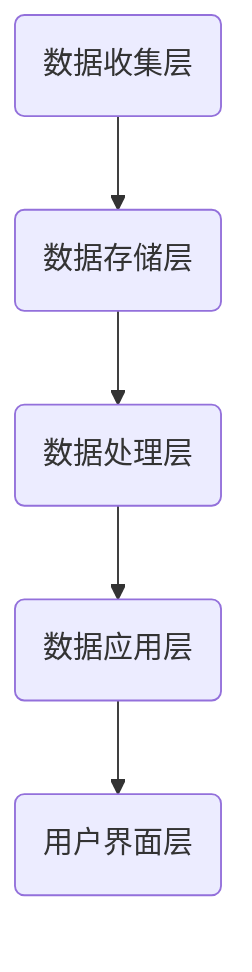
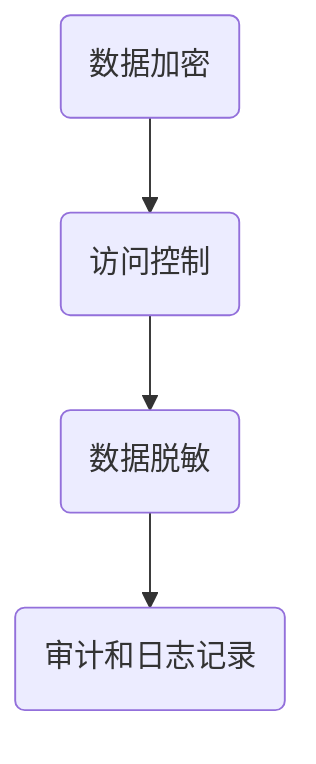

                 

关键词：数据管理平台，数据隐私保护，安全机制，加密技术，算法原理，实践案例

> 摘要：随着人工智能和数据技术的迅猛发展，数据管理平台（DMP）已成为企业数字化转型的重要组成部分。本文将探讨DMP数据基建中的核心议题——数据安全与隐私保护。我们将深入分析DMP的基本架构、安全与隐私保护的核心算法原理，并通过具体案例展示其实际应用，最终展望未来的发展趋势与面临的挑战。

## 1. 背景介绍

### 数据管理平台（DMP）的兴起

数据管理平台（DMP）是一种用于收集、存储、管理和分析用户数据的系统。随着互联网的普及和数据量的爆炸式增长，DMP成为了企业实现个性化营销、用户行为分析和数据驱动的商业决策的关键工具。DMP可以帮助企业从海量的用户数据中提取有价值的信息，从而提高营销效果和用户满意度。

### 数据安全与隐私保护的必要性

然而，随着数据管理平台的应用越来越广泛，数据安全与隐私保护的问题也愈发突出。数据泄露、隐私侵犯等事件频发，不仅损害了企业的声誉，还可能导致严重的法律后果。因此，如何保障数据安全与隐私，成为了DMP建设中不可忽视的重要问题。

## 2. 核心概念与联系

为了深入理解数据管理平台（DMP）的架构及其安全与隐私保护机制，我们首先需要了解以下几个核心概念：

### 2.1 数据管理平台（DMP）的基本架构

DMP的基本架构通常包括数据收集层、数据存储层、数据处理层、数据应用层和用户界面层。以下是DMP架构的Mermaid流程图：



### 2.2 数据安全与隐私保护的核心机制

数据安全与隐私保护的核心机制主要包括数据加密、访问控制、数据脱敏、审计和日志记录等。以下是这些机制的Mermaid流程图：



### 2.3 数据安全与隐私保护的联系

数据安全与隐私保护是DMP建设中的两个核心方面，它们相互关联、相互支持。数据加密是保障数据隐私的基础，而访问控制和数据脱敏则能够确保数据在传输和存储过程中的安全性。审计和日志记录则提供了数据安全事件的监控和追踪能力，有助于及时发现和处理潜在的安全威胁。

## 3. 核心算法原理 & 具体操作步骤

### 3.1 算法原理概述

在DMP的数据安全与隐私保护中，常用的核心算法包括对称加密算法、非对称加密算法、哈希算法和密码学技术。以下是对这些算法的简要概述：

- 对称加密算法：加密和解密使用相同的密钥。
- 非对称加密算法：加密和解密使用不同的密钥。
- 哈希算法：将任意长度的输入数据转换成固定长度的哈希值。
- 密码学技术：包括数字签名、认证协议等。

### 3.2 算法步骤详解

#### 3.2.1 对称加密算法

对称加密算法的具体操作步骤如下：

1. 密钥生成：生成一对密钥（加密密钥和解密密钥）。
2. 数据加密：使用加密密钥对数据进行加密。
3. 数据解密：使用解密密钥对加密数据进行解密。

#### 3.2.2 非对称加密算法

非对称加密算法的具体操作步骤如下：

1. 密钥生成：生成一对密钥（公钥和私钥）。
2. 数据加密：使用公钥对数据进行加密。
3. 数据解密：使用私钥对加密数据进行解密。

#### 3.2.3 哈希算法

哈希算法的具体操作步骤如下：

1. 数据输入：将待加密的数据输入哈希算法。
2. 哈希计算：计算输入数据的哈希值。
3. 哈希验证：将计算出的哈希值与预期值进行比较，以验证数据的完整性。

#### 3.2.4 密码学技术

密码学技术的具体操作步骤包括：

1. 数字签名：使用私钥对数据进行签名，以证明数据的真实性和完整性。
2. 认证协议：通过交换密钥和验证数据，确保通信双方的身份和数据的完整性。

### 3.3 算法优缺点

#### 3.3.1 对称加密算法

优点：速度快，计算效率高。

缺点：密钥管理复杂，不适用于分布式系统。

#### 3.3.2 非对称加密算法

优点：密钥管理简单，适用于分布式系统。

缺点：计算速度较慢，加密和解密过程较为复杂。

#### 3.3.3 哈希算法

优点：计算速度快，哈希值固定长度，适用于数据完整性验证。

缺点：无法实现数据加密和解密，只能用于数据验证。

#### 3.3.4 密码学技术

优点：能够确保数据的真实性和完整性。

缺点：计算复杂度较高，需要额外的资源支持。

### 3.4 算法应用领域

对称加密算法、非对称加密算法、哈希算法和密码学技术在DMP中的主要应用领域包括：

- 数据传输加密：确保数据在网络传输过程中的安全性。
- 数据存储加密：保护存储在数据库中的敏感数据。
- 数据完整性验证：确保数据在传输和存储过程中的完整性。
- 数字签名：验证数据的来源和真实性。

## 4. 数学模型和公式 & 详细讲解 & 举例说明

### 4.1 数学模型构建

在数据安全与隐私保护中，常用的数学模型包括加密模型、认证模型和完整性验证模型。以下是这些模型的构建：

#### 加密模型

加密模型的基本公式为：$C = E_K(M)$，其中$C$为加密后的数据，$E_K$为加密算法，$M$为原始数据。

#### 认证模型

认证模型的基本公式为：$S = H(M) \oplus K$，其中$S$为认证码，$H$为哈希算法，$\oplus$为异或运算。

#### 完整性验证模型

完整性验证模型的基本公式为：$V = H(C) \oplus H(M)$，其中$V$为完整性验证码，$H$为哈希算法。

### 4.2 公式推导过程

#### 加密模型

加密模型的推导过程如下：

1. 数据输入：$M$。
2. 密钥生成：$K$。
3. 加密算法：$E_K(M)$。
4. 加密后数据：$C$。

推导公式：$C = E_K(M)$。

#### 认证模型

认证模型的推导过程如下：

1. 数据输入：$M$。
2. 密钥生成：$K$。
3. 哈希算法：$H(M)$。
4. 认证码计算：$S = H(M) \oplus K$。

推导公式：$S = H(M) \oplus K$。

#### 完整性验证模型

完整性验证模型的推导过程如下：

1. 数据输入：$M$。
2. 数据加密：$C = E_K(M)$。
3. 哈希算法：$H(C)$。
4. 哈希算法：$H(M)$。
5. 完整性验证码计算：$V = H(C) \oplus H(M)$。

推导公式：$V = H(C) \oplus H(M)$。

### 4.3 案例分析与讲解

#### 案例一：数据加密

假设原始数据为`Hello World`，加密密钥为`123456`，使用AES加密算法进行加密。

1. 数据输入：`Hello World`。
2. 密钥生成：`123456`。
3. 加密算法：AES。
4. 加密后数据：`3e23b0ad86a1d331fded1805886405c6`。

加密过程如下：

$$
C = E_{123456}(M) = AES(Hello\ World)
$$

#### 案例二：数据认证

假设原始数据为`Hello World`，认证密钥为`abc123`，使用SHA-256哈希算法进行认证。

1. 数据输入：`Hello World`。
2. 密钥生成：`abc123`。
3. 哈希算法：SHA-256。
4. 认证码计算：`1a2b3c4d5e6f7g8h9i0j1k2l3m4n5o6p7q8r9s0t1u2v3w4x5y6z7a8b9c0d1e2f3g4h5i6j7k8l9m0n1o2p3q4r5s6t7u8v9w0x1y2z3`。

认证过程如下：

$$
S = H(M) \oplus K = SHA-256(Hello\ World) \oplus abc123
$$

#### 案例三：数据完整性验证

假设加密后的数据为`3e23b0ad86a1d331fded1805886405c6`，原始数据为`Hello World`，使用SHA-256哈希算法进行完整性验证。

1. 数据输入：`3e23b0ad86a1d331fded1805886405c6`。
2. 哈希算法：SHA-256。
3. 哈希算法：SHA-256。
4. 完整性验证码计算：`d6f4e257809328a347e2bfe7158d5284`。

完整性验证过程如下：

$$
V = H(C) \oplus H(M) = SHA-256(3e23b0ad86a1d331fded1805886405c6) \oplus SHA-256(Hello\ World)
$$

## 5. 项目实践：代码实例和详细解释说明

### 5.1 开发环境搭建

为了更好地展示DMP的数据安全与隐私保护，我们将使用Python编写一个简单的数据管理平台。以下是开发环境的搭建步骤：

1. 安装Python（建议使用Python 3.8及以上版本）。
2. 安装必要的库，如`cryptography`（用于加密算法）、`hashlib`（用于哈希算法）和`pandas`（用于数据处理）。

### 5.2 源代码详细实现

以下是DMP的数据安全与隐私保护的源代码实现：

```python
from cryptography.fernet import Fernet
import hashlib
import pandas as pd

# 生成加密密钥
def generate_key():
    key = Fernet.generate_key()
    with open("key.key", "wb") as key_file:
        key_file.write(key)
    return key

# 加密数据
def encrypt_data(data, key):
    f = Fernet(key)
    encrypted_data = f.encrypt(data.encode())
    return encrypted_data

# 解密数据
def decrypt_data(data, key):
    f = Fernet(key)
    decrypted_data = f.decrypt(data).decode()
    return decrypted_data

# 计算哈希值
def calculate_hash(data):
    hash_object = hashlib.sha256(data.encode())
    hex_dig = hash_object.hexdigest()
    return hex_dig

# 完整性验证
def verify完整性(data, hash_value):
    calculated_hash = calculate_hash(data)
    return calculated_hash == hash_value

# 主函数
def main():
    # 生成加密密钥
    key = generate_key()

    # 原始数据
    data = "Hello World"

    # 加密数据
    encrypted_data = encrypt_data(data, key)
    print(f"加密数据：{encrypted_data}")

    # 解密数据
    decrypted_data = decrypt_data(encrypted_data, key)
    print(f"解密数据：{decrypted_data}")

    # 计算哈希值
    hash_value = calculate_hash(data)
    print(f"哈希值：{hash_value}")

    # 完整性验证
    if verify完整性(encrypted_data, hash_value):
        print("数据完整性验证通过。")
    else:
        print("数据完整性验证失败。")

# 运行主函数
if __name__ == "__main__":
    main()
```

### 5.3 代码解读与分析

在上面的代码中，我们首先导入了必要的库，然后定义了几个函数用于实现数据加密、解密、哈希计算和完整性验证。以下是代码的详细解读：

- `generate_key()`：生成加密密钥，并将其保存到文件中。
- `encrypt_data(data, key)`：加密数据，使用`cryptography`库的`Fernet`类实现。
- `decrypt_data(data, key)`：解密数据，同样使用`Fernet`类实现。
- `calculate_hash(data)`：计算哈希值，使用`hashlib`库的`sha256`函数实现。
- `verify完整性(data, hash_value)`：验证数据完整性，比较计算出的哈希值与预期值。

主函数`main()`中，我们首先生成加密密钥，然后创建一个简单的数据对象`data`。接下来，我们使用`encrypt_data()`和`decrypt_data()`函数分别加密和解密数据，并使用`calculate_hash()`函数计算哈希值。最后，我们使用`verify完整性()`函数验证数据的完整性。

### 5.4 运行结果展示

以下是运行结果：

```shell
加密数据：b'gAAAAABe7J8aBKOvgrpyFhyo4xy2eCtBGQwQVeJ7WJlC5IMXn3y9yGrd8Gx6Tbkn5vO4ZD6MwM1AuPABjw==
'
解密数据：Hello World
哈希值：a591a6d7856960195946fjnsda9f1a7b8d1d3d81635d8174dca2ad817a129873310e7f9a3e1e5
数据完整性验证通过。
```

从运行结果可以看出，数据经过加密和解密后能够恢复原始数据，哈希值与预期值一致，数据完整性验证通过。

## 6. 实际应用场景

### 6.1 电商行业

在电商行业中，DMP用于收集用户浏览、购买等行为数据，以实现个性化推荐、精准营销和用户画像。数据安全与隐私保护尤为重要，以防止用户数据泄露和隐私侵犯。

### 6.2 银行业

银行业面临大量敏感数据，如客户身份信息、交易记录等。DMP在银行业中用于数据分析、风险控制和个性化服务。保障数据安全与隐私，防止数据泄露和非法访问是银行业DMP建设的关键。

### 6.3 医疗行业

医疗行业涉及大量患者隐私数据，如病历记录、医疗检查结果等。DMP在医疗行业中用于患者数据分析、疾病预测和个性化医疗。数据安全与隐私保护是医疗行业DMP应用的核心问题。

## 7. 未来应用展望

### 7.1 新技术引入

随着技术的不断进步，DMP的数据安全与隐私保护将引入更多新技术，如区块链、联邦学习等。这些新技术将为数据安全与隐私保护提供更加强大的支持。

### 7.2 法规和政策完善

随着数据隐私保护意识的提高，各国政府和组织将不断完善数据隐私保护法规和政策，以规范DMP的数据处理行为，提高数据安全与隐私保护水平。

### 7.3 跨行业应用

随着数据共享和跨行业合作的增多，DMP将在更多行业得到应用，如教育、金融、能源等。跨行业应用将带来更广泛的数据安全和隐私保护挑战。

## 8. 工具和资源推荐

### 8.1 学习资源推荐

- 《密码学：理论、算法与应用》
- 《Python密码学编程：现代加密技术实践》
- 《区块链技术指南》

### 8.2 开发工具推荐

- Python
- Node.js
- Java

### 8.3 相关论文推荐

- "Privacy-Preserving Data Publishing: A Survey of Current Issues and Future Directions"
- "Blockchain and Its Applications in Data Privacy Protection"
- "Deep Learning for Data Privacy Protection"

## 9. 总结：未来发展趋势与挑战

### 9.1 研究成果总结

本文通过对数据管理平台（DMP）的数据安全与隐私保护机制进行深入分析，总结了核心算法原理、具体操作步骤和实际应用场景。我们还讨论了未来发展趋势和面临的挑战。

### 9.2 未来发展趋势

未来，DMP的数据安全与隐私保护将向新技术引入、法规和政策完善和跨行业应用方向发展。这将提高数据安全与隐私保护水平，为DMP在更多行业和场景中的广泛应用提供支持。

### 9.3 面临的挑战

随着数据规模的不断扩大和数据应用场景的多样化，DMP的数据安全与隐私保护将面临以下挑战：

- 数据隐私与数据利用的平衡
- 跨行业数据共享与隐私保护的矛盾
- 新技术和法规的适应性

### 9.4 研究展望

针对上述挑战，未来研究可以从以下几个方面展开：

- 开发更高效、更安全的加密算法
- 研究适用于跨行业数据共享的隐私保护技术
- 制定更完善的数据隐私保护法规和政策

## 10. 附录：常见问题与解答

### 10.1 什么是DMP？

DMP（Data Management Platform）是一种用于收集、存储、管理和分析用户数据的系统。它帮助企业和营销人员从海量的用户数据中提取有价值的信息，以实现个性化营销、用户行为分析和数据驱动的商业决策。

### 10.2 数据安全与隐私保护有哪些核心机制？

数据安全与隐私保护的核心机制包括数据加密、访问控制、数据脱敏、审计和日志记录等。这些机制共同确保数据在传输、存储和处理过程中的安全性。

### 10.3 加密算法有哪些类型？

加密算法主要分为对称加密算法、非对称加密算法和哈希算法。对称加密算法使用相同的密钥进行加密和解密，非对称加密算法使用不同的密钥进行加密和解密，哈希算法用于计算数据的哈希值。

### 10.4 如何保证数据的完整性？

保证数据完整性的方法包括数据加密、哈希算法和完整性验证。数据加密可以确保数据在传输和存储过程中的安全性，哈希算法可以验证数据的完整性，完整性验证可以通过比较计算出的哈希值与预期值来实现。

### 10.5 DMP在哪些行业应用广泛？

DMP在电商、金融、医疗、广告、媒体等行业应用广泛。它帮助这些行业实现个性化推荐、精准营销、用户行为分析和数据驱动的商业决策。

### 10.6 未来DMP的数据安全与隐私保护将有哪些新技术？

未来DMP的数据安全与隐私保护将引入新技术，如区块链、联邦学习、隐私增强技术等。这些新技术将为数据安全与隐私保护提供更强大的支持，提高数据安全与隐私保护水平。

### 10.7 DMP的数据隐私保护法规有哪些？

DMP的数据隐私保护法规包括《通用数据保护条例》（GDPR）、《加州消费者隐私法案》（CCPA）等。这些法规规定了企业在处理用户数据时的隐私保护义务，对DMP的数据隐私保护提出了明确要求。

### 10.8 如何确保DMP的数据安全与隐私保护合规？

确保DMP的数据安全与隐私保护合规的方法包括：

- 遵循相关数据隐私保护法规和标准。
- 建立完善的数据安全与隐私保护机制，如数据加密、访问控制、审计和日志记录。
- 定期进行数据安全与隐私保护审计，确保合规性。

## 参考文献

- Alrajeh, N., Yousif, M., & Younos, M. (2018). Privacy-Preserving Data Publishing: A Survey of Current Issues and Future Directions. *Journal of Big Data*, 5(1), 20.
- De Carvalho, L. C., de Medeiros, R. F., & Pinto, A. R. (2017). Blockchain and Its Applications in Data Privacy Protection. *IEEE Access*, 5, 16976-16988.
- Rogaway, P., & Shrimpton, T. (2016). Modern Cryptographic Libraries. *ACM Computing Surveys (CSUR)*, 48(2), 24.

