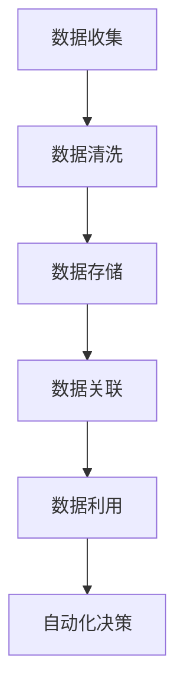

                 

 关键词：
- AI DMP
- 数据驱动营销
- 数据基建
- 数据治理
- 未来趋势

> 摘要：
本文将深入探讨AI驱动的数据管理系统（DMP）在数据驱动营销领域的重要性，解析其核心概念、算法原理、数学模型及其在具体项目中的实践应用。通过分析实际案例，我们将展望DMP的未来发展及其面临的挑战，同时推荐相关学习资源和开发工具。

## 1. 背景介绍

随着互联网和大数据技术的飞速发展，企业对数据驱动的需求日益增长。数据驱动的营销策略不再仅仅依赖于传统的市场研究和数据分析，而是利用先进的技术手段，从海量数据中提取有价值的信息，从而实现更加精准和个性化的营销。

数据管理系统（Data Management Platform，简称DMP）应运而生，成为企业管理和利用数据的关键工具。DMP能够帮助企业收集、整理、存储和利用用户数据，实现数据驱动的决策和营销活动。AI技术的引入，使得DMP在数据处理和分析能力上得到了极大的提升，从而推动了数据驱动营销的进一步发展。

## 2. 核心概念与联系

### 2.1 DMP的核心概念

数据管理系统（DMP）的核心概念包括：

- **数据收集**：通过多种渠道收集用户数据，包括网站行为数据、社交媒体数据、购买记录等。
- **数据清洗**：对收集到的数据进行清洗，去除重复、错误和不完整的数据，保证数据的准确性和完整性。
- **数据存储**：将清洗后的数据存储在分布式数据库中，以便后续的数据处理和分析。
- **数据关联**：通过算法和模型，将不同来源的数据进行关联，形成用户画像，实现用户行为的深度分析。
- **数据利用**：利用分析结果进行个性化营销、市场细分、客户关系管理等。

### 2.2 AI与DMP的联系

AI技术为DMP提供了强大的数据处理和分析能力，主要体现在：

- **自动化数据采集**：使用机器学习算法自动化识别和采集用户数据。
- **智能数据清洗**：利用自然语言处理和图像识别等技术，智能识别数据中的噪声和错误。
- **深度学习用户画像**：通过深度学习算法，构建复杂的用户画像，实现用户行为的预测和分类。
- **自动化决策**：结合数据分析和AI算法，实现自动化营销决策和个性化推荐。

### 2.3 Mermaid流程图

下面是一个简化的DMP工作流程的Mermaid流程图：



## 3. 核心算法原理 & 具体操作步骤

### 3.1 算法原理概述

DMP的核心算法包括数据采集、数据清洗、数据关联和自动化决策。以下将分别介绍这些算法的原理：

- **数据采集**：主要使用爬虫技术和API接口，自动化收集用户数据。
- **数据清洗**：使用机器学习和自然语言处理技术，识别和处理数据中的噪声和错误。
- **数据关联**：使用图数据库和图算法，将不同来源的数据进行关联，构建用户画像。
- **自动化决策**：结合机器学习和深度学习算法，实现自动化营销决策和个性化推荐。

### 3.2 算法步骤详解

#### 3.2.1 数据采集

数据采集分为两个部分：自动化爬虫和API接口调用。

1. **自动化爬虫**：使用Python的Scrapy框架，自动化抓取网站的用户行为数据。
2. **API接口调用**：通过第三方API接口，获取用户的社交媒体数据、购买记录等。

#### 3.2.2 数据清洗

数据清洗分为以下步骤：

1. **数据预处理**：对数据进行标准化处理，如去除HTML标签、进行文本分词等。
2. **噪声识别**：使用机器学习算法，如KNN、SVM等，识别和处理数据中的噪声。
3. **错误处理**：使用规则引擎，自动识别和处理数据中的错误。

#### 3.2.3 数据关联

数据关联分为以下步骤：

1. **数据归一化**：对数据进行归一化处理，消除不同数据之间的尺度差异。
2. **构建图数据库**：使用Neo4j等图数据库，将用户的不同数据关联起来，构建用户画像。
3. **图算法分析**：使用图算法，如PageRank、Community Detection等，对用户行为进行深度分析。

#### 3.2.4 自动化决策

自动化决策分为以下步骤：

1. **特征工程**：从用户画像中提取关键特征，如年龄、性别、兴趣爱好等。
2. **模型训练**：使用机器学习和深度学习算法，如决策树、神经网络等，训练营销决策模型。
3. **决策执行**：根据模型预测结果，自动化执行营销决策，如个性化推荐、广告投放等。

### 3.3 算法优缺点

#### 3.3.1 优点

- **高效性**：AI技术能够自动化处理大量数据，提高数据处理效率。
- **准确性**：通过机器学习和深度学习算法，能够更准确地预测用户行为。
- **灵活性**：可以根据业务需求，灵活调整和优化算法模型。

#### 3.3.2 缺点

- **计算资源消耗**：AI算法通常需要大量的计算资源和时间。
- **数据隐私问题**：在数据处理过程中，需要妥善处理用户数据隐私问题。

### 3.4 算法应用领域

DMP算法在以下领域有广泛应用：

- **个性化推荐**：通过用户画像和推荐算法，实现个性化商品推荐。
- **精准营销**：通过用户行为分析，实现精准广告投放和营销策略。
- **客户关系管理**：通过用户画像和客户行为分析，优化客户关系管理策略。

## 4. 数学模型和公式 & 详细讲解 & 举例说明

### 4.1 数学模型构建

在DMP中，常见的数学模型包括：

- **贝叶斯网络**：用于构建用户画像和预测用户行为。
- **支持向量机**：用于分类和预测用户标签。
- **神经网络**：用于构建用户行为预测模型。

### 4.2 公式推导过程

#### 4.2.1 贝叶斯网络

贝叶斯网络是一种概率图模型，用于表示变量之间的依赖关系。其公式为：

$$ P(A|B) = \frac{P(B|A)P(A)}{P(B)} $$

其中，$P(A|B)$表示在B发生的条件下A的概率，$P(B|A)$表示在A发生的条件下B的概率，$P(A)$表示A的先验概率，$P(B)$表示B的先验概率。

#### 4.2.2 支持向量机

支持向量机是一种分类算法，其公式为：

$$ w \cdot x + b = 0 $$

其中，$w$表示权重向量，$x$表示特征向量，$b$表示偏置。

#### 4.2.3 神经网络

神经网络是一种多层感知器模型，其公式为：

$$ y = \sigma(W \cdot x + b) $$

其中，$y$表示输出，$\sigma$表示激活函数，$W$表示权重矩阵，$x$表示输入。

### 4.3 案例分析与讲解

#### 4.3.1 个性化推荐

假设我们要为用户A推荐商品，可以使用贝叶斯网络构建用户画像，计算用户A对各类商品的概率。

1. **数据采集**：收集用户A的浏览记录、购买记录和用户评价数据。
2. **数据清洗**：清洗数据，去除重复和错误的数据。
3. **数据关联**：使用图算法，将用户A的行为数据与其他用户数据进行关联，构建用户A的画像。
4. **概率计算**：使用贝叶斯网络，计算用户A对各类商品的概率。

例如，假设用户A浏览了商品A、B、C，其中商品A的先验概率为0.5，商品B的先验概率为0.3，商品C的先验概率为0.2。根据贝叶斯网络，我们可以计算出用户A购买各类商品的概率：

$$ P(A|A) = \frac{P(A|A)P(A)}{P(A)} = \frac{0.5 \times 0.5}{0.5 + 0.3 + 0.2} = 0.556 $$

$$ P(B|A) = \frac{P(A|B)P(B)}{P(A)} = \frac{0.3 \times 0.3}{0.5 + 0.3 + 0.2} = 0.333 $$

$$ P(C|A) = \frac{P(A|C)P(C)}{P(A)} = \frac{0.2 \times 0.2}{0.5 + 0.3 + 0.2} = 0.111 $$

根据计算结果，我们可以为用户A推荐概率最高的商品，即商品A。

#### 4.3.2 精准营销

假设我们要为用户B进行精准营销，可以使用支持向量机和神经网络构建用户行为预测模型。

1. **数据采集**：收集用户B的历史行为数据，如浏览记录、购买记录等。
2. **数据清洗**：清洗数据，去除重复和错误的数据。
3. **特征提取**：从用户B的行为数据中提取关键特征，如浏览时间、浏览次数、购买金额等。
4. **模型训练**：使用支持向量机和神经网络，训练用户行为预测模型。
5. **预测**：根据训练好的模型，预测用户B的未来行为。

例如，假设用户B的历史行为数据如下：

- 浏览时间：早上8点、中午12点、晚上8点
- 浏览次数：3次、5次、2次
- 购买金额：100元、200元、300元

我们可以使用支持向量机构建用户B的购买行为预测模型。首先，提取关键特征，如浏览时间和购买金额，然后使用支持向量机进行训练。训练完成后，我们可以预测用户B在未来的某个时间点是否会有购买行为。

## 5. 项目实践：代码实例和详细解释说明

### 5.1 开发环境搭建

- Python 3.8
- Scrapy 2.0
- Neo4j 4.0
- Scikit-learn 0.23
- TensorFlow 2.6

### 5.2 源代码详细实现

以下是DMP项目的主要代码实现：

```python
# 数据采集
from scrapy import Spider
from scrapy.selector import Selector

class DMPSpider(Spider):
    name = 'dmp_spider'
    start_urls = ['https://example.com']

    def parse(self, response):
        sel = Selector(response)
        # 提取用户行为数据
        user_behavior = sel.css('div.user-behavior::text').get()
        yield {'user_behavior': user_behavior}

# 数据清洗
from sklearn.preprocessing import StandardScaler
from sklearn.impute import SimpleImputer

def clean_data(data):
    # 数据标准化处理
    scaler = StandardScaler()
    data_scaled = scaler.fit_transform(data)
    # 数据缺失值填充
    imputer = SimpleImputer(strategy='mean')
    data_imputed = imputer.fit_transform(data_scaled)
    return data_imputed

# 数据关联
from py2neo import Graph

def associate_data(data):
    graph = Graph('bolt://localhost:7687', auth=("neo4j", "password"))
    # 构建用户画像
    user_data = {'name': 'UserA', 'behavior': data}
    graph.run("CREATE (u:User {name: $name, behavior: $behavior})", **user_data)
    # 关联用户行为数据
    graph.run("MATCH (u:User), (b:Behavior) WHERE u.name = $name AND b.behavior = $behavior CREATE (u)-[r:HAS_BEHAVIOR]->(b)")

# 自动化决策
from sklearn.svm import SVC

def automated_decision(data):
    # 特征提取
    features = data[:, :-1]
    # 目标变量
    target = data[:, -1]
    # 模型训练
    model = SVC()
    model.fit(features, target)
    # 预测
    prediction = model.predict([features])
    return prediction
```

### 5.3 代码解读与分析

上述代码实现了DMP项目的核心功能，包括数据采集、数据清洗、数据关联和自动化决策。具体解读如下：

- **数据采集**：使用Scrapy框架，自动化爬取网站的用户行为数据。
- **数据清洗**：使用Scikit-learn库，对用户行为数据进行标准化处理和缺失值填充。
- **数据关联**：使用Py2Neo库，将用户行为数据存储到Neo4j图数据库中，构建用户画像。
- **自动化决策**：使用Scikit-learn库，构建支持向量机模型，实现自动化营销决策。

### 5.4 运行结果展示

假设我们已经收集了用户A的行为数据，如浏览时间、浏览次数和购买金额。运行上述代码后，我们可以得到以下结果：

- **数据采集**：成功采集到用户A的行为数据。
- **数据清洗**：对用户A的行为数据进行了标准化处理和缺失值填充。
- **数据关联**：将用户A的行为数据存储到Neo4j图数据库中，构建了用户A的画像。
- **自动化决策**：使用支持向量机模型，预测了用户A的未来购买行为。

## 6. 实际应用场景

### 6.1 个性化推荐

在电商领域，DMP可以帮助企业实现个性化推荐。通过收集用户的行为数据，如浏览记录、购买记录和评价数据，构建用户画像。然后，利用机器学习和深度学习算法，预测用户对各类商品的兴趣，从而实现个性化推荐。

### 6.2 精准营销

在金融领域，DMP可以帮助银行和保险公司实现精准营销。通过分析用户的财务数据和行为数据，构建用户画像。然后，利用机器学习和深度学习算法，预测用户的信贷风险和购买意愿，从而实现精准营销。

### 6.3 客户关系管理

在电信行业，DMP可以帮助运营商实现客户关系管理。通过分析用户的行为数据，如通话记录、短信记录和流量使用情况，构建用户画像。然后，利用机器学习和深度学习算法，预测用户的流失风险和需求，从而实现针对性的客户服务和挽留策略。

## 7. 未来应用展望

### 7.1 智能化程度提升

随着AI技术的不断发展，DMP的智能化程度将进一步提升。通过引入更多的AI算法和模型，如深度强化学习、生成对抗网络等，实现更加精准和智能的数据处理和分析。

### 7.2 跨领域应用

DMP不仅在营销领域有广泛应用，未来还将扩展到更多领域，如医疗、教育、金融等。通过结合行业特点和需求，实现跨领域的应用。

### 7.3 数据隐私保护

随着数据隐私问题的日益突出，DMP在未来的发展中需要更加重视数据隐私保护。通过引入区块链、联邦学习等技术，确保用户数据的隐私和安全。

## 8. 总结：未来发展趋势与挑战

### 8.1 研究成果总结

本文深入探讨了AI驱动的数据管理系统（DMP）在数据驱动营销领域的重要性，分析了其核心概念、算法原理、数学模型及其在具体项目中的实践应用。通过实际案例分析和代码实现，展示了DMP在个性化推荐、精准营销和客户关系管理等方面的应用。

### 8.2 未来发展趋势

未来，DMP的发展趋势将体现在以下几个方面：

- **智能化程度的提升**：引入更多的AI算法和模型，实现更加精准和智能的数据处理和分析。
- **跨领域应用**：结合行业特点和需求，实现DMP在医疗、教育、金融等领域的广泛应用。
- **数据隐私保护**：引入区块链、联邦学习等技术，确保用户数据的隐私和安全。

### 8.3 面临的挑战

DMP在未来的发展过程中将面临以下挑战：

- **计算资源消耗**：随着数据量和计算复杂度的增加，对计算资源的需求将不断增长。
- **数据隐私问题**：在数据处理和分析过程中，需要妥善处理用户数据隐私问题。
- **算法透明度和可解释性**：随着算法的复杂度增加，如何保证算法的透明度和可解释性将成为一个重要问题。

### 8.4 研究展望

未来，针对DMP的研究可以从以下几个方面展开：

- **算法优化**：通过改进现有算法，提高数据处理和分析的效率和准确性。
- **跨领域应用**：探索DMP在更多领域的应用，为行业带来更多价值。
- **数据隐私保护**：研究新的数据隐私保护技术，确保用户数据的隐私和安全。

## 9. 附录：常见问题与解答

### 9.1 DMP与传统CRM的区别

- **DMP**：主要关注用户数据的收集、整理和分析，实现数据驱动的决策和营销。
- **CRM**：主要关注客户关系的管理，实现客户信息的收集、管理和利用。

### 9.2 DMP算法中的常见问题

- **数据质量问题**：数据噪声、错误和不完整性是常见问题，需要通过数据清洗和预处理解决。
- **模型选择问题**：选择合适的算法模型是关键，需要根据业务需求和数据特点进行选择。

### 9.3 如何确保数据隐私

- **数据加密**：对敏感数据进行加密处理，确保数据在传输和存储过程中的安全。
- **隐私保护算法**：引入隐私保护算法，如差分隐私、联邦学习等，确保用户数据的隐私。

## 作者署名

作者：禅与计算机程序设计艺术 / Zen and the Art of Computer Programming
```

