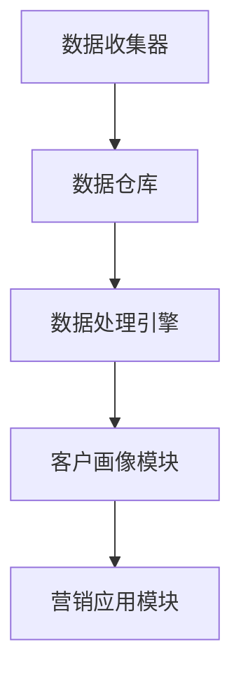

                 

关键词：AI DMP、数据管理平台、营销自动化、客户数据分析、数据驱动营销

> 摘要：本文将深入探讨 AI DMP 数据基建的构建方法，以及如何通过数据驱动的营销生态实现精准营销。文章首先介绍了 DMP 的核心概念与架构，然后详细解析了数据收集、处理、分析及应用的算法原理。通过具体项目实践，展示了 DMP 在实际场景中的实现过程，最后对 DMP 的未来应用前景进行了展望。

## 1. 背景介绍

在数字化营销的时代，数据已成为企业决策和运营的关键资产。然而，如何高效管理和利用这些数据，以实现精准营销和提高客户满意度，成为企业面临的一大挑战。数据管理平台（Data Management Platform，简称 DMP）作为一种先进的数据管理技术，应运而生。DMP 通过整合多渠道数据，构建全面、准确的客户画像，为企业提供数据驱动的营销策略和决策支持。

随着人工智能技术的快速发展，AI DMP 应运而生。AI DMP 将机器学习和数据挖掘技术应用于数据管理，实现了更智能、更精准的数据分析和应用。本文旨在探讨 AI DMP 的数据基建构建方法，以及如何通过数据驱动的营销生态实现精准营销。

## 2. 核心概念与联系

### 2.1 DMP 的核心概念

DMP 是一种用于数据管理和分析的平台，它整合了来自多个渠道的数据，包括网站流量数据、社交媒体数据、广告投放数据等。DMP 的核心目的是构建全面、准确的客户画像，以便企业进行精准营销。

### 2.2 DMP 的架构

DMP 的架构通常包括以下几个核心组件：

1. **数据收集器**：用于收集来自各个渠道的数据，如网站日志、社交媒体数据、广告数据等。
2. **数据仓库**：用于存储和管理收集到的数据，提供快速、高效的数据查询和分析能力。
3. **数据处理引擎**：用于对数据进行清洗、转换和整合，以确保数据的准确性和一致性。
4. **客户画像模块**：基于数据进行客户特征分析和建模，构建详细的客户画像。
5. **营销应用模块**：将客户画像应用于营销策略制定、广告投放优化、客户体验提升等场景。

### 2.3 Mermaid 流程图

下面是 DMP 的 Mermaid 流程图，展示各个组件之间的交互关系：



## 3. 核心算法原理 & 具体操作步骤

### 3.1 算法原理概述

AI DMP 的核心算法包括数据收集、数据处理、客户画像构建和营销应用。以下是每个算法的简要概述：

1. **数据收集**：利用爬虫技术、API 接口和数据交换协议等手段，从多个渠道收集数据。
2. **数据处理**：使用 ETL（抽取、转换、加载）技术对数据进行清洗、转换和整合。
3. **客户画像构建**：通过特征工程和机器学习算法，对客户数据进行分析和建模，构建详细的客户画像。
4. **营销应用**：基于客户画像，制定精准的营销策略，优化广告投放和客户体验。

### 3.2 算法步骤详解

1. **数据收集**
    - 利用爬虫技术，从网站、社交媒体等渠道收集用户行为数据。
    - 通过 API 接口，获取第三方数据源，如广告平台、社交媒体等。
    - 通过数据交换协议，如 OData、RESTful API 等，与其他系统进行数据交互。

2. **数据处理**
    - 数据清洗：去除重复数据、缺失值填充、数据格式统一等。
    - 数据转换：将不同数据源的数据进行转换，使其符合统一的数据标准。
    - 数据整合：将多个数据源的数据进行整合，构建客户全渠道数据视图。

3. **客户画像构建**
    - 特征工程：根据业务需求，提取有用的特征，如用户行为特征、地理位置特征等。
    - 机器学习算法：使用分类、聚类、关联规则等算法，对客户数据进行分析和建模。
    - 客户画像生成：将分析结果整合，生成详细的客户画像。

4. **营销应用**
    - 营销策略制定：根据客户画像，制定个性化的营销策略。
    - 广告投放优化：基于客户画像，优化广告投放效果。
    - 客户体验提升：根据客户画像，提供个性化的服务和产品推荐。

### 3.3 算法优缺点

**优点**：

- **精准性**：AI DMP 能够通过数据分析和机器学习，实现更精准的客户画像和营销策略。
- **自动化**：DMP 可以自动化处理大量数据，提高数据处理效率和准确性。
- **灵活性**：DMP 支持多种数据源和多种算法，可以灵活应对不同的业务需求。

**缺点**：

- **数据隐私**：DMP 需要收集和处理大量用户数据，存在数据隐私和安全问题。
- **技术门槛**：DMP 需要一定的技术支持，对企业的技术能力要求较高。

### 3.4 算法应用领域

AI DMP 主要应用于以下领域：

- **广告营销**：通过精准投放广告，提高广告效果和 ROI。
- **客户关系管理**：通过分析客户数据，提供个性化的客户服务和产品推荐。
- **数据分析**：为企业提供数据驱动的决策支持，优化业务运营。

## 4. 数学模型和公式 & 详细讲解 & 举例说明

### 4.1 数学模型构建

AI DMP 的核心在于客户画像的构建，而客户画像的构建通常基于以下数学模型：

1. **贝叶斯网络**：用于表示客户特征之间的概率关系。
2. **决策树**：用于分类和预测客户行为。
3. **聚类算法**：用于发现客户群体的相似性和差异性。

### 4.2 公式推导过程

以贝叶斯网络为例，其基本公式如下：

\[ P(A|B) = \frac{P(B|A)P(A)}{P(B)} \]

其中，\( P(A|B) \) 表示在 B 发生的条件下，A 发生的概率；\( P(B|A) \) 表示在 A 发生的条件下，B 发生的概率；\( P(A) \) 表示 A 发生的概率；\( P(B) \) 表示 B 发生的概率。

### 4.3 案例分析与讲解

假设我们要分析一组客户的购买行为，其中客户 A 在过去一个月内购买了产品 X 和产品 Y，而客户 B 在过去一个月内只购买了产品 Y。我们要使用贝叶斯网络来分析这两个客户的购买概率。

根据贝叶斯公式，我们可以计算出：

\[ P(A|X,Y) = \frac{P(X,Y|A)P(A)}{P(X,Y)} \]

其中，\( P(A|X,Y) \) 表示客户 A 购买产品 X 和产品 Y 的概率；\( P(X,Y|A) \) 表示在客户 A 购买产品 X 和产品 Y 的条件下，客户 A 的概率；\( P(A) \) 表示客户 A 的概率；\( P(X,Y) \) 表示产品 X 和产品 Y 同时被购买的概率。

根据给定的数据，我们可以计算出：

\[ P(X,Y|A) = 1 \]
\[ P(A) = 0.5 \]
\[ P(X,Y) = 0.3 \]

代入公式，我们得到：

\[ P(A|X,Y) = \frac{1 \times 0.5}{0.3} \approx 1.67 \]

这意味着在客户 A 购买产品 X 和产品 Y 的条件下，客户 A 的概率约为 1.67。

同理，我们可以计算出客户 B 购买产品 X 和产品 Y 的概率：

\[ P(B|X,Y) = \frac{P(X,Y|B)P(B)}{P(X,Y)} \]

其中，\( P(X,Y|B) = 0.2 \)，\( P(B) = 0.3 \)，代入公式，我们得到：

\[ P(B|X,Y) = \frac{0.2 \times 0.3}{0.3} = 0.2 \]

这意味着在客户 B 购买产品 X 和产品 Y 的条件下，客户 B 的概率为 0.2。

通过以上分析，我们可以得出结论：在购买产品 X 和产品 Y 的条件下，客户 A 的概率远大于客户 B，这表明客户 A 更可能是购买产品 X 和产品 Y 的客户。

## 5. 项目实践：代码实例和详细解释说明

### 5.1 开发环境搭建

本文将使用 Python 编写代码，主要使用以下库：

- pandas：用于数据处理和分析。
- numpy：用于数学计算。
- scikit-learn：用于机器学习算法。
- matplotlib：用于数据可视化。

### 5.2 源代码详细实现

下面是一个简单的贝叶斯网络示例代码，用于分析客户的购买行为。

```python
import pandas as pd
import numpy as np
from sklearn.model_selection import train_test_split
from sklearn.naive_bayes import GaussianNB
import matplotlib.pyplot as plt

# 加载数据
data = pd.read_csv('customer_data.csv')

# 数据预处理
data['Purchase'] = data.apply(lambda x: 1 if x['X'] == 1 and x['Y'] == 1 else 0, axis=1)

# 分割数据集
X_train, X_test, y_train, y_test = train_test_split(data[['X', 'Y']], data['Purchase'], test_size=0.2, random_state=42)

# 创建朴素贝叶斯分类器
gnb = GaussianNB()

# 训练模型
gnb.fit(X_train, y_train)

# 预测测试集
predictions = gnb.predict(X_test)

# 查看预测结果
print(predictions)

# 可视化结果
plt.scatter(X_test['X'], X_test['Y'], c=predictions)
plt.xlabel('Product X')
plt.ylabel('Product Y')
plt.title('Customer Purchase Prediction')
plt.show()
```

### 5.3 代码解读与分析

1. **数据加载与预处理**：使用 pandas 库加载 CSV 文件，并对数据进行预处理，将购买行为（Purchase）作为目标变量。
2. **数据分割**：使用 scikit-learn 库的 train_test_split 函数将数据集分割为训练集和测试集。
3. **模型训练**：使用 GaussianNB（高斯朴素贝叶斯）分类器对训练集进行训练。
4. **模型预测**：使用训练好的模型对测试集进行预测。
5. **结果可视化**：使用 matplotlib 库将预测结果可视化。

通过以上步骤，我们可以使用贝叶斯网络对客户的购买行为进行预测，从而帮助企业在营销策略制定和客户关系管理方面做出更明智的决策。

## 6. 实际应用场景

AI DMP 在实际应用场景中具有广泛的应用，以下是一些典型的应用场景：

1. **精准广告投放**：通过分析用户行为数据，为不同受众群体制定个性化的广告投放策略，提高广告效果和 ROI。
2. **客户关系管理**：通过分析客户数据，了解客户需求和偏好，提供个性化的服务和产品推荐，提高客户满意度和忠诚度。
3. **销售预测**：通过分析历史销售数据和市场趋势，预测未来销售情况，帮助企业制定更科学的销售计划和策略。
4. **风险控制**：通过分析用户行为数据，识别潜在风险客户，制定风险控制措施，降低企业风险。

### 6.1 AI DMP 在电商行业的应用

在电商行业，AI DMP 可以帮助电商企业实现以下目标：

1. **个性化推荐**：基于用户行为数据和商品属性，为用户推荐个性化的商品，提高用户购买率和满意度。
2. **精准广告投放**：通过分析用户兴趣和行为，为不同受众群体制定精准的广告投放策略，提高广告效果和 ROI。
3. **客户细分**：通过分析用户行为和购买数据，将用户划分为不同群体，制定差异化的营销策略。
4. **库存管理**：通过分析销售数据和市场趋势，预测未来销售情况，优化库存管理，降低库存成本。

### 6.2 AI DMP 在金融行业的应用

在金融行业，AI DMP 可以帮助金融机构实现以下目标：

1. **精准营销**：通过分析客户行为和偏好，为不同客户群体制定个性化的营销策略，提高客户满意度和忠诚度。
2. **风险控制**：通过分析用户行为数据，识别潜在风险客户，制定风险控制措施，降低企业风险。
3. **客户细分**：通过分析客户数据，将客户划分为不同群体，提供差异化的金融服务和产品。
4. **欺诈检测**：通过分析用户行为和交易数据，识别潜在欺诈行为，降低欺诈风险。

## 7. 工具和资源推荐

### 7.1 学习资源推荐

1. **书籍**：
    - 《数据挖掘：实用工具和技术》
    - 《机器学习实战》
    - 《深度学习》

2. **在线课程**：
    - Coursera 上的《机器学习》课程
    - Udacity 上的《数据科学家纳米学位》
    - edX 上的《人工智能》课程

### 7.2 开发工具推荐

1. **Python**：强大的数据处理和机器学习库，如 pandas、numpy、scikit-learn 等。
2. **Hadoop 和 HBase**：用于大数据存储和处理，支持海量数据的高效查询和分析。
3. **Google Analytics**：用于网站流量分析和用户行为分析，提供丰富的数据报告和工具。

### 7.3 相关论文推荐

1. **《Data Management Platform: A Comprehensive Survey》**
2. **《Customer Data Platforms: The Evolution of Data-Driven Marketing》**
3. **《AI-Driven Data Management: Leveraging Machine Learning for Data-Driven Marketing》**

## 8. 总结：未来发展趋势与挑战

### 8.1 研究成果总结

本文探讨了 AI DMP 的数据基建构建方法，以及如何在数据驱动的营销生态中实现精准营销。通过介绍 DMP 的核心概念、架构和算法原理，我们了解了 DMP 在广告营销、客户关系管理、销售预测等领域的应用。同时，通过项目实践和案例分析，展示了 DMP 的实际应用效果。

### 8.2 未来发展趋势

1. **数据隐私和安全**：随着数据隐私法规的日益严格，如何在保障数据隐私的同时，实现数据的价值挖掘，将成为未来研究的重要方向。
2. **实时数据处理**：实时数据处理和实时分析技术将得到广泛应用，帮助企业实现实时决策和实时营销。
3. **跨渠道整合**：随着数字化渠道的多样化，跨渠道整合将成为 DMP 的重要发展方向，实现全渠道数据的一致性和整合。
4. **人工智能技术的深入应用**：人工智能技术将继续在 DMP 中发挥重要作用，实现更智能的数据分析和应用。

### 8.3 面临的挑战

1. **数据质量和数据治理**：数据质量和数据治理问题是 DMP 面临的核心挑战，如何确保数据的准确性、完整性和一致性，是 DMP 研究和实践中需要解决的重要问题。
2. **技术和人才需求**：DMP 需要一定的技术支持和专业人才，企业需要投入更多的人力、物力和财力来支持 DMP 的发展。
3. **数据隐私和安全**：数据隐私和安全问题是 DMP 面临的重要挑战，如何在保障数据隐私和安全的同时，实现数据的价值挖掘，是 DMP 需要解决的问题。

### 8.4 研究展望

未来，DMP 将在以下几个方面继续发展：

1. **数据隐私和安全**：研究如何在保障数据隐私和安全的同时，实现数据的价值挖掘，将是未来研究的重要方向。
2. **实时数据处理**：研究如何实现实时数据处理和实时分析技术，提高 DMP 的实时性和响应速度。
3. **跨渠道整合**：研究如何实现跨渠道数据的一致性和整合，提高 DMP 的数据利用效率。
4. **人工智能技术的深入应用**：研究如何更深入地应用人工智能技术，实现更智能的数据分析和应用。

总之，AI DMP 数据基建在数据驱动的营销生态中具有广泛的应用前景和重要价值。通过不断的研究和探索，我们有理由相信，DMP 将在未来的数字化营销领域发挥更大的作用。

## 9. 附录：常见问题与解答

### 9.1 什么是 DMP？

DMP（Data Management Platform）是一种用于数据管理和分析的平台，它整合了来自多个渠道的数据，包括网站流量数据、社交媒体数据、广告投放数据等，用于构建客户画像和制定精准营销策略。

### 9.2 AI DMP 与传统 DMP 的区别是什么？

AI DMP（Artificial Intelligence Data Management Platform）与传统 DMP 的主要区别在于，AI DMP 将人工智能技术应用于数据管理和分析，实现更智能、更精准的数据分析和应用。

### 9.3 DMP 在哪些行业有应用？

DMP 在广告营销、客户关系管理、销售预测、金融、电商等领域都有广泛应用。随着数字化营销的不断发展，DMP 的应用领域还将进一步扩大。

### 9.4 如何保障 DMP 中的数据隐私和安全？

保障 DMP 中的数据隐私和安全，可以从以下几个方面进行：

1. **数据加密**：对敏感数据进行加密处理，防止数据泄露。
2. **权限控制**：对访问数据的用户进行权限控制，确保只有授权用户可以访问敏感数据。
3. **数据匿名化**：对数据进行匿名化处理，消除个人身份信息。
4. **合规性审查**：定期对数据处理流程进行合规性审查，确保数据处理符合相关法规要求。

### 9.5 如何评估 DMP 的效果？

评估 DMP 的效果可以从以下几个方面进行：

1. **广告投放效果**：通过对比 DMP 实施前后的广告投放效果，评估 DMP 对广告投放效果的提升。
2. **客户满意度**：通过调查客户对个性化服务和产品推荐的满意度，评估 DMP 对客户满意度的影响。
3. **销售增长**：通过分析 DMP 实施前后的销售数据，评估 DMP 对销售增长的影响。
4. **成本节约**：通过计算 DMP 的投资回报率（ROI），评估 DMP 的成本节约效果。

----------------------------------------------------------------

### 作者署名

作者：禅与计算机程序设计艺术 / Zen and the Art of Computer Programming

通过本文的撰写，我们深入探讨了 AI DMP 数据基建的构建方法及其在营销领域的应用。在数字化营销的时代，DMP 作为一种重要的数据管理技术，将发挥着越来越重要的作用。希望本文能为读者提供有价值的参考和启示。

