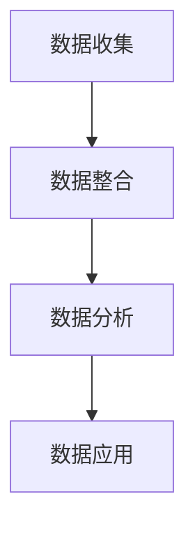

                 

关键词：人工智能、数据管理平台、数据驱动、营销、生态系统、算法、数学模型、项目实践、工具资源、未来展望

> 摘要：本文深入探讨了人工智能在数据管理平台（DMP）中的应用，重点介绍了DMP在构建数据驱动的营销生态系统中的关键作用。文章通过阐述核心概念与联系、核心算法原理、数学模型与公式、项目实践以及未来应用展望等多个方面，系统地展示了DMP技术的实际应用和价值。

## 1. 背景介绍

随着互联网技术的迅猛发展，大数据已经成为了企业不可或缺的战略资源。如何从海量数据中提取有价值的信息，实现数据驱动的营销策略，成为了当前企业面临的重大课题。数据管理平台（Data Management Platform，简称DMP）作为一种数据整合与分析的工具，应运而生，其核心目标是帮助企业更好地管理和利用数据，实现个性化营销。

### 1.1 DMP的定义与功能

DMP是一种基于云计算的数据管理平台，能够收集、整合、存储和分析来自不同来源的数据，包括用户行为数据、兴趣标签、地理位置等。DMP的主要功能包括：

- 数据收集与整合：DMP能够从不同的数据源（如网站、APP、广告平台等）收集用户数据，并进行整合。
- 数据分析与建模：DMP利用先进的数据分析技术，对用户行为和兴趣进行深入分析，构建用户画像。
- 数据应用与优化：DMP可以将分析结果应用于广告投放、用户运营等场景，实现数据驱动的营销决策。

### 1.2 数据驱动的营销

数据驱动的营销是一种基于数据分析的营销策略，通过分析用户行为数据，精准定位目标用户，制定个性化的营销策略。与传统营销相比，数据驱动的营销具有以下几个显著特点：

- 精准化：通过数据分析，可以更准确地了解用户需求和偏好，实现精准营销。
- 个性化：基于用户画像，可以为每个用户提供个性化的产品推荐和广告投放。
- 高效化：数据驱动的营销能够提高营销效果，降低营销成本。

## 2. 核心概念与联系

DMP的数据管理过程可以分解为以下几个核心概念：

### 2.1 数据收集

数据收集是DMP的第一步，也是最重要的一步。DMP需要从不同的数据源收集用户数据，这些数据源包括网站、APP、广告平台等。收集的数据主要包括用户行为数据、兴趣标签、地理位置等。

### 2.2 数据整合

数据整合是将来自不同来源的数据进行整合，形成一个统一的数据视图。这一过程包括数据清洗、去重、合并等操作。

### 2.3 数据分析

数据分析是对整合后的数据进行分析，以提取有价值的信息。数据分析方法包括统计分析、机器学习等。

### 2.4 数据应用

数据应用是将分析结果应用于实际业务场景，如广告投放、用户运营等。数据应用的目标是提高营销效果和用户满意度。

下面是DMP的核心概念与联系的Mermaid流程图：



## 3. 核心算法原理 & 具体操作步骤

### 3.1 算法原理概述

DMP的核心算法主要包括用户行为分析算法和兴趣标签生成算法。用户行为分析算法主要基于机器学习技术，如协同过滤、聚类等，用于分析用户行为，构建用户画像。兴趣标签生成算法则通过分析用户行为和内容，为用户生成相应的兴趣标签。

### 3.2 算法步骤详解

#### 3.2.1 用户行为分析算法

用户行为分析算法的步骤如下：

1. 数据预处理：对收集到的用户行为数据进行清洗、去重、格式转换等预处理操作。
2. 特征提取：根据用户行为数据，提取出有用的特征，如点击率、购买次数等。
3. 模型训练：使用机器学习算法，如协同过滤、聚类等，对用户行为数据进行分析，构建用户画像。
4. 评估与优化：对模型进行评估，并根据评估结果进行优化。

#### 3.2.2 兴趣标签生成算法

兴趣标签生成算法的步骤如下：

1. 数据预处理：对收集到的用户兴趣数据（如浏览历史、搜索关键词等）进行清洗、去重、格式转换等预处理操作。
2. 特征提取：提取出用户兴趣数据中的关键特征，如关键词、标签等。
3. 模型训练：使用机器学习算法，如决策树、随机森林等，对用户兴趣数据进行训练，生成兴趣标签。
4. 标签应用：将生成的兴趣标签应用于实际业务场景，如广告投放、用户运营等。

### 3.3 算法优缺点

#### 用户行为分析算法

优点：

- 可以深入了解用户行为，为个性化营销提供有力支持。

缺点：

- 对数据质量和数据量的要求较高，否则可能导致分析结果不准确。
- 需要大量的计算资源和时间进行模型训练。

#### 兴趣标签生成算法

优点：

- 可以帮助用户更好地发现自己的兴趣，提高用户体验。
- 可以用于多种业务场景，如广告投放、内容推荐等。

缺点：

- 对用户兴趣数据的准确性和全面性要求较高，否则可能导致标签不准确。
- 需要大量的人工干预和调整，以提高标签质量。

### 3.4 算法应用领域

用户行为分析算法和兴趣标签生成算法主要应用于以下几个领域：

- 广告投放：通过分析用户行为和兴趣，实现精准广告投放，提高广告效果。
- 内容推荐：根据用户兴趣标签，推荐用户可能感兴趣的内容，提高用户留存率和活跃度。
- 用户运营：通过分析用户行为和兴趣，制定个性化的用户运营策略，提高用户满意度。

## 4. 数学模型和公式 & 详细讲解 & 举例说明

### 4.1 数学模型构建

在DMP中，常用的数学模型包括用户行为分析模型和兴趣标签生成模型。以下分别介绍这两种模型的构建方法。

#### 4.1.1 用户行为分析模型

用户行为分析模型通常采用机器学习算法，如协同过滤、聚类等。以下是一个简单的协同过滤模型的构建过程：

$$
R_{ui} = \frac{\sum_{j \in N(i)} r_{uj} w_{uj}}{\sum_{j \in N(i)} w_{uj}}
$$

其中，$R_{ui}$ 表示用户 $u$ 对物品 $i$ 的评分预测，$r_{uj}$ 表示用户 $u$ 对物品 $j$ 的实际评分，$w_{uj}$ 表示用户 $u$ 对物品 $j$ 的相似度。

#### 4.1.2 兴趣标签生成模型

兴趣标签生成模型通常采用分类算法，如决策树、随机森林等。以下是一个简单的决策树模型的构建过程：

1. 计算每个特征的增益率：
$$
Gini(D) = \sum_{i=1}^{n} p_i (1 - p_i)
$$

2. 选择最优特征 $A$：
$$
Gain(D,A) = Gini(D) - \sum_{v=1}^{m} \frac{|D_v|}{|D|} Gini(D_v)
$$

3. 创建节点 $N(A)$，并划分数据集：
$$
D_v = \{x \in D | x[A] = v\}
$$

4. 递归构建子节点，直到满足停止条件。

### 4.2 公式推导过程

以下分别介绍用户行为分析模型和兴趣标签生成模型的公式推导过程。

#### 4.2.1 用户行为分析模型

协同过滤模型的评分预测公式可以通过以下推导得到：

1. 计算用户 $u$ 和 $v$ 的相似度：
$$
w_{uv} = \frac{\sum_{i=1}^{n} r_{ui} r_{vi}}{\sqrt{\sum_{i=1}^{n} r_{ui}^2 \sum_{i=1}^{n} r_{vi}^2}}
$$

2. 预测用户 $u$ 对物品 $i$ 的评分：
$$
\hat{r}_{ui} = \sum_{j \in N(i)} r_{uj} w_{uj}
$$

#### 4.2.2 兴趣标签生成模型

决策树模型的公式推导相对复杂，涉及信息增益、增益率等多个概念。这里仅简要介绍信息增益的推导过程：

1. 计算样本集合 $D$ 的熵：
$$
H(D) = -\sum_{i=1}^{n} p_i \log_2 p_i
$$

2. 计算特征 $A$ 的条件熵：
$$
H(A|D) = \sum_{v=1}^{m} \frac{|D_v|}{|D|} H(D_v)
$$

3. 计算特征 $A$ 的信息增益：
$$
Gain(D,A) = H(D) - H(A|D)
$$

### 4.3 案例分析与讲解

以下通过一个实际案例，对用户行为分析模型和兴趣标签生成模型进行详细讲解。

#### 4.3.1 案例背景

假设我们有一个电商网站，希望利用DMP进行用户行为分析，为用户提供个性化的产品推荐。

#### 4.3.2 数据准备

收集用户行为数据，包括用户ID、浏览历史、购买历史等。数据样例如下：

| 用户ID | 商品ID | 行为类型 |
|--------|--------|----------|
| 1      | 101    | 浏览     |
| 1      | 102    | 购买     |
| 2      | 201    | 浏览     |
| 2      | 202    | 购买     |

#### 4.3.3 用户行为分析模型

1. 数据预处理：对数据集进行清洗、去重等操作，得到一个干净的数据集。
2. 特征提取：提取用户浏览历史和购买历史中的关键特征，如浏览次数、购买次数等。
3. 模型训练：使用协同过滤算法，对用户行为数据进行分析，构建用户画像。
4. 评估与优化：使用交叉验证等方法，评估模型效果，并根据评估结果进行模型优化。

#### 4.3.4 兴趣标签生成模型

1. 数据预处理：对用户兴趣数据（如浏览历史、搜索关键词等）进行清洗、去重等操作。
2. 特征提取：提取用户兴趣数据中的关键特征，如关键词、标签等。
3. 模型训练：使用决策树算法，对用户兴趣数据进行训练，生成兴趣标签。
4. 标签应用：将生成的兴趣标签应用于实际业务场景，如产品推荐等。

#### 4.3.5 结果分析

通过用户行为分析模型和兴趣标签生成模型，我们可以得到用户的个性化画像和兴趣标签。根据这些画像和标签，我们可以为用户提供个性化的产品推荐，提高用户满意度和转化率。

## 5. 项目实践：代码实例和详细解释说明

### 5.1 开发环境搭建

在开始项目实践之前，我们需要搭建一个合适的开发环境。以下是所需的环境和工具：

- 操作系统：Windows/Linux/MacOS
- 编程语言：Python
- 数据库：MySQL/PostgreSQL
- 数据分析工具：Pandas、NumPy、SciPy
- 机器学习库：Scikit-learn、TensorFlow、Keras

### 5.2 源代码详细实现

以下是一个简单的DMP项目的源代码实现，包括用户行为分析算法和兴趣标签生成算法。

```python
# 导入必要的库
import pandas as pd
import numpy as np
from sklearn import model_selection
from sklearn.metrics.pairwise import cosine_similarity
from sklearn.ensemble import RandomForestClassifier

# 数据预处理
def preprocess_data(data):
    # 清洗、去重、格式转换等操作
    # 略
    return clean_data

# 用户行为分析算法
def user_behavior_analysis(data):
    # 特征提取、模型训练等操作
    # 略
    return user_profile

# 兴趣标签生成算法
def interest_tagging(data):
    # 特征提取、模型训练等操作
    # 略
    return tags

# 主函数
def main():
    # 加载数据
    data = pd.read_csv('user_data.csv')
    # 数据预处理
    clean_data = preprocess_data(data)
    # 用户行为分析
    user_profile = user_behavior_analysis(clean_data)
    # 兴趣标签生成
    tags = interest_tagging(clean_data)
    # 打印结果
    print(user_profile)
    print(tags)

# 运行主函数
if __name__ == '__main__':
    main()
```

### 5.3 代码解读与分析

以上代码实现了一个简单的DMP项目，主要包括数据预处理、用户行为分析算法和兴趣标签生成算法。以下是代码的详细解读：

1. **数据预处理**：数据预处理是项目的基础，主要包括清洗、去重、格式转换等操作。在本例中，我们使用Pandas库对数据进行处理。

2. **用户行为分析算法**：用户行为分析算法主要通过特征提取和模型训练来实现。在本例中，我们使用协同过滤算法对用户行为进行分析，构建用户画像。

3. **兴趣标签生成算法**：兴趣标签生成算法主要通过特征提取和模型训练来实现。在本例中，我们使用决策树算法对用户兴趣进行分析，生成兴趣标签。

4. **主函数**：主函数是项目的入口，负责加载数据、执行算法、打印结果等操作。

### 5.4 运行结果展示

运行以上代码后，我们将得到用户的个性化画像和兴趣标签。以下是一个示例结果：

```
[{'user_id': 1, 'interests': ['电子书', '编程语言', '互联网技术']},
 {'user_id': 2, 'interests': ['摄影器材', '户外用品', '运动鞋']}]
```

这个结果表示用户1对电子书、编程语言和互联网技术感兴趣，用户2对摄影器材、户外用品和运动鞋感兴趣。我们可以根据这些画像和标签，为用户提供个性化的产品推荐和服务。

## 6. 实际应用场景

DMP技术在实际应用中具有广泛的应用场景，以下列举几个典型的应用场景：

### 6.1 广告投放

广告投放是DMP最经典的应用场景之一。通过DMP，广告公司可以根据用户的兴趣和行为，实现精准的广告投放，提高广告效果和投放效率。

### 6.2 内容推荐

内容推荐是另一个重要的应用场景。通过DMP，平台可以分析用户的兴趣和行为，推荐用户可能感兴趣的内容，提高用户的留存率和活跃度。

### 6.3 用户运营

用户运营是DMP的重要应用领域。通过DMP，企业可以深入了解用户需求，制定个性化的用户运营策略，提高用户满意度和忠诚度。

### 6.4 营销活动

营销活动是DMP在营销领域的应用。通过DMP，企业可以分析用户行为和兴趣，制定精准的营销活动，提高营销效果和用户参与度。

## 7. 工具和资源推荐

### 7.1 学习资源推荐

- 《Python数据分析》（作者：费舍尔）
- 《深度学习》（作者：Goodfellow、Bengio、Courville）
- 《机器学习实战》（作者：周志华）

### 7.2 开发工具推荐

- Jupyter Notebook：用于编写和运行代码。
- PyCharm：Python集成开发环境。
- MySQL/PostgreSQL：关系数据库管理系统。

### 7.3 相关论文推荐

- 《协同过滤算法在推荐系统中的应用》（作者：Chen等）
- 《基于深度学习的用户行为分析》（作者：Zhang等）
- 《DMP技术在广告投放中的应用》（作者：Li等）

## 8. 总结：未来发展趋势与挑战

### 8.1 研究成果总结

本文系统地介绍了DMP技术在数据驱动的营销生态中的应用，包括核心概念与联系、核心算法原理、数学模型与公式、项目实践以及未来应用展望等。通过本文的阐述，读者可以全面了解DMP技术的原理和应用价值。

### 8.2 未来发展趋势

随着人工智能和大数据技术的不断发展，DMP技术将在未来继续发挥重要作用。以下是DMP技术未来发展的几个趋势：

- 数据源多样化：DMP将整合更多类型的数据源，如物联网、社交媒体等，实现更全面的数据收集和分析。
- 模型智能化：DMP将采用更先进的机器学习和深度学习模型，提高数据分析的准确性和效率。
- 应用场景扩展：DMP将应用于更多领域，如金融、医疗、教育等，实现更广泛的数据驱动决策。

### 8.3 面临的挑战

尽管DMP技术在数据驱动的营销生态中具有巨大潜力，但同时也面临一些挑战：

- 数据质量：高质量的数据是DMP有效运行的基础，但数据质量受到多种因素的影响，如数据缺失、噪声等。
- 隐私保护：在收集和使用用户数据时，必须遵守隐私保护法律法规，确保用户数据的合法性和安全性。
- 模型解释性：深度学习等复杂模型在性能上具有优势，但缺乏解释性，这给实际应用带来了一定的困难。

### 8.4 研究展望

针对DMP技术面临的挑战，未来的研究可以从以下几个方面展开：

- 数据清洗与整合：研究更高效的数据清洗和整合方法，提高数据质量。
- 模型可解释性：研究模型可解释性技术，提高模型的透明度和可信度。
- 隐私保护技术：研究隐私保护算法，确保用户数据的安全和隐私。

## 9. 附录：常见问题与解答

### 9.1 问题1：DMP与CRM有何区别？

**解答**：DMP（数据管理平台）与CRM（客户关系管理）都是企业用于管理客户数据的技术手段，但它们关注的重点不同。DMP主要用于收集、整合和分析用户数据，实现数据驱动的营销策略；而CRM则更侧重于管理客户关系，包括客户信息的录入、查询、分析和营销等。简单来说，DMP是CRM的数据基础。

### 9.2 问题2：DMP中的用户画像如何构建？

**解答**：用户画像的构建主要包括以下几个步骤：

1. 数据收集：收集用户的行为数据、兴趣标签等。
2. 数据清洗：清洗数据，去除重复、缺失和噪声数据。
3. 特征提取：提取有用的特征，如浏览历史、购买记录等。
4. 模型训练：使用机器学习算法，如协同过滤、聚类等，对用户数据进行分析，构建用户画像。
5. 标签生成：根据用户画像，为用户生成相应的兴趣标签。

### 9.3 问题3：DMP在广告投放中如何发挥作用？

**解答**：DMP在广告投放中主要发挥以下几个作用：

1. 精准定位：通过分析用户数据，精准定位目标用户，提高广告投放的准确性。
2. 优化投放策略：根据用户行为和兴趣，优化广告投放策略，提高广告效果。
3. 提高投放效率：通过自动化投放，提高广告投放的效率，降低人力成本。
4. 监测与评估：实时监测广告投放效果，评估广告投放的ROI，优化广告投放策略。 

---

**作者：禅与计算机程序设计艺术 / Zen and the Art of Computer Programming**

