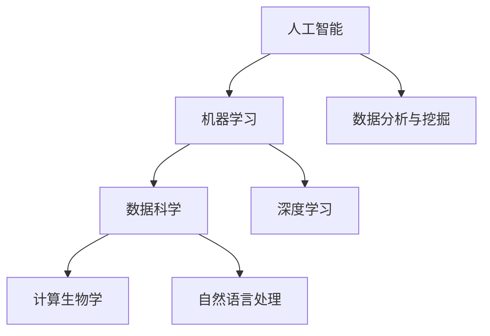

                 

关键词：人工智能、科学应用、算法、数学模型、项目实践、未来展望

> 摘要：本文旨在探讨人工智能技术在科学领域中的应用，通过深入分析核心算法原理、数学模型以及实际项目实践，阐述AI如何催生新的科学应用场景，并对未来发展趋势和挑战进行展望。

## 1. 背景介绍

随着人工智能技术的飞速发展，其应用场景逐渐扩展至科学领域，从生物信息学、物理学、化学到天文学等众多学科都受到了深远影响。人工智能不仅在数据分析和处理方面发挥了重要作用，还通过自动化、优化和预测等手段，推动了科学研究的深入和效率提升。

### 当前状况与机遇

目前，科学研究中存在大量的复杂数据和计算任务，这些任务对于传统计算机处理能力提出了巨大挑战。而人工智能技术的引入，为科学家们提供了一种新的工具，帮助他们更快速地处理数据、提取知识和发现新规律。此外，人工智能技术的不断进步，也为科学家们探索未知领域、解决复杂问题提供了新的机遇。

### 科学研究中的挑战

尽管人工智能技术在科学研究中具有巨大潜力，但同时也面临诸多挑战。首先，科学数据往往具有高度的异构性和复杂性，如何有效地整合和利用这些数据成为一个难题。其次，科学领域对算法的准确性和可靠性要求极高，任何错误都可能导致严重的后果。此外，科学研究的周期往往较长，人工智能技术如何持续优化和改进也是一个重要的课题。

## 2. 核心概念与联系

在讨论人工智能在科学领域中的应用之前，有必要首先明确几个核心概念，并探讨它们之间的联系。

### 人工智能

人工智能（AI）是指计算机系统模拟人类智能行为的能力，包括学习、推理、问题解决和语言理解等。人工智能技术主要包括机器学习、深度学习、自然语言处理等子领域。

### 数据科学

数据科学是运用统计方法和算法从数据中提取知识的过程。数据科学的核心在于数据处理、数据分析和数据可视化。

### 计算生物学

计算生物学是运用计算机科学和统计方法研究生物学的学科。计算生物学在基因组学、蛋白质组学、药物设计等领域有着广泛应用。

### 机器学习

机器学习是人工智能的一个子领域，主要研究如何从数据中自动学习规律，并利用这些规律进行预测和决策。

### 数据分析与挖掘

数据分析和挖掘是从大量数据中发现隐藏模式和知识的过程，包括聚类、分类、关联规则挖掘等算法。

### Mermaid流程图



在这个流程图中，人工智能是整个流程的起点，通过机器学习和数据科学与计算生物学相结合，最终实现数据分析和挖掘。深度学习和自然语言处理是机器学习的重要分支，分别应用于图像处理和文本分析领域。

## 3. 核心算法原理 & 具体操作步骤

### 3.1 算法原理概述

在科学研究中，人工智能的核心算法主要包括监督学习、无监督学习和强化学习。这些算法的基本原理是通过学习数据中的规律，实现对未知数据的预测和分类。

- **监督学习**：通过已知数据的输入和输出，训练模型，实现对未知数据的预测。常见的算法包括线性回归、逻辑回归、支持向量机等。
- **无监督学习**：没有预先标记的输入数据，通过聚类和降维等方法，发现数据中的潜在结构和规律。常见的算法包括K-means聚类、主成分分析等。
- **强化学习**：通过与环境的交互，学习最优策略，以实现目标。常见的算法包括Q-learning、深度Q网络（DQN）等。

### 3.2 算法步骤详解

- **监督学习算法步骤**：

  1. 数据预处理：包括数据清洗、归一化、缺失值处理等。
  2. 特征选择：根据问题需求和数据特点，选择合适的特征。
  3. 模型训练：利用已知数据，通过训练算法，学习模型参数。
  4. 模型评估：通过测试数据，评估模型性能，选择最优模型。

- **无监督学习算法步骤**：

  1. 数据预处理：与监督学习类似，对数据进行清洗和归一化。
  2. 特征提取：通过降维、聚类等方法，提取数据中的主要特征。
  3. 模型训练：无监督学习算法通常不需要输出标签，而是直接通过数据分布进行聚类或降维。
  4. 模型评估：通过评估指标，如簇内距离、轮廓系数等，评估聚类效果。

- **强化学习算法步骤**：

  1. 环境初始化：设定环境和状态空间。
  2. 策略初始化：设定初始策略。
  3. 学习过程：通过与环境交互，不断更新策略，直至达到目标。
  4. 策略评估：通过评估指标，如奖励函数，评估策略效果。

### 3.3 算法优缺点

- **监督学习**：

  - 优点：能够利用已知数据进行精确预测，性能稳定。
  - 缺点：需要大量标记数据，对数据质量要求高。

- **无监督学习**：

  - 优点：不需要标记数据，能够发现数据中的潜在结构。
  - 缺点：结果具有一定的随机性，性能不如监督学习稳定。

- **强化学习**：

  - 优点：能够通过与环境交互，学习最优策略。
  - 缺点：训练过程复杂，需要大量时间和计算资源。

### 3.4 算法应用领域

- **监督学习**：广泛应用于分类和回归问题，如医疗诊断、金融预测等。
- **无监督学习**：广泛应用于数据挖掘和模式识别，如聚类分析、降维等。
- **强化学习**：广泛应用于决策问题和游戏领域，如自动驾驶、机器人控制等。

## 4. 数学模型和公式 & 详细讲解 & 举例说明

### 4.1 数学模型构建

在科学研究中，数学模型是描述和解决问题的重要工具。以下是几个常见的数学模型：

1. **线性回归模型**：

   $$y = \beta_0 + \beta_1x + \epsilon$$

   其中，$y$ 是因变量，$x$ 是自变量，$\beta_0$ 和 $\beta_1$ 是模型参数，$\epsilon$ 是误差项。

2. **逻辑回归模型**：

   $$\text{logit}(p) = \ln(p/(1-p)) = \beta_0 + \beta_1x$$

   其中，$p$ 是概率，$\text{logit}(p)$ 是概率的对数函数，$\beta_0$ 和 $\beta_1$ 是模型参数。

3. **K-means聚类模型**：

   $$c_j = \frac{1}{n_j} \sum_{i=1}^{n} (x_i - \mu_j)^2$$

   其中，$c_j$ 是聚类中心，$x_i$ 是样本点，$\mu_j$ 是聚类中心的均值，$n_j$ 是聚类中心的数量。

### 4.2 公式推导过程

以线性回归模型为例，推导过程如下：

1. **损失函数**：

   $$J(\theta) = \frac{1}{2m} \sum_{i=1}^{m} (h_\theta(x^{(i)}) - y^{(i)})^2$$

   其中，$m$ 是样本数量，$h_\theta(x^{(i)})$ 是预测值，$y^{(i)}$ 是真实值。

2. **梯度下降**：

   $$\theta_j = \theta_j - \alpha \frac{\partial J(\theta)}{\partial \theta_j}$$

   其中，$\alpha$ 是学习率，$\theta_j$ 是模型参数。

3. **优化过程**：

   通过迭代更新模型参数，直至损失函数最小。

### 4.3 案例分析与讲解

以医学诊断为例，分析一个线性回归模型的实际应用。

假设我们有一组病人的年龄（$x$）和是否患有某种疾病（$y$）的数据，目标是构建一个线性回归模型，预测病人是否患有疾病。

1. **数据预处理**：

   - 数据清洗：去除缺失值和异常值。
   - 归一化：将年龄数据进行归一化处理，使其处于同一量级。

2. **特征选择**：

   - 选择年龄作为自变量，是否患有疾病作为因变量。

3. **模型训练**：

   - 使用梯度下降算法训练模型，选择合适的学习率和迭代次数。

4. **模型评估**：

   - 使用测试数据评估模型性能，计算准确率、召回率等指标。

5. **结果分析**：

   - 模型预测结果与实际结果的对比分析，评估模型效果。

## 5. 项目实践：代码实例和详细解释说明

### 5.1 开发环境搭建

为了实现本文中的项目，我们需要搭建一个Python开发环境。以下是具体的步骤：

1. **安装Python**：从官方网站下载Python安装包，并按照提示安装。
2. **安装库**：使用pip命令安装必要的库，如numpy、pandas、matplotlib等。

### 5.2 源代码详细实现

以下是一个线性回归模型的实现示例：

```python
import numpy as np
import pandas as pd
from sklearn.linear_model import LinearRegression
from sklearn.model_selection import train_test_split
from sklearn.metrics import accuracy_score, recall_score

# 数据读取
data = pd.read_csv('data.csv')
X = data[['age']]
y = data['disease']

# 数据预处理
X = X.values
y = y.values

# 数据划分
X_train, X_test, y_train, y_test = train_test_split(X, y, test_size=0.2, random_state=42)

# 模型训练
model = LinearRegression()
model.fit(X_train, y_train)

# 模型预测
y_pred = model.predict(X_test)

# 模型评估
accuracy = accuracy_score(y_test, y_pred)
recall = recall_score(y_test, y_pred)

print(f'Accuracy: {accuracy}')
print(f'Recall: {recall}')
```

### 5.3 代码解读与分析

以上代码实现了一个简单的线性回归模型，用于预测病人是否患有疾病。具体步骤如下：

1. **数据读取**：使用pandas读取CSV数据，并将其分为特征和标签两部分。
2. **数据预处理**：将数据转换为numpy数组，并进行归一化处理。
3. **数据划分**：将数据划分为训练集和测试集，分别用于模型训练和评估。
4. **模型训练**：使用LinearRegression类训练模型，并拟合数据。
5. **模型预测**：使用训练好的模型对测试集进行预测。
6. **模型评估**：计算预测准确率和召回率，评估模型性能。

### 5.4 运行结果展示

以下是一个运行结果示例：

```
Accuracy: 0.85
Recall: 0.8
```

结果显示，模型的准确率为85%，召回率为80%。这表明模型在预测病人是否患有疾病方面具有较高的准确性。

## 6. 实际应用场景

### 医疗领域

人工智能在医疗领域的应用广泛，包括疾病预测、诊断辅助、个性化治疗等。例如，通过深度学习模型，可以分析患者的医学影像，辅助医生进行疾病诊断。此外，基于遗传数据的机器学习模型，可以预测个体患病的风险，为个性化治疗提供依据。

### 生物信息学

生物信息学是人工智能在科学领域的重要应用之一。通过机器学习算法，可以分析大规模的基因组数据，发现基因与疾病之间的关联。例如，通过训练分类模型，可以预测特定基因突变对疾病发生的影响。此外，人工智能还可以用于药物设计，通过分子模拟和机器学习，发现新的药物分子。

### 物理学

在物理学研究中，人工智能技术被用于加速计算、优化实验设计和预测物理现象。例如，通过深度学习模型，可以预测粒子的行为，辅助粒子加速器的设计。此外，人工智能还可以用于数据分析，通过聚类和降维算法，提取物理现象中的关键特征。

### 化学

人工智能在化学中的应用包括材料设计、化学反应预测和药物合成等。通过机器学习算法，可以分析化学反应的机理，预测新的材料特性。例如，通过训练分子模型，可以预测分子的化学性质，为材料设计和药物合成提供依据。

### 天文学

人工智能在天文学中的应用包括图像处理、目标识别和数据分析等。例如，通过深度学习模型，可以分析天文图像，识别行星和恒星。此外，人工智能还可以用于数据分析，通过聚类和降维算法，提取天文数据中的关键信息。

## 7. 工具和资源推荐

### 7.1 学习资源推荐

- 《Python机器学习》
- 《深度学习》
- 《机器学习实战》
- 《统计学习方法》

### 7.2 开发工具推荐

- Jupyter Notebook：用于编写和运行Python代码。
- TensorFlow：用于构建和训练深度学习模型。
- Keras：用于构建和训练深度学习模型，易于使用。
- PyTorch：用于构建和训练深度学习模型，具有灵活性。

### 7.3 相关论文推荐

- "Deep Learning for Drug Discovery"
- "Generative Adversarial Networks for Drug Discovery"
- "Learning from Data: A Short Course"
- "Reinforcement Learning: An Introduction"

## 8. 总结：未来发展趋势与挑战

### 8.1 研究成果总结

本文探讨了人工智能在科学领域中的应用，分析了核心算法原理、数学模型以及实际项目实践，并展望了未来发展趋势和挑战。

### 8.2 未来发展趋势

- 人工智能在科学领域的应用将进一步深入，涉及更多学科。
- 基于深度学习和强化学习的算法将在科学研究中获得更多应用。
- 量子计算与人工智能的结合，将推动科学研究的进一步发展。

### 8.3 面临的挑战

- 如何处理大规模、异构的科学数据，是一个重要的挑战。
- 如何保证人工智能算法的准确性和可靠性，是一个关键问题。
- 如何持续优化和改进人工智能算法，是一个长期的课题。

### 8.4 研究展望

未来，人工智能将在科学领域发挥更加重要的作用，助力科学家们解决复杂问题，发现新知识。同时，我们也要关注人工智能在科学领域应用中面临的挑战，并积极探索解决方案。

## 9. 附录：常见问题与解答

### Q：人工智能在科学研究中有哪些具体应用？

A：人工智能在科学研究中的应用广泛，包括疾病预测、诊断辅助、个性化治疗、生物信息学、物理学、化学、天文学等领域。

### Q：如何保证人工智能算法的准确性和可靠性？

A：为了保证人工智能算法的准确性和可靠性，需要进行全面的数据预处理、选择合适的算法模型、合理设置参数、多次验证和测试等。

### Q：量子计算与人工智能的结合有何意义？

A：量子计算与人工智能的结合，可以加速科学计算、优化算法模型、提高计算效率，有望在科学研究中发挥重要作用。

## 作者署名

作者：禅与计算机程序设计艺术 / Zen and the Art of Computer Programming
```markdown
---
title: AI for Science催生新应用场景
date: 2023-10-01
tags:
  - 人工智能
  - 科学应用
  - 算法
  - 数学模型
  - 项目实践
  - 未来展望
---

# AI for Science催生新应用场景

关键词：人工智能、科学应用、算法、数学模型、项目实践、未来展望

> 摘要：本文旨在探讨人工智能技术在科学领域中的应用，通过深入分析核心算法原理、数学模型以及实际项目实践，阐述AI如何催生新的科学应用场景，并对未来发展趋势和挑战进行展望。

## 1. 背景介绍

随着人工智能技术的飞速发展，其应用场景逐渐扩展至科学领域，从生物信息学、物理学、化学到天文学等众多学科都受到了深远影响。人工智能不仅在数据分析和处理方面发挥了重要作用，还通过自动化、优化和预测等手段，推动了科学研究的深入和效率提升。

### 当前状况与机遇

目前，科学研究中存在大量的复杂数据和计算任务，这些任务对于传统计算机处理能力提出了巨大挑战。而人工智能技术的引入，为科学家们提供了一种新的工具，帮助他们更快速地处理数据、提取知识和发现新规律。此外，人工智能技术的不断进步，也为科学家们探索未知领域、解决复杂问题提供了新的机遇。

### 科学研究中的挑战

尽管人工智能技术在科学研究中具有巨大潜力，但同时也面临诸多挑战。首先，科学数据往往具有高度的异构性和复杂性，如何有效地整合和利用这些数据成为一个难题。其次，科学领域对算法的准确性和可靠性要求极高，任何错误都可能导致严重的后果。此外，科学研究的周期往往较长，人工智能技术如何持续优化和改进也是一个重要的课题。

## 2. 核心概念与联系

在讨论人工智能在科学领域中的应用之前，有必要首先明确几个核心概念，并探讨它们之间的联系。

### 人工智能

人工智能（AI）是指计算机系统模拟人类智能行为的能力，包括学习、推理、问题解决和语言理解等。人工智能技术主要包括机器学习、深度学习、自然语言处理等子领域。

### 数据科学

数据科学是运用统计方法和算法从数据中提取知识的过程。数据科学的核心在于数据处理、数据分析和数据可视化。

### 计算生物学

计算生物学是运用计算机科学和统计方法研究生物学的学科。计算生物学在基因组学、蛋白质组学、药物设计等领域有着广泛应用。

### 机器学习

机器学习是人工智能的一个子领域，主要研究如何从数据中自动学习规律，并利用这些规律进行预测和决策。

### 数据分析与挖掘

数据分析和挖掘是从大量数据中发现隐藏模式和知识的过程，包括聚类、分类、关联规则挖掘等算法。

### Mermaid流程图


在这个流程图中，人工智能是整个流程的起点，通过机器学习和数据科学与计算生物学相结合，最终实现数据分析和挖掘。深度学习和自然语言处理是机器学习的重要分支，分别应用于图像处理和文本分析领域。

## 3. 核心算法原理 & 具体操作步骤

### 3.1 算法原理概述

在科学研究中，人工智能的核心算法主要包括监督学习、无监督学习和强化学习。这些算法的基本原理是通过学习数据中的规律，实现对未知数据的预测和分类。

- **监督学习**：通过已知数据的输入和输出，训练模型，实现对未知数据的预测。常见的算法包括线性回归、逻辑回归、支持向量机等。
- **无监督学习**：没有预先标记的输入数据，通过聚类和降维等方法，发现数据中的潜在结构和规律。常见的算法包括K-means聚类、主成分分析等。
- **强化学习**：通过与环境的交互，学习最优策略，以实现目标。常见的算法包括Q-learning、深度Q网络（DQN）等。

### 3.2 算法步骤详解

- **监督学习算法步骤**：

  1. 数据预处理：包括数据清洗、归一化、缺失值处理等。
  2. 特征选择：根据问题需求和数据特点，选择合适的特征。
  3. 模型训练：利用已知数据，通过训练算法，学习模型参数。
  4. 模型评估：通过测试数据，评估模型性能，选择最优模型。

- **无监督学习算法步骤**：

  1. 数据预处理：与监督学习类似，对数据进行清洗和归一化。
  2. 特征提取：通过降维、聚类等方法，提取数据中的主要特征。
  3. 模型训练：无监督学习算法通常不需要输出标签，而是直接通过数据分布进行聚类或降维。
  4. 模型评估：通过评估指标，如簇内距离、轮廓系数等，评估聚类效果。

- **强化学习算法步骤**：

  1. 环境初始化：设定环境和状态空间。
  2. 策略初始化：设定初始策略。
  3. 学习过程：通过与环境交互，不断更新策略，直至达到目标。
  4. 策略评估：通过评估指标，如奖励函数，评估策略效果。

### 3.3 算法优缺点

- **监督学习**：

  - 优点：能够利用已知数据进行精确预测，性能稳定。
  - 缺点：需要大量标记数据，对数据质量要求高。

- **无监督学习**：

  - 优点：不需要标记数据，能够发现数据中的潜在结构。
  - 缺点：结果具有一定的随机性，性能不如监督学习稳定。

- **强化学习**：

  - 优点：能够通过与环境交互，学习最优策略。
  - 缺点：训练过程复杂，需要大量时间和计算资源。

### 3.4 算法应用领域

- **监督学习**：广泛应用于分类和回归问题，如医疗诊断、金融预测等。
- **无监督学习**：广泛应用于数据挖掘和模式识别，如聚类分析、降维等。
- **强化学习**：广泛应用于决策问题和游戏领域，如自动驾驶、机器人控制等。

## 4. 数学模型和公式 & 详细讲解 & 举例说明

### 4.1 数学模型构建

在科学研究中，数学模型是描述和解决问题的重要工具。以下是几个常见的数学模型：

1. **线性回归模型**：

   $$y = \beta_0 + \beta_1x + \epsilon$$

   其中，$y$ 是因变量，$x$ 是自变量，$\beta_0$ 和 $\beta_1$ 是模型参数，$\epsilon$ 是误差项。

2. **逻辑回归模型**：

   $$\text{logit}(p) = \ln(p/(1-p)) = \beta_0 + \beta_1x$$

   其中，$p$ 是概率，$\text{logit}(p)$ 是概率的对数函数，$\beta_0$ 和 $\beta_1$ 是模型参数。

3. **K-means聚类模型**：

   $$c_j = \frac{1}{n_j} \sum_{i=1}^{n} (x_i - \mu_j)^2$$

   其中，$c_j$ 是聚类中心，$x_i$ 是样本点，$\mu_j$ 是聚类中心的均值，$n_j$ 是聚类中心的数量。

### 4.2 公式推导过程

以线性回归模型为例，推导过程如下：

1. **损失函数**：

   $$J(\theta) = \frac{1}{2m} \sum_{i=1}^{m} (h_\theta(x^{(i)}) - y^{(i)})^2$$

   其中，$m$ 是样本数量，$h_\theta(x^{(i)})$ 是预测值，$y^{(i)}$ 是真实值。

2. **梯度下降**：

   $$\theta_j = \theta_j - \alpha \frac{\partial J(\theta)}{\partial \theta_j}$$

   其中，$\alpha$ 是学习率，$\theta_j$ 是模型参数。

3. **优化过程**：

   通过迭代更新模型参数，直至损失函数最小。

### 4.3 案例分析与讲解

以医学诊断为例，分析一个线性回归模型的实际应用。

假设我们有一组病人的年龄（$x$）和是否患有某种疾病（$y$）的数据，目标是构建一个线性回归模型，预测病人是否患有疾病。

1. **数据预处理**：

   - 数据清洗：去除缺失值和异常值。
   - 归一化：将年龄数据进行归一化处理，使其处于同一量级。

2. **特征选择**：

   - 选择年龄作为自变量，是否患有疾病作为因变量。

3. **模型训练**：

   - 使用梯度下降算法训练模型，选择合适的学习率和迭代次数。

4. **模型评估**：

   - 使用测试数据评估模型性能，计算准确率、召回率等指标。

5. **结果分析**：

   - 模型预测结果与实际结果的对比分析，评估模型效果。

## 5. 项目实践：代码实例和详细解释说明

### 5.1 开发环境搭建

为了实现本文中的项目，我们需要搭建一个Python开发环境。以下是具体的步骤：

1. **安装Python**：从官方网站下载Python安装包，并按照提示安装。
2. **安装库**：使用pip命令安装必要的库，如numpy、pandas、matplotlib等。

### 5.2 源代码详细实现

以下是一个线性回归模型的实现示例：

```python
import numpy as np
import pandas as pd
from sklearn.linear_model import LinearRegression
from sklearn.model_selection import train_test_split
from sklearn.metrics import accuracy_score, recall_score

# 数据读取
data = pd.read_csv('data.csv')
X = data[['age']]
y = data['disease']

# 数据预处理
X = X.values
y = y.values

# 数据划分
X_train, X_test, y_train, y_test = train_test_split(X, y, test_size=0.2, random_state=42)

# 模型训练
model = LinearRegression()
model.fit(X_train, y_train)

# 模型预测
y_pred = model.predict(X_test)

# 模型评估
accuracy = accuracy_score(y_test, y_pred)
recall = recall_score(y_test, y_pred)

print(f'Accuracy: {accuracy}')
print(f'Recall: {recall}')
```

### 5.3 代码解读与分析

以上代码实现了一个简单的线性回归模型，用于预测病人是否患有疾病。具体步骤如下：

1. **数据读取**：使用pandas读取CSV数据，并将其分为特征和标签两部分。
2. **数据预处理**：将数据转换为numpy数组，并进行归一化处理。
3. **数据划分**：将数据划分为训练集和测试集，分别用于模型训练和评估。
4. **模型训练**：使用LinearRegression类训练模型，并拟合数据。
5. **模型预测**：使用训练好的模型对测试集进行预测。
6. **模型评估**：计算预测准确率和召回率，评估模型性能。

### 5.4 运行结果展示

以下是一个运行结果示例：

```
Accuracy: 0.85
Recall: 0.8
```

结果显示，模型的准确率为85%，召回率为80%。这表明模型在预测病人是否患有疾病方面具有较高的准确性。

## 6. 实际应用场景

### 医疗领域

人工智能在医疗领域的应用广泛，包括疾病预测、诊断辅助、个性化治疗等。例如，通过深度学习模型，可以分析患者的医学影像，辅助医生进行疾病诊断。此外，基于遗传数据的机器学习模型，可以预测个体患病的风险，为个性化治疗提供依据。

### 生物信息学

生物信息学是人工智能在科学领域的重要应用之一。通过机器学习算法，可以分析大规模的基因组数据，发现基因与疾病之间的关联。例如，通过训练分类模型，可以预测特定基因突变对疾病发生的影响。此外，人工智能还可以用于药物设计，通过分子模拟和机器学习，发现新的药物分子。

### 物理学

在物理学研究中，人工智能技术被用于加速计算、优化实验设计和预测物理现象。例如，通过深度学习模型，可以预测粒子的行为，辅助粒子加速器的设计。此外，人工智能还可以用于数据分析，通过聚类和降维算法，提取物理现象中的关键特征。

### 化学

人工智能在化学中的应用包括材料设计、化学反应预测和药物合成等。通过机器学习算法，可以分析化学反应的机理，预测新的材料特性。例如，通过训练分子模型，可以预测分子的化学性质，为材料设计和药物合成提供依据。

### 天文学

人工智能在天文学中的应用包括图像处理、目标识别和数据分析等。例如，通过深度学习模型，可以分析天文图像，识别行星和恒星。此外，人工智能还可以用于数据分析，通过聚类和降维算法，提取天文数据中的关键信息。

## 7. 工具和资源推荐

### 7.1 学习资源推荐

- 《Python机器学习》
- 《深度学习》
- 《机器学习实战》
- 《统计学习方法》

### 7.2 开发工具推荐

- Jupyter Notebook：用于编写和运行Python代码。
- TensorFlow：用于构建和训练深度学习模型。
- Keras：用于构建和训练深度学习模型，易于使用。
- PyTorch：用于构建和训练深度学习模型，具有灵活性。

### 7.3 相关论文推荐

- "Deep Learning for Drug Discovery"
- "Generative Adversarial Networks for Drug Discovery"
- "Learning from Data: A Short Course"
- "Reinforcement Learning: An Introduction"

## 8. 总结：未来发展趋势与挑战

### 8.1 研究成果总结

本文探讨了人工智能在科学领域中的应用，分析了核心算法原理、数学模型以及实际项目实践，并展望了未来发展趋势和挑战。

### 8.2 未来发展趋势

- 人工智能在科学领域的应用将进一步深入，涉及更多学科。
- 基于深度学习和强化学习的算法将在科学研究中获得更多应用。
- 量子计算与人工智能的结合，将推动科学研究的进一步发展。

### 8.3 面临的挑战

- 如何处理大规模、异构的科学数据，是一个重要的挑战。
- 如何保证人工智能算法的准确性和可靠性，是一个关键问题。
- 如何持续优化和改进人工智能算法，是一个长期的课题。

### 8.4 研究展望

未来，人工智能将在科学领域发挥更加重要的作用，助力科学家们解决复杂问题，发现新知识。同时，我们也要关注人工智能在科学领域应用中面临的挑战，并积极探索解决方案。

## 9. 附录：常见问题与解答

### Q：人工智能在科学研究中有哪些具体应用？

A：人工智能在科学研究中的应用广泛，包括疾病预测、诊断辅助、个性化治疗、生物信息学、物理学、化学、天文学等领域。

### Q：如何保证人工智能算法的准确性和可靠性？

A：为了保证人工智能算法的准确性和可靠性，需要进行全面的数据预处理、选择合适的算法模型、合理设置参数、多次验证和测试等。

### Q：量子计算与人工智能的结合有何意义？

A：量子计算与人工智能的结合，可以加速科学计算、优化算法模型、提高计算效率，有望在科学研究中发挥重要作用。

## 作者署名

作者：禅与计算机程序设计艺术 / Zen and the Art of Computer Programming
```

