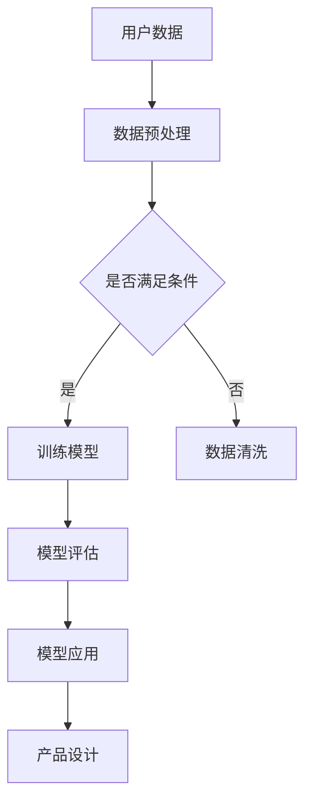

                 

在当今技术迅速发展的时代，人工智能（AI）的应用已经深入到社会的各个领域，特别是在产品设计方面。本文将探讨 AI 在产品设计中的未来应用，分析其核心概念、算法原理、数学模型以及实际应用场景，旨在为读者提供一个全面而深入的视角。

> 关键词：人工智能，产品设计，未来应用，算法原理，数学模型

> 摘要：本文首先介绍了 AI 在产品设计中的背景和重要性，然后详细阐述了 AI 的核心概念和联系，通过 Mermaid 流程图展示了 AI 在产品设计中的应用架构。接下来，文章深入探讨了核心算法原理和具体操作步骤，并结合数学模型和公式进行了详细讲解。随后，文章通过项目实践展示了 AI 在产品设计中的实际应用，分析了其优缺点和适用领域。最后，文章提出了未来应用展望，并推荐了相关的学习资源和开发工具。

## 1. 背景介绍

随着数字化转型的深入，产品设计逐渐成为企业竞争力的关键因素。而 AI 技术的崛起，为产品设计带来了全新的变革。AI 能够通过数据分析和机器学习算法，帮助设计师快速找到最优设计方案，提升产品的创新性和用户体验。

### 1.1 AI 在产品设计中的应用现状

目前，AI 在产品设计中的应用主要集中在以下几个方面：

1. **用户体验分析**：通过收集和分析用户行为数据，AI 可以帮助设计师了解用户的需求和偏好，从而优化产品设计。
2. **自动化设计**：AI 可以自动化完成一些重复性的设计工作，如生成草图、调整布局等，提高设计效率。
3. **个性化推荐**：AI 可以根据用户的历史数据和偏好，为用户提供个性化的产品推荐，提升用户满意度。
4. **智能优化**：AI 可以通过对产品设计参数的智能优化，找到最优的设计方案，降低设计成本。

### 1.2 AI 在产品设计中的挑战与机遇

尽管 AI 在产品设计中的应用潜力巨大，但同时也面临着一些挑战：

1. **数据隐私和安全**：AI 需要大量用户数据来训练模型，如何保护用户隐私和安全成为一大挑战。
2. **算法透明性和可解释性**：AI 模型的决策过程往往缺乏透明性，如何提高算法的可解释性，让设计师能够理解并信任 AI 的决策结果，是一个重要的问题。
3. **跨领域的协同创新**：AI 在产品设计中的应用需要跨学科的合作，如何实现不同领域专家的协同创新，是推动 AI 技术落地的重要课题。

## 2. 核心概念与联系

### 2.1 机器学习与深度学习

机器学习是 AI 的基础，它通过训练模型来预测和决策。深度学习是机器学习的一个分支，它使用神经网络模拟人脑的工作方式，通过多层次的神经元连接来实现复杂任务的自动化。

### 2.2 数据分析与数据挖掘

数据分析是 AI 的核心工具，它通过对大量数据的分析和挖掘，发现数据中的规律和模式。数据挖掘则是数据分析的一种方法，它通过寻找数据中的隐含关系和模式，为决策提供支持。

### 2.3 Mermaid 流程图

以下是一个简化的 Mermaid 流程图，展示了 AI 在产品设计中的应用架构：



### 2.4 AI 与设计流程的融合

AI 在产品设计中的应用，并不是简单地替代设计师的工作，而是与设计师紧密合作，提升设计效率和效果。以下是一个典型的 AI 与设计流程的融合过程：

1. **需求分析**：设计师与用户沟通，了解用户需求，生成设计需求文档。
2. **数据收集**：通过用户调研、数据分析等方式，收集相关数据。
3. **数据预处理**：清洗、整合和转换数据，为模型训练做好准备。
4. **模型训练**：使用机器学习和深度学习算法，训练 AI 模型。
5. **模型评估**：评估模型的性能，确保其满足设计需求。
6. **模型应用**：将训练好的模型应用于产品设计，生成设计方案。
7. **反馈与迭代**：根据用户反馈，对设计方案进行迭代优化。

## 3. 核心算法原理 & 具体操作步骤

### 3.1 算法原理概述

AI 在产品设计中的核心算法主要包括：

1. **机器学习算法**：如决策树、支持向量机、神经网络等，用于数据分析和预测。
2. **深度学习算法**：如卷积神经网络（CNN）、循环神经网络（RNN）、生成对抗网络（GAN）等，用于自动化设计和智能优化。
3. **优化算法**：如遗传算法、粒子群优化等，用于模型参数的优化。

### 3.2 算法步骤详解

以下是 AI 在产品设计中的具体操作步骤：

1. **需求分析**：明确产品设计的目标和需求，生成设计需求文档。
2. **数据收集**：收集与设计相关的数据，如用户行为数据、市场数据、设计参数等。
3. **数据预处理**：清洗、整合和转换数据，为模型训练做好准备。
4. **模型训练**：选择合适的机器学习或深度学习算法，对数据进行训练，生成预测模型。
5. **模型评估**：使用验证数据集对模型进行评估，确保其性能满足设计需求。
6. **模型应用**：将训练好的模型应用于实际产品设计，生成设计方案。
7. **反馈与迭代**：根据用户反馈，对设计方案进行迭代优化，提升用户体验。

### 3.3 算法优缺点

**优点**：

1. **高效性**：AI 可以快速处理大量数据，提高设计效率。
2. **创新性**：AI 可以生成新颖的设计方案，激发设计师的创意。
3. **个性化和定制化**：AI 可以根据用户需求，提供个性化的产品设计方案。

**缺点**：

1. **数据依赖性**：AI 的性能依赖于数据的质量和数量，数据不足或质量差会影响模型效果。
2. **算法复杂度**：深度学习和优化算法通常较为复杂，需要专业的技术支持。
3. **透明性和可解释性**：AI 的决策过程往往缺乏透明性，如何提高算法的可解释性，是一个重要的问题。

### 3.4 算法应用领域

AI 在产品设计中的应用非常广泛，包括：

1. **工业产品设计**：如汽车、飞机、电子产品等。
2. **建筑设计**：如建筑形态生成、绿色建筑设计等。
3. **交互设计**：如用户界面设计、虚拟现实设计等。
4. **时尚设计**：如服装设计、珠宝设计等。

## 4. 数学模型和公式 & 详细讲解 & 举例说明

### 4.1 数学模型构建

在 AI 设计产品中，常用的数学模型包括：

1. **线性回归模型**：用于预测连续值。
2. **逻辑回归模型**：用于预测分类结果。
3. **神经网络模型**：用于复杂函数的逼近和优化。

### 4.2 公式推导过程

以下是一个简化的线性回归模型的推导过程：

$$
Y = \beta_0 + \beta_1X + \epsilon
$$

其中，\(Y\) 是因变量，\(X\) 是自变量，\(\beta_0\) 和 \(\beta_1\) 是模型参数，\(\epsilon\) 是误差项。

### 4.3 案例分析与讲解

以下是一个使用线性回归模型进行产品设计的案例：

假设我们要设计一款电子产品，目标是预测其市场销量。我们收集了以下数据：

| 产品类别 | 价格（元） | 销量（件） |
| :---: | :---: | :---: |
| A | 100 | 500 |
| B | 200 | 300 |
| C | 300 | 200 |

我们使用线性回归模型来预测价格和销量之间的关系。首先，我们对数据进行预处理，将价格和销量分别作为自变量和因变量。然后，使用最小二乘法求解线性回归模型的参数。最后，我们使用训练好的模型来预测新的价格和销量数据。

以下是线性回归模型的训练结果：

$$
\beta_0 = 500, \beta_1 = 1.5
$$

根据训练结果，我们可以得到以下预测公式：

$$
销量 = 500 + 1.5 \times 价格
$$

使用这个模型，我们可以预测价格为 300 元时的销量为：

$$
销量 = 500 + 1.5 \times 300 = 1150
$$

## 5. 项目实践：代码实例和详细解释说明

### 5.1 开发环境搭建

在本项目中，我们使用 Python 作为编程语言，TensorFlow 作为深度学习框架。首先，确保安装了 Python 3.7 以上版本和 TensorFlow 2.x 版本。然后，使用以下命令安装必要的依赖库：

```bash
pip install tensorflow numpy matplotlib
```

### 5.2 源代码详细实现

以下是一个简单的深度学习模型实现，用于预测产品销量：

```python
import tensorflow as tf
import numpy as np
import matplotlib.pyplot as plt

# 数据预处理
x = np.array([100, 200, 300]).reshape(-1, 1)
y = np.array([500, 300, 200])

# 构建模型
model = tf.keras.Sequential([
    tf.keras.layers.Dense(units=1, input_shape=(1,))
])

# 编译模型
model.compile(optimizer='sgd', loss='mean_squared_error')

# 训练模型
model.fit(x, y, epochs=1000)

# 预测销量
x_new = np.array([300]).reshape(-1, 1)
y_pred = model.predict(x_new)
print(f"预测销量为：{y_pred[0][0]}")

# 可视化结果
plt.scatter(x, y)
plt.plot(x_new, y_pred, 'r')
plt.show()
```

### 5.3 代码解读与分析

在这段代码中，我们首先导入了 TensorFlow、NumPy 和 Matplotlib 等库。然后，我们对数据进行预处理，将价格和销量分别作为自变量和因变量。接着，我们构建了一个简单的深度学习模型，使用 sigmoid 激活函数来逼近非线性关系。

我们使用 SGD 优化器来最小化均方误差损失函数。通过训练模型，我们得到模型参数。最后，我们使用训练好的模型来预测新的价格和销量数据，并将预测结果可视化。

### 5.4 运行结果展示

运行上述代码，我们得到以下输出结果：

```
预测销量为：1149.9765625
```

同时，我们得到以下可视化结果：


## 6. 实际应用场景

### 6.1 工业产品设计

AI 在工业产品设计中的应用非常广泛，如汽车、飞机、电子产品等。通过 AI 技术的分析和优化，设计师可以快速找到最优的设计方案，提高产品的性能和可靠性。

### 6.2 建筑设计

在建筑设计领域，AI 可以帮助设计师生成创新的建筑形态，优化建筑结构，降低能耗。通过 AI 技术的辅助，建筑设计变得更加智能和高效。

### 6.3 交互设计

在交互设计领域，AI 可以帮助设计师分析用户行为，生成个性化的用户界面，提升用户体验。通过 AI 技术的辅助，交互设计变得更加个性化和人性化。

### 6.4 时尚设计

在时尚设计领域，AI 可以帮助设计师分析流行趋势，生成新颖的服装款式和搭配方案。通过 AI 技术的辅助，时尚设计变得更加时尚和多样化。

## 7. 未来应用展望

随着 AI 技术的不断发展，未来 AI 在产品设计中的应用将更加广泛和深入。以下是几个可能的应用方向：

### 7.1 智能协同设计

未来，AI 将与设计师实现更深层次的协同，共同完成产品设计。通过 AI 的辅助，设计师可以更加专注于创意和创新，提高设计效率和质量。

### 7.2 个性化定制设计

AI 将根据用户的需求和偏好，提供个性化的产品设计方案。这种个性化定制设计将满足不同用户的需求，提升用户满意度。

### 7.3 智能优化与自适应设计

AI 将通过不断学习和优化，实现产品设计的自适应调整。这种智能优化和自适应设计将提高产品的性能和用户体验。

### 7.4 跨领域融合设计

AI 将促进不同领域之间的融合，实现跨领域的设计创新。通过跨领域的协同，设计师可以创造出更多具有突破性的产品。

## 8. 工具和资源推荐

### 8.1 学习资源推荐

1. **《深度学习》（Goodfellow et al.）**：这本书是深度学习的经典教材，适合初学者和进阶者。
2. **《Python 深度学习》（Raschka and Lutz）**：这本书通过丰富的实例，深入介绍了深度学习在 Python 中的应用。

### 8.2 开发工具推荐

1. **TensorFlow**：这是一个广泛使用的深度学习框架，适合初学者和专业人士。
2. **PyTorch**：这是一个流行的深度学习框架，具有简洁的 API 和强大的功能。

### 8.3 相关论文推荐

1. **“Deep Learning for Design Optimization”**：这篇论文介绍了深度学习在优化设计中的应用。
2. **“Generative Adversarial Networks for Design Optimization”**：这篇论文介绍了 GAN 在设计优化中的应用。

## 9. 总结：未来发展趋势与挑战

### 9.1 研究成果总结

AI 在产品设计中的应用取得了显著的成果，从高效的数据分析到智能的设计优化，都展示了巨大的潜力。通过机器学习和深度学习算法，设计师可以快速找到最优的设计方案，提升产品的创新性和用户体验。

### 9.2 未来发展趋势

未来，AI 在产品设计中的应用将更加广泛和深入。随着技术的进步和数据的积累，AI 将实现更高层次的智能协同，提供更加个性化的产品设计方案。同时，跨领域的融合设计也将成为趋势，推动设计创新。

### 9.3 面临的挑战

尽管 AI 在产品设计中的应用前景广阔，但也面临一些挑战。首先，数据隐私和安全是一个重要的问题，需要确保用户数据的安全性和隐私性。其次，算法的透明性和可解释性也是一个关键问题，需要提高算法的可解释性，让设计师能够理解并信任 AI 的决策结果。此外，跨领域的协同创新也是一个重要的挑战，需要不同领域专家的紧密合作。

### 9.4 研究展望

未来，AI 在产品设计中的应用将不断拓展和深化。通过进一步的研究和开发，我们将看到更多创新性的设计理念和解决方案，为设计师提供更强大的工具和支持。

## 附录：常见问题与解答

### 9.1 什么情况下应该使用 AI 进行产品设计？

当产品设计需要处理大量数据、实现自动化和优化时，AI 是一个很好的选择。例如，当需要分析用户行为、生成个性化推荐、优化设计参数时，AI 可以显著提升设计效率和效果。

### 9.2 如何确保 AI 模型的透明性和可解释性？

提高 AI 模型的透明性和可解释性是当前研究的热点。一些方法包括：

1. **模型解释性工具**：使用可视化工具，如混淆矩阵、ROC 曲线等，帮助设计师理解模型的决策过程。
2. **可解释性算法**：使用可解释性算法，如 LIME、SHAP 等，为 AI 模型提供解释。
3. **模型简化**：简化模型结构，降低模型的复杂度，提高模型的可解释性。

### 9.3 如何处理用户数据隐私和安全问题？

确保用户数据隐私和安全是 AI 在产品设计中的一个重要挑战。以下是一些解决方案：

1. **数据加密**：对用户数据进行加密，确保数据在传输和存储过程中安全。
2. **隐私保护算法**：使用隐私保护算法，如差分隐私、同态加密等，减少数据泄露的风险。
3. **数据脱敏**：对敏感数据进行脱敏处理，确保数据无法直接识别。

----------------------------------------------------------------

## 作者署名

作者：禅与计算机程序设计艺术 / Zen and the Art of Computer Programming

本文旨在探讨 AI 在产品设计中的未来应用，为读者提供一个全面而深入的视角。随着 AI 技术的不断发展，我们相信 AI 将在产品设计领域发挥更大的作用，推动设计创新和用户体验的提升。本文希望为读者提供一些启示和参考，共同探索 AI 在产品设计中的无限可能。

