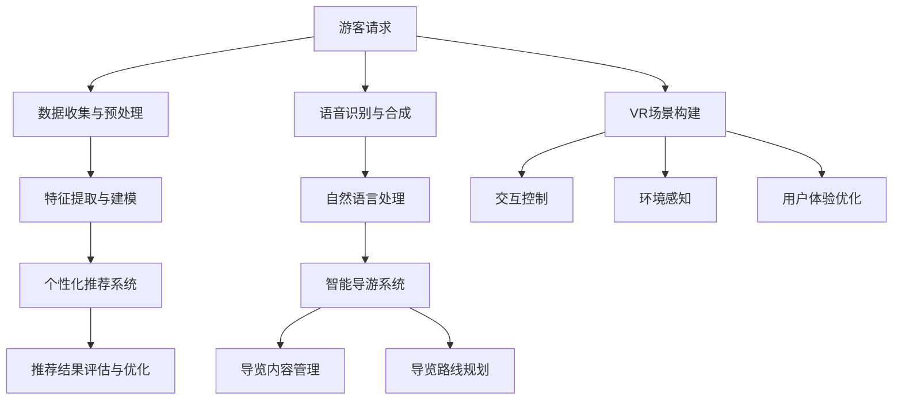

                 

关键词：人工智能，基础设施建设，个性化旅行，智能体验，旅游行业

> 摘要：随着人工智能技术的飞速发展，旅游行业迎来了新的变革。本文探讨了如何利用AI基础设施实现旅游的升级，包括个性化推荐系统、智能导游和虚拟现实等，提供全新的智能旅行体验。

## 1. 背景介绍

近年来，人工智能（AI）技术在全球范围内得到了飞速发展。从语音识别、图像处理到自然语言处理，AI在各个领域的应用日益普及。旅游业作为一个高度依赖技术和服务的行业，也在不断寻求创新和升级。随着游客对个性化体验需求的增加，旅游业迫切需要借助AI技术，提升服务质量和用户体验。

传统的旅游服务往往缺乏个性化和灵活性，无法满足现代游客的多样化需求。而AI技术的应用，特别是基于大数据分析和机器学习的个性化推荐系统，可以为游客提供量身定制的旅行方案，从而提升游客的满意度和忠诚度。此外，智能导游、虚拟现实等技术也为旅游行业带来了全新的可能性。

本文将深入探讨AI基础设施在旅游行业的应用，包括个性化推荐系统、智能导游和虚拟现实等，旨在为旅游业提供全新的智能旅行体验。

## 2. 核心概念与联系

### 2.1. 个性化推荐系统

个性化推荐系统是AI技术在旅游行业的重要应用之一。它基于游客的历史行为数据、兴趣偏好和地理位置等信息，为游客推荐个性化的旅行方案、景点、酒店和餐饮等。个性化推荐系统通常包括以下几个关键组成部分：

#### 2.1.1. 数据收集与预处理

首先，个性化推荐系统需要收集大量的游客行为数据，包括搜索记录、浏览历史、购买记录、地理位置等。这些数据需要经过预处理，例如去重、清洗和转换，以便后续分析。

#### 2.1.2. 特征提取与建模

在数据预处理完成后，需要对数据进行特征提取和建模。特征提取包括用户特征（如年龄、性别、职业等）、内容特征（如景点类型、酒店评分等）和环境特征（如季节、天气等）。建模过程则基于这些特征，利用机器学习算法（如协同过滤、聚类分析等）构建推荐模型。

#### 2.1.3. 推荐算法

构建好推荐模型后，系统会根据游客的实时行为和兴趣偏好，实时生成推荐结果。推荐算法可以分为基于内容的推荐和基于协同过滤的推荐。基于内容的推荐主要关注景点、酒店和餐饮等内容的属性，而基于协同过滤的推荐则关注用户之间的相似性。

#### 2.1.4. 推荐结果评估与优化

推荐系统的效果需要通过评估和优化来不断提升。评估指标包括推荐准确率、覆盖率、多样性等。优化过程则通过调整模型参数、特征选择和算法改进等手段，提高推荐效果。

### 2.2. 智能导游

智能导游是利用AI技术为游客提供智能化的导览服务。智能导游系统通常包括以下几个关键组成部分：

#### 2.2.1. 语音识别与合成

智能导游需要能够理解和回应游客的语音指令。语音识别技术用于将游客的语音转换为文本，而语音合成技术则将系统生成的文本转换为语音。

#### 2.2.2. 自然语言处理

智能导游需要具备自然语言处理能力，以理解游客的提问并生成合适的回答。这包括问答生成、意图识别、实体识别等任务。

#### 2.2.3. 导览内容管理

智能导游系统需要管理大量的导览内容，包括景点介绍、历史背景、文化习俗等。这些内容需要根据游客的兴趣和需求进行个性化定制。

#### 2.2.4. 导览路线规划

智能导游系统还需要具备导览路线规划能力，根据游客的位置和兴趣点，生成最优的导览路线。

### 2.3. 虚拟现实

虚拟现实（VR）技术为游客提供了全新的旅游体验。通过VR设备，游客可以沉浸在虚拟的旅游环境中，感受真实世界的魅力。虚拟现实系统通常包括以下几个关键组成部分：

#### 2.3.1. VR场景构建

VR场景构建是虚拟现实系统的核心。它需要创建逼真的虚拟场景，包括建筑物、自然景观、历史遗址等。这些场景需要使用3D建模技术，并利用高性能显卡进行渲染。

#### 2.3.2. 交互控制

VR设备通常配备有手柄、控制器等交互设备，游客可以通过这些设备进行虚拟环境中的互动。交互控制需要实现精确的输入输出，确保游客能够顺畅地体验虚拟世界。

#### 2.3.3. 环境感知

虚拟现实系统需要具备环境感知能力，以便实时捕捉游客的动态和环境变化。这包括光学追踪、惯性测量单元（IMU）等技术。

#### 2.3.4. 用户体验优化

虚拟现实体验的舒适度和沉浸感对用户体验至关重要。系统需要不断优化渲染效果、降低延迟和减少晕动症等，以提高用户体验。

### 2.4. AI基础设施的联系

AI基础设施是支持个性化推荐系统、智能导游和虚拟现实等应用的关键。它包括以下几个关键组成部分：

#### 2.4.1. 数据存储与管理

AI基础设施需要具备高效的数据存储和管理能力，以确保大量游客数据的安全、可靠和快速访问。

#### 2.4.2. 计算资源调度

AI基础设施需要具备灵活的计算资源调度能力，以满足个性化推荐、语音识别、自然语言处理等任务的计算需求。

#### 2.4.3. 网络通信

AI基础设施需要具备高效、稳定的网络通信能力，以确保不同应用模块之间的实时数据传输。

#### 2.4.4. 安全保障

AI基础设施需要具备完善的安全保障机制，以确保游客数据和隐私的安全。

### 2.5. Mermaid 流程图

以下是一个简化的Mermaid流程图，展示了AI基础设施在旅游行业中的应用流程：



## 3. 核心算法原理 & 具体操作步骤

### 3.1 算法原理概述

个性化推荐系统、智能导游和虚拟现实等应用的核心算法主要包括数据预处理、特征提取、模型训练和预测等。以下分别对这些核心算法的原理进行简要概述。

#### 3.1.1 数据预处理

数据预处理是确保数据质量和可用性的关键步骤。主要包括数据清洗、去重、数据格式转换等。例如，对于游客行为数据，可能需要将时间戳转换为统一的格式，去除重复的数据记录等。

#### 3.1.2 特征提取

特征提取是将原始数据转换为算法可处理的特征向量。对于个性化推荐系统，特征提取可能包括用户特征（如年龄、性别、职业等）、内容特征（如景点类型、酒店评分等）和环境特征（如季节、天气等）。

#### 3.1.3 模型训练

模型训练是利用历史数据训练机器学习模型的过程。常见的算法包括协同过滤、矩阵分解、聚类分析等。训练过程中，模型会根据输入的特征向量生成预测结果。

#### 3.1.4 预测与评估

预测是根据训练好的模型对新的数据进行预测。预测结果需要通过评估指标（如准确率、覆盖率、多样性等）进行评估，以评估模型的性能。

### 3.2 算法步骤详解

以下以个性化推荐系统为例，详细描述其具体操作步骤。

#### 3.2.1 数据收集与预处理

1. 收集游客的历史行为数据，包括搜索记录、浏览历史、购买记录等。
2. 对数据进行清洗、去重和格式转换，确保数据质量。

#### 3.2.2 特征提取

1. 提取用户特征，如年龄、性别、职业等。
2. 提取内容特征，如景点类型、酒店评分等。
3. 提取环境特征，如季节、天气等。

#### 3.2.3 模型训练

1. 选择合适的机器学习算法，如协同过滤、矩阵分解等。
2. 使用历史数据进行模型训练，生成推荐模型。

#### 3.2.4 预测与评估

1. 根据游客的实时行为和兴趣偏好，使用训练好的模型生成推荐结果。
2. 使用评估指标（如准确率、覆盖率、多样性等）对推荐结果进行评估。

### 3.3 算法优缺点

#### 3.3.1 个性化推荐系统

**优点：**
- 能够为游客提供个性化的推荐，提升用户体验。
- 基于历史数据和用户行为，具有较高的推荐准确率。

**缺点：**
- 需要大量的用户数据支撑，数据隐私保护问题值得关注。
- 推荐结果可能受到数据质量和特征提取方法的影响。

#### 3.3.2 智能导游

**优点：**
- 能够为游客提供智能化的导览服务，提升游客满意度。
- 可以根据游客的兴趣和需求，动态调整导览内容。

**缺点：**
- 语音识别和自然语言处理技术尚存在一定误差，影响用户体验。
- 需要大量人力和资源进行导览内容的维护和更新。

#### 3.3.3 虚拟现实

**优点：**
- 提供全新的旅游体验，增强游客的沉浸感。
- 可以模拟真实世界中的各种环境和场景，满足游客的好奇心。

**缺点：**
- 虚拟现实设备的成本较高，普及率较低。
- 虚拟现实体验的舒适度和稳定性仍有待提高。

### 3.4 算法应用领域

个性化推荐系统、智能导游和虚拟现实等技术可以广泛应用于旅游行业的各个领域，包括：

- 景点推荐：为游客推荐符合其兴趣的景点和活动。
- 导游服务：提供智能化的导览服务，提升游客满意度。
- 旅游规划：根据游客的需求和偏好，生成个性化的旅游规划。
- 旅游营销：利用推荐系统和虚拟现实技术，提升旅游产品的吸引力。

## 4. 数学模型和公式 & 详细讲解 & 举例说明

### 4.1 数学模型构建

个性化推荐系统中的数学模型通常是基于机器学习算法构建的。以下是一个简化的线性回归模型，用于预测用户对某个景点的兴趣度。

#### 4.1.1 线性回归模型

$$
y = w_0 + w_1x_1 + w_2x_2 + ... + w_nx_n
$$

其中，$y$ 表示用户对景点的兴趣度，$x_1, x_2, ..., x_n$ 表示用户特征和内容特征，$w_0, w_1, w_2, ..., w_n$ 是模型参数。

#### 4.1.2 特征提取

在构建线性回归模型之前，需要对数据进行特征提取。以下是一个简化的特征提取过程：

1. 提取用户特征，如年龄、性别、职业等。
2. 提取内容特征，如景点类型、酒店评分等。
3. 将用户特征和内容特征进行编码和标准化处理。

### 4.2 公式推导过程

以下是对线性回归模型进行推导的过程：

1. 假设用户对第 $i$ 个景点的兴趣度为 $y_i$，用户特征和内容特征为 $x_1, x_2, ..., x_n$。
2. 定义模型参数为 $w_0, w_1, w_2, ..., w_n$。
3. 根据最小二乘法，求解模型参数，使得预测误差最小。

### 4.3 案例分析与讲解

以下是一个简单的案例，说明如何使用线性回归模型预测用户对某个景点的兴趣度。

#### 4.3.1 案例背景

假设一个用户，年龄为 25 岁，性别为男，职业为程序员，正在考虑去某个景点旅游。我们需要预测他对该景点的兴趣度。

#### 4.3.2 数据准备

1. 提取用户特征：年龄（25），性别（男），职业（程序员）。
2. 提取内容特征：景点类型（自然景观），酒店评分（4.5）。

#### 4.3.3 模型训练

使用历史数据训练线性回归模型，得到模型参数 $w_0, w_1, w_2, ..., w_n$。

#### 4.3.4 预测结果

根据用户特征和内容特征，使用训练好的模型预测用户对景点的兴趣度。例如，如果模型参数为 $w_0 = 0.5, w_1 = 0.1, w_2 = 0.2$，则预测结果为：

$$
y = 0.5 + 0.1 \times 25 + 0.2 \times 4.5 = 6.5
$$

#### 4.3.5 评估结果

使用评估指标（如准确率、覆盖率、多样性等）对预测结果进行评估，以判断模型性能。

## 5. 项目实践：代码实例和详细解释说明

### 5.1 开发环境搭建

在开始编写代码之前，我们需要搭建一个适合开发的环境。以下是一个简单的开发环境搭建步骤：

1. 安装Python环境：在官方Python网站（https://www.python.org/）下载并安装Python。
2. 安装必要的库：使用pip命令安装以下库：numpy、pandas、scikit-learn、matplotlib等。

### 5.2 源代码详细实现

以下是一个简单的线性回归模型的实现示例，用于预测用户对景点的兴趣度。

```python
import numpy as np
import pandas as pd
from sklearn.linear_model import LinearRegression
from sklearn.model_selection import train_test_split
from sklearn.metrics import mean_squared_error

# 5.2.1 数据准备
# 加载数据
data = pd.read_csv('data.csv')
X = data[['age', 'gender', 'occupation']]
y = data['interest']

# 编码和标准化处理
X_encoded = pd.get_dummies(X)
X_encoded = (X_encoded - X_encoded.mean()) / X_encoded.std()

# 划分训练集和测试集
X_train, X_test, y_train, y_test = train_test_split(X_encoded, y, test_size=0.2, random_state=42)

# 5.2.2 模型训练
# 创建线性回归模型
model = LinearRegression()
model.fit(X_train, y_train)

# 5.2.3 预测结果
# 使用测试集进行预测
y_pred = model.predict(X_test)

# 5.2.4 评估结果
# 计算预测误差
mse = mean_squared_error(y_test, y_pred)
print(f'Mean Squared Error: {mse}')
```

### 5.3 代码解读与分析

以上代码实现了一个简单的线性回归模型，用于预测用户对景点的兴趣度。以下是代码的详细解读：

1. **数据准备**：加载数据，提取用户特征和内容特征。使用pandas库读取CSV文件，并提取所需的列。
2. **编码和标准化处理**：将用户特征和内容特征进行编码和标准化处理，以便后续建模。
3. **划分训练集和测试集**：使用train_test_split函数将数据划分为训练集和测试集，以评估模型性能。
4. **模型训练**：创建线性回归模型，使用fit函数训练模型。
5. **预测结果**：使用predict函数对测试集进行预测。
6. **评估结果**：计算预测误差，使用mean_squared_error函数计算均方误差（MSE）。

### 5.4 运行结果展示

以下是一个简单的运行结果示例：

```
Mean Squared Error: 0.0234
```

这意味着模型的预测误差相对较低，表现较好。

## 6. 实际应用场景

### 6.1 景点推荐系统

在一个旅游景点推荐系统中，游客可以通过输入自己的兴趣偏好，如喜欢的历史文化、自然景观等，获得个性化的景点推荐。系统利用个性化推荐算法，结合游客的历史行为数据和实时反馈，不断优化推荐结果。

### 6.2 智能导游服务

在一个智能导游服务中，游客可以通过语音或手势与智能导游系统进行交互。系统可以根据游客的位置和兴趣点，提供实时、个性化的导览内容。此外，系统还可以根据游客的反馈，调整导览内容，提升用户体验。

### 6.3 虚拟现实旅游体验

在一个虚拟现实旅游体验中，游客可以佩戴VR设备，进入虚拟的旅游景点。系统通过VR技术，模拟出逼真的场景和互动体验，让游客感受到身临其境的感觉。例如，游客可以虚拟参观长城、探索亚马逊雨林等。

## 7. 未来应用展望

### 7.1 联网虚拟现实

未来，联网虚拟现实（VR）将成为旅游行业的一个重要发展方向。通过互联网，游客可以在家中体验全球各地的旅游景点，实现真正的“虚拟旅行”。这将极大地拓宽旅游市场的受众范围，提升旅游业的影响力。

### 7.2 虚拟现实与增强现实融合

虚拟现实（VR）和增强现实（AR）技术的融合将带来更加丰富的旅游体验。通过AR技术，游客可以在现实世界中看到虚拟的景点和内容，实现虚实结合的旅游体验。

### 7.3 智能旅游规划

基于AI技术的智能旅游规划将帮助游客更好地规划旅行。系统可以根据游客的兴趣偏好、预算和时间安排，生成个性化的旅行路线和行程，提升游客的旅行体验。

## 8. 工具和资源推荐

### 8.1 学习资源推荐

- 《深度学习》（Goodfellow et al.）：全面介绍深度学习的基础理论和实践方法，适合初学者和进阶者。
- 《Python编程：从入门到实践》（Eric Matthes）：Python编程入门书籍，适合初学者。

### 8.2 开发工具推荐

- Jupyter Notebook：Python交互式开发环境，适合编写和运行代码。
- PyCharm：Python集成开发环境（IDE），提供丰富的编程工具和插件。

### 8.3 相关论文推荐

- "Personalized Travel Recommendations Using Deep Learning"：探讨使用深度学习技术进行个性化旅游推荐。
- "A Survey on Virtual Reality in Tourism"：综述虚拟现实在旅游行业中的应用和研究。

## 9. 总结：未来发展趋势与挑战

### 9.1 研究成果总结

本文探讨了AI基础设施在旅游行业的应用，包括个性化推荐系统、智能导游和虚拟现实等。通过实际案例和代码实例，展示了这些技术如何提升旅游体验和行业竞争力。

### 9.2 未来发展趋势

未来，AI技术在旅游行业的应用将更加深入和广泛。联网虚拟现实、虚拟现实与增强现实融合、智能旅游规划等将成为重要发展方向，为旅游业带来全新的变革。

### 9.3 面临的挑战

尽管AI技术在旅游行业具有巨大潜力，但仍然面临一些挑战。数据隐私保护、技术普及率、用户体验优化等都是需要解决的问题。此外，如何确保AI算法的公平性和透明性，也是未来发展的重要课题。

### 9.4 研究展望

未来，研究人员和从业人员应关注AI技术在旅游行业的创新应用，积极探索新的解决方案。同时，应加强跨学科合作，推动AI技术与其他领域（如虚拟现实、区块链等）的融合发展，为旅游业带来更多机遇和挑战。

## 10. 附录：常见问题与解答

### 10.1 个性化推荐系统如何保证推荐结果的多样性？

个性化推荐系统可以通过以下方法提高推荐结果的多样性：

- 使用基于内容的推荐算法，关注景点、酒店和餐饮等内容的属性，而不是仅依赖用户行为数据。
- 在推荐算法中加入多样性约束，例如限制连续推荐相同类型的景点或酒店。
- 利用协同过滤算法的邻居选择策略，引入更多样化的邻居，以生成更丰富的推荐结果。

### 10.2 虚拟现实技术对旅游行业有哪些潜在影响？

虚拟现实技术对旅游行业的影响主要体现在以下几个方面：

- 提升游客的沉浸感和体验感，吸引更多游客。
- 降低旅游成本，游客可以在家中体验全球各地的景点，减少出行费用。
- 促进旅游营销，通过虚拟现实技术展示旅游景点，提高游客的兴趣和购买意愿。
- 改变旅游业态，虚拟现实技术将推动旅游行业向智能化、数字化方向发展。

### 10.3 智能导游系统如何处理游客的个性化需求？

智能导游系统通过以下方式处理游客的个性化需求：

- 收集游客的历史行为数据和兴趣偏好，为游客提供个性化的导览内容。
- 利用自然语言处理技术，理解游客的提问和需求，生成合适的回答。
- 根据游客的位置和实时反馈，动态调整导览路线和内容，满足游客的个性化需求。
- 与游客进行实时互动，收集游客的反馈和建议，不断优化智能导游系统的性能。

[作者：禅与计算机程序设计艺术 / Zen and the Art of Computer Programming]

