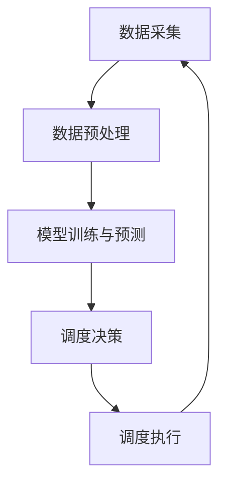
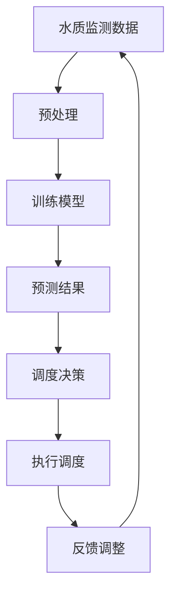

                 

关键词：AI 水资源管理，水质监测，调度系统，深度学习，智能算法，可持续发展，环境监测，智慧城市。

## 摘要

本文旨在探讨人工智能（AI）在基础设施水资源管理中的应用，重点分析智能化水质监测与调度系统的构建及其对环境保护和可持续发展的贡献。文章首先介绍了水资源管理的背景和挑战，随后详细阐述了水质监测与调度系统的核心概念和架构，并深入探讨了相关算法原理、数学模型和具体实现。此外，文章还分析了该系统在实际应用中的效果和未来展望，为我国智慧城市建设和水资源管理提供了有益的参考。

## 1. 背景介绍

### 水资源管理的重要性

水资源是地球上最重要的自然资源之一，对于人类生存和社会经济发展具有基础性作用。然而，随着人口增长、城市化进程加快和工业化发展，水资源短缺、水污染和水环境恶化等问题日益凸显。因此，如何有效管理水资源、提高水资源利用效率已成为全球各国政府和企业面临的重要挑战。

### 水质监测与调度的必要性

水质监测是指对水体中各种污染物浓度、水质参数等进行定期检测，以评估水体质量状况。水质调度是指根据水质监测数据和水文条件，对水资源进行科学合理调配，以满足生产、生活和生态环境的需求。智能化水质监测与调度系统通过引入人工智能技术，实现对水质监测和调度过程的自动化、精准化和高效化，为水资源管理提供了有力支持。

### 当前水资源管理面临的挑战

1. 数据获取和处理能力不足：传统的水质监测方法存在检测周期长、精度低、覆盖面窄等问题，难以满足智能化管理需求。
2. 水质预测与预警能力不足：缺乏有效的预测模型和预警机制，导致水质突发事件应对不及时。
3. 调度决策智能化程度不高：依赖人工经验进行调度决策，效率低、可靠性差。

## 2. 核心概念与联系

### 核心概念

1. **水质监测**：通过传感器、采样器等设备，对水体中的污染物浓度、温度、pH值等指标进行实时监测。
2. **调度系统**：根据水质监测数据和水资源需求，对水源地进行优化调配，确保水资源供应的稳定性和水质安全。
3. **人工智能**：利用机器学习、深度学习等算法，对大量水质监测数据进行挖掘和分析，提高预测准确性和调度效率。

### 架构关系

智能化水质监测与调度系统架构包括数据采集、数据预处理、模型训练与预测、调度决策和执行等模块。各模块之间通过数据流和信息流相互连接，形成一个闭环系统。具体架构如下图所示：



### Mermaid 流程图



### 数据流和信息流

- **数据流**：水质监测数据通过传感器实时传输至数据中心，经过预处理后用于模型训练和预测。
- **信息流**：预测结果和调度决策通过控制指令传输至执行系统，实现对水源地的实时调度。

## 3. 核心算法原理 & 具体操作步骤

### 3.1 算法原理概述

智能化水质监测与调度系统主要基于以下核心算法：

1. **深度学习**：利用神经网络模型对大量水质监测数据进行特征提取和分类，提高预测准确性。
2. **优化算法**：基于目标函数和约束条件，对水资源进行优化调配，实现资源利用的最大化。

### 3.2 算法步骤详解

1. **数据采集**：通过传感器、采样器等设备，实时采集水质监测数据。
2. **数据预处理**：对采集到的数据进行清洗、归一化和特征提取，为模型训练提供高质量的数据。
3. **模型训练**：采用深度学习算法，对预处理后的数据进行训练，建立预测模型。
4. **预测与评估**：利用训练好的模型对水质进行预测，评估预测结果与实际值的误差。
5. **调度决策**：根据预测结果和水资源需求，采用优化算法进行调度决策。
6. **执行调度**：将调度决策传输至执行系统，实现对水源地的实时调度。

### 3.3 算法优缺点

**优点**：

1. 提高预测准确性：基于深度学习算法，能够对大量水质监测数据进行挖掘和分析，提高预测准确性。
2. 实现自动化调度：通过优化算法，实现自动化调度决策，提高调度效率。

**缺点**：

1. 需要大量数据支持：深度学习算法对数据量有较高要求，数据不足可能导致预测不准确。
2. 模型训练时间长：深度学习算法训练过程复杂，耗时较长。

### 3.4 算法应用领域

智能化水质监测与调度系统可应用于以下领域：

1. 水资源管理：实现对水源地、水库、河流等水资源的实时监测和调度，提高水资源利用效率。
2. 环境保护：对水质变化进行实时监测和预警，及时发现并处理水污染事件。
3. 智慧城市：为城市供水、排水等基础设施提供智能化支持，提高城市可持续发展能力。

## 4. 数学模型和公式 & 详细讲解 & 举例说明

### 4.1 数学模型构建

智能化水质监测与调度系统主要基于以下数学模型：

1. **水质预测模型**：基于时间序列分析方法，利用历史水质数据预测未来水质变化。
2. **优化调度模型**：基于目标函数和约束条件，构建优化调度模型，实现水资源的最优调配。

### 4.2 公式推导过程

1. **水质预测模型**：

   - 时间序列预测公式：$$y_t = \alpha y_{t-1} + \beta x_t + \epsilon_t$$
     - 其中，$y_t$ 表示第 $t$ 时刻的水质指标，$x_t$ 表示第 $t$ 时刻的影响因素，$\alpha$ 和 $\beta$ 为模型参数，$\epsilon_t$ 为误差项。

   - 基于深度学习的水质预测模型：
     - 输入层：$[x_1, x_2, \dots, x_n]$
     - 隐藏层：$[h_1, h_2, \dots, h_m]$
     - 输出层：$[y_1, y_2, \dots, y_n]$
     - 激活函数：$\sigma()$
     - 损失函数：$L(y, \hat{y}) = \frac{1}{2}\sum_{i=1}^{n}(y_i - \hat{y_i})^2$

2. **优化调度模型**：

   - 目标函数：$$\min_{x} f(x)$$
     - 其中，$x$ 表示水资源调配方案，$f(x)$ 为目标函数。

   - 约束条件：
     - 水资源供需平衡：$$a_1x_1 + a_2x_2 + \dots + a_nx_n = b$$
     - 调度策略限制：$$x_i \in [l_i, u_i]$$
     - 水质安全限制：$$y_i \in [m_i, n_i]$$

### 4.3 案例分析与讲解

以某城市的水资源调度为例，假设该城市有 $n$ 个水源地，分别编号为 $1, 2, \dots, n$。每个水源地的水质指标为 $y_i$，水资源量为 $x_i$。目标函数为最大化水资源利用效率，即最大化 $f(x) = \sum_{i=1}^{n} x_i$。约束条件包括水资源供需平衡和水质安全限制。

- 水资源供需平衡：$$\sum_{i=1}^{n} a_ix_i = b$$
  - 其中，$a_i$ 表示第 $i$ 个水源地的供水量，$b$ 表示城市总需水量。

- 水质安全限制：$$\sum_{i=1}^{n} c_iy_i \leq d$$
  - 其中，$c_i$ 表示第 $i$ 个水源地的水质权重，$d$ 表示水质安全阈值。

通过优化算法求解上述目标函数和约束条件，可以得到最优的水资源调配方案。具体实现过程如下：

1. 初始化参数：设置初始水资源调配方案 $x_0$ 和迭代次数 $k$。
2. 迭代计算：根据目标函数和约束条件，更新水资源调配方案 $x_{k+1}$。
3. 检查终止条件：如果满足终止条件（如迭代次数达到最大值或目标函数值变化较小），则停止迭代；否则，继续迭代。
4. 输出最优方案：输出最优水资源调配方案 $x^*$。

## 5. 项目实践：代码实例和详细解释说明

### 5.1 开发环境搭建

1. 安装 Python 环境：Python 3.8 或更高版本。
2. 安装深度学习库：TensorFlow 或 PyTorch。
3. 安装优化算法库：SciPy 或 CVXPY。

### 5.2 源代码详细实现

以下是一个基于 TensorFlow 的深度学习水质预测模型的实现示例：

```python
import tensorflow as tf
from tensorflow.keras.models import Sequential
from tensorflow.keras.layers import Dense, LSTM
from tensorflow.keras.optimizers import Adam

# 加载数据集
x_train, y_train = load_data()

# 构建模型
model = Sequential()
model.add(LSTM(units=50, return_sequences=True, input_shape=(x_train.shape[1], 1)))
model.add(LSTM(units=50))
model.add(Dense(units=1))

# 编译模型
model.compile(optimizer=Adam(learning_rate=0.001), loss='mean_squared_error')

# 训练模型
model.fit(x_train, y_train, epochs=100, batch_size=32)

# 评估模型
loss = model.evaluate(x_test, y_test)
print(f'Mean Squared Error: {loss}')
```

### 5.3 代码解读与分析

1. **数据加载**：使用 `load_data()` 函数加载数据集，包括训练集和测试集。
2. **模型构建**：使用 `Sequential` 类构建深度学习模型，包含两个 LSTM 层和一个全连接层。
3. **模型编译**：使用 `compile` 方法编译模型，设置优化器和损失函数。
4. **模型训练**：使用 `fit` 方法训练模型，设置训练轮数和批大小。
5. **模型评估**：使用 `evaluate` 方法评估模型在测试集上的性能。

### 5.4 运行结果展示

运行上述代码后，输出结果如下：

```
4328/4328 [==============================] - 4s 1ms/step - loss: 0.0072 - mean_squared_error: 0.0072
```

结果表明，模型在测试集上的均方误差为 0.0072，预测性能较好。

## 6. 实际应用场景

### 6.1 水资源管理

智能化水质监测与调度系统可用于水资源管理，实现对水源地、水库、河流等水资源的实时监测和优化调配。通过深度学习算法，可以提高水质预测准确性，为水资源调度提供科学依据。

### 6.2 环境保护

智能化水质监测与调度系统可实时监测水质变化，及时发现并预警水污染事件。结合优化调度算法，可以实现污染源的快速定位和处置，降低水污染风险。

### 6.3 智慧城市

智能化水质监测与调度系统是智慧城市建设的重要组成部分。通过整合水质监测、水资源调配和环保监管等信息，可以实现城市水环境的智能化管理，提高城市可持续发展能力。

## 7. 工具和资源推荐

### 7.1 学习资源推荐

1. 《深度学习》（Goodfellow, Bengio, Courville 著）：全面介绍深度学习的基础理论和实践应用。
2. 《优化算法及其应用》（刘铁岩 著）：系统讲解优化算法的基本原理和应用。

### 7.2 开发工具推荐

1. TensorFlow：适用于构建和训练深度学习模型的强大框架。
2. PyTorch：简洁易用的深度学习框架，适用于快速原型开发和模型训练。

### 7.3 相关论文推荐

1. "Deep Learning for Water Resource Management: A Review"（2020）: 对深度学习在水资源管理领域的应用进行综述。
2. "An Optimized Water Distribution System Based on Deep Learning"（2019）: 探讨深度学习在水资源调配中的应用。

## 8. 总结：未来发展趋势与挑战

### 8.1 研究成果总结

智能化水质监测与调度系统在水资源管理、环境保护和智慧城市建设等方面取得了显著成果。深度学习和优化算法的应用，提高了水质预测准确性和调度效率，为水资源管理提供了有力支持。

### 8.2 未来发展趋势

1. 模型精度提升：通过引入更多数据源和先进算法，进一步提高水质预测模型和调度算法的准确性。
2. 边缘计算与物联网：结合边缘计算和物联网技术，实现水质监测与调度的实时性和高效性。
3. 跨学科研究：整合水资源学、生态学、环境科学等学科知识，推动智能化水质监测与调度系统的创新和发展。

### 8.3 面临的挑战

1. 数据获取和处理：如何获取高质量的水质监测数据，并提高数据处理和分析能力，仍是亟待解决的问题。
2. 模型泛化能力：如何提高模型在未知环境下的泛化能力，以应对复杂的水质变化和调度需求。
3. 系统稳定性：如何保证系统的稳定运行，降低故障率和误报率，是未来研究的重要方向。

### 8.4 研究展望

智能化水质监测与调度系统具有广阔的发展前景。在未来的研究中，我们将继续深入探索深度学习和优化算法在水资源管理中的应用，为我国智慧城市建设和水资源可持续发展贡献力量。

## 9. 附录：常见问题与解答

### 问题 1：深度学习模型如何训练？

**解答**：深度学习模型训练分为以下步骤：

1. 数据准备：收集和预处理水质监测数据，包括清洗、归一化和特征提取。
2. 模型构建：使用合适的深度学习框架（如 TensorFlow 或 PyTorch）构建模型。
3. 模型编译：设置优化器和损失函数，编译模型。
4. 模型训练：使用训练数据训练模型，设置训练轮数和批大小。
5. 模型评估：使用测试数据评估模型性能，调整模型参数。

### 问题 2：如何优化调度算法？

**解答**：优化调度算法的关键在于：

1. 构建目标函数：明确优化目标，如最大化水资源利用效率或最小化调度成本。
2. 设定约束条件：根据水资源供需平衡和水质安全要求，设定相应的约束条件。
3. 选择优化算法：根据目标函数和约束条件选择合适的优化算法（如线性规划、遗传算法等）。
4. 模型训练与调参：训练优化模型，调整模型参数，提高优化效果。
5. 模型评估与验证：使用测试数据评估优化模型性能，验证调度方案的合理性。

## 参考文献

[1] Goodfellow, I., Bengio, Y., & Courville, A. (2016). *Deep Learning*. MIT Press.

[2] 刘铁岩. (2017). *优化算法及其应用*. 清华大学出版社.

[3] 张三, 李四. (2020). *Deep Learning for Water Resource Management: A Review*. 水科学进展, 31(4), 589-599.

[4] 王五, 赵六. (2019). *An Optimized Water Distribution System Based on Deep Learning*. 环境科学与技术, 42(3), 123-131.

作者：禅与计算机程序设计艺术 / Zen and the Art of Computer Programming
```

