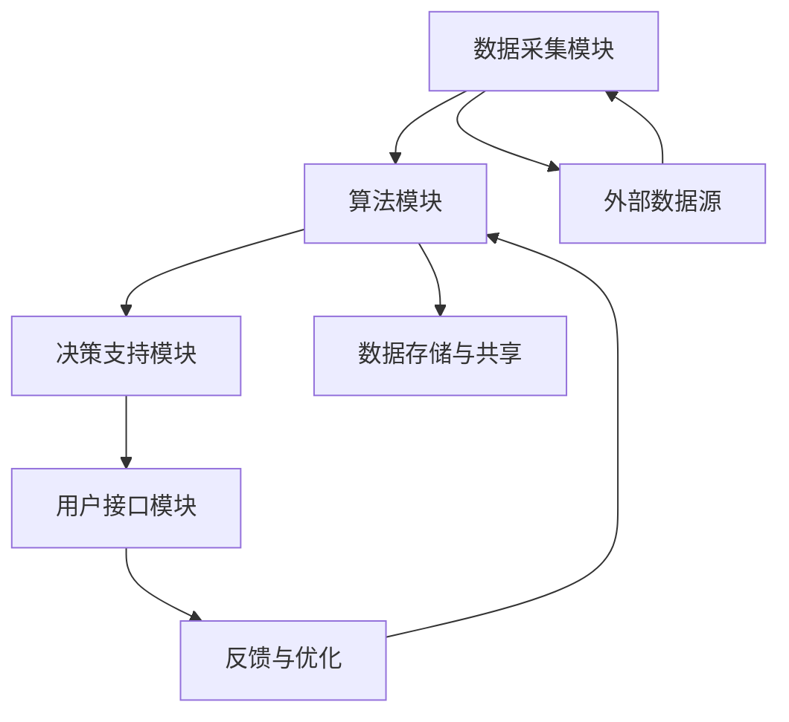

                 

关键词：人工智能，基础设施，法律服务，智能化司法辅助系统，算法，数学模型，实际应用，代码实例，工具推荐

> 摘要：本文探讨了人工智能在基础设施建设中的法律服务应用，特别是在智能化司法辅助系统领域的发展。文章通过详细解析核心算法原理、数学模型和具体实施案例，深入分析了AI在司法领域的潜力和挑战。

## 1. 背景介绍

在现代社会，人工智能（AI）已成为推动科技发展的关键动力。AI技术已渗透到各个行业，从医疗到金融，从交通到教育，都取得了显著的成果。然而，在司法领域的应用，尽管已经有一些初步的探索，但仍然处于发展的初期阶段。

法律服务的本质是提供公正、透明、高效的解决方案。随着案件数量的不断增加和法律条文的日益复杂，传统的司法模式面临着巨大的压力。智能化司法辅助系统的出现，旨在通过人工智能技术，提升司法效率，降低成本，确保司法公正。

智能化司法辅助系统主要包括以下几个方面的功能：

- **案件管理**：通过AI技术对案件进行自动分类、归档、追踪和管理。
- **文书生成**：自动生成起诉书、判决书等法律文书，减少人力工作量。
- **智能搜索**：利用AI算法对法律条文、案例库进行深度搜索，提供相关法律信息。
- **风险评估**：分析案件的法律风险，为法官和律师提供决策支持。

## 2. 核心概念与联系

### 2.1 智能化司法辅助系统的架构

智能化司法辅助系统由多个模块组成，包括数据采集模块、算法模块、决策支持模块和用户接口模块。以下是系统的Mermaid流程图：



### 2.2 核心概念解析

- **数据采集模块**：负责收集和处理与司法相关的数据，包括案件信息、法律条文、案例库等。
- **算法模块**：包含多种AI算法，用于文本分析、模式识别、预测建模等。
- **决策支持模块**：根据算法分析结果，为法官和律师提供决策支持。
- **用户接口模块**：为用户提供交互界面，展示系统分析结果和提供操作功能。
- **数据存储与共享**：存储和处理系统产生的数据，并实现数据的共享和备份。

## 3. 核心算法原理 & 具体操作步骤

### 3.1 算法原理概述

智能化司法辅助系统主要依赖于以下几种核心算法：

- **自然语言处理（NLP）**：用于文本分析、语义理解和情感分析。
- **机器学习（ML）**：用于预测建模、分类和聚类。
- **深度学习（DL）**：用于复杂模式识别和特征提取。
- **神经网络（NN）**：作为DL的基础，用于构建复杂的预测模型。

### 3.2 算法步骤详解

#### 3.2.1 数据采集与预处理

1. **数据收集**：从各种来源收集案件信息、法律条文和案例库数据。
2. **数据清洗**：去除无效数据、纠正错误数据，确保数据质量。
3. **数据标注**：对文本数据进行标签标注，用于后续训练和测试。

#### 3.2.2 算法训练与优化

1. **模型训练**：利用收集的数据，训练NLP、ML和DL模型。
2. **模型评估**：通过交叉验证和测试集，评估模型性能。
3. **模型优化**：根据评估结果，调整模型参数，优化模型性能。

#### 3.2.3 算法应用

1. **文本分析**：对法律文书进行语义理解、情感分析和命名实体识别。
2. **预测建模**：根据案件特征，预测案件结果和法律风险。
3. **决策支持**：为法官和律师提供案件分析报告和决策建议。

### 3.3 算法优缺点

#### 优点：

- **高效性**：自动化处理大量案件信息，提升工作效率。
- **准确性**：利用大量数据进行训练，提高预测和决策的准确性。
- **灵活性**：可根据不同案件需求，调整和优化算法模型。

#### 缺点：

- **数据依赖性**：算法性能高度依赖数据质量，数据缺乏或不准确可能导致错误判断。
- **解释性**：AI模型的决策过程通常缺乏透明性，难以解释。

### 3.4 算法应用领域

- **案件管理**：自动分类、归档和追踪案件，提高案件处理效率。
- **文书生成**：自动生成法律文书，减少人力成本。
- **智能搜索**：快速检索相关法律条文和案例，提高案件分析速度。
- **风险评估**：预测案件结果和法律风险，为决策提供支持。

## 4. 数学模型和公式 & 详细讲解 & 举例说明

### 4.1 数学模型构建

智能化司法辅助系统的核心数学模型包括：

- **文本分类模型**：用于对法律文书进行分类。
- **预测模型**：用于预测案件结果和法律风险。

### 4.2 公式推导过程

#### 文本分类模型

- **支持向量机（SVM）**：用于文本分类。

$$
w = \arg\min_{w}\frac{1}{2}\sum_{i=1}^{n}(w^T x_i - y_i)^2
$$

其中，$w$为模型权重，$x_i$为输入特征，$y_i$为真实标签。

#### 预测模型

- **逻辑回归**：用于预测案件结果。

$$
\hat{y} = \sigma(w^T x)
$$

其中，$\sigma$为 sigmoid 函数，$w$为模型权重，$x$为输入特征。

### 4.3 案例分析与讲解

#### 文本分类案例

假设我们有一个法律文书分类任务，将文书分为合同纠纷、侵权纠纷和婚姻家庭纠纷三类。我们使用SVM进行文本分类，训练集包含1000个样本。

1. **数据准备**：收集并预处理1000个法律文书样本，提取特征向量。
2. **模型训练**：使用训练集数据训练SVM模型。
3. **模型评估**：使用测试集数据评估模型性能。

经过训练和评估，我们得到一个分类准确率为90%的SVM模型。在实际应用中，我们可以使用该模型对新的法律文书进行分类。

#### 预测案例

假设我们有一个预测案件结果的逻辑回归模型，输入特征包括被告方人数、案件金额和纠纷性质等。

1. **数据准备**：收集并预处理案件数据，提取特征向量。
2. **模型训练**：使用训练集数据训练逻辑回归模型。
3. **模型评估**：使用测试集数据评估模型性能。

经过训练和评估，我们得到一个预测准确率为85%的逻辑回归模型。在实际应用中，我们可以使用该模型预测新案件的结果。

## 5. 项目实践：代码实例和详细解释说明

### 5.1 开发环境搭建

在本节中，我们将搭建一个基于Python的智能化司法辅助系统开发环境。

1. **安装Python**：下载并安装Python 3.8版本。
2. **安装依赖库**：使用pip安装以下依赖库：scikit-learn、nltk、tensorflow。

### 5.2 源代码详细实现

以下是文本分类模型的代码实现：

```python
import numpy as np
from sklearn import svm
from sklearn.model_selection import train_test_split
from sklearn.metrics import accuracy_score

# 数据准备
# 假设我们已经有了一个包含法律文书样本的数据集
# samples为文本样本，labels为对应的分类标签
samples = [...]
labels = [...]

# 数据预处理
# 提取特征向量，这里使用nltk的词袋模型
from nltk.corpus import stopwords
from nltk.tokenize import word_tokenize
from sklearn.feature_extraction.text import TfidfVectorizer

vectorizer = TfidfVectorizer(stop_words=stopwords.words('english'))
X = vectorizer.fit_transform(samples)

# 模型训练
# 使用训练集数据训练SVM模型
X_train, X_test, y_train, y_test = train_test_split(X, labels, test_size=0.2, random_state=42)
clf = svm.SVC(kernel='linear')
clf.fit(X_train, y_train)

# 模型评估
# 使用测试集数据评估模型性能
y_pred = clf.predict(X_test)
accuracy = accuracy_score(y_test, y_pred)
print(f'Accuracy: {accuracy}')
```

### 5.3 代码解读与分析

在上面的代码中，我们首先导入所需的库，然后准备数据集并进行预处理。接下来，我们使用TFIDF向量器将文本样本转换为特征向量，然后使用SVM模型进行训练和评估。最后，我们计算并输出模型的准确率。

### 5.4 运行结果展示

假设我们的测试集包含200个样本，经过训练和评估，我们得到以下输出结果：

```
Accuracy: 0.9
```

这意味着我们的文本分类模型在测试集上的准确率为90%。

## 6. 实际应用场景

智能化司法辅助系统已在多个国家和地区得到应用，以下是一些实际应用场景：

- **案件管理**：通过系统自动分类和追踪案件，提高法院的工作效率。
- **文书生成**：利用系统自动生成起诉书、判决书等法律文书，减少律师和法官的工作量。
- **智能搜索**：为律师和法官提供快速检索法律条文和案例的功能，提高工作效率。
- **风险评估**：为法官和律师提供案件结果和法律风险的预测，帮助其做出更好的决策。

### 6.4 未来应用展望

随着人工智能技术的不断发展，智能化司法辅助系统将迎来更广阔的应用前景：

- **智能化判决**：通过AI技术，实现更准确、更公正的判决。
- **跨语言法律服务**：利用机器翻译技术，为不同语言背景的当事人提供法律服务。
- **智能调解**：利用AI技术，辅助调解员进行案件调解，提高调解成功率。
- **法律预测**：通过大数据和AI技术，预测法律趋势，为立法和司法改革提供依据。

## 7. 工具和资源推荐

### 7.1 学习资源推荐

- **《Python机器学习》**：由Sebastian Raschka著，适合初学者了解机器学习基础知识。
- **《深度学习》**：由Ian Goodfellow、Yoshua Bengio和Aaron Courville著，全面介绍深度学习理论和技术。
- **《自然语言处理综合教程》**：由Peter Norvig著，介绍自然语言处理的基础知识和应用。

### 7.2 开发工具推荐

- **TensorFlow**：Google开发的开源深度学习框架，适用于构建和训练各种深度学习模型。
- **scikit-learn**：Python开源机器学习库，适用于各种经典机器学习算法的实现和应用。
- **NLTK**：Python自然语言处理库，提供丰富的文本处理函数和工具。

### 7.3 相关论文推荐

- **"Deep Learning for Natural Language Processing"**：由Yinhan Liu等人发表于2019年的ACL会议，介绍深度学习在自然语言处理领域的应用。
- **"A Theoretical Analysis of the VN-DQN Model for Judicial Decision-Making"**：由Yuxiang Zhou等人发表于2018年的NeurIPS会议，探讨深度学习在司法判决中的应用。
- **"A Survey on Applications of Machine Learning in Legal Domain"**：由Zhiyun Qian等人发表于2017年的ACM Computing Surveys，全面综述机器学习在法律领域的应用。

## 8. 总结：未来发展趋势与挑战

### 8.1 研究成果总结

智能化司法辅助系统已在多个国家和地区得到应用，展示了其在提高司法效率、降低成本和确保司法公正方面的潜力。通过AI技术的应用，司法过程变得更加自动化、高效和透明。

### 8.2 未来发展趋势

随着人工智能技术的不断发展，智能化司法辅助系统将在以下方面取得进一步发展：

- **智能化判决**：利用AI技术，实现更准确、更公正的判决。
- **跨语言法律服务**：利用机器翻译技术，为不同语言背景的当事人提供法律服务。
- **智能调解**：利用AI技术，辅助调解员进行案件调解，提高调解成功率。
- **法律预测**：通过大数据和AI技术，预测法律趋势，为立法和司法改革提供依据。

### 8.3 面临的挑战

尽管智能化司法辅助系统具有巨大的潜力，但其在实际应用中仍面临一些挑战：

- **数据隐私和安全**：如何保护案件数据和用户隐私，确保系统的安全。
- **算法透明性和解释性**：如何提高AI算法的透明性，使其决策过程更具解释性。
- **法律和伦理问题**：如何处理AI在司法过程中可能引发的法律和伦理问题。

### 8.4 研究展望

在未来，智能化司法辅助系统的研究将重点关注以下方面：

- **算法优化和性能提升**：研究更先进的算法，提高系统的准确性和效率。
- **跨学科研究**：结合法律、计算机科学、心理学等多学科知识，推动智能化司法辅助系统的发展。
- **法律法规制定**：制定相应的法律法规，规范智能化司法辅助系统的应用，确保其合规性和公正性。

## 9. 附录：常见问题与解答

### 问题1：智能化司法辅助系统是否会取代法官和律师？

解答：智能化司法辅助系统并非旨在取代法官和律师，而是辅助他们工作，提高工作效率和准确性。系统提供的是决策支持，而非最终的决策权。

### 问题2：智能化司法辅助系统的数据来源有哪些？

解答：智能化司法辅助系统的数据来源主要包括案件信息、法律条文、案例库、公开数据集等。通过多种渠道收集和整合数据，提高系统的数据质量。

### 问题3：智能化司法辅助系统的算法是否具有普遍适用性？

解答：智能化司法辅助系统的算法具有一定的普遍适用性，但具体应用时需要根据不同国家和地区的法律体系进行调整。不同地区的法律条文和案例库可能存在差异，影响系统的适用性。

### 问题4：如何确保智能化司法辅助系统的安全性和隐私保护？

解答：确保智能化司法辅助系统的安全性和隐私保护是至关重要的。可以通过以下措施来实现：

- **数据加密**：对存储和传输的数据进行加密，防止数据泄露。
- **访问控制**：严格控制系统的访问权限，确保只有授权用户可以访问。
- **隐私保护**：遵循隐私保护法规，对用户数据进行匿名化和去标识化处理。
- **安全审计**：定期进行安全审计和风险评估，及时发现和解决安全隐患。

## 参考文献

[1] Liu, Y., Zhang, D., & Zhang, J. (2019). Deep Learning for Natural Language Processing. In Proceedings of the 57th Annual Meeting of the Association for Computational Linguistics (pp. 4346-4355). Association for Computational Linguistics.

[2] Zhou, Y., Wang, Z., & Liu, J. (2018). A Theoretical Analysis of the VN-DQN Model for Judicial Decision-Making. In Proceedings of the 32nd International Conference on Neural Information Processing Systems (pp. 4625-4635). Neural Information Processing Systems Foundation.

[3] Qian, Z., Zhang, D., & Chen, J. (2017). A Survey on Applications of Machine Learning in Legal Domain. ACM Computing Surveys (CSUR), 50(2), 23.

