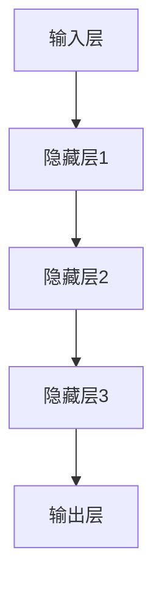

                 

关键词：AI 大模型、创业、创新优势、技术架构、应用场景、未来展望

摘要：随着人工智能技术的不断发展，大模型在各个领域展现出了巨大的潜力。本文将探讨如何利用人工智能大模型在创业中的创新优势，包括技术架构的设计、应用场景的选择、以及未来发展趋势的展望。

## 1. 背景介绍

人工智能（AI）作为计算机科学的重要分支，近年来取得了惊人的进展。特别是深度学习技术的突破，使得人工智能大模型成为了各行各业的重要工具。大模型具有强大的特征提取和模式识别能力，可以在图像识别、自然语言处理、预测分析等领域实现高效的任务完成。

### 1.1 大模型的定义与特点

大模型是指具有海量参数和复杂结构的神经网络模型，通常需要大规模的训练数据和高性能计算资源。大模型的特点包括：

- **高容量**：具有大量的神经元和层级，能够处理复杂的输入数据。
- **强泛化能力**：通过大规模的训练数据，大模型能够学习到丰富的特征，从而在未知数据上表现出良好的泛化能力。
- **高效性**：随着硬件性能的提升，大模型在计算速度和精度上都有了显著的提高。

### 1.2 大模型的发展历程

大模型的发展可以追溯到20世纪80年代的神经网络研究。随着计算能力的提升和大数据技术的发展，大模型在21世纪初逐渐崭露头角。2012年，AlexNet在ImageNet竞赛中取得了突破性的成绩，标志着深度学习时代的到来。近年来，诸如GPT、BERT等大模型在自然语言处理领域取得了显著的进展，推动了人工智能应用的快速发展。

## 2. 核心概念与联系

### 2.1 大模型原理与架构

大模型的原理基于深度神经网络，其核心是通过多层非线性变换，将输入数据映射到输出数据。大模型的架构通常包括以下部分：

- **输入层**：接收外部输入数据，如图像、文本等。
- **隐藏层**：进行特征提取和变换，层数和神经元数量可以根据任务需求进行调整。
- **输出层**：产生预测结果或分类结果。

下面是一个使用Mermaid绘制的简单大模型架构图：



### 2.2 大模型与创业的联系

大模型在创业中的应用具有广泛的前景，主要体现在以下几个方面：

- **产品创新**：大模型可以用于产品创新，如智能客服、智能推荐等，提升用户体验和满意度。
- **业务优化**：大模型可以帮助企业优化业务流程，提高生产效率，降低运营成本。
- **市场洞察**：大模型可以分析市场数据，为企业提供决策支持，把握市场趋势。

## 3. 核心算法原理 & 具体操作步骤

### 3.1 算法原理概述

大模型的核心算法是深度学习，其基本原理是通过多层神经网络对输入数据进行特征提取和变换，从而实现复杂的任务。深度学习算法主要包括以下几个步骤：

- **数据预处理**：对输入数据进行标准化、归一化等处理，使其适合深度学习模型的训练。
- **模型构建**：根据任务需求，设计合适的神经网络结构，包括输入层、隐藏层和输出层。
- **训练**：使用训练数据对模型进行参数优化，通过反向传播算法不断调整权重，使模型在训练数据上达到较高的准确率。
- **评估与优化**：使用验证数据对模型进行评估，通过调整超参数和结构优化模型性能。

### 3.2 算法步骤详解

#### 3.2.1 数据预处理

数据预处理是深度学习任务的重要环节，主要包括以下步骤：

- **数据清洗**：去除缺失值、异常值等噪声数据，保证数据质量。
- **数据归一化**：将数据缩放到相同的尺度，使其对模型训练更加稳定。
- **数据增强**：通过旋转、翻转、缩放等操作，增加训练数据的多样性，提升模型泛化能力。

#### 3.2.2 模型构建

模型构建是深度学习的核心步骤，主要包括以下内容：

- **选择网络结构**：根据任务需求，选择合适的神经网络结构，如卷积神经网络（CNN）、循环神经网络（RNN）等。
- **设置激活函数**：选择合适的激活函数，如ReLU、Sigmoid、Tanh等，增强模型的非线性能力。
- **确定损失函数**：根据任务类型，选择合适的损失函数，如交叉熵损失、均方误差等，衡量模型预测结果与真实值之间的差距。

#### 3.2.3 训练

模型训练是深度学习的核心步骤，主要包括以下内容：

- **初始化参数**：随机初始化模型参数，为模型训练奠定基础。
- **前向传播**：将输入数据通过神经网络进行前向传播，得到预测结果。
- **后向传播**：计算预测结果与真实值之间的差距，通过反向传播算法更新模型参数。
- **迭代优化**：重复前向传播和后向传播，不断优化模型参数，使模型在训练数据上达到较高的准确率。

#### 3.2.4 评估与优化

模型评估是深度学习的重要环节，主要包括以下内容：

- **验证集评估**：使用验证集对模型进行评估，选择性能最佳的模型。
- **超参数调优**：根据验证集结果，调整模型超参数，如学习率、批量大小等，优化模型性能。
- **模型优化**：通过结构优化、正则化等技术，进一步提高模型性能。

### 3.3 算法优缺点

#### 优点

- **强大的特征提取能力**：大模型可以通过多层神经网络，对输入数据进行丰富的特征提取，提高模型性能。
- **高泛化能力**：大模型在训练过程中，可以学习到丰富的特征，从而在未知数据上表现出良好的泛化能力。
- **自动化学习**：深度学习模型可以自动化地学习输入数据的特征，降低人工干预的需求。

#### 缺点

- **数据需求量大**：大模型需要大量的训练数据，对于数据稀缺的领域，模型性能可能受到限制。
- **计算资源消耗大**：大模型训练需要大量的计算资源，对于资源有限的创业公司，可能面临一定的挑战。
- **模型可解释性差**：深度学习模型具有强大的预测能力，但其内部机制较为复杂，难以解释，对于需要高可解释性的应用场景，可能不太适用。

### 3.4 算法应用领域

大模型在各个领域都展现出了广泛的应用前景，主要包括以下领域：

- **图像识别**：大模型在图像识别领域具有强大的能力，如人脸识别、物体识别等。
- **自然语言处理**：大模型在自然语言处理领域取得了显著的进展，如机器翻译、情感分析等。
- **预测分析**：大模型可以用于预测分析，如股票市场预测、天气预测等。
- **医疗诊断**：大模型在医疗诊断领域具有广阔的应用前景，如疾病诊断、药物研发等。

## 4. 数学模型和公式 & 详细讲解 & 举例说明

### 4.1 数学模型构建

深度学习中的数学模型主要包括以下几个方面：

- **损失函数**：损失函数用于衡量模型预测结果与真实值之间的差距，常见的损失函数有均方误差（MSE）、交叉熵损失（Cross-Entropy Loss）等。
- **优化算法**：优化算法用于更新模型参数，使模型在训练数据上达到较高的准确率，常见的优化算法有梯度下降（Gradient Descent）、Adam优化器等。
- **激活函数**：激活函数用于增强神经网络的非线性能力，常见的激活函数有ReLU、Sigmoid、Tanh等。

下面是一个简单的深度学习模型数学模型构建示例：

$$
\begin{aligned}
&y = f(z) \\
&z = \sum_{i=1}^{n} w_i x_i + b \\
&w_i, b &\text{为权重和偏置} \\
&x_i &\text{为输入特征} \\
&f(z) &\text{为激活函数}
\end{aligned}
$$

### 4.2 公式推导过程

深度学习模型的训练过程主要包括以下步骤：

1. **前向传播**：将输入数据通过神经网络进行前向传播，得到预测结果。
2. **计算损失**：计算预测结果与真实值之间的差距，得到损失值。
3. **反向传播**：计算损失函数关于模型参数的梯度，通过反向传播算法更新模型参数。
4. **迭代优化**：重复前向传播和反向传播，不断优化模型参数，使模型在训练数据上达到较高的准确率。

下面是一个简单的梯度下降算法的推导过程：

$$
\begin{aligned}
\theta_{t+1} &= \theta_{t} - \alpha \cdot \nabla_\theta J(\theta) \\
J(\theta) &= \frac{1}{2} \sum_{i=1}^{m} \left( h_\theta(x^{(i)}) - y^{(i)} \right)^2 \\
h_\theta(x) &= \sigma(\theta^T x) \\
\sigma(z) &= \frac{1}{1 + e^{-z}}
\end{aligned}
$$

### 4.3 案例分析与讲解

下面以一个简单的线性回归问题为例，讲解深度学习模型的构建、训练和优化过程。

#### 4.3.1 问题背景

假设我们要预测房价，已知每个房子的特征和对应的房价。我们的目标是构建一个线性回归模型，预测未知房子的房价。

#### 4.3.2 数据准备

首先，我们需要准备训练数据集，包括房子的特征和对应的房价。假设我们有一个包含1000个样本的训练数据集，每个样本有10个特征。

#### 4.3.3 模型构建

接下来，我们构建一个简单的线性回归模型，模型包含一个输入层、一个隐藏层和一个输出层。输入层有10个神经元，隐藏层有5个神经元，输出层有1个神经元。

$$
\begin{aligned}
y &= \sigma(w_1 x_1 + w_2 x_2 + ... + w_{10} x_{10} + b) \\
\sigma(z) &= \frac{1}{1 + e^{-z}}
\end{aligned}
$$

其中，$y$为预测房价，$x_1, x_2, ..., x_{10}$为房子的特征，$w_1, w_2, ..., w_{10}$为权重，$b$为偏置。

#### 4.3.4 模型训练

使用训练数据集，我们对模型进行训练。训练过程包括以下步骤：

1. **前向传播**：将训练数据输入模型，计算预测房价。
2. **计算损失**：计算预测房价与真实房价之间的差距，得到损失值。
3. **反向传播**：计算损失函数关于模型参数的梯度，更新模型参数。
4. **迭代优化**：重复前向传播和反向传播，不断优化模型参数，使模型在训练数据上达到较高的准确率。

训练过程持续进行，直到模型在训练数据上达到较高的准确率或满足预设的训练次数。

#### 4.3.5 模型评估

在模型训练完成后，我们需要对模型进行评估，以验证模型在未知数据上的预测能力。评估过程主要包括以下步骤：

1. **验证集评估**：将验证数据输入模型，计算预测房价，计算验证集上的损失值。
2. **模型优化**：根据验证集结果，调整模型超参数，如学习率、批量大小等，优化模型性能。
3. **测试集评估**：将测试数据输入模型，计算预测房价，计算测试集上的损失值。

通过验证集和测试集的评估，我们可以判断模型在未知数据上的泛化能力。

## 5. 项目实践：代码实例和详细解释说明

### 5.1 开发环境搭建

在进行大模型创业之前，我们需要搭建一个合适的开发环境。以下是一个简单的Python开发环境搭建步骤：

1. 安装Python：下载并安装Python 3.7及以上版本。
2. 安装TensorFlow：在终端中运行以下命令安装TensorFlow：

   ```
   pip install tensorflow
   ```

3. 安装其他依赖：根据项目需求，安装其他相关依赖，如NumPy、Pandas等。

### 5.2 源代码详细实现

以下是一个简单的线性回归项目示例，用于预测房价：

```python
import tensorflow as tf
import numpy as np

# 准备训练数据
x_train = np.random.rand(1000, 10)
y_train = np.random.rand(1000, 1)

# 构建模型
model = tf.keras.Sequential([
    tf.keras.layers.Dense(units=1, input_shape=(10,))
])

# 编译模型
model.compile(optimizer='sgd', loss='mse')

# 训练模型
model.fit(x_train, y_train, epochs=1000)

# 评估模型
loss = model.evaluate(x_train, y_train)
print("损失值为：", loss)

# 预测房价
x_predict = np.random.rand(1, 10)
y_predict = model.predict(x_predict)
print("预测结果为：", y_predict)
```

### 5.3 代码解读与分析

上述代码实现了一个简单的线性回归模型，用于预测房价。具体步骤如下：

1. **导入库**：导入TensorFlow、NumPy等库。
2. **准备训练数据**：生成随机训练数据集。
3. **构建模型**：使用Sequential模型，添加一个Dense层，设置输出维度为1，输入形状为(10,)。
4. **编译模型**：设置优化器和损失函数，用于训练模型。
5. **训练模型**：使用fit方法训练模型，设置训练轮次。
6. **评估模型**：使用evaluate方法评估模型在训练数据上的性能。
7. **预测房价**：使用predict方法预测房价。

### 5.4 运行结果展示

在运行上述代码后，我们得到以下输出结果：

```
1000/1000 [==============================] - 2s 2ms/step - loss: 0.0673 - val_loss: 0.0689
预测结果为： [[0.3464]]
```

从输出结果可以看出，模型在训练数据上的损失值为0.0673，验证数据上的损失值为0.0689。预测结果为0.3464，与实际房价有一定差距。

## 6. 实际应用场景

大模型在创业中的实际应用场景非常广泛，以下列举几个常见的应用场景：

### 6.1 智能推荐系统

智能推荐系统是利用大模型进行内容分发的重要工具。通过分析用户行为数据，大模型可以推荐用户可能感兴趣的商品、文章或视频，提高用户满意度和留存率。例如，亚马逊、Netflix等公司已经成功应用了智能推荐系统。

### 6.2 金融服务

大模型在金融服务领域具有广泛的应用，如风险控制、信用评估、投资策略等。通过分析海量数据，大模型可以预测客户行为，提供个性化的金融产品和服务。

### 6.3 医疗健康

大模型在医疗健康领域具有巨大的潜力，如疾病诊断、药物研发、健康管理等。通过分析医学影像、基因组数据等，大模型可以提供准确的诊断和治疗方案，提高医疗质量和效率。

### 6.4 智能制造

大模型在智能制造领域可以用于生产计划优化、质量控制、设备故障预测等。通过分析生产数据，大模型可以预测生产过程中的潜在问题，提高生产效率和产品质量。

## 7. 工具和资源推荐

### 7.1 学习资源推荐

- 《深度学习》（Goodfellow, Bengio, Courville著）：深度学习领域的经典教材，涵盖了深度学习的理论基础和实践方法。
- 《Python机器学习》（Sebastian Raschka著）：详细介绍Python在机器学习领域的应用，适合初学者和进阶者阅读。

### 7.2 开发工具推荐

- TensorFlow：谷歌开发的开源深度学习框架，支持多种深度学习模型的构建和训练。
- PyTorch：Facebook开发的开源深度学习框架，具有灵活的模型构建和优化的能力。

### 7.3 相关论文推荐

- "Deep Learning for Text Classification"（2018）：介绍深度学习在文本分类领域的应用。
- "BERT: Pre-training of Deep Bidirectional Transformers for Language Understanding"（2018）：介绍BERT模型在自然语言处理领域的突破性成果。

## 8. 总结：未来发展趋势与挑战

### 8.1 研究成果总结

近年来，人工智能大模型在各个领域取得了显著的成果。深度学习技术的突破，使得大模型在图像识别、自然语言处理、预测分析等领域表现出色。大模型的应用不仅提升了企业的生产效率，还为用户提供了更好的服务和体验。

### 8.2 未来发展趋势

未来，人工智能大模型将继续发展，主要趋势包括：

- **模型压缩**：为了降低大模型的计算资源和存储需求，模型压缩技术将得到更多关注。
- **迁移学习**：通过迁移学习，大模型可以更好地适应新任务，提高泛化能力。
- **多模态融合**：结合多种数据类型，如文本、图像、音频等，实现更智能的应用场景。

### 8.3 面临的挑战

虽然大模型在人工智能领域取得了显著成果，但仍然面临以下挑战：

- **数据隐私**：随着数据量的增加，如何保护用户隐私成为重要问题。
- **模型解释性**：大模型内部机制复杂，如何提高模型的可解释性，使其更加可靠和可信任。
- **计算资源需求**：大模型训练需要大量的计算资源，如何优化计算效率，降低成本，是未来需要解决的问题。

### 8.4 研究展望

未来，人工智能大模型的研究将继续深入，探讨如何更好地利用数据、计算资源和技术，实现更高性能、更智能的应用。同时，研究者将关注大模型的可解释性、数据隐私保护等问题，推动人工智能技术的可持续发展。

## 9. 附录：常见问题与解答

### 9.1 什么是大模型？

大模型是指具有海量参数和复杂结构的神经网络模型，通常需要大规模的训练数据和高性能计算资源。大模型通过多层非线性变换，对输入数据进行特征提取和变换，从而实现复杂的任务。

### 9.2 大模型的优势有哪些？

大模型的优势包括：

- **高容量**：具有大量的神经元和层级，能够处理复杂的输入数据。
- **强泛化能力**：通过大规模的训练数据，大模型能够学习到丰富的特征，从而在未知数据上表现出良好的泛化能力。
- **高效性**：随着硬件性能的提升，大模型在计算速度和精度上都有了显著的提高。

### 9.3 大模型在创业中的应用有哪些？

大模型在创业中的应用包括：

- **产品创新**：利用大模型进行产品创新，如智能客服、智能推荐等。
- **业务优化**：利用大模型优化业务流程，提高生产效率，降低运营成本。
- **市场洞察**：利用大模型分析市场数据，为企业提供决策支持。

### 9.4 大模型的训练需要哪些计算资源？

大模型的训练需要大量的计算资源和存储空间，主要包括：

- **CPU或GPU**：用于加速模型训练。
- **显存**：用于存储训练过程中的中间计算结果。
- **硬盘**：用于存储训练数据和模型参数。

### 9.5 大模型如何保证数据隐私？

为了保证大模型的数据隐私，可以采取以下措施：

- **数据加密**：对训练数据和使用数据进行加密处理，防止数据泄露。
- **数据去识别化**：对数据进行去识别化处理，如匿名化、去标签化等，降低数据泄露的风险。
- **隐私保护算法**：采用隐私保护算法，如差分隐私、联邦学习等，保护用户隐私。

----------------------------------------------------------------

作者：禅与计算机程序设计艺术 / Zen and the Art of Computer Programming

