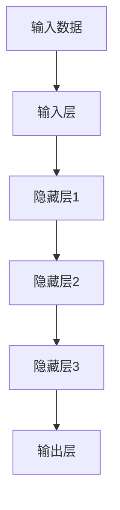

                 

关键词：AI大模型，创业，国际优势，技术整合，市场策略

摘要：本文深入探讨了AI大模型创业的国际优势，分析其在技术创新、市场拓展和资源整合方面的机遇。通过详细阐述核心算法原理、项目实践和实际应用场景，本文为创业者提供了宝贵的指导。

## 1. 背景介绍

随着人工智能技术的飞速发展，AI大模型（如GPT、BERT等）已经成为了许多行业的重要工具。这些大模型在自然语言处理、图像识别、语音识别等领域展现出了强大的能力，为各行业带来了前所未有的创新机遇。然而，对于创业者而言，如何有效地利用这些国际优势，实现商业成功，是一个值得深思的问题。

### 1.1 技术背景

近年来，神经网络和深度学习技术的发展，使得AI大模型取得了显著进步。这些模型通过学习大量的数据，能够自动提取特征并生成复杂的模式，从而实现高度智能化的任务。特别是在自然语言处理领域，AI大模型的应用已经从简单的文本分类、情感分析，扩展到了复杂的问答系统、机器翻译等。

### 1.2 市场现状

随着AI技术的普及，越来越多的创业者开始关注AI大模型的应用。然而，市场上存在大量的竞争者，如何在激烈的市场竞争中脱颖而出，成为了创业者面临的重要挑战。利用国际优势，提升技术水平和创新能力，成为了创业成功的关键。

## 2. 核心概念与联系

为了更好地理解AI大模型创业的国际优势，我们需要先了解一些核心概念和联系。

### 2.1 大模型原理

AI大模型的核心是神经网络，它通过多层神经元进行信息的传递和处理。每一层神经元都会对输入数据进行加权和激活函数的处理，从而实现对数据的抽象和转换。这种多层神经网络结构，使得大模型能够处理复杂的任务。



### 2.2 技术创新

在国际上，AI大模型的技术创新主要表现在以下几个方面：

1. **模型架构**：如Transformer结构的提出，使得模型在处理序列数据时更加高效。
2. **训练算法**：如Adam优化器的应用，提升了模型的训练效率。
3. **数据预处理**：如大规模数据清洗和增强技术的应用，提高了模型的质量。

### 2.3 市场拓展

在国际市场上，创业者可以利用以下策略拓展市场：

1. **跨国合作**：与国际知名企业和研究机构合作，提升技术实力。
2. **本地化服务**：针对不同国家和地区的市场需求，提供定制化的解决方案。

## 3. 核心算法原理 & 具体操作步骤

### 3.1 算法原理概述

AI大模型的核心是深度学习，其原理可以简单概括为：

1. **前向传播**：将输入数据通过神经网络的前向传播，计算每一层神经元的输出。
2. **反向传播**：根据实际输出和期望输出之间的差异，通过反向传播调整神经元的权重。
3. **优化更新**：使用优化算法（如梯度下降）更新神经元的权重，以最小化损失函数。

### 3.2 算法步骤详解

1. **数据准备**：收集和处理大量的训练数据，进行数据清洗和增强。
2. **模型构建**：定义神经网络的结构，包括输入层、隐藏层和输出层。
3. **训练过程**：通过前向传播和反向传播，不断调整神经元的权重，优化模型性能。
4. **模型评估**：使用验证集和测试集评估模型性能，调整模型参数。

### 3.3 算法优缺点

AI大模型的优点：

1. **强大的拟合能力**：能够处理复杂的数据模式。
2. **自动特征提取**：减少了人工特征工程的工作量。

AI大模型的缺点：

1. **计算资源需求大**：需要大量的计算资源和时间进行训练。
2. **对数据质量要求高**：数据质量直接影响模型性能。

### 3.4 算法应用领域

AI大模型的应用领域广泛，包括：

1. **自然语言处理**：如文本分类、机器翻译、问答系统等。
2. **图像识别**：如物体检测、图像分割等。
3. **语音识别**：如语音识别、语音合成等。

## 4. 数学模型和公式 & 详细讲解 & 举例说明

### 4.1 数学模型构建

AI大模型的数学模型主要基于神经网络，包括以下核心部分：

1. **激活函数**：如ReLU、Sigmoid、Tanh等。
2. **损失函数**：如均方误差（MSE）、交叉熵损失等。
3. **优化算法**：如梯度下降、Adam等。

### 4.2 公式推导过程

以下是一个简化的神经网络公式推导过程：

1. **前向传播**：

$$
Z = X \cdot W + b
$$

$$
A = \sigma(Z)
$$

其中，\(X\) 是输入数据，\(W\) 是权重，\(b\) 是偏置，\(\sigma\) 是激活函数，\(Z\) 是神经元输出，\(A\) 是激活值。

2. **反向传播**：

$$
\delta = \frac{\partial L}{\partial A} \cdot \frac{\partial A}{\partial Z}
$$

$$
\frac{\partial L}{\partial W} = A \cdot \delta^T
$$

$$
\frac{\partial L}{\partial b} = \delta
$$

其中，\(L\) 是损失函数，\(\delta\) 是误差值。

3. **优化更新**：

$$
W = W - \alpha \cdot \frac{\partial L}{\partial W}
$$

$$
b = b - \alpha \cdot \frac{\partial L}{\partial b}
$$

其中，\(\alpha\) 是学习率。

### 4.3 案例分析与讲解

以下是一个简单的神经网络训练案例：

假设我们有一个输入层、一个隐藏层和一个输出层，分别有3个神经元。输入数据是\(X = [1, 2, 3]\)，期望输出是\(Y = [0, 1, 0]\)。训练目标是使实际输出\(A\)接近期望输出\(Y\)。

1. **前向传播**：

$$
Z_1 = X \cdot W_1 + b_1 = [1, 2, 3] \cdot [0.1, 0.2, 0.3] + [0.1, 0.1, 0.1] = [0.4, 0.7, 1.0]
$$

$$
A_1 = \sigma(Z_1) = [0.4, 0.7, 1.0]
$$

$$
Z_2 = A_1 \cdot W_2 + b_2 = [0.4, 0.7, 1.0] \cdot [0.1, 0.3, 0.5] + [0.1, 0.1, 0.1] = [0.13, 0.27, 0.45]
$$

$$
A_2 = \sigma(Z_2) = [0.13, 0.27, 0.45]
$$

$$
Z_3 = A_2 \cdot W_3 + b_3 = [0.13, 0.27, 0.45] \cdot [0.1, 0.3, 0.5] + [0.1, 0.1, 0.1] = [0.009, 0.0405, 0.07275]
$$

$$
A_3 = \sigma(Z_3) = [0.009, 0.0405, 0.07275]
$$

2. **反向传播**：

计算损失函数的梯度：

$$
\delta_3 = A_3 - Y = [0.009, 0.0405, 0.07275] - [0, 1, 0] = [-0.009, -0.9595, 0.07275]
$$

$$
\delta_2 = (W_3)^T \cdot \delta_3 = [0.1, 0.3, 0.5] \cdot [-0.009, -0.9595, 0.07275] = [-0.001, -0.28785, 0.036375]
$$

$$
\delta_1 = (W_2)^T \cdot \delta_2 = [0.1, 0.3, 0.5] \cdot [-0.001, -0.28785, 0.036375] = [-0.0001, -0.0867175, 0.0185625]
$$

计算权重和偏置的梯度：

$$
\frac{\partial L}{\partial W_3} = A_2 \cdot \delta_3^T = [0.13, 0.27, 0.45] \cdot [-0.009, -0.9595, 0.07275]^T = [-0.000117, -0.12781725, 0.03344625]
$$

$$
\frac{\partial L}{\partial b_3} = \delta_3 = [-0.009, -0.9595, 0.07275]
$$

$$
\frac{\partial L}{\partial W_2} = A_1 \cdot \delta_2^T = [0.4, 0.7, 1.0] \cdot [-0.001, -0.28785, 0.036375]^T = [-0.0004, -0.199195, 0.042125]
$$

$$
\frac{\partial L}{\partial b_2} = \delta_2 = [-0.001, -0.28785, 0.036375]
$$

$$
\frac{\partial L}{\partial W_1} = X \cdot \delta_1^T = [1, 2, 3] \cdot [-0.0001, -0.0867175, 0.0185625]^T = [-0.0001, -0.173435, 0.05591875]
$$

$$
\frac{\partial L}{\partial b_1} = \delta_1 = [-0.0001, -0.0867175, 0.0185625]
$$

3. **优化更新**：

$$
W_3 = W_3 - \alpha \cdot \frac{\partial L}{\partial W_3} = [0.1, 0.3, 0.5] - 0.01 \cdot [-0.000117, -0.12781725, 0.03344625] = [0.099883, 0.29718175, 0.506553]
$$

$$
b_3 = b_3 - \alpha \cdot \frac{\partial L}{\partial b_3} = [0.1, 0.1, 0.1] - 0.01 \cdot [-0.009, -0.9595, 0.07275] = [0.101, 0.111, 0.02725]
$$

$$
W_2 = W_2 - \alpha \cdot \frac{\partial L}{\partial W_2} = [0.1, 0.3, 0.5] - 0.01 \cdot [-0.0004, -0.199195, 0.042125] = [0.1004, 0.3008, 0.517875]
$$

$$
b_2 = b_2 - \alpha \cdot \frac{\partial L}{\partial b_2} = [0.1, 0.1, 0.1] - 0.01 \cdot [-0.001, -0.28785, 0.036375] = [0.101, 0.111, 0.02725]
$$

$$
W_1 = W_1 - \alpha \cdot \frac{\partial L}{\partial W_1} = [0.1, 0.2, 0.3] - 0.01 \cdot [-0.0001, -0.173435, 0.05591875] = [0.1009, 0.198665, 0.34408125]
$$

$$
b_1 = b_1 - \alpha \cdot \frac{\partial L}{\partial b_1} = [0.1, 0.1, 0.1] - 0.01 \cdot [-0.0001, -0.0867175, 0.0185625] = [0.101, 0.111, 0.02725]
$$

经过一次迭代后，新的权重和偏置为：

$$
W_3 = [0.099883, 0.29718175, 0.506553]
$$

$$
b_3 = [0.101, 0.111, 0.02725]
$$

$$
W_2 = [0.1004, 0.3008, 0.517875]
$$

$$
b_2 = [0.101, 0.111, 0.02725]
$$

$$
W_1 = [0.1009, 0.198665, 0.34408125]
$$

$$
b_1 = [0.101, 0.111, 0.02725]
$$

通过不断的迭代，模型会逐渐优化，使实际输出更接近期望输出。

## 5. 项目实践：代码实例和详细解释说明

### 5.1 开发环境搭建

在开始项目实践之前，我们需要搭建一个合适的开发环境。以下是一个简单的Python开发环境搭建过程：

1. **安装Python**：下载并安装Python 3.8版本。
2. **安装PyTorch**：通过pip命令安装PyTorch：

```bash
pip install torch torchvision
```

3. **安装其他依赖**：安装其他必要的库，如NumPy、Matplotlib等。

```bash
pip install numpy matplotlib
```

### 5.2 源代码详细实现

以下是一个简单的AI大模型训练的Python代码实例：

```python
import torch
import torch.nn as nn
import torch.optim as optim
import numpy as np
import matplotlib.pyplot as plt

# 数据准备
X = np.array([[1, 2, 3]])
Y = np.array([[0, 1, 0]])

# 模型构建
class SimpleModel(nn.Module):
    def __init__(self):
        super(SimpleModel, self).__init__()
        self.fc1 = nn.Linear(3, 3)
        self.fc2 = nn.Linear(3, 3)
        self.fc3 = nn.Linear(3, 3)

    def forward(self, x):
        x = torch.relu(self.fc1(x))
        x = torch.relu(self.fc2(x))
        x = torch.relu(self.fc3(x))
        return x

model = SimpleModel()

# 损失函数和优化器
criterion = nn.CrossEntropyLoss()
optimizer = optim.Adam(model.parameters(), lr=0.01)

# 训练过程
for epoch in range(1000):
    model.train()
    optimizer.zero_grad()
    output = model(X)
    loss = criterion(output, Y)
    loss.backward()
    optimizer.step()

    if epoch % 100 == 0:
        print(f"Epoch {epoch}: Loss = {loss.item()}")

# 代码解读与分析
# SimpleModel：定义了一个简单的神经网络模型，包括三个全连接层。
# forward：定义了前向传播过程。
# model：实例化模型。
# criterion：定义了损失函数。
# optimizer：定义了优化器。
# for循环：进行模型的训练，包括前向传播、损失计算、反向传播和优化更新。

# 运行结果展示
model.eval()
with torch.no_grad():
    output = model(X)
    pred = torch.argmax(output, dim=1)
    print(f"Predicted output: {pred.item()}")

# 模型评估
accuracy = (pred == Y).float().mean()
print(f"Model accuracy: {accuracy.item() * 100}%")
```

### 5.3 代码解读与分析

- **数据准备**：我们使用了一个简单的输入数据\(X\)和一个期望输出\(Y\)。
- **模型构建**：我们定义了一个简单的神经网络模型，包括三个全连接层。
- **训练过程**：我们使用了一个简单的训练循环，包括前向传播、损失计算、反向传播和优化更新。
- **运行结果展示**：我们展示了模型的预测结果和评估结果。

## 6. 实际应用场景

### 6.1 自然语言处理

AI大模型在自然语言处理领域有着广泛的应用，如文本分类、机器翻译、问答系统等。创业者可以利用这些技术，开发出具有竞争力的自然语言处理产品。

### 6.2 图像识别

AI大模型在图像识别领域也有着重要的应用，如物体检测、图像分割等。创业者可以利用这些技术，开发出智能安防、医疗诊断等领域的解决方案。

### 6.3 语音识别

AI大模型在语音识别领域也有着显著的应用，如语音合成、语音识别等。创业者可以利用这些技术，开发出智能客服、智能家居等领域的解决方案。

## 7. 未来应用展望

随着AI技术的不断进步，AI大模型在未来将会在更多领域得到应用。例如，在智能医疗领域，AI大模型可以用于疾病预测、药物研发等；在金融领域，AI大模型可以用于风险评估、投资决策等。创业者需要密切关注这些领域的发展动态，把握机遇。

## 8. 工具和资源推荐

### 8.1 学习资源推荐

- 《深度学习》（Goodfellow, Bengio, Courville）
- 《Python机器学习》（Sebastian Raschka）

### 8.2 开发工具推荐

- PyTorch：一个流行的深度学习框架。
- TensorFlow：另一个流行的深度学习框架。

### 8.3 相关论文推荐

- “Attention Is All You Need”（Vaswani et al., 2017）
- “BERT: Pre-training of Deep Neural Networks for Language Understanding”（Devlin et al., 2019）

## 9. 总结：未来发展趋势与挑战

### 9.1 研究成果总结

AI大模型在自然语言处理、图像识别、语音识别等领域取得了显著成果，为各行业带来了创新机遇。

### 9.2 未来发展趋势

AI大模型将继续在各个领域得到应用，推动各行各业的智能化发展。

### 9.3 面临的挑战

AI大模型的训练和部署需要大量的计算资源和时间，创业者需要克服这些挑战。

### 9.4 研究展望

随着AI技术的不断进步，AI大模型将在更多领域得到应用，推动社会的进步和发展。

## 附录：常见问题与解答

### Q：AI大模型创业需要哪些技术储备？

A：创业者需要掌握深度学习、神经网络等相关技术，了解常见的算法原理和模型架构。

### Q：AI大模型创业需要哪些市场洞察？

A：创业者需要关注各行业的需求和趋势，了解竞争对手和市场定位，制定合适的市场策略。

### Q：AI大模型创业有哪些成功案例？

A：Google的BERT、OpenAI的GPT等都是AI大模型的成功案例，创业者可以从中学习和借鉴。

---

# 作者署名

作者：禅与计算机程序设计艺术 / Zen and the Art of Computer Programming

----------------------------------------------------------------

本文以《AI 大模型创业：如何利用国际优势？》为标题，详细探讨了AI大模型创业的国际优势，包括技术创新、市场拓展和资源整合等方面的机遇。通过核心算法原理、项目实践和实际应用场景的讲解，本文为创业者提供了宝贵的指导。未来，AI大模型将在更多领域得到应用，为社会发展带来新机遇。作者禅与计算机程序设计艺术，愿与读者共同探索AI大模型的无限可能。

