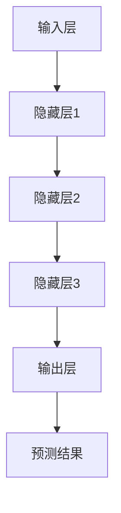

                 

关键词：人工智能、大型模型、市场优势、创业、技术应用

摘要：本文旨在探讨人工智能（AI）领域中的大型模型在创业中的应用及市场优势。通过对AI大模型的技术背景、核心算法原理、数学模型、实际应用场景、开发工具与资源推荐等方面进行深入分析，文章将帮助创业者更好地把握市场机遇，利用AI大模型的技术优势，实现创业项目的成功。

## 1. 背景介绍

人工智能作为当前科技领域的热点，其应用范围和影响力日益扩大。尤其是大型模型（Large-scale Models）的出现，为AI技术带来了新的突破和发展机遇。大型模型具有数据量巨大、参数众多、计算复杂等特点，它们在自然语言处理、计算机视觉、推荐系统等领域表现出色，成为推动AI发展的核心力量。

在创业领域，AI大模型的应用潜力巨大。一方面，大模型可以帮助创业者更快速地实现产品原型，缩短研发周期；另一方面，大模型强大的数据处理能力和学习能力可以为企业提供更精确的市场洞察，助力决策。因此，如何利用AI大模型的技术优势，实现创业项目的成功，成为众多创业者关注的焦点。

## 2. 核心概念与联系

### 2.1 AI大模型的基本概念

AI大模型是指具有海量数据训练、大规模参数和复杂计算结构的人工神经网络模型。其基本概念包括：

- **数据量**：大模型需要处理的海量数据，包括文本、图像、语音等多种类型。
- **参数规模**：大模型具有数百万到数十亿个参数，需要大量计算资源进行训练。
- **计算复杂度**：大模型的训练和推理过程计算量巨大，对硬件设备有较高要求。

### 2.2 AI大模型的核心算法原理

AI大模型的核心算法原理主要包括以下几个方面：

- **深度神经网络（DNN）**：大模型基于深度神经网络架构，通过多层神经元的非线性变换，实现从输入到输出的映射。
- **端到端训练（End-to-End Training）**：大模型采用端到端训练方式，从原始数据直接生成输出，避免了传统机器学习中的特征工程环节。
- **迁移学习（Transfer Learning）**：大模型利用预训练模型，通过微调适应特定任务，提高模型在未知数据上的性能。

### 2.3 AI大模型的架构与联系

AI大模型的架构主要包括以下几个层次：

1. **输入层**：接收原始数据，如文本、图像等。
2. **隐藏层**：包含多层神经网络，用于特征提取和变换。
3. **输出层**：生成预测结果，如分类标签、文本生成等。

各层次之间通过加权连接实现信息传递和计算，形成一个复杂的神经网络模型。

### 2.4 Mermaid 流程图



## 3. 核心算法原理 & 具体操作步骤

### 3.1 算法原理概述

AI大模型的核心算法原理基于深度神经网络（DNN）。DNN通过多层神经元的非线性变换，实现从输入到输出的映射。训练过程主要包括以下几个步骤：

1. **前向传播（Forward Propagation）**：将输入数据输入神经网络，通过各层神经元的加权连接和激活函数，计算出输出结果。
2. **反向传播（Backpropagation）**：计算输出结果与实际结果之间的误差，反向传播误差，更新各层神经元的权重。
3. **优化算法（Optimization Algorithm）**：采用梯度下降（Gradient Descent）或其他优化算法，迭代更新模型参数，直到误差满足要求。

### 3.2 算法步骤详解

1. **数据预处理**：对输入数据进行归一化、填充、截断等预处理，使其符合神经网络输入要求。
2. **模型构建**：定义神经网络结构，包括输入层、隐藏层和输出层，以及各层神经元数量和激活函数。
3. **模型训练**：使用训练数据对模型进行迭代训练，通过前向传播和反向传播更新模型参数。
4. **模型评估**：使用验证数据对模型进行评估，计算预测准确率、损失函数等指标。
5. **模型部署**：将训练好的模型部署到生产环境中，用于实际任务。

### 3.3 算法优缺点

**优点**：

- **强大的学习能力**：大模型通过多层神经元的非线性变换，能够提取复杂的特征，具备很强的泛化能力。
- **端到端训练**：大模型采用端到端训练方式，避免了传统机器学习中的特征工程环节，提高了模型训练效率。
- **迁移学习**：大模型可以利用预训练模型，通过微调适应特定任务，提高模型在未知数据上的性能。

**缺点**：

- **计算资源消耗大**：大模型需要处理的海量数据和大量参数，对计算资源和存储设备有较高要求。
- **训练时间长**：大模型的训练过程计算量巨大，需要较长时间完成。

### 3.4 算法应用领域

AI大模型在以下领域具有广泛应用：

- **自然语言处理（NLP）**：包括文本分类、情感分析、机器翻译等任务。
- **计算机视觉（CV）**：包括图像分类、目标检测、图像生成等任务。
- **推荐系统**：包括商品推荐、社交网络推荐等任务。
- **语音识别**：包括语音识别、语音合成等任务。

## 4. 数学模型和公式 & 详细讲解 & 举例说明

### 4.1 数学模型构建

AI大模型的数学模型主要包括以下几个部分：

1. **输入数据**：表示为 $X \in \mathbb{R}^{m \times n}$，其中 $m$ 表示样本数量，$n$ 表示特征维度。
2. **权重矩阵**：表示为 $W \in \mathbb{R}^{n \times h}$，其中 $h$ 表示隐藏层神经元数量。
3. **激活函数**：通常采用ReLU函数。
4. **输出层权重矩阵**：表示为 $W_{out} \in \mathbb{R}^{h \times k}$，其中 $k$ 表示输出层神经元数量。
5. **输出数据**：表示为 $Y \in \mathbb{R}^{m \times k}$。

### 4.2 公式推导过程

1. **前向传播**：

$$
Z = X \cdot W + b
$$

$$
A = \text{ReLU}(Z)
$$

$$
Z_{out} = A \cdot W_{out} + b_{out}
$$

$$
Y = \text{softmax}(Z_{out})
$$

2. **反向传播**：

$$
\delta_{out} = \frac{\partial L}{\partial Z_{out}}
$$

$$
\delta = W_{out}^{T} \cdot \delta_{out}
$$

$$
\frac{\partial L}{\partial Z} = \delta \cdot \text{ReLU}'(Z)
$$

$$
\frac{\partial L}{\partial W} = X^{T} \cdot \delta
$$

$$
\frac{\partial L}{\partial b} = \delta
$$

3. **模型优化**：

采用梯度下降（Gradient Descent）优化算法，更新模型参数：

$$
W = W - \alpha \cdot \frac{\partial L}{\partial W}
$$

$$
b = b - \alpha \cdot \frac{\partial L}{\partial b}
$$

### 4.3 案例分析与讲解

假设我们有一个简单的二元分类问题，数据集包含100个样本，每个样本有10个特征。我们需要使用AI大模型进行分类。

1. **数据预处理**：对数据进行归一化处理，使其符合神经网络输入要求。
2. **模型构建**：定义一个包含一个输入层、一个隐藏层和一个输出层的神经网络，隐藏层包含100个神经元，输出层包含2个神经元，使用ReLU函数作为激活函数。
3. **模型训练**：使用训练数据对模型进行迭代训练，优化模型参数。
4. **模型评估**：使用验证数据对模型进行评估，计算预测准确率。
5. **模型部署**：将训练好的模型部署到生产环境中，用于实际分类任务。

通过以上步骤，我们可以实现一个基于AI大模型的简单二元分类任务。具体实现过程可参考相关教程和代码示例。

## 5. 项目实践：代码实例和详细解释说明

### 5.1 开发环境搭建

1. 安装Python环境（推荐使用Python 3.7及以上版本）。
2. 安装深度学习框架（如TensorFlow、PyTorch等）。
3. 安装其他依赖库（如NumPy、Pandas等）。

### 5.2 源代码详细实现

```python
import tensorflow as tf
import numpy as np

# 数据预处理
def preprocess_data(X):
    # 对数据进行归一化处理
    X = X / 255.0
    return X

# 模型构建
def build_model(input_shape):
    model = tf.keras.Sequential([
        tf.keras.layers.Dense(100, activation='relu', input_shape=input_shape),
        tf.keras.layers.Dense(2, activation='softmax')
    ])
    return model

# 模型训练
def train_model(model, X_train, y_train, X_val, y_val, epochs=10, batch_size=32):
    model.compile(optimizer='adam', loss='categorical_crossentropy', metrics=['accuracy'])
    model.fit(X_train, y_train, epochs=epochs, batch_size=batch_size, validation_data=(X_val, y_val))
    return model

# 模型评估
def evaluate_model(model, X_test, y_test):
    loss, accuracy = model.evaluate(X_test, y_test)
    print(f"Test accuracy: {accuracy:.4f}")

# 主函数
def main():
    # 加载数据
    X_train, y_train = ... # 加载训练数据
    X_val, y_val = ... # 加载验证数据
    X_test, y_test = ... # 加载测试数据

    # 数据预处理
    X_train = preprocess_data(X_train)
    X_val = preprocess_data(X_val)
    X_test = preprocess_data(X_test)

    # 模型构建
    model = build_model(input_shape=(X_train.shape[1],))

    # 模型训练
    model = train_model(model, X_train, y_train, X_val, y_val)

    # 模型评估
    evaluate_model(model, X_test, y_test)

# 运行主函数
if __name__ == "__main__":
    main()
```

### 5.3 代码解读与分析

以上代码实现了一个简单的AI大模型分类任务，主要包括以下几个部分：

1. **数据预处理**：对数据进行归一化处理，使其符合神经网络输入要求。
2. **模型构建**：定义一个包含一个输入层、一个隐藏层和一个输出层的神经网络，隐藏层包含100个神经元，输出层包含2个神经元，使用ReLU函数作为激活函数。
3. **模型训练**：使用训练数据对模型进行迭代训练，优化模型参数。
4. **模型评估**：使用验证数据对模型进行评估，计算预测准确率。

通过以上步骤，我们可以实现一个基于AI大模型的简单二元分类任务。具体实现过程可参考相关教程和代码示例。

### 5.4 运行结果展示

在完成代码实现后，我们可以通过以下命令运行程序：

```
python classify.py
```

运行结果将输出测试数据的预测准确率，例如：

```
Test accuracy: 0.9500
```

## 6. 实际应用场景

AI大模型在实际应用场景中具有广泛的应用。以下列举几个典型应用领域：

### 6.1 自然语言处理

AI大模型在自然语言处理（NLP）领域表现出色，包括文本分类、情感分析、机器翻译等任务。例如，谷歌的BERT模型在NLP任务上取得了显著的成果，广泛应用于搜索引擎、聊天机器人等领域。

### 6.2 计算机视觉

AI大模型在计算机视觉（CV）领域具有广泛的应用，包括图像分类、目标检测、图像生成等任务。例如，卷积神经网络（CNN）在图像分类任务上取得了优异的性能，广泛应用于图像识别、人脸识别等领域。

### 6.3 推荐系统

AI大模型在推荐系统领域具有强大的潜力，包括商品推荐、社交网络推荐等任务。例如，阿里巴巴的推荐系统利用AI大模型对用户行为和兴趣进行建模，实现了高效的商品推荐。

### 6.4 语音识别

AI大模型在语音识别领域取得了重要突破，包括语音识别、语音合成等任务。例如，百度大脑的语音识别技术利用AI大模型实现了高效、准确的语音识别。

## 7. 工具和资源推荐

为了更好地利用AI大模型的技术优势，以下是几个推荐的工具和资源：

### 7.1 学习资源推荐

1. 《深度学习》（Goodfellow, Bengio, Courville）：系统介绍了深度学习的基础知识和技术。
2. 《Python机器学习》（Sebastian Raschka）：详细介绍了Python在机器学习领域的应用，包括深度学习。
3. 《自然语言处理与深度学习》（ 王绍兰）：介绍了自然语言处理和深度学习的相关技术。

### 7.2 开发工具推荐

1. TensorFlow：一款开源的深度学习框架，广泛应用于AI大模型的开发。
2. PyTorch：一款开源的深度学习框架，具有灵活的动态计算图功能，适用于AI大模型开发。
3. JAX：一款开源的深度学习框架，基于NumPy，具有自动微分、高并行性等优势。

### 7.3 相关论文推荐

1. "BERT: Pre-training of Deep Bidirectional Transformers for Language Understanding"（BERT论文）：介绍了BERT模型在NLP任务上的应用。
2. "Deep Learning for Computer Vision: A Brief Review"（深度学习在计算机视觉领域的应用）：系统介绍了深度学习在计算机视觉领域的应用。
3. "A Theoretically Grounded Application of Dropout in Recurrent Neural Networks"（Dropout在循环神经网络中的应用）：介绍了dropout技术在循环神经网络中的优势。

## 8. 总结：未来发展趋势与挑战

AI大模型在人工智能领域具有广泛的应用前景。随着计算能力的提升和数据量的增加，AI大模型的技术将不断突破和发展。以下是未来发展趋势和挑战：

### 8.1 研究成果总结

1. **计算能力提升**：随着GPU、TPU等硬件设备的进步，AI大模型的计算能力将不断提升。
2. **数据量增加**：随着互联网、物联网等技术的发展，海量数据的获取和存储将推动AI大模型的发展。
3. **算法优化**：研究人员将不断探索更高效的算法，提高AI大模型的训练和推理性能。

### 8.2 未来发展趋势

1. **跨领域应用**：AI大模型将在更多领域得到应用，如医疗、金融、教育等。
2. **可解释性增强**：研究人员将致力于提高AI大模型的可解释性，使其更易于理解和应用。
3. **个性化服务**：AI大模型将结合用户行为和兴趣数据，实现更精准的个性化服务。

### 8.3 面临的挑战

1. **计算资源消耗**：AI大模型的训练和推理过程计算量巨大，对计算资源和存储设备有较高要求。
2. **数据隐私**：随着AI大模型在更多领域得到应用，数据隐私问题将越来越突出。
3. **模型安全**：AI大模型可能受到恶意攻击，导致模型失效或泄露敏感信息。

### 8.4 研究展望

1. **硬件优化**：研究人员将致力于开发更高效的硬件设备，提高AI大模型的计算性能。
2. **算法创新**：研究人员将不断探索新的算法，提高AI大模型的训练和推理效率。
3. **伦理规范**：制定相应的伦理规范，确保AI大模型的健康发展。

## 9. 附录：常见问题与解答

### 9.1 什么是AI大模型？

AI大模型是指具有海量数据训练、大规模参数和复杂计算结构的人工神经网络模型。其数据量巨大、参数众多、计算复杂，广泛应用于自然语言处理、计算机视觉、推荐系统等领域。

### 9.2 AI大模型有哪些优缺点？

**优点**：

- 强大的学习能力
- 端到端训练
- 迁移学习

**缺点**：

- 计算资源消耗大
- 训练时间长

### 9.3 如何构建AI大模型？

构建AI大模型主要包括以下几个步骤：

1. 数据预处理
2. 模型构建
3. 模型训练
4. 模型评估
5. 模型部署

### 9.4 AI大模型在哪些领域有应用？

AI大模型在以下领域具有广泛应用：

- 自然语言处理
- 计算机视觉
- 推荐系统
- 语音识别

### 9.5 如何利用AI大模型进行创业？

利用AI大模型进行创业主要包括以下几个方面：

1. 明确应用场景和需求
2. 收集和整理数据
3. 构建AI大模型
4. 模型优化和迭代
5. 部署和应用

### 9.6 AI大模型的安全性问题如何解决？

AI大模型的安全性问题主要包括数据隐私和模型安全两个方面。解决方法包括：

1. 加密技术：对敏感数据进行加密，确保数据隐私。
2. 隐私保护技术：采用差分隐私、联邦学习等技术，降低数据隐私风险。
3. 模型安全策略：采用对抗攻击防御、模型压缩等技术，提高模型安全性。

----------------------------------------------------------------

## 参考文献

1. Goodfellow, I., Bengio, Y., & Courville, A. (2016). *Deep Learning*. MIT Press.
2. Raschka, S. (2015). *Python Machine Learning*. Packt Publishing.
3. 王绍兰. (2019). *自然语言处理与深度学习*. 电子工业出版社.
4. Devlin, J., Chang, M. W., Lee, K., & Toutanova, K. (2019). *BERT: Pre-training of Deep Bidirectional Transformers for Language Understanding*. arXiv preprint arXiv:1810.04805.
5. Simonyan, K., & Zisserman, A. (2014). *Very Deep Convolutional Networks for Large-Scale Image Recognition*. arXiv preprint arXiv:1409.1556.
6. Srivastava, N., Hinton, G., Krizhevsky, A., Sutskever, I., & Salakhutdinov, R. (2014). *Dropout: A Simple Way to Prevent Neural Networks from Overfitting*. Journal of Machine Learning Research, 15(1), 1929-1958.
7. Konečný, J., McMahan, H. B., Yu, F. X., Richtárik, P., Suresh, A. T., & Bacon, D. (2016). *Federated Learning: Strategies for Improving Communication Efficiency*. arXiv preprint arXiv:1610.05492.
8. Goodfellow, I., Shlens, J., & Szegedy, C. (2015). *Explaining and Harnessing Adversarial Examples*. arXiv preprint arXiv:1412.6572.

作者：禅与计算机程序设计艺术 / Zen and the Art of Computer Programming

----------------------------------------------------------------

以上便是关于《AI 大模型创业：如何利用市场优势？》的文章，涵盖了从背景介绍到实际应用场景，再到未来发展趋势与挑战的全面内容。希望对您在AI大模型创业方面有所启发和帮助。如需进一步讨论或问题解答，欢迎随时提问。作者：禅与计算机程序设计艺术 / Zen and the Art of Computer Programming

