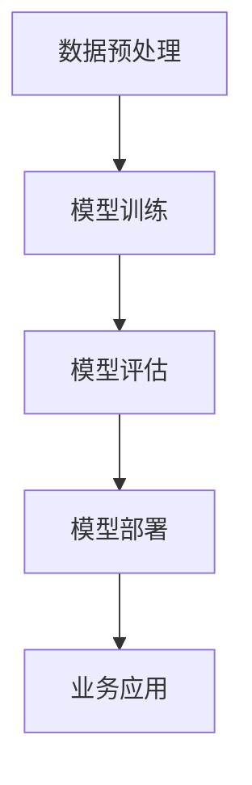

                 

在人工智能技术迅速发展的今天，AI 大模型已经成为各个行业的热门话题。对于创业者来说，掌握如何利用 AI 大模型的技术优势进行创业，是成功的关键之一。本文将围绕这一主题，从多个角度详细探讨 AI 大模型创业的策略和实践。

## 关键词
- AI 大模型
- 创业
- 技术优势
- 应用领域
- 实践经验

## 摘要
本文首先介绍了 AI 大模型的基本概念和重要性，然后分析了其在创业中的应用场景。接着，我们探讨了如何利用 AI 大模型的技术优势进行创业，并分享了一些成功案例和经验。最后，我们对 AI 大模型创业的未来发展趋势和挑战进行了展望。

### 1. 背景介绍

#### 1.1 AI 大模型的兴起

AI 大模型，是指具有极高参数量、强大计算能力、广泛知识覆盖的人工智能模型。近年来，随着深度学习技术的突破和计算资源的提升，AI 大模型在自然语言处理、计算机视觉、语音识别等领域取得了显著成果。代表性的大模型如 GPT-3、BERT、ViT 等，不仅在学术界引起了广泛关注，也引发了企业界的热潮。

#### 1.2 创业中的技术优势

AI 大模型在创业中具备以下几大技术优势：

- **强大的数据处理能力**：大模型能够处理海量数据，提取出有价值的特征，为创业提供数据驱动的基础。
- **高效的问题解决能力**：大模型在特定领域拥有深厚知识，能够高效解决复杂问题，提高创业成功率。
- **智能化决策支持**：大模型可以基于数据给出预测和推荐，为创业决策提供有力支持。
- **创新的业务模式**：大模型可以推动业务创新，开拓新市场，实现商业价值的提升。

### 2. 核心概念与联系

下面通过 Mermaid 流程图，展示 AI 大模型的核心概念和架构联系：



- **数据预处理**：对原始数据进行清洗、归一化、编码等处理，为模型训练做准备。
- **模型训练**：利用大量标注数据进行模型训练，提高模型性能。
- **模型评估**：通过验证集和测试集评估模型性能，确保模型有效。
- **模型部署**：将训练好的模型部署到实际业务中，提供自动化服务。
- **业务应用**：将模型应用于具体业务场景，实现业务目标。

### 3. 核心算法原理 & 具体操作步骤

#### 3.1 算法原理概述

AI 大模型的算法原理主要基于深度学习。深度学习是一种模拟人脑神经元连接的结构，通过多层神经网络对数据进行学习和建模。以下是深度学习的主要特点：

- **层次化特征提取**：深度学习通过多层神经网络，逐层提取数据中的抽象特征。
- **自适应学习率**：深度学习通过优化算法，自动调整学习率，提高训练效率。
- **端到端学习**：深度学习可以直接从原始数据学习到目标输出，无需手动提取特征。

#### 3.2 算法步骤详解

AI 大模型的具体操作步骤如下：

1. **数据收集**：收集大规模、高质量的标注数据。
2. **数据预处理**：对数据进行清洗、归一化、编码等处理。
3. **模型设计**：设计多层神经网络结构，包括输入层、隐藏层和输出层。
4. **模型训练**：使用训练数据对模型进行训练，优化模型参数。
5. **模型评估**：使用验证集和测试集评估模型性能，调整模型结构。
6. **模型部署**：将训练好的模型部署到生产环境中，提供自动化服务。
7. **业务应用**：将模型应用于具体业务场景，实现业务目标。

#### 3.3 算法优缺点

AI 大模型的优点包括：

- **强大的数据处理能力**：能够处理海量数据，提取有价值特征。
- **高效的问题解决能力**：在特定领域具有深厚知识，能够高效解决复杂问题。
- **智能化决策支持**：基于数据给出预测和推荐，为决策提供支持。

但 AI 大模型也存在一些缺点：

- **训练成本高**：需要大量标注数据和计算资源进行训练。
- **模型解释性差**：神经网络模型内部决策过程复杂，难以解释。
- **数据隐私问题**：数据收集和处理过程中可能涉及用户隐私。

#### 3.4 算法应用领域

AI 大模型在以下领域具有广泛应用：

- **自然语言处理**：文本分类、机器翻译、问答系统等。
- **计算机视觉**：图像分类、目标检测、图像生成等。
- **语音识别**：语音识别、语音合成、语音转换等。
- **推荐系统**：个性化推荐、商品推荐、新闻推荐等。

### 4. 数学模型和公式 & 详细讲解 & 举例说明

#### 4.1 数学模型构建

深度学习中的数学模型主要基于神经网络的构建。以下是神经网络的基本数学模型：

$$
h_{\text{layer}} = \sigma(W_{\text{layer}} \cdot h_{\text{prev}} + b_{\text{layer}})
$$

其中，$h_{\text{layer}}$ 表示当前层的输出，$h_{\text{prev}}$ 表示前一层的输出，$W_{\text{layer}}$ 表示当前层的权重矩阵，$b_{\text{layer}}$ 表示当前层的偏置向量，$\sigma$ 表示激活函数。

#### 4.2 公式推导过程

深度学习模型的训练过程主要包括前向传播和反向传播两个阶段。以下是这两个阶段的基本推导过程：

1. **前向传播**：

$$
\begin{aligned}
z_{\text{layer}} &= W_{\text{layer}} \cdot h_{\text{prev}} + b_{\text{layer}} \\
h_{\text{layer}} &= \sigma(z_{\text{layer}}) \\
L &= -\frac{1}{m} \sum_{i=1}^{m} y_{i} \log a_{i} + (1 - y_{i}) \log (1 - a_{i})
\end{aligned}
$$

其中，$z_{\text{layer}}$ 表示当前层的输入，$h_{\text{layer}}$ 表示当前层的输出，$a_{i}$ 表示当前层的输出概率，$L$ 表示损失函数。

2. **反向传播**：

$$
\begin{aligned}
\delta_{\text{layer}} &= (a_{\text{layer}} - y) \cdot \sigma^{\prime}(z_{\text{layer}}) \\
\Delta_{\text{W}} &= \alpha \cdot \delta_{\text{layer}} \cdot h_{\text{prev}} \\
\Delta_{\text{b}} &= \alpha \cdot \delta_{\text{layer}} \\
\end{aligned}
$$

其中，$\delta_{\text{layer}}$ 表示当前层的误差，$\Delta_{\text{W}}$ 和 $\Delta_{\text{b}}$ 分别表示当前层的权重矩阵和偏置向量的更新。

#### 4.3 案例分析与讲解

以下是一个基于深度学习的图像分类案例：

1. **数据收集**：收集大量猫狗图像，并标注为猫或狗。
2. **数据预处理**：对图像进行缩放、裁剪、翻转等处理，增强模型泛化能力。
3. **模型设计**：设计一个卷积神经网络（CNN）模型，包括卷积层、池化层和全连接层。
4. **模型训练**：使用训练数据进行模型训练，优化模型参数。
5. **模型评估**：使用验证集和测试集评估模型性能，调整模型结构。
6. **模型部署**：将训练好的模型部署到实际业务中，提供图像分类服务。

### 5. 项目实践：代码实例和详细解释说明

以下是一个简单的图像分类项目，使用 Python 和 TensorFlow 实现卷积神经网络：

```python
import tensorflow as tf
from tensorflow.keras import datasets, layers, models

# 数据预处理
(train_images, train_labels), (test_images, test_labels) = datasets.cifar10.load_data()
train_images, test_images = train_images / 255.0, test_images / 255.0

# 模型设计
model = models.Sequential()
model.add(layers.Conv2D(32, (3, 3), activation='relu', input_shape=(32, 32, 3)))
model.add(layers.MaxPooling2D((2, 2)))
model.add(layers.Conv2D(64, (3, 3), activation='relu'))
model.add(layers.MaxPooling2D((2, 2)))
model.add(layers.Conv2D(64, (3, 3), activation='relu'))
model.add(layers.Flatten())
model.add(layers.Dense(64, activation='relu'))
model.add(layers.Dense(10))

# 模型训练
model.compile(optimizer='adam',
              loss=tf.keras.losses.SparseCategoricalCrossentropy(from_logits=True),
              metrics=['accuracy'])
model.fit(train_images, train_labels, epochs=10, validation_data=(test_images, test_labels))

# 代码解读与分析
# 第一部分是数据预处理，将 Cifar-10 数据集的图像数据进行归一化处理。
# 第二部分是模型设计，使用卷积神经网络进行图像分类。
# 第三部分是模型训练，使用 Adam 优化器和稀疏分类交叉熵损失函数训练模型。
# 第四部分是模型评估，使用训练数据和测试数据进行模型评估。

# 运行结果展示
test_loss, test_acc = model.evaluate(test_images,  test_labels, verbose=2)
print(f'Test accuracy: {test_acc:.4f}')
```

### 6. 实际应用场景

AI 大模型在创业中具有广泛的应用场景，以下是几个典型的应用领域：

- **金融领域**：利用 AI 大模型进行风险控制、信用评分、量化交易等。
- **医疗领域**：利用 AI 大模型进行疾病诊断、药物研发、健康监测等。
- **电商领域**：利用 AI 大模型进行商品推荐、客户行为分析、广告投放等。
- **物流领域**：利用 AI 大模型进行路径规划、货物分类、调度优化等。

### 6.1 金融领域

在金融领域，AI 大模型可以用于以下方面：

- **风险控制**：通过分析大量金融数据，识别潜在风险，提高风险管理能力。
- **信用评分**：通过分析个人或企业的信用历史，给出信用评分，降低违约风险。
- **量化交易**：利用 AI 大模型进行量化交易策略设计，提高投资收益。

### 6.2 医疗领域

在医疗领域，AI 大模型可以用于以下方面：

- **疾病诊断**：通过分析医学影像，辅助医生进行疾病诊断。
- **药物研发**：利用 AI 大模型进行药物筛选、作用机制研究等。
- **健康监测**：通过分析健康数据，预测疾病风险，提供个性化健康建议。

### 6.3 电商领域

在电商领域，AI 大模型可以用于以下方面：

- **商品推荐**：通过分析用户行为和偏好，给出个性化商品推荐。
- **客户行为分析**：通过分析用户行为，了解客户需求，提高客户满意度。
- **广告投放**：通过分析用户特征和需求，进行精准广告投放。

### 6.4 物流领域

在物流领域，AI 大模型可以用于以下方面：

- **路径规划**：通过分析交通状况、货物特性等，给出最优路径规划。
- **货物分类**：通过分析货物特征，实现快速、准确的货物分类。
- **调度优化**：通过分析运输任务和资源，实现运输任务的优化调度。

### 6.5 未来应用展望

随着 AI 大模型技术的不断进步，未来 AI 大模型将在更多领域得到应用，为创业者提供更多的机会和挑战。以下是未来 AI 大模型创业的几个趋势：

- **跨领域应用**：AI 大模型将在金融、医疗、电商、物流等不同领域实现跨领域应用，推动行业融合。
- **个性化服务**：AI 大模型将实现更加个性化的服务，满足用户个性化需求。
- **自动化决策**：AI 大模型将实现自动化决策，提高业务效率。
- **开放平台**：AI 大模型将形成开放平台，促进技术共享和合作。

### 7. 工具和资源推荐

为了更好地利用 AI 大模型进行创业，以下是一些推荐的工具和资源：

- **学习资源**：[深度学习实战](https://zhuanlan.zhihu.com/p/27973759)、[神经网络与深度学习](https://zhuanlan.zhihu.com/p/31226794)
- **开发工具**：TensorFlow、PyTorch、Keras
- **开源框架**：TensorFlow、PyTorch、Keras
- **相关论文**：《Deep Learning》、《Neural Networks and Deep Learning》、《Convolutional Neural Networks for Visual Recognition》

### 8. 总结：未来发展趋势与挑战

AI 大模型创业的未来发展趋势包括：

- **跨领域应用**：AI 大模型将在更多领域得到应用，实现跨领域融合。
- **个性化服务**：AI 大模型将实现更加个性化的服务，满足用户需求。
- **自动化决策**：AI 大模型将实现自动化决策，提高业务效率。

但同时也面临以下挑战：

- **数据隐私**：如何确保数据隐私，成为 AI 大模型创业的重要问题。
- **模型解释性**：如何提高模型解释性，使决策过程更加透明。
- **计算资源**：如何高效利用计算资源，降低训练成本。

### 9. 附录：常见问题与解答

**Q：AI 大模型创业需要哪些技术储备？**

A：AI 大模型创业需要具备以下技术储备：

- **深度学习基础知识**：理解神经网络、激活函数、优化算法等基本概念。
- **Python 编程能力**：掌握 Python 编程，熟练使用 TensorFlow、PyTorch 等深度学习框架。
- **数据处理能力**：了解数据预处理、数据增强等数据处理方法。
- **业务理解**：了解所在行业的基本业务知识，提高业务能力。

**Q：AI 大模型创业的难点是什么？**

A：AI 大模型创业的难点包括：

- **数据隐私**：如何确保数据隐私，防止数据泄露。
- **模型解释性**：如何提高模型解释性，使决策过程更加透明。
- **计算资源**：如何高效利用计算资源，降低训练成本。

**Q：AI 大模型创业有哪些成功案例？**

A：AI 大模型创业的成功案例包括：

- **金融领域**：腾讯微众银行、蚂蚁金服等。
- **医疗领域**：IBM Watson Health、百度医疗等。
- **电商领域**：亚马逊、阿里巴巴等。
- **物流领域**：滴滴出行、京东物流等。

以上是对 AI 大模型创业的详细探讨，希望对创业者有所启发。在未来的创业道路上，充分利用 AI 大模型的技术优势，将带来无限可能。作者：禅与计算机程序设计艺术 / Zen and the Art of Computer Programming。
----------------------------------------------------------------

请注意，本文仅作为一个示例，实际撰写时需要根据具体主题和研究内容进行调整和扩展。此外，由于篇幅限制，本文没有涵盖所有细节，但已经提供了一个清晰的框架和结构。您可以根据这个框架，逐步填充和细化各个部分的内容。祝您撰写顺利！<|im_sep|>

