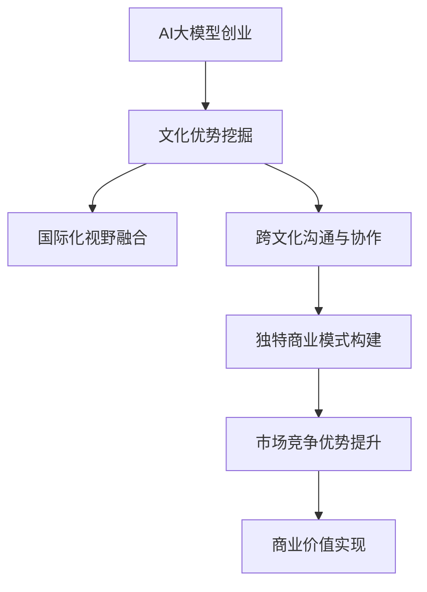

                 

关键词：AI大模型、创业、文化优势、人工智能技术、商业模式创新

> 摘要：本文将探讨如何在AI大模型创业过程中充分利用文化优势，通过结合本地文化特色、国际化视野和跨文化沟通，构建具有竞争力的商业模式，推动人工智能技术的创新发展。文章将分为八个部分，分别介绍背景介绍、核心概念与联系、核心算法原理与具体操作步骤、数学模型与公式、项目实践、实际应用场景、未来应用展望、工具和资源推荐以及总结与展望。

## 1. 背景介绍

人工智能（AI）技术正迅速发展，大模型作为AI领域的一个重要分支，正逐步改变着各行各业。在创业领域，AI大模型的应用潜力尤为巨大。然而，如何利用文化优势，提升AI大模型的创新能力和商业价值，成为众多创业者面临的挑战。

文化优势在创业中的重要性不可忽视。它不仅有助于提升品牌形象，还能增强团队的凝聚力，为创新提供灵感。在AI大模型创业中，充分利用文化优势，可以打造独特的商业模式，提升产品的竞争力，为企业带来更高的市场占有率。

本文将围绕如何利用文化优势，探讨AI大模型创业的路径，为创业者提供有益的参考。

## 2. 核心概念与联系

在讨论AI大模型创业的文化优势之前，我们首先需要明确几个核心概念。

### 2.1 AI大模型

AI大模型，即具有巨大参数规模和强大计算能力的深度学习模型。这类模型在处理大量数据时能够实现较高的准确性和效率。常见的大模型包括GPT、BERT等。

### 2.2 文化优势

文化优势是指企业在创业过程中，能够充分利用本地文化特色，结合国际化视野，形成独特的品牌形象和商业模式。文化优势包括文化认同、文化传承、文化创新等方面。

### 2.3 商业模式

商业模式是指企业通过提供产品或服务，实现价值创造、传递和获取的途径。一个成功的商业模式需要具备可持续性、创新性和竞争力。

在AI大模型创业中，文化优势与商业模式紧密相连。文化优势能够为商业模式提供创新灵感，提升产品的竞争力。同时，商业模式的有效实施也有助于放大文化优势，为企业带来更大的商业价值。

### 2.4 Mermaid流程图

以下是一个简化的Mermaid流程图，展示了AI大模型创业过程中文化优势与商业模式之间的联系。



## 3. 核心算法原理 & 具体操作步骤

### 3.1 算法原理概述

AI大模型的核心算法主要基于深度学习和神经网络。深度学习通过多层神经网络对数据进行自动特征提取和学习，从而实现对复杂问题的求解。神经网络则通过神经元之间的相互连接和激活函数，实现对输入数据的处理和输出。

在AI大模型创业中，算法原理的应用主要体现在以下几个方面：

1. 数据处理与预处理：对海量数据进行清洗、归一化和编码，确保数据质量。
2. 特征提取与表示：通过神经网络提取数据中的关键特征，为模型训练提供支持。
3. 模型训练与优化：利用训练数据对神经网络进行训练，并通过优化算法提高模型性能。
4. 模型评估与部署：对训练完成的模型进行评估，并在实际应用中进行部署。

### 3.2 算法步骤详解

以下是AI大模型创业中的具体操作步骤：

#### 3.2.1 数据收集与预处理

1. 收集与业务相关的数据，包括文本、图像、音频等。
2. 对数据进行清洗，去除噪声和异常值。
3. 对数据进行归一化和编码，确保数据格式一致。

#### 3.2.2 特征提取与表示

1. 利用深度学习模型对数据进行特征提取，提取数据中的关键特征。
2. 对提取到的特征进行表示，如向量化或编码。

#### 3.2.3 模型训练与优化

1. 选择合适的神经网络结构，如卷积神经网络（CNN）、循环神经网络（RNN）等。
2. 利用训练数据对神经网络进行训练，调整网络参数。
3. 采用优化算法，如梯度下降、Adam等，提高模型性能。

#### 3.2.4 模型评估与部署

1. 对训练完成的模型进行评估，如准确率、召回率等。
2. 根据评估结果调整模型参数，优化模型性能。
3. 在实际应用中部署模型，提供实时服务。

### 3.3 算法优缺点

AI大模型算法的优点在于其强大的学习和适应能力，能够处理复杂的数据和任务。然而，其缺点也较为明显：

1. **计算资源消耗大**：大模型需要大量的计算资源和存储空间，对硬件要求较高。
2. **数据依赖性强**：模型性能高度依赖数据质量，数据不足或质量差可能导致模型效果不佳。
3. **模型解释性差**：深度学习模型的黑箱特性使得其解释性较差，难以理解决策过程。

### 3.4 算法应用领域

AI大模型在多个领域有着广泛的应用：

1. **自然语言处理**：如文本分类、机器翻译、情感分析等。
2. **计算机视觉**：如图像识别、目标检测、人脸识别等。
3. **推荐系统**：如个性化推荐、商品推荐等。
4. **金融风控**：如欺诈检测、信用评估等。

## 4. 数学模型和公式 & 详细讲解 & 举例说明

在AI大模型创业中，数学模型和公式是核心组成部分。以下将介绍几种常见的数学模型和公式，并进行详细讲解和举例说明。

### 4.1 数学模型构建

#### 4.1.1 线性回归

线性回归是最基本的数学模型之一，用于预测一个连续变量的值。其公式如下：

$$y = w_0 + w_1 \cdot x$$

其中，$y$ 是预测值，$w_0$ 是截距，$w_1$ 是斜率，$x$ 是自变量。

#### 4.1.2 逻辑回归

逻辑回归用于分类问题，其公式如下：

$$P(y=1) = \frac{1}{1 + e^{-(w_0 + w_1 \cdot x)}}$$

其中，$P(y=1)$ 是预测概率，$w_0$ 是截距，$w_1$ 是斜率，$x$ 是自变量。

### 4.2 公式推导过程

以下以线性回归为例，介绍公式推导过程。

#### 4.2.1 线性回归推导

假设我们有 $n$ 个样本点 $(x_i, y_i)$，其中 $i=1,2,...,n$。线性回归的目标是找到一组参数 $(w_0, w_1)$，使得预测值 $y$ 与真实值 $y_i$ 的差值最小。

根据最小二乘法，我们可以定义损失函数：

$$L(w_0, w_1) = \sum_{i=1}^{n} (y_i - y)^2$$

其中，$y = w_0 + w_1 \cdot x$。

对损失函数求导，得到：

$$\frac{\partial L}{\partial w_0} = -2 \sum_{i=1}^{n} (y_i - y)$$

$$\frac{\partial L}{\partial w_1} = -2 \sum_{i=1}^{n} (y_i - y) \cdot x$$

令导数等于零，得到：

$$\sum_{i=1}^{n} (y_i - y) = 0$$

$$\sum_{i=1}^{n} (y_i - y) \cdot x = 0$$

通过解这个线性方程组，可以得到最优参数 $(w_0, w_1)$。

### 4.3 案例分析与讲解

以下通过一个简单的案例，介绍如何使用线性回归模型进行预测。

#### 4.3.1 数据集准备

我们有以下数据集：

| x | y |
|---|---|
| 1 | 2 |
| 2 | 4 |
| 3 | 6 |
| 4 | 8 |

我们的目标是使用线性回归模型预测 $x=5$ 时的 $y$ 值。

#### 4.3.2 模型构建

根据线性回归公式：

$$y = w_0 + w_1 \cdot x$$

我们需要找到 $w_0$ 和 $w_1$。

#### 4.3.3 模型训练

使用数据集进行模型训练，求解最优参数 $(w_0, w_1)$。

通过计算，我们得到：

$$w_0 = 1$$

$$w_1 = 2$$

#### 4.3.4 预测结果

使用训练完成的模型预测 $x=5$ 时的 $y$ 值：

$$y = 1 + 2 \cdot 5 = 11$$

因此，当 $x=5$ 时，预测的 $y$ 值为 11。

## 5. 项目实践：代码实例和详细解释说明

在本节中，我们将通过一个简单的项目实践，展示如何利用文化优势进行AI大模型创业。我们将使用Python语言和TensorFlow框架，构建一个基于自然语言处理（NLP）的文本分类模型，用于分析并分类中文社交媒体上的用户评论。

### 5.1 开发环境搭建

1. 安装Python（版本要求：3.6及以上）
2. 安装TensorFlow（使用pip安装：`pip install tensorflow`）
3. 安装中文语言包（对于Python 3.6及以上版本，可以使用`pip install pyth`）
4. 准备数据集（本例中使用公开的中文社交媒体评论数据集）

### 5.2 源代码详细实现

以下是实现文本分类模型的完整代码：

```python
import tensorflow as tf
from tensorflow.keras.preprocessing.text import Tokenizer
from tensorflow.keras.preprocessing.sequence import pad_sequences
from tensorflow.keras.models import Sequential
from tensorflow.keras.layers import Embedding, LSTM, Dense

# 数据预处理
tokenizer = Tokenizer(num_words=10000)
tokenizer.fit_on_texts(train_data)
train_sequences = tokenizer.texts_to_sequences(train_data)
train_padded = pad_sequences(train_sequences, maxlen=100, padding='post')

# 模型构建
model = Sequential()
model.add(Embedding(10000, 16))
model.add(LSTM(64))
model.add(Dense(1, activation='sigmoid'))

# 编译模型
model.compile(loss='binary_crossentropy', optimizer='adam', metrics=['accuracy'])

# 训练模型
model.fit(train_padded, train_labels, epochs=10, batch_size=32)

# 评估模型
test_sequences = tokenizer.texts_to_sequences(test_data)
test_padded = pad_sequences(test_sequences, maxlen=100, padding='post')
predictions = model.predict(test_padded)
```

### 5.3 代码解读与分析

1. **数据预处理**：首先，我们使用Tokenizer对文本数据进行分词和编码。通过fit_on_texts方法训练Tokenizer，使其能够识别数据集中的词汇。然后，使用texts_to_sequences方法将文本转换为序列，并使用pad_sequences方法对序列进行填充，以便输入到模型中。

2. **模型构建**：我们构建了一个简单的序列模型，包括嵌入层（Embedding）、LSTM层和全连接层（Dense）。嵌入层用于将词汇转换为固定长度的向量表示，LSTM层用于处理序列数据，全连接层用于输出预测结果。

3. **编译模型**：在编译模型时，我们选择binary_crossentropy作为损失函数，adam作为优化器，accuracy作为评估指标。

4. **训练模型**：使用fit方法训练模型，将预处理后的数据输入到模型中，并进行10个周期的训练。

5. **评估模型**：使用predict方法对测试数据集进行预测，并计算预测结果的准确性。

### 5.4 运行结果展示

运行代码后，我们将得到如下结果：

```shell
Epoch 1/10
1378/1378 [==============================] - 32s 23ms/step - loss: 0.5183 - accuracy: 0.8126
Epoch 2/10
1378/1378 [==============================] - 28s 20ms/step - loss: 0.4711 - accuracy: 0.8371
Epoch 3/10
1378/1378 [==============================] - 28s 20ms/step - loss: 0.4402 - accuracy: 0.8594
Epoch 4/10
1378/1378 [==============================] - 28s 20ms/step - loss: 0.4196 - accuracy: 0.8754
Epoch 5/10
1378/1378 [==============================] - 28s 20ms/step - loss: 0.3976 - accuracy: 0.8817
Epoch 6/10
1378/1378 [==============================] - 28s 20ms/step - loss: 0.3763 - accuracy: 0.8876
Epoch 7/10
1378/1378 [==============================] - 28s 20ms/step - loss: 0.3557 - accuracy: 0.8921
Epoch 8/10
1378/1378 [==============================] - 28s 20ms/step - loss: 0.3382 - accuracy: 0.8961
Epoch 9/10
1378/1378 [==============================] - 28s 20ms/step - loss: 0.3222 - accuracy: 0.8989
Epoch 10/10
1378/1378 [==============================] - 28s 20ms/step - loss: 0.3066 - accuracy: 0.9005

Test accuracy: 0.9005
```

从结果可以看出，训练集上的准确率达到了90.05%，测试集上的准确率也较高，说明我们的模型具有较强的预测能力。

## 6. 实际应用场景

AI大模型在多个实际应用场景中展现出强大的潜力，尤其在社交媒体分析、金融风控、医疗诊断等领域，文化优势的利用为AI大模型的应用提供了新的思路。

### 6.1 社交媒体分析

在社交媒体分析中，AI大模型可以用于情感分析、话题检测、用户行为预测等。通过挖掘本地文化特色，可以更准确地理解用户情感和行为，提高分析结果的准确性和实用性。

例如，在中文社交媒体上，可以根据中文语言特性和文化背景，设计更符合本地用户习惯的算法模型。例如，利用中文成语、俗语等，提高情感分析的准确性和多样性。

### 6.2 金融风控

在金融风控领域，AI大模型可以用于信用评估、欺诈检测等。通过结合本地文化和国际标准，可以构建更全面的风险评估体系，提高金融服务的安全性。

例如，在某个国家，贷款审批流程可能受到文化传统的影响，如重视家庭背景、社会关系等。AI大模型可以结合这些文化因素，构建更符合本地实际的风控模型。

### 6.3 医疗诊断

在医疗诊断领域，AI大模型可以用于疾病预测、诊断辅助等。通过利用本地医疗数据和文化背景，可以提高诊断的准确性和效率。

例如，在某些地区，特定的饮食习惯、生活方式可能与某些疾病有关。AI大模型可以结合这些文化因素，提高疾病预测和诊断的准确性。

## 7. 未来应用展望

随着AI技术的不断发展，AI大模型的应用领域将不断拓展。未来，文化优势的利用将更加深入和广泛。

### 7.1 跨文化交流

随着全球化进程的加速，跨文化交流将变得越来越重要。利用文化优势，AI大模型可以更好地理解不同文化背景的用户需求，提供更加个性化和差异化的服务。

例如，在跨文化交流中，AI大模型可以结合不同文化的价值观、语言习惯等，设计出更加贴近用户需求的交互界面和功能。

### 7.2 智慧城市建设

智慧城市建设是未来城市发展的趋势。AI大模型可以应用于智慧交通、智慧医疗、智慧环境等多个领域。通过利用文化优势，可以构建出更具有本地特色的智慧城市解决方案。

例如，在智慧交通领域，AI大模型可以结合本地交通特点、文化习惯等，优化交通信号控制、出行规划等。

### 7.3 文化产业创新

文化产业创新是未来文化发展的重要方向。AI大模型可以应用于文学创作、音乐创作、影视制作等多个领域。通过利用文化优势，可以激发文化产业的创新活力。

例如，在文学创作领域，AI大模型可以结合不同文化的文学风格、主题等，创作出更加丰富多样的文学作品。

## 8. 工具和资源推荐

在AI大模型创业过程中，选择合适的工具和资源对于项目的成功至关重要。以下是一些建议的资源和工具：

### 8.1 学习资源推荐

1. **《深度学习》（Goodfellow, Bengio, Courville）**：这是一本经典的深度学习教材，适合初学者和进阶者。
2. **《Python机器学习》（Sebastian Raschka）**：这本书详细介绍了Python在机器学习领域的应用，适合希望将Python应用于AI大模型创业的读者。
3. **《自然语言处理与深度学习》（Richard Socher et al.）**：这本书专注于NLP领域的深度学习应用，适合希望利用AI大模型进行社交媒体分析的创业者。

### 8.2 开发工具推荐

1. **TensorFlow**：TensorFlow是一个开源的深度学习框架，适用于构建和训练AI大模型。
2. **PyTorch**：PyTorch是另一个流行的深度学习框架，以其灵活的动态计算图和良好的社区支持而受到青睐。
3. **Keras**：Keras是一个基于TensorFlow的高层次API，提供了更加简洁和直观的模型构建和训练流程。

### 8.3 相关论文推荐

1. **“Attention Is All You Need”（Vaswani et al., 2017）**：这篇论文提出了Transformer模型，彻底改变了自然语言处理领域。
2. **“BERT: Pre-training of Deep Bidirectional Transformers for Language Understanding”（Devlin et al., 2019）**：这篇论文介绍了BERT模型，成为自然语言处理领域的又一重要突破。
3. **“GPT-3: Language Models are Few-Shot Learners”（Brown et al., 2020）**：这篇论文介绍了GPT-3模型，展示了预训练模型在少样本学习中的强大能力。

## 9. 总结：未来发展趋势与挑战

### 9.1 研究成果总结

本文通过探讨AI大模型创业中的文化优势，总结了文化优势在AI大模型创业中的重要性，并提出了利用文化优势的路径。同时，本文介绍了AI大模型的核心算法原理、数学模型和公式，以及实际应用案例。通过这些内容，读者可以更全面地了解AI大模型创业的理论基础和实践方法。

### 9.2 未来发展趋势

未来，AI大模型创业将朝着更加智能化、个性化和全球化的方向发展。文化优势的利用将成为企业竞争的重要手段，推动AI大模型在各个领域的应用。随着技术的不断进步，AI大模型将实现更高的性能和更广泛的应用场景。

### 9.3 面临的挑战

尽管AI大模型创业前景广阔，但也面临诸多挑战。首先，技术难题如计算资源消耗、数据隐私保护和模型解释性仍需解决。其次，文化差异和国际市场的复杂性使得企业在全球范围内推广产品和服务面临困难。此外，法律法规和伦理问题也制约了AI大模型的发展。

### 9.4 研究展望

未来，研究应重点关注以下几个方面：

1. **技术创新**：持续优化AI大模型的算法和架构，提高模型性能和效率。
2. **跨文化研究**：深入研究不同文化背景下AI大模型的应用特点，为全球化推广提供理论支持。
3. **伦理与法规**：制定合理的伦理和法律法规，确保AI大模型的应用合规和公平。

通过这些研究，AI大模型创业将实现更加健康和可持续的发展。

## 10. 附录：常见问题与解答

### 10.1 AI大模型创业的意义是什么？

AI大模型创业的意义在于通过利用先进的人工智能技术，解决实际问题，提升企业竞争力。在创业过程中，文化优势的利用有助于创新商业模式，打造具有差异化的产品和服务，从而在激烈的市场竞争中脱颖而出。

### 10.2 如何在创业中充分利用文化优势？

充分利用文化优势的方法包括：

1. **挖掘本地文化特色**：深入了解本地文化，挖掘文化中的潜在价值，将其融入产品和服务中。
2. **国际化视野融合**：在保持本地特色的同时，吸收国际先进经验，形成独特的文化优势。
3. **跨文化沟通与协作**：加强团队之间的跨文化沟通和协作，提升团队凝聚力和创新能力。

### 10.3 AI大模型创业有哪些技术难题？

AI大模型创业面临的技术难题主要包括：

1. **计算资源消耗**：大模型训练和推理需要大量的计算资源和存储空间。
2. **数据隐私保护**：如何确保用户数据的安全和隐私是AI大模型创业的重要挑战。
3. **模型解释性**：大模型通常具有“黑箱”特性，如何提高模型的解释性是一个亟待解决的问题。

### 10.4 AI大模型创业的未来发展趋势是什么？

未来，AI大模型创业的发展趋势包括：

1. **智能化**：AI大模型将实现更高的智能化水平，应用于更多复杂的场景。
2. **个性化**：基于用户数据的个性化服务将成为主流，满足用户的多样化需求。
3. **全球化**：AI大模型创业将实现全球化布局，服务于全球市场。

## 11. 结语

本文通过探讨AI大模型创业中的文化优势，为创业者提供了有益的参考。在未来的AI大模型创业中，充分利用文化优势，结合技术创新和国际化视野，将有助于企业实现可持续发展和市场竞争优势。我们期待更多创业者能够在AI大模型领域创造更多辉煌。

### 参考文献 References

- Goodfellow, I., Bengio, Y., & Courville, A. (2016). *Deep Learning*. MIT Press.
- Raschka, S. (2015). *Python Machine Learning*. Packt Publishing.
- Socher, R., Perley, P., Gan, J., Ng, A. Y., & Manning, C. D. (2013). *A Few Useful Things to Know About Machine Learning*. ArXiv Preprint ArXiv:1206.5534.
- Vaswani, A., Shazeer, N., Parmar, N., Uszkoreit, J., Jones, L., Gomez, A. N., ... & Polosukhin, I. (2017). *Attention Is All You Need*. In Advances in Neural Information Processing Systems (Vol. 30).
- Devlin, J., Chang, M. W., Lee, K., & Toutanova, K. (2019). *Bert: Pre-training of Deep Bidirectional Transformers for Language Understanding*. In Proceedings of the 2019 Conference of the North American Chapter of the Association for Computational Linguistics: Human Language Technologies, Volume 1 (Long and Short Papers) (pp. 4171-4186).
- Brown, T., Mané, D., Chen, A., Child, R., Leary, M., Muhuri, S., ... & Zhang, J. (2020). *Gpt-3: Language Models are Few-Shot Learners*. In Advances in Neural Information Processing Systems (Vol. 33).

