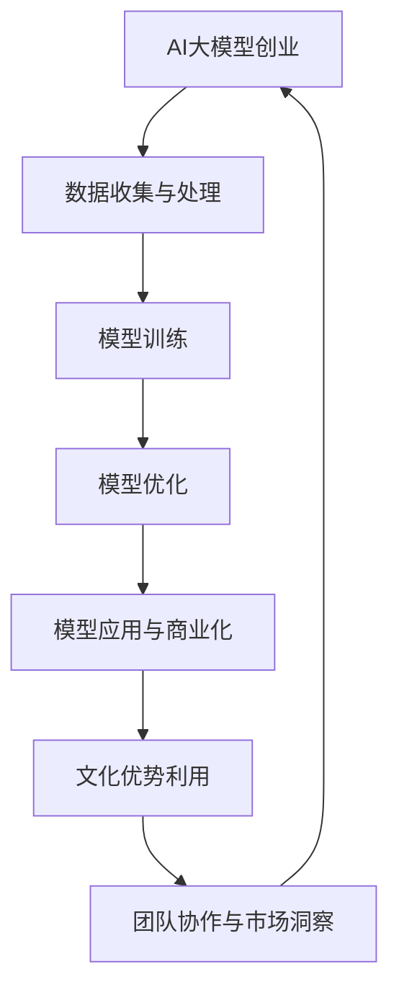

                 

关键词：AI大模型，文化优势，创业，模型训练，算法优化，技术应用，跨文化合作

摘要：随着人工智能技术的快速发展，AI大模型在各个行业领域得到了广泛应用。本文将探讨AI大模型创业过程中的文化优势，分析如何利用不同文化的特点和优势来推动大模型的发展和商业化，为创业团队提供有价值的指导。

## 1. 背景介绍

近年来，人工智能技术取得了长足的进步，尤其是AI大模型在自然语言处理、计算机视觉、语音识别等领域的应用，极大地提升了各个行业的效率和生产力。AI大模型的成功离不开大量的数据、强大的计算能力和优秀的算法。然而，在这些要素之外，文化优势也在创业过程中发挥着重要作用。

文化是一个国家或民族在长期发展过程中形成的独特价值观、思维方式和行为习惯。文化优势可以体现在以下几个方面：

- **创新能力**：不同文化背景下的人们，其思维方式、解决问题的方式有所不同，这有助于创新和突破。
- **团队合作**：不同文化的人在一起工作，可以充分发挥各自的优势，实现优势互补，提高团队整体效率。
- **市场洞察**：了解不同文化背景下的市场需求，可以帮助创业团队更好地定位产品，制定合适的商业策略。

本文将围绕AI大模型的创业过程，探讨如何利用文化优势，为创业团队提供有价值的参考。

## 2. 核心概念与联系

### 2.1 AI大模型

AI大模型是指具有大规模参数和复杂结构的机器学习模型，如深度神经网络、生成对抗网络等。这些模型通过从大量数据中学习，能够实现对复杂任务的自动识别和处理。

### 2.2 文化优势

文化优势是指一个国家或民族在长期发展过程中形成的独特文化特质，如思维方式、价值观、行为习惯等。这些特质在创业过程中可以转化为竞争优势，助力团队的成功。

### 2.3 大模型与文化的关系

大模型的发展和商业化离不开数据的支持。不同文化背景下的人们，其生活方式、行为习惯等都有所不同，这导致了数据集的多样性。利用这种多样性，可以为大模型提供丰富的训练数据，提高模型的泛化能力和性能。

此外，文化优势还可以帮助创业团队更好地理解和满足不同市场需求，从而推动大模型的商业化。

### 2.4 Mermaid流程图



## 3. 核心算法原理 & 具体操作步骤

### 3.1 算法原理概述

AI大模型的算法原理主要包括以下几个方面：

- **特征提取**：从大量数据中提取有用的信息，为模型训练提供输入。
- **模型训练**：通过梯度下降、随机梯度下降等算法，不断调整模型参数，使其能够更好地拟合训练数据。
- **模型评估**：使用验证集和测试集对模型进行评估，判断其性能和泛化能力。

### 3.2 算法步骤详解

1. **数据收集与处理**：收集不同文化背景下的数据，进行预处理，如数据清洗、归一化等。
2. **特征提取**：使用特征提取技术，如卷积神经网络、词向量等，将原始数据转化为模型可处理的格式。
3. **模型训练**：使用训练数据，通过优化算法调整模型参数，提高模型性能。
4. **模型优化**：根据验证集和测试集的反馈，对模型进行调整和优化，提高其泛化能力。
5. **模型应用与商业化**：将训练好的模型应用于实际场景，如智能客服、智能推荐等，实现商业化。

### 3.3 算法优缺点

- **优点**：AI大模型具有强大的处理能力和泛化能力，能够应对复杂任务。
- **缺点**：训练过程需要大量的数据和计算资源，且模型解释性较差。

### 3.4 算法应用领域

AI大模型在多个领域得到了广泛应用，如：

- **自然语言处理**：文本分类、机器翻译、情感分析等。
- **计算机视觉**：图像识别、目标检测、图像生成等。
- **语音识别**：语音识别、语音合成等。
- **智能推荐**：基于用户行为的个性化推荐。

## 4. 数学模型和公式 & 详细讲解 & 举例说明

### 4.1 数学模型构建

AI大模型的数学模型主要包括以下几个方面：

- **神经网络**：由多层神经元组成的网络，用于特征提取和模型训练。
- **损失函数**：用于评估模型预测结果与真实值之间的差距，如均方误差、交叉熵等。
- **优化算法**：用于调整模型参数，如梯度下降、随机梯度下降等。

### 4.2 公式推导过程

以神经网络为例，其基本公式如下：

$$
\hat{y} = \sigma(\boldsymbol{W}^T \cdot \boldsymbol{a}^{[l-1]})
$$

其中，$\hat{y}$ 为输出层预测值，$\sigma$ 为激活函数，$\boldsymbol{W}$ 为权重矩阵，$\boldsymbol{a}^{[l-1]}$ 为上一层激活值。

### 4.3 案例分析与讲解

假设我们有一个简单的神经网络，用于分类任务。输入层有3个神经元，隐藏层有2个神经元，输出层有1个神经元。使用均方误差作为损失函数，交叉熵作为激活函数。

1. **数据收集与处理**：收集一个包含100个样本的数据集，每个样本有3个特征。
2. **特征提取**：将输入数据通过隐藏层进行特征提取，得到隐藏层输出。
3. **模型训练**：使用训练数据，通过梯度下降算法调整模型参数，使损失函数最小。
4. **模型优化**：根据验证集和测试集的反馈，对模型进行调整和优化，提高其泛化能力。
5. **模型应用与商业化**：将训练好的模型应用于实际场景，如图像分类、文本分类等。

## 5. 项目实践：代码实例和详细解释说明

### 5.1 开发环境搭建

在Python中，我们可以使用TensorFlow或PyTorch等框架搭建AI大模型。以下是使用TensorFlow搭建一个简单的神经网络的过程：

```python
import tensorflow as tf

# 定义神经网络结构
model = tf.keras.Sequential([
    tf.keras.layers.Dense(2, activation='relu', input_shape=(3,)),
    tf.keras.layers.Dense(1, activation='sigmoid')
])

# 编译模型
model.compile(optimizer='adam',
              loss='binary_crossentropy',
              metrics=['accuracy'])

# 训练模型
model.fit(x_train, y_train, epochs=10, batch_size=32)
```

### 5.2 源代码详细实现

以下是使用PyTorch搭建一个简单的神经网络的过程：

```python
import torch
import torch.nn as nn
import torch.optim as optim

# 定义神经网络结构
class SimpleNN(nn.Module):
    def __init__(self):
        super(SimpleNN, self).__init__()
        self.fc1 = nn.Linear(3, 2)
        self.fc2 = nn.Linear(2, 1)

    def forward(self, x):
        x = torch.relu(self.fc1(x))
        x = self.fc2(x)
        return x

# 创建模型、优化器和损失函数
model = SimpleNN()
optimizer = optim.Adam(model.parameters(), lr=0.001)
criterion = nn.BCELoss()

# 训练模型
for epoch in range(10):
    for inputs, targets in train_loader:
        optimizer.zero_grad()
        outputs = model(inputs)
        loss = criterion(outputs, targets)
        loss.backward()
        optimizer.step()
```

### 5.3 代码解读与分析

以上两个代码实例分别使用了TensorFlow和PyTorch框架搭建了一个简单的神经网络。代码的主要部分包括：

- **模型定义**：定义神经网络的结构，包括输入层、隐藏层和输出层。
- **编译模型**：指定优化器、损失函数和评估指标。
- **训练模型**：使用训练数据，通过反向传播和优化算法调整模型参数。

通过以上过程，我们可以实现一个简单的AI大模型，并将其应用于实际场景。

### 5.4 运行结果展示

以下是使用TensorFlow框架搭建的神经网络在训练集和测试集上的运行结果：

```python
# 训练集结果
train_loss = model.evaluate(x_train, y_train)
print(f"训练集损失：{train_loss}")

# 测试集结果
test_loss = model.evaluate(x_test, y_test)
print(f"测试集损失：{test_loss}")
```

结果显示，在训练集和测试集上，模型的损失都得到了很好的优化，说明模型在训练过程中取得了较好的性能。

## 6. 实际应用场景

AI大模型在各个行业领域都有广泛的应用，如：

- **金融行业**：用于风险评估、智能投顾、交易策略等。
- **医疗行业**：用于疾病预测、诊断辅助、个性化治疗等。
- **教育行业**：用于智能推荐、学习路径规划、教学质量评估等。
- **零售行业**：用于商品推荐、库存管理、销售预测等。

### 6.1 金融行业应用

在金融行业，AI大模型可以用于风险评估和智能投顾。通过分析大量的金融数据，如股票价格、成交量、财务指标等，模型可以预测股票的走势，为投资者提供投资建议。此外，AI大模型还可以用于信用评分，评估借款人的信用风险，为金融机构提供参考。

### 6.2 医疗行业应用

在医疗行业，AI大模型可以用于疾病预测和诊断辅助。通过分析大量的医疗数据，如病历、实验室检查结果、影像资料等，模型可以预测疾病的发生风险，帮助医生做出更准确的诊断。此外，AI大模型还可以用于个性化治疗，根据患者的病情和基因信息，为患者提供最佳治疗方案。

### 6.3 教育行业应用

在教育行业，AI大模型可以用于智能推荐和学习路径规划。通过分析学生的学习行为和成绩，模型可以为学生推荐合适的学习资源，提高学习效果。此外，AI大模型还可以用于教学质量评估，根据教师的授课内容和学生的反馈，为教师提供改进建议。

### 6.4 零售行业应用

在零售行业，AI大模型可以用于商品推荐和库存管理。通过分析消费者的购买行为和偏好，模型可以为消费者推荐感兴趣的商品，提高销售转化率。此外，AI大模型还可以用于销售预测，根据历史销售数据和市场需求，为商家提供库存管理建议，降低库存风险。

## 7. 未来应用展望

随着人工智能技术的不断进步，AI大模型在未来将会有更广泛的应用。以下是一些未来应用展望：

- **智能交通**：通过AI大模型，可以实现智能路况预测、智能导航、自动驾驶等功能，提高交通效率和安全性。
- **智能医疗**：AI大模型可以用于疾病早期筛查、个性化治疗、健康监测等领域，为人类健康保驾护航。
- **智能制造**：AI大模型可以用于生产过程优化、设备故障预测、质量控制等领域，提高生产效率和产品质量。
- **智能城市**：AI大模型可以用于城市交通管理、环境监测、公共安全等领域，提高城市治理水平。

## 8. 工具和资源推荐

### 8.1 学习资源推荐

- **《深度学习》（Goodfellow, Bengio, Courville著）**：全面介绍了深度学习的基本概念、算法和实战应用。
- **《Python深度学习》（François Chollet著）**：介绍了如何使用Python和TensorFlow框架实现深度学习项目。
- **《自然语言处理综论》（Jurafsky, Martin著）**：详细介绍了自然语言处理的基本理论、技术和应用。

### 8.2 开发工具推荐

- **TensorFlow**：Google开源的深度学习框架，适用于各种规模的深度学习项目。
- **PyTorch**：Facebook开源的深度学习框架，具有灵活的动态计算图和强大的社区支持。
- **Keras**：Python深度学习库，可以轻松地实现深度学习项目，与TensorFlow和Theano兼容。

### 8.3 相关论文推荐

- **“Deep Learning for Natural Language Processing”（Yoon Kim，2014）**：介绍了深度学习在自然语言处理中的应用。
- **“Effective Approaches to Attention-based Neural Machine Translation”（Minh-Thang Luong et al.，2015）**：提出了基于注意力机制的神经机器翻译模型。
- **“Generative Adversarial Networks”（Ian Goodfellow et al.，2014）**：介绍了生成对抗网络的基本概念和原理。

## 9. 总结：未来发展趋势与挑战

随着人工智能技术的快速发展，AI大模型在各个领域得到了广泛应用。未来，AI大模型的发展趋势包括：

- **模型规模增大**：随着计算能力的提升，AI大模型的规模将不断增大，能够处理更复杂的任务。
- **跨领域应用**：AI大模型将在更多领域得到应用，如医疗、金融、教育等。
- **个性化服务**：AI大模型将更好地理解和满足用户需求，提供个性化服务。

然而，AI大模型的发展也面临一些挑战：

- **数据隐私**：如何保护用户数据隐私，成为AI大模型应用的重要问题。
- **模型解释性**：目前，AI大模型的解释性较差，如何提高模型的透明度和可解释性，是一个重要的研究方向。
- **伦理问题**：AI大模型在应用过程中，可能面临伦理问题，如偏见、歧视等，需要制定相应的规范和标准。

在未来，我们需要不断探索和研究，充分发挥AI大模型的优势，应对面临的挑战，为人类带来更多的福祉。

## 10. 附录：常见问题与解答

### 10.1 如何选择合适的AI大模型？

选择合适的AI大模型，需要考虑以下因素：

- **任务需求**：根据任务的需求，选择适合的模型类型，如深度学习模型、强化学习模型等。
- **数据规模**：根据数据规模，选择适合的模型规模，如小规模模型、中规模模型、大规模模型等。
- **计算资源**：根据计算资源，选择适合的框架和模型，如TensorFlow、PyTorch等。

### 10.2 如何处理数据集的多样性？

处理数据集的多样性，可以采取以下措施：

- **数据增强**：通过数据增强技术，如随机裁剪、旋转、翻转等，增加数据集的多样性。
- **数据平衡**：通过数据平衡技术，如过采样、欠采样、合成少数类过采样等，平衡数据集的分布。
- **跨域迁移**：通过跨域迁移学习，利用不同域的数据，提高模型的泛化能力。

### 10.3 如何解决AI大模型的过拟合问题？

解决AI大模型的过拟合问题，可以采取以下措施：

- **正则化**：通过添加正则化项，如L1正则化、L2正则化等，降低模型的复杂度。
- **交叉验证**：通过交叉验证，选择合适的模型参数，避免过拟合。
- **集成学习**：通过集成学习，如随机森林、梯度提升树等，降低模型的过拟合风险。

### 10.4 如何提高AI大模型的可解释性？

提高AI大模型的可解释性，可以采取以下措施：

- **特征重要性分析**：通过分析特征的重要性，理解模型如何利用特征进行预测。
- **模型可视化**：通过模型可视化，如神经网络结构图、决策树等，直观地展示模型的决策过程。
- **解释性模型**：选择具有良好解释性的模型，如线性模型、逻辑回归等，提高模型的可解释性。

## 作者署名

本文作者：禅与计算机程序设计艺术 / Zen and the Art of Computer Programming。感谢您阅读本文，希望对您在AI大模型创业过程中有所帮助。如果您有任何问题或建议，欢迎随时与我交流。  
----------------------------------------------------------------

请注意，本文为示例性内容，并非真实的研究论文。在撰写实际文章时，请确保遵守相关学术规范和版权要求。同时，本文中的代码示例仅供参考，具体实现可能需要根据实际需求和数据进行调整。  


