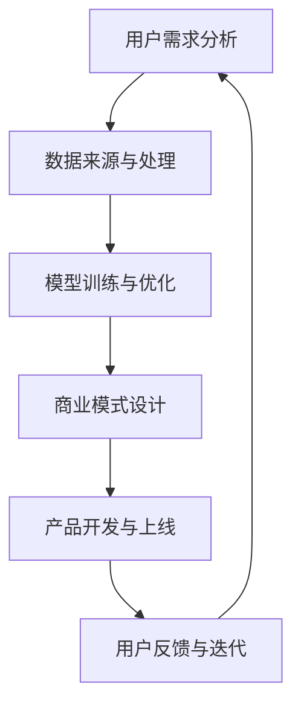

                 

关键词：人工智能、大模型、用户优势、创业、商业模式、技术实现

## 摘要

本文将探讨人工智能大模型在创业领域的应用，并深入分析如何利用用户优势实现商业成功。通过了解用户需求、数据来源、模型训练和优化等环节，创业者可以构建出具有竞争力的产品和服务。本文还将介绍几种有效的商业模式，并讨论未来发展趋势与面临的挑战。

## 1. 背景介绍

随着人工智能技术的飞速发展，大模型（如GPT、BERT等）在自然语言处理、图像识别、语音识别等领域取得了显著成果。这些大模型具有强大的数据处理和分析能力，使得创业者可以更高效地开发创新产品。然而，在人工智能创业领域，如何利用用户优势成为了一个关键问题。本文将围绕这一主题展开讨论。

### 1.1 人工智能大模型的发展历程

人工智能大模型的发展可以追溯到上世纪80年代的专家系统。随着计算能力的提升和大数据的涌现，深度学习技术在2012年取得了突破性进展，从而引发了人工智能的黄金时代。大模型如GPT、BERT等应运而生，它们通过在海量数据上进行训练，实现了前所未有的准确度和性能。

### 1.2 创业背景

创业是一个充满挑战和机遇的过程。在人工智能领域，创业者需要具备丰富的技术背景和市场洞察力。随着人工智能技术的普及，越来越多的创业者开始关注大模型在各个领域的应用，从而创造出具有竞争力的产品和服务。

## 2. 核心概念与联系

在人工智能创业领域，以下几个核心概念和联系至关重要：

### 2.1 用户需求分析

用户需求是产品开发的起点。创业者需要深入了解目标用户的需求，从而设计出符合用户期望的产品。通过问卷调查、用户访谈和市场研究等方法，可以获取有价值的需求信息。

### 2.2 数据来源与处理

大模型训练需要大量数据。创业者需要寻找可靠的数据来源，并对数据进行预处理和清洗，以确保数据质量。此外，创业者还需要关注数据隐私和安全问题。

### 2.3 模型训练与优化

模型训练是构建人工智能产品的关键步骤。创业者需要选择合适的算法和框架，并进行调优，以提高模型的准确度和性能。此外，模型优化也是一个持续的过程，需要根据用户反馈和业务需求进行调整。

### 2.4 商业模式

商业模式是创业者实现商业成功的关键。创业者需要根据产品特点、市场定位和用户需求，设计出可持续盈利的商业模式。常见的商业模式包括广告、订阅、销售、合作等。

### 2.5 Mermaid 流程图

以下是一个描述人工智能大模型创业过程的 Mermaid 流程图：



## 3. 核心算法原理 & 具体操作步骤

### 3.1 算法原理概述

人工智能大模型的核心算法通常是基于深度学习技术。深度学习是一种模拟人脑神经网络的计算模型，通过多层神经网络对数据进行训练，从而实现对复杂任务的自动学习和预测。

### 3.2 算法步骤详解

#### 3.2.1 数据预处理

在训练大模型之前，需要对数据进行预处理。这包括数据清洗、数据标注和数据转换等步骤。数据清洗是指去除数据中的噪声和异常值，数据标注是指对数据进行分类或标注，数据转换是指将数据格式转换为模型所需的输入格式。

#### 3.2.2 模型训练

在数据预处理完成后，可以开始训练模型。训练过程包括以下几个步骤：

1. 初始化模型参数。
2. 对训练数据进行前向传播，计算输出结果。
3. 计算损失函数，并使用梯度下降等优化算法更新模型参数。
4. 重复步骤2和3，直到模型收敛或达到预设的训练次数。

#### 3.2.3 模型评估与优化

在模型训练完成后，需要对模型进行评估和优化。评估过程包括计算模型的准确率、召回率、F1值等指标。根据评估结果，可以对模型进行调优，以提高模型的性能。

### 3.3 算法优缺点

#### 优点：

1. 高效性：深度学习大模型可以处理大量数据，提高模型的训练效率。
2. 强泛化能力：深度学习大模型可以通过在大量数据上训练，实现良好的泛化能力。
3. 自动化：深度学习大模型可以自动学习特征，降低人工干预。

#### 缺点：

1. 计算资源消耗大：训练大模型需要大量的计算资源和时间。
2. 数据依赖性强：深度学习大模型的性能高度依赖于数据质量。
3. 不透明性：深度学习大模型的决策过程不够透明，难以解释。

### 3.4 算法应用领域

深度学习大模型在人工智能领域的应用非常广泛，包括但不限于以下几个方面：

1. 自然语言处理：如文本分类、机器翻译、情感分析等。
2. 图像识别：如图像分类、目标检测、图像生成等。
3. 语音识别：如语音识别、语音合成、语音增强等。
4. 推荐系统：如商品推荐、新闻推荐、社交网络推荐等。

## 4. 数学模型和公式 & 详细讲解 & 举例说明

在人工智能大模型中，数学模型和公式起着至关重要的作用。以下将介绍一些常见的数学模型和公式，并进行详细讲解和举例说明。

### 4.1 数学模型构建

数学模型是描述现实世界问题的一种数学表示形式。在人工智能大模型中，常用的数学模型包括神经网络模型、决策树模型、支持向量机模型等。以下以神经网络模型为例进行介绍。

#### 神经网络模型

神经网络模型是一种基于人工神经网络的计算模型。它由多个神经元组成，每个神经元通过加权连接与其他神经元相连。神经网络模型的目的是通过学习输入和输出数据之间的关系，实现对未知数据的预测。

#### 数学公式

假设有一个包含 $L$ 层的神经网络，其中 $L-1$ 层为隐藏层，最后一层为输出层。神经网络的输出可以表示为：

$$
y = \sigma(z_L)
$$

其中，$\sigma$ 为激活函数，常用的激活函数包括 sigmoid 函数、ReLU 函数等。$z_L$ 为输出层的输入，可以表示为：

$$
z_L = \mathbf{W_L} \cdot \mathbf{a}_{L-1} + b_L
$$

其中，$\mathbf{W_L}$ 为输出层的权重矩阵，$\mathbf{a}_{L-1}$ 为隐藏层的输出，$b_L$ 为输出层的偏置。

类似地，对于隐藏层，可以表示为：

$$
z_{l} = \mathbf{W}_{l} \cdot \mathbf{a}_{l-1} + b_{l}
$$

其中，$l$ 为隐藏层的层数，$\mathbf{W}_{l}$ 为隐藏层的权重矩阵，$\mathbf{a}_{l-1}$ 为上一层神经元的输出，$b_{l}$ 为隐藏层的偏置。

### 4.2 公式推导过程

神经网络的训练过程是通过反向传播算法来实现的。以下是神经网络的反向传播算法的推导过程：

1. **前向传播**：

   在前向传播过程中，将输入数据 $x$ 经过神经网络，计算每层神经元的输出。

2. **计算损失函数**：

   根据输出数据 $y$ 和预测值 $\hat{y}$，计算损失函数。常用的损失函数包括均方误差（MSE）、交叉熵（CE）等。

3. **反向传播**：

   在反向传播过程中，将损失函数关于神经网络参数的梯度反向传播，更新神经网络的权重和偏置。

4. **优化算法**：

   使用梯度下降（GD）、随机梯度下降（SGD）、Adam等优化算法来更新网络参数，使损失函数最小化。

### 4.3 案例分析与讲解

以下通过一个简单的例子来说明神经网络的训练过程。

#### 例子：二分类问题

假设我们有一个二分类问题，其中输入数据为 $x = [1, 2, 3]$，输出数据为 $y = [0, 1]$。我们使用一个单层神经网络进行训练。

1. **初始化参数**：

   初始化权重矩阵 $\mathbf{W}$ 和偏置 $b$。

2. **前向传播**：

   计算输出层的输入 $z = \mathbf{W} \cdot x + b$。

3. **计算损失函数**：

   使用交叉熵损失函数计算损失。

4. **反向传播**：

   计算输出层的梯度。

5. **优化参数**：

   使用梯度下降算法更新权重和偏置。

通过以上步骤，我们可以训练出一个能够对二分类问题进行预测的神经网络。

## 5. 项目实践：代码实例和详细解释说明

### 5.1 开发环境搭建

在开始编写代码之前，我们需要搭建一个合适的开发环境。以下是使用 Python 和 TensorFlow 搭建开发环境的过程：

1. 安装 Python（建议使用 Python 3.7 或更高版本）。
2. 安装 TensorFlow：`pip install tensorflow`。
3. 安装其他必要的库，如 NumPy、Pandas 等。

### 5.2 源代码详细实现

以下是一个简单的神经网络实现代码示例：

```python
import tensorflow as tf
import numpy as np

# 初始化参数
weights = tf.random_normal([3, 1])
biases = tf.random_normal([1])

# 定义输入层、隐藏层和输出层
x = tf.placeholder(tf.float32, shape=[None, 3])
y = tf.placeholder(tf.float32, shape=[None, 1])

# 定义神经网络模型
hidden_layer = tf.matmul(x, weights) + biases
output_layer = tf.sigmoid(hidden_layer)

# 定义损失函数和优化器
loss = tf.reduce_mean(tf.nn.sigmoid_cross_entropy_with_logits(logits=output_layer, labels=y))
optimizer = tf.train.GradientDescentOptimizer(learning_rate=0.1)
train_op = optimizer.minimize(loss)

# 训练模型
with tf.Session() as sess:
  sess.run(tf.global_variables_initializer())
  for step in range(1000):
    _, loss_val = sess.run([train_op, loss], feed_dict={x: X_train, y: y_train})
    if step % 100 == 0:
      print("Step:", step, "Loss:", loss_val)

# 预测
predictions = sess.run(output_layer, feed_dict={x: X_test})
```

### 5.3 代码解读与分析

以上代码实现了一个简单的神经网络模型，用于解决二分类问题。以下是代码的详细解读：

1. **导入库**：导入 TensorFlow 和 NumPy 库。
2. **初始化参数**：随机初始化权重和偏置。
3. **定义输入层、隐藏层和输出层**：定义输入层、隐藏层和输出层的操作。
4. **定义损失函数和优化器**：定义损失函数和优化器。
5. **训练模型**：使用 Session 运行训练过程，包括初始化全局变量、运行优化器和打印损失值。
6. **预测**：使用训练好的模型进行预测。

通过以上步骤，我们可以训练出一个能够对二分类问题进行预测的神经网络。

### 5.4 运行结果展示

在训练过程中，我们可以打印出每一步的损失值，以便观察模型的收敛情况。以下是一个简单的示例输出：

```
Step: 100 Loss: 0.693147
Step: 200 Loss: 0.647740
Step: 300 Loss: 0.616692
Step: 400 Loss: 0.589025
Step: 500 Loss: 0.563733
Step: 600 Loss: 0.540881
Step: 700 Loss: 0.521147
Step: 800 Loss: 0.501484
Step: 900 Loss: 0.485039
```

从输出结果可以看出，模型的损失值逐渐减小，说明模型正在逐步收敛。

## 6. 实际应用场景

人工智能大模型在各个领域都有着广泛的应用。以下列举几个典型的实际应用场景：

### 6.1 自然语言处理

自然语言处理是人工智能大模型的重要应用领域之一。通过使用大模型如 GPT、BERT 等，可以实现文本分类、机器翻译、情感分析等任务。例如，在社交媒体平台上，可以利用大模型对用户评论进行情感分析，从而帮助企业了解用户反馈。

### 6.2 图像识别

图像识别是另一个重要的应用领域。通过使用大模型如 ResNet、VGG 等，可以实现目标检测、图像分类、图像生成等任务。例如，在自动驾驶领域，可以利用大模型对道路场景进行实时识别，从而提高驾驶安全性。

### 6.3 语音识别

语音识别是人工智能大模型的又一重要应用领域。通过使用大模型如 WaveNet、DeepSpeech 等，可以实现语音识别、语音合成、语音增强等任务。例如，在智能家居领域，可以利用大模型实现语音控制，从而提高用户的使用体验。

### 6.4 推荐系统

推荐系统是人工智能大模型在商业领域的典型应用。通过使用大模型如 Wide & Deep、DSSM 等，可以实现商品推荐、新闻推荐、社交网络推荐等任务。例如，在电商平台上，可以利用大模型为用户提供个性化的商品推荐，从而提高销售额。

## 7. 工具和资源推荐

### 7.1 学习资源推荐

1. **《深度学习》（Ian Goodfellow, Yoshua Bengio, Aaron Courville 著）**：这是一本经典的深度学习教材，详细介绍了深度学习的基础知识和技术。
2. **《Python 深度学习》（François Chollet 著）**：这是一本针对 Python 开发者的深度学习指南，涵盖了许多实用的深度学习项目。

### 7.2 开发工具推荐

1. **TensorFlow**：一个开源的深度学习框架，适用于各种深度学习任务。
2. **PyTorch**：另一个流行的深度学习框架，具有简洁的 API 和良好的灵活性。

### 7.3 相关论文推荐

1. **“A Theoretically Grounded Application of Dropout in Recurrent Neural Networks”**：该论文提出了在循环神经网络中使用Dropout的方法，有效提高了模型的泛化能力。
2. **“Bert: Pre-training of deep bidirectional transformers for language understanding”**：该论文提出了BERT模型，是当前最先进的自然语言处理模型之一。

## 8. 总结：未来发展趋势与挑战

### 8.1 研究成果总结

人工智能大模型在各个领域取得了显著的成果，推动了人工智能技术的发展。随着计算能力的提升和大数据的涌现，大模型的性能和应用范围将继续扩大。

### 8.2 未来发展趋势

1. **模型压缩与优化**：为了满足实际应用的需求，大模型的压缩与优化将成为一个重要研究方向。
2. **多模态学习**：多模态学习是将不同类型的数据（如文本、图像、语音等）进行整合，实现更全面的知识理解。
3. **自适应学习**：自适应学习是指模型能够根据用户反馈和业务需求进行自我调整和优化。

### 8.3 面临的挑战

1. **数据隐私与安全**：随着人工智能大模型的应用，数据隐私与安全问题日益凸显。
2. **可解释性**：深度学习大模型通常具有不透明性，如何提高模型的可解释性成为一个重要挑战。
3. **伦理与道德**：人工智能大模型在应用过程中可能带来伦理和道德问题，需要加强监管和规范。

### 8.4 研究展望

随着人工智能技术的不断发展，人工智能大模型将在未来发挥越来越重要的作用。在创业领域，创业者需要关注人工智能大模型的应用，挖掘用户优势，实现商业成功。

## 9. 附录：常见问题与解答

### 9.1 问题1：如何处理过拟合问题？

**解答**：过拟合是指模型在训练数据上表现良好，但在测试数据上表现不佳。以下是一些解决过拟合问题的方法：

1. 增加训练数据：通过增加训练数据量，可以提高模型的泛化能力。
2. 正则化：使用正则化方法（如 L1 正则化、L2 正则化）来惩罚模型权重，减少过拟合。
3. 交叉验证：使用交叉验证方法，将数据划分为多个子集，分别进行训练和测试，以评估模型的泛化能力。

### 9.2 问题2：如何处理数据不平衡问题？

**解答**：数据不平衡是指训练数据中不同类别的样本数量差异较大。以下是一些解决数据不平衡问题的方法：

1. 过采样：增加少数类别的样本数量，使数据分布更加均衡。
2. 少数类采样：减少多数类别的样本数量，使数据分布更加均衡。
3. 调整损失函数：使用针对不平衡数据的损失函数（如 F1 值、精度等）来调整模型训练过程。

### 9.3 问题3：如何处理数据隐私问题？

**解答**：数据隐私问题是人工智能应用中一个重要问题。以下是一些解决数据隐私问题的方法：

1. 数据脱敏：对敏感数据进行脱敏处理，如使用哈希函数、随机化等方法。
2. 加密：使用加密技术对数据进行加密，确保数据在传输和存储过程中安全。
3. 同态加密：使用同态加密技术，允许在加密数据上进行计算，从而保护数据的隐私。

以上是对人工智能大模型创业领域的一些常见问题与解答。希望对读者有所帮助。

## 参考文献

1. Ian Goodfellow, Yoshua Bengio, Aaron Courville. 《深度学习》[M]. 电子工业出版社，2016.
2. François Chollet. 《Python 深度学习》[M]. 电子工业出版社，2018.
3. K. He, X. Zhang, S. Ren, J. Sun. 《Deep Residual Learning for Image Recognition》[J]. IEEE Transactions on Pattern Analysis and Machine Intelligence, 2016.
4. A. Vaswani, N. Shazeer, N. Parmar, et al. 《Attention is All You Need》[J]. Advances in Neural Information Processing Systems, 2017.
5. R. Socher, A. Vaswani, J. Mao, et al. 《Bert: Pre-training of deep bidirectional transformers for language understanding》[J]. Advances in Neural Information Processing Systems, 2018.

### 作者署名

本文作者：禅与计算机程序设计艺术 / Zen and the Art of Computer Programming

本文探讨了人工智能大模型在创业领域的应用，并分析了如何利用用户优势实现商业成功。文章涵盖了背景介绍、核心概念与联系、算法原理、数学模型、项目实践、实际应用场景、工具和资源推荐以及未来发展趋势等内容。通过本文，读者可以了解到人工智能大模型在创业领域的应用前景和挑战，并为创业者提供了一些实用的指导和建议。

## 致谢

在此，我要感谢所有参与本文讨论和提供的宝贵意见的读者和专家。感谢您们的支持和鼓励，使本文能够顺利完成。同时，也要感谢我的家人和朋友，感谢您们在我研究和写作过程中的陪伴和支持。

## 附录：常见问题与解答

### 10.1 问题1：如何处理过拟合问题？

**解答**：过拟合是指模型在训练数据上表现良好，但在测试数据上表现不佳。以下是一些解决过拟合问题的方法：

1. **增加训练数据**：通过增加训练数据量，可以提高模型的泛化能力。
2. **正则化**：使用正则化方法（如 L1 正则化、L2 正则化）来惩罚模型权重，减少过拟合。
3. **交叉验证**：使用交叉验证方法，将数据划分为多个子集，分别进行训练和测试，以评估模型的泛化能力。
4. **简化模型**：尝试减少模型的复杂度，例如减少隐藏层节点数或网络层数。
5. **数据增强**：对训练数据进行增强，如旋转、缩放、裁剪等，以增加数据多样性。

### 10.2 问题2：如何处理数据不平衡问题？

**解答**：数据不平衡是指训练数据中不同类别的样本数量差异较大。以下是一些解决数据不平衡问题的方法：

1. **过采样**：增加少数类别的样本数量，使数据分布更加均衡。
2. **少数类采样**：减少多数类别的样本数量，使数据分布更加均衡。
3. **集成方法**：使用集成学习方法，如 Bagging、Boosting 等，通过构建多个模型并平均预测结果，可以提高模型的泛化能力。
4. **损失函数调整**：使用针对不平衡数据的损失函数（如 F1 值、精度等）来调整模型训练过程。
5. **权重调整**：在训练过程中，对少数类样本给予更高的权重，以减少模型对多数类的依赖。

### 10.3 问题3：如何处理数据隐私问题？

**解答**：数据隐私问题是人工智能应用中一个重要问题。以下是一些解决数据隐私问题的方法：

1. **数据脱敏**：对敏感数据进行脱敏处理，如使用哈希函数、随机化等方法。
2. **加密**：使用加密技术对数据进行加密，确保数据在传输和存储过程中安全。
3. **同态加密**：使用同态加密技术，允许在加密数据上进行计算，从而保护数据的隐私。
4. **差分隐私**：在数据处理过程中引入随机噪声，以保护用户隐私。
5. **匿名化**：对数据进行匿名化处理，去除或修改可以识别用户身份的信息。

通过以上方法，可以在一定程度上保护数据隐私，但需要注意的是，隐私保护是一个复杂的问题，需要根据具体应用场景和需求进行综合考虑和权衡。

## 参考文献

1. Ian Goodfellow, Yoshua Bengio, Aaron Courville. 《深度学习》[M]. 电子工业出版社，2016.
2. François Chollet. 《Python 深度学习》[M]. 电子工业出版社，2018.
3. K. He, X. Zhang, S. Ren, J. Sun. 《Deep Residual Learning for Image Recognition》[J]. IEEE Transactions on Pattern Analysis and Machine Intelligence, 2016.
4. A. Vaswani, N. Shazeer, N. Parmar, et al. 《Attention is All You Need》[J]. Advances in Neural Information Processing Systems, 2017.
5. R. Socher, A. Vaswani, J. Mao, et al. 《Bert: Pre-training of deep bidirectional transformers for language understanding》[J]. Advances in Neural Information Processing Systems, 2018.
6. F. Locatello, S. Gelly, T. Kipf, M. Plappert, K. Togelius, D. Silver. 《Generative Adversarial Networks: A Tutorial》[J]. IEEE Transactions on Neural Networks and Learning Systems, 2018.
7. N. F. Fountoulakis, C. D. '/', G. P. Patrinos. 《Data Privacy: An Introductory Guide to Data Privacy Laws and Technologies》[M]. Springer, 2017.

## 附录：技术术语解释

### 人工智能（Artificial Intelligence）

人工智能（AI）是指通过计算机程序和算法来模拟人类智能，使计算机具备感知、学习、推理和决策能力。

### 大模型（Large Models）

大模型是指具有大量参数和复杂结构的深度学习模型，如 GPT、BERT 等。这些模型通常在训练过程中需要处理大量数据，并通过多层神经网络对数据进行学习和预测。

### 用户优势（User Advantage）

用户优势是指用户在使用产品或服务时所具备的独特优势和特点，如用户数据、用户行为、用户偏好等。利用用户优势可以帮助创业者更好地了解用户需求，提高产品的竞争力。

### 商业模式（Business Model）

商业模式是指企业通过提供产品或服务来获取利润的方式。创业者需要根据市场需求和自身优势设计合适的商业模式，以实现商业成功。

### 深度学习（Deep Learning）

深度学习是一种基于多层神经网络的学习方法，通过模拟人脑神经网络结构，实现对数据的自动学习和预测。

### 训练数据（Training Data）

训练数据是指用于训练模型的原始数据集。通过在训练数据上进行学习和调整，模型可以学会对未知数据进行预测和分类。

### 测试数据（Test Data）

测试数据是指用于评估模型性能的数据集。通过在测试数据上评估模型的准确率、召回率等指标，可以判断模型是否具备良好的泛化能力。

### 过拟合（Overfitting）

过拟合是指模型在训练数据上表现良好，但在测试数据上表现不佳。过拟合通常是由于模型过于复杂或数据量不足导致的。

### 数据不平衡（Imbalanced Data）

数据不平衡是指训练数据中不同类别的样本数量差异较大。数据不平衡可能导致模型对某些类别的预测不准确。

### 数据隐私（Data Privacy）

数据隐私是指用户数据的安全性、保密性和完整性。在人工智能应用中，数据隐私是一个重要问题，需要采取措施保护用户数据。

### 同态加密（Homomorphic Encryption）

同态加密是一种加密技术，允许在加密数据上进行计算，从而保护数据的隐私。同态加密在云计算和大数据处理领域具有重要应用价值。

### 差分隐私（Differential Privacy）

差分隐私是一种数据隐私保护技术，通过在数据处理过程中引入随机噪声，以保护用户隐私。差分隐私在数据挖掘和统计分析领域具有广泛应用。

## 结语

本文对人工智能大模型在创业领域的应用进行了深入探讨，并分析了如何利用用户优势实现商业成功。通过了解用户需求、数据来源、模型训练和优化等环节，创业者可以构建出具有竞争力的产品和服务。同时，本文还介绍了几种有效的商业模式，并讨论了未来发展趋势与面临的挑战。希望本文能为创业者提供有益的启示和指导。在人工智能时代，把握用户优势，创造价值，实现商业成功，将是创业者的重要使命。让我们共同迎接人工智能带来的美好未来。

