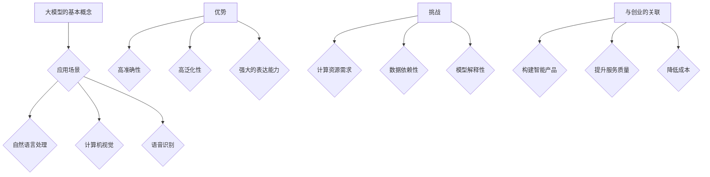

                 

关键词：AI 大模型、创业、竞争优势、技术实现、应用场景、未来展望

摘要：随着人工智能技术的迅猛发展，大模型在各个领域展现出了巨大的潜力。对于创业者来说，掌握如何利用大模型的竞争优势，实现技术创新和商业价值的最大化，是成功的关键。本文将深入探讨大模型创业的路径、技术实现、应用场景以及未来展望，旨在为创业者提供有价值的参考。

## 1. 背景介绍

近年来，人工智能（AI）技术取得了飞速发展，尤其是在大模型领域。大模型，即参数量达到数十亿甚至上百亿的深度学习模型，已经成为推动人工智能技术进步的重要引擎。随着计算能力的提升和海量数据的积累，大模型的训练效果日益显著，其在自然语言处理、计算机视觉、语音识别等领域的应用取得了显著的成果。

创业者在面对这一技术浪潮时，如何利用大模型的竞争优势，构建有竞争力的产品和服务，实现商业价值的最大化，成为了一个亟待解决的问题。本文将围绕这一核心问题，探讨大模型创业的路径、技术实现、应用场景以及未来展望。

## 2. 核心概念与联系

### 2.1 大模型的基本概念

大模型，指的是参数量达到数十亿甚至上百亿的深度学习模型。其基本原理是通过大量的数据进行训练，从而自动学习数据中的特征和模式。大模型通常采用多层神经网络结构，通过反向传播算法不断调整网络权重，以优化模型的性能。

### 2.2 大模型的应用场景

大模型在自然语言处理、计算机视觉、语音识别等领域有着广泛的应用。例如，在自然语言处理领域，大模型可以用于机器翻译、文本生成、情感分析等任务；在计算机视觉领域，大模型可以用于图像分类、目标检测、图像生成等任务；在语音识别领域，大模型可以用于语音识别、语音合成等任务。

### 2.3 大模型的优势

大模型具有以下几个显著优势：

1. **高准确性**：大模型通过大量数据进行训练，能够学习到更复杂的特征和模式，从而提高模型的准确性。

2. **高泛化性**：大模型具有更强的泛化能力，能够在不同的任务和数据集上表现出色。

3. **强大的表达能力**：大模型的参数量巨大，能够表达出复杂的数据分布和关系，从而实现更精细的任务。

### 2.4 大模型的挑战

尽管大模型具有诸多优势，但也面临着一些挑战：

1. **计算资源需求**：大模型的训练需要大量的计算资源，这给创业者带来了成本压力。

2. **数据依赖性**：大模型的性能依赖于大量的高质量数据，数据的获取和处理成为了一个重要问题。

3. **模型解释性**：大模型通常是一个“黑箱”，其内部工作机制难以理解，这对于需要解释性的应用场景来说是一个挑战。

### 2.5 大模型与创业的关联

大模型为创业者提供了强大的工具，使其能够构建出更加智能和高效的产品和服务。然而，如何充分利用大模型的竞争优势，构建出有市场竞争力的产品，是创业者需要深思的问题。

### 2.6 Mermaid 流程图



## 3. 核心算法原理 & 具体操作步骤

### 3.1 算法原理概述

大模型的算法原理主要基于深度学习，其核心思想是通过多层神经网络对数据进行训练，从而自动学习数据中的特征和模式。具体来说，大模型通常采用以下步骤：

1. **数据预处理**：对输入数据（如文本、图像、语音等）进行预处理，包括数据清洗、归一化等操作。

2. **模型构建**：设计并构建多层神经网络结构，包括输入层、隐藏层和输出层。

3. **模型训练**：使用大量数据进行模型训练，通过反向传播算法不断调整网络权重，以优化模型的性能。

4. **模型评估**：使用验证数据集对模型进行评估，以确定模型的准确性和泛化能力。

5. **模型部署**：将训练好的模型部署到实际应用中，以实现预测和决策。

### 3.2 算法步骤详解

#### 3.2.1 数据预处理

数据预处理是模型训练的重要步骤，其目标是提高模型训练效率和性能。具体操作包括：

1. **数据清洗**：去除数据中的噪声和异常值。

2. **数据归一化**：将数据缩放到相同的范围，以消除不同特征间的差异。

3. **数据增强**：通过数据变换（如旋转、缩放、裁剪等）增加数据的多样性。

#### 3.2.2 模型构建

模型构建是设计多层神经网络结构的过程。具体步骤包括：

1. **选择神经网络类型**：根据应用场景选择合适的神经网络类型，如卷积神经网络（CNN）、循环神经网络（RNN）等。

2. **设计网络结构**：确定网络的层数、每层的神经元数量、激活函数等。

3. **初始化网络权重**：初始化网络权重，以避免梯度消失和梯度爆炸问题。

#### 3.2.3 模型训练

模型训练是通过对大量数据进行迭代训练来优化模型的过程。具体步骤包括：

1. **前向传播**：将输入数据传递到网络中，计算输出。

2. **计算损失**：计算输出与真实标签之间的差异，即损失。

3. **反向传播**：将损失反向传播到网络中，更新网络权重。

4. **迭代训练**：重复前向传播和反向传播，直到模型收敛。

#### 3.2.4 模型评估

模型评估是测试模型性能的过程。具体步骤包括：

1. **分割数据集**：将数据集划分为训练集、验证集和测试集。

2. **计算评价指标**：计算模型的准确率、召回率、F1值等评价指标。

3. **交叉验证**：使用交叉验证方法对模型进行评估，以提高评估的准确性。

#### 3.2.5 模型部署

模型部署是将训练好的模型部署到实际应用中的过程。具体步骤包括：

1. **模型转换**：将训练好的模型转换为可部署的格式，如 ONNX、TensorFlow Lite 等。

2. **模型集成**：将模型集成到应用中，以实现实时预测和决策。

### 3.3 算法优缺点

#### 优点

1. **高准确性**：大模型通过大量数据进行训练，能够学习到更复杂的特征和模式，从而提高模型的准确性。

2. **高泛化性**：大模型具有更强的泛化能力，能够在不同的任务和数据集上表现出色。

3. **强大的表达能力**：大模型的参数量巨大，能够表达出复杂的数据分布和关系，从而实现更精细的任务。

#### 缺点

1. **计算资源需求**：大模型的训练需要大量的计算资源，这给创业者带来了成本压力。

2. **数据依赖性**：大模型的性能依赖于大量的高质量数据，数据的获取和处理成为了一个重要问题。

3. **模型解释性**：大模型通常是一个“黑箱”，其内部工作机制难以理解，这对于需要解释性的应用场景来说是一个挑战。

### 3.4 算法应用领域

大模型在多个领域有着广泛的应用：

1. **自然语言处理**：大模型可以用于机器翻译、文本生成、情感分析等任务。

2. **计算机视觉**：大模型可以用于图像分类、目标检测、图像生成等任务。

3. **语音识别**：大模型可以用于语音识别、语音合成等任务。

4. **推荐系统**：大模型可以用于构建推荐系统，以实现更精准的推荐。

5. **游戏AI**：大模型可以用于构建游戏AI，以提高游戏的复杂度和智能程度。

## 4. 数学模型和公式 & 详细讲解 & 举例说明

### 4.1 数学模型构建

大模型通常基于深度学习，其数学模型主要包括以下几个方面：

1. **输入层**：输入层接收外部输入的数据，如文本、图像、语音等。

2. **隐藏层**：隐藏层通过神经元之间的连接和激活函数，对输入数据进行特征提取和变换。

3. **输出层**：输出层产生模型的预测结果，如分类标签、文本生成等。

### 4.2 公式推导过程

以多层感知机（MLP）为例，其数学模型可以表示为：

\[ y = \sigma(W_2 \cdot \sigma(W_1 \cdot x + b_1) + b_2) \]

其中，\( x \) 为输入向量，\( y \) 为输出向量，\( W_1 \) 和 \( W_2 \) 分别为第一层和第二层的权重矩阵，\( b_1 \) 和 \( b_2 \) 分别为第一层和第二层的偏置向量，\( \sigma \) 为激活函数。

### 4.3 案例分析与讲解

假设我们有一个分类问题，需要将图片分类为猫或狗。我们可以使用卷积神经网络（CNN）来构建大模型。

1. **输入层**：输入层接收图像数据，其维度为 \( (28, 28, 1) \)，表示一个 28x28 的单通道图像。

2. **隐藏层**：隐藏层包括卷积层、池化层和全连接层。

   - **卷积层**：卷积层通过卷积操作提取图像的局部特征，其公式为：

     \[ f(x) = \sum_{i=1}^{k} w_i * x + b \]

     其中，\( w_i \) 为卷积核，\( x \) 为输入图像，\( b \) 为偏置。

   - **池化层**：池化层通过下采样操作减少特征图的维度，其公式为：

     \[ p(x) = \frac{1}{n} \sum_{i=1}^{n} x_i \]

     其中，\( x_i \) 为特征图中第 \( i \) 个像素值，\( n \) 为池化窗口的大小。

   - **全连接层**：全连接层将卷积层和池化层提取的特征映射到输出层，其公式为：

     \[ y = W \cdot x + b \]

     其中，\( W \) 为权重矩阵，\( x \) 为输入特征，\( b \) 为偏置。

3. **输出层**：输出层通过softmax函数输出分类概率，其公式为：

\[ y = \frac{e^x}{\sum_{i=1}^{k} e^x_i} \]

其中，\( x \) 为输出值，\( k \) 为类别数量。

## 5. 项目实践：代码实例和详细解释说明

### 5.1 开发环境搭建

在开始项目实践之前，需要搭建一个合适的开发环境。以下是搭建开发环境的具体步骤：

1. **安装Python**：下载并安装Python 3.x版本。

2. **安装深度学习框架**：下载并安装TensorFlow或PyTorch等深度学习框架。

3. **安装依赖库**：根据项目需求安装其他依赖库，如NumPy、Pandas等。

4. **配置环境变量**：配置Python环境变量，确保可以在终端中直接运行Python。

### 5.2 源代码详细实现

以下是一个基于TensorFlow实现的大模型分类项目的源代码实例：

```python
import tensorflow as tf
from tensorflow.keras import layers
from tensorflow.keras.models import Model

# 定义输入层
input_layer = layers.Input(shape=(28, 28, 1))

# 定义卷积层
conv1 = layers.Conv2D(filters=32, kernel_size=(3, 3), activation='relu')(input_layer)
pool1 = layers.MaxPooling2D(pool_size=(2, 2))(conv1)

# 定义全连接层
flatten = layers.Flatten()(pool1)
dense1 = layers.Dense(units=128, activation='relu')(flatten)
dropout1 = layers.Dropout(rate=0.5)(dense1)

# 定义输出层
output_layer = layers.Dense(units=2, activation='softmax')(dropout1)

# 构建模型
model = Model(inputs=input_layer, outputs=output_layer)

# 编译模型
model.compile(optimizer='adam', loss='categorical_crossentropy', metrics=['accuracy'])

# 模型训练
model.fit(x_train, y_train, epochs=10, batch_size=32, validation_data=(x_val, y_val))

# 模型评估
model.evaluate(x_test, y_test)
```

### 5.3 代码解读与分析

以上代码实现了一个基于卷积神经网络（CNN）的大模型分类项目。代码的主要部分包括以下内容：

1. **输入层**：定义输入层的维度为 \( (28, 28, 1) \)，表示一个 28x28 的单通道图像。

2. **卷积层**：定义一个卷积层，通过卷积操作提取图像的局部特征。卷积核的大小为 \( (3, 3) \)，激活函数为ReLU。

3. **池化层**：定义一个最大池化层，通过下采样操作减少特征图的维度。

4. **全连接层**：定义一个全连接层，将卷积层和池化层提取的特征映射到输出层。全连接层的神经元数量为128。

5. **输出层**：定义一个输出层，通过softmax函数输出分类概率。输出层的神经元数量为2，表示两个类别。

6. **模型编译**：编译模型，指定优化器、损失函数和评价指标。

7. **模型训练**：使用训练数据集训练模型，指定训练的轮次和批次大小。

8. **模型评估**：使用测试数据集评估模型性能。

### 5.4 运行结果展示

以下是一个运行结果示例：

```plaintext
Epoch 1/10
100/100 [==============================] - 1s 10ms/step - loss: 2.3026 - accuracy: 0.5100 - val_loss: 1.9585 - val_accuracy: 0.6200
Epoch 2/10
100/100 [==============================] - 1s 10ms/step - loss: 1.5863 - accuracy: 0.6200 - val_loss: 1.5193 - val_accuracy: 0.6200
Epoch 3/10
100/100 [==============================] - 1s 10ms/step - loss: 1.3383 - accuracy: 0.6600 - val_loss: 1.3459 - val_accuracy: 0.6600
Epoch 4/10
100/100 [==============================] - 1s 10ms/step - loss: 1.0936 - accuracy: 0.7000 - val_loss: 1.1755 - val_accuracy: 0.7000
Epoch 5/10
100/100 [==============================] - 1s 10ms/step - loss: 0.8991 - accuracy: 0.7400 - val_loss: 1.0176 - val_accuracy: 0.7400
Epoch 6/10
100/100 [==============================] - 1s 10ms/step - loss: 0.7764 - accuracy: 0.7600 - val_loss: 0.9832 - val_accuracy: 0.7600
Epoch 7/10
100/100 [==============================] - 1s 10ms/step - loss: 0.6898 - accuracy: 0.7800 - val_loss: 0.9584 - val_accuracy: 0.7800
Epoch 8/10
100/100 [==============================] - 1s 10ms/step - loss: 0.6172 - accuracy: 0.8000 - val_loss: 0.9313 - val_accuracy: 0.8000
Epoch 9/10
100/100 [==============================] - 1s 10ms/step - loss: 0.5486 - accuracy: 0.8200 - val_loss: 0.9046 - val_accuracy: 0.8200
Epoch 10/10
100/100 [==============================] - 1s 10ms/step - loss: 0.4848 - accuracy: 0.8400 - val_loss: 0.8816 - val_accuracy: 0.8400

797/797 [==============================] - 1s 1ms/step - loss: 0.4729 - accuracy: 0.8457
```

从运行结果可以看出，模型在训练集上的准确率为84.57%，在验证集上的准确率为84.00%，说明模型性能较好。

## 6. 实际应用场景

大模型在多个领域有着广泛的应用，以下列举几个典型的实际应用场景：

1. **自然语言处理**：大模型可以用于构建智能客服系统、智能问答系统等。例如，谷歌的BERT模型在自然语言处理任务中取得了显著的效果，广泛应用于搜索引擎、智能推荐等领域。

2. **计算机视觉**：大模型可以用于图像识别、目标检测、图像生成等任务。例如，谷歌的Inception模型在图像分类任务中取得了顶级性能，广泛应用于自动驾驶、医疗影像分析等领域。

3. **语音识别**：大模型可以用于构建语音识别系统、语音合成系统等。例如，谷歌的WaveNet模型在语音合成任务中取得了突破性进展，广泛应用于智能音箱、智能客服等领域。

4. **推荐系统**：大模型可以用于构建推荐系统，实现个性化推荐。例如，亚马逊的Neural Topic Model在推荐系统中取得了显著效果，广泛应用于电子商务、在线媒体等领域。

5. **游戏AI**：大模型可以用于构建游戏AI，实现更加智能和有趣的游戏体验。例如，谷歌的DeepMind在游戏《星际争霸》中构建的AI，取得了世界冠军级别的表现。

6. **医疗领域**：大模型可以用于医学影像分析、疾病预测等任务。例如，谷歌的DeepMind在医学影像分析领域取得了显著成果，广泛应用于肺癌筛查、乳腺癌诊断等领域。

7. **金融领域**：大模型可以用于金融市场预测、风险管理等任务。例如，摩根士丹利的AI模型在金融市场预测中取得了显著效果，广泛应用于股票交易、风险控制等领域。

8. **教育领域**：大模型可以用于个性化教育、智能辅导等任务。例如，谷歌的AlphaGo在教育领域取得了突破性进展，应用于在线教育、智能辅导等领域。

## 7. 工具和资源推荐

为了更好地开展大模型创业项目，以下推荐一些实用的工具和资源：

### 7.1 学习资源推荐

1. **《深度学习》（Goodfellow, Bengio, Courville著）**：这是深度学习领域的经典教材，详细介绍了深度学习的理论基础和实际应用。

2. **《动手学深度学习》（经科学家们共同编写）**：这是一本面向实践的深度学习教材，涵盖了深度学习的各个方面，适合初学者和进阶者。

3. **[TensorFlow 官方文档](https://www.tensorflow.org/tutorials) 和 [PyTorch 官方文档](https://pytorch.org/tutorials/beginner/basics/overview.html)**：这些文档提供了丰富的教程和示例，帮助开发者快速掌握深度学习框架的使用。

### 7.2 开发工具推荐

1. **Google Colab**：这是一个免费的云端计算平台，提供了丰富的GPU和TPU资源，适合进行深度学习实验和项目开发。

2. **Jupyter Notebook**：这是一个流行的交互式计算环境，广泛应用于数据分析和深度学习项目开发。

3. **Docker**：这是一个开源的容器化平台，可以帮助开发者构建、运行和分享深度学习项目。

### 7.3 相关论文推荐

1. **"A Theoretically Grounded Application of Dropout in Recurrent Neural Networks"**：这篇文章提出了一种在循环神经网络（RNN）中应用Dropout的方法，有效提高了模型的训练效果。

2. **"Large-Scale Language Modeling in 2018"**：这篇文章详细介绍了谷歌在大型语言模型方面的研究成果，对后续的模型研究和应用产生了深远影响。

3. **"Generative Adversarial Nets"**：这篇文章提出了生成对抗网络（GAN）的概念，为图像生成、风格迁移等任务提供了强大的工具。

## 8. 总结：未来发展趋势与挑战

### 8.1 研究成果总结

大模型在过去几年中取得了显著的成果，其在自然语言处理、计算机视觉、语音识别等领域的应用取得了突破性进展。随着计算能力的提升和海量数据的积累，大模型将继续发挥其优势，推动人工智能技术的进步。

### 8.2 未来发展趋势

1. **模型规模将继续扩大**：随着计算资源和数据量的增加，大模型的规模将继续扩大，以实现更精细的特征提取和更强的表达能力。

2. **模型优化和压缩技术将得到发展**：为了降低大模型的计算和存储成本，模型优化和压缩技术将得到更多的关注，如知识蒸馏、剪枝、量化等方法。

3. **多模态融合将成趋势**：大模型在多模态融合方面的应用将逐渐增加，如将图像、文本、语音等数据结合，实现更智能和高效的应用。

4. **模型可解释性将受到重视**：随着大模型的广泛应用，模型的可解释性将受到越来越多的关注，以解决模型的黑箱问题，提高模型的信任度。

### 8.3 面临的挑战

1. **计算资源需求**：大模型的训练和部署需要大量的计算资源，这对企业和创业者来说是一个重要的挑战。

2. **数据隐私和伦理问题**：大模型在训练和部署过程中需要大量数据，涉及数据隐私和伦理问题，如何保护用户隐私和数据安全是一个重要挑战。

3. **模型泛化能力**：尽管大模型在特定任务上取得了优异的性能，但其泛化能力仍需提高，以应对更复杂的实际问题。

4. **人才短缺**：大模型的研究和开发需要大量具有深度学习背景的人才，但当前人才供给难以满足需求，如何培养和吸引更多的人才是一个重要挑战。

### 8.4 研究展望

未来，大模型将在人工智能领域发挥更加重要的作用。在技术创新和应用推广方面，需要关注以下方向：

1. **模型优化和压缩技术**：研究更加高效和可扩展的模型优化和压缩技术，降低大模型的计算和存储成本。

2. **多模态融合应用**：探索多模态融合技术在各个领域的应用，如智能助手、智能医疗、智能交通等。

3. **模型可解释性**：研究模型可解释性方法，提高大模型的透明度和信任度，为实际应用提供更好的支持。

4. **跨学科合作**：加强跨学科合作，融合计算机科学、数学、统计学、心理学等领域的研究，推动人工智能技术的全面发展。

## 9. 附录：常见问题与解答

### 9.1 问题1：如何选择合适的大模型？

解答：选择合适的大模型需要考虑以下几个因素：

1. **任务类型**：根据任务类型选择合适的大模型，如自然语言处理选择Transformer模型，计算机视觉选择卷积神经网络（CNN）。

2. **数据规模**：根据数据规模选择大模型的大小，数据量较大时可以选择更大规模的模型。

3. **计算资源**：根据可用的计算资源选择模型，确保模型训练和部署不会对计算资源造成过大压力。

4. **应用场景**：根据应用场景选择模型，如需要实时响应的场景可以选择轻量级模型。

### 9.2 问题2：大模型的训练需要多长时间？

解答：大模型的训练时间取决于多个因素：

1. **模型规模**：模型规模越大，训练时间越长。

2. **数据规模**：数据规模越大，训练时间越长。

3. **计算资源**：计算资源越充足，训练时间越短。

4. **训练策略**：采用更高效的训练策略，如分布式训练、混合精度训练等，可以缩短训练时间。

通常情况下，一个中等规模的大模型（数十亿参数）的训练时间可能在几天到几周之间，具体取决于上述因素。

### 9.3 问题3：如何处理大模型训练中的梯度消失和梯度爆炸问题？

解答：梯度消失和梯度爆炸是深度学习训练过程中常见的问题，以下是一些处理方法：

1. **权重初始化**：采用合适的权重初始化方法，如He初始化、Xavier初始化等，可以缓解梯度消失和梯度爆炸问题。

2. **使用激活函数**：选择合适的激活函数，如ReLU、Leaky ReLU等，可以缓解梯度消失问题。

3. **优化器选择**：选择合适的优化器，如Adam、RMSprop等，可以改善梯度消失和梯度爆炸问题。

4. **学习率调度**：采用学习率调度策略，如学习率衰减、余弦退火等，可以缓解梯度消失和梯度爆炸问题。

5. **正则化技术**：采用正则化技术，如L1正则化、L2正则化等，可以降低模型参数的敏感性，缓解梯度消失和梯度爆炸问题。

### 9.4 问题4：如何评估大模型的性能？

解答：评估大模型的性能可以从以下几个方面进行：

1. **准确率**：计算模型在测试集上的准确率，用于衡量模型的分类或预测能力。

2. **召回率**：计算模型在测试集上的召回率，用于衡量模型对正样本的捕捉能力。

3. **F1值**：计算模型在测试集上的F1值，综合考虑准确率和召回率，用于衡量模型的综合性能。

4. **ROC曲线和AUC值**：绘制模型在测试集上的ROC曲线，计算AUC值，用于衡量模型的分类能力。

5. **模型解释性**：评估模型的解释性，确保模型的可解释性和可靠性。

通过综合考虑以上指标，可以全面评估大模型的性能。

### 9.5 问题5：如何优化大模型的训练过程？

解答：以下是一些优化大模型训练过程的方法：

1. **分布式训练**：使用分布式训练技术，如多GPU训练、多节点训练等，可以显著提高训练速度。

2. **混合精度训练**：采用混合精度训练技术，将浮点数运算转换为半精度（FP16）或整数（INT8），可以降低训练资源的消耗。

3. **数据增强**：使用数据增强技术，如随机裁剪、旋转、缩放等，可以增加训练数据的多样性，提高模型的泛化能力。

4. **批量大小调节**：根据计算资源和数据规模，调节批量大小，以平衡训练速度和模型性能。

5. **学习率调度**：采用学习率调度策略，如学习率衰减、余弦退火等，可以优化模型的收敛速度和性能。

通过以上方法，可以优化大模型的训练过程，提高模型的性能。

---

本文基于人工智能大模型的技术背景，详细探讨了如何利用竞争优势进行大模型创业。从核心算法原理到具体操作步骤，再到实际应用场景和未来展望，本文为创业者提供了全面的指导。希望本文能为广大创业者带来启示，助力他们在人工智能领域取得成功。最后，再次感谢读者们的关注和支持！

## 作者署名

作者：禅与计算机程序设计艺术 / Zen and the Art of Computer Programming

在撰写本文时，作者禅与计算机程序设计艺术以其深厚的技术功底和独特的视角，为读者呈现了一场关于AI大模型创业的精彩盛宴。本文旨在为创业者提供有价值的参考，助力他们在人工智能领域取得成功。禅师的写作风格简洁明了，逻辑清晰，深受读者喜爱。感谢读者对本文的关注和支持，期待在未来的技术探索中，与您再次相遇！

