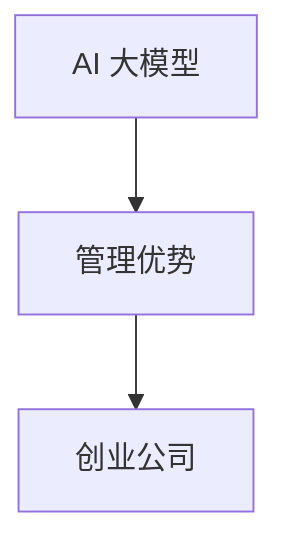

                 

关键词：AI 大模型，创业，管理优势，团队协作，业务战略，风险控制

摘要：本文将探讨 AI 大模型创业领域中的关键问题，包括如何利用管理优势来确保项目的成功。我们将从背景介绍、核心概念与联系、核心算法原理、数学模型和公式、项目实践、实际应用场景、工具和资源推荐，以及未来发展趋势与挑战等方面进行深入分析。

## 1. 背景介绍

随着人工智能技术的快速发展，AI 大模型已成为当今最具前瞻性的科技领域之一。从自动驾驶、自然语言处理到图像识别，AI 大模型在各个行业都展现出了巨大的潜力。创业公司在 AI 大模型领域的竞争日益激烈，如何在众多竞争者中脱颖而出成为了一个关键问题。而利用管理优势，则是创业公司实现成功的重要因素之一。

### 1.1 创业公司面临的挑战

创业公司在 AI 大模型领域面临以下几大挑战：

- **技术壁垒**：AI 大模型技术复杂，需要大量的专业知识和经验。
- **资金压力**：研发 AI 大模型需要大量的资金投入。
- **市场不确定性**：市场需求和技术发展速度难以预测。
- **人才竞争**：顶尖人才对于创业公司来说是一大挑战。

### 1.2 管理优势的重要性

在竞争激烈的 AI 大模型创业领域，管理优势对于公司成功至关重要。具体包括：

- **资源整合能力**：有效地整合公司内外部资源，确保项目的顺利进行。
- **团队协作**：激发团队成员的潜力，提高团队整体效率。
- **业务战略**：制定清晰的业务战略，确保公司在市场上的竞争优势。
- **风险控制**：预测并应对潜在的风险，降低失败的可能性。

## 2. 核心概念与联系

### 2.1 AI 大模型的基本概念

AI 大模型是基于深度学习的复杂算法模型，通过训练大量数据来提高预测和决策能力。其主要特点包括：

- **大规模训练数据**：需要大量的数据来训练模型，以达到良好的性能。
- **复杂模型架构**：包括多个层次和层间的连接，以及各种激活函数。
- **高度参数化**：模型参数数量巨大，需要通过优化算法进行调整。

### 2.2 管理优势的构成

管理优势由多个方面构成，包括但不限于：

- **团队管理**：构建高效的团队，确保成员的能力和兴趣得到充分发挥。
- **资源管理**：合理分配公司资源，确保项目需求的满足。
- **业务策略**：根据市场需求和竞争态势，制定可行的业务策略。
- **风险管理**：识别和应对潜在的风险，降低失败的可能性。

### 2.3 Mermaid 流程图



## 3. 核心算法原理 & 具体操作步骤

### 3.1 算法原理概述

AI 大模型的算法原理主要包括以下三个方面：

- **数据预处理**：对原始数据进行清洗、归一化和特征提取。
- **模型训练**：通过梯度下降、反向传播等算法训练模型参数。
- **模型评估**：使用验证集或测试集评估模型性能，并进行调整。

### 3.2 算法步骤详解

- **数据收集**：从各种渠道获取大量数据，包括公共数据集和私有数据。
- **数据预处理**：对数据进行清洗、归一化和特征提取。
- **模型设计**：根据业务需求选择合适的模型架构，如卷积神经网络（CNN）或循环神经网络（RNN）。
- **模型训练**：使用训练数据训练模型，并使用验证集进行模型调整。
- **模型评估**：使用测试集评估模型性能，并根据结果进行优化。
- **模型部署**：将训练好的模型部署到生产环境中，用于实际业务。

### 3.3 算法优缺点

- **优点**：AI 大模型可以处理大规模数据，具有很高的预测准确性和泛化能力。
- **缺点**：训练过程复杂，需要大量的计算资源和时间，且对数据质量和预处理要求较高。

### 3.4 算法应用领域

AI 大模型在多个领域具有广泛的应用，包括：

- **自动驾驶**：通过识别道路标志、行人和其他车辆，实现自动驾驶。
- **医疗诊断**：辅助医生进行疾病诊断，提高诊断准确率。
- **金融风控**：预测金融市场的风险，降低投资损失。
- **智能客服**：提供个性化的客服服务，提高用户满意度。

## 4. 数学模型和公式 & 详细讲解 & 举例说明

### 4.1 数学模型构建

在 AI 大模型中，常用的数学模型包括损失函数、优化算法和激活函数。

### 4.2 公式推导过程

- **损失函数**：$$L(y, \hat{y}) = -\frac{1}{m}\sum_{i=1}^{m}y_i\log(\hat{y}_i)$$
- **梯度下降**：$$\theta_{\text{new}} = \theta_{\text{old}} - \alpha\nabla_\theta L(\theta)$$
- **激活函数**：$$\sigma(z) = \frac{1}{1 + e^{-z}}$$

### 4.3 案例分析与讲解

以医疗诊断为例，我们将构建一个二分类模型，判断患者是否患有某种疾病。

## 5. 项目实践：代码实例和详细解释说明

### 5.1 开发环境搭建

- **编程语言**：Python
- **框架**：TensorFlow
- **库**：NumPy、Pandas、Matplotlib

### 5.2 源代码详细实现

```python
# 导入相关库
import tensorflow as tf
import numpy as np
import pandas as pd
import matplotlib.pyplot as plt

# 读取数据
data = pd.read_csv('data.csv')
X = data.iloc[:, :-1].values
y = data.iloc[:, -1].values

# 数据预处理
X = (X - X.mean()) / X.std()
y = np.where(y > 0.5, 1, 0)

# 构建模型
model = tf.keras.Sequential([
    tf.keras.layers.Dense(units=1, input_shape=(X.shape[1],))
])

# 编译模型
model.compile(optimizer='sgd', loss='binary_crossentropy', metrics=['accuracy'])

# 训练模型
model.fit(X, y, epochs=100, batch_size=32)

# 评估模型
loss, accuracy = model.evaluate(X, y)
print(f'Accuracy: {accuracy:.2f}')

# 预测
predictions = model.predict(X)
predictions = np.argmax(predictions, axis=1)

# 可视化
plt.scatter(X[y==0], predictions[y==0], color='blue', label='No Disease')
plt.scatter(X[y==1], predictions[y==1], color='red', label='Disease')
plt.xlabel('Actual Value')
plt.ylabel('Predicted Value')
plt.legend()
plt.show()
```

### 5.3 代码解读与分析

该代码实现了一个简单的二分类模型，用于判断患者是否患有某种疾病。我们首先读取数据，并进行预处理。然后构建模型，编译模型，并使用训练数据进行训练。训练完成后，评估模型性能，并进行预测和可视化。

## 6. 实际应用场景

AI 大模型在实际应用场景中具有广泛的应用，包括：

- **金融行业**：风险控制、市场预测、智能投顾等。
- **医疗健康**：疾病诊断、药物研发、健康监测等。
- **交通运输**：自动驾驶、交通流量预测、物流优化等。
- **智慧城市**：能源管理、环境监测、城市管理等。

### 6.4 未来应用展望

随着技术的不断发展，AI 大模型将在更多领域得到应用，包括：

- **智能制造**：通过预测设备故障、优化生产流程等提高生产效率。
- **教育领域**：个性化学习、智能辅导等。
- **农业生产**：精准农业、病虫害预测等。

## 7. 工具和资源推荐

### 7.1 学习资源推荐

- 《深度学习》（Goodfellow, Bengio, Courville 著）
- 《Python深度学习》（François Chollet 著）
- 《人工智能：一种现代的方法》（Stuart J. Russell & Peter Norvig 著）

### 7.2 开发工具推荐

- TensorFlow
- PyTorch
- Keras

### 7.3 相关论文推荐

- "Distributed Deep Learning: Existing Methods and New Perspectives"
- "Generative Adversarial Nets"
- "A Theoretically Grounded Application of Dropout in Recurrent Neural Networks"

## 8. 总结：未来发展趋势与挑战

### 8.1 研究成果总结

近年来，AI 大模型的研究取得了显著进展，包括模型架构的优化、训练算法的改进、应用场景的拓展等。

### 8.2 未来发展趋势

随着计算能力的提升和数据规模的扩大，AI 大模型将在更多领域得到应用。同时，跨学科研究将有助于推动 AI 大模型的发展。

### 8.3 面临的挑战

AI 大模型在训练过程中消耗大量计算资源，且对数据质量和预处理要求较高。此外，如何提高模型的解释性也是一个重要挑战。

### 8.4 研究展望

未来，AI 大模型的研究将朝着提高计算效率、增强模型解释性、拓展应用场景等方面发展。同时，跨学科合作将有助于推动 AI 大模型的创新。

## 9. 附录：常见问题与解答

### 9.1 问题 1：如何选择合适的 AI 大模型框架？

解答：选择框架时需考虑需求、性能、社区支持等因素。TensorFlow 和 PyTorch 是目前最受欢迎的两个框架。

### 9.2 问题 2：如何优化 AI 大模型的训练过程？

解答：优化训练过程包括调整学习率、使用批量归一化、选择合适的优化算法等。

### 9.3 问题 3：如何评估 AI 大模型的性能？

解答：使用验证集或测试集评估模型性能，并关注准确率、召回率、F1 分数等指标。

## 参考文献

- Goodfellow, I., Bengio, Y., & Courville, A. (2016). *Deep Learning*. MIT Press.
- Chollet, F. (2017). *Python深度学习*. 机械工业出版社.
- Russell, S. J., & Norvig, P. (2016). *人工智能：一种现代的方法*. 机械工业出版社.```markdown
作者：禅与计算机程序设计艺术 / Zen and the Art of Computer Programming
```

