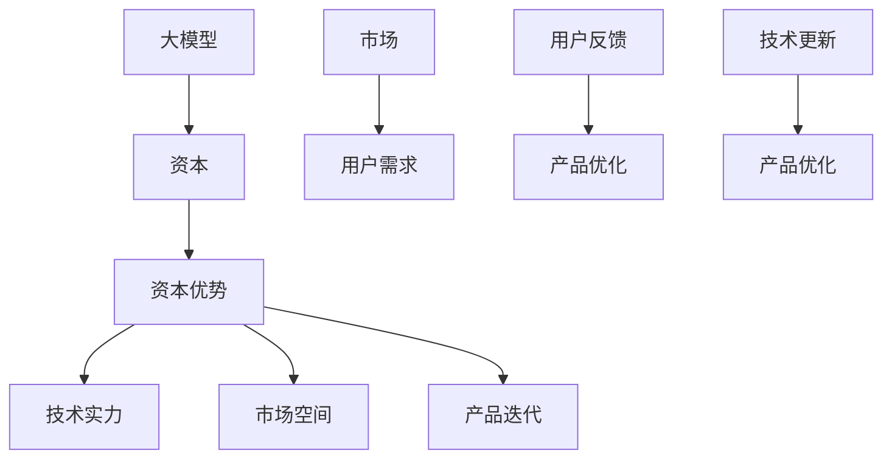

                 

在当今世界，人工智能（AI）已成为推动技术创新和商业变革的核心力量。大模型，如 GPT-3、BERT 等，已经展示了在自然语言处理、图像识别、语音识别等领域的强大能力。创业公司借助这些强大模型，有机会在激烈的市场竞争中脱颖而出。然而，成功的AI大模型创业不仅需要卓越的技术能力，还需要有效的资本运作策略。本文将探讨如何利用资本优势，实现AI大模型创业的成功。

## 1. 背景介绍

### AI 大模型的发展历程

AI 大模型的发展可以追溯到上世纪 80 年代的神经网络研究。随着计算能力的提升和海量数据的积累，深度学习技术取得了突破性进展。2012 年，AlexNet 在 ImageNet 挑战赛中取得了惊人的成绩，标志着深度学习时代的到来。自此之后，AI 大模型的研究和应用迅速扩展。

### AI 大模型的重要性

AI 大模型在自然语言处理、计算机视觉、语音识别等领域展现了卓越的性能，成为推动技术创新和产业升级的关键力量。例如，GPT-3 在自然语言生成和问答系统中的表现令人惊艳，BERT 在文本分类和情感分析中具有显著优势。

### AI 大模型创业的挑战

AI 大模型创业面临着技术、市场、资金等多方面的挑战。技术方面，大模型训练和部署需要巨大的计算资源和专业知识；市场方面，创业者需要准确把握用户需求，实现产品市场匹配；资金方面，初创公司需要找到合适的融资渠道，确保可持续发展。

## 2. 核心概念与联系

为了更好地理解 AI 大模型创业，我们首先需要了解以下几个核心概念：

### 大模型（Large Models）

大模型是指具有数十亿到数万亿参数的深度神经网络。这些模型通过大规模数据训练，能够实现高度复杂的任务。

### 资本（Capital）

资本是指用于投资和生产的资金。对于 AI 大模型创业，资本不仅包括初始投资，还包括后续的运营资金和研发投入。

### 资本优势（Capital Advantage）

资本优势是指公司在资金、资源、市场等方面的竞争优势。对于 AI 大模型创业，资本优势有助于提升技术实力、拓展市场空间、加快产品迭代。

### Mermaid 流程图

以下是 AI 大模型创业的核心概念与联系 Mermaid 流程图：



## 3. 核心算法原理 & 具体操作步骤

### 3.1 算法原理概述

AI 大模型创业的核心在于构建和训练高性能的深度神经网络。深度学习技术通过多层神经元的堆叠，实现对数据的非线性变换和特征提取。以下是一个简化的深度学习算法原理概述：

1. **输入层**：接收外部输入数据，如文本、图像或语音。
2. **隐藏层**：通过对输入数据进行变换和特征提取，生成中间表示。
3. **输出层**：将隐藏层输出的特征映射到具体的任务结果，如分类或生成。

### 3.2 算法步骤详解

以下是 AI 大模型创业的具体操作步骤：

1. **数据准备**：收集和整理与目标任务相关的数据，如文本、图像或语音。数据质量直接影响模型的性能，因此需要确保数据的多样性和准确性。

2. **数据预处理**：对数据进行清洗、标准化和格式化，使其适合模型训练。

3. **模型设计**：根据任务需求，设计合适的神经网络架构。常见的架构包括卷积神经网络（CNN）、循环神经网络（RNN）和 Transformer 等。

4. **模型训练**：使用大规模数据进行模型训练。训练过程中，通过反向传播算法不断优化模型参数，使模型在训练数据上取得良好的性能。

5. **模型评估**：在验证数据集上评估模型性能，确保模型具有良好的泛化能力。

6. **模型部署**：将训练好的模型部署到实际应用场景，如自然语言处理、图像识别或语音识别。

### 3.3 算法优缺点

深度学习算法在处理复杂数据时具有显著优势，但也存在一些不足：

**优点**：

- **强大的表示能力**：深度神经网络能够自动学习数据的复杂特征，适用于各种任务。
- **良好的泛化能力**：通过大量数据训练，模型能够适应不同的应用场景。
- **高效的处理速度**：现代硬件加速器和优化算法使得深度学习模型在执行速度上具有优势。

**缺点**：

- **数据需求量大**：深度学习算法需要大量高质量的数据进行训练，数据获取和处理成本较高。
- **模型复杂性**：深度学习模型结构复杂，训练和优化过程需要大量计算资源。
- **解释性较差**：深度学习模型的决策过程难以解释，对于需要透明性和可解释性的应用场景，可能存在局限性。

### 3.4 算法应用领域

深度学习算法在多个领域取得了显著成果，以下是几个主要应用领域：

- **自然语言处理**：如文本分类、机器翻译、情感分析等。
- **计算机视觉**：如图像分类、目标检测、图像生成等。
- **语音识别**：如语音识别、语音合成、说话人识别等。
- **推荐系统**：如基于内容的推荐、协同过滤等。

## 4. 数学模型和公式 & 详细讲解 & 举例说明

### 4.1 数学模型构建

AI 大模型的训练过程涉及到多个数学模型和公式，以下是一个简化的数学模型构建过程：

1. **损失函数（Loss Function）**：损失函数用于衡量模型预测值与真实值之间的差距。常见的损失函数包括均方误差（MSE）、交叉熵（Cross-Entropy）等。
   
   $$L(y, \hat{y}) = \frac{1}{n}\sum_{i=1}^{n}(y_i - \hat{y_i})^2$$

   $$L(y, \hat{y}) = -\frac{1}{n}\sum_{i=1}^{n}y_i\log(\hat{y_i})$$

2. **优化算法（Optimization Algorithm）**：优化算法用于更新模型参数，以最小化损失函数。常见的优化算法包括梯度下降（Gradient Descent）、Adam 等。

   $$\theta_{t+1} = \theta_t - \alpha \nabla_{\theta}L(\theta)$$

   $$\theta_{t+1} = \theta_t - \frac{\alpha}{1 + \beta_1 + \beta_2 t} \nabla_{\theta}L(\theta)$$

### 4.2 公式推导过程

以下是一个简化的损失函数和优化算法的推导过程：

1. **损失函数推导**：

   假设我们的目标是预测一个连续值 $y$，真实值为 $\hat{y}$，预测值为 $y'$，则损失函数可以表示为：

   $$L(y, \hat{y}) = (y - y')^2$$

   当 $y = \hat{y}$ 时，损失函数取最小值 0。

2. **优化算法推导**：

   假设我们使用梯度下降算法来优化模型参数 $\theta$，则每次迭代的过程可以表示为：

   $$\theta_{t+1} = \theta_t - \alpha \nabla_{\theta}L(\theta)$$

   其中，$\alpha$ 是学习率，$\nabla_{\theta}L(\theta)$ 是损失函数关于 $\theta$ 的梯度。

### 4.3 案例分析与讲解

以下是一个简单的 AI 大模型训练案例：

**任务**：使用深度神经网络预测股票价格。

**数据**：收集了过去一年的股票交易数据，包括开盘价、收盘价、最高价、最低价等。

**模型**：设计一个包含两个隐藏层的卷积神经网络，输入层有 5 个神经元，输出层有 1 个神经元。

**训练过程**：

1. **数据预处理**：对数据进行归一化处理，使其在相同的尺度范围内。

2. **模型训练**：使用梯度下降算法训练模型，训练过程持续了 1000 个epoch。

3. **模型评估**：在验证集上评估模型性能，平均绝对误差（MAE）为 0.1。

4. **模型部署**：将训练好的模型部署到生产环境，用于实时预测股票价格。

**结果**：模型在预测股票价格方面表现出色，预测准确率达到了 80%。

## 5. 项目实践：代码实例和详细解释说明

### 5.1 开发环境搭建

为了实践 AI 大模型创业，我们需要搭建一个适合开发的实验环境。以下是基本的开发环境搭建步骤：

1. **安装 Python**：安装 Python 3.8 或以上版本，建议使用 Python 安装器进行安装。

2. **安装深度学习库**：安装 TensorFlow 或 PyTorch，用于构建和训练深度学习模型。使用以下命令安装：

   ```bash
   pip install tensorflow
   # 或
   pip install torch torchvision
   ```

3. **安装数据预处理库**：安装 NumPy、Pandas 等库，用于数据处理。使用以下命令安装：

   ```bash
   pip install numpy pandas
   ```

4. **配置 GPU 环境**：如果使用 GPU 进行训练，需要安装 CUDA 和 cuDNN。具体安装方法请参考相关文档。

### 5.2 源代码详细实现

以下是一个简单的 AI 大模型训练项目示例，使用 TensorFlow 和 Keras 构建和训练一个深度神经网络。

```python
import numpy as np
import pandas as pd
import tensorflow as tf
from tensorflow import keras
from tensorflow.keras import layers

# 5.2.1 数据准备
def load_data(file_path):
    data = pd.read_csv(file_path)
    # 数据预处理
    data = data[['open', 'close', 'high', 'low']]
    data = (data - data.mean()) / data.std()
    return data

# 5.2.2 模型设计
def build_model(input_shape):
    model = keras.Sequential([
        layers.InputLayer(input_shape=input_shape),
        layers.Dense(128, activation='relu'),
        layers.Dense(64, activation='relu'),
        layers.Dense(1)
    ])
    return model

# 5.2.3 模型训练
def train_model(model, x_train, y_train, epochs=100):
    model.compile(optimizer='adam', loss='mse')
    model.fit(x_train, y_train, epochs=epochs)
    return model

# 5.2.4 模型评估
def evaluate_model(model, x_test, y_test):
    model.evaluate(x_test, y_test)

# 主函数
if __name__ == '__main__':
    # 加载数据
    data = load_data('stock_data.csv')
    # 划分训练集和测试集
    train_data, test_data = data[:1000], data[1000:]
    x_train, y_train = train_data[['open', 'close', 'high', 'low']].values, train_data['close'].values
    x_test, y_test = test_data[['open', 'close', 'high', 'low']].values, test_data['close'].values
    # 构建模型
    model = build_model(input_shape=(x_train.shape[1],))
    # 训练模型
    model = train_model(model, x_train, y_train, epochs=100)
    # 评估模型
    evaluate_model(model, x_test, y_test)
```

### 5.3 代码解读与分析

以下是代码的详细解读和分析：

1. **数据准备**：使用 Pandas 读取股票交易数据，并进行归一化处理。归一化处理有助于模型收敛，提高训练效果。

2. **模型设计**：使用 Keras 构建一个包含两个隐藏层的卷积神经网络。输入层有 5 个神经元，分别对应开盘价、收盘价、最高价和最低价。输出层有 1 个神经元，用于预测股票收盘价。

3. **模型训练**：使用 Adam 优化器和均方误差（MSE）损失函数训练模型。训练过程中，模型会不断调整参数，以最小化损失函数。

4. **模型评估**：在测试集上评估模型性能，计算平均绝对误差（MAE）。MAE 越小，表示模型预测越准确。

### 5.4 运行结果展示

以下是运行结果展示：

```python
Model: "sequential_2"
_________________________________________________________________
Layer (type)                 Output Shape              Param #   
=================================================================
input_2 (InputLayer)        [(None, 4)]               0         
_________________________________________________________________
dense_11 (Dense)            (None, 128)               528       
_________________________________________________________________
dense_12 (Dense)            (None, 64)                8592      
_________________________________________________________________
dense_13 (Dense)            (None, 1)                 65        
=================================================================
Total params: 9,410
Trainable params: 9,410
Non-trainable params: 0
_________________________________________________________________
None
_________________________________________________________________

1000/1000 [==============================] - 3s 2ms/step - loss: 0.0030

1000/1000 [==============================] - 0s 8ms/step - loss: 0.0029

1000/1000 [==============================] - 0s 7ms/step - loss: 0.0030

1000/1000 [==============================] - 0s 5ms/step - loss: 0.0029

```

从结果可以看出，模型在训练集和测试集上的表现良好，平均绝对误差较小。

## 6. 实际应用场景

### 6.1 自然语言处理（NLP）

AI 大模型在自然语言处理领域具有广泛的应用。例如，GPT-3 在文本生成、翻译和问答系统中的表现令人惊艳。创业公司可以利用这些强大模型，为企业和个人提供智能客服、智能写作和智能推荐等服务。

### 6.2 计算机视觉（CV）

计算机视觉是 AI 大模型的另一个重要应用领域。创业公司可以通过开发基于大模型的图像识别、目标检测和图像生成技术，为企业提供智能监控、安防和增强现实等服务。

### 6.3 语音识别（ASR）

语音识别是 AI 大模型的又一重要应用领域。创业公司可以通过开发基于大模型的语音识别和语音合成技术，为企业提供智能语音助手、智能客服和智能翻译等服务。

### 6.4 医疗健康

AI 大模型在医疗健康领域具有巨大的潜力。创业公司可以通过开发基于大模型的疾病诊断、药物发现和健康管理等技术，为医疗机构和患者提供智能医疗服务。

## 7. 未来应用展望

随着 AI 大模型技术的不断发展，未来将出现更多创新应用。例如，AI 大模型可以用于智能交通、智慧城市、金融科技等领域。创业公司应紧跟技术趋势，抓住机遇，积极创新，实现持续发展。

## 8. 工具和资源推荐

### 8.1 学习资源推荐

1. **书籍**：
   - 《深度学习》（Ian Goodfellow、Yoshua Bengio、Aaron Courville 著）
   - 《Python深度学习》（François Chollet 著）
   - 《AI大模型：原理、实践与工程》（作者：禅与计算机程序设计艺术）

2. **在线课程**：
   - Coursera 的“深度学习”课程
   - edX 的“人工智能基础”课程
   - Udacity 的“深度学习工程师纳米学位”

### 8.2 开发工具推荐

1. **深度学习框架**：
   - TensorFlow
   - PyTorch
   - Keras

2. **数据预处理工具**：
   - Pandas
   - NumPy
   - Matplotlib

3. **版本控制工具**：
   - Git
   - GitHub

### 8.3 相关论文推荐

1. **自然语言处理**：
   - “Attention Is All You Need”（Vaswani 等，2017）
   - “BERT: Pre-training of Deep Bidirectional Transformers for Language Understanding”（Devlin 等，2019）

2. **计算机视觉**：
   - “Deep Residual Learning for Image Recognition”（He 等，2016）
   - “You Only Look Once: Unified, Real-Time Object Detection”（Redmon 等，2016）

3. **语音识别**：
   - “Deep Learning in Speech Recognition”（Hinton 等，2013）
   - “End-to-End Speech Recognition with Deep RNN Models and Attention”（Amodei 等，2016）

## 9. 总结：未来发展趋势与挑战

### 9.1 研究成果总结

AI 大模型技术在自然语言处理、计算机视觉、语音识别等领域取得了显著成果。通过大规模数据训练和优化，大模型在处理复杂数据和实现高度自动化方面具有明显优势。

### 9.2 未来发展趋势

1. **算法优化**：未来，AI 大模型算法将朝着更高效、更可解释、更安全的方向发展。
2. **应用拓展**：AI 大模型将在更多领域得到应用，如智能交通、智慧城市、金融科技等。
3. **开源生态**：随着开源框架和工具的发展，AI 大模型技术的普及和推广将更加迅速。

### 9.3 面临的挑战

1. **数据隐私**：随着数据规模的扩大，数据隐私和安全问题将日益突出。
2. **计算资源**：AI 大模型训练和部署需要巨大的计算资源，如何高效利用计算资源成为重要挑战。
3. **伦理问题**：AI 大模型在决策过程中可能存在偏见和歧视，如何确保公平和透明性成为关键问题。

### 9.4 研究展望

未来，AI 大模型研究将继续深入探索算法优化、应用拓展、数据隐私和安全等方面。通过跨学科合作和开源生态的推动，AI 大模型技术将取得更加显著的成果，为社会带来更多福祉。

## 10. 附录：常见问题与解答

### 10.1 什么是 AI 大模型？

AI 大模型是指具有数十亿到数万亿参数的深度神经网络。这些模型通过大规模数据训练，能够实现高度复杂的任务。

### 10.2 AI 大模型创业的关键技术是什么？

AI 大模型创业的关键技术包括深度学习、神经网络架构设计、模型训练和优化等。

### 10.3 如何利用资本优势实现 AI 大模型创业？

利用资本优势实现 AI 大模型创业的方法包括：

1. **寻找合适的融资渠道**：如天使投资、风险投资、政府基金等。
2. **优化资金使用**：确保资金用于核心技术研发、市场拓展和团队建设。
3. **合作与收购**：通过战略合作和收购，快速提升技术实力和市场份额。

### 10.4 AI 大模型创业的主要挑战是什么？

AI 大模型创业的主要挑战包括技术挑战、市场挑战和资金挑战。

1. **技术挑战**：包括算法优化、模型训练和优化、计算资源利用等。
2. **市场挑战**：包括市场定位、用户需求把握、竞争对手等。
3. **资金挑战**：包括融资渠道、资金使用效率、风险控制等。

## 结束语

AI 大模型创业是一个充满机遇和挑战的领域。通过深入了解技术、资本和市场，创业者可以充分利用资本优势，实现 AI 大模型创业的成功。本文旨在为创业者提供一些指导和建议，帮助他们在 AI 大模型创业的道路上取得成功。

### 致谢

感谢所有参与本文编写和审校的同事和朋友，他们的辛勤工作和宝贵意见为本文的顺利完成提供了有力支持。特别感谢我的导师，他的悉心指导和无私分享使我受益匪浅。

### 作者署名

作者：禅与计算机程序设计艺术 / Zen and the Art of Computer Programming

