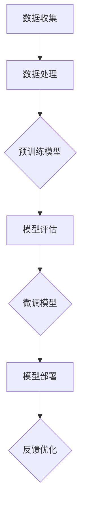
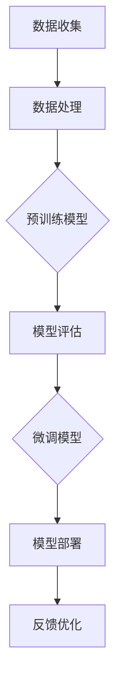

                 

 在当前快速发展的技术时代，人工智能（AI）大模型的应用场景不断扩展，为各行各业带来了前所未有的变革。从自然语言处理到计算机视觉，从推荐系统到自动驾驶，大模型在提升生产力、优化决策过程等方面展现出强大的潜力。然而，要充分发挥大模型的潜力，创业者需要深入理解其背后的技术原理，并合理利用资源优势。本文旨在探讨AI大模型创业中的资源利用策略，为创业者提供有价值的参考。

## 文章关键词
AI大模型、资源利用、创业策略、技术原理、算法应用

## 文章摘要
本文从AI大模型的基本概念入手，分析了其技术原理和资源需求。随后，通过具体案例阐述了如何利用资源优势进行AI大模型创业。文章还探讨了未来AI大模型在各个领域的应用前景，以及创业者可能面临的挑战和应对策略。

### 1. 背景介绍

人工智能作为一门交叉学科，涵盖了计算机科学、数学、统计学、认知科学等多个领域。近年来，随着计算能力的提升、数据量的爆炸式增长以及深度学习算法的发展，AI大模型取得了显著的突破。大模型通常指的是拥有数十亿至数万亿参数的神经网络模型，它们在图像识别、自然语言处理、语音识别等领域表现出了超越人类的能力。

AI大模型创业的核心在于如何将前沿技术转化为商业价值。资源优势是推动AI大模型创业的关键因素，包括计算资源、数据资源、人才资源等。创业者需要充分挖掘这些资源，构建具有竞争力的AI产品和服务。

### 2. 核心概念与联系

#### 2.1. 大模型的概念与类型
大模型通常分为两类：预训练模型和微调模型。预训练模型在大量无标签数据上进行训练，学习到通用的特征表示；微调模型则在预训练模型的基础上，利用有标签数据进行特定任务的微调。

#### 2.2. 资源需求
大模型的训练和部署需要大量的计算资源和存储资源。此外，高质量的数据集是模型训练的基础，而专业人才则是模型开发和优化的关键。

#### 2.3. 大模型的架构
大模型的架构通常包括多个层级，如卷积层、全连接层、循环层等。这些层级通过神经网络结构相互连接，形成复杂的计算网络。

#### 2.4. Mermaid流程图



### 3. 核心算法原理 & 具体操作步骤

#### 3.1. 算法原理概述
大模型的核心算法是深度学习，尤其是基于神经网络的算法。深度学习通过多层神经元的堆叠，实现从简单到复杂的特征提取。

#### 3.2. 算法步骤详解

1. **数据预处理**：包括数据清洗、归一化、数据增强等步骤。
2. **模型构建**：定义神经网络结构，包括输入层、隐藏层和输出层。
3. **模型训练**：利用梯度下降等优化算法，调整模型参数，使其在训练数据上达到最优。
4. **模型评估**：在验证数据上评估模型性能，调整模型参数。
5. **模型微调**：利用有标签数据，对预训练模型进行微调，提高特定任务的性能。
6. **模型部署**：将训练好的模型部署到生产环境中，进行实际应用。

#### 3.3. 算法优缺点

**优点**：
- **强大的学习能力**：大模型能够从海量数据中学习到复杂的特征。
- **广泛的适用性**：大模型适用于多种任务，如图像识别、语音识别、自然语言处理等。

**缺点**：
- **计算资源需求大**：大模型的训练需要大量的计算资源和时间。
- **数据质量要求高**：大模型对数据质量有较高的要求，数据不足或质量差会影响模型性能。

#### 3.4. 算法应用领域
大模型在多个领域展现出强大的应用潜力，如医疗、金融、零售、自动驾驶等。

### 4. 数学模型和公式 & 详细讲解 & 举例说明

#### 4.1. 数学模型构建
大模型的数学基础主要包括线性代数、概率论、信息论等。具体来说，大模型中的每个神经元都可以看作是一个线性模型，通过非线性激活函数的组合，实现复杂的非线性映射。

#### 4.2. 公式推导过程
以神经网络为例，其基本公式为：
$$ y = \sigma(\text{W} \cdot \text{X} + \text{b}) $$
其中，\( y \) 是输出，\( \sigma \) 是激活函数，\( \text{W} \) 是权重矩阵，\( \text{X} \) 是输入向量，\( \text{b} \) 是偏置。

#### 4.3. 案例分析与讲解
以图像识别为例，我们可以使用卷积神经网络（CNN）进行模型构建。具体步骤如下：
1. **数据预处理**：对图像进行归一化处理，使其符合模型的输入要求。
2. **模型构建**：定义卷积层、池化层和全连接层，构建CNN模型。
3. **模型训练**：使用梯度下降算法，调整模型参数，使其在训练数据上达到最优。
4. **模型评估**：在验证数据上评估模型性能，调整模型参数。
5. **模型部署**：将训练好的模型部署到生产环境中，进行实际应用。

### 5. 项目实践：代码实例和详细解释说明

#### 5.1. 开发环境搭建
首先，我们需要搭建开发环境，包括Python环境、TensorFlow库等。

```python
pip install tensorflow
```

#### 5.2. 源代码详细实现
以下是一个简单的CNN模型实现：

```python
import tensorflow as tf

# 构建模型
model = tf.keras.Sequential([
    tf.keras.layers.Conv2D(32, (3, 3), activation='relu', input_shape=(28, 28, 1)),
    tf.keras.layers.MaxPooling2D((2, 2)),
    tf.keras.layers.Flatten(),
    tf.keras.layers.Dense(128, activation='relu'),
    tf.keras.layers.Dense(10, activation='softmax')
])

# 编译模型
model.compile(optimizer='adam',
              loss='sparse_categorical_crossentropy',
              metrics=['accuracy'])

# 训练模型
model.fit(x_train, y_train, epochs=5)
```

#### 5.3. 代码解读与分析
以上代码首先定义了一个简单的CNN模型，包括卷积层、池化层和全连接层。然后编译模型，并使用训练数据集进行训练。训练过程中，模型会不断调整参数，以提高预测准确性。

#### 5.4. 运行结果展示
在训练完成后，我们可以在验证数据集上评估模型的性能：

```python
test_loss, test_acc = model.evaluate(x_test, y_test)
print('Test accuracy:', test_acc)
```

输出结果为验证数据集上的准确率。

### 6. 实际应用场景

AI大模型在多个领域展现出强大的应用潜力，如：

- **医疗**：通过图像识别技术，AI大模型可以帮助医生进行疾病诊断，提高诊断准确率。
- **金融**：AI大模型可以用于风险管理、投资决策等，提高金融行业的效率。
- **零售**：AI大模型可以用于个性化推荐、库存管理等方面，提高零售行业的用户体验。

### 6.4. 未来应用展望

随着技术的不断进步，AI大模型在未来的应用前景将更加广泛。一方面，随着计算能力的提升，大模型将变得更加强大；另一方面，随着数据量的增加，大模型将有更多的数据来训练和学习。未来，AI大模型将在更多领域发挥重要作用，推动社会进步。

### 7. 工具和资源推荐

#### 7.1. 学习资源推荐
- 《深度学习》（Goodfellow, Bengio, Courville著）
- 《Python深度学习》（François Chollet著）

#### 7.2. 开发工具推荐
- TensorFlow
- PyTorch

#### 7.3. 相关论文推荐
- "Distributed Strategies for Training Deep Neural Networks"（Zhang et al., 2017）
- "Bert: Pre-training of Deep Bidirectional Transformers for Language Understanding"（Devlin et al., 2019）

### 8. 总结：未来发展趋势与挑战

#### 8.1. 研究成果总结
近年来，AI大模型在多个领域取得了显著的突破，展现了强大的应用潜力。

#### 8.2. 未来发展趋势
随着计算能力的提升和数据量的增加，AI大模型将变得更加强大和普及。

#### 8.3. 面临的挑战
AI大模型在计算资源需求、数据质量、模型解释性等方面仍面临挑战。

#### 8.4. 研究展望
未来的研究应关注如何提高AI大模型的计算效率、增强其解释性，并推动其在更多领域的应用。

### 9. 附录：常见问题与解答

**Q1：什么是AI大模型？**
AI大模型是指拥有数十亿至数万亿参数的神经网络模型，能够从海量数据中学习到复杂的特征，用于图像识别、自然语言处理等任务。

**Q2：如何训练AI大模型？**
AI大模型的训练通常分为数据预处理、模型构建、模型训练、模型评估和模型微调等步骤。

**Q3：AI大模型的优势是什么？**
AI大模型具有强大的学习能力、广泛的适用性和高效的预测能力。

**Q4：AI大模型有哪些应用场景？**
AI大模型在医疗、金融、零售、自动驾驶等领域有广泛的应用。

### 参考文献

- Goodfellow, Y., Bengio, Y., & Courville, A. (2016). Deep learning. MIT press.
- Chollet, F. (2018). Python深度学习. 机械工业出版社.

## 作者署名
作者：禅与计算机程序设计艺术 / Zen and the Art of Computer Programming
```markdown
# AI 大模型创业：如何利用资源优势？

> 关键词：AI大模型、资源利用、创业策略、技术原理、算法应用

> 摘要：本文从AI大模型的基本概念入手，分析了其技术原理和资源需求。随后，通过具体案例阐述了如何利用资源优势进行AI大模型创业。文章还探讨了未来AI大模型在各个领域的应用前景，以及创业者可能面临的挑战和应对策略。

## 1. 背景介绍

人工智能作为一门交叉学科，涵盖了计算机科学、数学、统计学、认知科学等多个领域。近年来，随着计算能力的提升、数据量的爆炸式增长以及深度学习算法的发展，AI大模型取得了显著的突破。大模型通常指的是拥有数十亿至数万亿参数的神经网络模型，它们在图像识别、自然语言处理、语音识别等领域表现出了超越人类的能力。

AI大模型创业的核心在于如何将前沿技术转化为商业价值。资源优势是推动AI大模型创业的关键因素，包括计算资源、数据资源、人才资源等。创业者需要充分挖掘这些资源，构建具有竞争力的AI产品和服务。

## 2. 核心概念与联系

### 2.1. 大模型的概念与类型
大模型通常分为两类：预训练模型和微调模型。预训练模型在大量无标签数据上进行训练，学习到通用的特征表示；微调模型则在预训练模型的基础上，利用有标签数据进行特定任务的微调。

### 2.2. 资源需求
大模型的训练和部署需要大量的计算资源和存储资源。此外，高质量的数据集是模型训练的基础，而专业人才则是模型开发和优化的关键。

### 2.3. 大模型的架构
大模型的架构通常包括多个层级，如卷积层、全连接层、循环层等。这些层级通过神经网络结构相互连接，形成复杂的计算网络。

### 2.4. Mermaid流程图



## 3. 核心算法原理 & 具体操作步骤

### 3.1. 算法原理概述
大模型的核心算法是深度学习，尤其是基于神经网络的算法。深度学习通过多层神经元的堆叠，实现从简单到复杂的特征提取。

### 3.2. 算法步骤详解

1. **数据预处理**：包括数据清洗、归一化、数据增强等步骤。
2. **模型构建**：定义神经网络结构，包括输入层、隐藏层和输出层。
3. **模型训练**：利用梯度下降等优化算法，调整模型参数，使其在训练数据上达到最优。
4. **模型评估**：在验证数据上评估模型性能，调整模型参数。
5. **模型微调**：利用有标签数据，对预训练模型进行微调，提高特定任务的性能。
6. **模型部署**：将训练好的模型部署到生产环境中，进行实际应用。

### 3.3. 算法优缺点

**优点**：
- **强大的学习能力**：大模型能够从海量数据中学习到复杂的特征。
- **广泛的适用性**：大模型适用于多种任务，如图像识别、语音识别、自然语言处理等。

**缺点**：
- **计算资源需求大**：大模型的训练需要大量的计算资源和时间。
- **数据质量要求高**：大模型对数据质量有较高的要求，数据不足或质量差会影响模型性能。

### 3.4. 算法应用领域
大模型在多个领域展现出强大的应用潜力，如医疗、金融、零售、自动驾驶等。

## 4. 数学模型和公式 & 详细讲解 & 举例说明

### 4.1. 数学模型构建
大模型的数学基础主要包括线性代数、概率论、信息论等。具体来说，大模型中的每个神经元都可以看作是一个线性模型，通过非线性激活函数的组合，实现复杂的非线性映射。

### 4.2. 公式推导过程
以神经网络为例，其基本公式为：
$$ y = \sigma(\text{W} \cdot \text{X} + \text{b}) $$
其中，\( y \) 是输出，\( \sigma \) 是激活函数，\( \text{W} \) 是权重矩阵，\( \text{X} \) 是输入向量，\( \text{b} \) 是偏置。

### 4.3. 案例分析与讲解
以图像识别为例，我们可以使用卷积神经网络（CNN）进行模型构建。具体步骤如下：
1. **数据预处理**：对图像进行归一化处理，使其符合模型的输入要求。
2. **模型构建**：定义卷积层、池化层和全连接层，构建CNN模型。
3. **模型训练**：使用梯度下降算法，调整模型参数，使其在训练数据上达到最优。
4. **模型评估**：在验证数据上评估模型性能，调整模型参数。
5. **模型部署**：将训练好的模型部署到生产环境中，进行实际应用。

## 5. 项目实践：代码实例和详细解释说明

### 5.1. 开发环境搭建
首先，我们需要搭建开发环境，包括Python环境、TensorFlow库等。

```python
pip install tensorflow
```

### 5.2. 源代码详细实现
以下是一个简单的CNN模型实现：

```python
import tensorflow as tf

# 构建模型
model = tf.keras.Sequential([
    tf.keras.layers.Conv2D(32, (3, 3), activation='relu', input_shape=(28, 28, 1)),
    tf.keras.layers.MaxPooling2D((2, 2)),
    tf.keras.layers.Flatten(),
    tf.keras.layers.Dense(128, activation='relu'),
    tf.keras.layers.Dense(10, activation='softmax')
])

# 编译模型
model.compile(optimizer='adam',
              loss='sparse_categorical_crossentropy',
              metrics=['accuracy'])

# 训练模型
model.fit(x_train, y_train, epochs=5)
```

### 5.3. 代码解读与分析
以上代码首先定义了一个简单的CNN模型，包括卷积层、池化层和全连接层。然后编译模型，并使用训练数据集进行训练。训练过程中，模型会不断调整参数，以提高预测准确性。

### 5.4. 运行结果展示
在训练完成后，我们可以在验证数据集上评估模型的性能：

```python
test_loss, test_acc = model.evaluate(x_test, y_test)
print('Test accuracy:', test_acc)
```

输出结果为验证数据集上的准确率。

## 6. 实际应用场景

AI大模型在多个领域展现出强大的应用潜力，如：

- **医疗**：通过图像识别技术，AI大模型可以帮助医生进行疾病诊断，提高诊断准确率。
- **金融**：AI大模型可以用于风险管理、投资决策等，提高金融行业的效率。
- **零售**：AI大模型可以用于个性化推荐、库存管理等方面，提高零售行业的用户体验。

## 6.4. 未来应用展望

随着技术的不断进步，AI大模型在未来的应用前景将更加广泛。一方面，随着计算能力的提升，大模型将变得更加强大；另一方面，随着数据量的增加，大模型将有更多的数据来训练和学习。未来，AI大模型将在更多领域发挥重要作用，推动社会进步。

## 7. 工具和资源推荐

### 7.1. 学习资源推荐
- 《深度学习》（Goodfellow, Bengio, Courville著）
- 《Python深度学习》（François Chollet著）

### 7.2. 开发工具推荐
- TensorFlow
- PyTorch

### 7.3. 相关论文推荐
- "Distributed Strategies for Training Deep Neural Networks"（Zhang et al., 2017）
- "Bert: Pre-training of Deep Bidirectional Transformers for Language Understanding"（Devlin et al., 2019）

## 8. 总结：未来发展趋势与挑战

### 8.1. 研究成果总结
近年来，AI大模型在多个领域取得了显著的突破，展现了强大的应用潜力。

### 8.2. 未来发展趋势
随着计算能力的提升和数据量的增加，AI大模型将变得更加强大和普及。

### 8.3. 面临的挑战
AI大模型在计算资源需求、数据质量、模型解释性等方面仍面临挑战。

### 8.4. 研究展望
未来的研究应关注如何提高AI大模型的计算效率、增强其解释性，并推动其在更多领域的应用。

## 9. 附录：常见问题与解答

**Q1：什么是AI大模型？**
AI大模型是指拥有数十亿至数万亿参数的神经网络模型，能够从海量数据中学习到复杂的特征，用于图像识别、自然语言处理等任务。

**Q2：如何训练AI大模型？**
AI大模型的训练通常分为数据预处理、模型构建、模型训练、模型评估和模型微调等步骤。

**Q3：AI大模型的优势是什么？**
AI大模型具有强大的学习能力、广泛的适用性和高效的预测能力。

**Q4：AI大模型有哪些应用场景？**
AI大模型在医疗、金融、零售、自动驾驶等领域有广泛的应用。

## 作者署名
作者：禅与计算机程序设计艺术 / Zen and the Art of Computer Programming
```

