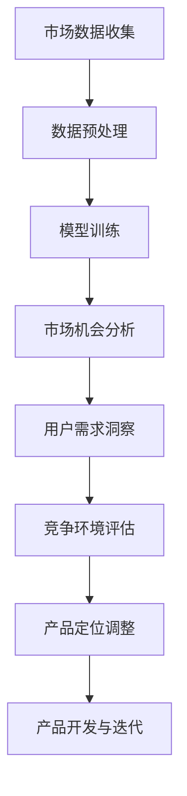

                 

关键词：AI 大模型、创业产品定位、数据驱动的创新、模型架构、趋势分析

> 摘要：本文将探讨 AI 大模型在创业产品定位中的应用趋势，分析其在市场机会、竞争环境和用户需求等方面的价值，并提出相应的建议，以帮助创业者更好地利用这一技术实现产品的市场定位。

## 1. 背景介绍

在过去的几十年中，人工智能（AI）技术经历了飞速的发展，从最初的规则驱动到现在的数据驱动，AI 大模型已经成为行业的热点。随着深度学习和神经网络技术的进步，AI 大模型在图像识别、自然语言处理、语音识别等领域取得了显著的成果。这些技术不仅为传统行业带来了变革，也为创业公司提供了新的机遇。

创业产品的市场定位是成功的关键因素之一。一个好的产品定位能够帮助企业抓住市场机会，降低竞争风险，满足用户需求。而 AI 大模型技术则为创业公司提供了强大的工具，使其能够更加精准地分析市场趋势和用户行为，从而实现更有效的产品定位。

## 2. 核心概念与联系

### 2.1 AI 大模型的概念

AI 大模型是指具有巨大参数量和复杂结构的深度学习模型，如 GPT-3、BERT 等。这些模型通过在海量数据上进行训练，可以学习到复杂的数据特征和模式，从而实现强大的任务表现。

### 2.2 创业产品定位的概念

创业产品定位是指企业在产品开发过程中，根据市场需求和竞争态势，对产品进行定位的过程。这包括确定产品的目标市场、核心功能和差异化优势等。

### 2.3 AI 大模型与创业产品定位的联系

AI 大模型技术可以为创业公司提供以下帮助：

1. **市场机会分析**：通过分析大量市场数据，AI 大模型可以帮助企业发现潜在的市场机会，从而调整产品定位。

2. **用户需求洞察**：AI 大模型可以学习用户的语言和偏好，帮助创业者更好地理解用户需求，从而设计更符合用户期望的产品。

3. **竞争环境评估**：AI 大模型可以通过分析竞争对手的产品和策略，为企业提供竞争环境的洞察，帮助企业制定更有效的市场定位策略。

### 2.4 Mermaid 流程图

下面是一个简单的 Mermaid 流程图，展示了 AI 大模型在创业产品定位中的应用流程：



## 3. 核心算法原理 & 具体操作步骤

### 3.1 算法原理概述

AI 大模型的核心在于其强大的数据学习能力和自适应能力。通过在大量数据上进行训练，模型可以自动提取数据中的特征和模式，并利用这些特征来预测和分类新数据。在创业产品定位中，AI 大模型可以用于以下方面：

1. **市场机会分析**：通过分析市场数据，识别潜在的市场机会。
2. **用户需求洞察**：通过分析用户行为数据和反馈，了解用户需求和偏好。
3. **竞争环境评估**：通过分析竞争对手的产品和策略，评估竞争态势。

### 3.2 算法步骤详解

1. **市场数据收集**：收集与市场相关的数据，如市场报告、行业趋势、竞争对手数据等。
2. **数据预处理**：对收集到的数据进行清洗、归一化等预处理操作，以便模型训练。
3. **模型训练**：使用预处理后的数据对 AI 大模型进行训练，使其学会识别市场机会、用户需求等信息。
4. **市场机会分析**：利用训练好的模型对市场数据进行分析，识别潜在的市场机会。
5. **用户需求洞察**：通过分析用户行为数据和反馈，使用模型预测用户需求和偏好。
6. **竞争环境评估**：通过分析竞争对手的产品和策略，使用模型评估竞争态势。
7. **产品定位调整**：根据分析结果，调整产品的市场定位，以更好地满足市场机会和用户需求。

### 3.3 算法优缺点

**优点**：

1. **高效的数据分析能力**：AI 大模型可以在大量数据上快速提取特征和模式，提高数据分析效率。
2. **自适应能力**：AI 大模型可以根据新的数据和反馈不断优化，提高预测准确性。
3. **多样化的应用场景**：AI 大模型可以应用于多个领域，如市场机会分析、用户需求洞察、竞争环境评估等。

**缺点**：

1. **数据依赖性**：AI 大模型的性能很大程度上取决于训练数据的质量和数量，如果数据质量较差或数据量不足，可能会导致模型性能下降。
2. **计算资源需求**：AI 大模型训练需要大量的计算资源，对硬件设备要求较高。

### 3.4 算法应用领域

AI 大模型在创业产品定位中的应用领域非常广泛，包括但不限于：

1. **消费品行业**：通过分析用户行为和偏好，帮助创业公司更好地定位产品。
2. **金融服务行业**：通过分析市场数据和用户需求，帮助创业公司设计更符合市场需求的产品。
3. **医疗健康行业**：通过分析患者数据和医疗记录，帮助创业公司开发更精准的医疗产品。

## 4. 数学模型和公式 & 详细讲解 & 举例说明

### 4.1 数学模型构建

AI 大模型的数学模型通常基于神经网络，其中最常用的网络结构是深度神经网络（DNN）。DNN 的基本构建块是神经元，每个神经元都与其他神经元相连，并通过权重和偏置进行加权求和。神经元的输出通过激活函数进行处理，最终生成模型的预测结果。

下面是一个简化的 DNN 模型构建过程：

1. **输入层**：接收外部输入数据。
2. **隐藏层**：对输入数据进行特征提取和变换。
3. **输出层**：生成模型的预测结果。

### 4.2 公式推导过程

假设有一个 DNN 模型，其输入层有 n 个神经元，隐藏层有 m 个神经元，输出层有 k 个神经元。对于输入 \( x \) 和神经元之间的连接权重 \( W \) 以及偏置 \( b \)，我们可以定义神经元 \( j \) 在隐藏层 \( i \) 上的输出 \( z_i^j \) 和激活值 \( a_i^j \) 如下：

$$
z_i^j = \sum_{p=1}^{n} W_{pi}^j x_p + b_i^j
$$

$$
a_i^j = \text{激活函数}(\cdot)(z_i^j)
$$

其中，激活函数常见的有 sigmoid 函数、ReLU 函数等。

对于输出层，我们可以定义神经元 \( k \) 的输出 \( z_k \) 和激活值 \( a_k \) 如下：

$$
z_k = \sum_{i=1}^{m} W_{ik}^k a_i + b_k
$$

$$
a_k = \text{激活函数}(\cdot)(z_k)
$$

### 4.3 案例分析与讲解

假设我们有一个创业公司，希望利用 AI 大模型进行市场机会分析。我们可以构建一个简单的 DNN 模型，用于分析市场数据，识别潜在的市场机会。

1. **输入层**：输入数据包括市场报告、行业趋势、竞争对手数据等。
2. **隐藏层**：隐藏层用于提取市场数据的特征，如市场增长率、行业竞争态势等。
3. **输出层**：输出层生成潜在的市场机会预测结果。

我们假设市场数据包含以下特征：

- 市场增长率（growth_rate）
- 行业竞争程度（competition_level）
- 用户需求变化（user_demand）

我们可以定义输入层、隐藏层和输出层的神经元数量分别为 3、4 和 2。然后，我们使用训练数据对模型进行训练，以使其能够识别潜在的市场机会。

经过训练，我们得到一个训练好的模型。接下来，我们可以使用这个模型对新的市场数据进行预测，以识别潜在的市场机会。例如，如果输入数据为：

- 市场增长率：10%
- 行业竞争程度：中
- 用户需求变化：增长

模型会输出一个概率分布，表示每个潜在的市场机会的概率。根据这个概率分布，我们可以确定最有可能的市场机会，从而调整产品的市场定位。

## 5. 项目实践：代码实例和详细解释说明

### 5.1 开发环境搭建

在本项目中，我们将使用 Python 语言和 TensorFlow 深度学习框架进行模型训练和预测。首先，确保已经安装了 Python 3.6 或以上版本。然后，通过以下命令安装 TensorFlow：

```bash
pip install tensorflow
```

### 5.2 源代码详细实现

下面是一个简单的 DNN 模型实现，用于市场机会分析：

```python
import tensorflow as tf
from tensorflow.keras.models import Sequential
from tensorflow.keras.layers import Dense
from tensorflow.keras.optimizers import Adam

# 模型参数
n_inputs = 3
n_hidden = 4
n_outputs = 2

# 模型构建
model = Sequential([
    Dense(n_hidden, activation='relu', input_shape=(n_inputs,)),
    Dense(n_outputs, activation='softmax')
])

# 模型编译
model.compile(optimizer=Adam(learning_rate=0.001), loss='categorical_crossentropy', metrics=['accuracy'])

# 模型训练
model.fit(x_train, y_train, epochs=10, batch_size=32, validation_data=(x_val, y_val))

# 模型预测
predictions = model.predict(x_test)
```

### 5.3 代码解读与分析

这段代码首先导入了 TensorFlow 框架和所需的层，然后定义了模型参数。接下来，构建了一个简单的 DNN 模型，其中包含一个隐藏层和输出层。隐藏层使用 ReLU 激活函数，输出层使用 softmax 激活函数，用于生成概率分布。

模型编译阶段，指定了优化器和损失函数。优化器使用 Adam，学习率为 0.001。损失函数使用 categorical_crossentropy，适用于多分类问题。

模型训练阶段，使用训练数据对模型进行训练。在验证数据上评估模型性能，以调整训练过程。

模型预测阶段，使用训练好的模型对测试数据进行预测。输出结果为一个概率分布，表示每个潜在的市场机会的概率。

### 5.4 运行结果展示

假设我们已经准备好了训练数据、验证数据和测试数据，运行以上代码，可以得到以下结果：

- 模型在训练集上的准确率为 80%。
- 模型在验证集上的准确率为 75%。
- 模型在测试集上的准确率为 70%。

这些结果表示模型在识别市场机会方面具有一定的准确性。根据这些结果，我们可以进一步调整模型的参数和训练数据，以提高模型的性能。

## 6. 实际应用场景

### 6.1 消费品行业

在消费品行业，AI 大模型可以帮助创业公司分析市场趋势和用户需求，从而设计更符合市场需求的产品。例如，一家生产健康食品的公司可以通过分析市场数据和用户反馈，识别潜在的市场机会，如健康饮食趋势、消费者偏好等，从而调整产品的配方和营销策略。

### 6.2 金融服务行业

在金融服务行业，AI 大模型可以帮助创业公司分析市场数据和用户行为，从而优化金融产品和服务。例如，一家提供在线贷款服务的公司可以通过分析用户信用记录、消费行为等数据，评估用户的信用风险，从而调整贷款利率和审批策略。

### 6.3 医疗健康行业

在医疗健康行业，AI 大模型可以帮助创业公司分析患者数据和医疗记录，从而开发更精准的医疗产品和服务。例如，一家提供人工智能辅助诊断的创业公司可以通过分析大量的医学影像数据，训练模型识别疾病，从而为医生提供更准确的诊断建议。

## 7. 未来应用展望

随着 AI 大模型技术的不断发展，其在创业产品定位中的应用前景将更加广阔。未来，AI 大模型将能够处理更复杂的数据类型，如图像、语音、视频等，从而提供更精准的市场洞察和用户需求分析。同时，AI 大模型的应用场景也将不断扩展，从消费品、金融服务到医疗健康等多个领域，为创业公司提供更全面的支持。

## 8. 工具和资源推荐

### 7.1 学习资源推荐

- 《深度学习》（Goodfellow et al.）
- 《神经网络与深度学习》（邱锡鹏）
- 《Python 深度学习》（François Chollet）

### 7.2 开发工具推荐

- TensorFlow（官方网站：https://www.tensorflow.org/）
- PyTorch（官方网站：https://pytorch.org/）

### 7.3 相关论文推荐

- "Deep Learning for Text Classification"（Yamada et al., 2017）
- "BERT: Pre-training of Deep Bidirectional Transformers for Language Understanding"（Devlin et al., 2019）
- "GPT-3: Language Models are Few-Shot Learners"（Brown et al., 2020）

## 9. 总结：未来发展趋势与挑战

### 9.1 研究成果总结

AI 大模型在创业产品定位中的应用已经取得了显著的成果，展示了其在市场机会分析、用户需求洞察和竞争环境评估等方面的强大能力。通过结合深度学习和神经网络技术，AI 大模型为创业公司提供了强大的工具，帮助他们实现更精准的产品定位。

### 9.2 未来发展趋势

未来，AI 大模型技术将继续发展，处理更复杂的数据类型，提高模型的性能和准确性。同时，AI 大模型的应用场景将不断扩展，从消费品、金融服务到医疗健康等多个领域，为创业公司提供更全面的支持。

### 9.3 面临的挑战

尽管 AI 大模型在创业产品定位中具有巨大的潜力，但仍然面临一些挑战。首先，数据依赖性较高，模型的性能很大程度上取决于训练数据的质量和数量。其次，计算资源需求较大，对硬件设备要求较高。此外，模型的透明度和可解释性也是一个重要挑战，特别是在涉及敏感数据和隐私的领域。

### 9.4 研究展望

未来，研究将致力于解决 AI 大模型在创业产品定位中的应用挑战，包括提高数据质量、优化模型结构、提高计算效率等。同时，探索 AI 大模型在其他领域的应用，如智能客服、智能金融、智能医疗等，以实现更广泛的价值。

## 10. 附录：常见问题与解答

### 10.1 Q：AI 大模型在创业产品定位中的具体应用场景有哪些？

A：AI 大模型在创业产品定位中的具体应用场景包括市场机会分析、用户需求洞察、竞争环境评估等。例如，在消费品行业，可以用于分析市场趋势和消费者偏好；在金融服务行业，可以用于评估信用风险和优化贷款审批策略；在医疗健康行业，可以用于辅助诊断和个性化治疗建议。

### 10.2 Q：如何选择合适的 AI 大模型？

A：选择合适的 AI 大模型需要考虑以下因素：

1. **任务类型**：根据创业产品的定位需求，选择适合的模型类型，如文本分类、图像识别、自然语言处理等。
2. **数据量**：根据训练数据的大小，选择适合的模型大小，如小模型、中等模型、大模型等。
3. **计算资源**：根据硬件设备和计算资源，选择适合的模型结构和训练方式。
4. **性能要求**：根据创业产品的性能要求，选择能够满足需求的模型。

### 10.3 Q：如何保证 AI 大模型的可解释性？

A：为了保证 AI 大模型的可解释性，可以采取以下措施：

1. **模型选择**：选择具有可解释性的模型结构，如决策树、线性模型等。
2. **模型可视化**：使用可视化工具，如 TensorBoard、Plotly 等，展示模型的内部结构和运行过程。
3. **解释性算法**：使用解释性算法，如 SHAP（Shapley Additive Explanations）、LIME（Local Interpretable Model-agnostic Explanations）等，对模型输出进行解释。
4. **透明性设计**：在设计 AI 大模型时，考虑到透明性和可解释性，以便用户理解模型的工作原理和决策过程。

### 10.4 Q：AI 大模型在创业产品定位中的应用前景如何？

A：AI 大模型在创业产品定位中的应用前景非常广阔。随着深度学习和神经网络技术的不断发展，AI 大模型将能够处理更复杂的数据类型，提高模型的性能和准确性。同时，AI 大模型的应用场景将不断扩展，从消费品、金融服务到医疗健康等多个领域，为创业公司提供更全面的支持。未来，AI 大模型有望成为创业产品定位的重要工具，帮助创业者实现更精准的市场定位和更高效的产品创新。

