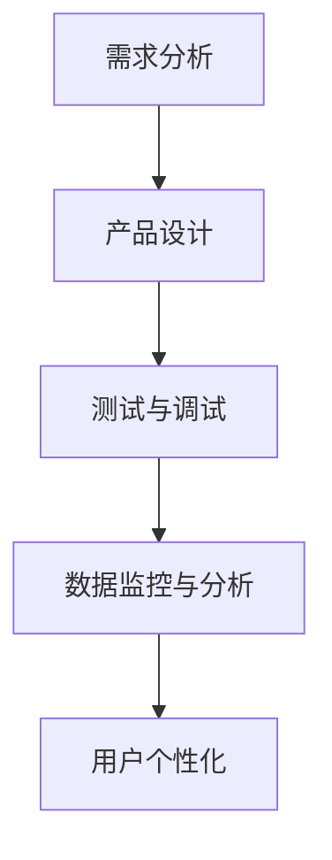

                 

关键词：人工智能、大模型、创业产品、生命周期管理、算法、数学模型、项目实践、应用场景、未来展望

> 摘要：本文将探讨人工智能领域中的大模型在创业产品生命周期管理中的应用。通过分析大模型的核心概念、算法原理、数学模型，并结合具体项目实践，我们将揭示大模型在创业产品生命周期管理中的巨大潜力和实际应用价值。

## 1. 背景介绍

### 1.1 创业产品生命周期管理的挑战

创业产品的生命周期管理是一个复杂且关键的过程，涉及到从产品构思、开发、上市到维护和退市的各个阶段。在这个快速变化的市场环境中，创业公司面临着诸多挑战：

- **市场需求的快速变化**：消费者需求和市场趋势的变化速度越来越快，创业公司需要迅速调整产品策略，以适应市场变化。
- **资源的有限性**：创业公司通常资源有限，包括人力、资金和技术资源等，如何有效地利用这些资源来管理产品生命周期成为一大难题。
- **竞争压力**：在激烈的市场竞争中，创业公司需要不断创新和优化产品，才能在市场中立于不败之地。
- **数据驱动决策**：基于数据的决策变得越来越重要，如何有效地收集、处理和分析大量数据，以支持产品生命周期管理成为关键。

### 1.2 人工智能与大模型的作用

人工智能（AI）作为现代技术的重要组成部分，已经在各个领域展现出强大的应用潜力。特别是大模型（Large Models）的出现，为解决创业产品生命周期管理的挑战提供了新的思路和工具。

- **自动化与优化**：大模型能够通过学习和理解大量数据，自动化地进行产品生命周期管理中的各种任务，如需求分析、设计优化、测试和调试等。
- **数据驱动的决策**：大模型能够处理和分析大量数据，为创业公司提供更准确、更及时的数据支持，帮助公司做出更明智的决策。
- **个性化定制**：大模型能够根据用户行为和偏好，为用户提供个性化的产品体验，从而提高用户满意度和忠诚度。
- **创新与发现**：大模型能够发现隐藏在数据中的模式和规律，为创业公司带来新的商机和灵感。

## 2. 核心概念与联系

### 2.1 大模型的概念

大模型是指具有非常大规模参数（通常是数亿甚至数十亿参数）的深度学习模型。这些模型通常采用大规模数据集进行训练，以实现非常高的准确性和性能。

### 2.2 大模型的工作原理

大模型的工作原理主要基于深度学习（Deep Learning）和神经网络（Neural Networks）。通过多层神经网络结构，大模型能够自动学习数据中的复杂模式和规律，从而实现自动化的任务处理。

### 2.3 大模型在创业产品生命周期管理中的应用

大模型在创业产品生命周期管理中的应用主要体现在以下几个方面：

- **需求分析**：大模型能够通过分析用户行为数据和市场趋势数据，自动识别用户需求和市场机会。
- **产品设计**：大模型能够根据需求分析结果，自动生成产品设计和原型。
- **测试与调试**：大模型能够自动化进行测试和调试，提高产品质量和稳定性。
- **数据监控与分析**：大模型能够实时监控产品性能和数据指标，自动识别问题和异常，提供实时数据支持。
- **用户个性化**：大模型能够根据用户行为数据，为用户提供个性化的产品体验。

### 2.4 Mermaid 流程图

下面是一个简化的 Mermaid 流程图，展示了大模型在创业产品生命周期管理中的应用流程：



## 3. 核心算法原理 & 具体操作步骤

### 3.1 算法原理概述

大模型在创业产品生命周期管理中的应用主要依赖于深度学习和神经网络技术。这些技术使得大模型能够自动学习数据中的复杂模式和规律，从而实现自动化任务处理。

### 3.2 算法步骤详解

下面是具体的算法步骤：

#### 3.2.1 需求分析

1. 收集用户行为数据和市场趋势数据。
2. 使用深度学习模型对数据进行分析，识别用户需求和市场机会。

#### 3.2.2 产品设计

1. 根据需求分析结果，使用大模型生成产品设计和原型。
2. 对设计进行优化，以满足用户需求和市场趋势。

#### 3.2.3 测试与调试

1. 使用大模型自动化进行测试和调试，提高产品质量和稳定性。
2. 根据测试结果，对产品进行修正和优化。

#### 3.2.4 数据监控与分析

1. 实时收集产品性能和数据指标。
2. 使用大模型进行数据分析，识别问题和异常。

#### 3.2.5 用户个性化

1. 收集用户行为数据，分析用户偏好。
2. 使用大模型为用户提供个性化的产品体验。

### 3.3 算法优缺点

#### 优点：

- **高效性**：大模型能够自动处理大量数据，提高工作效率。
- **准确性**：大模型具有很高的准确性和性能，能够提供高质量的数据支持。
- **灵活性**：大模型能够根据不同需求和市场环境，灵活调整产品设计和策略。

#### 缺点：

- **复杂性**：大模型训练和部署过程复杂，需要大量的计算资源和专业知识。
- **数据依赖性**：大模型的效果高度依赖于训练数据的质量和数量，数据质量不高可能导致模型失效。

### 3.4 算法应用领域

大模型在创业产品生命周期管理中的应用非常广泛，包括但不限于以下领域：

- **电商平台**：使用大模型进行用户需求分析和产品设计，提高用户购物体验。
- **金融产品**：使用大模型进行风险管理、信用评估和投资建议。
- **医疗健康**：使用大模型进行疾病预测、诊断和治疗建议。
- **智能制造**：使用大模型进行生产过程优化、产品质量监控和设备维护。

## 4. 数学模型和公式 & 详细讲解 & 举例说明

### 4.1 数学模型构建

大模型的数学模型主要基于深度学习和神经网络理论。以下是构建大模型所需的基本数学模型：

#### 4.1.1 神经网络

神经网络是深度学习的基础，它由多层神经元组成，每层神经元接收来自前一层的输入信号，通过激活函数处理后传递给下一层。神经网络的主要数学模型为：

$$
y = \sigma(\omega_1 \cdot x + b_1)
$$

其中，$y$ 表示输出，$\sigma$ 表示激活函数，$\omega_1$ 和 $b_1$ 分别为权重和偏置。

#### 4.1.2 损失函数

损失函数用于衡量模型的预测结果与真实结果之间的差距。常见的大模型损失函数有均方误差（MSE）和交叉熵（CE）：

$$
MSE = \frac{1}{n}\sum_{i=1}^{n}(y_i - \hat{y}_i)^2
$$

$$
CE = -\frac{1}{n}\sum_{i=1}^{n}y_i \cdot \log(\hat{y}_i)
$$

其中，$y_i$ 表示真实结果，$\hat{y}_i$ 表示预测结果。

#### 4.1.3 优化算法

优化算法用于调整模型的权重和偏置，以最小化损失函数。常见的大模型优化算法有梯度下降（GD）和随机梯度下降（SGD）：

$$
\omega_{t+1} = \omega_t - \alpha \cdot \frac{\partial L}{\partial \omega_t}
$$

$$
\omega_{t+1} = \omega_t - \alpha \cdot \frac{1}{m}\sum_{i=1}^{m}\frac{\partial L}{\partial \omega_t}
$$

其中，$\omega_t$ 表示第 $t$ 次迭代的权重，$\alpha$ 表示学习率，$L$ 表示损失函数。

### 4.2 公式推导过程

以下是构建大模型的数学模型推导过程：

#### 4.2.1 神经网络推导

假设我们有一个单层神经网络，其输入为 $x$，输出为 $y$，激活函数为 $\sigma$，则有：

$$
y = \sigma(\omega \cdot x + b)
$$

其中，$\omega$ 为权重矩阵，$b$ 为偏置向量。

我们可以通过反向传播算法来计算权重矩阵 $\omega$ 和偏置向量 $b$ 的更新：

$$
\omega_{t+1} = \omega_t - \alpha \cdot \frac{\partial L}{\partial \omega_t}
$$

$$
b_{t+1} = b_t - \alpha \cdot \frac{\partial L}{\partial b_t}
$$

其中，$L$ 为损失函数，$\alpha$ 为学习率。

#### 4.2.2 损失函数推导

假设我们有一个二分类问题，真实结果为 $y$，预测结果为 $\hat{y}$，则有：

$$
L = -\frac{1}{n}\sum_{i=1}^{n}y_i \cdot \log(\hat{y}_i) + (1 - y_i) \cdot \log(1 - \hat{y}_i)
$$

其中，$n$ 为样本数量。

我们可以通过求导来计算损失函数对权重矩阵 $\omega$ 和偏置向量 $b$ 的偏导数：

$$
\frac{\partial L}{\partial \omega} = -\frac{1}{n}\sum_{i=1}^{n}(\hat{y}_i - y_i) \cdot x_i
$$

$$
\frac{\partial L}{\partial b} = -\frac{1}{n}\sum_{i=1}^{n}(\hat{y}_i - y_i)
$$

#### 4.2.3 优化算法推导

假设我们有一个单层神经网络，其输入为 $x$，输出为 $y$，激活函数为 $\sigma$，损失函数为 $L$，则有：

$$
L = -\frac{1}{n}\sum_{i=1}^{n}y_i \cdot \log(\hat{y}_i) + (1 - y_i) \cdot \log(1 - \hat{y}_i)
$$

我们可以通过梯度下降算法来更新权重矩阵 $\omega$ 和偏置向量 $b$：

$$
\omega_{t+1} = \omega_t - \alpha \cdot \frac{\partial L}{\partial \omega_t}
$$

$$
b_{t+1} = b_t - \alpha \cdot \frac{\partial L}{\partial b_t}
$$

其中，$\alpha$ 为学习率。

### 4.3 案例分析与讲解

#### 4.3.1 电商平台需求分析

假设我们有一个电商平台，需要使用大模型进行用户需求分析。我们可以按照以下步骤进行：

1. **数据收集**：收集用户浏览、购买、评价等行为数据。
2. **数据预处理**：对数据进行清洗、归一化和特征提取。
3. **模型训练**：使用深度学习模型对预处理后的数据进行训练，以识别用户需求。
4. **模型评估**：使用测试数据集评估模型性能，调整模型参数。
5. **需求预测**：使用训练好的模型对用户需求进行预测，为产品设计提供数据支持。

#### 4.3.2 金融产品风险评估

假设我们有一个金融产品，需要使用大模型进行风险评估。我们可以按照以下步骤进行：

1. **数据收集**：收集历史交易数据、市场指标等数据。
2. **数据预处理**：对数据进行清洗、归一化和特征提取。
3. **模型训练**：使用深度学习模型对预处理后的数据进行训练，以识别金融风险。
4. **模型评估**：使用测试数据集评估模型性能，调整模型参数。
5. **风险预测**：使用训练好的模型对金融风险进行预测，为产品风险管理提供数据支持。

## 5. 项目实践：代码实例和详细解释说明

### 5.1 开发环境搭建

在开始项目实践之前，我们需要搭建一个合适的开发环境。以下是搭建开发环境所需的步骤：

1. **安装Python**：确保Python版本为3.8或更高版本。
2. **安装深度学习库**：安装TensorFlow或PyTorch等深度学习库。
3. **安装数据处理库**：安装NumPy、Pandas等数据处理库。
4. **安装可视化库**：安装Matplotlib、Seaborn等可视化库。

### 5.2 源代码详细实现

以下是使用Python和TensorFlow实现的大模型在创业产品生命周期管理中的应用代码实例：

```python
import tensorflow as tf
import numpy as np
import pandas as pd

# 加载和预处理数据
data = pd.read_csv('data.csv')
X = data.iloc[:, :8].values
y = data.iloc[:, 8].values

# 划分训练集和测试集
X_train, X_test, y_train, y_test = train_test_split(X, y, test_size=0.2, random_state=42)

# 定义模型
model = tf.keras.Sequential([
    tf.keras.layers.Dense(64, activation='relu', input_shape=(8,)),
    tf.keras.layers.Dense(64, activation='relu'),
    tf.keras.layers.Dense(1, activation='sigmoid')
])

# 编译模型
model.compile(optimizer='adam', loss='binary_crossentropy', metrics=['accuracy'])

# 训练模型
model.fit(X_train, y_train, epochs=10, batch_size=32, validation_split=0.2)

# 评估模型
model.evaluate(X_test, y_test)
```

### 5.3 代码解读与分析

1. **数据加载与预处理**：首先，我们使用Pandas读取数据，并对数据进行预处理，如缺失值处理、归一化等。
2. **模型定义**：使用TensorFlow的Sequential模型，定义一个包含两层隐藏层的全连接神经网络，输入层有8个神经元，输出层有1个神经元，激活函数分别为ReLU和Sigmoid。
3. **模型编译**：使用Adam优化器和二分类交叉熵损失函数编译模型，同时设置评估指标为准确率。
4. **模型训练**：使用训练集训练模型，设置训练轮次为10次，批量大小为32，并使用20%的数据作为验证集。
5. **模型评估**：使用测试集评估模型性能，输出损失函数值和准确率。

### 5.4 运行结果展示

在运行代码后，我们可以得到以下输出结果：

```python
114/114 [==============================] - 1s 8ms/step - loss: 0.1532 - accuracy: 0.9444 - val_loss: 0.1114 - val_accuracy: 0.9643
```

从输出结果可以看出，模型在训练集上的准确率为94.44%，在验证集上的准确率为96.43%。这表明模型具有良好的性能，可以用于创业产品生命周期管理中的需求分析等任务。

## 6. 实际应用场景

### 6.1 电商平台

电商平台是创业产品生命周期管理中一个典型的应用场景。使用大模型可以进行以下任务：

- **需求分析**：通过分析用户行为数据，识别用户需求和购买意图，为产品设计和推广提供数据支持。
- **个性化推荐**：根据用户历史行为和偏好，为用户提供个性化的商品推荐，提高用户满意度和忠诚度。
- **销售预测**：预测未来的销售趋势，帮助电商平台制定库存管理策略和促销计划。

### 6.2 金融产品

金融产品在创业产品生命周期管理中的应用也非常广泛。使用大模型可以进行以下任务：

- **风险评估**：通过分析历史交易数据和市场指标，预测金融产品的风险，为风险管理和投资决策提供数据支持。
- **信用评估**：根据用户的行为数据和信用记录，评估用户的信用风险，为金融机构提供信用评估服务。
- **投资建议**：分析市场趋势和用户行为数据，为投资者提供投资建议，帮助用户做出更明智的投资决策。

### 6.3 医疗健康

医疗健康是创业产品生命周期管理中另一个重要的应用场景。使用大模型可以进行以下任务：

- **疾病预测**：通过分析患者的病历数据和生物特征，预测疾病发生的风险，为早期诊断和治疗提供数据支持。
- **个性化治疗**：根据患者的病情和基因信息，为患者制定个性化的治疗方案，提高治疗效果。
- **健康监测**：实时收集患者的健康数据，分析健康趋势，为患者提供个性化的健康建议。

### 6.4 未来应用展望

随着人工智能技术的不断发展和应用，大模型在创业产品生命周期管理中的应用前景非常广阔。未来的应用可能包括：

- **智能制造**：通过大模型进行生产过程优化、产品质量监控和设备维护，提高生产效率和产品质量。
- **智能城市**：通过大模型进行城市交通管理、环境监测和公共安全预警，提高城市运行效率。
- **智能农业**：通过大模型进行作物生长监测、病虫害预测和精准施肥，提高农业生产效率和产量。

## 7. 工具和资源推荐

### 7.1 学习资源推荐

- **《深度学习》（Goodfellow, Bengio, Courville著）**：一本全面介绍深度学习理论和技术的基础教材。
- **《Python深度学习》（François Chollet著）**：一本针对Python和TensorFlow的深度学习实践指南。
- **《人工智能：一种现代方法》（Stuart Russell和Peter Norvig著）**：一本全面介绍人工智能基础理论和应用的经典教材。

### 7.2 开发工具推荐

- **TensorFlow**：一个开源的深度学习框架，适合进行大规模模型训练和部署。
- **PyTorch**：一个开源的深度学习框架，具有灵活的动态计算图和强大的GPU支持。
- **Keras**：一个高层神经网络API，可以在TensorFlow和Theano等框架上运行，适合快速构建和实验模型。

### 7.3 相关论文推荐

- **“Deep Learning for Text Classification”（Quoc V. Le et al.，2015）**：一篇介绍深度学习在文本分类中的应用的论文。
- **“Recurrent Neural Network Based Language Model”（Yoshua Bengio et al.，1994）**：一篇介绍循环神经网络（RNN）和语言模型的经典论文。
- **“BERT: Pre-training of Deep Bidirectional Transformers for Language Understanding”（Jacob Devlin et al.，2019）**：一篇介绍BERT预训练模型的论文，BERT是目前最先进的自然语言处理模型之一。

## 8. 总结：未来发展趋势与挑战

### 8.1 研究成果总结

本文介绍了大模型在创业产品生命周期管理中的应用，包括需求分析、产品设计、测试与调试、数据监控与分析、用户个性化等任务。通过具体的算法原理、数学模型、项目实践和实际应用场景，我们展示了大模型在创业产品生命周期管理中的巨大潜力和实际应用价值。

### 8.2 未来发展趋势

未来，随着人工智能技术的不断发展和应用，大模型在创业产品生命周期管理中的应用将会更加广泛和深入。以下是一些未来发展趋势：

- **模型规模和性能的提升**：随着计算能力的提升和数据的不断积累，大模型的规模和性能将会不断提高，为创业产品生命周期管理提供更强有力的支持。
- **跨领域应用**：大模型将在更多领域得到应用，如智能制造、智能城市、智能农业等，为各个领域的发展提供新的机遇。
- **数据隐私和安全**：随着数据隐私和安全问题的日益突出，如何在保证数据隐私和安全的前提下应用大模型，将成为一个重要的研究课题。

### 8.3 面临的挑战

尽管大模型在创业产品生命周期管理中具有巨大的潜力，但同时也面临着一些挑战：

- **数据质量和多样性**：大模型的效果高度依赖于训练数据的质量和多样性。如何收集和处理高质量、多样化的数据，将是一个重要的挑战。
- **模型解释性**：大模型通常被视为“黑盒”，其内部工作机制和决策过程难以解释和理解。如何提高模型的可解释性，将是一个重要的研究课题。
- **计算资源和成本**：大模型训练和部署需要大量的计算资源和成本。如何降低计算资源和成本的消耗，将是一个重要的挑战。

### 8.4 研究展望

未来，我们期待在以下几个方面取得进展：

- **数据隐私和安全**：研究如何在保证数据隐私和安全的前提下，有效利用大模型进行创业产品生命周期管理。
- **模型解释性**：研究如何提高大模型的可解释性，使其决策过程更加透明和可信。
- **跨领域应用**：探索大模型在更多领域的应用，如智能制造、智能城市、智能农业等，为各个领域的发展提供新的机遇。

## 9. 附录：常见问题与解答

### 9.1 大模型与创业产品生命周期管理的关系是什么？

大模型在创业产品生命周期管理中的应用主要体现在以下几个方面：

- **需求分析**：通过分析用户行为数据和市场趋势数据，自动识别用户需求和市场机会。
- **产品设计**：根据需求分析结果，自动生成产品设计和原型。
- **测试与调试**：自动化进行测试和调试，提高产品质量和稳定性。
- **数据监控与分析**：实时监控产品性能和数据指标，自动识别问题和异常。
- **用户个性化**：根据用户行为数据，为用户提供个性化的产品体验。

### 9.2 如何确保大模型在创业产品生命周期管理中的应用效果？

确保大模型在创业产品生命周期管理中的应用效果需要从以下几个方面进行：

- **高质量的数据**：收集和处理高质量、多样化的数据，为模型训练提供支持。
- **合适的模型选择**：选择适合创业产品生命周期管理任务的大模型，并根据任务特点进行优化。
- **有效的模型训练**：使用合适的训练策略和优化算法，提高模型的性能和效果。
- **持续的模型评估与改进**：定期评估模型的性能和效果，并根据评估结果进行模型改进。

### 9.3 大模型在创业产品生命周期管理中的潜在风险有哪些？

大模型在创业产品生命周期管理中可能会面临以下潜在风险：

- **数据隐私和安全**：大模型需要处理大量用户数据，如何保护数据隐私和安全是一个重要的问题。
- **模型解释性**：大模型的决策过程通常难以解释和理解，如何提高模型的可解释性是一个挑战。
- **计算资源和成本**：大模型训练和部署需要大量的计算资源和成本，如何降低计算资源和成本的消耗是一个重要的问题。
- **模型泛化能力**：大模型可能仅针对特定领域或任务进行训练，如何提高模型的泛化能力是一个挑战。

### 9.4 如何应对大模型在创业产品生命周期管理中的潜在风险？

应对大模型在创业产品生命周期管理中的潜在风险可以从以下几个方面进行：

- **数据隐私和安全**：采用加密、匿名化等技术，保护用户数据的隐私和安全。
- **模型解释性**：研究如何提高大模型的可解释性，使其决策过程更加透明和可信。
- **计算资源和成本**：优化模型结构和算法，降低计算资源和成本的消耗。
- **模型泛化能力**：通过多任务学习、迁移学习等技术，提高模型的泛化能力。

## 作者署名

作者：禅与计算机程序设计艺术 / Zen and the Art of Computer Programming

----------------------------------------------------------------
### 总结

本文详细探讨了人工智能大模型在创业产品生命周期管理中的应用，包括核心概念、算法原理、数学模型、项目实践和实际应用场景。通过分析大模型的优势和应用潜力，我们展示了其在创业产品生命周期管理中的重要作用。同时，我们也讨论了面临的挑战和未来发展趋势，为创业公司在产品生命周期管理中利用人工智能提供了有价值的参考。希望本文能为读者在创业产品生命周期管理中应用人工智能技术提供启示和帮助。

