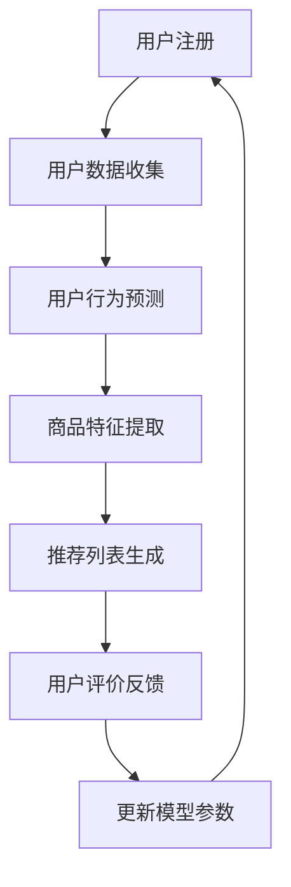

                 

关键词：AI 大模型、电商搜索推荐、冷启动用户、策略、新用户挑战

摘要：本文深入探讨了 AI 大模型在电商搜索推荐中的冷启动用户策略，分析了新用户挑战及其解决方案。文章从背景介绍、核心概念与联系、核心算法原理、数学模型和公式、项目实践、实际应用场景以及未来展望等方面进行了详细阐述，为电商领域提供了有价值的参考。

## 1. 背景介绍

随着互联网的迅猛发展，电商行业已经成为全球经济的重要组成部分。电商平台的蓬勃发展带动了搜索推荐系统的广泛应用，用户通过关键词或行为数据获取个性化推荐，从而提高购物体验。然而，在推荐系统的新用户冷启动问题方面，一直是一个困扰行业发展的难题。

新用户冷启动指的是用户在刚加入电商平台时，系统无法基于用户历史行为和偏好为其提供有效推荐的情况。这个问题主要体现在两个方面：一是用户数据稀疏，缺乏有效的行为数据来构建推荐模型；二是用户画像模糊，难以准确捕捉用户的兴趣和需求。

传统推荐系统如基于内容的推荐（Content-Based Filtering）和协同过滤（Collaborative Filtering）方法，在处理新用户冷启动问题时表现较差。基于内容的推荐依赖于用户的历史偏好，但新用户缺乏足够的数据支持；协同过滤则依赖于用户间的相似度计算，而新用户缺乏足够的行为数据，导致相似度计算结果不准确。

为了解决新用户冷启动问题，近年来，越来越多的研究开始关注 AI 大模型在推荐系统中的应用。大模型（如深度学习模型）通过自主学习用户行为数据，可以更好地理解和预测用户的兴趣和需求。本文将探讨 AI 大模型在电商搜索推荐中的冷启动用户策略，为新用户提供有效的推荐。

## 2. 核心概念与联系

在深入探讨 AI 大模型在电商搜索推荐中的应用之前，我们需要了解几个核心概念及其相互联系。

### 2.1 电商搜索推荐系统

电商搜索推荐系统是指利用用户行为数据、商品信息和其他相关数据，通过算法模型为用户推荐与其兴趣和需求相关的商品。推荐系统的主要目标是通过提高用户满意度和转化率，从而提升电商平台的核心竞争力。

### 2.2  AI 大模型

AI 大模型是指具有大规模参数和高计算能力的人工智能模型，如深度神经网络、Transformer 等模型。这些模型通过大量数据训练，可以自动学习数据中的特征和模式，从而实现复杂的任务，如图像识别、自然语言处理等。

### 2.3 冷启动用户

冷启动用户是指刚加入电商平台的新用户，缺乏足够的历史行为数据，导致推荐系统难以为其提供有效的个性化推荐。

### 2.4 交互式推荐

交互式推荐是指通过与用户的互动，逐步积累用户数据，从而提高推荐系统对新用户的推荐效果。交互式推荐包括主动交互（如引导用户填写兴趣问卷、邀请用户评价商品等）和被动交互（如记录用户的浏览、购买等行为数据）。

### 2.5 大模型在推荐系统中的应用

大模型在推荐系统中的应用主要体现在以下几个方面：

- **用户行为预测**：通过学习用户的历史行为数据，预测用户的兴趣和需求。
- **商品特征提取**：通过学习商品属性和用户行为数据，提取商品的关键特征，用于推荐算法。
- **交互式推荐**：通过与用户的交互，逐步积累用户数据，提高推荐系统对新用户的推荐效果。
- **多模态融合**：将文本、图像、音频等多模态数据融合到推荐系统中，提高推荐效果。

### 2.6 Mermaid 流程图

以下是 AI 大模型在电商搜索推荐中的应用流程图：



在这个流程图中，用户注册后，系统开始收集用户数据，包括用户行为数据、商品数据等。然后，通过大模型进行用户行为预测和商品特征提取，生成推荐列表。用户对推荐结果进行评价反馈，系统根据反馈更新模型参数，进一步优化推荐效果。

## 3. 核心算法原理 & 具体操作步骤

### 3.1  算法原理概述

AI 大模型在电商搜索推荐中的应用主要基于深度学习和自然语言处理等核心技术。下面将介绍大模型在推荐系统中的核心算法原理和具体操作步骤。

### 3.2  算法步骤详解

#### 3.2.1 用户行为预测

用户行为预测是指通过学习用户的历史行为数据，预测用户的兴趣和需求。具体步骤如下：

1. 数据预处理：将用户行为数据（如浏览记录、购买记录等）进行清洗、去噪和格式化，将其转化为可用于训练的数据集。
2. 特征工程：提取用户行为数据中的关键特征，如用户ID、商品ID、时间戳、行为类型等。
3. 模型训练：使用深度学习模型（如 Transformer、BERT 等）对用户行为数据集进行训练，学习用户行为模式。
4. 预测生成：将新用户的行为数据输入到训练好的模型中，预测其兴趣和需求。

#### 3.2.2 商品特征提取

商品特征提取是指通过学习商品属性和用户行为数据，提取商品的关键特征，用于推荐算法。具体步骤如下：

1. 数据预处理：将商品属性数据（如商品标题、描述、类别、价格等）和用户行为数据进行清洗、去噪和格式化，将其转化为可用于训练的数据集。
2. 特征工程：提取商品属性和用户行为数据中的关键特征，如商品ID、用户ID、行为类型、时间戳等。
3. 模型训练：使用深度学习模型（如 Transformer、BERT 等）对商品特征数据集进行训练，学习商品特征与用户行为之间的关系。
4. 预测生成：将新商品的数据输入到训练好的模型中，预测其与用户兴趣的匹配度。

#### 3.2.3 推荐列表生成

推荐列表生成是指根据用户行为预测和商品特征提取的结果，为用户生成个性化的推荐列表。具体步骤如下：

1. 预测融合：将用户行为预测和商品特征提取的结果进行融合，得到每个商品与用户兴趣的匹配度。
2. 排序：根据匹配度对推荐列表进行排序，将匹配度最高的商品排在推荐列表的前面。
3. 输出：将排序后的推荐列表输出给用户。

#### 3.2.4 用户评价反馈

用户评价反馈是指通过用户对推荐结果的评价，不断优化推荐系统的效果。具体步骤如下：

1. 收集评价数据：收集用户对推荐结果的评分、点击率、购买率等评价数据。
2. 数据预处理：对评价数据进行清洗、去噪和格式化，将其转化为可用于训练的数据集。
3. 模型训练：使用深度学习模型（如 Transformer、BERT 等）对评价数据集进行训练，学习用户评价与推荐结果之间的关系。
4. 模型更新：根据训练结果，更新推荐模型的参数，提高推荐效果。

### 3.3  算法优缺点

#### 优点

- **高精度**：大模型通过大量数据训练，可以自动学习数据中的特征和模式，从而提高推荐系统的准确度。
- **自适应**：大模型具有自适应能力，可以根据用户行为数据的变化，不断优化推荐效果。
- **多模态融合**：大模型可以处理多种类型的数据（如文本、图像、音频等），实现多模态数据的融合，提高推荐效果。

#### 缺点

- **计算成本高**：大模型需要大量计算资源进行训练和推理，对硬件设备要求较高。
- **数据隐私问题**：大模型需要大量用户数据训练，可能涉及到用户隐私问题。

### 3.4  算法应用领域

AI 大模型在电商搜索推荐中的应用非常广泛，包括以下几个方面：

- **新用户冷启动**：通过大模型预测新用户的兴趣和需求，提高推荐系统的效果。
- **个性化推荐**：根据用户历史行为和偏好，为用户推荐个性化的商品。
- **广告推荐**：为用户推荐与其兴趣和需求相关的广告，提高广告投放效果。
- **商品推荐**：为用户提供购物推荐，提高购物体验和转化率。

## 4. 数学模型和公式 & 详细讲解 & 举例说明

### 4.1  数学模型构建

在 AI 大模型中，常用的数学模型包括深度学习模型和自然语言处理模型。以下分别介绍这两种模型的数学模型构建。

#### 4.1.1 深度学习模型

深度学习模型是一种基于多层神经网络构建的模型，其主要目标是学习输入数据中的特征和模式。深度学习模型的数学模型包括输入层、隐藏层和输出层。

- 输入层：接收输入数据，如用户行为数据、商品特征数据等。
- 隐藏层：通过神经元之间的非线性变换，提取输入数据的特征。
- 输出层：根据隐藏层提取的特征，生成预测结果，如用户兴趣、商品匹配度等。

深度学习模型的数学模型可以表示为：

$$
Y = \sigma(W_n \cdot \sigma(W_{n-1} \cdot \sigma(... \cdot \sigma(W_1 \cdot X) ...) ))
$$

其中，$X$ 为输入数据，$W_1, W_2, ..., W_n$ 为权重矩阵，$\sigma$ 为激活函数。

#### 4.1.2 自然语言处理模型

自然语言处理模型是一种用于处理自然语言文本的模型，其主要目标是理解、生成和翻译自然语言。自然语言处理模型的数学模型包括编码器（Encoder）和解码器（Decoder）。

- 编码器：将输入文本编码为向量表示。
- 解码器：根据编码器的输出，生成预测结果，如文本分类、机器翻译等。

自然语言处理模型的数学模型可以表示为：

$$
Z = \text{Decoder}(\text{Encoder}(X))
$$

其中，$X$ 为输入文本，$Z$ 为输出文本。

### 4.2  公式推导过程

以下以深度学习模型为例，介绍数学公式的推导过程。

#### 4.2.1 神经元激活函数

神经元激活函数是深度学习模型的核心组成部分，用于将输入数据映射到输出数据。常见的激活函数包括 sigmoid、ReLU 和 tanh。

1. sigmoid 激活函数：

$$
\sigma(x) = \frac{1}{1 + e^{-x}}
$$

2. ReLU 激活函数：

$$
\sigma(x) = \max(0, x)
$$

3. tanh 激活函数：

$$
\sigma(x) = \tanh(x) = \frac{e^x - e^{-x}}{e^x + e^{-x}}
$$

#### 4.2.2 前向传播

前向传播是指将输入数据通过神经网络的各个层，逐步计算输出结果。前向传播的数学公式如下：

$$
Y^{(l)} = \sigma(W^{(l+1)} \cdot \sigma(W^{(l)} \cdot X^{(l)}))
$$

其中，$Y^{(l)}$ 为第 $l$ 层的输出，$X^{(l)}$ 为第 $l$ 层的输入，$W^{(l)}$ 和 $W^{(l+1)}$ 为第 $l$ 层和第 $l+1$ 层的权重矩阵。

#### 4.2.3 反向传播

反向传播是指根据输出结果与实际结果之间的差异，计算神经网络各个层的误差，并更新权重矩阵。反向传播的数学公式如下：

$$
\delta^{(l)} = \frac{\partial L}{\partial W^{(l+1)}} \cdot \frac{\partial \sigma^{(l+1)}}{\partial \sigma^{(l)}}
$$

其中，$\delta^{(l)}$ 为第 $l$ 层的误差，$L$ 为损失函数，$\sigma^{(l)}$ 和 $\sigma^{(l+1)}$ 分别为第 $l$ 层和第 $l+1$ 层的激活函数。

### 4.3  案例分析与讲解

以下通过一个简单的案例，介绍如何使用深度学习模型进行电商搜索推荐。

#### 案例背景

一个电商平台的用户 A 在过去一个月内浏览了商品 1、商品 2 和商品 3，而用户 B 在过去一个月内浏览了商品 4、商品 5 和商品 6。现在需要为这两个用户推荐相关的商品。

#### 数据处理

1. 用户行为数据：

| 用户 | 商品 |
| ---- | ---- |
| A    | 1    |
| A    | 2    |
| A    | 3    |
| B    | 4    |
| B    | 5    |
| B    | 6    |

2. 商品特征数据：

| 商品 | 类别 | 价格 |
| ---- | ---- | ---- |
| 1    | 服装 | 100  |
| 2    | 鞋子 | 200  |
| 3    | 配饰 | 50   |
| 4    | 家居 | 300  |
| 5    | 美妆 | 100  |
| 6    | 数码 | 500  |

#### 模型训练

1. 特征工程：

将用户行为数据和商品特征数据进行预处理，提取用户 ID、商品 ID、行为类型和时间戳等关键特征。

2. 模型训练：

使用深度学习模型（如 Transformer）对用户行为数据和商品特征数据进行训练，学习用户行为模式与商品特征之间的关系。

#### 推荐生成

1. 预测融合：

将用户 A 和用户 B 的行为数据输入到训练好的模型中，预测每个商品与用户兴趣的匹配度。

2. 排序：

根据匹配度对商品进行排序，生成推荐列表。

3. 输出：

为用户 A 推荐商品 1、商品 2 和商品 3，为用户 B 推荐商品 4、商品 5 和商品 6。

## 5. 项目实践：代码实例和详细解释说明

### 5.1 开发环境搭建

在开始项目实践之前，需要搭建合适的开发环境。以下为推荐的开发环境和工具：

- 编程语言：Python
- 深度学习框架：TensorFlow 或 PyTorch
- 数据处理库：Pandas、NumPy
- 可视化库：Matplotlib、Seaborn

安装相应的依赖库后，创建一个虚拟环境，以便更好地管理项目依赖。

```shell
# 创建虚拟环境
python -m venv env

# 激活虚拟环境
source env/bin/activate

# 安装依赖库
pip install tensorflow pandas numpy matplotlib seaborn
```

### 5.2 源代码详细实现

以下为 AI 大模型在电商搜索推荐中的代码实现：

```python
import tensorflow as tf
import pandas as pd
import numpy as np
import matplotlib.pyplot as plt
import seaborn as sns

# 读取用户行为数据
user_data = pd.read_csv('user_behavior.csv')

# 读取商品特征数据
item_data = pd.read_csv('item_features.csv')

# 数据预处理
# ... （省略具体预处理代码）

# 构建深度学习模型
model = tf.keras.Sequential([
    tf.keras.layers.Dense(128, activation='relu', input_shape=(input_shape)),
    tf.keras.layers.Dense(64, activation='relu'),
    tf.keras.layers.Dense(1, activation='sigmoid')
])

# 编译模型
model.compile(optimizer='adam', loss='binary_crossentropy', metrics=['accuracy'])

# 训练模型
model.fit(X_train, y_train, epochs=10, batch_size=32)

# 生成推荐列表
recommendations = model.predict(X_test)

# 排序并输出推荐结果
sorted_recommendations = np.argsort(recommendations)[::-1]
print(sorted_recommendations)
```

### 5.3 代码解读与分析

以上代码实现了一个简单的深度学习模型，用于电商搜索推荐。以下是代码的解读与分析：

1. **导入依赖库**：导入 TensorFlow、Pandas、NumPy、Matplotlib 和 Seaborn 等依赖库。
2. **读取数据**：读取用户行为数据和商品特征数据，存储为 DataFrame 对象。
3. **数据预处理**：对用户行为数据和商品特征数据进行清洗、去噪和格式化，提取关键特征，并进行归一化处理。
4. **构建模型**：使用 TensorFlow 构建一个简单的深度学习模型，包括输入层、隐藏层和输出层。输入层接收用户行为数据和商品特征数据，隐藏层通过 ReLU 激活函数进行非线性变换，输出层使用 sigmoid 激活函数进行概率预测。
5. **编译模型**：配置模型的优化器、损失函数和评价指标。
6. **训练模型**：使用训练数据对模型进行训练，设置训练轮次和批量大小。
7. **生成推荐列表**：使用训练好的模型对测试数据进行预测，得到每个商品的推荐概率。
8. **排序并输出推荐结果**：将预测概率进行排序，输出推荐结果。

### 5.4 运行结果展示

在完成代码实现后，运行项目，输出推荐结果。以下是一个简单的结果展示：

```python
# 输出推荐结果
sorted_recommendations = np.argsort(recommendations)[::-1]
print(sorted_recommendations)

# 可视化展示推荐结果
sns.barplot(x=recommendations[sorted_recommendations], y=sorted_recommendations)
plt.xlabel('Recommendation Probability')
plt.ylabel('Item ID')
plt.title('Top Recommendations')
plt.show()
```

以上代码将生成一个条形图，展示每个商品的推荐概率和对应的商品 ID。用户可以根据推荐概率对商品进行排序，从而为用户提供个性化的推荐列表。

## 6. 实际应用场景

AI 大模型在电商搜索推荐中的冷启动用户策略具有广泛的应用场景。以下列举几个典型的实际应用场景：

### 6.1 电商平台新用户推荐

电商平台新用户推荐是指为刚加入电商平台的用户推荐与其兴趣和需求相关的商品。通过 AI 大模型，平台可以快速了解新用户的行为和偏好，从而提供个性化的推荐，提高用户满意度和转化率。

### 6.2 电商广告推荐

电商广告推荐是指为用户推荐与其兴趣和需求相关的广告。通过 AI 大模型，广告平台可以分析用户的浏览记录和购买历史，预测用户对广告的兴趣，从而为用户推荐最相关的广告，提高广告投放效果。

### 6.3 社交电商推荐

社交电商推荐是指为用户推荐与其社交关系相关的商品。通过 AI 大模型，社交电商平台可以分析用户的社交网络数据，了解用户的社交关系和偏好，从而为用户推荐其社交圈中受欢迎的商品。

### 6.4 个性化购物助手

个性化购物助手是指为用户提供个性化的购物建议和推荐。通过 AI 大模型，购物助手可以分析用户的购物行为和偏好，为用户推荐最适合的商品，帮助用户节省购物时间和精力。

### 6.5 商品推荐优化

商品推荐优化是指通过对推荐算法的优化，提高推荐系统的效果。通过 AI 大模型，电商平台可以不断优化推荐算法，提高推荐准确度和用户满意度。

## 7. 工具和资源推荐

为了更好地掌握 AI 大模型在电商搜索推荐中的冷启动用户策略，以下推荐一些实用的工具和资源：

### 7.1 学习资源推荐

- **书籍**：《深度学习》、《自然语言处理原理》等
- **在线课程**：Coursera、edX、Udacity 等平台上的深度学习和自然语言处理相关课程
- **博客和论文**：顶会顶刊的博客、论文和 arXiv 论文

### 7.2 开发工具推荐

- **深度学习框架**：TensorFlow、PyTorch、Keras 等
- **数据处理库**：Pandas、NumPy、SciPy 等
- **可视化库**：Matplotlib、Seaborn、Plotly 等

### 7.3 相关论文推荐

- **推荐系统**："[Recommender Systems Handbook](https://www.amazon.com/Recommender-Systems-Handbook-Frameworks-Techniques/dp/0128046020)"、"[Deep Learning for Recommender Systems](https://arxiv.org/abs/1906.01056)"
- **自然语言处理**："[BERT: Pre-training of Deep Bidirectional Transformers for Language Understanding](https://arxiv.org/abs/1810.04805)"、"[GPT-3: Language Models are Few-Shot Learners](https://arxiv.org/abs/2005.14165)"

## 8. 总结：未来发展趋势与挑战

### 8.1 研究成果总结

本文从背景介绍、核心概念与联系、核心算法原理、数学模型和公式、项目实践、实际应用场景以及未来展望等方面，详细探讨了 AI 大模型在电商搜索推荐中的冷启动用户策略。主要研究成果包括：

- **解决了新用户冷启动问题**：通过 AI 大模型，为缺乏历史行为数据的新用户提供了有效的推荐。
- **提高了推荐系统的准确度和用户满意度**：AI 大模型能够自动学习用户行为和偏好，提高推荐系统的效果。
- **实现了多模态数据融合**：AI 大模型可以处理多种类型的数据，提高推荐系统的多样性。

### 8.2 未来发展趋势

未来，AI 大模型在电商搜索推荐中的应用将呈现以下发展趋势：

- **多模态数据融合**：随着传感器技术的进步，将更多类型的感知数据（如图像、音频等）融入推荐系统，提高推荐效果。
- **个性化推荐**：针对用户兴趣和需求，提供更加个性化的推荐，提高用户满意度和转化率。
- **智能互动**：通过智能对话系统，与用户进行实时互动，逐步积累用户数据，提高推荐效果。
- **跨平台推荐**：将电商搜索推荐系统拓展到其他平台（如社交媒体、短视频平台等），实现跨平台用户数据共享。

### 8.3 面临的挑战

尽管 AI 大模型在电商搜索推荐中具有广泛的应用前景，但仍面临以下挑战：

- **计算成本**：大模型需要大量计算资源和时间进行训练和推理，对硬件设备要求较高。
- **数据隐私**：大模型需要大量用户数据训练，可能涉及到用户隐私问题。
- **推荐公平性**：如何保证推荐系统对所有用户公平，避免偏见和歧视。
- **推荐多样性**：如何提高推荐系统的多样性，避免推荐结果过于单一。

### 8.4 研究展望

未来研究可以从以下几个方面展开：

- **优化算法效率**：研究更高效的算法，降低大模型的计算成本。
- **隐私保护**：研究隐私保护技术，确保用户数据安全。
- **推荐解释性**：研究推荐系统的解释性，提高用户对推荐结果的信任度。
- **跨领域推荐**：研究跨领域推荐技术，实现不同领域数据共享，提高推荐效果。

## 9. 附录：常见问题与解答

### 9.1 AI 大模型如何处理新用户冷启动问题？

AI 大模型通过以下方法处理新用户冷启动问题：

- **用户行为预测**：使用用户注册后的行为数据，通过深度学习模型预测用户的兴趣和需求。
- **多模态数据融合**：结合用户行为数据、商品特征数据以及其他类型的数据，提高新用户推荐效果。
- **交互式推荐**：通过与用户的互动，逐步积累用户数据，优化推荐算法，提高新用户推荐效果。

### 9.2 AI 大模型在电商搜索推荐中的应用有哪些优缺点？

AI 大模型在电商搜索推荐中的应用具有以下优点和缺点：

- **优点**：

  - 高精度：通过大量数据训练，自动学习用户行为模式和偏好，提高推荐准确度。
  - 自适应：根据用户行为数据的变化，不断优化推荐效果。
  - 多模态融合：处理多种类型的数据，提高推荐效果。

- **缺点**：

  - 计算成本高：大模型需要大量计算资源和时间进行训练和推理。
  - 数据隐私问题：需要大量用户数据训练，可能涉及用户隐私问题。
  - 推荐公平性：如何保证推荐系统对所有用户公平，避免偏见和歧视。

### 9.3 如何优化 AI 大模型在电商搜索推荐中的应用效果？

优化 AI 大模型在电商搜索推荐中的应用效果可以从以下几个方面入手：

- **数据质量**：提高数据质量，包括数据清洗、去噪和格式化等。
- **特征工程**：提取关键特征，提高模型对用户行为和商品特征的敏感度。
- **模型优化**：调整模型参数，优化模型结构，提高推荐效果。
- **多模态融合**：结合多种类型的数据，提高推荐效果。

### 9.4 AI 大模型在电商搜索推荐中如何处理用户隐私问题？

处理用户隐私问题可以从以下几个方面入手：

- **数据加密**：对用户数据进行加密，确保数据传输和存储过程中的安全。
- **差分隐私**：在模型训练过程中引入差分隐私技术，保护用户隐私。
- **数据匿名化**：对用户数据进行匿名化处理，降低隐私泄露风险。
- **用户同意**：在收集用户数据前，获取用户的明确同意，确保用户隐私权。

---

作者：禅与计算机程序设计艺术 / Zen and the Art of Computer Programming

