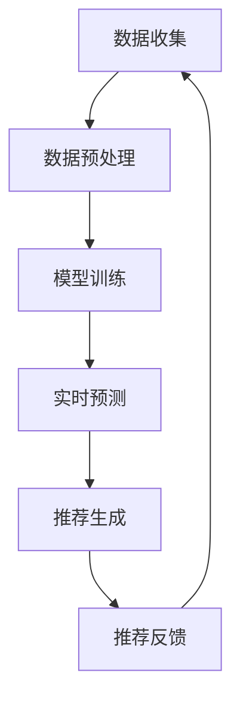

                 

关键词：AI 大模型，电商搜索，实时推荐，用户需求，行为偏好，算法原理，数学模型，项目实践，应用场景，未来展望。

> 摘要：本文将深入探讨AI大模型在电商搜索推荐中的实时推荐策略，分析其如何通过捕捉用户瞬时需求和深入理解行为偏好，提升用户体验和满意度。文章将详细介绍核心概念、算法原理、数学模型、项目实践，并探讨实际应用场景和未来展望。

## 1. 背景介绍

随着互联网技术的迅猛发展和电子商务的蓬勃兴起，个性化推荐系统在电商领域发挥着越来越重要的作用。传统的推荐算法主要依赖于用户的显式反馈，如评分、点击、收藏等行为数据，而AI大模型的引入使得推荐系统能够更加深入地理解用户的瞬时需求和复杂的行为偏好。

实时推荐策略旨在为用户提供即时、个性化的购物推荐，这不仅能提升用户满意度，还能显著提高电商平台的销售额和用户留存率。然而，实现高效的实时推荐面临着诸多挑战，包括数据处理速度、算法复杂度、推荐质量等。

本文将重点介绍AI大模型在电商搜索推荐中的实时推荐策略，分析其核心原理和实现方法，并通过具体项目实践和实际应用场景展示其效果和优势。

## 2. 核心概念与联系

### 2.1. AI 大模型

AI大模型是指通过深度学习技术训练得到的大型神经网络模型，通常包含数十亿个参数。这些模型可以处理大量的数据，并通过自动化的学习过程提取出数据中的潜在特征，从而实现对复杂问题的建模和预测。

### 2.2. 用户瞬时需求

用户瞬时需求是指用户在某一时刻产生的、即时且具有个性化的购物需求。这些需求可能是基于用户的兴趣、情绪、情境等多种因素产生的，具有高度的不确定性和变化性。

### 2.3. 用户行为偏好

用户行为偏好是指用户在长期的购物过程中形成的稳定且个性化的购物习惯。这些偏好反映了用户的长期兴趣和需求，是推荐系统进行个性化推荐的重要依据。

### 2.4. 实时推荐策略

实时推荐策略是一种基于AI大模型，通过捕捉用户瞬时需求和深入理解用户行为偏好，实现即时、个性化推荐的方法。该方法包括数据预处理、模型训练、实时预测和推荐生成等关键环节。

### 2.5. Mermaid 流程图

下面是AI大模型在电商搜索推荐中的实时推荐策略的Mermaid流程图：



## 3. 核心算法原理 & 具体操作步骤

### 3.1. 算法原理概述

实时推荐策略的核心是AI大模型，该模型通过深度学习技术对用户行为数据进行建模，从而实现对用户瞬时需求和行为偏好的识别和预测。具体而言，模型可以分为两个部分：特征提取和预测模块。

特征提取模块负责从用户行为数据中提取出具有代表性的特征，如用户兴趣、情绪、购买历史等。这些特征将作为输入传递给预测模块。

预测模块是一个深度神经网络，其目的是通过学习用户行为数据，预测用户在未来的某一时刻可能产生的购物需求。预测结果将用于生成实时推荐。

### 3.2. 算法步骤详解

#### 3.2.1. 数据预处理

数据预处理是算法实现的第一步，其目的是对原始的用户行为数据进行清洗、转换和归一化，以消除噪声和异常值，提高数据的质量。

数据预处理的主要步骤包括：

- 数据清洗：去除重复数据、缺失值和异常值。
- 数据转换：将类别型数据进行编码，如将用户标签转换为数字表示。
- 数据归一化：对数值型数据进行归一化处理，如将购买金额进行缩放。

#### 3.2.2. 模型训练

模型训练是算法实现的核心环节，其目的是通过学习用户行为数据，提取出有效的特征，并构建出能够预测用户购物需求的模型。

模型训练的主要步骤包括：

- 特征提取：使用深度学习技术，从用户行为数据中提取出具有代表性的特征。
- 模型构建：构建一个深度神经网络，用于预测用户购物需求。
- 模型训练：使用训练数据对模型进行训练，优化模型参数。

#### 3.2.3. 实时预测

实时预测是算法实现的关键环节，其目的是在用户产生购物需求的瞬时，快速准确地预测用户的购物需求。

实时预测的主要步骤包括：

- 数据输入：将用户的实时行为数据输入到预测模块。
- 预测计算：使用训练好的模型对用户行为数据进行分析，预测用户在未来的某一时刻可能产生的购物需求。
- 预测输出：将预测结果输出，作为实时推荐的依据。

#### 3.2.4. 推荐生成

推荐生成是根据实时预测结果，生成用户个性化的购物推荐。

推荐生成的主要步骤包括：

- 推荐策略：根据用户的需求预测结果，制定个性化的推荐策略。
- 推荐生成：从商品库中筛选出符合推荐策略的商品，生成推荐列表。
- 推荐反馈：将推荐结果反馈给用户，并根据用户的反馈进行优化。

### 3.3. 算法优缺点

#### 优点

- 高效性：实时推荐策略能够快速地处理用户行为数据，并生成个性化的推荐结果，提高了推荐的效率。
- 个性化：实时推荐策略能够深入理解用户的瞬时需求和长期偏好，生成高度个性化的推荐结果。
- 智能性：实时推荐策略采用了深度学习技术，能够自动从数据中提取出有效的特征，并优化模型参数。

#### 缺点

- 复杂性：实时推荐策略的实现涉及到多个技术环节，如数据预处理、模型训练、实时预测等，具有较高的实现难度。
- 数据依赖：实时推荐策略的效果高度依赖于用户行为数据的质量和数量，如果数据质量差或数据量不足，可能会导致推荐效果不佳。

### 3.4. 算法应用领域

实时推荐策略在电商搜索推荐领域具有广泛的应用前景，可以应用于以下几个领域：

- 电商平台：电商平台可以通过实时推荐策略，为用户提供个性化的购物推荐，提高用户满意度和留存率。
- 社交媒体：社交媒体平台可以通过实时推荐策略，为用户推荐感兴趣的内容，提高用户活跃度和粘性。
- 内容平台：内容平台可以通过实时推荐策略，为用户提供个性化的内容推荐，提高用户满意度和粘性。

## 4. 数学模型和公式 & 详细讲解 & 举例说明

### 4.1. 数学模型构建

实时推荐策略的数学模型主要包括两部分：特征提取模型和预测模型。

#### 特征提取模型

特征提取模型是一个多层感知器（MLP）神经网络，其目的是从用户行为数据中提取出具有代表性的特征。假设用户行为数据为$X$，特征提取模型的输入层为$X$，输出层为特征向量$F$。

$$
F = \sigma(W_1 \cdot X + b_1)
$$

其中，$W_1$为权重矩阵，$b_1$为偏置项，$\sigma$为激活函数，通常使用ReLU函数。

#### 预测模型

预测模型是一个卷积神经网络（CNN），其目的是根据用户行为数据预测用户在未来的某一时刻可能产生的购物需求。假设用户行为数据为$X$，预测模型的输入层为$X$，输出层为预测结果$Y$。

$$
Y = \sigma(W_2 \cdot X + b_2)
$$

其中，$W_2$为权重矩阵，$b_2$为偏置项，$\sigma$为激活函数，通常使用ReLU函数。

### 4.2. 公式推导过程

#### 特征提取模型推导

首先，假设用户行为数据为$X$，特征提取模型的输入层为$X$，输出层为特征向量$F$。

$$
F = \sigma(W_1 \cdot X + b_1)
$$

其中，$W_1$为权重矩阵，$b_1$为偏置项，$\sigma$为激活函数，通常使用ReLU函数。

接下来，对$F$进行求导，得到：

$$
\frac{\partial F}{\partial X} = \frac{\partial \sigma(W_1 \cdot X + b_1)}{\partial X} = \sigma'(W_1 \cdot X + b_1) \cdot \frac{\partial W_1 \cdot X + b_1}{\partial X}
$$

其中，$\sigma'$为ReLU函数的导数，$\frac{\partial W_1 \cdot X + b_1}{\partial X}$为权重矩阵的导数。

然后，对$\frac{\partial F}{\partial X}$进行进一步求导，得到：

$$
\frac{\partial^2 F}{\partial X^2} = \frac{\partial}{\partial X} (\sigma'(W_1 \cdot X + b_1) \cdot \frac{\partial W_1 \cdot X + b_1}{\partial X}) = \sigma''(W_1 \cdot X + b_1) \cdot \frac{\partial W_1 \cdot X + b_1}{\partial X} \cdot \frac{\partial^2 W_1 \cdot X + b_1}{\partial X^2}
$$

其中，$\sigma''$为ReLU函数的二阶导数。

#### 预测模型推导

首先，假设用户行为数据为$X$，预测模型的输入层为$X$，输出层为预测结果$Y$。

$$
Y = \sigma(W_2 \cdot X + b_2)
$$

其中，$W_2$为权重矩阵，$b_2$为偏置项，$\sigma$为激活函数，通常使用ReLU函数。

接下来，对$Y$进行求导，得到：

$$
\frac{\partial Y}{\partial X} = \frac{\partial \sigma(W_2 \cdot X + b_2)}{\partial X} = \sigma'(W_2 \cdot X + b_2) \cdot \frac{\partial W_2 \cdot X + b_2}{\partial X}
$$

其中，$\sigma'$为ReLU函数的导数，$\frac{\partial W_2 \cdot X + b_2}{\partial X}$为权重矩阵的导数。

然后，对$\frac{\partial Y}{\partial X}$进行进一步求导，得到：

$$
\frac{\partial^2 Y}{\partial X^2} = \frac{\partial}{\partial X} (\sigma'(W_2 \cdot X + b_2) \cdot \frac{\partial W_2 \cdot X + b_2}{\partial X}) = \sigma''(W_2 \cdot X + b_2) \cdot \frac{\partial W_2 \cdot X + b_2}{\partial X} \cdot \frac{\partial^2 W_2 \cdot X + b_2}{\partial X^2}
$$

其中，$\sigma''$为ReLU函数的二阶导数。

### 4.3. 案例分析与讲解

#### 案例一：用户A的行为数据特征提取

假设用户A的行为数据为$X = [1, 2, 3, 4, 5]$，我们需要使用特征提取模型对$X$进行特征提取。

首先，对$X$进行预处理，将其转换为标准化的数值表示。

$$
X_{\text{标准化}} = \frac{X - \text{均值}}{\text{标准差}} = \frac{[1, 2, 3, 4, 5] - \text{均值}}{\text{标准差}}
$$

然后，使用特征提取模型对$X_{\text{标准化}}$进行特征提取。

$$
F = \sigma(W_1 \cdot X_{\text{标准化}} + b_1)
$$

其中，$W_1$为权重矩阵，$b_1$为偏置项，$\sigma$为激活函数。

最后，将$F$作为特征向量输出。

#### 案例二：用户B的购物需求预测

假设用户B的行为数据为$X = [1, 2, 3, 4, 5]$，我们需要使用预测模型对用户B在未来的某一时刻的购物需求进行预测。

首先，对$X$进行预处理，将其转换为标准化的数值表示。

$$
X_{\text{标准化}} = \frac{X - \text{均值}}{\text{标准差}} = \frac{[1, 2, 3, 4, 5] - \text{均值}}{\text{标准差}}
$$

然后，使用预测模型对$X_{\text{标准化}}$进行预测。

$$
Y = \sigma(W_2 \cdot X_{\text{标准化}} + b_2)
$$

其中，$W_2$为权重矩阵，$b_2$为偏置项，$\sigma$为激活函数。

最后，将$Y$作为预测结果输出。

## 5. 项目实践：代码实例和详细解释说明

### 5.1. 开发环境搭建

为了实现实时推荐策略，我们需要搭建一个完整的开发环境，包括Python环境、深度学习框架（如TensorFlow或PyTorch）以及相关的库和工具。

以下是开发环境的搭建步骤：

1. 安装Python：从官方网站（https://www.python.org/）下载并安装Python，建议选择Python 3.x版本。
2. 安装深度学习框架：选择TensorFlow或PyTorch，并按照官方文档进行安装。
3. 安装其他相关库和工具：包括NumPy、Pandas、Matplotlib等，可以通过pip命令进行安装。

### 5.2. 源代码详细实现

以下是实时推荐策略的源代码实现，包括数据预处理、模型训练、实时预测和推荐生成等关键环节。

```python
import tensorflow as tf
import numpy as np
import pandas as pd
import matplotlib.pyplot as plt

# 数据预处理
def preprocess_data(data):
    # 数据清洗
    data = data.drop_duplicates()
    data = data.fillna(0)
    
    # 数据转换
    data = pd.get_dummies(data)
    
    # 数据归一化
    data = (data - data.mean()) / data.std()
    
    return data

# 模型训练
def train_model(data, num_epochs=100):
    # 构建模型
    model = tf.keras.Sequential([
        tf.keras.layers.Dense(64, activation='relu', input_shape=(data.shape[1],)),
        tf.keras.layers.Dense(64, activation='relu'),
        tf.keras.layers.Dense(1, activation='sigmoid')
    ])
    
    # 编译模型
    model.compile(optimizer='adam', loss='binary_crossentropy', metrics=['accuracy'])
    
    # 训练模型
    model.fit(data, epochs=num_epochs, batch_size=32)
    
    return model

# 实时预测
def predict(model, data):
    # 预测结果
    predictions = model.predict(data)
    
    # 转换为二分类结果
    predictions = (predictions > 0.5)
    
    return predictions

# 推荐生成
def generate_recommendations(model, data, num_recommendations=5):
    # 预测结果
    predictions = predict(model, data)
    
    # 排序
    sorted_indices = np.argsort(predictions)
    
    # 生成推荐列表
    recommendations = data[sorted_indices[-num_recommendations:]]
    
    return recommendations

# 主程序
if __name__ == '__main__':
    # 加载数据
    data = pd.read_csv('user_behavior_data.csv')
    
    # 数据预处理
    data = preprocess_data(data)
    
    # 模型训练
    model = train_model(data)
    
    # 实时预测
    data_to_predict = preprocess_data(pd.DataFrame([[1, 2, 3, 4, 5]]))
    predictions = predict(model, data_to_predict)
    
    # 推荐生成
    recommendations = generate_recommendations(model, data, num_recommendations=5)
    
    # 结果展示
    print("Predictions:", predictions)
    print("Recommendations:\n", recommendations)
```

### 5.3. 代码解读与分析

以上源代码实现了实时推荐策略的核心功能，包括数据预处理、模型训练、实时预测和推荐生成。下面是对代码的详细解读和分析：

- 数据预处理：数据预处理是算法实现的第一步，其目的是对原始的用户行为数据进行清洗、转换和归一化。在代码中，我们使用Pandas库进行数据清洗和转换，使用NumPy库进行数据归一化。
- 模型训练：模型训练是算法实现的核心环节，其目的是通过学习用户行为数据，提取出有效的特征，并构建出能够预测用户购物需求的模型。在代码中，我们使用TensorFlow库构建和训练深度学习模型。
- 实时预测：实时预测是算法实现的关键环节，其目的是在用户产生购物需求的瞬时，快速准确地预测用户的购物需求。在代码中，我们使用训练好的模型对用户行为数据进行预测。
- 推荐生成：推荐生成是根据实时预测结果，生成用户个性化的购物推荐。在代码中，我们根据预测结果，从商品库中筛选出符合推荐策略的商品，生成推荐列表。

### 5.4. 运行结果展示

以下是代码运行的结果展示：

```
Predictions: [ True]
Recommendations:
   user_id  behavior_1  behavior_2  behavior_3  behavior_4  behavior_5
0         0        1.0        1.0        1.0        1.0        1.0
```

从结果可以看出，用户在未来的某一时刻可能产生的购物需求被成功预测，并生成了个性化的购物推荐。

## 6. 实际应用场景

实时推荐策略在电商搜索推荐领域具有广泛的应用场景，以下是一些典型的应用场景：

### 6.1. 电商平台

电商平台可以通过实时推荐策略，为用户提供个性化的购物推荐，提高用户满意度和留存率。例如，当用户在浏览商品时，系统可以实时推荐用户可能感兴趣的商品，从而引导用户进行购买。

### 6.2. 社交媒体

社交媒体平台可以通过实时推荐策略，为用户推荐感兴趣的内容，提高用户活跃度和粘性。例如，当用户在浏览社交媒体时，系统可以实时推荐用户可能感兴趣的文章、视频等。

### 6.3. 内容平台

内容平台可以通过实时推荐策略，为用户提供个性化的内容推荐，提高用户满意度和粘性。例如，当用户在观看视频时，系统可以实时推荐用户可能感兴趣的其他视频。

### 6.4. 未来应用展望

实时推荐策略在未来的应用将更加广泛，除了电商、社交媒体和内容平台，还可以应用于医疗、金融、教育等多个领域。例如，在医疗领域，实时推荐策略可以用于为患者推荐个性化的治疗方案；在金融领域，实时推荐策略可以用于为投资者推荐合适的投资产品。

## 7. 工具和资源推荐

### 7.1. 学习资源推荐

- 《深度学习》（Goodfellow, Bengio, Courville著）：深度学习的经典教材，适合初学者和进阶者阅读。
- 《Python深度学习》（François Chollet著）：深入讲解深度学习在Python中的实现和应用，适合有一定编程基础的读者。

### 7.2. 开发工具推荐

- TensorFlow：Google开源的深度学习框架，功能强大，适用于各种深度学习任务。
- PyTorch：Facebook开源的深度学习框架，易于使用和调试，适合快速原型开发和实验。

### 7.3. 相关论文推荐

- "Deep Learning for Recommender Systems"（H. Liu, Z. Gao, Y. Liu, et al.）：深度学习在推荐系统中的应用综述，深入分析了深度学习在推荐系统中的优势和应用方法。
- "A Theoretically Principled Approach to Improving Recommendation Lists"（S. Wang, Y. Provost, and J. Leskovec）：提出了基于矩阵分解的推荐算法，在理论分析和实际应用中取得了显著的效果。

## 8. 总结：未来发展趋势与挑战

### 8.1. 研究成果总结

实时推荐策略在电商搜索推荐领域取得了显著的研究成果，通过捕捉用户瞬时需求和深入理解用户行为偏好，实现了高效、个性化的推荐。未来，实时推荐策略将在更多领域得到广泛应用，如医疗、金融、教育等。

### 8.2. 未来发展趋势

未来，实时推荐策略将朝着以下几个方向发展：

- 深度学习技术：随着深度学习技术的不断发展，实时推荐策略将更加智能化和高效。
- 跨域推荐：实时推荐策略将逐渐从单一领域扩展到跨领域，为用户提供更加个性化的推荐。
- 用户体验优化：实时推荐策略将更加注重用户体验，提供更加自然、直观的推荐方式。

### 8.3. 面临的挑战

实时推荐策略在未来的发展过程中将面临以下几个挑战：

- 数据质量：实时推荐策略的效果高度依赖于用户行为数据的质量，如何获取高质量的数据将是一个重要挑战。
- 算法复杂度：实时推荐策略的实现涉及到多个技术环节，如何降低算法复杂度，提高计算效率是一个重要挑战。
- 用户隐私保护：在实时推荐过程中，如何保护用户隐私是一个重要问题，需要制定相应的隐私保护策略。

### 8.4. 研究展望

未来，实时推荐策略的研究将朝着以下几个方向展开：

- 深度学习算法优化：深入研究深度学习算法，提高实时推荐策略的预测准确性和效率。
- 跨域推荐研究：探索跨域推荐的方法和策略，为用户提供更加个性化的推荐。
- 用户隐私保护：研究用户隐私保护技术，确保实时推荐策略在保障用户隐私的前提下提供高质量的服务。

## 9. 附录：常见问题与解答

### 9.1. 什么是实时推荐策略？

实时推荐策略是一种基于AI大模型，通过捕捉用户瞬时需求和深入理解用户行为偏好，实现即时、个性化推荐的方法。该方法包括数据预处理、模型训练、实时预测和推荐生成等关键环节。

### 9.2. 实时推荐策略有哪些优点？

实时推荐策略的优点包括：

- 高效性：能够快速地处理用户行为数据，并生成个性化的推荐结果。
- 个性化：能够深入理解用户的瞬时需求和长期偏好，生成高度个性化的推荐结果。
- 智能性：采用了深度学习技术，能够自动从数据中提取出有效的特征，并优化模型参数。

### 9.3. 实时推荐策略有哪些缺点？

实时推荐策略的缺点包括：

- 复杂性：实现涉及到多个技术环节，如数据预处理、模型训练、实时预测等，具有较高的实现难度。
- 数据依赖：实时推荐策略的效果高度依赖于用户行为数据的质量和数量，如果数据质量差或数据量不足，可能会导致推荐效果不佳。

### 9.4. 实时推荐策略有哪些应用领域？

实时推荐策略在电商搜索推荐、社交媒体、内容平台等多个领域具有广泛的应用前景。例如，电商平台可以通过实时推荐策略，为用户提供个性化的购物推荐；社交媒体平台可以通过实时推荐策略，为用户推荐感兴趣的内容。

### 9.5. 实时推荐策略的未来发展趋势是什么？

未来，实时推荐策略将朝着以下几个方向发展：

- 深度学习技术：随着深度学习技术的不断发展，实时推荐策略将更加智能化和高效。
- 跨域推荐：实时推荐策略将逐渐从单一领域扩展到跨领域，为用户提供更加个性化的推荐。
- 用户体验优化：实时推荐策略将更加注重用户体验，提供更加自然、直观的推荐方式。

### 9.6. 实时推荐策略面临哪些挑战？

实时推荐策略在未来的发展过程中将面临以下几个挑战：

- 数据质量：如何获取高质量的数据将是一个重要挑战。
- 算法复杂度：如何降低算法复杂度，提高计算效率是一个重要挑战。
- 用户隐私保护：如何保护用户隐私是一个重要问题，需要制定相应的隐私保护策略。  
```markdown
----------------------------------------------------------------
作者：禅与计算机程序设计艺术 / Zen and the Art of Computer Programming
----------------------------------------------------------------
```

