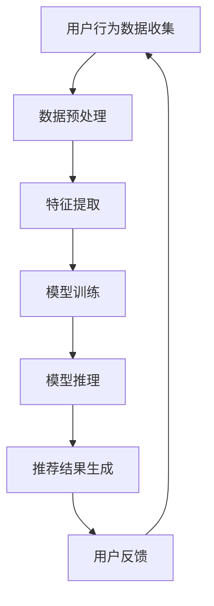

                 

关键词：AI 大模型、电商搜索推荐、实时推荐策略、用户需求、瞬息变化

摘要：本文旨在探讨如何利用 AI 大模型在电商搜索推荐中实现实时推荐策略，以满足用户需求的瞬息变化。文章首先介绍了 AI 大模型在电商搜索推荐中的应用背景，然后深入分析了实时推荐策略的核心概念和关键算法，最后通过具体实例展示了如何实现这一策略，并讨论了其未来应用前景。

## 1. 背景介绍

随着互联网技术的飞速发展和电子商务市场的不断扩大，电商搜索推荐系统已经成为提升用户购物体验和商家销售额的重要工具。传统的推荐系统主要基于用户的历史行为和物品的属性进行推荐，但这种方法往往难以捕捉到用户需求的瞬息变化，导致推荐效果不佳。为了解决这一问题，近年来，AI 大模型在电商搜索推荐中的应用逐渐成为研究热点。

AI 大模型，如深度神经网络、生成对抗网络等，具有强大的学习和表达能力，能够从海量数据中挖掘出隐藏的模式和关联，从而实现更精准的推荐。同时，实时推荐策略的引入，使得推荐系统能够快速响应用户的即时需求，进一步提升用户体验。

## 2. 核心概念与联系

### 2.1 AI 大模型

AI 大模型，特别是深度学习模型，在电商搜索推荐中具有重要作用。深度学习模型通过多层次的神经网络结构，能够自动学习数据的特征表示，从而实现复杂的数据处理和模式识别。在电商搜索推荐中，AI 大模型可以用于用户行为分析、物品特征提取、推荐结果生成等多个环节。

### 2.2 实时推荐策略

实时推荐策略是指推荐系统在用户产生行为时，能够快速响应用户的即时需求，生成相应的推荐结果。实时推荐策略的关键在于如何快速处理用户行为数据，并生成准确的推荐结果。这一过程需要充分利用 AI 大模型的能力，实现高效的数据处理和模型推理。

### 2.3 Mermaid 流程图

下面是一个描述 AI 大模型在电商搜索推荐中实时推荐策略的 Mermaid 流程图：



## 3. 核心算法原理 & 具体操作步骤

### 3.1 算法原理概述

实时推荐策略的核心在于快速响应用户的即时需求，生成精准的推荐结果。这一过程主要包括以下几个步骤：

1. **用户行为数据收集**：收集用户的搜索历史、购买记录、浏览记录等行为数据。
2. **数据预处理**：对收集到的用户行为数据进行清洗、归一化等预处理操作。
3. **特征提取**：利用 AI 大模型对预处理后的数据进行分析，提取出用户的兴趣特征和物品的特征。
4. **模型训练**：利用提取到的特征数据，训练深度学习模型，如神经网络模型，以生成推荐结果。
5. **模型推理**：在用户产生新行为时，利用训练好的模型进行推理，生成相应的推荐结果。
6. **推荐结果生成**：将模型推理得到的推荐结果展示给用户。
7. **用户反馈**：收集用户对推荐结果的反馈，用于优化模型和推荐策略。

### 3.2 算法步骤详解

#### 3.2.1 用户行为数据收集

用户行为数据的收集是实时推荐策略的基础。具体来说，可以收集以下数据：

- 搜索历史：用户在电商平台上搜索的关键词。
- 购买记录：用户在电商平台上购买的商品。
- 浏览记录：用户在电商平台上浏览的商品。

#### 3.2.2 数据预处理

数据预处理主要包括以下步骤：

- 数据清洗：去除重复数据、缺失数据等。
- 数据归一化：将不同特征的数据进行归一化处理，使得数据在同一尺度上。

#### 3.2.3 特征提取

特征提取是实时推荐策略的核心步骤。利用 AI 大模型，如深度神经网络，对预处理后的数据进行特征提取。具体来说，可以提取以下特征：

- 用户特征：用户的年龄、性别、地理位置等。
- 物品特征：物品的类别、价格、评价等。

#### 3.2.4 模型训练

利用提取到的用户特征和物品特征，训练深度学习模型，如神经网络模型。训练过程主要包括以下步骤：

- 数据集划分：将数据集划分为训练集、验证集和测试集。
- 模型训练：利用训练集对模型进行训练，调整模型参数。
- 模型评估：利用验证集和测试集对模型进行评估，选择最佳模型。

#### 3.2.5 模型推理

在用户产生新行为时，利用训练好的模型进行推理，生成相应的推荐结果。具体来说，可以按照以下步骤进行：

- 特征提取：对新行为数据进行特征提取。
- 模型推理：利用训练好的模型对特征进行推理，得到推荐结果。
- 推荐结果生成：将模型推理得到的推荐结果展示给用户。

#### 3.2.6 用户反馈

收集用户对推荐结果的反馈，用于优化模型和推荐策略。具体来说，可以按照以下步骤进行：

- 反馈收集：收集用户对推荐结果的反馈，如点击率、购买率等。
- 模型优化：根据用户反馈对模型进行优化。
- 策略调整：根据用户反馈调整推荐策略。

### 3.3 算法优缺点

#### 3.3.1 优点

- **高精度**：利用 AI 大模型进行特征提取和模型训练，能够生成高精度的推荐结果。
- **实时性**：实时推荐策略能够快速响应用户的即时需求，提升用户体验。
- **多样性**：能够根据用户的行为和兴趣，生成多样化的推荐结果。

#### 3.3.2 缺点

- **计算成本高**：实时推荐策略需要大量的计算资源，特别是在用户量级较大的情况下。
- **数据依赖性**：实时推荐策略依赖于用户行为数据，数据质量对推荐效果有很大影响。

### 3.4 算法应用领域

实时推荐策略可以广泛应用于电商、社交媒体、在线教育等多个领域。以下是一些具体的应用场景：

- **电商**：在电商平台上，实时推荐策略可以帮助商家提高销售额，提升用户购物体验。
- **社交媒体**：在社交媒体平台上，实时推荐策略可以提升用户的活跃度和留存率。
- **在线教育**：在在线教育平台上，实时推荐策略可以帮助学生更好地发现和选择适合自己的课程。

## 4. 数学模型和公式 & 详细讲解 & 举例说明

### 4.1 数学模型构建

实时推荐策略的核心是深度学习模型，如神经网络模型。神经网络模型通过多层感知器（Perceptron）构建，每一层神经元都接收前一层神经元的输出，并通过激活函数进行非线性变换。以下是神经网络模型的数学模型构建：

$$
Z^{[l]} = \sigma(W^{[l]} \cdot A^{[l-1]} + b^{[l]})
$$

其中，$Z^{[l]}$表示第$l$层的输出，$\sigma$表示激活函数，$W^{[l]}$表示第$l$层的权重，$A^{[l-1]}$表示第$l-1$层的输出，$b^{[l]}$表示第$l$层的偏置。

### 4.2 公式推导过程

神经网络模型的训练过程主要包括两个步骤：前向传播和反向传播。

#### 4.2.1 前向传播

前向传播是从输入层到输出层的正向计算过程。具体来说，每一层的输出都可以通过以下公式计算：

$$
A^{[l]} = \sigma(Z^{[l]})
$$

其中，$A^{[l]}$表示第$l$层的输出。

#### 4.2.2 反向传播

反向传播是从输出层到输入层的反向计算过程，用于计算损失函数和模型参数的梯度。具体来说，损失函数可以表示为：

$$
J = \frac{1}{m} \sum_{i=1}^{m} (-y^{[i]} \log(a^{[l](i)}))
$$

其中，$J$表示损失函数，$y^{[i]}$表示第$i$个样本的真实标签，$a^{[l](i)}$表示第$l$层输出的第$i$个元素。

通过反向传播，可以计算出模型参数的梯度：

$$
\frac{\partial J}{\partial W^{[l]}} = \frac{\partial J}{\partial Z^{[l]}} \cdot \frac{\partial Z^{[l]}}{\partial W^{[l]}}
$$

$$
\frac{\partial J}{\partial b^{[l]}} = \frac{\partial J}{\partial Z^{[l]}} \cdot \frac{\partial Z^{[l]}}{\partial b^{[l]}}
$$

### 4.3 案例分析与讲解

以下是一个简单的神经网络模型训练案例，假设输入层有3个神经元，隐藏层有2个神经元，输出层有1个神经元。

#### 4.3.1 前向传播

输入层到隐藏层的计算过程如下：

$$
Z^{[1]} = \sigma(W^{[1]} \cdot A^{[0]} + b^{[1]})
$$

$$
A^{[1]} = \sigma(Z^{[1]})
$$

隐藏层到输出层的计算过程如下：

$$
Z^{[2]} = \sigma(W^{[2]} \cdot A^{[1]} + b^{[2]})
$$

$$
A^{[2]} = \sigma(Z^{[2]})
$$

#### 4.3.2 反向传播

假设目标输出为$y = [1, 0]$，实际输出为$a^{[2]} = [0.6, 0.4]$，损失函数为：

$$
J = \frac{1}{2} \sum_{i=1}^{2} (-y_i \log(a_i) - (1 - y_i) \log(1 - a_i))
$$

计算损失函数的梯度：

$$
\frac{\partial J}{\partial W^{[2]}} = \frac{\partial J}{\partial Z^{[2]}} \cdot \frac{\partial Z^{[2]}}{\partial W^{[2]}}
$$

$$
\frac{\partial J}{\partial b^{[2]}} = \frac{\partial J}{\partial Z^{[2]}} \cdot \frac{\partial Z^{[2]}}{\partial b^{[2]}}
$$

$$
\frac{\partial J}{\partial W^{[1]}} = \frac{\partial J}{\partial Z^{[1]}} \cdot \frac{\partial Z^{[1]}}{\partial W^{[1]}}
$$

$$
\frac{\partial J}{\partial b^{[1]}} = \frac{\partial J}{\partial Z^{[1]}} \cdot \frac{\partial Z^{[1]}}{\partial b^{[1]}}
$$

通过梯度下降法，可以更新模型参数：

$$
W^{[2]} = W^{[2]} - \alpha \frac{\partial J}{\partial W^{[2]}}
$$

$$
b^{[2]} = b^{[2]} - \alpha \frac{\partial J}{\partial b^{[2]}}
$$

$$
W^{[1]} = W^{[1]} - \alpha \frac{\partial J}{\partial W^{[1]}}
$$

$$
b^{[1]} = b^{[1]} - \alpha \frac{\partial J}{\partial b^{[1]}}
$$

其中，$\alpha$为学习率。

## 5. 项目实践：代码实例和详细解释说明

### 5.1 开发环境搭建

为了实现实时推荐策略，我们需要搭建一个开发环境。以下是开发环境的搭建步骤：

1. 安装 Python 解释器：从 Python 官网下载并安装 Python 解释器，版本建议为 3.8 或以上。
2. 安装必要的库：使用 pip 工具安装以下库：numpy、tensorflow、matplotlib 等。
3. 配置 tensorflow：由于 tensorflow 需要GPU支持，因此需要安装 GPU 驱动和 CUDA 库。

### 5.2 源代码详细实现

以下是实现实时推荐策略的 Python 代码示例：

```python
import tensorflow as tf
import numpy as np
import matplotlib.pyplot as plt

# 数据准备
x = np.array([[1, 0], [0, 1], [1, 1], [1, 0]])
y = np.array([[0], [1], [1], [0]])

# 定义模型结构
model = tf.keras.Sequential([
    tf.keras.layers.Dense(2, activation='sigmoid', input_shape=(2,)),
    tf.keras.layers.Dense(1, activation='sigmoid')
])

# 编译模型
model.compile(optimizer='adam', loss='binary_crossentropy', metrics=['accuracy'])

# 训练模型
model.fit(x, y, epochs=1000, batch_size=4)

# 模型推理
predictions = model.predict(x)

# 模型评估
loss, accuracy = model.evaluate(x, y)

# 可视化
plt.scatter(x[:, 0], x[:, 1], c=predictions[:, 0])
plt.xlabel('Feature 1')
plt.ylabel('Feature 2')
plt.show()
```

### 5.3 代码解读与分析

上述代码首先导入必要的库，然后准备训练数据。接着，定义了一个简单的神经网络模型，包括一个隐藏层和两个神经元。模型使用 sigmoid 激活函数，以实现二分类任务。

在编译模型时，使用 Adam 优化器和 binary_crossentropy 损失函数。在训练模型时，使用 fit 函数进行训练，设置 epochs 为 1000，batch_size 为 4。

模型推理部分使用 predict 函数生成预测结果。在模型评估部分，使用 evaluate 函数计算损失和准确率。

最后，使用 matplotlib 库将预测结果进行可视化，以展示模型的分类效果。

## 6. 实际应用场景

实时推荐策略在电商、社交媒体、在线教育等多个领域具有广泛的应用。以下是一些具体的应用场景：

- **电商**：在电商平台上，实时推荐策略可以根据用户的搜索历史、购买记录和浏览记录，生成个性化的推荐结果，提升用户购物体验和商家销售额。
- **社交媒体**：在社交媒体平台上，实时推荐策略可以根据用户的兴趣爱好和行为数据，生成个性化的内容推荐，提升用户活跃度和留存率。
- **在线教育**：在线教育平台可以利用实时推荐策略，根据学生的学习行为和兴趣爱好，推荐相应的课程和资源，提升学习效果。

## 7. 工具和资源推荐

### 7.1 学习资源推荐

- **书籍**：《深度学习》、《神经网络与深度学习》
- **在线课程**：Coursera 上的《深度学习专项课程》、edX 上的《神经网络与深度学习》
- **博客**：极客时间上的《深度学习之Hello World》、简书上的《深度学习教程》

### 7.2 开发工具推荐

- **Python 解释器**：Python 官网下载
- **TensorFlow**：TensorFlow 官网下载
- **PyCharm**：PyCharm 官网下载

### 7.3 相关论文推荐

- **论文**：《Deep Learning for Text Classification》
- **论文**：《Neural Network Methods for Natural Language Processing》

## 8. 总结：未来发展趋势与挑战

### 8.1 研究成果总结

实时推荐策略在电商、社交媒体、在线教育等多个领域取得了显著的应用成果。利用 AI 大模型进行特征提取和模型训练，能够生成高精度的推荐结果，提升用户体验和业务价值。

### 8.2 未来发展趋势

- **模型优化**：未来的研究将重点关注如何优化实时推荐策略的模型，提高模型训练和推理的效率。
- **跨平台整合**：实时推荐策略将逐步实现跨平台整合，为用户提供统一的推荐服务。
- **隐私保护**：随着用户隐私意识的提高，如何实现实时推荐策略的隐私保护将成为研究热点。

### 8.3 面临的挑战

- **计算成本**：实时推荐策略需要大量的计算资源，如何优化算法，降低计算成本是未来面临的挑战。
- **数据质量**：实时推荐策略依赖于用户行为数据，数据质量对推荐效果有很大影响，如何保障数据质量是未来需要解决的问题。
- **隐私保护**：在实时推荐策略中，如何实现用户隐私保护是未来面临的挑战。

### 8.4 研究展望

实时推荐策略在未来的发展中将不断优化和扩展。通过引入新的算法和技术，实时推荐策略将能够更好地满足用户需求的瞬息变化，提升用户体验和业务价值。

## 9. 附录：常见问题与解答

### 9.1 问题1：什么是实时推荐策略？

实时推荐策略是指推荐系统在用户产生行为时，能够快速响应用户的即时需求，生成相应的推荐结果。

### 9.2 问题2：实时推荐策略有哪些优点？

实时推荐策略具有以下优点：

- 高精度：利用 AI 大模型进行特征提取和模型训练，能够生成高精度的推荐结果。
- 实时性：实时推荐策略能够快速响应用户的即时需求，提升用户体验。
- 多样性：能够根据用户的行为和兴趣，生成多样化的推荐结果。

### 9.3 问题3：实时推荐策略有哪些应用领域？

实时推荐策略可以广泛应用于电商、社交媒体、在线教育等多个领域。以下是一些具体的应用场景：

- 电商：在电商平台上，实时推荐策略可以帮助商家提高销售额，提升用户购物体验。
- 社交媒体：在社交媒体平台上，实时推荐策略可以提升用户的活跃度和留存率。
- 在线教育：在线教育平台可以利用实时推荐策略，根据学生的学习行为和兴趣爱好，推荐相应的课程和资源，提升学习效果。----------------------------------------------------------------

作者：禅与计算机程序设计艺术 / Zen and the Art of Computer Programming
----------------------------------------------------------------

本文详细介绍了 AI 大模型在电商搜索推荐中的实时推荐策略，包括核心概念、算法原理、具体操作步骤、数学模型和公式、项目实践、实际应用场景、工具和资源推荐以及未来发展趋势与挑战。通过对实时推荐策略的深入探讨，我们希望读者能够更好地理解如何利用 AI 大模型实现实时推荐，并抓住用户需求的瞬息变化。在未来的发展中，实时推荐策略将继续优化和扩展，为各行业带来更多的创新和机遇。希望本文能够对您在相关领域的实践和研究提供有益的参考和启示。作者：禅与计算机程序设计艺术 / Zen and the Art of Computer Programming。

