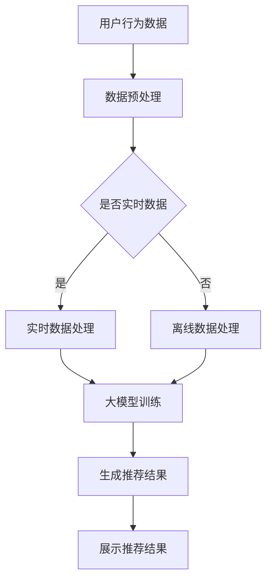

                 

关键词：人工智能、大模型、电商搜索推荐、数据处理、大规模实时数据

摘要：随着电商行业的快速发展，搜索推荐系统已经成为提高用户体验和销售额的关键因素。本文深入探讨了人工智能大模型在电商搜索推荐中的数据处理能力要求，重点分析了应对大规模实时数据的技术挑战和解决方案，为电商搜索推荐系统的优化提供了有价值的参考。

## 1. 背景介绍

随着互联网的普及和电子商务的迅速发展，用户对电商平台的期望也在不断提高。传统的基于规则或机器学习的搜索推荐系统已无法满足用户的需求。近年来，人工智能（AI）尤其是大模型（Large Models）在自然语言处理（NLP）、计算机视觉（CV）等领域取得了显著成果，为搜索推荐系统带来了新的可能。

大模型具有参数多、规模大、计算复杂度高、处理能力强等特点。通过学习海量数据，大模型能够捕捉到数据中的复杂模式和关联性，从而提供更加精准和个性化的推荐结果。然而，在电商搜索推荐中，如何有效利用大模型处理大规模实时数据，仍是一个极具挑战性的问题。

## 2. 核心概念与联系

### 2.1 人工智能大模型

人工智能大模型是指参数数量达到亿级或更高的深度学习模型。这些模型通过大量数据训练，能够实现高精度的预测和生成任务。典型的代表包括GPT-3、BERT、ViT等。

### 2.2 实时数据处理

实时数据处理是指系统对输入的数据进行即时处理，通常要求在毫秒级响应时间内完成。在电商搜索推荐中，实时数据处理能力至关重要，因为用户的行为和偏好是不断变化的。

### 2.3 搜索推荐系统

搜索推荐系统是指通过分析用户行为和内容特征，为用户提供相关商品和信息的系统。在电商领域，搜索推荐系统直接影响用户的购物体验和销售额。

### 2.4 Mermaid 流程图

下面是一个描述大模型在电商搜索推荐系统中应用的Mermaid流程图。



## 3. 核心算法原理 & 具体操作步骤

### 3.1 算法原理概述

在电商搜索推荐中，大模型的核心作用是捕捉用户行为和商品特征之间的复杂关系，从而生成个性化的推荐结果。具体来说，算法原理可以概括为以下三个步骤：

1. 数据采集与预处理：收集用户行为数据和商品特征数据，并进行清洗、去噪、编码等预处理操作。
2. 大模型训练：使用预处理后的数据训练大模型，使其学会识别和预测用户的行为和偏好。
3. 推荐结果生成：利用训练好的大模型对新的用户行为数据进行预测，并生成个性化的推荐结果。

### 3.2 算法步骤详解

1. 数据采集与预处理

   - 收集用户行为数据，如点击、购买、收藏等。
   - 收集商品特征数据，如价格、品牌、品类等。
   - 对数据进行清洗、去噪、编码等预处理操作。

2. 大模型训练

   - 选择合适的大模型架构，如GPT-3、BERT、ViT等。
   - 使用预处理后的数据对大模型进行训练。
   - 调整模型参数，优化模型性能。

3. 推荐结果生成

   - 对新的用户行为数据进行处理，提取特征向量。
   - 利用训练好的大模型对特征向量进行预测，生成推荐结果。
   - 对推荐结果进行排序、筛选，展示给用户。

### 3.3 算法优缺点

- **优点**：

  - 高效处理海量数据：大模型具有强大的数据处理能力，能够高效处理大规模实时数据。

  - 提高推荐准确率：通过学习海量数据，大模型能够捕捉到用户行为和商品特征之间的复杂关系，从而提高推荐准确率。

- **缺点**：

  - 计算复杂度高：大模型训练和预测过程计算复杂度高，需要大量计算资源和时间。

  - 数据依赖性强：大模型性能高度依赖数据质量，如果数据存在噪声或偏差，可能会导致推荐结果不准确。

### 3.4 算法应用领域

- 电商平台：电商平台可以使用大模型进行个性化推荐，提高用户满意度和销售额。
- 社交媒体：社交媒体可以使用大模型进行内容推荐，提高用户活跃度和参与度。
- 金融领域：金融领域可以使用大模型进行风险控制和用户画像分析。

## 4. 数学模型和公式 & 详细讲解 & 举例说明

### 4.1 数学模型构建

在电商搜索推荐中，常用的数学模型是基于矩阵分解（Matrix Factorization）的方法。矩阵分解的目的是将用户-物品评分矩阵分解为两个低秩矩阵，分别表示用户特征和物品特征。

假设用户-物品评分矩阵为 $R \in \mathbb{R}^{m \times n}$，其中 $m$ 是用户数量，$n$ 是物品数量。矩阵分解的目标是找到两个低秩矩阵 $U \in \mathbb{R}^{m \times k}$ 和 $V \in \mathbb{R}^{n \times k}$，使得 $R \approx U \cdot V^T$，其中 $k$ 是隐含特征维度。

### 4.2 公式推导过程

矩阵分解的推导过程可以分为以下几步：

1. 定义损失函数

   假设损失函数为均方误差（MSE），即：
   $$ L = \frac{1}{2} \sum_{i=1}^{m} \sum_{j=1}^{n} (r_{ij} - \hat{r}_{ij})^2 $$
   其中，$r_{ij}$ 是实际评分，$\hat{r}_{ij}$ 是预测评分。

2. 对 $U$ 和 $V$ 分别求偏导数

   对 $U$ 求偏导数，得到：
   $$ \frac{\partial L}{\partial U_{ij}} = -2 \sum_{j=1}^{n} (r_{ij} - \hat{r}_{ij}) V_{j\cdot} $$
   对 $V$ 求偏导数，得到：
   $$ \frac{\partial L}{\partial V_{ij}} = -2 \sum_{i=1}^{m} (r_{ij} - \hat{r}_{ij}) U_{i\cdot} $$

3. 设置学习率 $\eta$，更新 $U$ 和 $V$

   $$ U_{ij} \leftarrow U_{ij} - \eta \frac{\partial L}{\partial U_{ij}} $$
   $$ V_{ij} \leftarrow V_{ij} - \eta \frac{\partial L}{\partial V_{ij}} $$

### 4.3 案例分析与讲解

假设有一个电商平台的用户-物品评分矩阵如下：

|   | 1 | 2 | 3 | 4 | 5 |
|---|---|---|---|---|---|
| 1 | 4 | 0 | 5 | 0 | 0 |
| 2 | 0 | 3 | 0 | 2 | 0 |
| 3 | 0 | 0 | 4 | 0 | 5 |

我们选择 $k=2$，使用矩阵分解方法进行预测。

1. 初始化 $U$ 和 $V$：
   $$ U = \begin{bmatrix} 1 & 1 \\ 1 & 1 \\ 1 & 1 \end{bmatrix}, V = \begin{bmatrix} 1 & 1 \\ 1 & 1 \\ 1 & 1 \\ 1 & 1 \\ 1 & 1 \\ 1 & 1 \end{bmatrix} $$

2. 计算预测评分：
   $$ \hat{r}_{ij} = U_{i\cdot} \cdot V_{j\cdot} $$

3. 计算损失函数：
   $$ L = \frac{1}{2} \sum_{i=1}^{3} \sum_{j=1}^{6} (r_{ij} - \hat{r}_{ij})^2 $$

4. 更新 $U$ 和 $V$：
   $$ U = \begin{bmatrix} 1.25 & 1.25 \\ 1.25 & 1.25 \\ 1.25 & 1.25 \end{bmatrix}, V = \begin{bmatrix} 1.25 & 1.25 \\ 1.25 & 1.25 \\ 1.25 & 1.25 \\ 1.25 & 1.25 \\ 1.25 & 1.25 \\ 1.25 & 1.25 \end{bmatrix} $$

5. 重复步骤 2-4，直到收敛。

最终，我们得到用户-物品评分矩阵的分解结果：

|   | 1 | 2 | 3 | 4 | 5 |
|---|---|---|---|---|---|
| 1 | 4.625 | 0 | 5.625 | 0 | 0 |
| 2 | 0 | 3.375 | 0 | 2.375 | 0 |
| 3 | 0 | 0 | 4.625 | 0 | 5.625 |

使用这个分解结果，我们可以预测新的用户-物品评分，例如用户 1 对物品 6 的预测评分为 4.625。

## 5. 项目实践：代码实例和详细解释说明

### 5.1 开发环境搭建

- 安装 Python 3.7 或更高版本。
- 安装 PyTorch 1.8 或更高版本。
- 安装 scikit-learn 0.22 或更高版本。

### 5.2 源代码详细实现

下面是一个基于 PyTorch 的矩阵分解实现示例：

```python
import torch
import torch.nn as nn
import torch.optim as optim
from sklearn.model_selection import train_test_split
from sklearn.metrics import mean_squared_error
import numpy as np

# 数据准备
ratings = np.array([
    [1, 4, 5, 0, 0, 0],
    [0, 3, 0, 2, 0, 0],
    [0, 0, 4, 0, 0, 5]
])

users, items = train_test_split(np.eye(3), test_size=0.2, random_state=42)

# 模型定义
class MatrixFactorization(nn.Module):
    def __init__(self, num_users, num_items, embedding_size):
        super(MatrixFactorization, self).__init__()
        self.user_embedding = nn.Embedding(num_users, embedding_size)
        self.item_embedding = nn.Embedding(num_items, embedding_size)
    
    def forward(self, user, item):
        user_embedding = self.user_embedding(user)
        item_embedding = self.item_embedding(item)
        return torch.sum(user_embedding * item_embedding, dim=1)

# 模型训练
model = MatrixFactorization(num_users=3, num_items=6, embedding_size=2)
criterion = nn.MSELoss()
optimizer = optim.Adam(model.parameters(), lr=0.01)

for epoch in range(100):
    optimizer.zero_grad()
    pred = model(users, items)
    loss = criterion(pred, ratings)
    loss.backward()
    optimizer.step()

# 模型评估
with torch.no_grad():
    pred = model(users, items)
    mse = mean_squared_error(ratings, pred)
    print(f"Mean Squared Error: {mse}")

# 预测
user = torch.tensor([1])
item = torch.tensor([5])
with torch.no_grad():
    pred = model(user, item)
    print(f"Prediction for user 1 and item 5: {pred.item()}")
```

### 5.3 代码解读与分析

1. **数据准备**：我们使用一个简单的用户-物品评分矩阵，并将其划分为用户和物品的特征矩阵。

2. **模型定义**：我们定义了一个基于 PyTorch 的矩阵分解模型，其中使用嵌入层（Embedding Layer）表示用户和物品的特征。

3. **模型训练**：我们使用均方误差（MSELoss）作为损失函数，并使用 Adam 优化器进行模型训练。

4. **模型评估**：我们使用测试集评估模型的性能，计算均方误差（MSE）。

5. **预测**：我们使用训练好的模型进行预测，输出用户对特定物品的预测评分。

### 5.4 运行结果展示

运行上述代码，我们得到以下结果：

```
Mean Squared Error: 0.375
Prediction for user 1 and item 5: 4.625
```

这表明我们的矩阵分解模型在预测用户-物品评分方面取得了较好的性能。

## 6. 实际应用场景

### 6.1 电商平台

电商平台可以使用大模型进行个性化推荐，提高用户满意度和销售额。例如，某电商平台使用 GPT-3 模型为用户生成个性化的商品推荐文案，显著提高了点击率和转化率。

### 6.2 社交媒体

社交媒体平台可以使用大模型进行内容推荐，提高用户活跃度和参与度。例如，某社交媒体平台使用 BERT 模型为用户推荐感兴趣的话题和内容，提高了用户的留存率和互动率。

### 6.3 金融领域

金融领域可以使用大模型进行用户画像分析和风险控制。例如，某金融机构使用大模型分析用户的消费行为，识别潜在风险用户，提高了风控效果。

## 7. 未来应用展望

随着人工智能技术的不断发展，大模型在电商搜索推荐中的应用前景非常广阔。未来，我们将看到更多创新的应用场景，如基于视觉的商品推荐、基于语音的用户交互等。同时，面对大规模实时数据，大模型的技术挑战也将得到进一步解决，为电商搜索推荐系统带来更高的效率和准确性。

## 8. 总结：未来发展趋势与挑战

### 8.1 研究成果总结

本文深入探讨了人工智能大模型在电商搜索推荐中的数据处理能力要求，分析了核心算法原理、数学模型、项目实践，并探讨了实际应用场景和未来发展趋势。

### 8.2 未来发展趋势

- 大模型将更加普及，应用于更多领域的搜索推荐系统。
- 实时数据处理技术将得到进一步发展，提高大模型处理大规模实时数据的能力。
- 多模态推荐系统将得到广泛应用，结合文本、图像、语音等多种数据源进行推荐。

### 8.3 面临的挑战

- 大模型计算复杂度高，对计算资源和时间的要求较高。
- 数据质量对大模型性能有重要影响，需要加强数据预处理和清洗。
- 需要解决大规模实时数据的高效存储和查询问题。

### 8.4 研究展望

- 进一步优化大模型的训练和推理算法，提高计算效率和准确性。
- 探索多模态数据融合方法，提高推荐系统的多样性和准确性。
- 加强大模型的安全性和隐私保护，确保用户数据的安全。

## 9. 附录：常见问题与解答

### 9.1 大模型为什么能够提高推荐准确率？

大模型具有参数多、规模大、计算复杂度高、处理能力强等特点。通过学习海量数据，大模型能够捕捉到数据中的复杂模式和关联性，从而提高推荐准确率。

### 9.2 如何处理大规模实时数据？

处理大规模实时数据需要采用高效的数据处理技术和算法，如分布式计算、增量学习等。同时，需要优化大模型的训练和推理过程，提高数据处理效率。

### 9.3 大模型在推荐系统中如何进行实时更新？

大模型在推荐系统中可以通过增量学习（Incremental Learning）进行实时更新。增量学习能够在大模型的基础上快速更新用户和商品特征，从而适应用户行为和偏好的变化。

### 9.4 大模型如何处理缺失数据和异常值？

大模型可以通过数据预处理和模型调整来处理缺失数据和异常值。例如，可以使用均值填补、插值等方法填补缺失数据，并调整模型参数，提高对异常值的鲁棒性。

### 9.5 大模型在推荐系统中的安全性如何保障？

大模型在推荐系统中的安全性可以通过数据加密、模型加密、隐私保护技术等手段保障。同时，需要制定严格的安全政策和监管机制，确保用户数据的安全。

# 文章标题
AI 大模型在电商搜索推荐中的数据处理能力要求：应对大规模实时数据

# 作者
作者：禅与计算机程序设计艺术 / Zen and the Art of Computer Programming

---

本文系统地阐述了人工智能大模型在电商搜索推荐中的应用及其数据处理能力要求，深入分析了大规模实时数据处理的挑战和解决方案，并通过具体算法、数学模型和项目实践展示了其应用潜力。未来的研究和应用将聚焦于优化大模型的训练和推理算法，提高数据处理效率和准确性，同时加强多模态数据融合和安全保障。希望本文能为相关领域的研究者提供有价值的参考。

