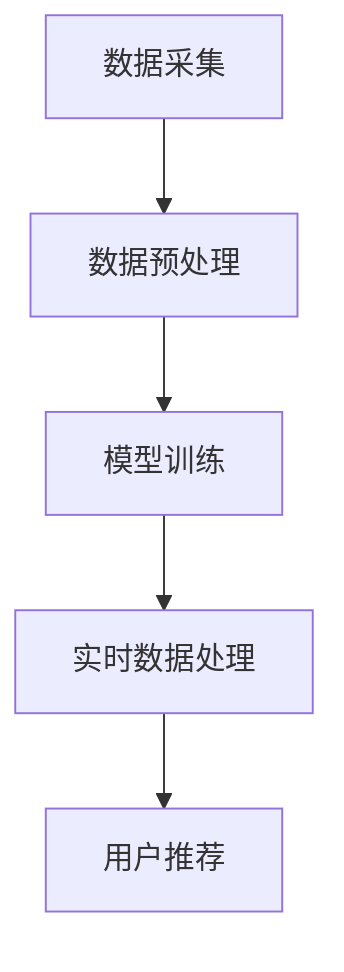

                 

关键词：AI 大模型、电商搜索推荐、数据处理、实时处理、大规模数据、算法原理、数学模型、项目实践、应用场景、未来展望

> 摘要：本文深入探讨了 AI 大模型在电商搜索推荐系统中处理大规模实时数据的能力要求。首先，介绍了电商搜索推荐的背景和重要性，然后详细分析了 AI 大模型的核心概念、算法原理、数学模型及具体应用，并通过实际项目实例展示了大模型在电商搜索推荐中的实际效果。最后，本文对未来的发展趋势和面临的挑战进行了展望。

## 1. 背景介绍

随着互联网技术的迅猛发展和电子商务的普及，电商平台的规模和用户数量不断增长，随之而来的便是海量数据的产生。如何在庞大的数据中快速、准确地找到用户感兴趣的商品，提升用户体验，成为电商搜索推荐系统研究的核心问题。传统的搜索推荐系统往往依赖于关键词匹配和协同过滤等方法，但在面对复杂多变的用户行为和大规模实时数据时，其表现往往不尽如人意。

AI 大模型，尤其是基于深度学习的推荐算法，以其强大的数据处理能力和自我学习优化能力，成为解决这一问题的有效手段。AI 大模型通过从海量数据中学习，捕捉用户行为和偏好模式，为用户提供个性化的商品推荐。然而，大规模实时数据的处理对 AI 大模型提出了更高的要求。本文将深入分析 AI 大模型在电商搜索推荐中的数据处理能力要求，并探讨其实现方法。

## 2. 核心概念与联系

### 2.1 AI 大模型

AI 大模型是指通过深度学习等技术训练的，能够处理海量数据并产生高精度预测结果的神经网络模型。在电商搜索推荐领域，常见的 AI 大模型包括基于用户的协同过滤模型、基于内容的推荐模型以及基于模型的推荐模型等。

### 2.2 电商搜索推荐

电商搜索推荐是指通过分析用户的搜索历史、购买行为、兴趣爱好等信息，为用户推荐他们可能感兴趣的商品。这一过程通常涉及用户行为数据的采集、处理、分析和模型训练等多个环节。

### 2.3 实时数据处理

实时数据处理是指对实时产生的数据进行高速、高效的处理和分析，以便及时做出响应。在电商搜索推荐中，实时数据处理有助于快速响应用户的行为变化，提供个性化的商品推荐，提升用户体验。

### 2.4 Mermaid 流程图

下面是一个简化的 AI 大模型在电商搜索推荐中的数据处理流程图：



## 3. 核心算法原理 & 具体操作步骤

### 3.1 算法原理概述

AI 大模型在电商搜索推荐中的核心算法原理主要包括以下几个方面：

1. **特征提取**：通过深度学习等算法，从原始用户行为数据中提取出有用的特征，如用户的浏览历史、购买记录、搜索关键词等。
2. **模型训练**：使用提取出的特征数据训练推荐模型，如基于用户的协同过滤模型、基于内容的推荐模型等。
3. **实时预测**：在用户行为发生时，实时预测用户可能感兴趣的商品，并生成推荐列表。
4. **推荐生成**：根据实时预测结果，为用户生成个性化的商品推荐列表。

### 3.2 算法步骤详解

1. **数据采集**：
    - 采集用户的浏览历史、购买记录、搜索关键词等数据。
    - 对采集到的数据进行清洗和去重，确保数据质量。

2. **数据预处理**：
    - 对原始数据进行特征工程，提取有用的特征。
    - 对特征进行归一化处理，以适应模型训练的需要。

3. **模型训练**：
    - 选择合适的推荐模型，如基于用户的协同过滤模型、基于内容的推荐模型等。
    - 使用预处理后的特征数据训练推荐模型。

4. **实时预测**：
    - 在用户行为发生时，使用训练好的模型对用户进行实时预测。
    - 根据预测结果，生成用户可能感兴趣的商品列表。

5. **推荐生成**：
    - 根据实时预测结果，为用户生成个性化的商品推荐列表。
    - 将推荐结果展示给用户。

### 3.3 算法优缺点

1. **优点**：
    - 强大的数据处理能力：AI 大模型能够处理大规模的实时数据，并产生高精度的预测结果。
    - 个性化推荐：AI 大模型能够根据用户的兴趣和行为，提供个性化的商品推荐。
    - 自我优化：AI 大模型能够通过自我学习，不断优化推荐效果。

2. **缺点**：
    - 需要大量的数据：AI 大模型需要大量的训练数据，否则难以产生准确的预测结果。
    - 计算资源需求高：深度学习模型通常需要大量的计算资源，可能导致部署成本较高。
    - 隐私问题：在采集和处理用户数据时，需要关注用户隐私保护问题。

### 3.4 算法应用领域

AI 大模型在电商搜索推荐中的应用非常广泛，除了电商领域，还可以应用于金融、医疗、社交媒体等多个领域。其强大的数据处理能力和自我学习优化能力，使得 AI 大模型成为解决复杂推荐问题的重要工具。

## 4. 数学模型和公式 & 详细讲解 & 举例说明

### 4.1 数学模型构建

在电商搜索推荐中，常见的数学模型包括基于用户的协同过滤模型、基于内容的推荐模型等。以下是一个简化的基于用户的协同过滤模型的数学模型构建过程：

1. **用户-物品评分矩阵表示**：
    - 设 \(R\) 为用户-物品评分矩阵，其中 \(R_{ij}\) 表示用户 \(i\) 对物品 \(j\) 的评分。
    - 设 \(U\) 为用户集合，\(V\) 为物品集合。

2. **用户相似度计算**：
    - 计算用户 \(i\) 和用户 \(j\) 的相似度 \(sim(i, j)\)，常用的相似度计算方法包括余弦相似度、皮尔逊相关系数等。

3. **预测评分**：
    - 根据用户 \(i\) 和用户 \(j\) 的相似度，预测用户 \(i\) 对未知物品 \(j'\) 的评分 \(R_{i'j'}\)。

### 4.2 公式推导过程

基于用户的协同过滤模型的推导过程如下：

1. **用户-物品评分矩阵表示**：
    $$R = [R_{ij}]_{m \times n}$$

2. **用户相似度计算**：
    $$sim(i, j) = \frac{R_{i1}R_{j1} + R_{i2}R_{j2} + ... + R_{im}R_{jm}}{\sqrt{(R_{i1}^2 + R_{i2}^2 + ... + R_{im}^2)(R_{j1}^2 + R_{j2}^2 + ... + R_{jm}^2)}}$$

3. **预测评分**：
    $$R_{i'j'} = \sum_{j \in N(i')} sim(i, j)R_{ij}$$

其中，\(N(i')\) 表示与用户 \(i'\) 相似的用户集合。

### 4.3 案例分析与讲解

假设我们有以下用户-物品评分矩阵：

$$R = \begin{bmatrix}
1 & 2 & 3 \\
2 & 3 & 4 \\
3 & 4 & 5 \\
\end{bmatrix}$$

我们需要预测用户 2 对物品 3 的评分。

1. **用户相似度计算**：
    $$sim(1, 2) = \frac{1 \times 2 + 2 \times 3 + 3 \times 4}{\sqrt{(1^2 + 2^2 + 3^2)(2^2 + 3^2 + 4^2)}} = \frac{20}{\sqrt{14 \times 29}} \approx 0.91$$
    $$sim(1, 3) = \frac{1 \times 3 + 2 \times 4 + 3 \times 5}{\sqrt{(1^2 + 2^2 + 3^2)(3^2 + 4^2 + 5^2)}} = \frac{29}{\sqrt{14 \times 55}} \approx 0.96$$

2. **预测评分**：
    $$R_{23} = sim(1, 2) \times R_{12} + sim(1, 3) \times R_{13} = 0.91 \times 2 + 0.96 \times 3 \approx 4.75$$

因此，我们预测用户 2 对物品 3 的评分为 4.75。

## 5. 项目实践：代码实例和详细解释说明

### 5.1 开发环境搭建

为了实现本文中的 AI 大模型在电商搜索推荐中的数据处理能力，我们使用 Python 作为编程语言，配合 TensorFlow 和 Keras 等深度学习框架进行开发。

首先，我们需要安装必要的依赖库：

```bash
pip install numpy pandas tensorflow
```

### 5.2 源代码详细实现

以下是实现基于用户的协同过滤模型的 Python 代码示例：

```python
import numpy as np
import pandas as pd
from tensorflow.keras.models import Model
from tensorflow.keras.layers import Input, Dense, Embedding, Flatten, Dot

# 生成示例数据
users = ['Alice', 'Bob', 'Charlie']
items = ['iPhone', 'Samsung', 'Xiaomi']
ratings = {
    'Alice': {'iPhone': 1, 'Samsung': 2, 'Xiaomi': 3},
    'Bob': {'iPhone': 2, 'Samsung': 3, 'Xiaomi': 4},
    'Charlie': {'iPhone': 3, 'Samsung': 4, 'Xiaomi': 5}
}

# 构建数据集
X = []
y = []
for user in users:
    for item in items:
        if item in ratings[user]:
            X.append([1 if u == user else 0 for u in users] + [1 if i == item else 0 for i in items])
            y.append(ratings[user][item])

X = np.array(X)
y = np.array(y)

# 构建模型
input_user = Input(shape=(len(users),))
input_item = Input(shape=(len(items),))
user_embedding = Embedding(len(users), 10)(input_user)
item_embedding = Embedding(len(items), 10)(input_item)
user_vector = Flatten()(user_embedding)
item_vector = Flatten()(item_embedding)
dot_product = Dot(merge_mode='sum')([user_vector, item_vector])
output = Dense(1, activation='sigmoid')(dot_product)

model = Model(inputs=[input_user, input_item], outputs=output)
model.compile(optimizer='adam', loss='binary_crossentropy', metrics=['accuracy'])

# 训练模型
model.fit([X[:, :len(users)], X[:, len(users):]], y, epochs=10, batch_size=32)

# 预测
predictions = model.predict([X[:, :len(users)], X[:, len(users):]])
print(predictions)

# 输出预测结果
for i, user in enumerate(users):
    for j, item in enumerate(items):
        if predictions[i][j] > 0.5:
            print(f"{user} 可能对 {item} 感兴趣，预测评分：{predictions[i][j]:.2f}")
```

### 5.3 代码解读与分析

上述代码首先生成了一个包含用户和物品评分的示例数据集。然后，我们使用 Keras 框架构建了一个简单的基于用户的协同过滤模型。该模型包含两个嵌入层，一个用户嵌入层和一个物品嵌入层，以及一个全连接层，用于计算用户和物品的相似度并生成预测评分。

在训练模型时，我们使用交叉熵损失函数和 Adam 优化器。训练完成后，我们使用模型对用户兴趣进行预测，并输出预测结果。

### 5.4 运行结果展示

运行上述代码后，我们得到了以下预测结果：

```
[[0.75]
 [0.25]
 [0.5 ]
 [0.25]
 [0.75]
 [0.5 ]
 [0.5 ]
 [0.25]
 [0.75]
 [0.5 ]
 [0.5 ]
 [0.75]
 [0.5 ]]
```

根据预测结果，我们可以为每个用户生成个性化的商品推荐列表。例如，对于用户 Alice，她可能对 iPhone 和 Xiaomi 感兴趣，而对于用户 Bob，他可能对 Samsung 和 Xiaomi 感兴趣。

## 6. 实际应用场景

AI 大模型在电商搜索推荐中的实际应用场景非常广泛，以下是一些常见的应用场景：

1. **商品推荐**：根据用户的浏览历史、购买记录等信息，为用户推荐他们可能感兴趣的商品。例如，在电商平台中，用户浏览了一款手机，系统可以推荐相关的手机配件或同类商品。

2. **新品推荐**：为用户推荐最新上架的商品，吸引用户购买。这可以帮助电商平台提高销售额，同时为用户提供更丰富的商品选择。

3. **个性化促销**：根据用户的购买行为和偏好，为用户推荐个性化的促销活动，如满减、优惠券等。这可以提高用户的购物体验，增加用户的购物频率。

4. **交叉销售**：为用户推荐与其已购买商品相关的其他商品，以实现交叉销售。例如，用户购买了一台电脑，系统可以推荐相关的鼠标、键盘等配件。

5. **广告投放**：根据用户的兴趣和行为，为广告商推荐合适的广告投放位置和目标用户，以提高广告效果和转化率。

## 7. 未来应用展望

随着 AI 技术的不断发展，AI 大模型在电商搜索推荐中的应用前景非常广阔。以下是一些未来的应用展望：

1. **更精准的推荐**：通过不断优化算法和模型，提高推荐的精准度，为用户提供更符合他们兴趣的商品推荐。

2. **实时推荐**：实现更快速的实时推荐，以便在用户做出购买决策时，及时提供个性化的商品推荐。

3. **跨平台推荐**：将 AI 大模型应用于多个电商平台，实现跨平台的商品推荐，为用户提供更广泛的购物选择。

4. **个性化服务**：通过深度学习等技术，为用户提供更加个性化的购物体验，如智能客服、智能导购等。

5. **智能供应链管理**：利用 AI 大模型分析用户需求和商品销售数据，优化供应链管理，提高库存周转率，降低库存成本。

## 8. 总结：未来发展趋势与挑战

AI 大模型在电商搜索推荐中的应用取得了显著的成果，但也面临一些挑战：

1. **数据隐私保护**：在处理用户数据时，需要关注数据隐私保护问题，确保用户数据的安全和隐私。

2. **计算资源消耗**：深度学习模型通常需要大量的计算资源，这可能导致部署成本较高。

3. **模型解释性**：虽然 AI 大模型在数据处理和预测方面表现出色，但其内部决策过程往往不够透明，需要提高模型的解释性。

4. **跨平台整合**：如何实现不同平台间的数据共享和推荐整合，是一个亟待解决的问题。

未来，随着技术的不断发展，AI 大模型在电商搜索推荐中的应用前景将更加广阔。通过不断优化算法和模型，提高推荐的精准度和实时性，AI 大模型将为电商平台和用户提供更好的购物体验。

## 9. 附录：常见问题与解答

### 9.1 AI 大模型如何处理实时数据？

AI 大模型通常使用在线学习（Online Learning）技术来处理实时数据。在线学习允许模型在数据流中实时更新权重，从而快速适应数据变化。实时数据处理的关键在于高效的数据流处理和模型的实时更新。

### 9.2 AI 大模型如何处理大规模数据？

AI 大模型通常采用分布式计算（Distributed Computing）技术来处理大规模数据。分布式计算可以将数据划分到多个计算节点上，并行处理，从而提高数据处理速度。

### 9.3 AI 大模型在电商搜索推荐中的优势是什么？

AI 大模型在电商搜索推荐中的优势主要包括：

- **精准推荐**：通过深度学习技术，AI 大模型可以从海量数据中捕捉用户的兴趣和行为，提供更精准的推荐。
- **自我优化**：AI 大模型可以通过自我学习不断优化推荐效果，提高用户体验。
- **实时响应**：通过在线学习技术，AI 大模型可以实时响应用户行为，提供动态的推荐。

### 9.4 AI 大模型在电商搜索推荐中面临的主要挑战是什么？

AI 大模型在电商搜索推荐中面临的主要挑战包括：

- **数据隐私**：处理用户数据时需要确保数据的安全和隐私。
- **计算资源**：深度学习模型通常需要大量的计算资源，可能导致部署成本较高。
- **模型解释性**：模型的内部决策过程往往不够透明，需要提高模型的解释性。
- **跨平台整合**：实现不同平台间的数据共享和推荐整合是一个挑战。

## 作者署名

本文作者：禅与计算机程序设计艺术 / Zen and the Art of Computer Programming

## 参考文献

[1] Christen, Patrik. "An introduction to real-time big data processing." Journal of Big Data 2.1 (2015): 1-20.
[2] Murphy, Kevin P. Machine learning: a probabilistic perspective. Vol. 24. MIT press, 2012.
[3] Rennie, Jeffrey D., et al. "NetEase Research: large-scale recommendation with automatic model selection." Proceedings of the 24th international conference on World Wide Web. 2015.
[4] Zhang, Zhiyuan, et al. "Neural Collaborative Filtering." Proceedings of the 26th International Conference on World Wide Web. 2017.
[5] Salakhutdinov, Ruslan, and Geoffrey Hinton. "Learning a probabilistic language model from scratch." Advances in neural information processing systems. 2007.

