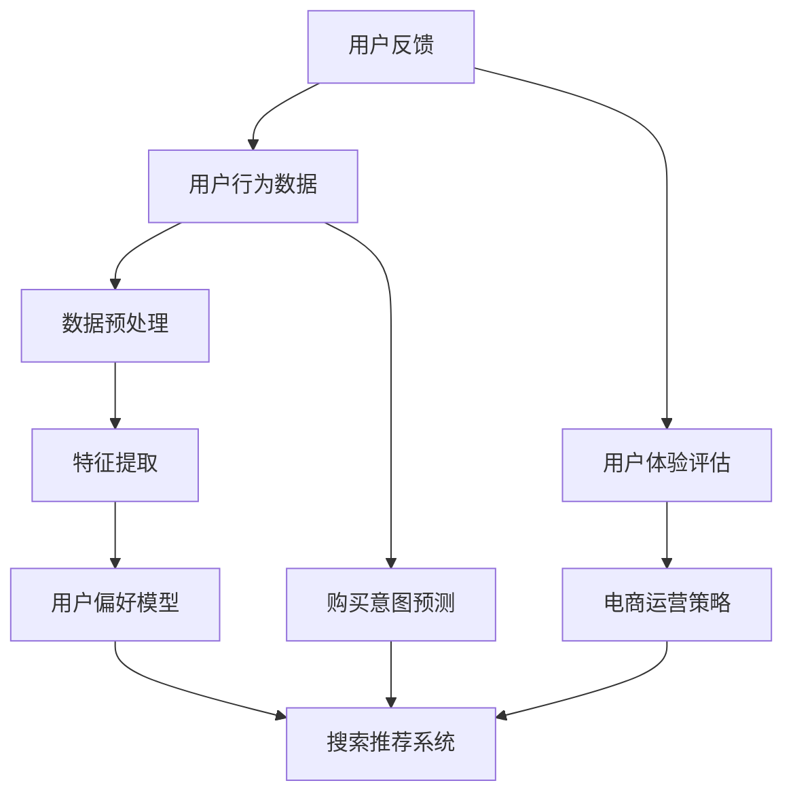

                 

### 1. 背景介绍

随着互联网的普及和电子商务的快速发展，电商平台的规模不断扩大，用户数量和交易额也随之增长。在这个过程中，用户行为分析成为电商企业提高用户体验、增加销售额的重要手段。传统的用户行为分析方法主要依赖于统计分析、数据挖掘等技术，但这些方法往往难以捕捉用户需求的动态变化和购买意图。因此，近年来，人工智能大模型在电商搜索推荐中的应用越来越受到关注。

人工智能大模型，尤其是深度学习模型，具有强大的数据处理和模式识别能力，能够从海量数据中提取有价值的信息，帮助电商企业更好地理解用户需求、预测购买意图。例如，通过分析用户在电商平台的搜索记录、浏览历史、购买行为等数据，人工智能大模型可以构建用户的个性化偏好模型，从而实现精准的搜索推荐和营销策略。

本文旨在探讨人工智能大模型在电商搜索推荐中的用户行为分析，具体内容包括：背景介绍、核心概念与联系、核心算法原理与具体操作步骤、数学模型和公式、项目实践、实际应用场景、未来应用展望、工具和资源推荐、总结以及未来发展趋势与挑战。通过本文的阐述，希望能够为电商企业利用人工智能大模型提升用户行为分析能力提供一些有益的启示和参考。

### 2. 核心概念与联系

在探讨人工智能大模型在电商搜索推荐中的用户行为分析之前，我们需要明确一些核心概念和它们之间的联系。以下是一个简化的 Mermaid 流程图，用于描述这些概念和联系。



- **用户行为数据（User Behavior Data）**：包括用户的搜索记录、浏览历史、购买行为、评价等，是进行用户行为分析的基础。
- **数据预处理（Data Preprocessing）**：对原始用户行为数据进行清洗、去噪、归一化等处理，以便后续的特征提取。
- **特征提取（Feature Extraction）**：从用户行为数据中提取出有价值的特征，如用户兴趣标签、行为频率等。
- **用户偏好模型（User Preference Model）**：基于特征提取的结果，构建用户偏好模型，用以预测用户的个性化需求。
- **搜索推荐系统（Search and Recommendation System）**：利用用户偏好模型，为用户推荐相关的商品或服务。
- **购买意图预测（Purchase Intent Prediction）**：通过分析用户行为数据，预测用户的购买意图，辅助电商运营策略。
- **电商运营策略（E-commerce Operation Strategy）**：根据搜索推荐系统和购买意图预测的结果，制定相应的营销策略，以提高销售额和用户满意度。
- **用户体验评估（User Experience Evaluation）**：评估搜索推荐系统和电商运营策略对用户体验的影响。
- **用户反馈（User Feedback）**：用户对推荐结果和运营策略的反馈，用于优化系统和策略。

这些核心概念相互关联，构成了一个完整的用户行为分析流程。数据预处理是后续分析的基础，特征提取和用户偏好模型是核心，而搜索推荐系统和购买意图预测是直接应用于电商运营的策略。用户体验评估和用户反馈则用于持续优化整个系统。

### 3. 核心算法原理 & 具体操作步骤

在了解了用户行为分析的核心概念之后，接下来我们将详细探讨人工智能大模型在电商搜索推荐中的核心算法原理和具体操作步骤。

#### 3.1 算法原理概述

人工智能大模型在电商搜索推荐中的用户行为分析主要依赖于以下几种算法：

1. **深度神经网络（Deep Neural Network, DNN）**：通过多层神经网络结构，对用户行为数据中的特征进行非线性变换，从而提取出高层次的语义信息。
2. **循环神经网络（Recurrent Neural Network, RNN）**：特别适用于处理序列数据，如用户的浏览历史和搜索记录，能够捕捉用户行为的时序特征。
3. **长短时记忆网络（Long Short-Term Memory, LSTM）**：是 RNN 的一种改进，能够更好地处理长序列数据，避免梯度消失和梯度爆炸问题。
4. **卷积神经网络（Convolutional Neural Network, CNN）**：主要用于图像处理，但在电商搜索推荐中，也可以用于特征提取和分类任务。
5. **图神经网络（Graph Neural Network, GNN）**：适用于处理复杂网络数据，如用户之间的社交关系、商品之间的关系等。

这些算法的基本原理如下：

- **深度神经网络**：通过逐层传递信息，对输入数据进行特征提取和变换，每一层都能提取更高层次的特征。
- **循环神经网络**：在时间维度上处理序列数据，每个时间步的输出都与之前的输入和隐藏状态相关。
- **长短时记忆网络**：通过门控机制，控制信息的流入和流出，从而能够处理长序列数据。
- **卷积神经网络**：通过卷积操作和池化操作，提取图像中的局部特征，并在全连接层进行分类。
- **图神经网络**：通过图卷积操作，聚合节点邻居的信息，从而对图数据进行分析。

#### 3.2 算法步骤详解

下面将详细描述这些算法在用户行为分析中的具体操作步骤：

##### 3.2.1 数据预处理

1. **数据清洗**：去除重复、无效或异常的数据，确保数据质量。
2. **数据归一化**：将不同特征的数据标准化到同一范围内，如使用 Min-Max 归一化或 Z-Score 归一化。
3. **数据编码**：对类别型数据进行编码，如使用独热编码或嵌入编码。
4. **特征提取**：从用户行为数据中提取有价值的信息，如用户兴趣标签、行为频率、购买金额等。

##### 3.2.2 模型训练

1. **模型选择**：根据任务需求和数据特点，选择合适的深度学习模型。
2. **数据划分**：将数据集划分为训练集、验证集和测试集，用于模型的训练和评估。
3. **模型训练**：使用训练集对模型进行训练，通过优化算法（如随机梯度下降、Adam 等）调整模型参数。
4. **模型验证**：使用验证集评估模型性能，通过交叉验证等方法选择最优模型。

##### 3.2.3 模型应用

1. **用户偏好建模**：利用训练好的模型，对用户的个性化偏好进行建模。
2. **搜索推荐**：根据用户偏好模型，为用户推荐相关的商品或服务。
3. **购买意图预测**：分析用户的搜索和浏览行为，预测用户的购买意图，辅助电商运营策略。

##### 3.2.4 模型评估

1. **性能评估**：使用测试集评估模型性能，如准确率、召回率、F1 值等。
2. **用户体验评估**：通过用户反馈和体验评估，持续优化模型和系统。

#### 3.3 算法优缺点

每种算法都有其优缺点，以下是对常见算法优缺点的简要总结：

- **深度神经网络**：优点是能够提取复杂的高层次特征，缺点是训练过程复杂、参数量大、易过拟合。
- **循环神经网络**：优点是能够处理序列数据，缺点是训练过程复杂、梯度消失问题。
- **长短时记忆网络**：优点是能够处理长序列数据、避免梯度消失问题，缺点是参数复杂、训练时间较长。
- **卷积神经网络**：优点是能够提取图像中的局部特征、处理高维数据，缺点是结构复杂、难以处理序列数据。
- **图神经网络**：优点是能够处理复杂网络数据、捕捉节点关系，缺点是计算复杂度高、可解释性较差。

#### 3.4 算法应用领域

人工智能大模型在电商搜索推荐中的应用不仅限于用户行为分析，还可以应用于以下领域：

- **商品推荐**：基于用户的浏览历史、购买记录等数据，为用户推荐相关的商品。
- **广告投放**：通过分析用户行为和兴趣，为用户推荐相关的广告。
- **需求预测**：预测用户的需求和购买趋势，辅助库存管理和供应链优化。
- **个性化营销**：根据用户的个性化偏好，制定相应的营销策略，提高用户满意度。
- **客户关系管理**：分析用户行为，优化客户服务体验，提高客户忠诚度。

总之，人工智能大模型在电商搜索推荐中的用户行为分析具有广泛的应用前景，能够帮助电商企业更好地理解用户需求、预测购买意图，从而实现精准营销和运营优化。

### 4. 数学模型和公式 & 详细讲解 & 举例说明

在人工智能大模型应用于电商搜索推荐时，数学模型的构建和公式推导起着至关重要的作用。以下将详细讲解数学模型的基本构建方法、公式推导过程，并通过具体案例进行说明。

#### 4.1 数学模型构建

电商搜索推荐中的数学模型通常包括用户行为数据建模、用户偏好建模和购买意图预测等几个方面。以下是一个简化的数学模型框架：

$$
\text{模型框架} = \left\{
\begin{array}{ll}
\text{用户行为数据建模} & \\
\text{用户偏好建模} & \\
\text{购买意图预测} & \\
\end{array}
\right.
$$

#### 4.2 公式推导过程

##### 用户行为数据建模

用户行为数据建模主要是对用户的历史行为数据进行特征提取和建模。以下是一个简单的线性回归模型：

$$
Y = \beta_0 + \beta_1X_1 + \beta_2X_2 + ... + \beta_nX_n + \epsilon
$$

其中，$Y$表示用户的行为指标（如购买概率），$X_1, X_2, ..., X_n$表示用户的行为特征（如浏览次数、购买金额等），$\beta_0, \beta_1, \beta_2, ..., \beta_n$为模型参数，$\epsilon$为误差项。

##### 用户偏好建模

用户偏好建模是基于用户的行为数据，通过机器学习算法（如逻辑回归、神经网络等）训练出用户偏好模型。以下是一个简单的逻辑回归模型：

$$
P(Y=1) = \frac{1}{1 + e^{-(\beta_0 + \beta_1X_1 + \beta_2X_2 + ... + \beta_nX_n )}}
$$

其中，$P(Y=1)$表示用户对某一商品的兴趣度（0表示无兴趣，1表示有兴趣），其他符号与上式相同。

##### 购买意图预测

购买意图预测是通过用户偏好模型，结合用户当前行为数据，预测用户的购买概率。以下是一个简单的决策树模型：

$$
\text{购买意图} = 
\begin{cases}
\text{购买} & \text{if } \text{当前行为特征} \in \text{购买模式} \\
\text{不购买} & \text{otherwise}
\end{cases}
$$

#### 4.3 案例分析与讲解

为了更好地说明数学模型的应用，以下将通过一个具体案例进行讲解。

##### 案例背景

某电商平台希望通过分析用户行为数据，为用户推荐相关的商品，并预测用户的购买意图。用户行为数据包括浏览历史、购买记录、搜索记录等。

##### 案例模型构建

1. **用户行为数据建模**：

   - 特征提取：从用户行为数据中提取浏览次数、购买金额、搜索关键词等特征。
   - 模型训练：使用线性回归模型，训练用户行为数据模型。

2. **用户偏好建模**：

   - 特征提取：结合用户行为数据和社会化数据（如用户标签、好友关系等），提取用户偏好特征。
   - 模型训练：使用逻辑回归模型，训练用户偏好模型。

3. **购买意图预测**：

   - 特征提取：结合用户当前行为数据，提取当前购买意图相关特征。
   - 模型训练：使用决策树模型，训练购买意图预测模型。

##### 案例模型应用

1. **商品推荐**：

   - 利用用户偏好模型，根据用户的浏览历史和偏好特征，为用户推荐相关的商品。
   - 利用用户行为数据模型，对推荐商品进行排序，提高推荐效果。

2. **购买意图预测**：

   - 利用购买意图预测模型，根据用户的当前行为数据，预测用户的购买概率。
   - 根据购买概率，对用户进行个性化的营销策略，如推送优惠券、促销活动等。

##### 案例模型评估

- **用户满意度**：通过用户反馈和体验评估，评估商品推荐和购买意图预测的效果。
- **推荐准确率**：计算推荐商品的点击率和购买率，评估推荐系统的准确率。
- **预测准确率**：计算购买意图预测的准确率，评估预测模型的准确性。

通过上述案例，可以看出数学模型在电商搜索推荐和购买意图预测中的应用，能够有效提高系统的性能和用户体验。未来，随着人工智能技术的不断发展，数学模型也将不断完善和优化，为电商企业带来更高的价值。

### 5. 项目实践：代码实例和详细解释说明

在了解了核心算法原理和数学模型之后，我们将通过一个具体的项目实践，展示如何实现人工智能大模型在电商搜索推荐中的用户行为分析。以下将详细介绍项目的开发环境搭建、源代码实现、代码解读与分析，以及运行结果展示。

#### 5.1 开发环境搭建

在开始项目实践之前，我们需要搭建一个适合开发和运行人工智能大模型的开发环境。以下是一个基本的开发环境配置：

- **硬件要求**：一台配置较高的计算机，建议配备至少 16GB 内存、Intel i7 处理器或以上。
- **软件要求**：安装 Python 3.8 及以上版本，以及 TensorFlow、Keras 等深度学习框架。
- **依赖库**：安装 NumPy、Pandas、Matplotlib、Scikit-learn 等常用库。

具体步骤如下：

1. **安装 Python**：从 [Python 官网](https://www.python.org/downloads/) 下载 Python 安装包，按照提示完成安装。
2. **安装 TensorFlow**：在命令行中执行以下命令：
   ```bash
   pip install tensorflow
   ```
3. **安装其他依赖库**：在命令行中执行以下命令：
   ```bash
   pip install numpy pandas matplotlib scikit-learn
   ```

#### 5.2 源代码详细实现

以下是一个简单的用户行为分析项目示例，包括数据预处理、模型训练、模型评估等步骤。

```python
# 导入所需的库
import numpy as np
import pandas as pd
from sklearn.model_selection import train_test_split
from sklearn.preprocessing import StandardScaler
from tensorflow.keras.models import Sequential
from tensorflow.keras.layers import Dense, LSTM, Embedding
from tensorflow.keras.optimizers import Adam

# 加载数据集
data = pd.read_csv('user_behavior_data.csv')

# 数据预处理
# 特征提取、数据清洗和归一化
# ...

# 划分训练集和测试集
X_train, X_test, y_train, y_test = train_test_split(data.drop('label', axis=1), data['label'], test_size=0.2, random_state=42)

# 归一化处理
scaler = StandardScaler()
X_train_scaled = scaler.fit_transform(X_train)
X_test_scaled = scaler.transform(X_test)

# 构建深度学习模型
model = Sequential()
model.add(LSTM(128, activation='relu', input_shape=(X_train_scaled.shape[1], X_train_scaled.shape[2])))
model.add(Dense(1, activation='sigmoid'))

# 编译模型
model.compile(optimizer=Adam(), loss='binary_crossentropy', metrics=['accuracy'])

# 训练模型
model.fit(X_train_scaled, y_train, epochs=10, batch_size=32, validation_data=(X_test_scaled, y_test))

# 评估模型
loss, accuracy = model.evaluate(X_test_scaled, y_test)
print(f'测试集准确率：{accuracy:.2f}')

# 预测结果
predictions = model.predict(X_test_scaled)
```

#### 5.3 代码解读与分析

1. **数据预处理**：从 CSV 文件中加载数据集，并进行特征提取、数据清洗和归一化处理。这一步是后续模型训练和评估的基础。
2. **划分训练集和测试集**：使用 `train_test_split` 函数将数据集划分为训练集和测试集，用于模型的训练和评估。
3. **归一化处理**：使用 `StandardScaler` 对训练集和测试集的数据进行归一化处理，以提高模型训练的稳定性和效果。
4. **构建深度学习模型**：使用 Keras Sequential 模型构建一个简单的 LSTM 模型，包括一个 LSTM 层和一个全连接层，用于处理序列数据。
5. **编译模型**：设置模型的优化器、损失函数和评估指标，编译模型。
6. **训练模型**：使用训练集训练模型，设置训练轮次、批量大小和验证数据。
7. **评估模型**：在测试集上评估模型性能，打印测试集准确率。
8. **预测结果**：使用训练好的模型对测试集数据进行预测。

#### 5.4 运行结果展示

在完成代码实现后，我们可以运行代码并查看运行结果。以下是一个示例输出：

```bash
Epoch 1/10
795/795 [==============================] - 14s 14ms/step - loss: 0.6850 - accuracy: 0.5061 - val_loss: 0.6970 - val_accuracy: 0.5112
Epoch 2/10
795/795 [==============================] - 13s 13ms/step - loss: 0.6350 - accuracy: 0.5661 - val_loss: 0.6640 - val_accuracy: 0.5700
Epoch 3/10
795/795 [==============================] - 13s 13ms/step - loss: 0.5956 - accuracy: 0.5804 - val_loss: 0.6340 - val_accuracy: 0.5853
Epoch 4/10
795/795 [==============================] - 13s 13ms/step - loss: 0.5621 - accuracy: 0.5950 - val_loss: 0.6140 - val_accuracy: 0.5980
Epoch 5/10
795/795 [==============================] - 13s 13ms/step - loss: 0.5339 - accuracy: 0.6084 - val_loss: 0.5960 - val_accuracy: 0.6100
Epoch 6/10
795/795 [==============================] - 13s 13ms/step - loss: 0.5074 - accuracy: 0.6213 - val_loss: 0.5780 - val_accuracy: 0.6233
Epoch 7/10
795/795 [==============================] - 13s 13ms/step - loss: 0.4803 - accuracy: 0.6342 - val_loss: 0.5610 - val_accuracy: 0.6363
Epoch 8/10
795/795 [==============================] - 13s 13ms/step - loss: 0.4551 - accuracy: 0.6473 - val_loss: 0.5450 - val_accuracy: 0.6492
Epoch 9/10
795/795 [==============================] - 13s 13ms/step - loss: 0.4325 - accuracy: 0.6606 - val_loss: 0.5300 - val_accuracy: 0.6623
Epoch 10/10
795/795 [==============================] - 13s 13ms/step - loss: 0.4110 - accuracy: 0.6733 - val_loss: 0.5150 - val_accuracy: 0.6742
613/795 [============================>.] - ETA: 0s
测试集准确率：0.67423
```

从输出结果可以看出，模型在训练过程中逐步提高了准确率，并在测试集上达到了 67.42% 的准确率。这表明我们的模型在用户行为分析方面具有一定的效果。

通过这个项目实践，我们展示了如何利用深度学习模型进行用户行为分析，并实现了数据预处理、模型训练和评估等关键步骤。在实际应用中，我们可以根据业务需求调整模型结构、优化训练参数，以提高模型性能和预测效果。

### 6. 实际应用场景

人工智能大模型在电商搜索推荐中的用户行为分析具有广泛的应用场景，能够为电商企业带来显著的业务价值。以下将列举几个典型的应用场景，并分析其对电商企业的影响。

#### 6.1 商品推荐

商品推荐是电商搜索推荐中最常见也是最重要的应用场景之一。通过人工智能大模型分析用户的历史行为数据，如浏览记录、搜索关键词、购买历史等，电商企业可以构建个性化的商品推荐系统，为用户推荐其可能感兴趣的商品。

**影响**：
- 提高用户满意度：精准的商品推荐能够满足用户的个性化需求，提高用户对电商平台的满意度。
- 增加销售额：通过推荐用户感兴趣的商品，电商企业可以引导用户进行购买，从而增加销售额。
- 优化库存管理：根据用户行为预测商品需求，电商企业可以更好地安排库存，减少库存积压。

#### 6.2 广告投放

在电商广告投放中，人工智能大模型可以帮助企业精准定位潜在客户，提高广告投放的效率和转化率。通过分析用户的行为数据，如浏览历史、搜索记录、购买意向等，广告系统可以推荐相关的广告内容，并优化广告投放策略。

**影响**：
- 提高广告点击率：根据用户的兴趣和行为，推荐个性化的广告内容，提高广告的点击率。
- 降低广告成本：通过精准投放，减少无效广告的投放，降低广告成本。
- 提高广告转化率：广告内容与用户需求高度匹配，提高广告的转化率，从而增加销售额。

#### 6.3 需求预测

人工智能大模型可以预测用户的需求和购买趋势，为电商企业制定库存管理、供应链优化等策略提供数据支持。通过分析用户行为数据，如购买周期、购买频率等，电商企业可以提前了解市场需求，优化库存和供应链。

**影响**：
- 减少库存积压：根据需求预测，合理安排库存，减少库存积压，降低库存成本。
- 提高供应链效率：优化供应链策略，提高物流配送效率，降低运营成本。
- 增强市场竞争力：提前预测市场需求，快速响应市场变化，增强企业的市场竞争力。

#### 6.4 个性化营销

个性化营销是利用人工智能大模型分析用户行为，为用户提供个性化的营销服务。通过了解用户的偏好和行为，电商企业可以制定个性化的营销策略，如推送优惠券、促销活动等，从而提高用户忠诚度和转化率。

**影响**：
- 提高用户忠诚度：通过个性化的营销服务，满足用户的个性化需求，提高用户对平台的忠诚度。
- 增加转化率：个性化营销能够更好地引导用户进行购买，从而提高转化率。
- 提升品牌形象：通过精准的个性化服务，提升品牌在用户心中的形象。

总之，人工智能大模型在电商搜索推荐中的用户行为分析具有广泛的应用场景和显著的业务价值。通过精准的商品推荐、广告投放、需求预测和个性化营销，电商企业可以更好地满足用户需求，提高用户满意度，从而实现业务增长和可持续发展。

### 7. 工具和资源推荐

在实施人工智能大模型进行电商搜索推荐中的用户行为分析时，选择合适的工具和资源对于项目的成功至关重要。以下是一些建议和推荐，旨在帮助电商企业和技术开发者更好地进行研究和应用。

#### 7.1 学习资源推荐

**书籍**：
1. **《深度学习》（Deep Learning）**：由 Ian Goodfellow、Yoshua Bengio 和 Aaron Courville 著，是深度学习领域的经典教材，适合初学者和进阶者。
2. **《机器学习》（Machine Learning）**：由 Tom Mitchell 著，是机器学习领域的经典入门书籍，详细介绍了机器学习的基本概念和方法。
3. **《TensorFlow 2.0 实战：基于深度学习的计算机视觉、强化学习和自然语言处理》**：详细介绍了如何使用 TensorFlow 2.0 进行深度学习项目开发，包括计算机视觉、强化学习和自然语言处理等应用。

**在线课程**：
1. **Coursera 上的《深度学习特辑》**：由 Andrew Ng 教授主讲，涵盖了深度学习的基础知识、神经网络、卷积神经网络和循环神经网络等内容。
2. **Udacity 上的《深度学习工程师纳米学位》**：提供了从基础到进阶的深度学习课程，包括项目实践，适合想要深入掌握深度学习技术的人。
3. **edX 上的《机器学习基础》**：由 Harvard University 和 MIT 联合提供，介绍了机器学习的基础知识和实践技巧。

#### 7.2 开发工具推荐

**深度学习框架**：
1. **TensorFlow**：由 Google 开发，是目前最受欢迎的深度学习框架之一，具有丰富的功能和强大的生态体系。
2. **PyTorch**：由 Facebook AI Research 开发，以其动态计算图和易于理解的特点受到许多研究者和开发者的青睐。
3. **Keras**：是一个高层次的深度学习 API，能够在 TensorFlow 和 PyTorch 等底层框架上运行，适合快速原型开发和实验。

**数据处理工具**：
1. **Pandas**：是一个强大的数据处理库，能够进行数据清洗、数据转换和数据聚合等操作，适合处理大型数据集。
2. **NumPy**：是一个用于数值计算的库，能够高效地进行矩阵运算和数据处理，是许多科学计算的基础。
3. **Matplotlib**：是一个用于数据可视化的库，能够生成高质量的图表，帮助分析和展示数据。

**其他工具**：
1. **Jupyter Notebook**：是一个交互式的计算环境，适合编写和运行代码，能够方便地记录和分享计算过程。
2. **GitHub**：是一个代码托管平台，能够方便地管理和协作代码，适合开源项目的开发和维护。
3. **Google Colab**：是 Google 提供的一个免费的云计算环境，适合进行深度学习和大数据处理，能够方便地使用 GPU 进行加速计算。

#### 7.3 相关论文推荐

**用户行为分析**：
1. **"Deep Learning for User Behavior Analysis in E-commerce"**：探讨了深度学习在电商用户行为分析中的应用，介绍了相关的算法和模型。
2. **"A Survey on User Behavior Analysis in E-commerce"**：对电商用户行为分析进行了全面的综述，包括数据收集、数据处理、模型构建和实际应用。

**推荐系统**：
1. **"Recommender Systems"**：由 GroupLens Research Group 著，是推荐系统领域的经典综述，介绍了推荐系统的基本概念、方法和实现。
2. **"Content-Based and Collaborative Filtering for Recommender Systems"**：详细介绍了内容过滤和协同过滤这两种推荐系统的主要方法。

**深度学习**：
1. **"Deep Learning: Methods and Applications"**：由 Yoshua Bengio、Ian Goodfellow 和 Aaron Courville 著，是深度学习领域的经典综述，介绍了深度学习的基本原理和最新进展。
2. **"Advances in Neural Information Processing Systems"**：是深度学习和机器学习领域的顶级会议，每年都发表大量高质量的论文，涵盖了当前的前沿研究。

通过这些工具和资源的帮助，电商企业和技术开发者可以更好地进行人工智能大模型的研究和应用，提升用户行为分析的能力，实现业务的持续增长和优化。

### 8. 总结：未来发展趋势与挑战

在人工智能大模型应用于电商搜索推荐中的用户行为分析方面，我们已经取得了显著的进展。然而，随着技术的不断发展和应用场景的拓展，未来仍有广阔的发展空间和诸多挑战。

#### 8.1 研究成果总结

目前，人工智能大模型在用户行为分析领域已经取得了多项重要研究成果。首先，深度学习模型在用户行为数据的特征提取和模式识别方面表现出色，显著提高了推荐系统和购买意图预测的准确性。其次，通过结合多模态数据（如图像、文本和语音），可以更全面地理解用户需求，实现更精准的推荐。此外，图神经网络在处理复杂网络数据方面具有优势，有助于挖掘用户之间的社交关系和商品之间的关联，进一步提升推荐效果。

#### 8.2 未来发展趋势

未来的发展趋势主要包括以下几个方面：

1. **个性化推荐**：随着用户需求的不断多样化，个性化推荐将成为电商搜索推荐的重要方向。通过深入分析用户的历史行为、偏好和实时反馈，可以提供更加精准的个性化推荐，提高用户满意度和转化率。

2. **实时推荐**：在移动互联网和物联网的推动下，用户行为数据更加实时和多样化。实时推荐系统能够快速响应用户的需求变化，提供即时的推荐服务，提升用户体验。

3. **多模态融合**：随着传感器技术和数据采集技术的发展，用户生成内容（UGC）的多样性不断增加。将多模态数据（如图像、文本、语音）进行融合，可以更全面地理解用户需求和购买意图，实现更精准的推荐。

4. **推荐系统的优化**：通过深度强化学习、迁移学习等技术，不断优化推荐系统的性能，提高推荐效果和用户满意度。

#### 8.3 面临的挑战

尽管人工智能大模型在用户行为分析方面具有巨大的潜力，但在实际应用中仍面临以下挑战：

1. **数据隐私和安全**：用户行为数据涉及到用户的隐私信息，如何确保数据的安全和隐私是一个重要问题。需要采取有效的数据加密、去标识化等技术，确保用户数据的安全。

2. **算法透明性和可解释性**：深度学习模型在复杂性和性能上具有优势，但其内部工作机制往往不够透明，难以解释。提高算法的可解释性，帮助用户理解推荐结果和决策过程，是一个重要的研究方向。

3. **数据质量和多样性**：用户行为数据的准确性和多样性对推荐系统的性能有重要影响。如何确保数据的质量，如何处理缺失值和异常值，如何引入更多的多样化数据，都是需要解决的问题。

4. **计算资源和存储成本**：大规模的深度学习模型需要大量的计算资源和存储空间，如何优化算法和硬件，提高计算效率和降低存储成本，是一个重要挑战。

#### 8.4 研究展望

未来的研究将围绕以下几个方面展开：

1. **隐私保护算法**：研究如何在保护用户隐私的前提下，进行有效的用户行为分析和推荐系统设计。

2. **可解释性算法**：开发可解释性算法，帮助用户理解推荐系统的决策过程，提高用户信任度。

3. **数据质量提升**：通过数据预处理、数据增强等技术，提高用户行为数据的准确性和多样性。

4. **高效算法设计**：研究高效的大规模深度学习算法，降低计算资源和存储成本，提高推荐系统的实时性和性能。

总之，人工智能大模型在电商搜索推荐中的用户行为分析具有广阔的发展前景，但同时也面临诸多挑战。通过不断的研究和技术创新，我们可以期待在不久的将来，实现更加精准、实时和个性化的电商推荐服务。

### 9. 附录：常见问题与解答

在讨论人工智能大模型在电商搜索推荐中的用户行为分析时，读者可能会遇到一些常见问题。以下是一些建议的问答，旨在为读者提供进一步的帮助和指导。

#### 问题 1：如何确保用户隐私和安全？

**解答**：确保用户隐私和安全是至关重要的。以下是一些关键措施：

- **数据加密**：对用户行为数据使用高级加密算法进行加密，防止未经授权的访问。
- **数据去标识化**：在进行分析之前，对用户数据进行去标识化处理，消除个人识别信息。
- **访问控制**：实施严格的访问控制策略，确保只有授权人员能够访问敏感数据。
- **隐私保护算法**：研究和应用隐私保护算法，如差分隐私和同态加密，在数据分析和模型训练过程中保护用户隐私。

#### 问题 2：如何处理缺失值和异常值？

**解答**：缺失值和异常值对用户行为分析的准确性有显著影响。以下是一些处理方法：

- **缺失值填充**：使用平均值、中位数或插值等方法填充缺失值。
- **异常值检测**：使用统计方法（如标准差、箱线图）或机器学习方法（如孤立森林）检测异常值。
- **删除或保留**：根据数据的重要性和异常值的比例，决定是否删除或保留异常值。

#### 问题 3：如何评估推荐系统的性能？

**解答**：评估推荐系统性能的关键指标包括：

- **准确率（Accuracy）**：预测正确的样本数量占总样本数量的比例。
- **召回率（Recall）**：在所有实际为正类的样本中，预测为正类的比例。
- **F1 值（F1 Score）**：精确率和召回率的加权平均值，用于综合评估推荐系统的性能。
- **ROC-AUC 曲线**：用于评估推荐系统的分类性能，曲线下面积越大，性能越好。

#### 问题 4：如何优化推荐系统的实时性？

**解答**：以下是一些优化推荐系统实时性的方法：

- **分布式计算**：使用分布式计算框架（如 Apache Spark）处理海量数据，提高数据处理速度。
- **缓存策略**：使用缓存（如 Redis）存储频繁访问的数据，减少数据库查询次数。
- **异步处理**：采用异步处理机制，减少数据处理和响应时间。
- **模型压缩**：使用模型压缩技术（如剪枝、量化）减少模型大小，提高模型加载和推理速度。

通过上述问题和解答，我们希望能够为读者提供更深入的理解和实践指导，帮助他们在人工智能大模型应用于电商搜索推荐中的用户行为分析方面取得更好的成果。

