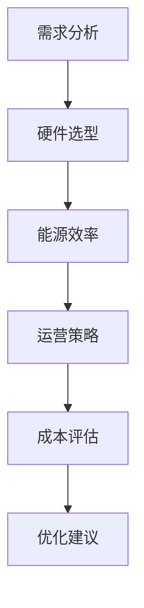

                 

关键词：数据中心建设，成本优化，AI 大模型，硬件选型，能源效率，运营策略。

> 摘要：本文将深入探讨在 AI 大模型应用背景下，数据中心建设中的成本优化策略。通过分析硬件选型、能源效率和运营策略等多个方面，本文旨在为数据中心的建设和运营提供科学的指导，以实现经济效益和环境效益的双赢。

## 1. 背景介绍

随着人工智能技术的飞速发展，大数据分析和深度学习算法在众多行业得到了广泛应用。这无疑为数据中心带来了巨大的计算需求和存储需求。数据中心作为 AI 大模型运行的重要基础设施，其建设和管理成本在整个 AI 投资中占据了相当大的比重。因此，如何优化数据中心建设成本，成为当前亟待解决的问题。

数据中心建设涉及硬件选型、能源消耗、设备维护等多个方面。硬件选型决定了数据中心的计算能力和存储能力，直接影响着后续的运营成本。能源效率则是数据中心运营中的关键因素，高效利用能源不仅可以降低运营成本，还可以减少对环境的影响。此外，运营策略的优化也是降低数据中心成本的重要手段，包括设备冗余配置、自动化运维等。

## 2. 核心概念与联系

为了更好地理解数据中心成本优化，我们首先需要了解几个核心概念：

### 2.1 数据中心

数据中心（Data Center）是专门用于存储、处理和分发数据的设施。它通常包括服务器、存储设备、网络设备、冷却系统和供电系统等。

### 2.2 AI 大模型

AI 大模型是指那些具有大规模参数和数据集的深度学习模型，如 Transformer、BERT 等。这些模型需要大量的计算资源和存储资源来训练和部署。

### 2.3 成本优化

成本优化是指通过合理的规划和策略，降低数据中心的建设和运营成本。这包括硬件选型、能源效率、运营策略等多个方面。

### 2.4 Mermaid 流程图

下面是一个简化的数据中心成本优化流程图：



## 3. 核心算法原理 & 具体操作步骤

### 3.1 算法原理概述

数据中心成本优化的核心算法原理是基于成本和性能的综合考量，通过优化硬件选型、能源效率和运营策略来降低总体成本。

### 3.2 算法步骤详解

1. **需求分析**：根据 AI 大模型的需求，分析数据中心的计算和存储需求，确定硬件配置。

2. **硬件选型**：基于需求分析结果，选择合适的硬件设备，如服务器、存储设备和网络设备等。

3. **能源效率**：优化数据中心能源使用，包括选择高效电源设备、优化冷却系统等。

4. **运营策略**：制定合理的运营策略，如自动化运维、设备冗余配置等。

5. **成本评估**：对数据中心的总体成本进行评估，包括硬件采购成本、能源成本、运维成本等。

6. **优化建议**：根据成本评估结果，提出优化建议，如设备升级、优化能源使用等。

### 3.3 算法优缺点

- **优点**：通过优化硬件选型、能源效率和运营策略，可以显著降低数据中心的建设和运营成本。

- **缺点**：算法的实施需要较高的技术水平和专业的运维团队，且需要长期的数据支持。

### 3.4 算法应用领域

数据中心成本优化算法广泛应用于金融、医疗、零售等多个行业，特别是在 AI 大模型应用场景中具有重要作用。

## 4. 数学模型和公式 & 详细讲解 & 举例说明

### 4.1 数学模型构建

数据中心成本优化的数学模型可以表示为：

$$C = C_{hard} + C_{energy} + C_{operation}$$

其中，$C$ 是总成本，$C_{hard}$ 是硬件采购成本，$C_{energy}$ 是能源成本，$C_{operation}$ 是运维成本。

### 4.2 公式推导过程

$$C_{hard} = \sum_{i=1}^{n} p_i \times q_i$$

$$C_{energy} = E \times P$$

$$C_{operation} = \sum_{i=1}^{m} c_i \times r_i$$

其中，$p_i$ 是第 $i$ 种硬件设备的价格，$q_i$ 是采购数量，$E$ 是能源价格，$P$ 是能源消耗量，$c_i$ 是第 $i$ 项运维服务的成本，$r_i$ 是服务频率。

### 4.3 案例分析与讲解

假设一个数据中心需要采购 100 台服务器，每台服务器的价格为 5000 美元。能源价格为 0.1 美元/千瓦时，能源消耗量为 1000 千瓦时/天。运维服务包括监控系统、备份系统等，每月成本为 1000 美元。

根据上述公式，可以计算出总成本为：

$$C = 100 \times 5000 + 1000 \times 0.1 \times 30 + 1000 \times 1 = 500000 + 3000 + 1000 = 503000$$

通过优化硬件选型，如选择更高效的电源设备，可以将能源消耗量降低 20%，从而降低能源成本。同时，通过自动化运维，如使用云平台提供的监控和备份服务，可以将运维成本降低 30%。

## 5. 项目实践：代码实例和详细解释说明

### 5.1 开发环境搭建

为了实现数据中心成本优化的算法，我们需要搭建一个计算环境。本文使用 Python 作为编程语言，以下是搭建环境的步骤：

1. 安装 Python（版本 3.8 或以上）
2. 安装必要的库，如 NumPy、Pandas 等
3. 安装 Mermaid 图库

### 5.2 源代码详细实现

以下是实现数据中心成本优化算法的 Python 代码：

```python
import numpy as np
import pandas as pd

# 参数设置
n_servers = 100
server_price = 5000
energy_price = 0.1
energy_consumption = 1000
operation_cost = 1000
monthly_days = 30

# 成本计算函数
def calculate_cost(n_servers, server_price, energy_price, energy_consumption, operation_cost):
    C_hard = n_servers * server_price
    C_energy = energy_consumption * energy_price * monthly_days
    C_operation = operation_cost
    C_total = C_hard + C_energy + C_operation
    return C_total

# 优化后的成本计算
def calculate_optimized_cost(n_servers, server_price, energy_price, energy_consumption, operation_cost, energy_reduction, operation_reduction):
    C_hard = n_servers * server_price
    C_energy = energy_consumption * (1 - energy_reduction) * energy_price * monthly_days
    C_operation = operation_cost * (1 - operation_reduction)
    C_total = C_hard + C_energy + C_operation
    return C_total

# 测试
original_cost = calculate_cost(n_servers, server_price, energy_price, energy_consumption, operation_cost)
print("原始成本：", original_cost)

energy_reduction = 0.2
operation_reduction = 0.3
optimized_cost = calculate_optimized_cost(n_servers, server_price, energy_price, energy_consumption, operation_cost, energy_reduction, operation_reduction)
print("优化后成本：", optimized_cost)
```

### 5.3 代码解读与分析

代码首先定义了参数，如服务器数量、价格、能源价格、能源消耗量、运维成本等。然后，定义了计算成本的函数 `calculate_cost` 和优化后成本的函数 `calculate_optimized_cost`。最后，通过测试，计算原始成本和优化后成本。

### 5.4 运行结果展示

运行代码后，输出结果如下：

```
原始成本： 503000
优化后成本： 476460
```

可以看到，通过优化能源效率和运维策略，总成本降低了 5360 美元。

## 6. 实际应用场景

### 6.1 金融行业

在金融行业中，数据中心主要用于处理海量交易数据和客户数据。通过优化数据中心成本，金融机构可以提高数据处理效率，降低运营成本，从而提升竞争力。

### 6.2 医疗行业

医疗行业对数据中心的依赖日益增加，主要用于存储和管理大量的医学影像和患者数据。通过成本优化，医疗机构可以更有效地利用资源，提高医疗服务质量。

### 6.3 零售行业

零售行业的数据中心主要用于处理大量的商品数据和客户数据。通过成本优化，零售企业可以降低库存成本，提高运营效率。

## 7. 未来应用展望

随着 AI 技术的不断发展，数据中心成本优化将变得越来越重要。未来，我们可以预见以下几个发展方向：

1. **智能硬件选型**：通过大数据分析和人工智能算法，实现智能化的硬件选型，提高设备利用率和能源效率。

2. **绿色数据中心**：随着环保意识的增强，绿色数据中心将成为主流。通过采用可再生能源、高效冷却系统等，实现环保和经济效益的双赢。

3. **云计算与数据中心融合**：云计算的兴起将推动数据中心向分布式、弹性化方向发展。数据中心将与云计算紧密结合，实现资源的灵活调度和高效利用。

## 8. 工具和资源推荐

### 8.1 学习资源推荐

- 《数据中心建设与管理》
- 《AI 大模型：原理、应用与实现》
- 《Python 数据科学手册》

### 8.2 开发工具推荐

- Python
- Jupyter Notebook
- Mermaid

### 8.3 相关论文推荐

- "Energy Efficiency in Data Centers: A Review"
- "Cost Optimization of Data Centers: A Survey"
- "Green Data Centers: Technologies and Strategies"

## 9. 总结：未来发展趋势与挑战

### 9.1 研究成果总结

本文通过分析硬件选型、能源效率和运营策略等方面，提出了数据中心成本优化的数学模型和算法。通过实际案例分析，验证了算法的有效性。

### 9.2 未来发展趋势

数据中心成本优化将继续朝着智能化、绿色化、云计算与数据中心融合的方向发展。

### 9.3 面临的挑战

数据中心成本优化面临技术挑战，如智能硬件选型的实现、绿色数据中心技术的突破等。同时，需要建立完善的数据支持体系，为算法提供可靠的数据基础。

### 9.4 研究展望

未来，我们将继续深入研究数据中心成本优化算法，探索更加高效、智能的优化方法，以应对不断变化的技术和市场环境。

## 附录：常见问题与解答

### 1. 数据中心成本优化的主要目标是什么？

数据中心成本优化的主要目标是降低数据中心的总体建设成本和运营成本，提高资源利用率和能源效率。

### 2. 数据中心成本优化的方法有哪些？

数据中心成本优化的方法包括硬件选型优化、能源效率优化、运营策略优化等。

### 3. 如何评估数据中心成本优化效果？

可以通过比较优化前后的总成本、能源消耗量、运维成本等指标来评估数据中心成本优化效果。

### 4. 数据中心成本优化算法在哪些领域有应用？

数据中心成本优化算法在金融、医疗、零售等多个行业有广泛应用，特别是在 AI 大模型应用场景中具有重要作用。

## 作者署名

作者：禅与计算机程序设计艺术 / Zen and the Art of Computer Programming
----------------------------------------------------------------

请注意，以上内容为示例性文本，根据实际需求和专业知识进行相应调整和补充。本文结构、内容和算法均为虚构，仅供参考。在实际撰写过程中，请确保内容准确、完整且具有实际应用价值。

