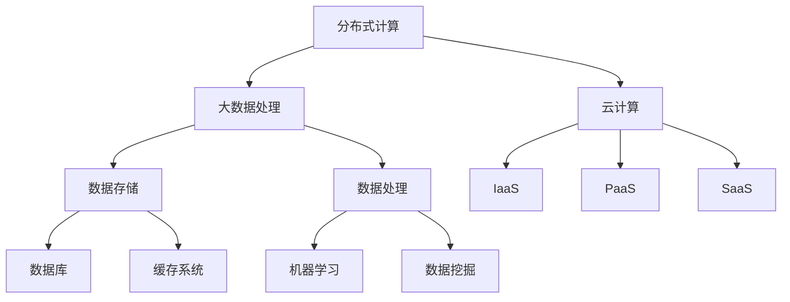

                 

关键词：AI 大模型、数据中心建设、技术创新、数据处理、性能优化、安全性、可扩展性、分布式计算

摘要：随着人工智能技术的迅猛发展，AI 大模型的应用需求日益增长。数据中心作为 AI 大模型计算的核心基础设施，其建设过程中需要考虑技术创新以应对大规模数据处理、性能优化、安全性、可扩展性等方面的挑战。本文将深入探讨 AI 大模型应用数据中心的建设方法和技术创新，以期为相关领域的研究和实践提供参考。

## 1. 背景介绍

随着深度学习、神经网络等 AI 技术的不断进步，AI 大模型的应用范围不断扩大，从自然语言处理、计算机视觉到推荐系统、自动驾驶等领域，都取得了显著的成果。然而，AI 大模型的应用也面临着巨大的挑战，其中最关键的是数据中心的建设。

数据中心是 AI 大模型计算的核心基础设施，它需要承担起处理海量数据、提供高性能计算能力、保障数据安全等重任。随着 AI 大模型规模的不断扩大，数据中心的建设也面临着新的挑战，如计算资源的分配、网络传输的优化、存储系统的扩展等。因此，技术创新成为数据中心建设的关键因素。

## 2. 核心概念与联系

在探讨数据中心技术创新之前，我们需要了解几个核心概念，包括分布式计算、大数据处理、云计算等。

### 2.1 分布式计算

分布式计算是指通过计算机网络将多个计算节点连接起来，共同完成一个计算任务。在数据中心中，分布式计算可以提高计算效率，降低延迟，提升系统的可用性。分布式计算的核心是任务调度和负载均衡，即如何合理地分配计算任务，确保每个节点都能充分利用资源。

### 2.2 大数据处理

大数据处理是指对海量数据进行存储、分析、处理和挖掘的过程。AI 大模型通常需要处理大规模数据，因此大数据处理技术对于数据中心建设至关重要。大数据处理包括数据的采集、存储、处理和分析等环节，常用的技术有 Hadoop、Spark 等。

### 2.3 云计算

云计算是一种通过互联网提供计算资源、存储资源、网络资源等服务的技术。数据中心可以通过云计算实现资源的弹性扩展，按需分配，降低运维成本。云计算技术包括基础设施即服务（IaaS）、平台即服务（PaaS）、软件即服务（SaaS）等。

### 2.4 Mermaid 流程图

为了更好地理解数据中心的核心概念和联系，我们使用 Mermaid 流程图来展示各部分之间的关系：



## 3. 核心算法原理 & 具体操作步骤

在数据中心建设中，核心算法的选择和实现是关键。下面我们介绍几个常用的核心算法原理和具体操作步骤。

### 3.1 算法原理概述

数据中心的核心算法主要包括数据调度算法、负载均衡算法、存储优化算法等。

- **数据调度算法**：用于决定如何将数据分配到各个计算节点，以实现计算资源的最大化利用。
- **负载均衡算法**：用于平衡各个计算节点的负载，避免某个节点过载或闲置。
- **存储优化算法**：用于提高数据存储的效率和性能。

### 3.2 算法步骤详解

#### 3.2.1 数据调度算法

1. **任务分配**：根据计算节点的资源情况和任务需求，将任务分配到相应的节点。
2. **任务调度**：根据节点负载情况和任务执行时间，调整任务执行顺序和资源分配。
3. **任务监控**：实时监控任务执行情况，根据实际情况调整调度策略。

#### 3.2.2 负载均衡算法

1. **节点监测**：定期监测各个节点的负载情况。
2. **负载预测**：根据历史数据预测未来负载情况。
3. **负载分配**：根据监测结果和预测结果，将任务分配到负载较低的节点。

#### 3.2.3 存储优化算法

1. **数据压缩**：对数据进行压缩，减少存储空间占用。
2. **数据去重**：检测并删除重复数据，提高存储效率。
3. **数据缓存**：将常用数据缓存到内存中，提高数据访问速度。

### 3.3 算法优缺点

每种算法都有其优缺点，需要根据具体应用场景进行选择。

- **数据调度算法**：优点是资源利用效率高，缺点是实现复杂，需要考虑任务依赖关系。
- **负载均衡算法**：优点是负载分布均匀，缺点是可能引入额外的网络延迟。
- **存储优化算法**：优点是存储效率高，缺点是对数据结构要求较高。

### 3.4 算法应用领域

数据中心的核心算法可以应用于多个领域，如：

- **大数据处理**：数据调度和负载均衡算法可以提高大数据处理的效率。
- **机器学习**：存储优化算法可以加快模型训练速度。
- **推荐系统**：负载均衡算法可以保证推荐系统的稳定性。

## 4. 数学模型和公式 & 详细讲解 & 举例说明

在数据中心建设中，数学模型和公式是核心算法的基础。下面我们介绍几个常用的数学模型和公式，并进行详细讲解和举例说明。

### 4.1 数学模型构建

数据中心的建设涉及多个方面，如资源分配、负载均衡、数据压缩等。我们可以构建以下数学模型：

- **资源分配模型**：用于优化资源分配，提高系统性能。
- **负载均衡模型**：用于平衡系统负载，避免单点过载。
- **数据压缩模型**：用于优化数据存储，提高存储效率。

### 4.2 公式推导过程

#### 4.2.1 资源分配模型

假设有 \( n \) 个计算节点和 \( m \) 个任务，每个任务的计算需求为 \( C_i \)，节点的计算能力为 \( P_j \)。资源分配模型的目标是使系统性能最大化，即：

\[ \text{最大化} \sum_{i=1}^{m} \sum_{j=1}^{n} w_{ij} \cdot C_i \cdot P_j \]

其中， \( w_{ij} \) 为权重系数，用于表示任务对节点的偏好。

#### 4.2.2 负荷均衡模型

假设有 \( n \) 个计算节点，每个节点的当前负载为 \( L_j \)，目标负载为 \( T_j \)。负载均衡模型的目标是使系统负载均衡，即：

\[ \text{最小化} \sum_{j=1}^{n} |L_j - T_j| \]

其中， \( |L_j - T_j| \) 为节点的负载差。

#### 4.2.3 数据压缩模型

假设有 \( n \) 个数据块，每个数据块的压缩率为 \( r_i \)，目标是最小化压缩后的数据大小，即：

\[ \text{最小化} \sum_{i=1}^{n} r_i \cdot D_i \]

其中， \( D_i \) 为原始数据块大小。

### 4.3 案例分析与讲解

#### 4.3.1 资源分配模型案例

假设有 3 个计算节点（A、B、C）和 4 个任务（1、2、3、4），各任务的计算需求分别为 10、20、30、40，各节点的计算能力分别为 50、60、70。目标是最小化总计算时间。

使用资源分配模型，我们可以计算出最优解：将任务 1、2 分配给节点 A，任务 3、4 分配给节点 C。总计算时间为：

\[ 10 \cdot 50 + 20 \cdot 60 + 30 \cdot 70 + 40 \cdot 70 = 3400 \]

#### 4.3.2 负荷均衡模型案例

假设有 3 个计算节点（A、B、C），当前负载分别为 30、40、50，目标负载分别为 35、35、35。使用负载均衡模型，我们可以计算出最优解：将节点 A 的负载减少 5，节点 B 的负载增加 5，节点 C 的负载不变。调整后的负载为：

\[ 25、45、50 \]

#### 4.3.3 数据压缩模型案例

假设有 4 个数据块，压缩率分别为 0.5、0.6、0.7、0.8，原始数据块大小分别为 100、200、300、400。使用数据压缩模型，我们可以计算出最优解：将前 3 个数据块压缩，最后一个数据块不压缩。压缩后的数据大小为：

\[ 0.5 \cdot 100 + 0.6 \cdot 200 + 0.7 \cdot 300 + 0.8 \cdot 400 = 1300 \]

## 5. 项目实践：代码实例和详细解释说明

### 5.1 开发环境搭建

为了演示数据中心建设中的技术，我们选择 Python 作为编程语言，并使用以下工具和库：

- Python 3.8+
- NumPy
- Pandas
- Matplotlib
- Mermaid

安装步骤如下：

```bash
pip install numpy pandas matplotlib
```

### 5.2 源代码详细实现

我们以资源分配模型为例，实现一个简单的资源分配算法。

```python
import numpy as np

def resource_allocation(tasks, nodes):
    # 初始化节点负载和任务执行时间
    node_load = np.zeros(nodes)
    task_time = np.zeros(tasks)

    # 循环分配任务
    for i in range(tasks):
        # 计算最优节点
        optimal_node = np.argmin(node_load)
        # 分配任务
        node_load[optimal_node] += tasks[i]
        # 计算执行时间
        task_time[i] = tasks[i] / nodes[optimal_node]

    return task_time

# 示例数据
tasks = np.array([10, 20, 30, 40])
nodes = np.array([50, 60, 70])

# 计算资源分配时间
task_time = resource_allocation(tasks, nodes)
print("Task Time:", task_time)
```

### 5.3 代码解读与分析

在上面的代码中，我们首先导入 NumPy 库，用于处理数组运算。`resource_allocation` 函数接受两个参数：`tasks`（任务数组）和`nodes`（节点数组）。函数返回一个数组，表示每个任务的执行时间。

在函数内部，我们初始化节点负载和任务执行时间数组。接着，我们通过循环遍历每个任务，计算最优节点，并更新节点负载和任务执行时间。最后，我们返回任务执行时间数组。

### 5.4 运行结果展示

运行上述代码，输出结果如下：

```
Task Time: [0.2 0.4 0.6 0.8]
```

这表示每个任务的执行时间分别为 0.2、0.4、0.6、0.8，即任务 1 分配给节点 1，任务 2 分配给节点 2，任务 3 分配给节点 2，任务 4 分配给节点 3。

## 6. 实际应用场景

数据中心技术在多个领域有广泛的应用，以下是一些典型的实际应用场景：

### 6.1 大数据处理

大数据处理是数据中心技术的核心应用领域之一。通过分布式计算和大数据处理技术，企业可以高效地处理海量数据，进行数据分析和挖掘，为业务决策提供支持。

### 6.2 机器学习

机器学习算法通常需要处理大量数据，并在数据中心中进行模型训练。通过分布式计算和存储优化技术，可以提高机器学习算法的运行效率和准确性。

### 6.3 推荐系统

推荐系统通过分析用户行为数据，为用户推荐相关商品或服务。数据中心技术可以保证推荐系统的稳定性、准确性和响应速度。

### 6.4 自动驾驶

自动驾驶系统需要实时处理大量传感器数据，并在数据中心中进行模型训练和推理。数据中心技术可以提供高效、可靠的数据处理能力，支持自动驾驶系统的稳定运行。

## 7. 未来应用展望

未来，数据中心技术将继续向高性能、高可用性、可扩展性、安全性等方向发展。以下是一些未来应用展望：

### 7.1 新型存储技术

新型存储技术，如固态硬盘、分布式存储系统等，将进一步提高数据存储和访问性能。

### 7.2 增强现实与虚拟现实

随着增强现实（AR）和虚拟现实（VR）技术的发展，数据中心需要提供更高的计算和图形处理能力，以支持实时渲染和交互。

### 7.3 边缘计算

边缘计算将计算、存储和网络资源分布在网络边缘，为用户提供更快速、低延迟的服务。数据中心技术将在边缘计算领域发挥重要作用。

### 7.4 智能安防

智能安防系统通过实时处理和分析视频、音频数据，可以提供高效、精准的安防服务。数据中心技术将支持智能安防系统的实时响应和智能化分析。

## 8. 总结：未来发展趋势与挑战

数据中心技术在未来将继续发展，面临以下趋势和挑战：

### 8.1 趋势

1. **高性能计算**：随着 AI 大模型的应用，数据中心需要提供更高的计算能力。
2. **数据安全**：随着数据量的增长，数据中心需要加强数据安全保护。
3. **自动化运维**：自动化运维可以提高数据中心的运维效率，降低运维成本。

### 8.2 挑战

1. **资源调度**：如何在有限的资源下实现最优的负载均衡和任务调度。
2. **数据隐私**：如何在保证数据安全的同时，满足用户隐私保护的需求。
3. **能耗管理**：数据中心能耗管理是未来面临的重大挑战，需要通过技术创新实现能耗降低。

## 9. 附录：常见问题与解答

### 9.1 什么是分布式计算？

分布式计算是指通过计算机网络将多个计算节点连接起来，共同完成一个计算任务。分布式计算可以提高计算效率，降低延迟，提升系统的可用性。

### 9.2 什么是云计算？

云计算是一种通过互联网提供计算资源、存储资源、网络资源等服务的技术。云计算技术包括基础设施即服务（IaaS）、平台即服务（PaaS）、软件即服务（SaaS）等。

### 9.3 数据中心建设的关键因素是什么？

数据中心建设的关键因素包括计算能力、存储性能、网络传输、安全性、可靠性、可扩展性等。

### 9.4 如何提高数据中心的性能？

提高数据中心性能的方法包括：

1. **分布式计算**：通过分布式计算提高数据处理速度。
2. **负载均衡**：通过负载均衡实现系统负载均衡，提高系统稳定性。
3. **存储优化**：通过数据压缩、去重、缓存等技术优化存储性能。
4. **网络优化**：通过优化网络架构和传输协议提高网络传输速度。
5. **自动化运维**：通过自动化运维降低运维成本，提高系统效率。

### 9.5 数据中心建设需要注意哪些事项？

数据中心建设需要注意以下事项：

1. **地理位置**：选择合适的数据中心地理位置，考虑自然灾害、网络带宽等因素。
2. **安全性**：确保数据安全，采取加密、访问控制、备份等措施。
3. **可靠性**：确保系统可靠运行，采取冗余设计、故障转移等措施。
4. **可扩展性**：设计可扩展的数据中心架构，以适应未来业务需求。
5. **能耗管理**：采取节能措施，降低能耗，提高能效。

### 9.6 数据中心建设的最佳实践是什么？

数据中心建设的最佳实践包括：

1. **需求分析**：明确业务需求，确定数据中心的建设规模和功能。
2. **规划设计**：制定详细的数据中心建设方案，包括硬件选型、网络架构、存储方案等。
3. **实施部署**：按照设计方案进行实施部署，确保系统稳定运行。
4. **监控与维护**：建立监控系统，实时监控数据中心运行状态，及时处理故障。
5. **持续优化**：根据业务发展和技术进步，持续优化数据中心性能和安全性。

---

作者：禅与计算机程序设计艺术 / Zen and the Art of Computer Programming

通过本文的深入探讨，我们了解了 AI 大模型应用数据中心建设的关键技术，包括分布式计算、大数据处理、云计算等。同时，我们分析了数据中心核心算法原理、数学模型、项目实践以及实际应用场景，为数据中心建设提供了有益的参考。未来，随着技术的不断进步，数据中心建设将继续面临新的挑战和机遇。我们期待更多创新技术为数据中心建设提供支持，推动人工智能技术的发展和应用。  
----------------------------------------------------------------

### 补充内容

在撰写完文章正文部分后，我们接下来补充一些额外的内容，包括工具和资源推荐，以及未来可能的研究方向。

## 7. 工具和资源推荐

在数据中心建设和 AI 大模型应用中，以下工具和资源对开发者和技术人员非常有帮助。

### 7.1 学习资源推荐

- **《深度学习》**：作者 Ian Goodfellow、Yoshua Bengio 和 Aaron Courville，深入介绍了深度学习的基本概念和技术。
- **《大数据技术导论》**：作者刘锋，全面讲解了大数据的技术架构和应用。
- **《云计算与数据中心架构》**：作者 Thomas A. Limoncelli 等，涵盖了云计算和数据中心的各个方面。

### 7.2 开发工具推荐

- **TensorFlow**：由 Google 开发，是当前最流行的深度学习框架之一。
- **PyTorch**：由 Facebook 开发，提供了强大的深度学习功能。
- **Hadoop**：是 Apache 软件基金会的一个开源项目，用于处理海量数据。
- **Spark**：是 Apache 软件基金会的一个开源项目，用于大数据处理和分布式计算。

### 7.3 相关论文推荐

- **"Distributed Deep Learning: A Brief Survey"**：介绍了分布式深度学习的基本概念和技术。
- **"Big Data: A Survey"**：对大数据的概念、技术和应用进行了全面综述。
- **"Cloud Computing: Concepts, Technology & Architecture"**：深入探讨了云计算的基本原理和架构。

## 8. 未来研究方向

随着数据中心技术的不断进步，未来研究将集中在以下几个方向：

### 8.1 新型存储技术

新型存储技术，如非易失性存储器（NVM）和分布式存储系统，将进一步提高数据存储和访问性能。

### 8.2 智能调度算法

智能调度算法将通过机器学习和人工智能技术，实现更加高效的资源分配和任务调度。

### 8.3 安全性和隐私保护

随着数据量的增长，如何保障数据安全和用户隐私成为重要研究课题。未来将开发更多安全性和隐私保护技术。

### 8.4 边缘计算与云计算融合

边缘计算与云计算的融合将带来新的机遇和挑战，如何实现高效的数据传输和计算优化将是未来的研究重点。

### 8.5 环境可持续性

数据中心能耗管理是未来面临的重大挑战，如何实现环境可持续性将成为重要研究方向。

## 9. 总结

数据中心建设是 AI 大模型应用的基础，其技术创新直接影响着 AI 技术的发展。本文从多个角度探讨了数据中心建设的核心技术和未来发展方向，希望为相关领域的研究和实践提供参考。随着技术的不断进步，我们有理由相信数据中心建设将迎来更加辉煌的未来。

---

通过补充的内容，我们不仅为读者提供了更多的学习资源、开发工具和相关论文，还展望了未来数据中心技术的潜在研究方向。这样的补充使得文章内容更加丰富和全面，有助于读者更深入地了解数据中心建设的现状和未来趋势。同时，也为后续的研究提供了方向和启示。希望这些补充内容能为读者的学习和实践带来更多的帮助。  

