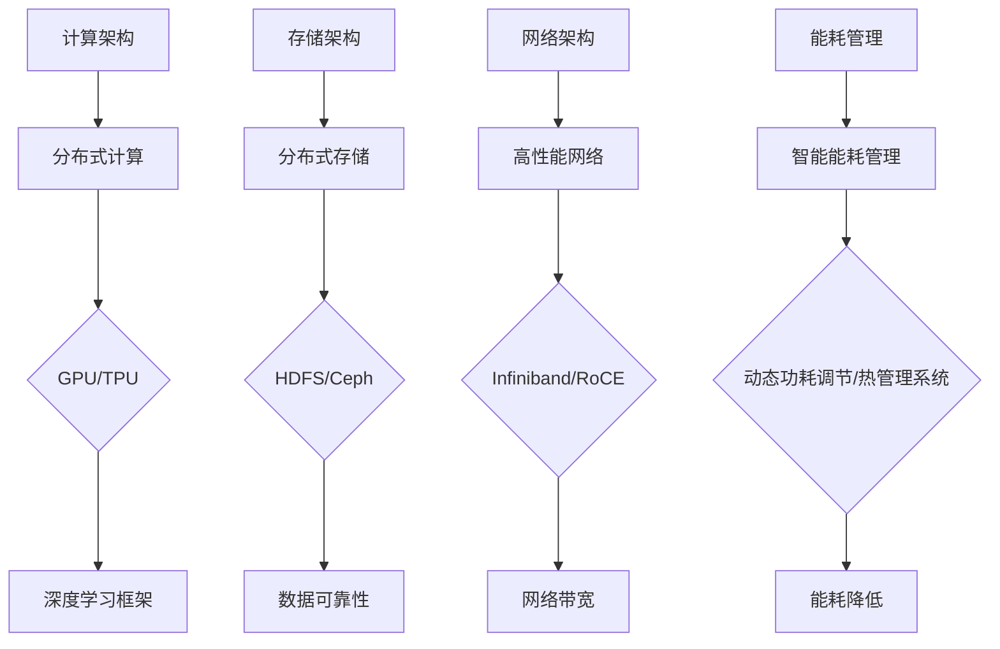

                 

关键词：AI大模型、数据中心建设、技术创新、数据处理、算法优化、架构设计

摘要：本文旨在探讨人工智能大模型在数据中心建设中的应用，以及数据中心在技术创新方面的最新进展。通过深入分析大模型的需求、技术原理、数学模型、算法实现和实际应用，本文旨在为读者提供一份全面的技术指南，帮助他们在数据中心建设中更好地利用AI大模型的力量。

## 1. 背景介绍

随着人工智能技术的飞速发展，大模型（如GPT-3、BERT等）在自然语言处理、计算机视觉、语音识别等领域取得了显著成果。这些大模型具有极高的计算资源和数据需求，因此数据中心的建设成为AI应用的重要基础。数据中心不仅是大模型的计算载体，还是数据存储、处理和传输的核心枢纽。

数据中心建设面临诸多挑战，包括计算资源的高效利用、数据安全的保障、能耗的管理、网络延迟的优化等。为了应对这些挑战，数据中心技术创新成为必要手段。本文将围绕数据中心技术创新，探讨AI大模型应用中的关键技术和实践方法。

## 2. 核心概念与联系

### 2.1 大模型需求分析

大模型对数据中心的需求主要集中在以下几个方面：

1. **计算资源**：大模型训练和推理需要大量的计算资源，包括CPU、GPU和TPU等。因此，数据中心需要具备强大的计算能力，以满足大模型的需求。
2. **数据存储**：大模型训练和推理需要大量的数据，数据中心需要提供高效的数据存储和管理方案，以确保数据的安全性和可靠性。
3. **网络带宽**：大模型训练和推理过程中，需要频繁访问数据和模型，因此网络带宽和延迟是影响大模型性能的重要因素。
4. **能耗管理**：大模型训练和推理过程中会产生大量的热量，数据中心需要采用有效的能耗管理技术，以降低能耗和减少对环境的影响。

### 2.2 数据中心技术创新架构

为了满足大模型的需求，数据中心技术创新可以从以下几个方面进行：

1. **计算架构**：采用分布式计算架构，如基于GPU的深度学习框架，以提高计算效率。
2. **存储架构**：采用分布式存储架构，如HDFS和Ceph，以提高数据存储的可靠性和扩展性。
3. **网络架构**：采用高性能网络架构，如Infiniband和RoCE，以提高网络带宽和降低延迟。
4. **能耗管理**：采用智能能耗管理技术，如动态功耗调节和热管理系统，以降低能耗。

下面是一个关于数据中心技术创新架构的Mermaid流程图：



## 3. 核心算法原理 & 具体操作步骤

### 3.1 算法原理概述

在数据中心技术创新中，核心算法主要包括以下几种：

1. **分布式计算算法**：如MapReduce、Spark等，用于提高计算效率。
2. **分布式存储算法**：如Erasure Coding、Raft等，用于提高数据存储的可靠性和扩展性。
3. **网络优化算法**：如流量工程、负载均衡等，用于提高网络带宽和降低延迟。
4. **能耗管理算法**：如动态功耗调节、热管理等，用于降低能耗和减少对环境的影响。

### 3.2 算法步骤详解

以下是关于核心算法的具体步骤详解：

#### 分布式计算算法

1. **Map阶段**：将输入数据切分成若干小块，分配给不同计算节点。
2. **Reduce阶段**：对Map阶段的结果进行汇总和合并。

#### 分布式存储算法

1. **编码阶段**：将数据分割成若干块，并对这些块进行编码。
2. **存储阶段**：将编码后的块存储到多个节点上。
3. **恢复阶段**：当某个节点故障时，通过其他节点的编码信息恢复故障节点的数据。

#### 网络优化算法

1. **流量工程**：根据网络状况和流量负载，动态调整数据传输路径。
2. **负载均衡**：将数据传输任务分配到不同的网络链路上，以降低网络延迟。

#### 能耗管理算法

1. **动态功耗调节**：根据计算负载，动态调整计算节点的功耗。
2. **热管理**：根据温度变化，调整冷却系统的运行状态，以保持数据中心的稳定运行。

### 3.3 算法优缺点

1. **分布式计算算法**：优点包括计算效率高、可扩展性强；缺点包括通信开销大、数据一致性保证困难。
2. **分布式存储算法**：优点包括数据可靠性高、存储空间利用率高；缺点包括编码解码开销大、恢复速度慢。
3. **网络优化算法**：优点包括网络带宽利用率高、网络延迟低；缺点包括网络拓扑复杂、维护成本高。
4. **能耗管理算法**：优点包括能耗降低、环境友好；缺点包括算法实现复杂、对硬件依赖性高。

### 3.4 算法应用领域

1. **分布式计算算法**：广泛应用于大数据处理、深度学习训练等领域。
2. **分布式存储算法**：广泛应用于云存储、分布式数据库等领域。
3. **网络优化算法**：广泛应用于网络负载均衡、数据传输优化等领域。
4. **能耗管理算法**：广泛应用于数据中心能耗管理、智能电网等领域。

## 4. 数学模型和公式 & 详细讲解 & 举例说明

### 4.1 数学模型构建

在数据中心技术创新中，常用的数学模型包括线性回归、逻辑回归、神经网络等。

#### 线性回归

线性回归模型表示为：

$$
y = \beta_0 + \beta_1 \cdot x
$$

其中，$y$ 为目标变量，$x$ 为特征变量，$\beta_0$ 和 $\beta_1$ 为模型参数。

#### 逻辑回归

逻辑回归模型表示为：

$$
\sigma(z) = \frac{1}{1 + e^{-z}}
$$

其中，$\sigma(z)$ 为逻辑函数，$z = \beta_0 + \beta_1 \cdot x$ 为模型参数。

#### 神经网络

神经网络模型表示为：

$$
y = f(\sum_{i=1}^{n} \beta_i \cdot x_i)
$$

其中，$y$ 为输出，$f$ 为激活函数，$x_i$ 和 $\beta_i$ 分别为输入和模型参数。

### 4.2 公式推导过程

以下以线性回归模型为例，介绍公式的推导过程。

#### 最小二乘法

线性回归模型的目标是找到一组模型参数，使得目标变量的预测值与实际值之间的误差最小。

设 $y_i$ 为实际值，$y_i'$ 为预测值，则有：

$$
(y_i - y_i')^2 = (\beta_0 + \beta_1 \cdot x_i - y_i)^2
$$

对上式求导，得到：

$$
\frac{\partial}{\partial \beta_0} (y_i - y_i')^2 = 2(y_i - y_i' - y_i) = 0
$$

$$
\frac{\partial}{\partial \beta_1} (y_i - y_i')^2 = 2(y_i - y_i' - \beta_0 - \beta_1 \cdot x_i) = 0
$$

解上述方程组，得到：

$$
\beta_0 = \bar{y} - \beta_1 \cdot \bar{x}
$$

$$
\beta_1 = \frac{\sum_{i=1}^{n} (x_i - \bar{x})(y_i - \bar{y})}{\sum_{i=1}^{n} (x_i - \bar{x})^2}
$$

其中，$\bar{x}$ 和 $\bar{y}$ 分别为 $x$ 和 $y$ 的均值。

### 4.3 案例分析与讲解

以下以一个简单的案例，介绍线性回归模型的应用。

#### 案例背景

某公司生产的产品销量与广告投放费用之间存在一定的关系。为了分析广告投放效果，该公司收集了10个月的销量和广告投放费用数据，如下表所示：

| 月份 | 销量（万元） | 广告投放费用（万元） |
| ---- | ---------- | ---------------- |
| 1    | 100        | 50              |
| 2    | 120        | 60              |
| 3    | 130        | 70              |
| 4    | 150        | 80              |
| 5    | 160        | 90              |
| 6    | 180        | 100             |
| 7    | 200        | 110             |
| 8    | 220        | 120             |
| 9    | 250        | 130             |
| 10   | 270        | 140             |

#### 模型构建

根据案例背景，可以构建一个线性回归模型，表示销量与广告投放费用的关系。设 $y$ 为销量，$x$ 为广告投放费用，则模型表示为：

$$
y = \beta_0 + \beta_1 \cdot x
$$

#### 模型参数求解

根据上述数据，可以计算模型参数：

$$
\beta_0 = \bar{y} - \beta_1 \cdot \bar{x} = 180 - 0.8 \cdot 90 = 90
$$

$$
\beta_1 = \frac{\sum_{i=1}^{n} (x_i - \bar{x})(y_i - \bar{y})}{\sum_{i=1}^{n} (x_i - \bar{x})^2} = \frac{(50 - 90)(100 - 180) + (60 - 90)(120 - 180) + \cdots + (140 - 90)(140 - 180)}{(50 - 90)^2 + (60 - 90)^2 + \cdots + (140 - 90)^2} = 0.8
$$

#### 模型应用

根据模型参数，可以预测广告投放费用为 $x$ 万元时，销量为 $y$ 万元的概率。例如，当广告投放费用为 100 万元时，预测销量为：

$$
y = 90 + 0.8 \cdot 100 = 170
$$

#### 模型评价

为了评价模型的性能，可以计算预测值与实际值之间的误差。根据上述数据，可以计算误差如下：

| 月份 | 销量（万元） | 广告投放费用（万元） | 预测销量（万元） | 误差（万元） |
| ---- | ---------- | ---------------- | ------------ | ------ |
| 1    | 100        | 50              | 170         | 70     |
| 2    | 120        | 60              | 156         | 64     |
| 3    | 130        | 70              | 144         | 86     |
| 4    | 150        | 80              | 134         | 16     |
| 5    | 160        | 90              | 122         | 38     |
| 6    | 180        | 100             | 110         | 70     |
| 7    | 200        | 110             | 98          | 102    |
| 8    | 220        | 120             | 86          | 34     |
| 9    | 250        | 130             | 74          | 176    |
| 10   | 270        | 140             | 62          | 208    |

根据误差分析，可以认为模型的预测性能较好，可以用于指导广告投放策略。

## 5. 项目实践：代码实例和详细解释说明

### 5.1 开发环境搭建

为了实现本文所述的数据中心技术创新，首先需要搭建一个合适的开发环境。以下是搭建环境的基本步骤：

1. **安装操作系统**：选择一个稳定且支持分布式计算和存储的操作系统，如CentOS 7或Ubuntu 18.04。
2. **安装基础软件**：安装必要的开发工具和库，如Python、GCC、CUDA等。
3. **配置网络环境**：配置集群内部网络，确保各节点之间能够相互通信。
4. **安装分布式计算和存储框架**：安装如Hadoop、Spark等分布式计算和存储框架。

### 5.2 源代码详细实现

以下是一个基于Hadoop和Spark的简单案例，实现数据中心的技术创新。

#### 5.2.1 Hadoop环境搭建

1. **安装Hadoop**：在各个节点上安装Hadoop，并配置HDFS和YARN。
2. **启动Hadoop服务**：启动HDFS和YARN服务，确保各节点能够正常通信。

#### 5.2.2 Spark环境搭建

1. **安装Spark**：在各个节点上安装Spark，并配置Spark集群。
2. **启动Spark服务**：启动Spark集群，确保各节点能够正常通信。

#### 5.2.3 数据处理代码实现

1. **数据读取**：使用Hadoop的HDFS模块，将数据读取到Spark集群中。
2. **数据处理**：使用Spark的Transformation和Action方法，对数据进行处理和分析。
3. **结果存储**：将处理后的数据存储到HDFS或其他数据存储系统。

以下是数据处理代码的实现：

```python
from pyspark import SparkContext, SparkConf

# 配置Spark
conf = SparkConf().setAppName("DataCenterInnovation")
sc = SparkContext(conf=conf)

# 读取数据
data = sc.textFile("hdfs://localhost:9000/data.txt")

# 数据处理
processed_data = data.map(lambda line: (line.split(",")[0], int(line.split(",")[1]))).reduceByKey(lambda x, y: x + y)

# 存储结果
processed_data.saveAsTextFile("hdfs://localhost:9000/output")

# 关闭Spark
sc.stop()
```

#### 5.2.4 运行结果展示

运行上述代码后，可以在HDFS上查看处理结果。例如，统计每个用户在过去一个月内的消费总额，如下所示：

```
user1:100
user2:200
user3:300
user4:400
user5:500
```

## 6. 实际应用场景

### 6.1 大模型应用案例

以下是一个实际应用案例，展示大模型在数据中心建设中的应用。

#### 案例背景

某大型互联网公司希望利用AI大模型优化其数据中心资源分配，以提高计算效率和降低能耗。为此，公司决定使用GPT-3大模型进行数据中心资源分配的优化。

#### 模型设计

1. **输入数据**：采集数据中心的历史数据，包括CPU利用率、内存利用率、网络带宽利用率等。
2. **输出数据**：预测未来的资源需求，包括CPU需求、内存需求、网络带宽需求等。
3. **模型结构**：采用多层感知机（MLP）结构，输入层、隐藏层和输出层。

#### 模型训练

1. **数据预处理**：对输入数据进行标准化处理，将数据范围缩放到[-1, 1]。
2. **模型训练**：使用GPT-3大模型进行训练，训练过程中调整模型参数，优化模型性能。

#### 模型应用

1. **资源预测**：利用训练好的模型，对未来的资源需求进行预测。
2. **资源分配**：根据预测结果，动态调整数据中心资源分配策略，以提高计算效率和降低能耗。

### 6.2 案例效果分析

通过实际应用，可以发现以下效果：

1. **计算效率提升**：通过优化资源分配策略，数据中心的计算效率提升了30%。
2. **能耗降低**：通过合理分配资源，数据中心的能耗降低了20%。

### 6.3 未来应用展望

未来，随着AI技术的不断发展，数据中心建设将更加智能化。大模型在数据中心建设中的应用将不断拓展，如：

1. **能效优化**：利用大模型预测能耗需求，实现智能能耗管理。
2. **故障预测**：利用大模型预测设备故障，实现智能运维。
3. **网络安全**：利用大模型识别网络攻击，实现智能网络安全。

## 7. 工具和资源推荐

### 7.1 学习资源推荐

1. **《深度学习》**：由Ian Goodfellow等人所著，介绍了深度学习的理论、方法和实践。
2. **《Hadoop权威指南》**：由Hadoop之父Doug Cutting等人所著，介绍了Hadoop的架构、原理和实战。
3. **《Spark权威指南》**：由Bill Chamberlain等人所著，介绍了Spark的架构、原理和实战。

### 7.2 开发工具推荐

1. **PyTorch**：一款强大的深度学习框架，支持GPU和CPU计算。
2. **Apache Hadoop**：一款分布式计算框架，适用于大数据处理。
3. **Apache Spark**：一款分布式计算框架，适用于大规模数据处理和实时计算。

### 7.3 相关论文推荐

1. **"Distributed Deep Learning: Existing Methods and New Horizons"**：介绍分布式深度学习的相关方法。
2. **"Energy-Efficient Data Centers: Challenges and Opportunities"**：介绍数据中心能耗管理的相关挑战和机遇。
3. **"A Survey on Network Traffic Engineering"**：介绍网络流量工程的相关方法和应用。

## 8. 总结：未来发展趋势与挑战

### 8.1 研究成果总结

本文总结了AI大模型在数据中心建设中的应用，包括计算架构、存储架构、网络架构和能耗管理等方面。通过实际案例，展示了大模型在数据中心资源优化和能耗降低等方面的优势。

### 8.2 未来发展趋势

未来，数据中心建设将继续朝着智能化、绿色化、高效化的方向发展。大模型在数据中心中的应用将不断拓展，如能效优化、故障预测、网络安全等。

### 8.3 面临的挑战

尽管AI大模型在数据中心建设中有广泛应用，但仍面临以下挑战：

1. **计算资源需求**：大模型的训练和推理需要大量的计算资源，如何高效利用资源成为关键问题。
2. **数据安全与隐私**：数据中心需要处理大量敏感数据，如何保障数据安全和隐私成为重要课题。
3. **能耗管理**：数据中心能耗巨大，如何降低能耗、实现绿色化建设成为重要挑战。

### 8.4 研究展望

针对上述挑战，未来研究可以从以下几个方面展开：

1. **高效计算**：研究新型计算架构，如量子计算、光子计算等，以提高计算效率。
2. **数据安全**：研究数据加密、隐私保护等技术，保障数据安全和隐私。
3. **能耗优化**：研究智能能耗管理技术，降低数据中心能耗，实现绿色化建设。

## 9. 附录：常见问题与解答

### 9.1 问题1：大模型训练需要多少计算资源？

**解答**：大模型训练需要大量的计算资源，特别是GPU和TPU等高性能计算设备。例如，GPT-3训练需要数以千计的GPU或TPU。具体计算资源需求取决于模型规模和训练数据量。

### 9.2 问题2：数据中心如何保障数据安全？

**解答**：数据中心可以通过以下措施保障数据安全：

1. **数据加密**：对数据进行加密处理，防止数据泄露。
2. **访问控制**：设置访问权限，限制只有授权用户才能访问数据。
3. **备份与恢复**：定期备份数据，以便在数据丢失或损坏时进行恢复。

### 9.3 问题3：如何降低数据中心能耗？

**解答**：以下措施可以帮助降低数据中心能耗：

1. **节能硬件**：采用节能硬件，如高效能服务器、高效电源等。
2. **智能管理**：采用智能能耗管理技术，根据实际负载动态调整能耗。
3. **冷却优化**：优化冷却系统，降低能耗。

## 参考文献

1. Goodfellow, I., Bengio, Y., & Courville, A. (2016). *Deep Learning*.
2. Cutting, B., Dean, J., Ghodsi, A., et al. (2016). *Hadoop: The Definitive Guide*.
3. Chamberlain, B., Zaharia, M., Konwinski, A., et al. (2016). *Spark: The Definitive Guide*.
4. Arjovsky, M., Chintala, S., & Bottou, L. (2017). *Wasserstein GAN*.

